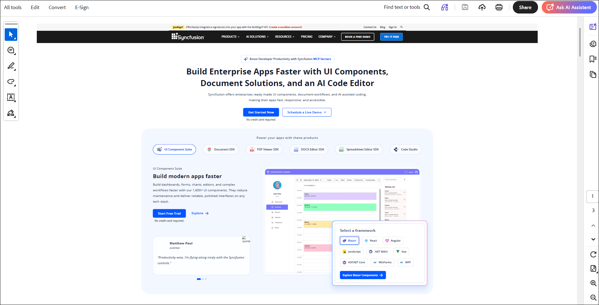

# Convert HTML to PDF using a Console Application

The Syncfusion<sup>&reg;</sup> [HTML to PDF converter](https://www.syncfusion.com/document-sdk/net-pdf-library/html-to-pdf) is a .NET library for converting webpages, SVG, MHTML, and HTML to PDF using C#. Using this library, HTML can be converted into a PDF document through a console application.

## Steps to convert HTML to PDF using a Console App





**Prerequisites:**

* Visual Studio 2022.
* Install [.NET 8 SDK](https://dotnet.microsoft.com/en-us/download/dotnet/8.0) or later.

Step 1: Create a new .NET Core console application project.


Step 2:  In configuration windows, name your project and select Next.


Step 3:  Install [Syncfusion.HtmlToPdfConverter.Net.Windows](https://www.nuget.org/packages/Syncfusion.HtmlToPdfConverter.Net.Windows) NuGet package as reference to your .NET Standard applications from [NuGet.org](https://www.nuget.org/).   


N> Starting with v16.2.0.x, if you reference Syncfusion<sup>&reg;</sup> assemblies from trial setup or from the NuGet feed, you also have to add "Syncfusion.Licensing" assembly reference and include a license key in your projects. Please refer to this [link](https://help.syncfusion.com/common/essential-studio/licensing/overview) to know about registering Syncfusion<sup>&reg;</sup> license key in your application to use our components.

Step 4: Include the following namespaces in the *Program.cs*.




using Syncfusion.Pdf;
using Syncfusion.HtmlConverter;




Step 5: Include the following code sample in *Program.cs* to convert HTML to PDF document using [Convert](https://help.syncfusion.com/cr/document-processing/Syncfusion.HtmlConverter.HtmlToPdfConverter.html#Syncfusion_HtmlConverter_HtmlToPdfConverter_Convert_System_String_) method in [HtmlToPdfConverter](https://help.syncfusion.com/cr/document-processing/Syncfusion.HtmlConverter.HtmlToPdfConverter.html) class. The HTML content will be scaled based on the given [ViewPortSize](https://help.syncfusion.com/cr/document-processing/Syncfusion.HtmlConverter.BlinkConverterSettings.html#Syncfusion_HtmlConverter_BlinkConverterSettings_ViewPortSize) property of [BlinkConverterSettings](https://help.syncfusion.com/cr/document-processing/Syncfusion.HtmlConverter.BlinkConverterSettings.html) class.




//Initialize HTML to PDF converter.
HtmlToPdfConverter htmlConverter = new HtmlToPdfConverter();
BlinkConverterSettings blinkConverterSettings = new BlinkConverterSettings();
//Set Blink viewport size.
blinkConverterSettings.ViewPortSize = new Syncfusion.Drawing.Size(1280, 0);
//Assign Blink converter settings to HTML converter.
htmlConverter.ConverterSettings = blinkConverterSettings;
//Convert URL to PDF document.
using(PdfDocument document = htmlConverter.Convert("https://www.syncfusion.com"))
{
    //Save the document. 
    document.Save(stream);
}




Step 6: Build the project.

Click the **Build** button in the toolbar or press <kbd>Ctrl</kbd>+<kbd>Shift</kbd>+<kbd>B</kbd> to build the project.

Step 7: Run the project.

Click the **Run** button (green arrow) in the toolbar or press <kbd>F5</kbd> to run the app.





**Prerequisites**:

* Install .NET SDK: Ensure that you have the .NET SDK installed on your system. You can download it from the [.NET Downloads page](https://dotnet.microsoft.com/en-us/download).
* Install Visual Studio Code: Download and install Visual Studio Code from the [official website](https://code.visualstudio.com/download).
* Install C# Extension for VS Code: Open Visual Studio Code, go to the Extensions view (Ctrl+Shift+X), and search for 'C#'. Install the official [C# extension provided by Microsoft](https://marketplace.visualstudio.com/items?itemName=ms-dotnettools.csharp).

Step 1: Open the terminal (Ctrl+` ) and run the following command to create a new Console Application project.

```
dotnet new console -n CreatePdfConsole
```
Step 2: Replace **CreatePdfConsole** with your desired project name.

Step 3: Navigate to the project directory using the following command

```
cd CreatePdfConsole
```
Step 4: Use the following command in the terminal to add the [Syncfusion.HtmlToPdfConverter.Net.Windows](https://www.nuget.org/packages/Syncfusion.HtmlToPdfConverter.Net.Windows) package to your project.

```
dotnet add package Syncfusion.HtmlToPdfConverter.Net.Windows
```
N> Starting with v16.2.0.x, if you reference Syncfusion<sup>&reg;</sup> assemblies from trial setup or from the NuGet feed, you also have to add "Syncfusion.Licensing" assembly reference and include a license key in your projects. Please refer to this [link](https://help.syncfusion.com/common/essential-studio/licensing/overview) to know about registering Syncfusion<sup>&reg;</sup> license key in your application to use our components.

Step 5: Include the following namespaces in the *Program.cs*.




using Syncfusion.Pdf;
using Syncfusion.HtmlConverter;




Step 6: Include the following code sample in *Program.cs* to convert HTML to PDF document using [Convert](https://help.syncfusion.com/cr/document-processing/Syncfusion.HtmlConverter.HtmlToPdfConverter.html#Syncfusion_HtmlConverter_HtmlToPdfConverter_Convert_System_String_) method in [HtmlToPdfConverter](https://help.syncfusion.com/cr/document-processing/Syncfusion.HtmlConverter.HtmlToPdfConverter.html) class. The HTML content will be scaled based on the given [ViewPortSize](https://help.syncfusion.com/cr/document-processing/Syncfusion.HtmlConverter.BlinkConverterSettings.html#Syncfusion_HtmlConverter_BlinkConverterSettings_ViewPortSize) property of [BlinkConverterSettings](https://help.syncfusion.com/cr/document-processing/Syncfusion.HtmlConverter.BlinkConverterSettings.html) class.




//Initialize HTML to PDF converter.
HtmlToPdfConverter htmlConverter = new HtmlToPdfConverter();
BlinkConverterSettings blinkConverterSettings = new BlinkConverterSettings();
//Set Blink viewport size.
blinkConverterSettings.ViewPortSize = new Syncfusion.Drawing.Size(1280, 0);
//Assign Blink converter settings to HTML converter.
htmlConverter.ConverterSettings = blinkConverterSettings;
//Convert URL to PDF document.
using(PdfDocument document = htmlConverter.Convert("https://www.syncfusion.com"))
{
    //Save the document. 
    document.Save(stream);
}




Step 7: Build the project.

Run the following command in terminal to build the project.

```
dotnet build
```

Step 8: Run the project.

Run the following command in terminal to build the project.

```
dotnet run
```




**Prerequisites:**

* JetBrains Rider.
* Install .NET 8 SDK or later.

Step 1. Open JetBrains Rider and create a new .NET Core console application project.
* Launch JetBrains Rider.
* Click new solution on the welcome screen.


* In the new Solution dialog, select Project Type as Console.
* Enter a project name and specify the location.
* Select the target framework (e.g., .NET 8.0, .NET 9.0 or .NET 10.0).
* Click create.


Step 2: Install the NuGet package from [NuGet.org](https://www.nuget.org/).
* Click the NuGet icon in the Rider toolbar and type [Syncfusion.HtmlToPdfConverter.Net.Windows](https://www.nuget.org/packages/Syncfusion.HtmlToPdfConverter.Net.Windows) in the search bar.
* Ensure that "nuget.org" is selected as the package source.
* Select the latest Syncfusion.HtmlToPdfConverter.Net.Windows NuGet package from the list.
* Click the + (Add) button to add the package.


N> Starting with v16.2.0.x, if you reference Syncfusion<sup>&reg;</sup> assemblies from trial setup or from the NuGet feed, you also have to add "Syncfusion.Licensing" assembly reference and include a license key in your projects. Please refer to this [link](https://help.syncfusion.com/common/essential-studio/licensing/overview) to know about registering Syncfusion<sup>&reg;</sup> license key in your application to use our components.

Step 3: Include the following namespaces in the *Program.cs*.




using Syncfusion.Pdf;
using Syncfusion.HtmlConverter;




Step 4: Include the following code sample in *Program.cs* to convert HTML to PDF document using [Convert](https://help.syncfusion.com/cr/document-processing/Syncfusion.HtmlConverter.HtmlToPdfConverter.html#Syncfusion_HtmlConverter_HtmlToPdfConverter_Convert_System_String_) method in [HtmlToPdfConverter](https://help.syncfusion.com/cr/document-processing/Syncfusion.HtmlConverter.HtmlToPdfConverter.html) class. The HTML content will be scaled based on the given [ViewPortSize](https://help.syncfusion.com/cr/document-processing/Syncfusion.HtmlConverter.BlinkConverterSettings.html#Syncfusion_HtmlConverter_BlinkConverterSettings_ViewPortSize) property of [BlinkConverterSettings](https://help.syncfusion.com/cr/document-processing/Syncfusion.HtmlConverter.BlinkConverterSettings.html) class.




//Initialize HTML to PDF converter.
HtmlToPdfConverter htmlConverter = new HtmlToPdfConverter();
BlinkConverterSettings blinkConverterSettings = new BlinkConverterSettings();
//Set Blink viewport size.
blinkConverterSettings.ViewPortSize = new Syncfusion.Drawing.Size(1280, 0);
//Assign Blink converter settings to HTML converter.
htmlConverter.ConverterSettings = blinkConverterSettings;
//Convert URL to PDF document.
using(PdfDocument document = htmlConverter.Convert("https://www.syncfusion.com"))
{
    //Save the document. 
    document.Save(stream);
}




Step 5: Build the project.

Click the **Build** button in the toolbar or press <kbd>Ctrl</kbd>+<kbd>Shift</kbd>+<kbd>B</kbd> to build the project.

Step 6: Run the project.

Click the **Run** button (green arrow) in the toolbar or press <kbd>F5</kbd> to run the app.


 


By executing the program, you will get the PDF document as follows.

 
A complete working sample can be downloaded from [GitHub](https://github.com/SyncfusionExamples/html-to-pdf-csharp-examples/tree/master/Console).

Click [here](https://www.syncfusion.com/document-sdk/net-pdf-library/html-to-pdf) to explore the rich set of Syncfusion® HTML to PDF converter library features.