# Convert HTML to PDF file in AWS Elastic Beanstalk

The [HTML to PDF converter](https://www.syncfusion.com/document-sdk/net-pdf-library/html-to-pdf) is a .NET library for converting webpages, SVG, MHTML, and HTML to PDF documents using C#. Using this library, you can convert HTML to PDF documents using Blink in AWS Elastic Beanstalk.

## Prerequisites

**Version Compatibility**

The **Syncfusion.HtmlToPdfConverter.Net.Aws** NuGet package uses the Blink rendering engine for HTML to PDF conversion. This library is compatible with **.NET 8.0 and later** versions. AWS Elastic Beanstalk uses a Linux environment, and Blink is fully supported on AWS Elastic Beanstalk.

**Supported Inputs**

The HTML to PDF converter supports the following input types:

- HTML String: Direct HTML content.
- URL: Web pages and online HTML content.
- HTML Files: Local HTML files.
- MHTML Files: Web archive (.mhtml/.mht) content.
- Authenticated Web Pages: Pages that require cookies, form authentication, or HTTP authentication.
- HTTP GET/POST Requests: HTML content accessed through GET or POST methods

**Required Software**

- .NET 8 SDK or later
- AWS Account: Active AWS account with Elastic Beanstalk access
- AWS Toolkit: AWS Toolkit for Visual Studio extension installed

**Register the license key**

N> Starting with v16.2.0.x, if you reference Syncfusion<sup>&reg;</sup> assemblies from trial setup or from the NuGet feed, you must add the "Syncfusion.Licensing" assembly reference and register a license key in your application. Please refer to this [link](https://help.syncfusion.com/common/essential-studio/licensing/overview) for details on registering a Syncfusion<sup>&reg;</sup> license key.

Include a license key in your **HomeController.cs** file before creating an **HtmlToPdfConverter** instance. Refer to the [Syncfusion License](https://help.syncfusion.com/common/essential-studio/licensing/overview) documentation to learn about registering the Syncfusion license key in your application.




using Syncfusion.Licensing;

namespace BlinkHtmlConversion.Controllers
{
    public class HomeController : Controller
    {
        public HomeController()
        {
            // Register the Syncfusion license
            SyncfusionLicenseProvider.RegisterLicense("YOUR LICENSE KEY");
        }
    }
}




N> Starting from **version 29.2.4**, it is no longer necessary to manually add the following command-line arguments when using the Blink rendering engine:
N> ```csharp
N> settings.CommandLineArguments.Add("--no-sandbox");
N> settings.CommandLineArguments.Add("--disable-setuid-sandbox");
N> ```
N> These arguments are only required when using **older versions** of the library that depend on Blink in sandbox-restricted environments.

## Steps to convert HTML to PDF using Blink in AWS Elastic Beanstalk

Step 1: Create a new C# ASP.NET Core Web Application project:


Step 2: In the configuration window, name your project and select **Next**:
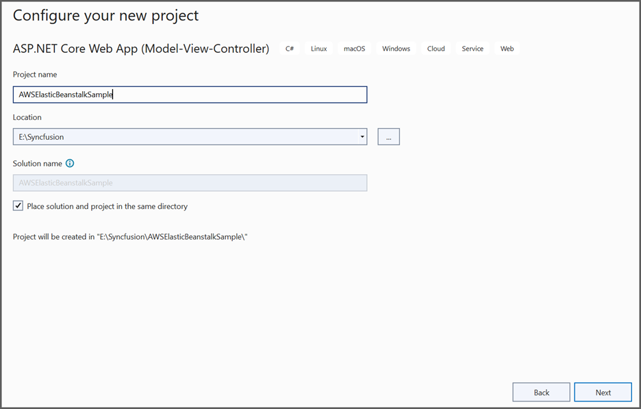

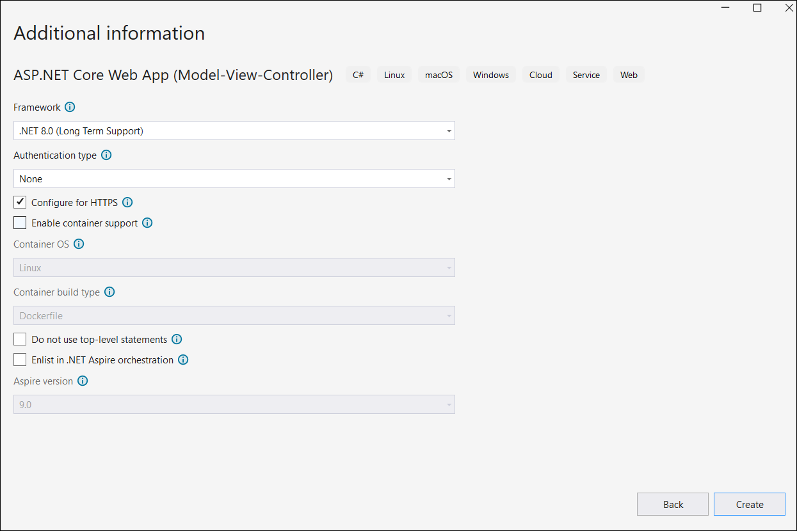

Step 3: Install the [Syncfusion.HtmlToPdfConverter.Net.Aws](https://www.nuget.org/packages/Syncfusion.HtmlToPdfConverter.Net.Aws/) NuGet package into your AWS Elastic Beanstalk project from [NuGet.org](https://www.nuget.org/):
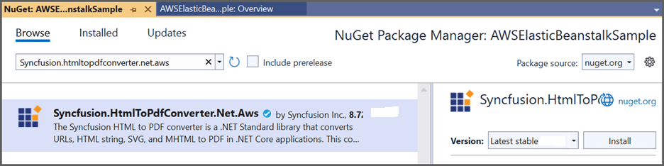

Step 4: A default controller named **HomeController.cs** is added to the ASP.NET Core MVC project. Include the following namespaces in the **HomeController.cs** file:



using Syncfusion.Pdf;
using Syncfusion.HtmlConverter;




Step 5: Add a new button in the **Index.cshtml** file as follows:




@{
    Html.BeginForm("BlinkToPDF", "Home", FormMethod.Get);
    {
        <div>
            <input type="submit" value="HTML To PDF" style="width:150px;height:27px" />
            <br />
            <div class="text-danger">
                @ViewBag.Message
            </div>
        </div>
    }
    Html.EndForm();
}




Step 6: Add a new action method named **BlinkToPDF** in **HomeController.cs** and include the following code example to convert HTML to PDF document using the [Convert](https://help.syncfusion.com/cr/document-processing/Syncfusion.HtmlConverter.HtmlToPdfConverter.html#Syncfusion_HtmlConverter_HtmlToPdfConverter_Convert_System_String_) method of the [HtmlToPdfConverter](https://help.syncfusion.com/cr/document-processing/Syncfusion.HtmlConverter.HtmlToPdfConverter.html) class. The HTML content will be scaled based on the [ViewPortSize](https://help.syncfusion.com/cr/document-processing/Syncfusion.HtmlConverter.BlinkConverterSettings.html#Syncfusion_HtmlConverter_BlinkConverterSettings_ViewPortSize) property of the [BlinkConverterSettings](https://help.syncfusion.com/cr/document-processing/Syncfusion.HtmlConverter.BlinkConverterSettings.html) class:




public IActionResult BlinkToPDF()
{
    // Initialize the HTML to PDF converter with Blink rendering engine
    HtmlToPdfConverter htmlConverter = new HtmlToPdfConverter(HtmlRenderingEngine.Blink);
    // Create Blink converter settings
    BlinkConverterSettings settings = new BlinkConverterSettings();
    // Set Blink viewport size for rendering
    settings.ViewPortSize = new Syncfusion.Drawing.Size(1280, 0);
    // Assign Blink settings to the HTML converter
    htmlConverter.ConverterSettings = settings;
    // Convert URL to PDF document
    PdfDocument document = htmlConverter.Convert("https://www.syncfusion.com");
    // Create memory stream for output
    MemoryStream stream = new MemoryStream();
    // Save the document to memory stream
    document.Save(stream);
    // Return PDF file to browser
    return File(stream.ToArray(), System.Net.Mime.MediaTypeNames.Application.Pdf, "BlinkLinuxDockerAWSBeanstalk.pdf");
}




## Publish the ASP.NET Core application to AWS Elastic Beanstalk using AWS Toolkit

Step 7: Click the **Publish to AWS Elastic Beanstalk (Legacy)** option by right-clicking the project to publish the application to AWS Elastic Beanstalk:
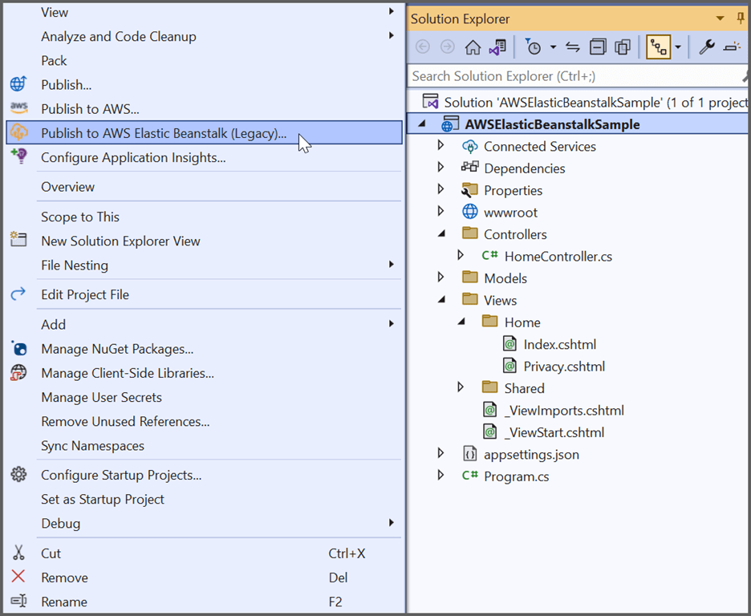

Step 8: Select **Create a new application environment** and click **Next** in the **Publish to AWS Elastic Beanstalk** window:
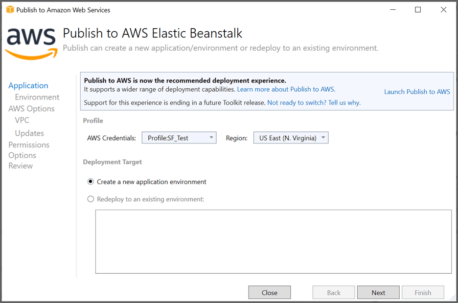

Step 9: Provide a valid name for the environment and URL. Check whether the URL is available by clicking the **Check availability** button. If the requested link is available, click **NEXT** in the **Application Environment** window:
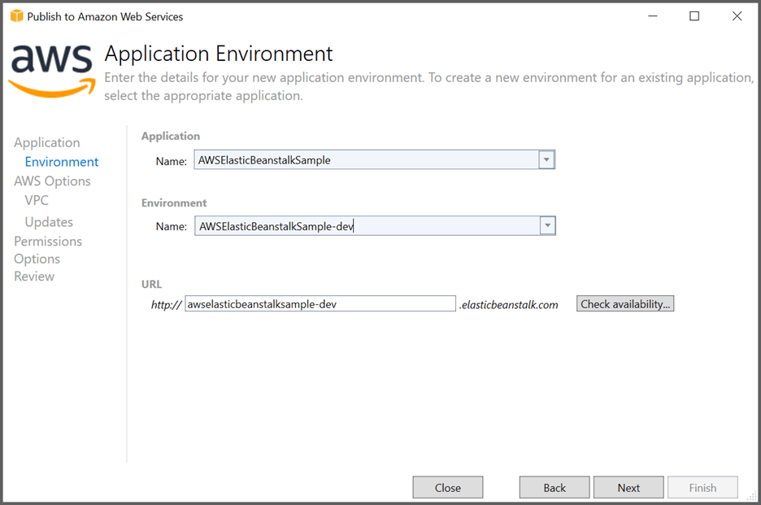

Step 10: Select **t3a.micro** from the **Instance Type** text box and select **Next** in the **AWS Options** window:
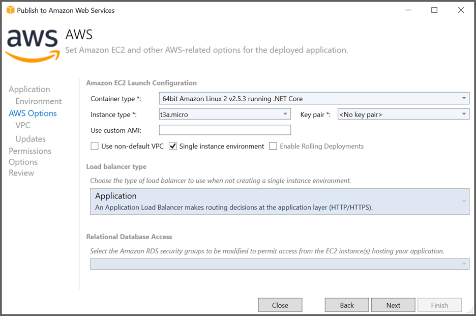

Step 11: Select the **Roles** and click **Next** in the **Permissions** window:
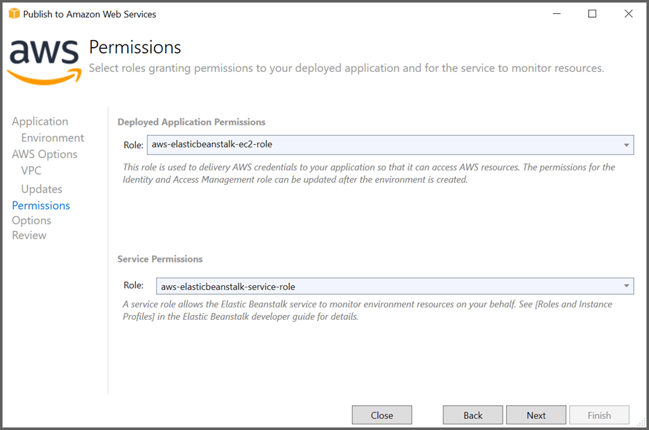

Step 12: Click **Next** in the **Application Options** window:
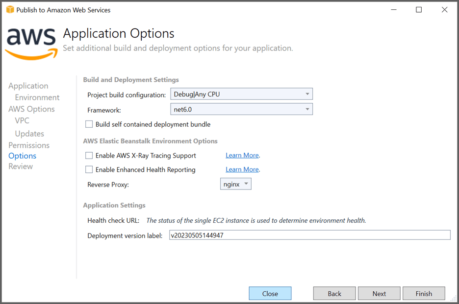

Step 13: Click **Deploy** in the **Review** window:
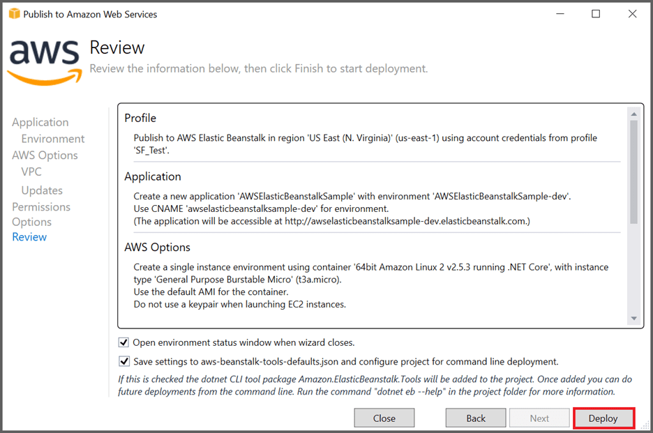

Step 14: Click the **URL link** to launch the application once the **Environment** is updated successfully and the **Environment status** is **Healthy**:
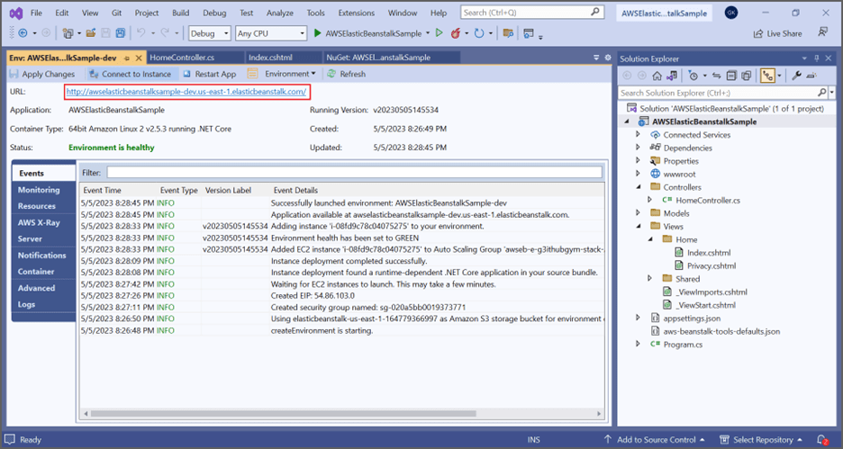

Step 15: The webpage will now open in the browser. Click the button to convert the webpage to a PDF document:
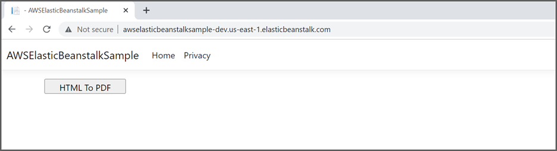

By executing the program, you will obtain the following PDF document output:
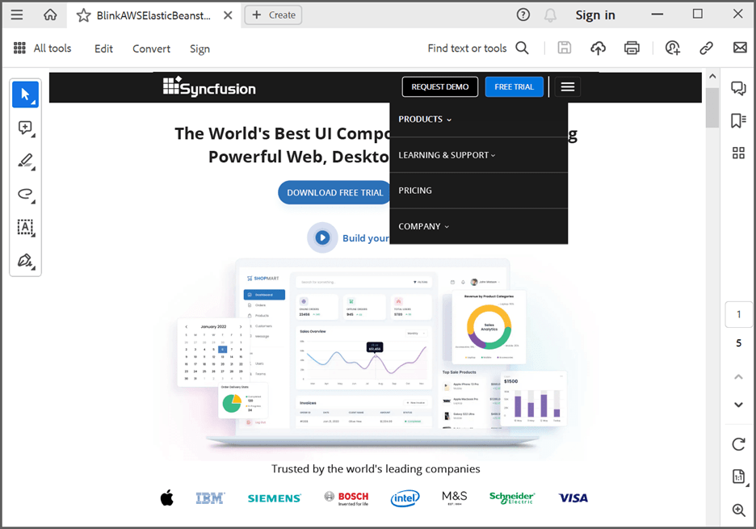

A complete working sample for converting HTML to PDF using Linux Docker in AWS Elastic Beanstalk can be downloaded from [GitHub](https://github.com/SyncfusionExamples/html-to-pdf-csharp-examples/tree/master/AWS/AWSElasticBeanstalkSample).

Click [here](https://www.syncfusion.com/document-sdk/net-pdf-library/html-to-pdf) to explore the rich set of Syncfusion<sup>&reg;</sup> HTML to PDF converter library features. 

You can also view the online sample to [convert HTML to PDF documents](https://document.syncfusion.com/demos/pdf/htmltopdf#/tailwind3) in ASP.NET Core.
