# Convert HTML to PDF file in AWS Lambda with NET 6 container image

The Syncfusion<sup>&reg;</sup> [HTML to PDF converter](https://www.syncfusion.com/pdf-framework/net/html-to-pdf) is a .NET library for converting webpages, SVG, MHTML, and HTML to PDF using C#. Using this library, you can **convert HTML to PDF document in AWS Lambda with NET 6 container image**.

## Prerequisites

**Version Compatibility**

The **Syncfusion.HtmlToPdfConverter.Net.Aws** NuGet package uses the Blink rendering engine for HTML to PDF conversion. This library is compatible with **.NET 8.0 and later** versions.
**Supported Inputs**

The HTML to PDF converter supports the following input types:

- HTML String: Direct HTML content.
- URL: Web pages and online HTML content.
- HTML Files: Local HTML files.
- MHTML Files: Web archive (.mhtml/.mht) content.
- Authenticated Web Pages: Pages that require cookies, form authentication, or HTTP authentication.
- HTTP GET/POST Requests: HTML content accessed through GET or POST methods

**Required Software**

- .NET 8 SDK or later
- AWS Account: Active AWS account with Elastic Beanstalk access
- AWS Toolkit: AWS Toolkit for Visual Studio extension installed

**Register the license key**

N> Starting with v16.2.0.x, if you reference Syncfusion<sup>&reg;</sup> assemblies from trial setup or from the NuGet feed, you must add the "Syncfusion.Licensing" assembly reference and register a license key in your application. Please refer to this [link](https://help.syncfusion.com/common/essential-studio/licensing/overview) for details on registering a Syncfusion<sup>&reg;</sup> license key.

Include a license key in your **Function.cs** file before creating an **HtmlToPdfConverter** instance. Refer to the [Syncfusion License](https://help.syncfusion.com/common/essential-studio/licensing/overview) documentation to learn about registering the Syncfusion license key in your application.




using Syncfusion.Licensing;

public class Function
{
    public string FunctionHandler(string input, ILambdaContext context)
    {
        // Register the Syncfusion license
        SyncfusionLicenseProvider.RegisterLicense("YOUR LICENSE KEY");
    }
}




N> Starting from **version 29.2.4**, it is no longer necessary to manually add the following command-line arguments when using the Blink rendering engine:
N> ```csharp
N> settings.CommandLineArguments.Add("--no-sandbox");
N> settings.CommandLineArguments.Add("--disable-setuid-sandbox");
N> ```
N> These arguments are only required when using **older versions** of the library that depend on Blink in sandbox-restricted environments.

## Steps to convert HTML to PDF in AWS Lambda with NET 6 container image

Step 1: Create a new AWS Lambda project with Tests as follows.
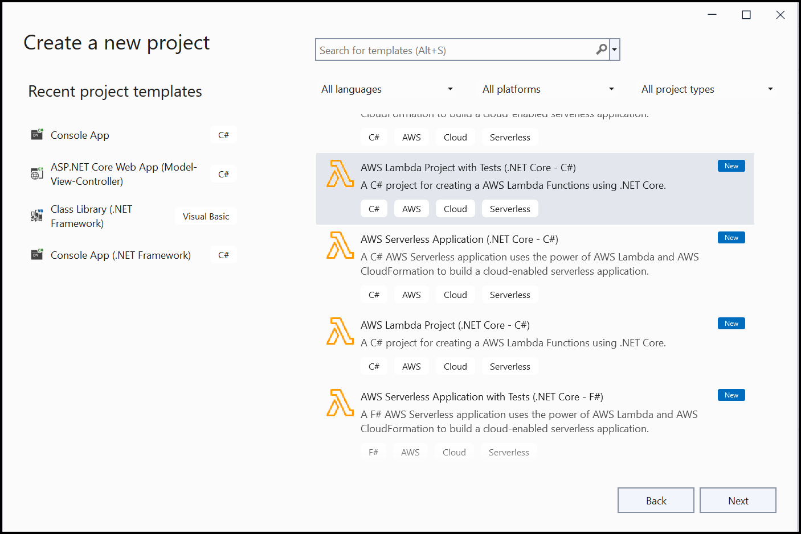

Step 2: In configuration window, name the project and select Create.
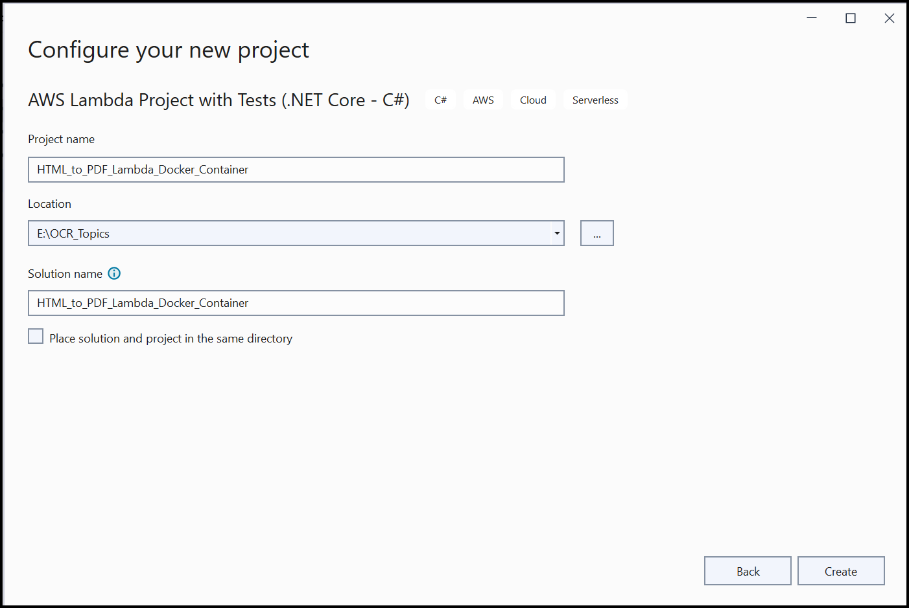

Step 3: Select Blueprint as .NET 6 (Container Image) Function and click Finish.
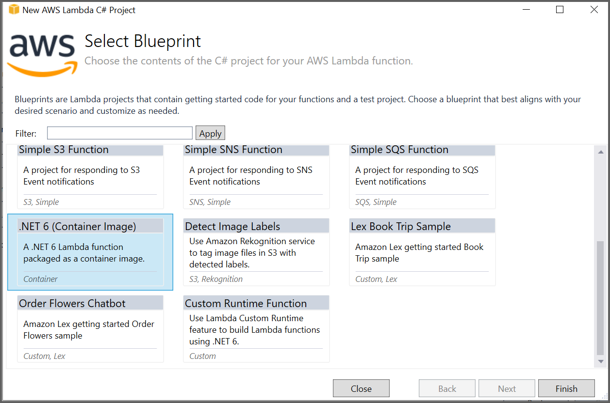

Step 4: Install the [Syncfusion.HtmlToPdfConverter.Net.Aws](https://www.nuget.org/packages/Syncfusion.HtmlToPdfConverter.Net.Aws/) and [AWSSDK.Lambda](https://www.nuget.org/packages/AWSSDK.Lambda) NuGet packages as references to your AWS Lambda project from [NuGet.org](https://www.nuget.org/).
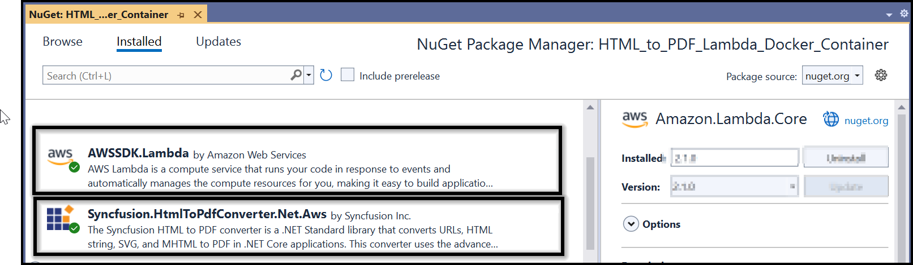

Step 5: Add the following namespaces in the **Function.cs** file:




using Syncfusion.HtmlConverter;
using Syncfusion.Pdf;




Step 6: Add the following code sample in the **Function.cs** to convert HTML to PDF document using the [Convert](https://help.syncfusion.com/cr/document-processing/Syncfusion.HtmlConverter.HtmlToPdfConverter.html#Syncfusion_HtmlConverter_HtmlToPdfConverter_Convert_System_String_) method in the [HtmlToPdfConverter](https://help.syncfusion.com/cr/document-processing/Syncfusion.HtmlConverter.HtmlToPdfConverter.html) class with [BlinkConverterSettings](https://help.syncfusion.com/cr/document-processing/Syncfusion.HtmlConverter.BlinkConverterSettings.html):




public string FunctionHandler(string input, ILambdaContext context)
{
   // Initialize HTML to PDF converter with Blink rendering engine for high-quality PDF output
   HtmlToPdfConverter htmlConverter = new HtmlToPdfConverter(HtmlRenderingEngine.Blink);
       
   // Configure Blink converter settings for AWS Lambda environment
   BlinkConverterSettings blinkConverterSettings = new BlinkConverterSettings();
   // Specify path to Blink binaries packaged with the Lambda function
   blinkConverterSettings.BlinkPath = Path.GetFullPath("BlinkBinariesAws");
   // Add sandbox bypass arguments required for Lambda container execution
   blinkConverterSettings.CommandLineArguments.Add("--no-sandbox");
   blinkConverterSettings.CommandLineArguments.Add("--disable-setuid-sandbox");
   // Add additional delay for complex HTML rendering
   blinkConverterSettings.AdditionalDelay = 3000;
   // Apply configured settings to the converter
   htmlConverter.ConverterSettings = blinkConverterSettings;
 
   // Convert the HTML string input to PDF document
   PdfDocument document = htmlConverter.Convert(input, PathToFile());        
 
   // Create memory stream to store the PDF document bytes
   MemoryStream memoryStream = new MemoryStream();
   // Save PDF document to memory stream and close the document
   document.Save(memoryStream);
   document.Close(true);
   // Convert PDF bytes to Base64 string for AWS Lambda response
   string base64 = Convert.ToBase64String(memoryStream.ToArray());
   // Close and dispose memory stream resources
   memoryStream.Close();
   memoryStream.Dispose();
 
   // Return Base64-encoded PDF string to Lambda invoker
   return base64;
}

public static string PathToFile()
{
   // Get the directory path of the currently executing assembly
   string? path = System.IO.Path.GetDirectoryName(System.Reflection.Assembly.GetExecutingAssembly().GetName().CodeBase);
   // If path is empty, use platform-specific root directory
   if (string.IsNullOrEmpty(path))
   {
      path = Environment.OSVersion.Platform == PlatformID.Unix ? @"/" : @"\";
   }
   // Return properly formatted path based on operating system (Linux in Lambda container)
   return Environment.OSVersion.Platform == PlatformID.Unix ? string.Concat(path.Substring(5), @"/") : string.Concat(path.Substring(6), @"\");
}




Step 7: Create a new folder named **Helper** and add a class file named **AWSHelper.cs**. Add the following namespaces and code samples in the **AWSHelper** class to invoke the published AWS Lambda function:




// Import AWS Lambda client namespace for Lambda function invocation
using Amazon.Lambda;
// Import AWS Lambda model classes for request/response handling
using Amazon.Lambda.Model;
// Import Newtonsoft.Json for JSON serialization
using Newtonsoft.Json;

public class AWSHelper
{
   public static async Task<byte[]> RunLambdaFunction(string html)
   {
        try
        {
            // AWS credentials for authentication (use IAM roles in production)
            var AwsAccessKeyId = "awsaccessKeyID";
            var AwsSecretAccessKey = "awsSecretAccessKey";
 
            // Create Lambda client with AWS credentials and region configuration
            AmazonLambdaClient client = new AmazonLambdaClient(AwsAccessKeyId, AwsSecretAccessKey, Amazon.RegionEndpoint.USEast1);
            // Prepare Lambda function invocation request with HTML payload
            InvokeRequest invoke = new InvokeRequest
            {
                FunctionName = "AWSLambdaDockerContainer",
                InvocationType = InvocationType.RequestResponse,
                // Serialize HTML string to JSON format for Lambda transmission
                Payload = Newtonsoft.Json.JsonConvert.SerializeObject(html)
            };
            // Invoke AWS Lambda function asynchronously and get response
            InvokeResponse response = await client.InvokeAsync(invoke);
 
            // Read and log Lambda function response for debugging
            Console.WriteLine($"Response: {response.LogResult}");
            Console.WriteLine($"Response: {response.StatusCode}");
            Console.WriteLine($"Response: {response.FunctionError}");
            // Read response payload stream containing Base64-encoded PDF
            var stream = new StreamReader(response.Payload);
            JsonReader reader = new JsonTextReader(stream);
            var serializer = new JsonSerializer();
            var responseText = serializer.Deserialize(reader);
 
            // Convert Base64 string response to PDF document bytes
            return Convert.FromBase64String(responseText.ToString());
        }
        catch (Exception ex)
        {
            // Log any exceptions that occur during Lambda invocation
            Console.WriteLine($"Exception Occurred in HTMLToPDFHelper: {ex}");
        }
    // Return empty Base64 string if conversion fails
    return Convert.FromBase64String("");
    }
}




Step 8: Right-click the project and select **Publish to AWS Lambda**.

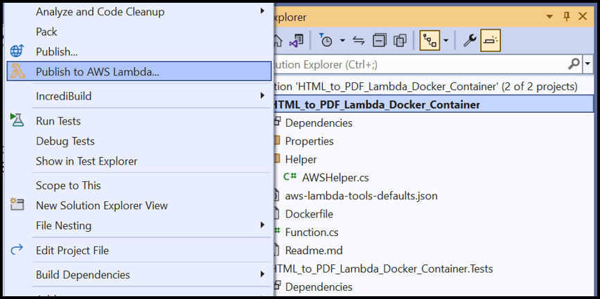

Step 9: Create a new AWS profile in the Upload Lambda Function Window. After creating the profile, add a name for the Lambda function to publish. Then, click **Next**.  

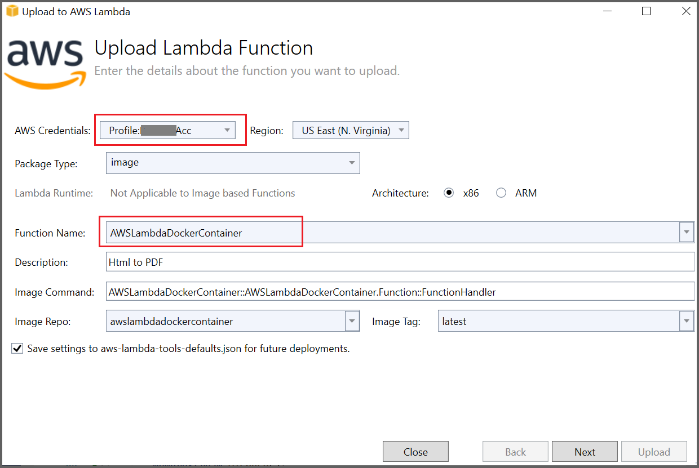

Step 10: In the Advanced Function Details window, specify the **Role Name** as based on AWS Managed policy. After selecting the role, click the Upload button to deploy your application.

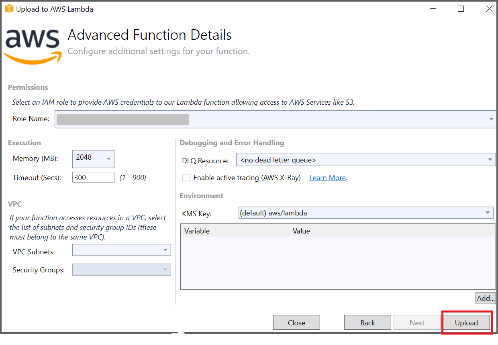
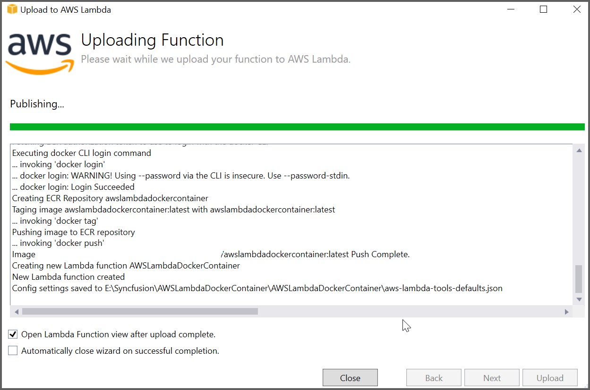

Step 11: After deploying the application, Sign in to your AWS account, and you can see the published Lambda function in the AWS console.

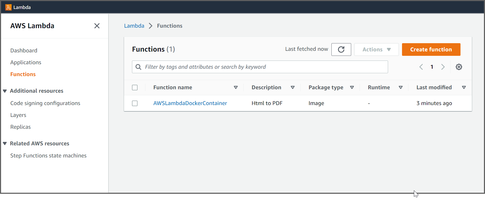

## Steps to invoke the AWS Lambda function from the Test application

Step 12: Add the following code to invoke the AWS Lambda function with the HTML string from the **FunctionTest** class:




public class FunctionTest
{
    [Fact]
    public void HtmlToPDFFunction()
    {
        // Get the directory path of the test assembly
        string path = System.IO.Path.GetDirectoryName(System.Reflection.Assembly.GetExecutingAssembly().GetName().CodeBase);
        // Format path based on operating system (Unix or Windows)
        string filePath = Environment.OSVersion.Platform == PlatformID.Unix ? string.Concat(path.Substring(5), @"/") : string.Concat(path.Substring(6), @"\");
 
        // Read HTML sample file content for conversion
        var html = File.ReadAllText($"{filePath}/HtmlSample.html");
        // Initialize Base64 byte array for PDF output
        byte[] base64 = null;
        // Invoke AWS Lambda function asynchronously and get Base64-encoded PDF bytes
        base64 = AWSHelper.RunLambdaFunction(html).Result;
 
        // Create file stream to write PDF output with timestamp
        FileStream file = new FileStream($"{filePath}/file{DateTime.Now.Ticks}.pdf", FileMode.Create, FileAccess.Write);
        // Create memory stream from Base64 byte array
        var ms = new MemoryStream(base64);
        // Write memory stream content to PDF file
        ms.WriteTo(file);
        // Close file and memory streams to release resources
        file.Close();
        ms.Close();
    }
}




Step 13: Right click the test application and select **Run Tests**.

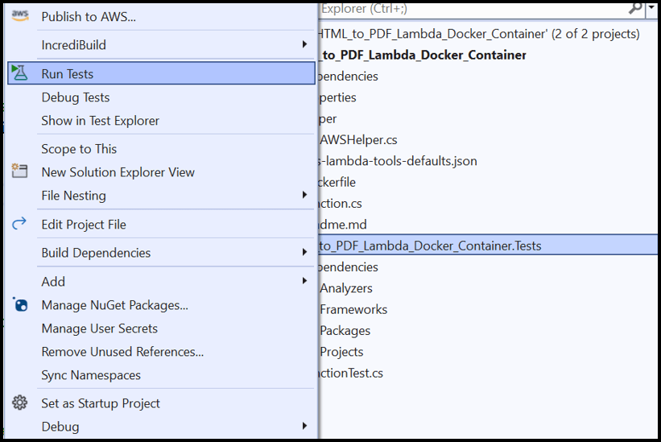

Step 14: By executing the program, you will obtain the following PDF document output:

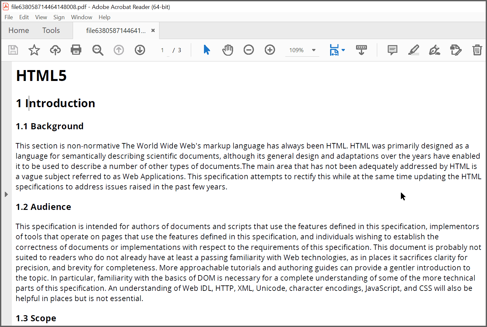

A complete working sample for converting HTML to PDF in AWS Lambda with .NET 6 container image can be downloaded from [GitHub](https://github.com/SyncfusionExamples/html-to-pdf-csharp-examples/tree/master/AWS/HTML_to_PDF_Lambda_Docker_Container).

Click [here](https://www.syncfusion.com/document-sdk/net-pdf-library/html-to-pdf) to explore the rich set of Syncfusion<sup>&reg;</sup> HTML to PDF converter library features. 

You can also view the online sample to [convert HTML to PDF documents](https://document.syncfusion.com/demos/pdf/htmltopdf#/tailwind3) in ASP.NET Core.