# Convert HTML to PDF file in AWS Lambda

The [HTML to PDF converter](https://www.syncfusion.com/document-sdk/net-pdf-library/html-to-pdf) is a .NET library for converting webpages, SVG, MHTML, and HTML to PDF documents using C#. Using this library, you can convert HTML to PDF documents in AWS Lambda functions.

This guide covers two main workflows:
- Create an AWS Lambda function to convert HTML to PDF and publish it to AWS
- Invoke the AWS Lambda function from a console application using AWS SDKs

## Prerequisites

**Version Compatibility**

The **Syncfusion.HtmlToPdfConverter.Net.Aws** NuGet package uses the Blink rendering engine for HTML to PDF conversion. This library is compatible with **.NET 8.0 and later** versions.

**Supported Inputs**

The HTML to PDF converter supports the following input types:

- HTML String: Direct HTML content.
- URL: Web pages and online HTML content.
- HTML Files: Local HTML files.
- MHTML Files: Web archive (.mhtml/.mht) content.
- Authenticated Web Pages: Pages that require cookies, form authentication, or HTTP authentication.
- HTTP GET/POST Requests: HTML content accessed through GET or POST methods

**Required Software**

- .NET 8 SDK or later
- AWS Account: Active AWS account with Elastic Beanstalk access
- AWS Toolkit: AWS Toolkit for Visual Studio extension installed

**Register the license key**

N> Starting with v16.2.0.x, if you reference Syncfusion<sup>&reg;</sup> assemblies from trial setup or from the NuGet feed, you must add the "Syncfusion.Licensing" assembly reference and register a license key in your application. Please refer to this [link](https://help.syncfusion.com/common/essential-studio/licensing/overview) for details on registering a Syncfusion<sup>&reg;</sup> license key.

Include a license key in your **HomeController.cs** file before creating an **HtmlToPdfConverter** instance. Refer to the [Syncfusion License](https://help.syncfusion.com/common/essential-studio/licensing/overview) documentation to learn about registering the Syncfusion license key in your application.




using Syncfusion.Licensing;

namespace BlinkHtmlConversion.Controllers
{
    public class HomeController : Controller
    {
        public HomeController()
        {
            // Register the Syncfusion license
            SyncfusionLicenseProvider.RegisterLicense("YOUR LICENSE KEY");
        }
    }
}




N> Starting from **version 29.2.4**, it is no longer necessary to manually add the following command-line arguments when using the Blink rendering engine:
N> ```csharp
N> settings.CommandLineArguments.Add("--no-sandbox");
N> settings.CommandLineArguments.Add("--disable-setuid-sandbox");
N> ```
N> These arguments are only required when using **older versions** of the library that depend on Blink in sandbox-restricted environments.

## Steps to convert HTML to PDF in AWS Lambda

### Create an AWS Lambda Function to Convert HTML to PDF

Step 1: Create a new AWS Lambda project:
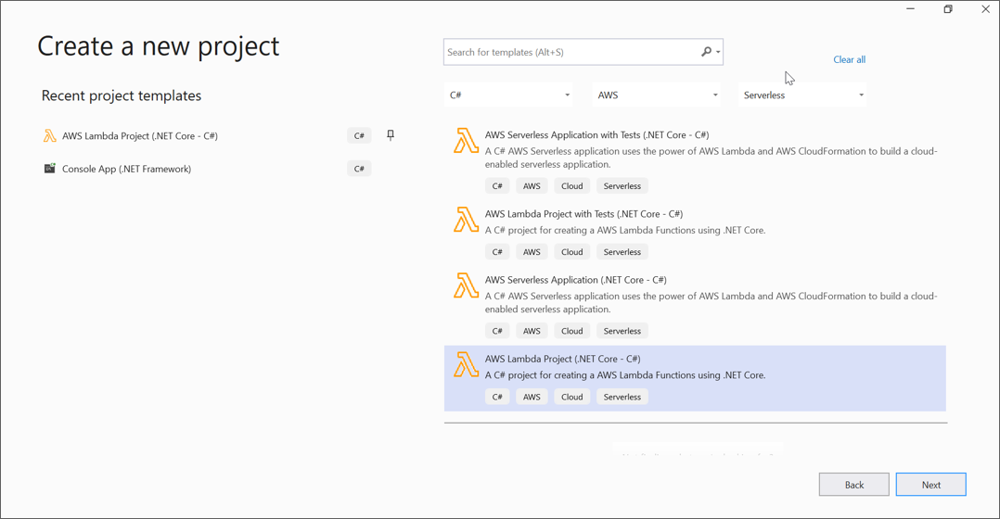
 
Step 2: In the configuration window, name your project and select **Create**:
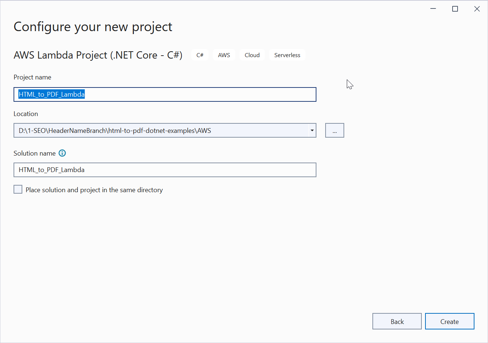

Step 3: Select **Empty Function** as the blueprint and click **Finish**:
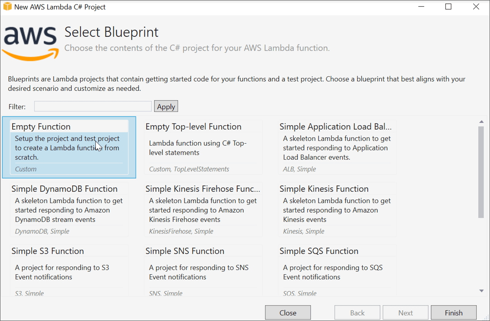

Step 4: Install the [Syncfusion.HtmlToPdfConverter.Net.Aws](https://www.nuget.org/packages/Syncfusion.HtmlToPdfConverter.Net.Aws/) NuGet package into your AWS Lambda project from [NuGet.org](https://www.nuget.org/):
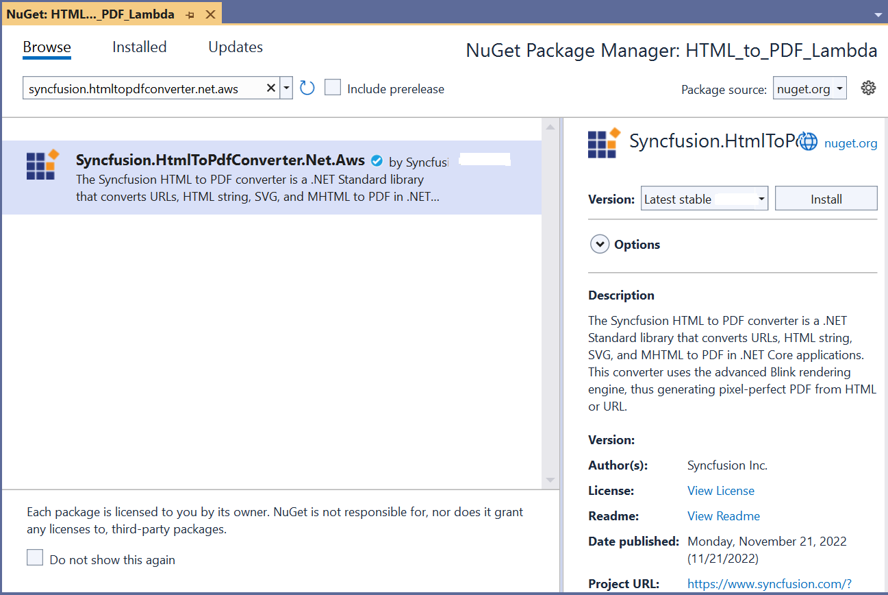

Step 5: Include the following namespaces in the **Function.cs** file:




using Syncfusion.HtmlConverter;
using Syncfusion.Pdf;




Step 6: Add the following code snippet to **Function.cs** to convert HTML to PDF document using the [Convert](https://help.syncfusion.com/cr/document-processing/Syncfusion.HtmlConverter.HtmlToPdfConverter.html#Syncfusion_HtmlConverter_HtmlToPdfConverter_Convert_System_String_) method of the [HtmlToPdfConverter](https://help.syncfusion.com/cr/document-processing/Syncfusion.HtmlConverter.HtmlToPdfConverter.html) class:




// Initialize the HTML to PDF converter with Blink rendering engine
HtmlToPdfConverter htmlConverter = new HtmlToPdfConverter();
// Convert URL to PDF document
PdfDocument document = htmlConverter.Convert(input);
// Create memory stream for output
MemoryStream memoryStream = new MemoryStream();
// Save the document to memory stream
document.Save(memoryStream);
// Close the document and dispose resources
document.Close(true);
// Return Base64 encoded PDF for AWS Lambda response
return Convert.ToBase64String(memoryStream.ToArray());




Step 7: Right-click the project and select **Publish to AWS Lambda**:
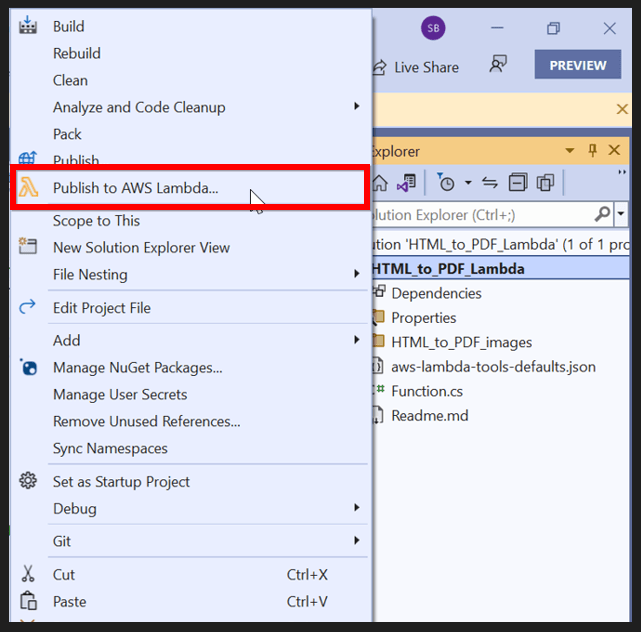

Step 8: Create a new AWS profile in the **Upload Lambda Function** window. After creating the profile, add a name for the Lambda function to publish, then click **Next**:
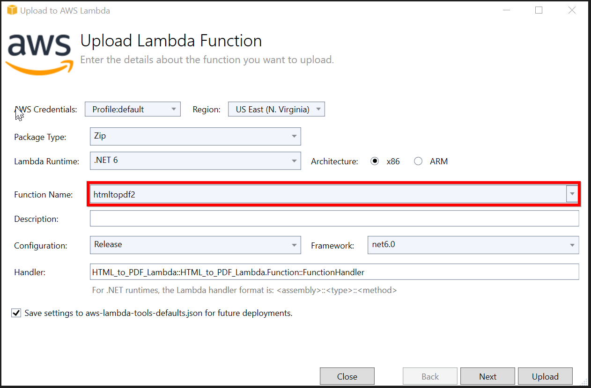   

Step 9: In the **Advanced Function Details** window, specify the **Role Name** based on the AWS Managed policy. After selecting the role, click the **Upload** button to deploy your application:
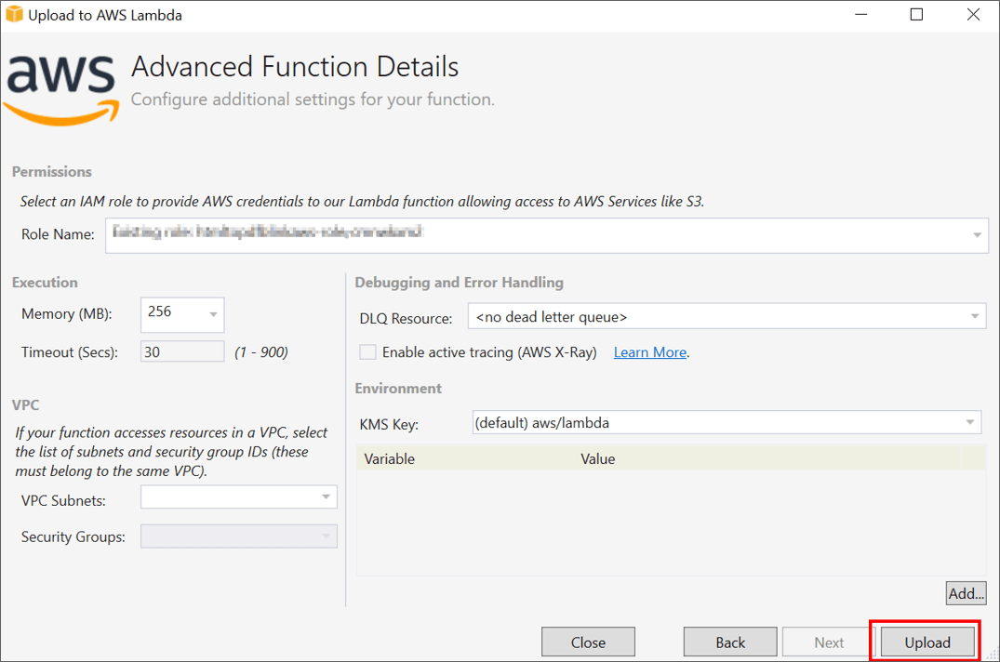     

Step 10: After deploying the application, sign in to your AWS account and you can view the published Lambda function in the **AWS Console**:
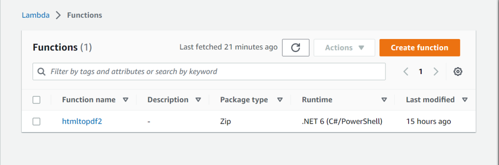

## Invoke the AWS Lambda Function from a Console Application

Step 1: Create a new console project:
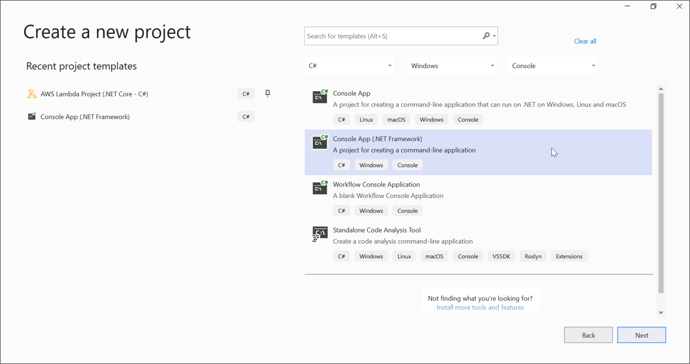    

Step 2: In the project configuration window, name your project and select **Create**:
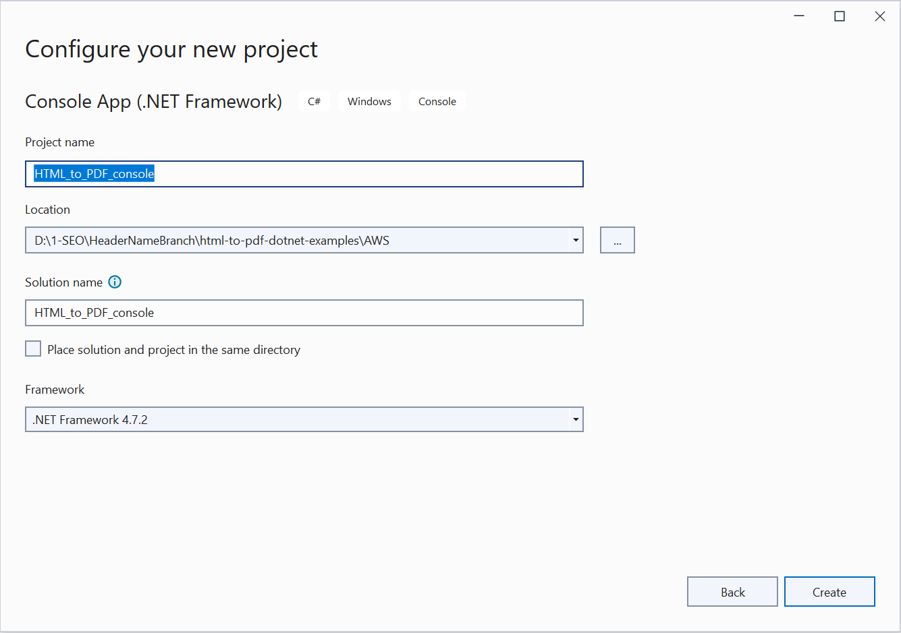   

Step 3: Install the [AWSSDK.Core](https://www.nuget.org/packages/AWSSDK.Core), [AWSSDK.Lambda](https://www.nuget.org/packages/AWSSDK.Lambda), and [Newtonsoft.Json](https://www.nuget.org/packages/Newtonsoft.Json/13.0.2-beta3) NuGet packages into your console application from [NuGet.org](https://www.nuget.org/):
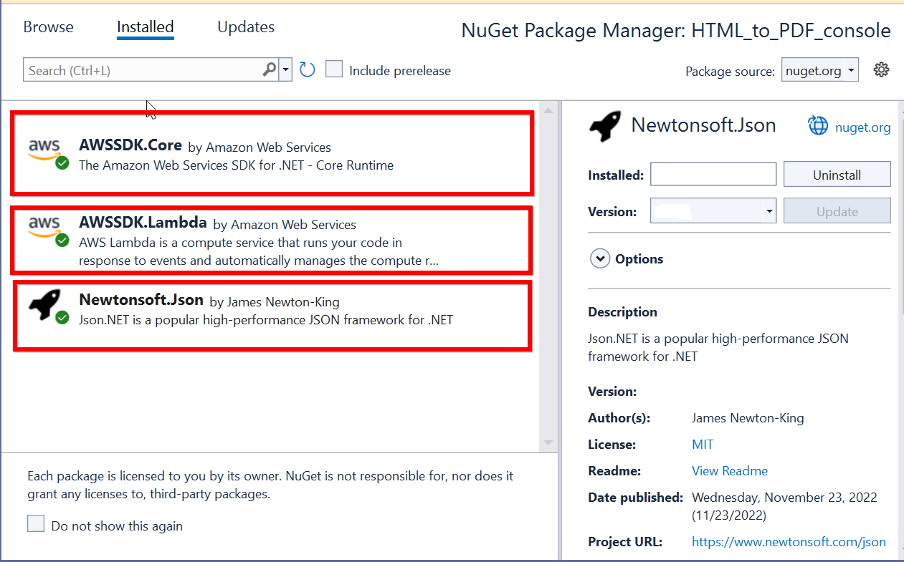    
 
Step 4: Include the following namespaces in the **Program.cs** file:




using Amazon;
using Amazon.Lambda;
using Amazon.Lambda.Model;
using Newtonsoft.Json;
using System.IO;




Step 5: Add the following code snippet to the **Program** class to invoke the published AWS Lambda function using the function name and access keys:




// Create a new AmazonLambdaClient with AWS credentials and region
AmazonLambdaClient client = new AmazonLambdaClient("awsaccessKeyID", "awsSecreteAccessKey", RegionEndpoint.USEast1);
// Create InvokeRequest with the published Lambda function name
InvokeRequest invoke = new InvokeRequest
{
    FunctionName = "AwsLambdaFunctionHtmlToPdfConversion",
    InvocationType = InvocationType.RequestResponse,
    Payload = "\" https://www.google.co.in/ \""
};
// Invoke the AWS Lambda function and get the response
InvokeResponse response = client.Invoke(invoke);
// Read the response payload stream
var stream = new StreamReader(response.Payload);
JsonReader reader = new JsonTextReader(stream);
var serializer = new JsonSerializer();
var responseText = serializer.Deserialize(reader);
// Convert Base64 string response to PDF document bytes
byte[] bytes = Convert.FromBase64String(responseText.ToString());
// Create file stream to save the PDF document
FileStream fileStream = new FileStream("Sample.pdf", FileMode.Create);
BinaryWriter writer = new BinaryWriter(fileStream);
// Write PDF bytes to file
writer.Write(bytes, 0, bytes.Length);
writer.Close();
// Open the PDF document in the default viewer
System.Diagnostics.Process.Start("Sample.pdf");




By executing the program, you will obtain the following PDF document output:
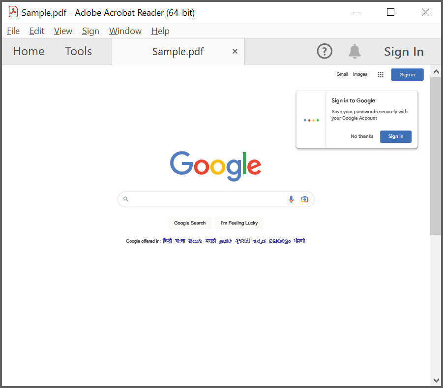

A complete working sample for converting HTML to PDF in AWS Lambda can be downloaded from [GitHub](https://github.com/SyncfusionExamples/html-to-pdf-csharp-examples/tree/master/AWS).

Click [here](https://www.syncfusion.com/document-sdk/net-pdf-library/html-to-pdf) to explore the rich set of Syncfusion<sup>&reg;</sup> HTML to PDF converter library features. 

You can also view the online sample to [convert HTML to PDF documents](https://document.syncfusion.com/demos/pdf/htmltopdf#/tailwind3) in ASP.NET Core.
