# Convert HTML to PDF file in Amazon ECS with Fargate

The Syncfusion<sup>&reg;</sup> [HTML to PDF converter](https://www.syncfusion.com/document-sdk/net-pdf-library/html-to-pdf) is a .NET library for converting webpages, SVG, MHTML, and HTML to PDF using C#. Using this library, **convert HTML to PDF document using Blink in Amazon ECS with Fargate**.

## Steps to convert HTML to PDF using Blink in Amazon ECS with Fargate

Step 1: Create a new C# ASP.NET Core Web Application project.
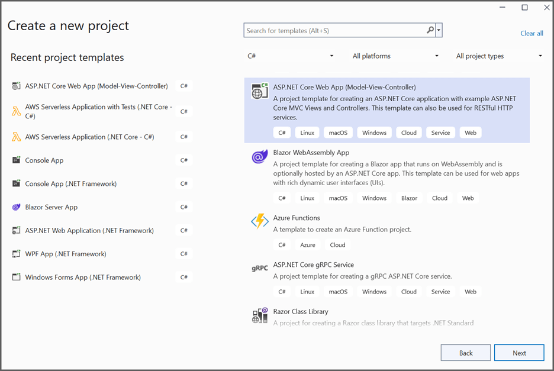

Step 2: In configuration windows, name your project and select **Next**.
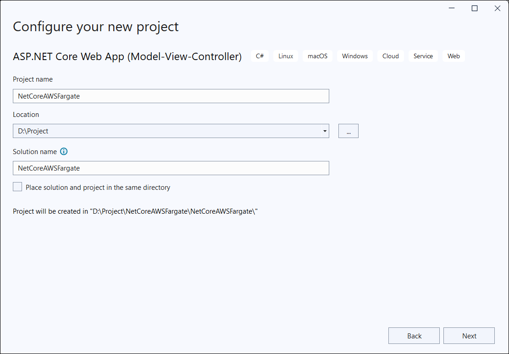

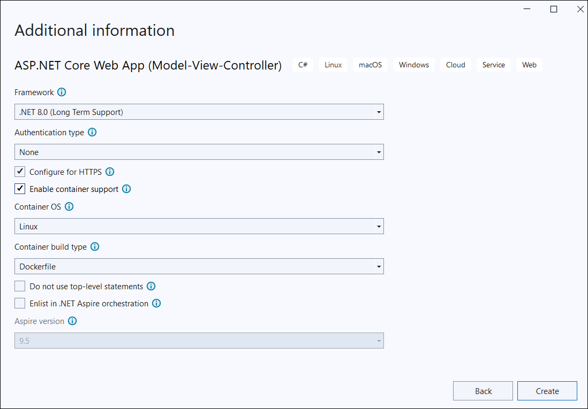

Step 3: Install the [Syncfusion.HtmlToPdfConverter.Net.Linux](https://www.nuget.org/packages/Syncfusion.HtmlToPdfConverter.Net.Linux) NuGet package as a reference to your AWS Elastic Beanstalk project from [NuGet.org.](https://www.nuget.org/).
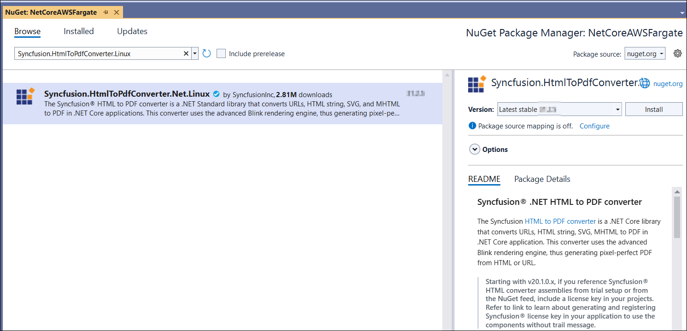

Step 4: Include the following commands in the Docker file to install the dependent packages in the docker container. 



RUN apt-get update && \
apt-get install -yq --no-install-recommends \ 
libasound2 libatk1.0-0 libc6 libcairo2 libcups2 libdbus-1-3 \ 
libexpat1 libfontconfig1 libgcc1 libgconf-2-4 libgdk-pixbuf2.0-0 libglib2.0-0 libgtk-3-0 libnspr4 \ 
libpango-1.0-0 libpangocairo-1.0-0 libstdc++6 libx11-6 libx11-xcb1 libxcb1 \ 
libxcursor1 libxdamage1 libxext6 libxfixes3 libxi6 libxrandr2 libxrender1 libxss1 libxtst6 \ 
libnss3 libgbm1



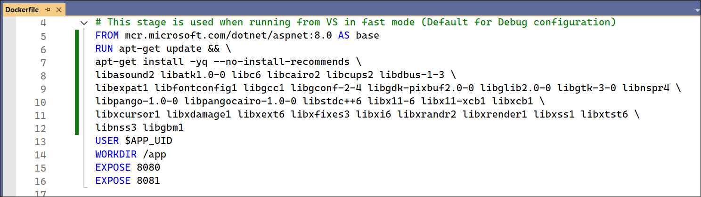

Step 5: A default controller named **HomeController.cs** gets added to create the ASP.NET Core MVC project. Include the following namespaces in that HomeController.cs file.



using Syncfusion.Pdf;
using Syncfusion.HtmlConverter;
using System.IO;



Step 6: Add a new button in **index.cshtml** as follows.



@{
    Html.BeginForm("BlinkToPDF", "Home", FormMethod.Get);
    {
        <div>
            <input type="submit" value="HTML To PDF" style="width:150px;height:27px" />
            <br />
            <div class="text-danger">
                @ViewBag.Message
            </div>
        </div>
    }
    Html.EndForm();
}



Step 7: Add a new action method named BlinkToPDF in HomeController.cs and include the following code example to convert HTML to PDF document using the Convert method in [HtmlToPdfConverter](https://help.syncfusion.com/cr/document-processing/Syncfusion.HtmlConverter.HtmlToPdfConverter.html) class. The HTML content will be scaled based on the given [ViewPortSize](https://help.syncfusion.com/cr/document-processing/Syncfusion.HtmlConverter.BlinkConverterSettings.html#Syncfusion_HtmlConverter_BlinkConverterSettings_ViewPortSize) property of the [BlinkConverterSettings](https://help.syncfusion.com/cr/document-processing/Syncfusion.HtmlConverter.BlinkConverterSettings.html) class.



public IActionResult BlinkToPDF()
{
    //Initialize HTML to PDF converter.
    HtmlToPdfConverter htmlConverter = new HtmlToPdfConverter(HtmlRenderingEngine.Blink);
    BlinkConverterSettings settings = new BlinkConverterSettings();
    //Set Blink viewport size.
    settings.ViewPortSize = new Syncfusion.Drawing.Size(1280, 0);
    //Assign Blink settings to the HTML converter.
    htmlConverter.ConverterSettings = settings;
    //Convert URL to PDF document.
    PdfDocument document = htmlConverter.Convert("https://www.syncfusion.com");
    //Create the memory stream.
    MemoryStream stream = new MemoryStream();
    //Save the document to the memory stream.
    document.Save(stream);
    //Close the document
    document.Close(true); 
    return File(stream.ToArray(), System.Net.Mime.MediaTypeNames.Application.Pdf, "BlinkLinuxDockerAWSBeanstalk.pdf");
}



N> Starting from **version 29.2.4**, it is no longer necessary to manually add the following command-line arguments when using the Blink rendering engine:
N> ```csharp
N> settings.CommandLineArguments.Add("--no-sandbox");
N> settings.CommandLineArguments.Add("--disable-setuid-sandbox");
N> ```
N> These arguments are only required when using **older versions** of the library that depend on Blink in sandbox-restricted environments.

## Publish the ASP.NET Core application to Amazon ECS with Fargate using AWS Toolkit.

Step 8: Click the **Publish Container to AWS (Legacy)…** option by right-clicking the project to
publish the application.
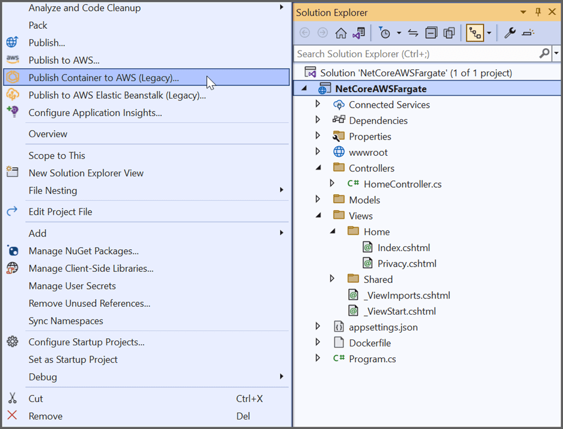

Step 9: Select the AWS account profile and region to use for deployment. Ensure **Service on an ECS Cluster** is selected as the Deployment Target then click the **Next** button.
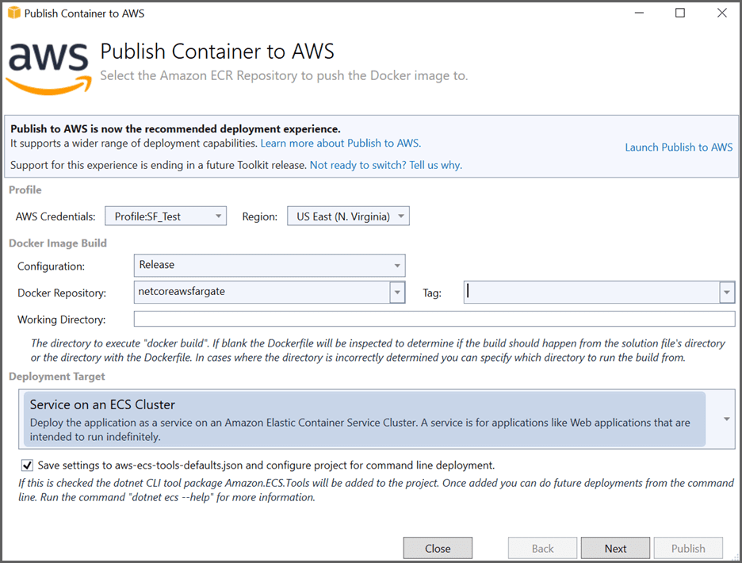

Step 10: Choose **Create an empty cluster** for the ECS Cluster and provide a name for the cluster and Launch Type should be set to **FARGATE** in the Launch Configuration window.


Step 11: Choose **Create New** for the service and provide a name for your service in the service Configuration window.
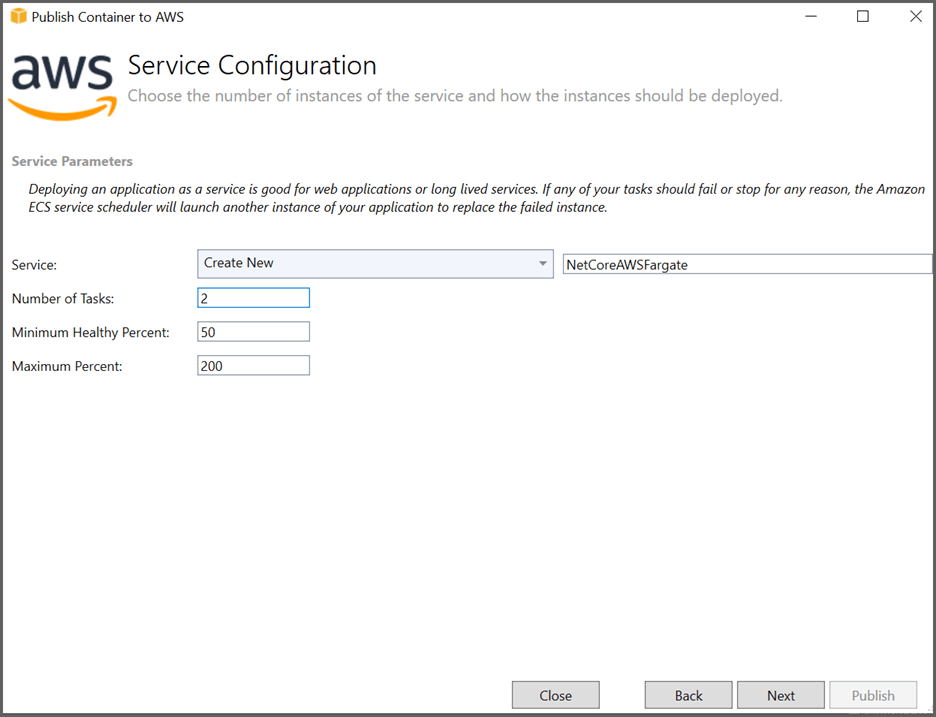

Step 12: Select the Configure Application Load Balance and Choose **Create New** in the load balancer drop-down and provide a name for your load balancer from the Application Load Balancer Configuration window. 
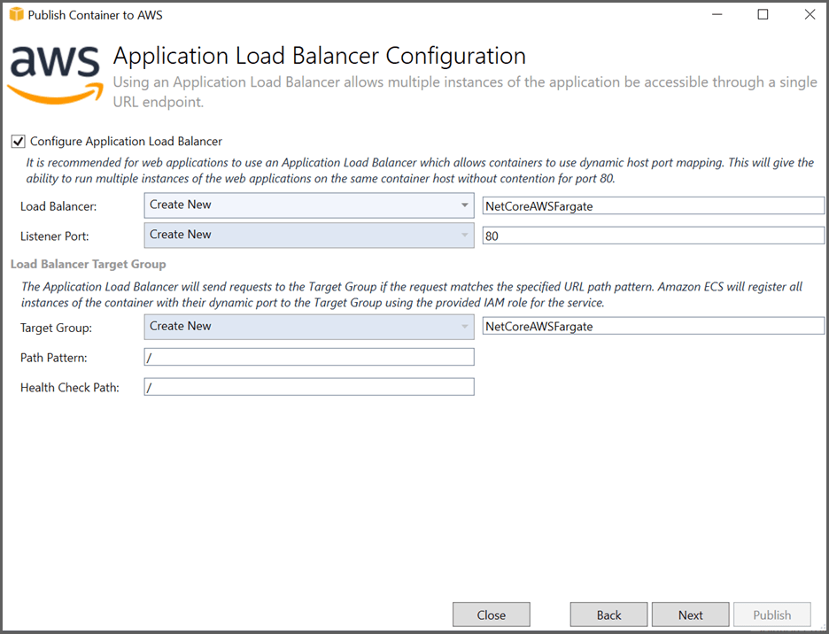

Step 13: Choose **Create New** for the task definition and enter a name for the task. Select an **Task Role** to provide AWS credentials to your application to access AWS services in the Task Definition window and Select **Publish**.
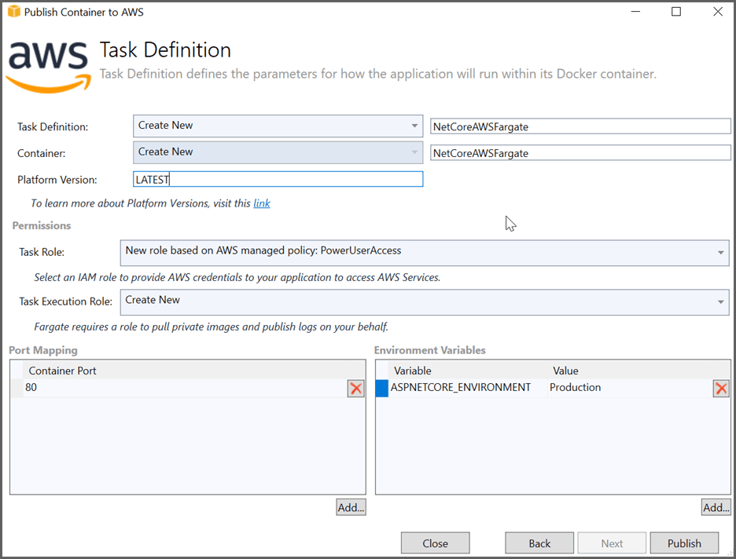
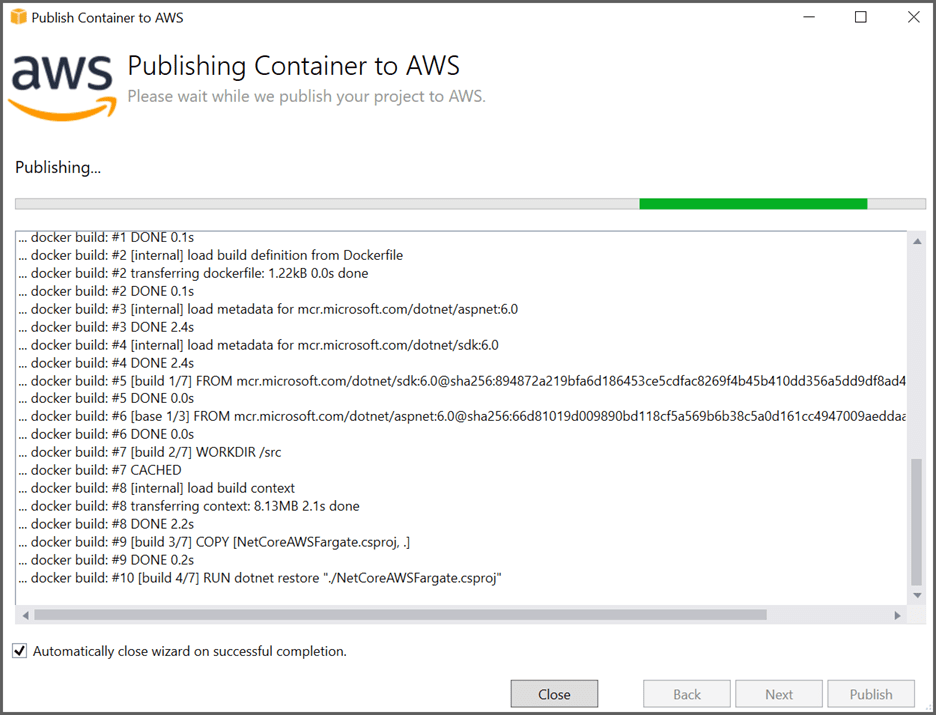

Step 14: Once the deployment process completed, the toolkit will open a view onto the cluster. Click the Load Balance **URL link** to launch the application once the Load Balance status changed to Active.
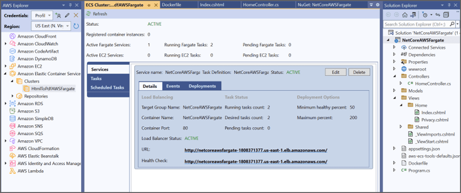

Now, the webpage will open in the browser. Click the button to convert the webpage to a PDF document.
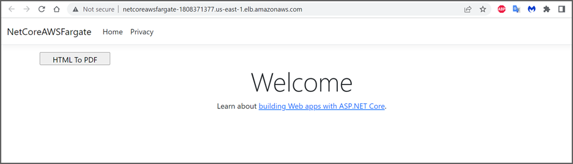

By executing the program, you will get a PDF document as follows.


A complete working sample for converting an HTML to PDF using Blink in Amazon ECS using AWS Fargate can be downloaded from [GitHub](https://github.com/SyncfusionExamples/html-to-pdf-csharp-examples/tree/master/AWS/NetCoreAWSFargate).

Click [here](https://www.syncfusion.com/document-sdk/net-pdf-library/html-to-pdf) to explore the rich set of Syncfusion Essential PDF features.

An online sample link to [convert HTML to PDF document](https://ej2.syncfusion.com/aspnetcore/PDF/HtmltoPDF#/material3) in ASP.NET Core.