# Convert HTML to PDF file in Amazon ECS with Fargate

The [HTML to PDF converter](https://www.syncfusion.com/document-sdk/net-pdf-library/html-to-pdf) is a .NET library for converting webpages, SVG, MHTML, and HTML to PDF documents using C#. Using this library, you can convert HTML to PDF documents using Blink in Amazon ECS with Fargate.

## Prerequisites

**Version Compatibility**

The **Syncfusion.HtmlToPdfConverter.Net.Linux** NuGet package uses the Blink rendering engine for HTML to PDF conversion. This library is compatible with **.NET 8.0 and later** versions. Fargate requires a Linux base image, and Blink dependencies must be installed in the Docker container.

**Supported Inputs**

The HTML to PDF converter supports the following input types:

- HTML String: Direct HTML content.
- URL: Web pages and online HTML content.
- HTML Files: Local HTML files.
- MHTML Files: Web archive (.mhtml/.mht) content.
- Authenticated Web Pages: Pages that require cookies, form authentication, or HTTP authentication.
- HTTP GET/POST Requests: HTML content accessed through GET or POST methods

**Required Software**

- .NET 8 SDK or later
- AWS Account: Active AWS account with ECS and Fargate access
- AWS Toolkit: AWS Toolkit for Visual Studio extension installed

**Register the license key**

N> Starting with v16.2.0.x, if you reference Syncfusion<sup>&reg;</sup> assemblies from trial setup or from the NuGet feed, you must add the "Syncfusion.Licensing" assembly reference and register a license key in your application. Please refer to this [link](https://help.syncfusion.com/common/essential-studio/licensing/overview) for details on registering a Syncfusion<sup>&reg;</sup> license key.

Include a license key in your **HomeController.cs** file before creating an **HtmlToPdfConverter** instance. Refer to the [Syncfusion License](https://help.syncfusion.com/common/essential-studio/licensing/overview) documentation to learn about registering the Syncfusion license key in your application.




using Syncfusion.Licensing;

namespace BlinkHtmlConversion.Controllers
{
    public class HomeController : Controller
    {
        public HomeController()
        {
            // Register the Syncfusion license
            SyncfusionLicenseProvider.RegisterLicense("YOUR LICENSE KEY");
        }
    }
}




N> Starting from **version 29.2.4**, it is no longer necessary to manually add the following command-line arguments when using the Blink rendering engine:
N> ```csharp
N> settings.CommandLineArguments.Add("--no-sandbox");
N> settings.CommandLineArguments.Add("--disable-setuid-sandbox");
N> ```
N> These arguments are only required when using **older versions** of the library that depend on Blink in sandbox-restricted environments.

## Steps to convert HTML to PDF using Blink in Amazon ECS with Fargate

Step 1: Create a new C# ASP.NET Core Web Application project:
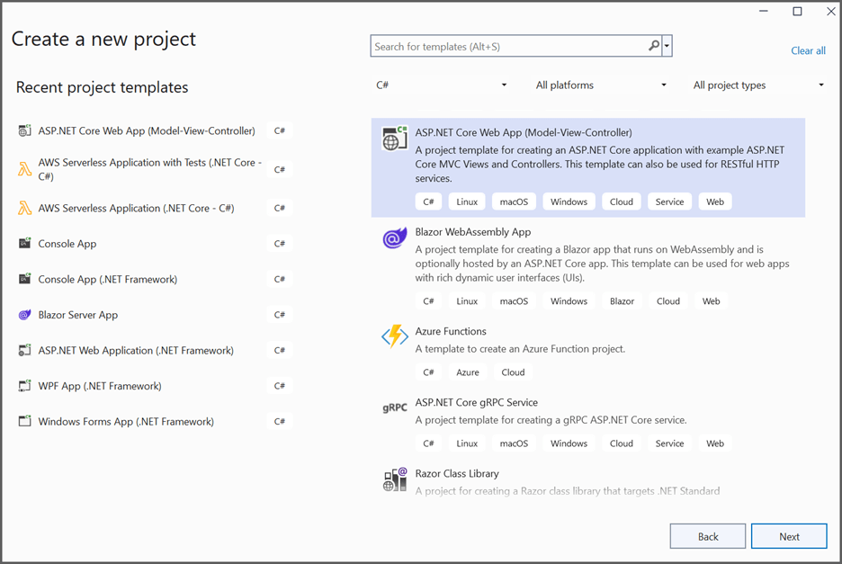

Step 2: In the configuration window, name your project and select **Next**:
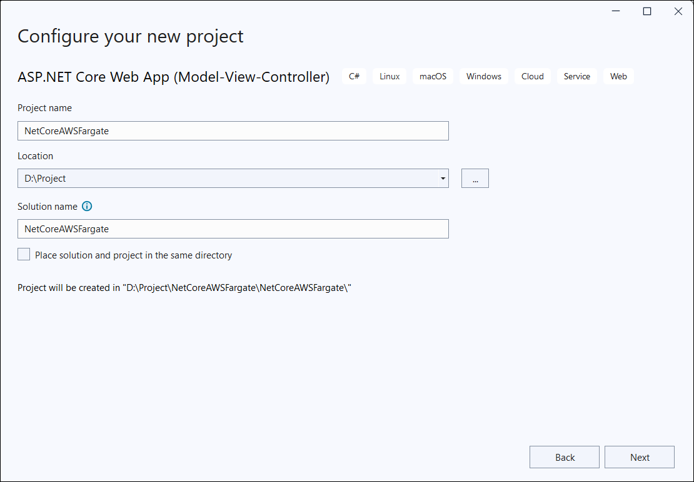

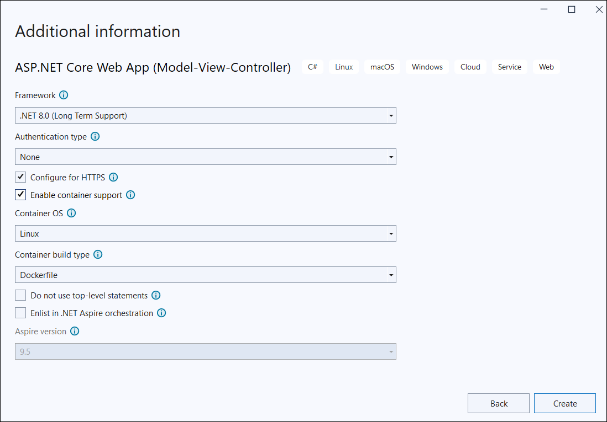

Step 3: Install the [Syncfusion.HtmlToPdfConverter.Net.Linux](https://www.nuget.org/packages/Syncfusion.HtmlToPdfConverter.Net.Linux) NuGet package into your ASP.NET Core project from [NuGet.org](https://www.nuget.org/):
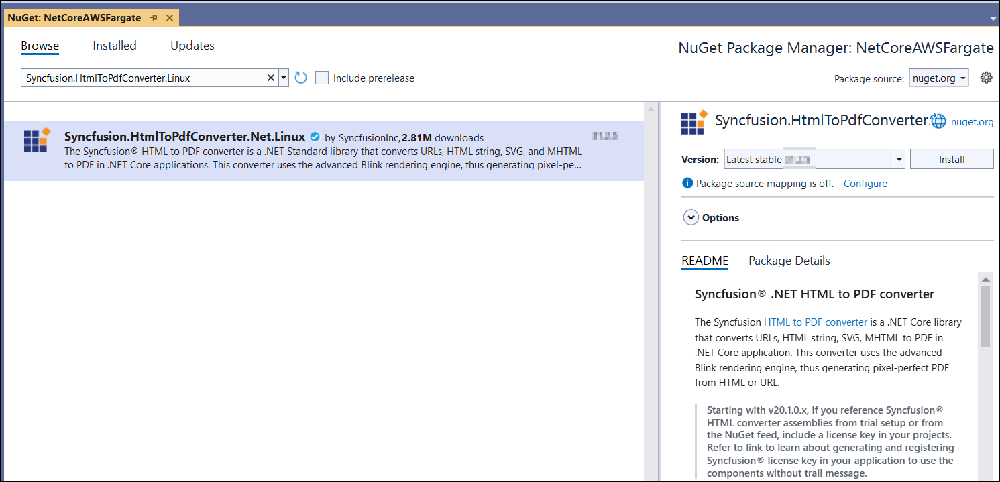

Step 4: Include the following commands in the **Dockerfile** to install the required Blink dependencies in the Docker container: 




RUN apt-get update && \
apt-get install -yq --no-install-recommends \ 
libasound2 libatk1.0-0 libc6 libcairo2 libcups2 libdbus-1-3 \ 
libexpat1 libfontconfig1 libgcc1 libgconf-2-4 libgdk-pixbuf2.0-0 libglib2.0-0 libgtk-3-0 libnspr4 \ 
libpango-1.0-0 libpangocairo-1.0-0 libstdc++6 libx11-6 libx11-xcb1 libxcb1 \ 
libxcursor1 libxdamage1 libxext6 libxfixes3 libxi6 libxrandr2 libxrender1 libxss1 libxtst6 \ 
libnss3 libgbm1




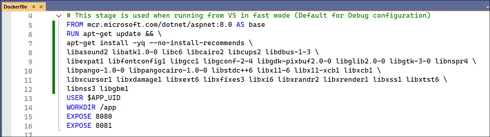

Step 5: A default controller named **HomeController.cs** is added to the ASP.NET Core MVC project. Include the following namespaces in the **HomeController.cs** file:




using Syncfusion.Pdf;
using Syncfusion.HtmlConverter;




Step 6: Add a new button in the **Index.cshtml** file as follows:




@{
    Html.BeginForm("BlinkToPDF", "Home", FormMethod.Get);
    {
        <div>
            <input type="submit" value="HTML To PDF" style="width:150px;height:27px" />
            <br />
            <div class="text-danger">
                @ViewBag.Message
            </div>
        </div>
    }
    Html.EndForm();
}




Step 7: Add a new action method named **BlinkToPDF** in **HomeController.cs** and include the following code example to convert HTML to PDF document using the [Convert](https://help.syncfusion.com/cr/document-processing/Syncfusion.HtmlConverter.HtmlToPdfConverter.html#Syncfusion_HtmlConverter_HtmlToPdfConverter_Convert_System_String_) method of the [HtmlToPdfConverter](https://help.syncfusion.com/cr/document-processing/Syncfusion.HtmlConverter.HtmlToPdfConverter.html) class. The HTML content will be scaled based on the [ViewPortSize](https://help.syncfusion.com/cr/document-processing/Syncfusion.HtmlConverter.BlinkConverterSettings.html#Syncfusion_HtmlConverter_BlinkConverterSettings_ViewPortSize) property of the [BlinkConverterSettings](https://help.syncfusion.com/cr/document-processing/Syncfusion.HtmlConverter.BlinkConverterSettings.html) class:




public IActionResult BlinkToPDF()
{
    // Initialize the HTML to PDF converter with Blink rendering engine
    HtmlToPdfConverter htmlConverter = new HtmlToPdfConverter(HtmlRenderingEngine.Blink);
    // Create Blink converter settings
    BlinkConverterSettings settings = new BlinkConverterSettings();
    // Set Blink viewport size for rendering
    settings.ViewPortSize = new Syncfusion.Drawing.Size(1280, 0);
    // Assign Blink settings to the HTML converter
    htmlConverter.ConverterSettings = settings;
    // Convert URL to PDF document
    PdfDocument document = htmlConverter.Convert("https://www.syncfusion.com");
    // Create memory stream for output
    MemoryStream stream = new MemoryStream();
    // Save the document to memory stream
    document.Save(stream);
    // Close the document and dispose resources
    document.Close(true); 
    // Return PDF file to browser
    return File(stream.ToArray(), System.Net.Mime.MediaTypeNames.Application.Pdf, "Output.pdf");
}




## Publish the ASP.NET Core application to Amazon ECS with Fargate using AWS Toolkit

Step 8: Click the **Publish Container to AWS (Legacy)** option by right-clicking the project to publish the application:
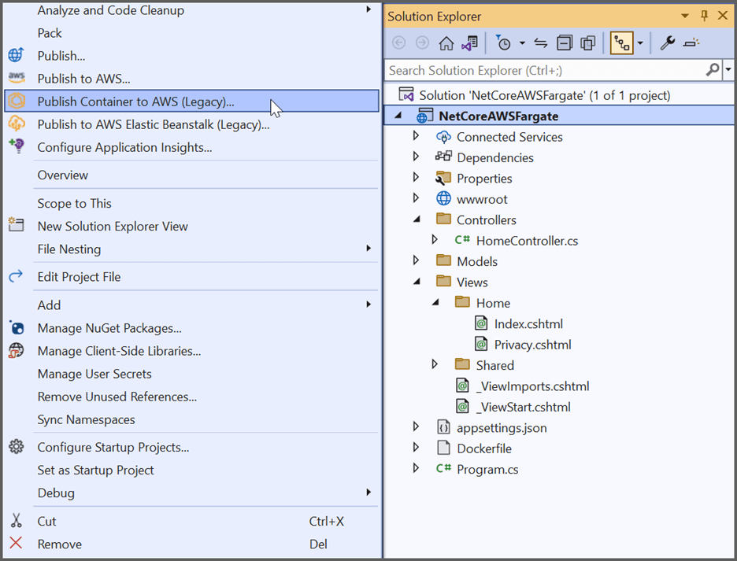

Step 9: Select the AWS account profile and region to use for deployment. Ensure **Service on an ECS Cluster** is selected as the **Deployment Target**, then click the **Next** button:
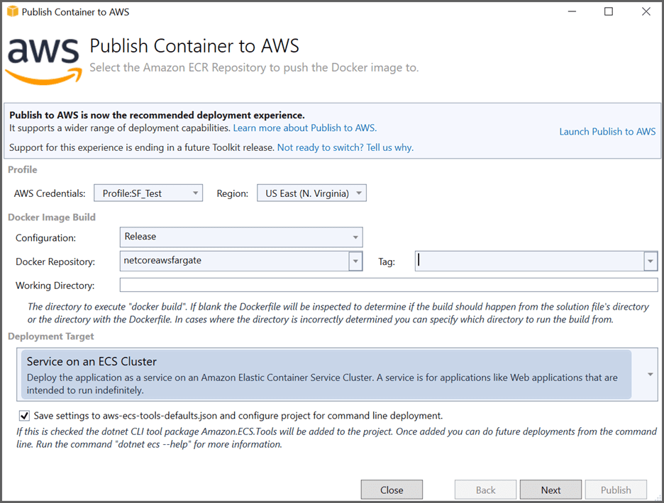

Step 10: Choose **Create an empty cluster** for the **ECS Cluster** and provide a name for the cluster. Set the **Launch Type** to **FARGATE** in the **Launch Configuration** window:
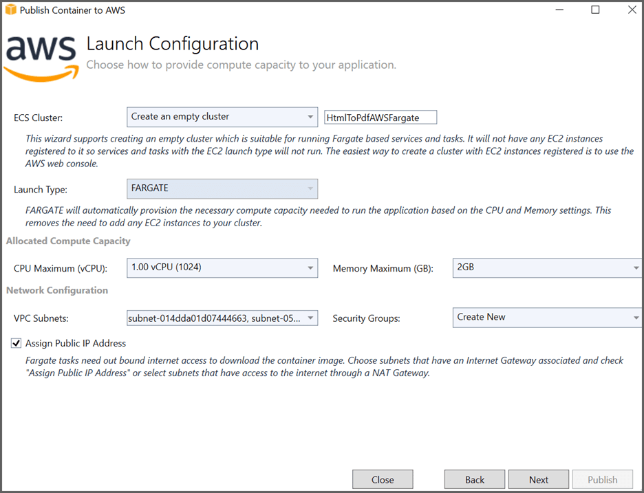

Step 11: Choose **Create New** for the service and provide a name for your service in the **Service Configuration** window:
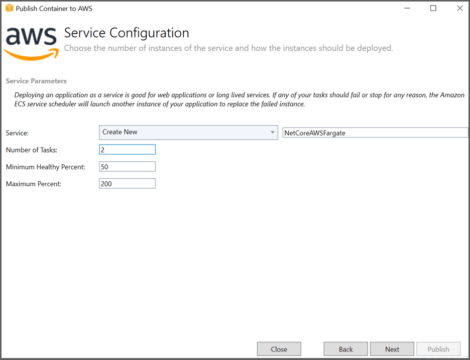

Step 12: Select **Configure Application Load Balancer** and choose **Create New** in the load balancer drop-down. Provide a name for your load balancer in the **Application Load Balancer Configuration** window:
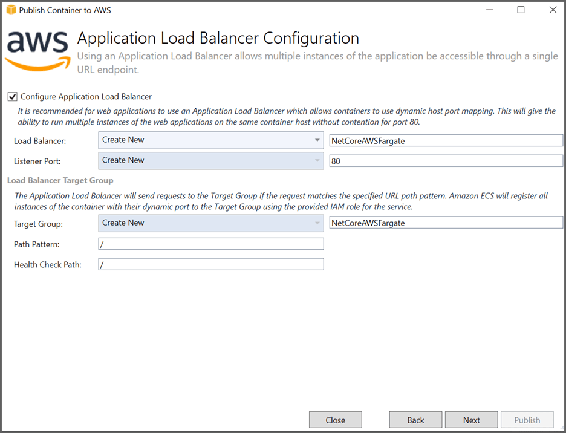

Step 13: Choose **Create New** for the task definition and enter a name for the task. Select a **Task Role** to provide AWS credentials to your application to access AWS services in the **Task Definition** window, then select **Publish**:
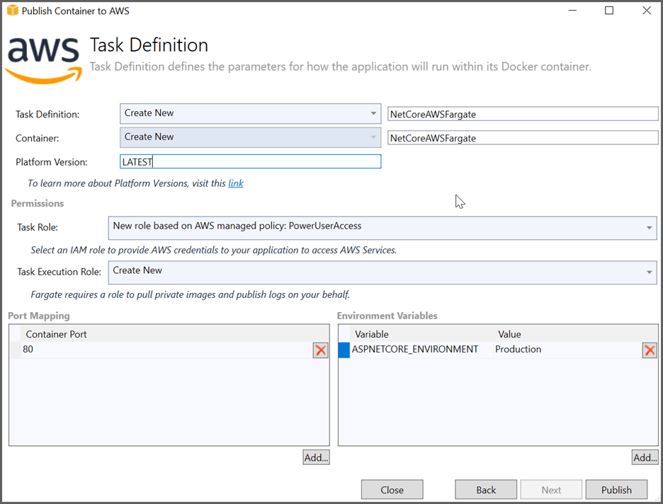
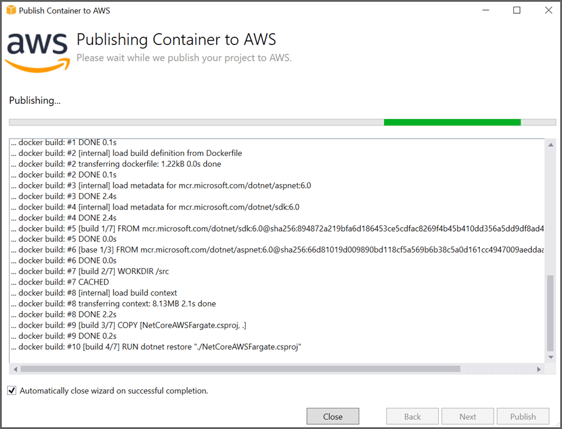

Step 14: Once the deployment process is completed, the toolkit will open a view of the cluster. Click the **Load Balancer URL** link to launch the application once the **Load Balancer** status changes to **Active**:
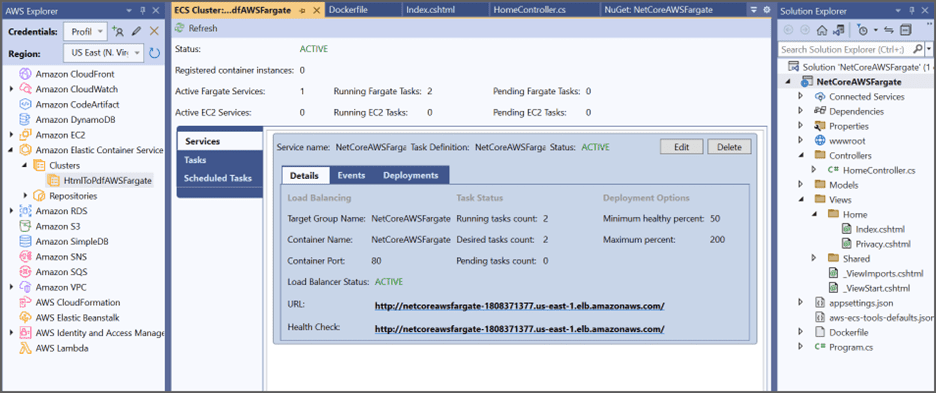

The webpage will now open in the browser. Click the button to convert the webpage to a PDF document:
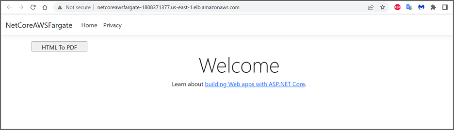

By executing the program, you will obtain the following PDF document output:


A complete working sample for converting HTML to PDF using Blink in Amazon ECS with AWS Fargate can be downloaded from [GitHub](https://github.com/SyncfusionExamples/html-to-pdf-csharp-examples/tree/master/AWS/NetCoreAWSFargate).

Click [here](https://www.syncfusion.com/document-sdk/net-pdf-library/html-to-pdf) to explore the rich set of Syncfusion<sup>&reg;</sup> HTML to PDF converter library features. 

You can also view the online sample to [convert HTML to PDF documents](https://document.syncfusion.com/demos/pdf/htmltopdf#/tailwind3) in ASP.NET Core.