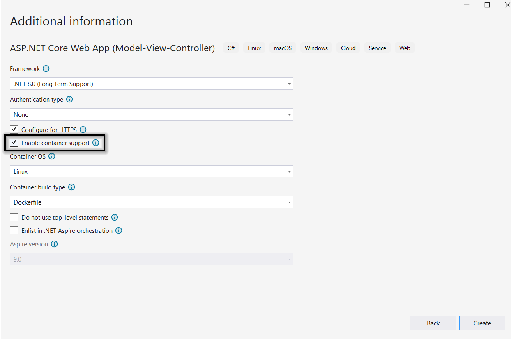
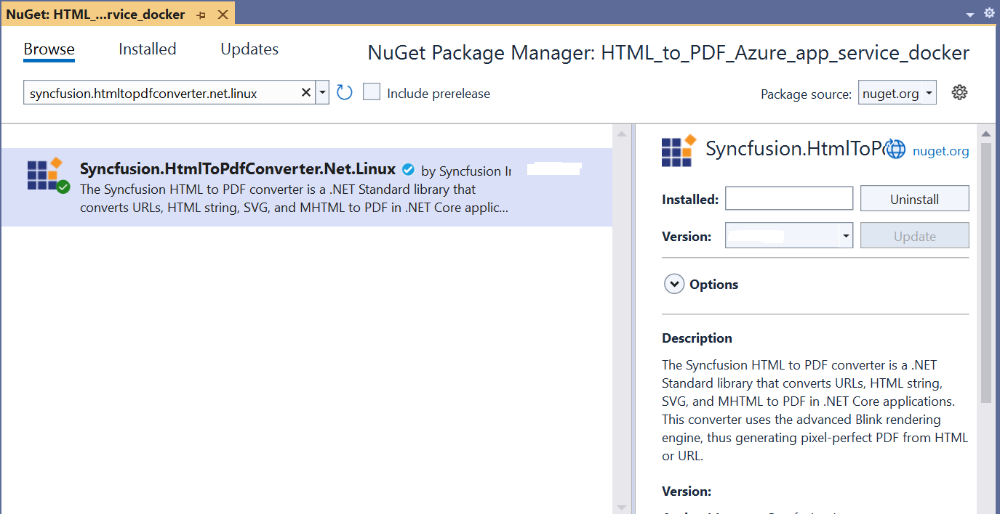
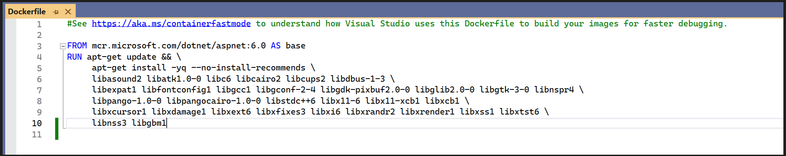
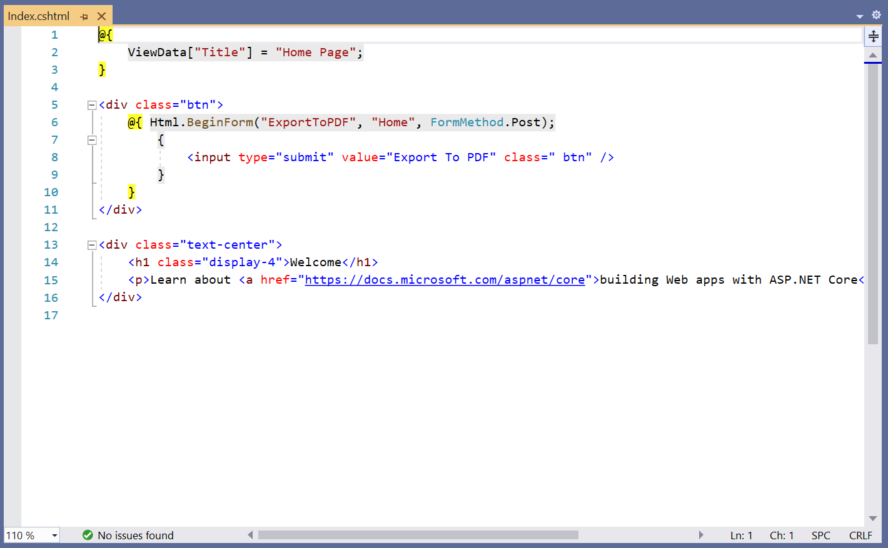
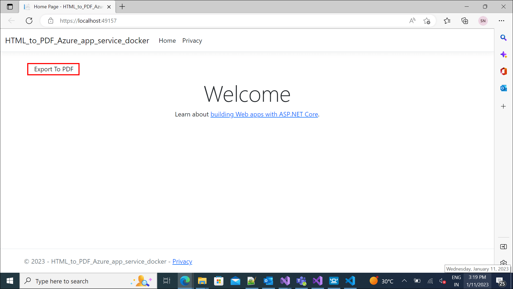
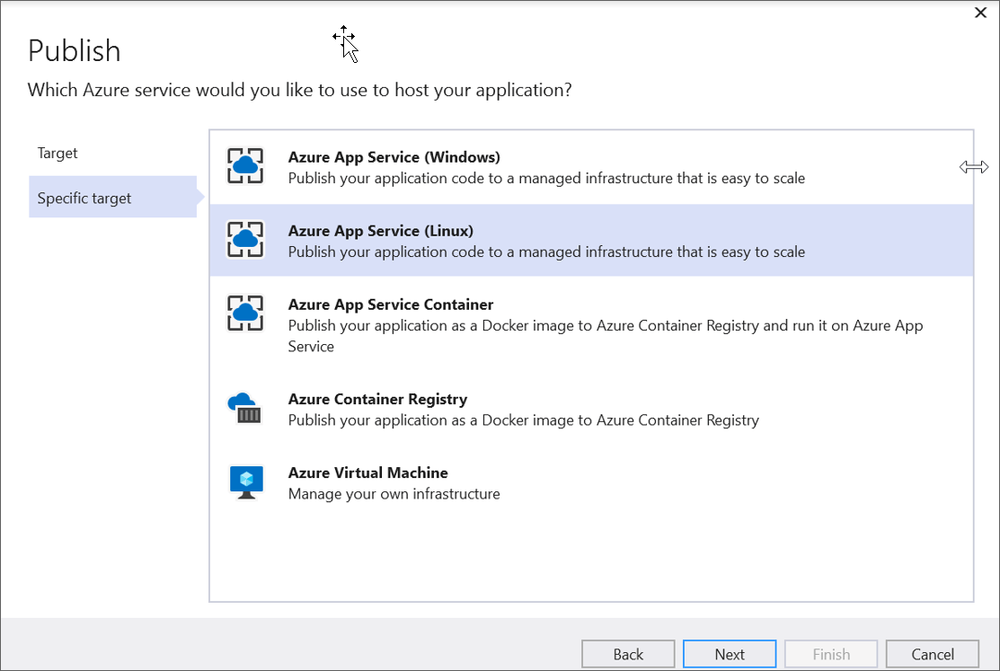
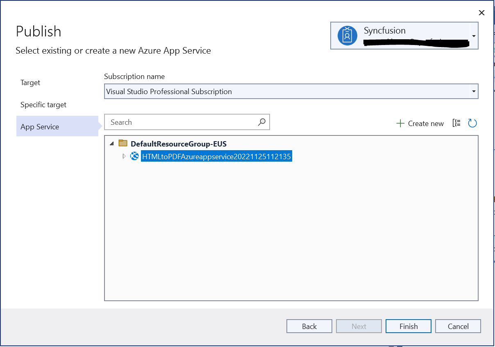
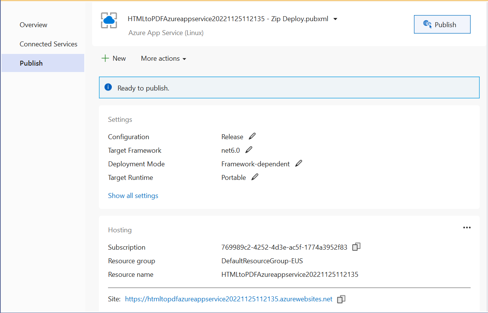
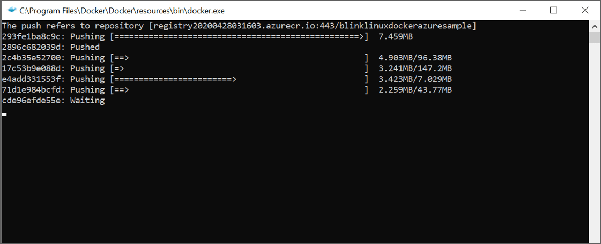

# Convert HTML to PDF in Azure App Service Linux with Docker

The [HTML to PDF converter](https://www.syncfusion.com/document-sdk/net-pdf-library/html-to-pdf) is a .NET Core library for converting webpages, SVG, MHTML, and HTML to PDF using C#. The result preserves all graphics, images, text, fonts, and the layout of the original HTML document or webpage. Using this library, you can convert HTML to PDF using C# with the Blink rendering engine in Azure App Service Linux with Docker.

## Prerequisites

**Version Compatibility**

The **Syncfusion.HtmlToPdfConverter.Net.Linux** NuGet package uses the Blink rendering engine for HTML to PDF conversion. This library is compatible with **.NET 8.0 and later** versions

**Supported Inputs**

The HTML to PDF converter supports the following input types:

- HTML String: Direct HTML content.
- URL: Web pages and online HTML content.
- HTML Files: Local HTML files.
- MHTML Files: Web archive (.mhtml/.mht) content.
- Authenticated Web Pages: Pages that require cookies, form authentication, or HTTP authentication.
- HTTP GET/POST Requests: HTML content accessed through GET or POST methods

**Required Software**

- .NET 8 SDK or later
- Linux x86_64 environment

**Register the license key**

N> Starting with v16.2.0.x, if you reference Syncfusion<sup>&reg;</sup> assemblies from trial setup or from the NuGet feed, you must add the "Syncfusion.Licensing" assembly reference and register a license key in your application. Please refer to this [link](https://help.syncfusion.com/common/essential-studio/licensing/overview) for details on registering a Syncfusion<sup>&reg;</sup> license key.

Include a license key in your **HomeController.cs** file before creating an **HtmlToPdfConverter** instance. Refer to the [Syncfusion License](https://help.syncfusion.com/common/essential-studio/licensing/overview) documentation to learn about registering the Syncfusion license key in your application.




using Syncfusion.Licensing;

public class HomeController : Controller
{
    public HomeController()
    {
        // Register the Syncfusion license
        SyncfusionLicenseProvider.RegisterLicense("YOUR LICENSE KEY");
    }
}




N> Starting from **version 29.2.4**, it is no longer necessary to manually add the following command-line arguments when using the Blink rendering engine:
N> ```csharp
N> settings.CommandLineArguments.Add("--no-sandbox");
N> settings.CommandLineArguments.Add("--disable-setuid-sandbox");
N> ```
N> These arguments are only required when using **older versions** of the library that depend on Blink in sandbox-restricted environments.

## Steps to convert HTML to PDF in Azure App Service using Blink with Linux Docker container

Step 1: Create a new ASP.NET Core application and enable Docker support with Linux as the target operating system.


Step 2: Choose your project's target framework, select **Configure for HTTPS** and enable **Docker**.


Step 3: Install the [Syncfusion.HtmlToPdfConverter.Net.Linux](https://www.nuget.org/packages/Syncfusion.HtmlToPdfConverter.Net.Linux/) NuGet package as a reference to your .NET Core application from [NuGet.org](https://www.nuget.org/).


Step 4: Add the following commands to the **Dockerfile** to install the dependency packages required for Blink rendering in the Docker container:




# Update package manager and install all required dependencies for Blink rendering engine
RUN apt-get update && \
apt-get install -yq --no-install-recommends \ 
libasound2 libatk1.0-0 libc6 libcairo2 libcups2 libdbus-1-3 \ 
libexpat1 libfontconfig1 libgcc1 libgconf-2-4 libgdk-pixbuf2.0-0 libglib2.0-0 libgtk-3-0 libnspr4 \ 
libpango-1.0-0 libpangocairo-1.0-0 libstdc++6 libx11-6 libx11-xcb1 libxcb1 \ 
libxcursor1 libxdamage1 libxext6 libxfixes3 libxi6 libxrandr2 libxrender1 libxss1 libxtst6 \ 
libnss3 libgbm1




 

Step 5: Add a new button in the **Index.cshtml** file to trigger HTML to PDF conversion:




<div class="btn">
    @{ Html.BeginForm("ExportToPDF", "Home", FormMethod.Post);
        {
            <input type="submit" value="Export To PDF" class=" btn" />
        }
     }
 </div>






Step 6: Add the following namespaces to the **HomeController.cs** file:




using Syncfusion.HtmlConverter;
using Syncfusion.Pdf;




Step 7: Add the code samples to the **HomeController** to convert HTML to PDF document using the [Convert](https://help.syncfusion.com/cr/document-processing/Syncfusion.HtmlConverter.HtmlToPdfConverter.html#Syncfusion_HtmlConverter_HtmlToPdfConverter_Convert_System_String_) method in the [HtmlToPdfConverter](https://help.syncfusion.com/cr/document-processing/Syncfusion.HtmlConverter.HtmlToPdfConverter.html) class with [BlinkConverterSettings](https://help.syncfusion.com/cr/document-processing/Syncfusion.HtmlConverter.BlinkConverterSettings.html):




public ActionResult ExportToPDF()
{
    // Initialize HTML to PDF converter with default Blink rendering engine
    HtmlToPdfConverter htmlConverter = new HtmlToPdfConverter();
    // Create Blink converter settings for Docker container environment
    BlinkConverterSettings settings = new BlinkConverterSettings();
    // Assign converter settings to the HTML converter instance
    htmlConverter.ConverterSettings = settings;
    // Convert URL to PDF document using Blink rendering engine
    PdfDocument document = htmlConverter.Convert("https://www.syncfusion.com");
    // Create memory stream to store the converted PDF bytes
    MemoryStream stream = new MemoryStream();
    // Save PDF document to memory stream
    document.Save(stream);
    // Return PDF file as file download response to the browser
    return File(stream.ToArray(), System.Net.Mime.MediaTypeNames.Application.Pdf, "URL_to_PDF.pdf");
}




Step 8: Build and run the sample in Docker. Docker will pull the Linux image from Docker Hub and run the project. The webpage will open in your browser. Click the button to convert the Syncfusion<sup>&reg;</sup> webpage to a PDF.


By executing the program, you will obtain the following PDF document output:
 

## Deploy the Docker container to Azure Container Instance

Step 1: Create a publish target to deploy the Docker image to Azure.


Step 2: Create Azure App Service with resource group, hosting plan, and container registry.


Step 3: Publish the Docker image to Azure Container Instance.


Step 4: The deployment process will push the Docker image to the Azure Container Registry and deploy it to the Azure Container Instance.


Step 5: After successful deployment, the Azure website will open in your browser.


Step 6: Click the button to convert the Syncfusion<sup>&reg;</sup> webpage to a PDF document. You will obtain the following PDF document output:


A complete working sample for converting HTML to PDF in Azure App Service with Docker can be downloaded from [GitHub](https://github.com/SyncfusionExamples/html-to-pdf-csharp-examples/tree/master/Azure/HTML_to_PDF_Azure_app_service_docker).

Click [here](https://www.syncfusion.com/document-sdk/net-pdf-library/html-to-pdf) to explore the rich set of Syncfusion<sup>&reg;</sup> HTML to PDF converter library features. 

You can also view the online sample to [convert HTML to PDF documents](https://document.syncfusion.com/demos/pdf/htmltopdf#/tailwind3) in ASP.NET Core.
