# Convert HTML to PDF in Azure App Service on Linux

The [HTML to PDF converter](https://www.syncfusion.com/document-sdk/net-pdf-library/html-to-pdf) is a .NET Core library for converting webpages, SVG, MHTML, and HTML to PDF using C#. The result preserves all graphics, images, text, fonts, and the layout of the original HTML document or webpage. Using this library, you can convert HTML to PDF using C# with the Blink rendering engine in Azure App Service on Linux.

## Prerequisites

**Version Compatibility**

The **Syncfusion.HtmlToPdfConverter.Net.Linux** NuGet package uses the Blink rendering engine for HTML to PDF conversion. This library is compatible with **.NET 8.0 and later** versions

**Supported Inputs**

The HTML to PDF converter supports the following input types:

- HTML String: Direct HTML content.
- URL: Web pages and online HTML content.
- HTML Files: Local HTML files.
- MHTML Files: Web archive (.mhtml/.mht) content.
- Authenticated Web Pages: Pages that require cookies, form authentication, or HTTP authentication.
- HTTP GET/POST Requests: HTML content accessed through GET or POST methods

**Required Software**

- .NET 8 SDK or later
- Linux x86_64 environment

**Register the license key**

N> Starting with v16.2.0.x, if you reference Syncfusion<sup>&reg;</sup> assemblies from trial setup or from the NuGet feed, you must add the "Syncfusion.Licensing" assembly reference and register a license key in your application. Please refer to this [link](https://help.syncfusion.com/common/essential-studio/licensing/overview) for details on registering a Syncfusion<sup>&reg;</sup> license key.

Include a license key in your **HomeController.cs** file before creating an **HtmlToPdfConverter** instance. Refer to the [Syncfusion License](https://help.syncfusion.com/common/essential-studio/licensing/overview) documentation to learn about registering the Syncfusion license key in your application.




using Syncfusion.Licensing;

namespace BlinkHtmlConversion.Controllers
{
    public class HomeController : Controller
    {
        public HomeController()
        {
            // Register the Syncfusion license
            SyncfusionLicenseProvider.RegisterLicense("YOUR LICENSE KEY");
        }
    }
}




N> Starting from **version 29.2.4**, it is no longer necessary to manually add the following command-line arguments when using the Blink rendering engine:
N> ```csharp
N> settings.CommandLineArguments.Add("--no-sandbox");
N> settings.CommandLineArguments.Add("--disable-setuid-sandbox");
N> ```
N> These arguments are only required when using **older versions** of the library that depend on Blink in sandbox-restricted environments.

## Steps to convert HTML to PDF in Azure App Service on Linux

Step 1: Create a new ASP.NET Core MVC application.
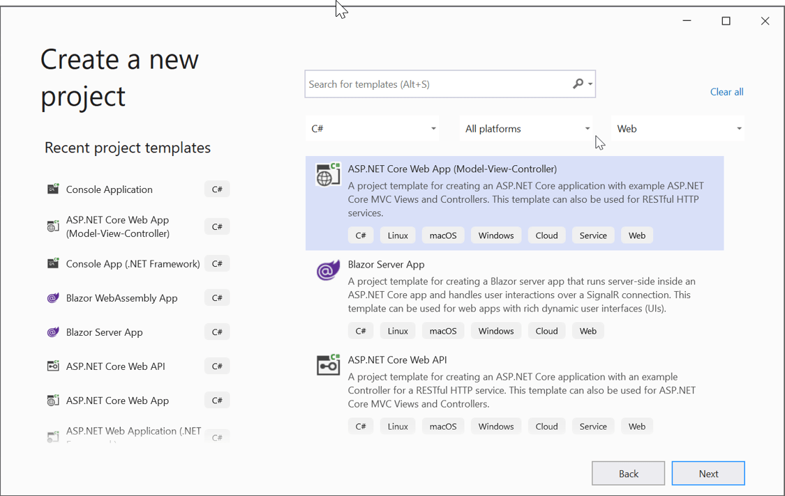  

Step 2: Choose your project's target framework and select Configure for HTTPS.
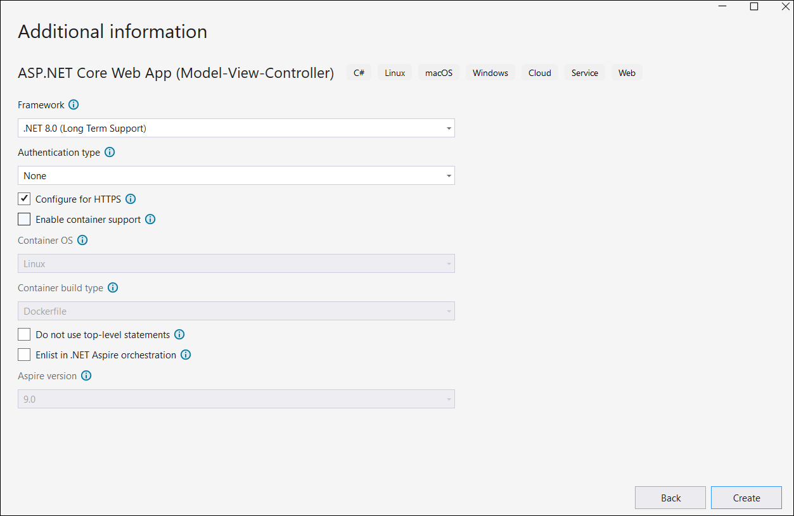 

Step 3: Install the [Syncfusion.HtmlToPdfConverter.Net.Linux](https://www.nuget.org/packages/Syncfusion.HtmlToPdfConverter.Net.Linux/) NuGet package as a reference to your .NET Core application from [NuGet.org](https://www.nuget.org/).
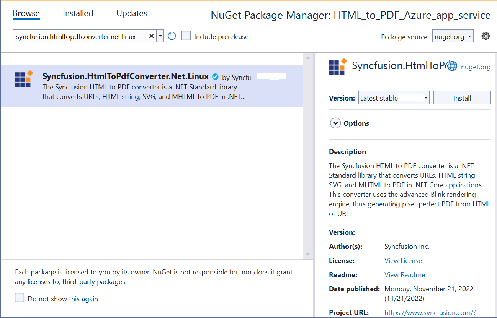

There are two ways to install the dependency packages to Azure server:
* Using SSH from Azure portal.
* By running the commands from C#.

### Method 3.1: Using SSH command line

1. After publishing the web application, log in to the Azure portal in a web interface and open the published app service. Under Development Tools Menu, open the SSH and click the go link.
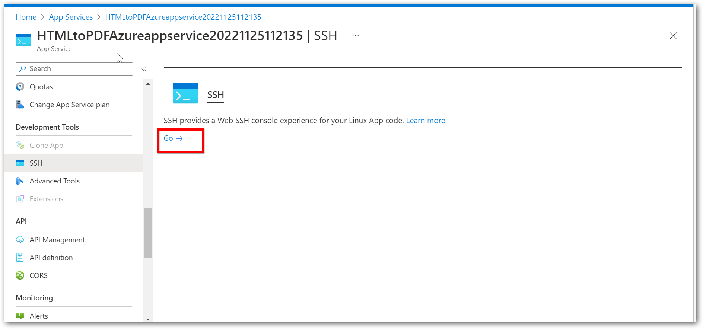

2. From the terminal window, you can install the dependency packages. Use the following single command to install all dependency packages:




apt-get update && apt-get install -yq --no-install-recommends  libasound2 libatk1.0-0 libc6 libcairo2 libcups2 libdbus-1-3 libexpat1 libfontconfig1 libgcc1 libgconf-2-4 libgdk-pixbuf2.0-0 libglib2.0-0 libgtk-3-0 libnspr4 libpango-1.0-0 libpangocairo-1.0-0 libstdc++6 libx11-6 libx11-xcb1 libxcb1 libxcursor1 libxdamage1 libxext6 libxfixes3 libxi6 libxrandr2 libxrender1 libxss1 libxtst6 libnss3 libgbm1




N> By following the above steps in Method 3.1, you need to install dependencies through SSH after each publishing of the web application.

### Method 3.2: Running the commands from C#

1. Create a shell file with the above commands in the project and name it **dependenciesInstall.sh**. In this article, these steps are followed to install dependency packages: 
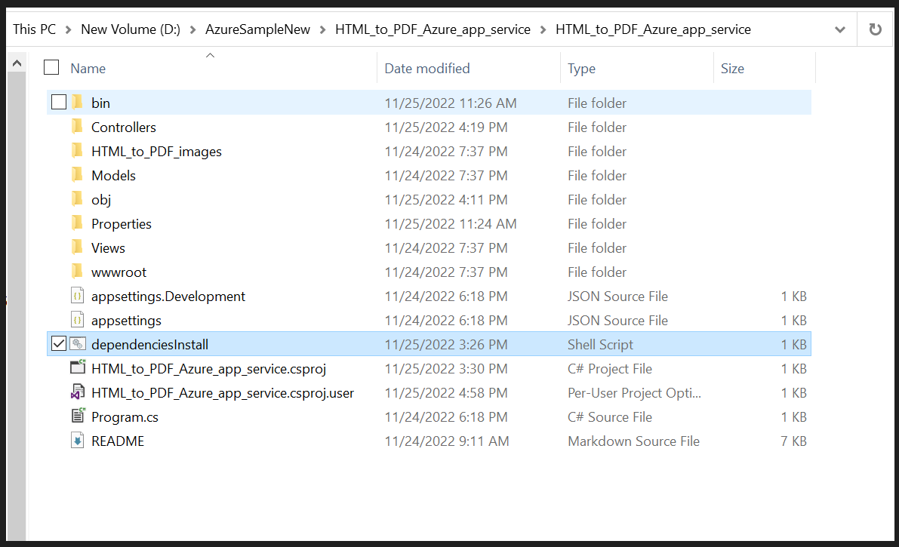 

2. Set Copy to Output Directory as "Copy if newer" to the **dependenciesInstall.sh** file.
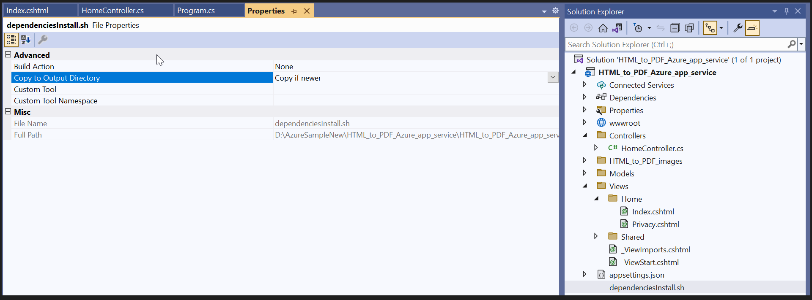

3. Include the following code snippet to install the dependency packages in the Configure method in the **Startup.cs** file:




// Install the dependency packages for HTML to PDF conversion on Linux Azure App Service
string shellFilePath = System.IO.Path.Combine(env.ContentRootPath, "dependenciesInstall.sh");
InstallDependencies(shellFilePath);







private void InstallDependencies(string shellFilePath) 
{
      // Create a new process to execute the bash shell script
      Process process = new Process
      {
            StartInfo = new ProcessStartInfo
            {
                  // Use bash shell to execute the script
                  FileName = "/bin/bash",
                  // Pass the shell file path as argument with "-c" flag
                  Arguments = "-c " + shellFilePath,
                  // Run process without creating a visible window
                  CreateNoWindow = true,
                  // Do not use shell execute
                  UseShellExecute = false,
             }
      };
      // Start the process and wait for completion
      process.Start();
      process.WaitForExit();
}




N> By following the above steps in Method 3.2, you can deploy your application to Azure App Service Linux without needing to install dependencies through SSH.

Step 4: Add an Export to the PDF button in the index.cshtml.




<div class="btn">
    @{ Html.BeginForm("ExportToPDF", "Home", FormMethod.Post);
        {
            <input type="submit" value="Export To PDF" class=" btn" />
        }
    }
</div>




Step 5: Add the following namespaces to the **HomeController.cs** file:




using Syncfusion.HtmlConverter;
using Syncfusion.Pdf;
using System.Diagnostics;




Step 6: Add the code samples in the **HomeController** to convert HTML to PDF document using the [Convert](https://help.syncfusion.com/cr/document-processing/Syncfusion.HtmlConverter.HtmlToPdfConverter.html#Syncfusion_HtmlConverter_HtmlToPdfConverter_Convert_System_String_) method in the [HtmlToPdfConverter](https://help.syncfusion.com/cr/document-processing/Syncfusion.HtmlConverter.HtmlToPdfConverter.html) class with [BlinkConverterSettings](https://help.syncfusion.com/cr/document-processing/Syncfusion.HtmlConverter.BlinkConverterSettings.html):




public ActionResult ExportToPDF()
{
    // Set development environment for Azure App Service
    Environment.SetEnvironmentVariable("ASPNETCORE_ENVIRONMENT", "Development");
    // Install the dependency packages for HTML to PDF conversion on Linux
    string shellFilePath = System.IO.Path.Combine(env.ContentRootPath, "dependenciesInstall.sh");
    InstallDependencies(shellFilePath);
    // Initialize HTML to PDF converter with default Blink rendering engine
    HtmlToPdfConverter htmlConverter = new HtmlToPdfConverter();
    // Create Blink converter settings for output configuration
    BlinkConverterSettings settings = new BlinkConverterSettings();
    // Assign converter settings to the HTML converter instance
    htmlConverter.ConverterSettings = settings;
    // Convert URL to PDF document using Blink rendering engine
    PdfDocument document = htmlConverter.Convert("http://www.syncfusion.com");
    // Create memory stream to store the converted PDF document
    MemoryStream stream = new MemoryStream();
    // Save PDF document to memory stream
    document.Save(stream);
    // Reset stream position to beginning for reading
    stream.Position = 0;
    // Close the PDF document and release resources
    document.Close(true);
    // Define MIME type for PDF file download
    string contentType = "application/pdf";
    // Define the output file name for the browser download
    string fileName = "URL_to_PDF.pdf";
    // Return PDF file as file download response to the browser
    return File(stream, contentType, fileName);
}

private void InstallDependencies(string shellFilePath)
{
    // Create a new process to execute the bash shell script
    Process process = new Process
    {
        StartInfo = new ProcessStartInfo
        {
            // Use bash shell to execute dependency installation script
            FileName = "/bin/bash",
            // Pass the shell script path as command argument
            Arguments = "-c " + shellFilePath,
            // Run process without creating a visible window
            CreateNoWindow = true,
            // Do not use shell execute to allow direct process invocation
            UseShellExecute = false,
        }
    };
    // Start the process
    process.Start();
    // Wait for the process to complete before continuing
    process.WaitForExit();
}




## Steps to publish to Azure App Service Linux

Step 1: Right-click the project and select **Publish**.
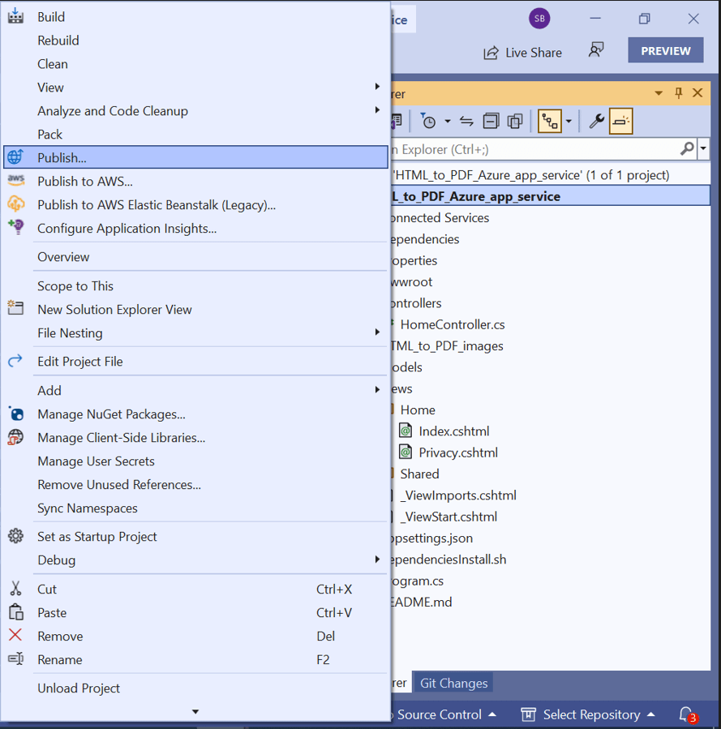

Step 2: Create a new profile in the publish target window.
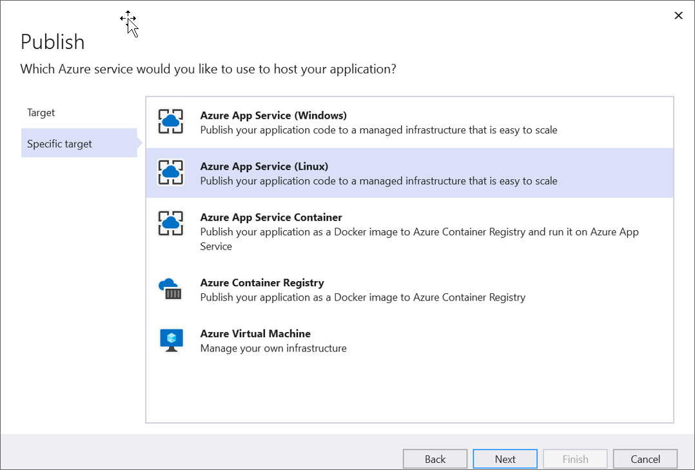

Step 3: Create App Service using your Azure subscription and select a hosting plan.
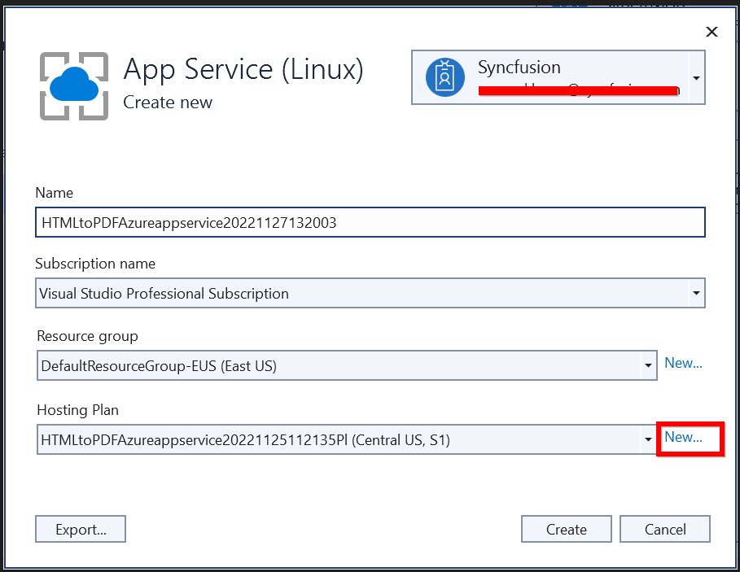

Step 4: HTML to PDF conversion works on basic hosting plans (B1 to P3). Select the appropriate hosting plan as required. **Note**: HTML to PDF conversion will not work on Free/Shared hosting plans.
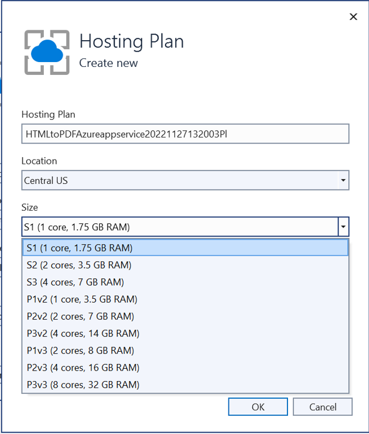

Step 5: After creating a profile, click the **Publish** button.
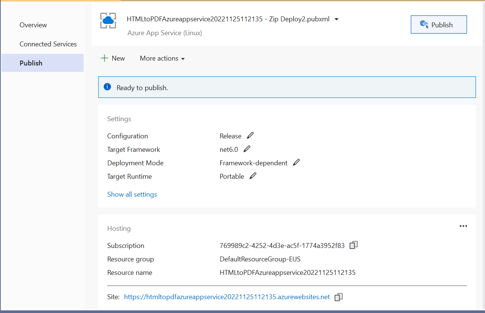

The published webpage will open in your browser. Click the **Export To PDF** button to convert the Syncfusion<sup>&reg;</sup> webpage to a PDF document.


A complete working sample for converting HTML to PDF in Azure App Service on Linux can be downloaded from [GitHub](https://github.com/SyncfusionExamples/html-to-pdf-csharp-examples/tree/master/Azure/HTML_to_PDF_Azure_app_service).

Click [here](https://www.syncfusion.com/document-sdk/net-pdf-library/html-to-pdf) to explore the rich set of Syncfusion<sup>&reg;</sup> HTML to PDF converter library features. 

You can also view the online sample to [convert HTML to PDF documents](https://document.syncfusion.com/demos/pdf/htmltopdf#/tailwind3) in ASP.NET Core.

