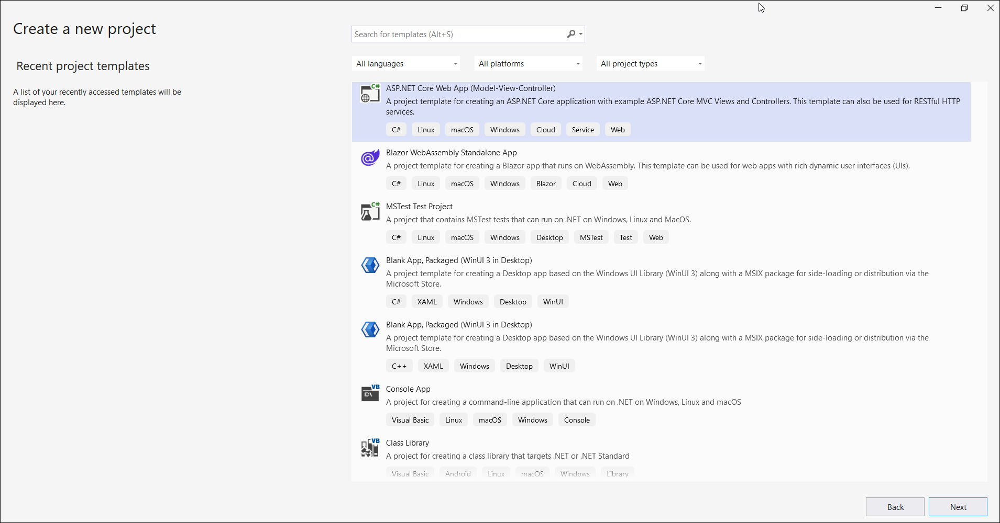

# Convert HTML to PDF file in Azure App Service on Windows

As the Azure Windows platform is a Sandbox environment, the default HTML rendering engine Blink used in our HTML to PDF conversion is incompatible due to GDI Limitations. It is recommended that you use [Azure web applications in the Linux container.](https://help.syncfusion.com/document-processing/pdf/conversions/html-to-pdf/net/convert-html-to-pdf-in-azure-app-service-linux) For converting HTML to PDF in Azure Windows you can use the following approach that fit your requirement,

* [CefSharp](https://www.nuget.org/packages/CefSharp.OffScreen.NETCore/119.4.30) - this open-source library comes under a [BSD](https://github.com/cefsharp/CefSharp/blob/master/README.md) license.

## Steps to convert HTML to PDF file in Azure App Service on Windows using CefSharp

Step 1: Create a new ASP.NET Core Web App (Model-View-Controller).

Step 2: Create a project name and select the location.

Step 3: Click **Create**. 

Step 4: Install the [Syncfusion.HtmlToPdfConverter.Cef.Net.Windows](https://www.nuget.org/packages/Syncfusion.HtmlToPdfConverter.Cef.Net.Windows) NuGet package to reference your project using the [nuget.org](https://www.nuget.org/).

N> Starting with v16.2.0.x, if you reference Syncfusion assemblies from the trial setup or NuGet feed, you also have to add the "Syncfusion.Licensing" assembly reference and include a license key in your projects. Please refer to this [link](https://help.syncfusion.com/common/essential-studio/licensing/overview) to learn about registering the Syncfusion license key in your application to use our components.

Step 5: A default action method named Index will be present in *HomeController.cs*. Right-click on the Index method and select **Go To View**, where you will be directed to its associated view page *Index.cshtml*. Add a new button in the *Index.cshtml* as follows.




@{
    Html.BeginForm("ConvertToPdf", "Home", FormMethod.Get);
    {
        

            <input type="submit" value="Convert To PDF" style="width:200px;height:27px" />
        

    }
    Html.EndForm();
}




Step 6: Include the following namespaces in *HomeController.cs*.




    using Syncfusion.HtmlConverter;
    using Syncfusion.Pdf;




Step 7: Add a new action method named ConvertToPdf in the HomeController.cs file and include the following code example to convert HTML to PDF document in *HomeController.cs*. 




    public IActionResult ConvertToPdf()
    {
        //Initialize HTML to PDF converter.
        HtmlToPdfConverter htmlConverter = new HtmlToPdfConverter(HtmlRenderingEngine.Cef);
        CefConverterSettings cefConverterSettings = new CefConverterSettings();
        //Set Blink viewport size.
        cefConverterSettings.ViewPortSize = new Syncfusion.Drawing.Size(1280, 0);
        //Assign Blink converter settings to HTML converter.
        htmlConverter.ConverterSettings = cefConverterSettings;
        //Convert URL to PDF document.
        PdfDocument document = htmlConverter.Convert("https://www.google.com");
        //Create memory stream.
        MemoryStream stream = new MemoryStream();
        //Save and close the document. 
        document.Save(stream);
        document.Close();
        return File(stream.ToArray(), System.Net.Mime.MediaTypeNames.Application.Pdf, "HTML-to-PDF.pdf");
    }




Step 8: Refer the steps to [publish](https://help.syncfusion.com/document-processing/pdf/conversions/html-to-pdf/net/convert-html-to-pdf-in-azure-app-service-windows#steps-to-publish-as-azure-app-service-on-windows) as Azure App Service on Windows 

Step 9: Open the created web app service in the Azure portal. Go to Settings -> Configuration -> Platform settings and change the platform to 64-bit.

Step 10: After completing the publish profile setup, click the publish.

Step 11: Publish will be succeeded and the published webpage will open in the browser. Click ExportToPDF button to perform the conversion.

You can download a complete working sample from [GitHub](https://github.com/SyncfusionExamples/html-to-pdf-csharp-examples/tree/master/Azure/HTML-to-PDF-Azure%20App%20Service-Windows-CefSharp).

## Steps to publish as Azure App Service on Windows 

Step 1: Right-click the project and select the **Publish** option.

Step 2: Click **Add a Publish Profile**.

Step 3: Select the publish target as **Azure**.

Step 4: Select the Specific target as **Azure App Service (Windows)**.

Step 5: Click the **Create new** option to create a new app service.

Step 6: Click **Create** to proceed with **App Service** creation.

Step 7: Click **Finish** to finalize the **App Service** creation.

Step 8: Click **Close**.

Step 9: Click **Publish**.

Step 10: Now, Publish has succeeded.

Step 11: Now, the published webpage will open in the browser.

Step 12: Select a PDF document and click **Export to PDF** to create a PDF document. You will get the output PDF document as follows.

