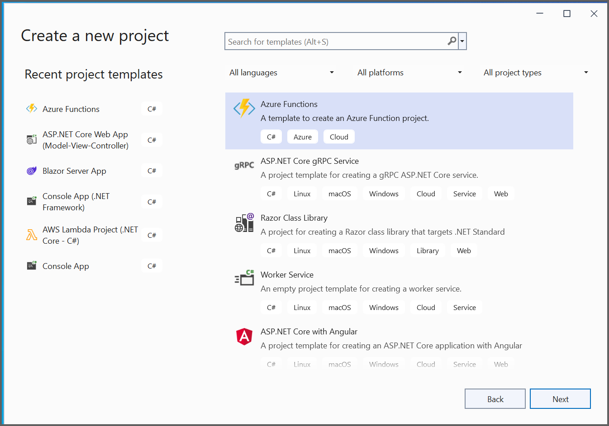
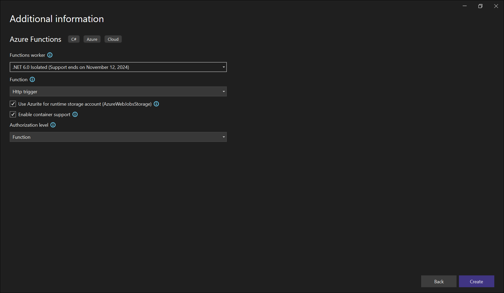
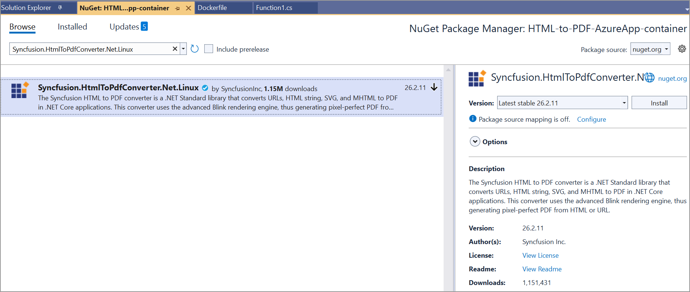
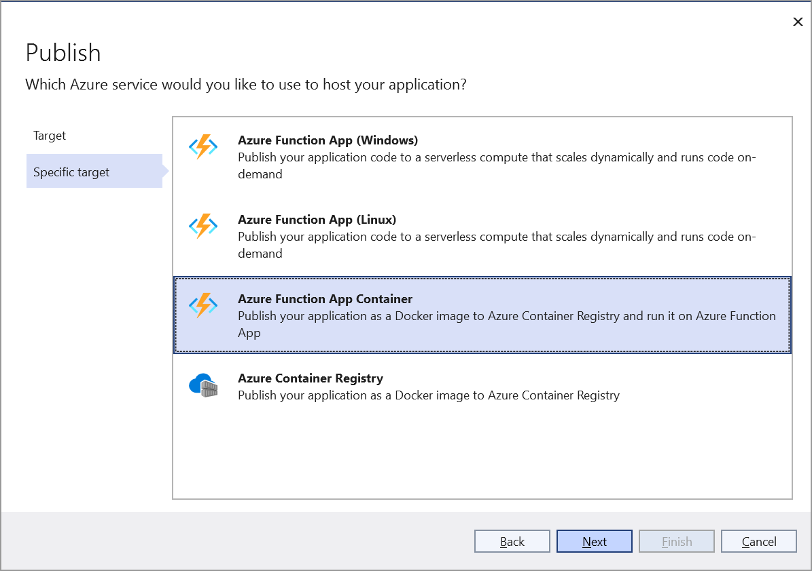
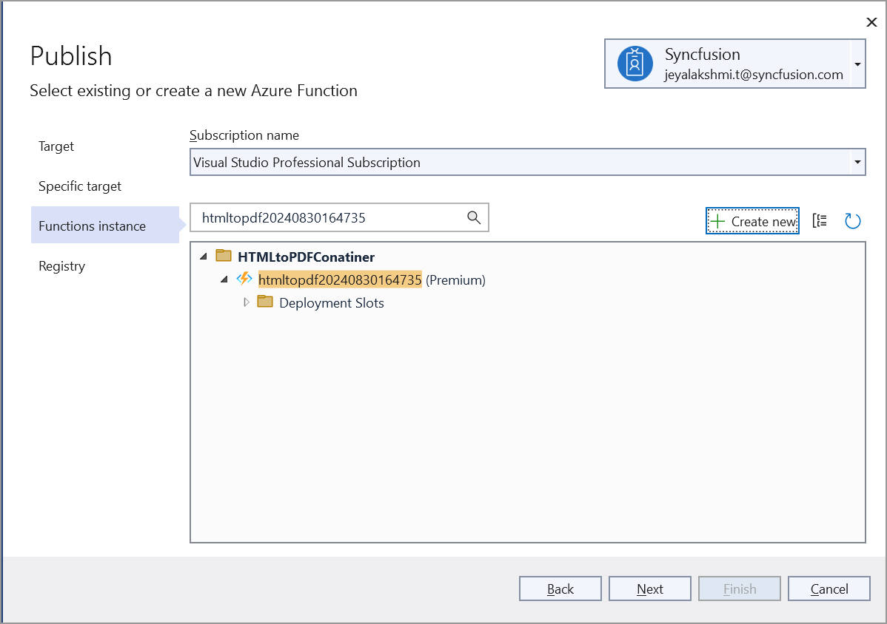
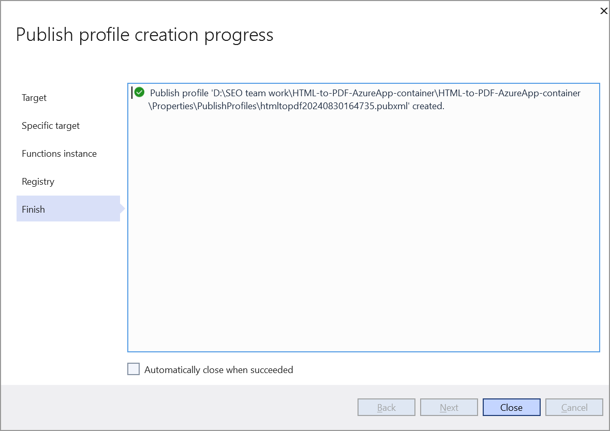
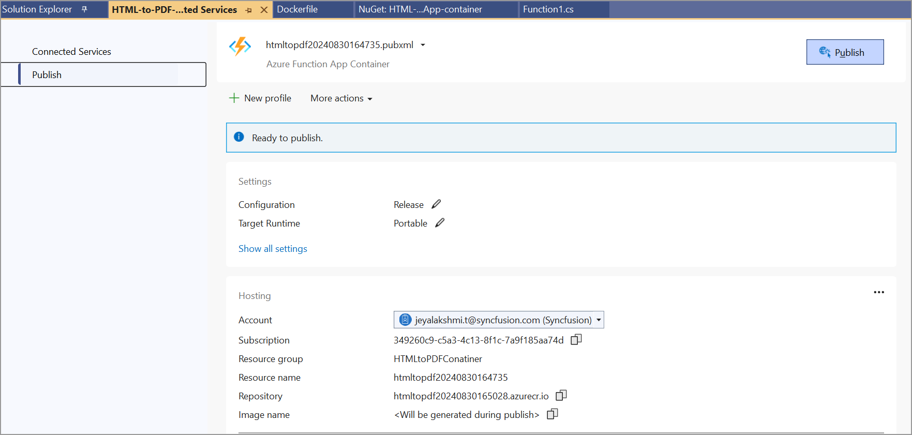

# Convert HTML to PDF in Azure Function App container in Linux

The Syncfusion&reg; [HTML to PDF converter](https://www.syncfusion.com/document-processing/pdf-framework/net/html-to-pdf) is a .NET Core library for converting webpages, SVG, MHTML, and HTML to PDF using C#. The result preserves all graphics, images, text, fonts, and the layout of the original HTML document or webpage. Using this library, you can convert an HTML to PDF using C# with the Blink rendering engine in Azure Function App container in Linux.

N> HTML to PDF converter is not supported with Azure App Service windows. We internally use Blink rendering engine for the conversion, it uses GDI calls for viewing and rendering the webpages. But Azure app service blocks GDI calls in the Azure website environment. As the Azure website does not have the elevated permission and enough rights, we can not launch the Chrome headless browser in the Azure app service windows (Azure website and Azure function).

## Steps to convert HTML to PDF in Azure Function App container in Linux

Step 1: Create the Azure function project using Visual Studio template.

Step 2: Select the .NET version.

Step 3: Install the [Syncfusion.HtmlToPdfConverter.Net.Linux](https://www.nuget.org/packages/Syncfusion.HtmlToPdfConverter.Net.Linux/) NuGet package as a reference to your .NET Core application [NuGet.org](https://www.nuget.org/).

N> Starting with v16.2.0.x, if you reference Syncfusion&reg; assemblies from trial setup or from the NuGet feed, you also have to add "Syncfusion.Licensing" assembly reference and include a license key in your projects. Please refer to this [link](https://help.syncfusion.com/common/essential-studio/licensing/overview) to know about registering Syncfusion&reg; license key in your application to use our components.

Step 4: Include the following namespace in your Function1.cs file.



    using Syncfusion.HtmlConverter;
    using Syncfusion.Pdf;
    using Syncfusion.Pdf.Graphics;



Step 5:  Include the following code snippet in your function1.cs file.



[Function("Function1")]
public IActionResult Run([HttpTrigger(AuthorizationLevel.Anonymous, "get", "post")] HttpRequest req)
{
    string blinkBinariesPath = string.Empty;
    MemoryStream ms = null;

    try
    {
        // Attempt to initialize Blink binaries
        blinkBinariesPath = SetupBlinkBinaries();
        // Initialize the HTML to PDF converter with the Blink rendering engine.
        HtmlToPdfConverter htmlConverter = new HtmlToPdfConverter(HtmlRenderingEngine.Blink);
        BlinkConverterSettings settings = new BlinkConverterSettings();
        // Set command line arguments to run without sandbox.
        settings.CommandLineArguments.Add("--no-sandbox");
        settings.CommandLineArguments.Add("--disable-setuid-sandbox");
        settings.BlinkPath = blinkBinariesPath;
        // Assign BlinkConverter settings to the HTML converter
        htmlConverter.ConverterSettings = settings;
        // Convert URL to PDF
        PdfDocument document = htmlConverter.Convert("https://www.google.com/");
        ms = new MemoryStream();
        // Save and close the PDF document  
        document.Save(ms);
        document.Close(true);
    }
    catch (Exception ex)
    {
        // Handle any exception by creating an error PDF document
        PdfDocument document = new PdfDocument();
        PdfPage page = document.Pages.Add();
        PdfGraphics graphics = page.Graphics;
        PdfFont font = new PdfStandardFont(PdfFontFamily.Helvetica, 20);
        // Draw the exception message in the PDF
        graphics.DrawString(ex.Message, font, PdfBrushes.Black, new Syncfusion.Drawing.PointF(0, 0));
        ms = new MemoryStream();
        document.Save(ms);
        document.Close(true);
    }
    ms.Position = 0;
    return new FileStreamResult(ms, "application/pdf");
}

private static string SetupBlinkBinaries()
{
    string blinkAppDir = Path.Combine("/home/site/wwwroot/runtimes/linux/native");
    string tempBlinkDir = Path.GetTempPath();
    string chromePath = Path.Combine(tempBlinkDir, "chrome");
    if (!File.Exists(chromePath))
    {
        CopyFilesRecursively(blinkAppDir, tempBlinkDir);
        SetExecutablePermission(tempBlinkDir);
    }
    return tempBlinkDir;
}

private static void CopyFilesRecursively(string sourcePath, string targetPath)
{
    //Create all the directories from the source to the destination path.
    foreach (string dirPath in Directory.GetDirectories(sourcePath, "*", SearchOption.AllDirectories))
    {
        Directory.CreateDirectory(dirPath.Replace(sourcePath, targetPath));
    }
    //Copy all the files from the source path to the destination path.
    foreach (string newPath in Directory.GetFiles(sourcePath, "*.*", SearchOption.AllDirectories))
    {
        File.Copy(newPath, newPath.Replace(sourcePath, targetPath), true);
    }
}

[DllImport("libc", SetLastError = true, EntryPoint = "chmod")]
internal static extern int Chmod(string path, FileAccessPermissions mode);
private static void SetExecutablePermission(string tempBlinkDir)
{
    FileAccessPermissions ExecutableFilePermissions = FileAccessPermissions.UserRead | FileAccessPermissions.UserWrite | FileAccessPermissions.UserExecute |
    FileAccessPermissions.GroupRead | FileAccessPermissions.GroupExecute | FileAccessPermissions.OtherRead | FileAccessPermissions.OtherExecute;
    string[] executableFiles = new string[] { "chrome", "chrome_sandbox" };
    foreach (string executable in executableFiles)
    {
        var execPath = Path.Combine(tempBlinkDir, executable);
        if (File.Exists(execPath))
        {
            var code = Function1.Chmod(execPath, ExecutableFilePermissions);
            if (code != 0)
            {
                throw new Exception("Chmod operation failed");
            }
        }
    }
}

[Flags]
internal enum FileAccessPermissions : uint
{
    OtherExecute = 1,
    OtherWrite = 2,
    OtherRead = 4,
    GroupExecute = 8,
    GroupWrite = 16,
    GroupRead = 32,
    UserExecute = 64,
    UserWrite = 128,
    UserRead = 256
}



Step 6: Include the following prerequisites dependencies packages in your docker file.



    RUN apt-get update && \

    apt-get install -yq --no-install-recommends \

    libasound2 libatk1.0-0 libc6 libcairo2 libcups2 libdbus-1-3 \

    libexpat1 libfontconfig1 libgcc1 libgconf-2-4 libgdk-pixbuf2.0-0 libglib2.0-0 libgtk-3-0 libnspr4 \

    libpango-1.0-0 libpangocairo-1.0-0 libstdc++6 libx11-6 libx11-xcb1 libxcb1 \

    libxcursor1 libxdamage1 libxext6 libxfixes3 libxi6 libxrandr2 libxrender1 libxss1 libxtst6 \

    libnss3 libgbm1



You can download a complete working sample from [GitHub](https://github.com/SyncfusionExamples/html-to-pdf-csharp-examples/tree/master/Azure/HTML-to-PDF-AzureApp-container).

## Steps to publish as Azure Function App container in Linux

Step 1: Right click your solution explorer and click the publish option then choose the Azure.

Step 2: Select the Azure Function App container.

Step 3: Create the Function instance and Registry.

Step 4: Click Close.

Step 5: Click Publish.

Step 6: Once Publish has succeeded. Now, go to the Azure portal and select App Services. After running the service, click Get function URL > Copy. Include the URL as a query string in the URL. Then, paste it into a new browser tab. You will get a PDF document as follows.
