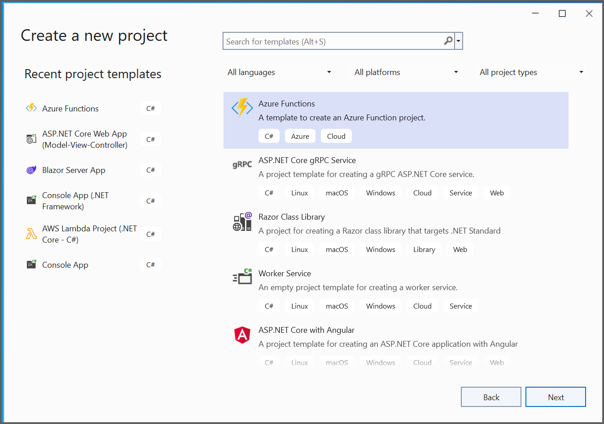
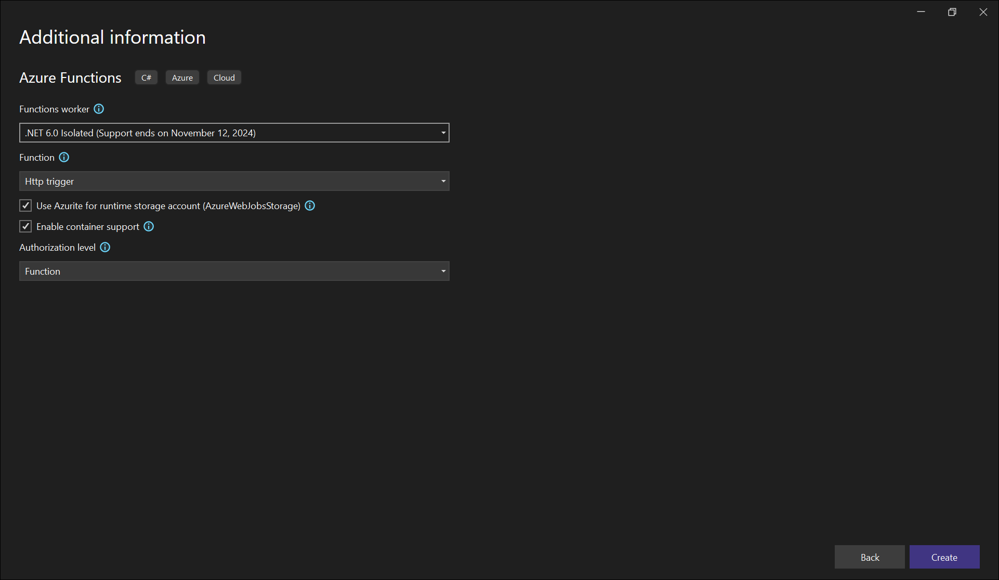
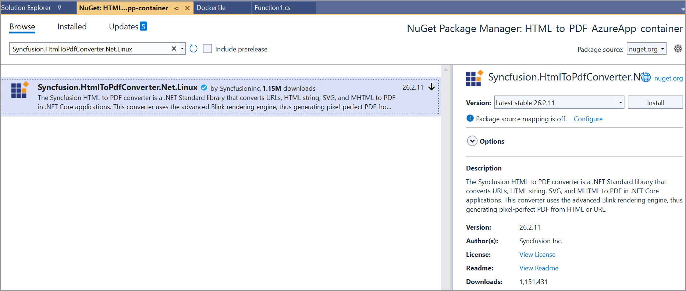
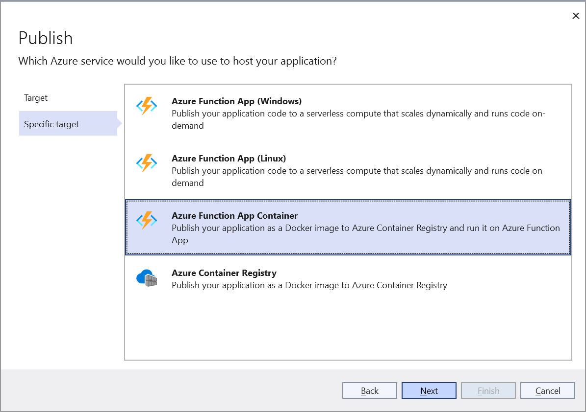
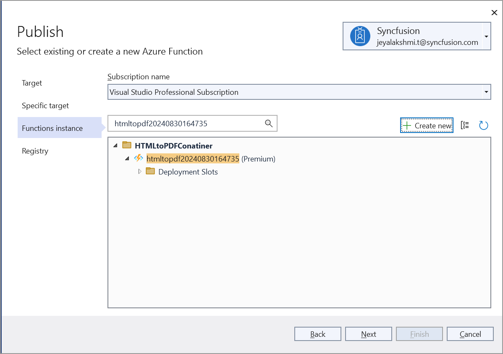
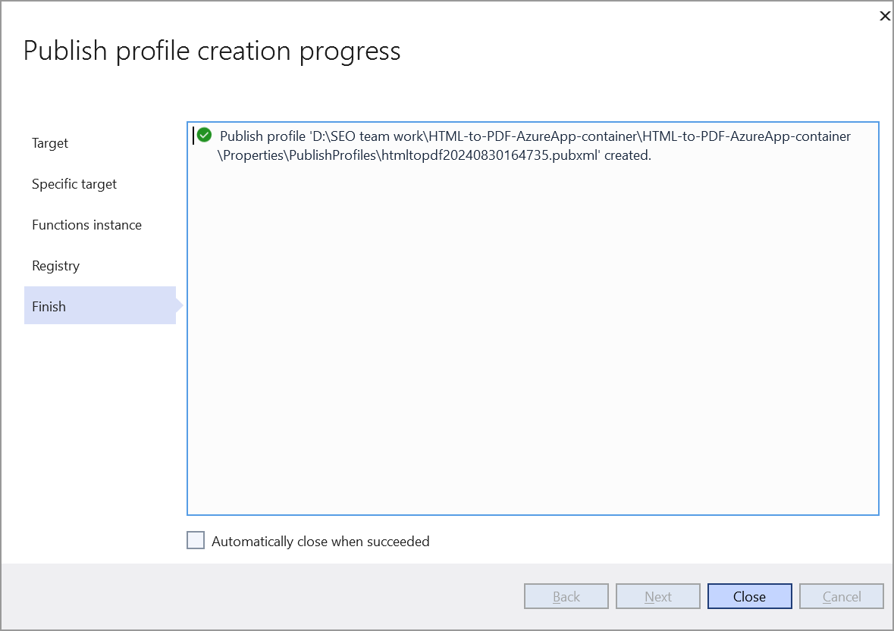
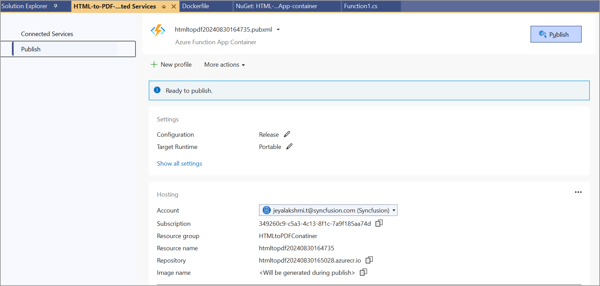
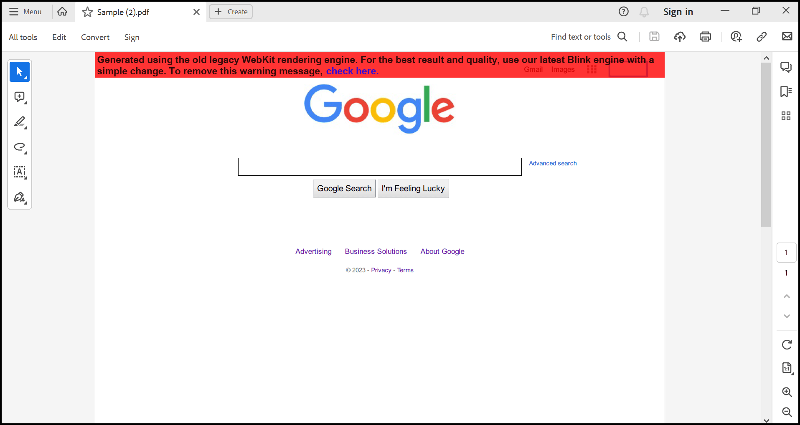

# Convert HTML to PDF in Azure Function App container in Linux

The [HTML to PDF converter](https://www.syncfusion.com/document-sdk/net-pdf-library/html-to-pdf) is a .NET Core library for converting webpages, SVG, MHTML, and HTML to PDF using C#. The result preserves all graphics, images, text, fonts, and the layout of the original HTML document or webpage. Using this library, you can convert HTML to PDF using C# with the Blink rendering engine in Azure Function App container in Linux.

## Prerequisites

**Version Compatibility**

The **Syncfusion.HtmlToPdfConverter.Net.Linux** NuGet package uses the Blink rendering engine for HTML to PDF conversion. This library is compatible with **.NET 8.0 and later** versions

**Supported Inputs**

The HTML to PDF converter supports the following input types:

- HTML String: Direct HTML content.
- URL: Web pages and online HTML content.
- HTML Files: Local HTML files.
- MHTML Files: Web archive (.mhtml/.mht) content.
- Authenticated Web Pages: Pages that require cookies, form authentication, or HTTP authentication.
- HTTP GET/POST Requests: HTML content accessed through GET or POST methods

**Required Software**

- .NET 8 SDK or later
- Linux x86_64 environment

**Register the license key**

N> Starting with v16.2.0.x, if you reference Syncfusion<sup>&reg;</sup> assemblies from trial setup or from the NuGet feed, you must add the "Syncfusion.Licensing" assembly reference and register a license key in your application. Please refer to this [link](https://help.syncfusion.com/common/essential-studio/licensing/overview) for details on registering a Syncfusion<sup>&reg;</sup> license key.

Include a license key in your **Function1.cs** file before creating an **HtmlToPdfConverter** instance. Refer to the [Syncfusion License](https://help.syncfusion.com/common/essential-studio/licensing/overview) documentation to learn about registering the Syncfusion license key in your application.




using Syncfusion.Licensing;

public class Function1
{
    // Register the Syncfusion license
    SyncfusionLicenseProvider.RegisterLicense("YOUR LICENSE KEY");
}




N> Starting from **version 29.2.4**, it is no longer necessary to manually add the following command-line arguments when using the Blink rendering engine:
N> ```csharp
N> settings.CommandLineArguments.Add("--no-sandbox");
N> settings.CommandLineArguments.Add("--disable-setuid-sandbox");
N> ```
N> These arguments are only required when using **older versions** of the library that depend on Blink in sandbox-restricted environments.

## Steps to convert HTML to PDF in Azure Function App container in Linux

Step 1: Create the Azure function project using Visual Studio template.


Step 2: Select the .NET version.


Step 3: Install the [Syncfusion.HtmlToPdfConverter.Net.Linux](https://www.nuget.org/packages/Syncfusion.HtmlToPdfConverter.Net.Linux/) NuGet package as a reference to your .NET Core application from [NuGet.org](https://www.nuget.org/).


Step 4: Add the following namespaces to your **Function1.cs** file:




using Syncfusion.HtmlConverter;
using Syncfusion.Pdf;
using Syncfusion.Pdf.Graphics;
using System.Runtime.InteropServices;




Step 5: Add the following code snippet to your **Function1.cs** file to implement the HTML to PDF conversion in Azure Function:




[Function("Function1")]
public IActionResult Run([HttpTrigger(AuthorizationLevel.Anonymous, "get", "post")] HttpRequest req)
{
    string blinkBinariesPath = string.Empty;
    MemoryStream ms = null;

    try
    {
        // Setup and initialize Blink binaries path from Azure Function runtime environment
        blinkBinariesPath = SetupBlinkBinaries();
        // Initialize HTML to PDF converter with Blink rendering engine for high-quality output
        HtmlToPdfConverter htmlConverter = new HtmlToPdfConverter(HtmlRenderingEngine.Blink);
        // Create Blink converter settings with sandbox bypass configuration
        BlinkConverterSettings settings = new BlinkConverterSettings();
        // Add command line arguments to disable sandbox for Azure Function container execution
        settings.CommandLineArguments.Add("--no-sandbox");
        settings.CommandLineArguments.Add("--disable-setuid-sandbox");
        // Set the Blink binaries path from the setup method
        settings.BlinkPath = blinkBinariesPath;
        // Assign converter settings to the HTML converter instance
        htmlConverter.ConverterSettings = settings;
        // Convert URL to PDF document using Blink rendering engine
        PdfDocument document = htmlConverter.Convert("https://www.google.com/");
        // Create memory stream to store converted PDF bytes
        ms = new MemoryStream();
        // Save PDF document to memory stream
        document.Save(ms);
        // Close the document and release resources
        document.Close(true);
    }
    catch (Exception ex)
    {
        // Create error PDF document if conversion fails for exception handling
        PdfDocument document = new PdfDocument();
        PdfPage page = document.Pages.Add();
        PdfGraphics graphics = page.Graphics;
        // Create standard font for error message rendering
        PdfFont font = new PdfStandardFont(PdfFontFamily.Helvetica, 20);
        // Draw the exception message text in the PDF document
        graphics.DrawString(ex.Message, font, PdfBrushes.Black, new Syncfusion.Drawing.PointF(0, 0));
        // Create memory stream for error PDF
        ms = new MemoryStream();
        // Save error PDF to memory stream
        document.Save(ms);
        // Close the error document
        document.Close(true);
    }
    // Reset stream position for reading
    ms.Position = 0;
    // Return PDF document as file stream response with proper MIME type
    return new FileStreamResult(ms, "application/pdf");
}

private static string SetupBlinkBinaries()
{
    // Define path to Blink binaries in Azure Function runtime directory
    string blinkAppDir = Path.Combine("/home/site/wwwroot/runtimes/linux/native");
    // Get system temp directory for Blink binary extraction
    string tempBlinkDir = Path.GetTempPath();
    // Check if chrome executable already exists in temp directory
    string chromePath = Path.Combine(tempBlinkDir, "chrome");
    if (!File.Exists(chromePath))
    {
        // Copy all Blink binaries from runtime to temp directory if not already copied
        CopyFilesRecursively(blinkAppDir, tempBlinkDir);
        // Set executable permissions on Blink binaries for Linux execution
        SetExecutablePermission(tempBlinkDir);
    }
    // Return temp directory path containing extracted Blink binaries
    return tempBlinkDir;
}

private static void CopyFilesRecursively(string sourcePath, string targetPath)
{
    // Create all directory structure from source to destination path
    foreach (string dirPath in Directory.GetDirectories(sourcePath, "*", SearchOption.AllDirectories))
    {
        Directory.CreateDirectory(dirPath.Replace(sourcePath, targetPath));
    }
    // Copy all files recursively from source path to destination path
    foreach (string newPath in Directory.GetFiles(sourcePath, "*.*", SearchOption.AllDirectories))
    {
        File.Copy(newPath, newPath.Replace(sourcePath, targetPath), true);
    }
}

// P/Invoke declaration for Linux chmod system call to set file permissions
[DllImport("libc", SetLastError = true, EntryPoint = "chmod")]
internal static extern int Chmod(string path, FileAccessPermissions mode);

private static void SetExecutablePermission(string tempBlinkDir)
{
    // Define file permissions for executable binaries: read, write, execute for user, group, other
    FileAccessPermissions ExecutableFilePermissions = FileAccessPermissions.UserRead | FileAccessPermissions.UserWrite | FileAccessPermissions.UserExecute |
    FileAccessPermissions.GroupRead | FileAccessPermissions.GroupExecute | FileAccessPermissions.OtherRead | FileAccessPermissions.OtherExecute;
    // List of Blink binaries requiring executable permissions
    string[] executableFiles = new string[] { "chrome", "chrome_sandbox" };
    // Set permissions on each executable binary for Azure Function container execution
    foreach (string executable in executableFiles)
    {
        var execPath = Path.Combine(tempBlinkDir, executable);
        if (File.Exists(execPath))
        {
            // Call chmod to set executable permissions on the binary
            var code = Function1.Chmod(execPath, ExecutableFilePermissions);
            if (code != 0)
            {
                // Throw exception if chmod operation fails
                throw new Exception("Chmod operation failed");
            }
        }
    }
}

// Enum for Unix/Linux file access permissions used with chmod system call
[Flags]
internal enum FileAccessPermissions : uint
{
    OtherExecute = 1,
    OtherWrite = 2,
    OtherRead = 4,
    GroupExecute = 8,
    GroupWrite = 16,
    GroupRead = 32,
    UserExecute = 64,
    UserWrite = 128,
    UserRead = 256
}




Step 6: Add the following dependency packages to your **Dockerfile** to enable Blink rendering in the Azure Function container:




RUN apt-get update && \
apt-get install -yq --no-install-recommends \
libasound2 libatk1.0-0 libc6 libcairo2 libcups2 libdbus-1-3 \
libexpat1 libfontconfig1 libgcc1 libgconf-2-4 libgdk-pixbuf2.0-0 libglib2.0-0 libgtk-3-0 libnspr4 \
libpango-1.0-0 libpangocairo-1.0-0 libstdc++6 libx11-6 libx11-xcb1 libxcb1 \
libxcursor1 libxdamage1 libxext6 libxfixes3 libxi6 libxrandr2 libxrender1 libxss1 libxtst6 \
libnss3 libgbm1




A complete working sample for converting HTML to PDF in Azure Function App container can be downloaded from [GitHub](https://github.com/SyncfusionExamples/html-to-pdf-csharp-examples/tree/master/Azure/HTML-to-PDF-AzureApp-container).

## Steps to publish to Azure Function App container in Linux

Step 1: Right-click your solution in Solution Explorer and select **Publish** to deploy to Azure.


Step 2: Select **Azure Function App container** as the deployment target.


Step 3: Create the Function App instance and Azure Container Registry.


Step 4: Click **Close** to complete the setup.


Step 5: Click **Publish** to deploy the containerized function to Azure.


Step 6: After successful publication, navigate to the Azure portal and select **App Services**. Once the service is running, click **Get function URL > Copy**. Paste the URL into a new browser tab, and you will obtain the following PDF document output:


Click [here](https://www.syncfusion.com/document-sdk/net-pdf-library/html-to-pdf) to explore the rich set of Syncfusion<sup>&reg;</sup> HTML to PDF converter library features. 

You can also view the online sample to [convert HTML to PDF documents](https://document.syncfusion.com/demos/pdf/htmltopdf#/tailwind3) in ASP.NET Core.