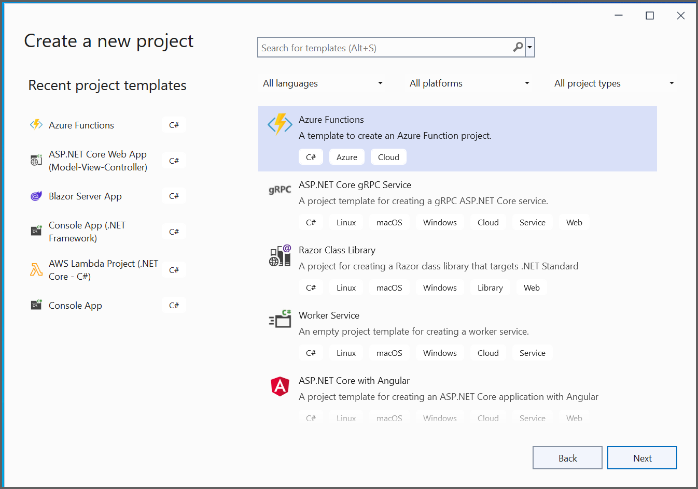
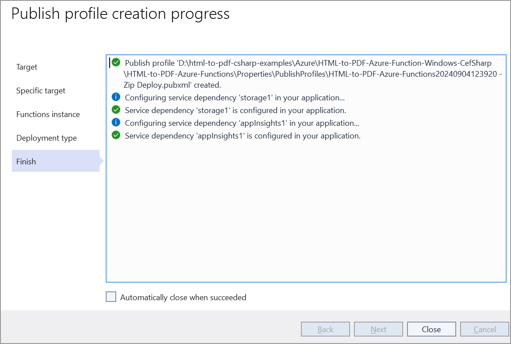

# Convert HTML to PDF file in Azure Functions on Windows

As the Azure Windows platform is a Sandbox environment, the default HTML rendering engine Blink used in our HTML to PDF conversion is incompatible due to GDI Limitations. It is recommended that you use [Azure functions in Linux](https://help.syncfusion.com/document-processing/pdf/conversions/html-to-pdf/net/convert-html-to-pdf-in-azure-functions-linux) For converting HTML to PDF in Azure Functions on Windows, you can use our [CefSharp](https://www.nuget.org/packages/CefSharp.OffScreen.NETCore/119.4.30) based HTML converter if is fit your requirement.

N> [CefSharp](https://www.nuget.org/packages/CefSharp.OffScreen.NETCore/119.4.30) is an open-source library that comes under the [BSD](https://github.com/cefsharp/CefSharp/blob/master/README.md) license.

## Steps to convert HTML to PDF file in Azure Functions on Windows using CefSharp

Step 1: Create the Azure functions project.

Step 2: Create a project name and select the location.

Step 3: Select the function worker as .NET 8.0 isolated (Long-term support), and the selected HTTP triggers as follows. 

N> We have ensured the conversion in Azure functions isolated app and the conversion supports Azure functions isolated app only. The normal Azure Function app has a limitation of copying the runtime files at publish.

Step 4: Install the [Syncfusion.HtmlToPdfConverter.Cef.Net.Windows](https://www.nuget.org/packages/Syncfusion.HtmlToPdfConverter.Cef.Net.Windows) NuGet package to reference your project using the [nuget.org](https://www.nuget.org/).

N> Starting with v16.2.0.x, if you reference Syncfusion assemblies from the trial setup or NuGet feed, you also have to add the "Syncfusion.Licensing" assembly reference and include a license key in your projects. Please refer to this [link](https://help.syncfusion.com/common/essential-studio/licensing/overview) to learn about registering the Syncfusion license key in your application to use our components.

Step 5: Include the following namespaces in the **Function1.cs** file.




    using Syncfusion.HtmlConverter;
    using Syncfusion.Pdf;
    using Syncfusion.Pdf.Graphics;




Step 6: Add the following code example in the **Run** method of the **Function1** class to **convert HTML to PDF document** in Azure Functions and return the resultant **PDF document**.




    [FunctionName("Function1")]
    public static async Task<HttpResponseMessage> Run(
        [HttpTrigger(AuthorizationLevel.Function, "get", "post", Route = null)] HttpRequest req,
        ILogger log)
    {
        MemoryStream ms = new MemoryStream();
        try
        {
            //Initialize HTML to PDF converter.
            HtmlToPdfConverter htmlConverter = new HtmlToPdfConverter(HtmlRenderingEngine.Cef);
            CefConverterSettings settings = new CefConverterSettings();
            //Assign the CEF converter settings to the HTML to PDF converter.
            htmlConverter.ConverterSettings = settings;
            //Convert URL to PDF.
            PdfDocument document = htmlConverter.Convert("https://www.google.com/");
            //Save and close the PDF document.
            document.Save(ms);
            document.Close();
            ms.Position = 0;
        }

        catch (Exception ex)
        {
            //Create a new PDF document.
            PdfDocument document = new PdfDocument();
            //Add a page to the document.
            PdfPage page = document.Pages.Add();
            //Create PDF graphics for the page.
            PdfGraphics graphics = page.Graphics;

            //Set the standard font.
            PdfFont font = new PdfStandardFont(PdfFontFamily.Helvetica, 5);
            //Draw the text.
            graphics.DrawString(ex.ToString(), font, PdfBrushes.Black, new Syncfusion.Drawing.PointF(0, 0));

            //Creating the stream object.
            ms = new MemoryStream();
            //Save the document into memory stream.
            document.Save(ms);
            //Close the document.
            document.Close(true);
            ms.Position = 0;
        }
        HttpResponseMessage response = new HttpResponseMessage(HttpStatusCode.OK);
        response.Content = new ByteArrayContent(ms.ToArray());
        response.Content.Headers.ContentDisposition = new ContentDispositionHeaderValue("attachment")
        {
            FileName = "Sample.pdf"
        };
        response.Content.Headers.ContentType = new MediaTypeHeaderValue("application/pdf");
        return response;
    }




Step 7: Refer the steps to [publish](https://help.syncfusion.com/document-processing/pdf/conversions/html-to-pdf/net/convert-html-to-pdf-in-azure-functions-windows#steps-to-publish-as-azure-function-on-windows) as Azure Function on Windows.

Step 8: After publish open the created web app service in the Azure portal. Go to Settings -> Configuration -> Platform settings and change the platform to 64-bit.

You can download a complete working sample from [GitHub](https://github.com/SyncfusionExamples/html-to-pdf-csharp-examples/tree/master/Azure/HTML-to-PDF-Azure-Function-Windows-CefSharp).

## Steps to publish as Azure Function on Windows 

Step 1: Right-click the project and select Publish. Then, create a new profile in the Publish Window.

Step 2: Select the target as **Azure** and click **Next**.

Step 3: Select the **Azure Function App (Windows)** and click **Next**. 

Step 4: Select the **Create new**.

Step 5: Click **Create**.

Step 6: After creating the function app service, click **Finish**. 

Step 7: Click deployment type.

Step 8: Click **Close** button.

Step 9: Click **Publish**.

Step 10: Now, Publish has succeeded.

Step 11: Now, go to the Azure portal and select App Services. After running the service, click **Get function URL > Copy**. Include the URL as a query string in the URL. Then, paste it into a new browser tab. You will get a PDF document as follows. 

