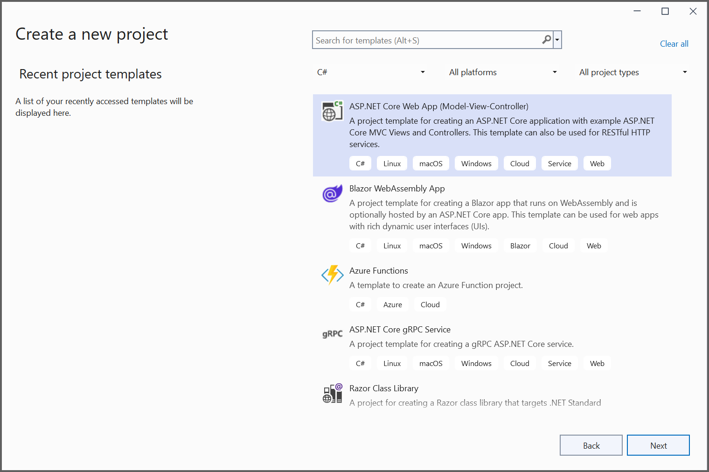
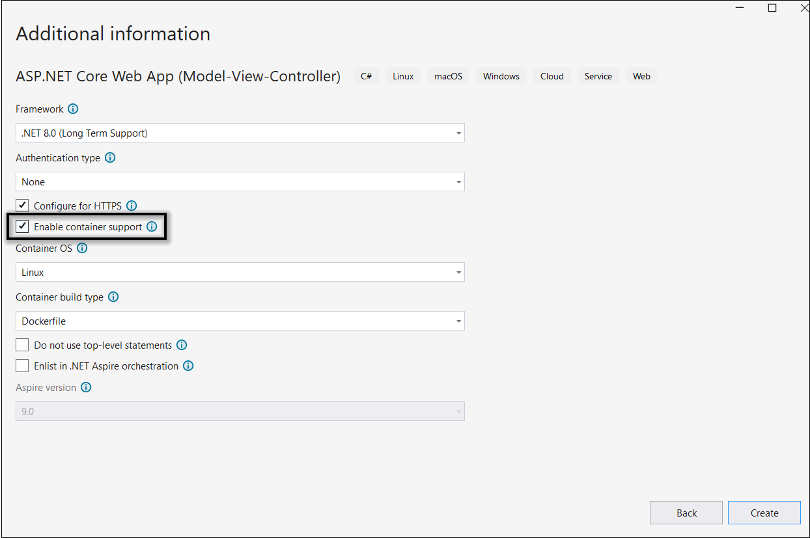
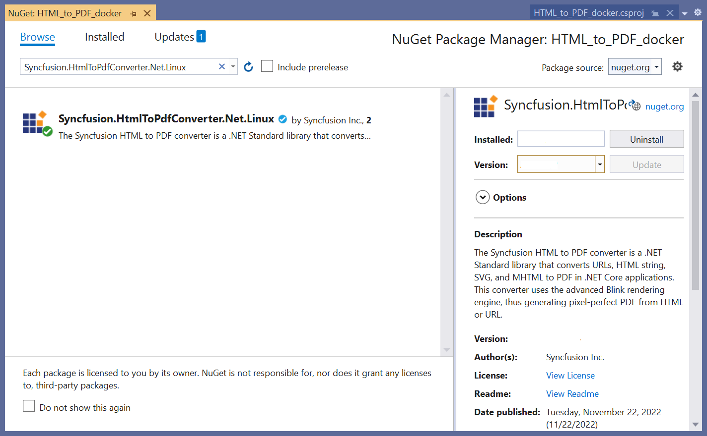
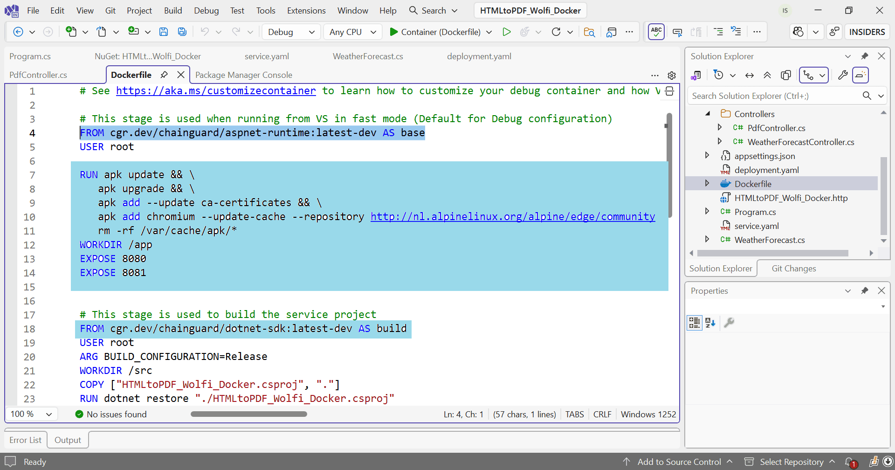
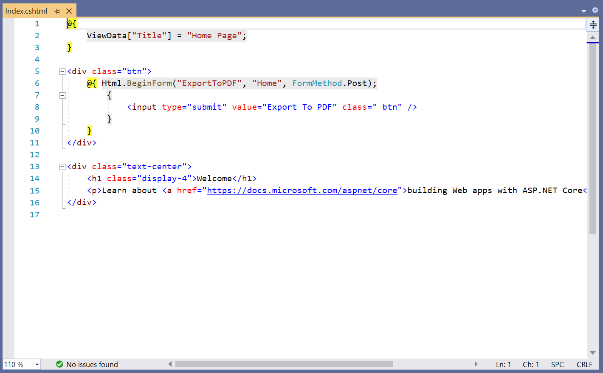

# Convert HTML to PDF in a Linux Docker Container on Wolfi OS

The Syncfusion<sup>&reg;</sup> HTML to PDF converter is a .NET library that converts HTML or web pages to PDF document in a Linux [Docker](https://www.docker.com/why-docker/) container. This guide adapts the standard Linux Docker setup for [Wolfi OS](https://wolfi.dev/), a secure and minimal Linux distribution using [Chainguard](https://www.chainguard.dev/) base images. Wolfi OS requires custom dependency installation due to its minimal footprint, so we use Chainguard images with `apk` package manager to install Chromium for the Blink rendering engine.

N> Ensure your environment supports Docker and .NET 8.0+. Chainguard images provide a secure, wolfi-based alternative to standard Ubuntu images.

## Prerequisites

- Docker installed and running
- .NET 8.0 SDK

## Steps to Convert HTML to PDF in a Linux Docker Container on Wolfi OS

Step 1: Create a new ASP.NET Core Web Application and enable Docker support with Linux as the target OS.



Step 2: Install the [Syncfusion.HtmlToPdfConverter.Net.Linux](https://www.nuget.org/packages/Syncfusion.HtmlToPdfConverter.Net.Linux/) NuGet package as a reference to your .NET Core application [NuGet.org](https://www.nuget.org/).


N> Starting with v16.2.0.x, if you reference Syncfusion<sup>&reg;</sup> assemblies from trial setup or from the NuGet feed, you also have to add "Syncfusion.Licensing" assembly reference and include a license key in your projects. Please refer to this [link](https://help.syncfusion.com/common/essential-studio/licensing/overview) to know about registering Syncfusion<sup>&reg;</sup> license key in your application to use our components.

Step 3: Update the Dockerfile to use Chainguard wolfi-based images and install Chromium via apk. Chainguard's `dotnet-sdk:latest-dev` and `aspnet-runtime:latest-dev` images include alp-compatible package managers.




# This stage is used when running from VS in fast mode (Default for Debug configuration)

FROM cgr.dev/chainguard/aspnet-runtime:latest-dev AS base
USER root
RUN apk update && \

apk upgrade && \
apk add --update ca-certificates && \
apk add chromium --update-cache --repository http://nl.alpinelinux.org/alpine/edge/community \
rm -rf /var/cache/apk/*
WORKDIR /app
EXPOSE 8080
EXPOSE 8081

FROM cgr.dev/chainguard/dotnet-sdk:latest-dev AS build
USER root
ARG BUILD_CONFIGURATION=Release
WORKDIR /src
COPY ["HTMLtoPDF_Wolfi_Docker.csproj", "."]

RUN dotnet restore "./HTMLtoPDF_Wolfi_Docker.csproj"
COPY . .
WORKDIR "/src/."
RUN dotnet build "./HTMLtoPDF_Wolfi_Docker.csproj" -c $BUILD_CONFIGURATION -o /app/build

FROM build AS publish
ARG BUILD_CONFIGURATION=Release
RUN dotnet publish "./HTMLtoPDF_Wolfi_Docker.csproj" -c $BUILD_CONFIGURATION -o /app/publish /p:UseAppHost=false

FROM base AS final
WORKDIR /app
COPY --from=publish /app/publish .
ENTRYPOINT ["dotnet", "HTMLtoPDF_Wolfi_Docker.dll"]





Step 4: Add a new button in the index.cshtml as shown below.



<div class="btn">
   @{ Html.BeginForm("ExportToPDF", "Home", FormMethod.Post);
         {
            <input type="submit" value="Export To PDF" class=" btn" />
         }
      }
</div>





Step 5: A default controller with name HomeController.cs gets added on creation of ASP.NET Core project. Include the following namespaces in that HomeController.cs file.



using Syncfusion.HtmlConverter;
using Syncfusion.Pdf;
using System.IO;
using Microsoft.AspNetCore.Mvc;



Step 6: Add a new action method in HomeController.cs and include the below code snippet to convert HTML to PDF document using [Convert](https://help.syncfusion.com/cr/document-processing/Syncfusion.HtmlConverter.HtmlToPdfConverter.html#Syncfusion_HtmlConverter_HtmlToPdfConverter_Convert_System_String_) method in [HtmlToPdfConverter](https://help.syncfusion.com/cr/document-processing/Syncfusion.HtmlConverter.HtmlToPdfConverter.html) class. The HTML content will be scaled based on the given [ViewPortSize](https://help.syncfusion.com/cr/document-processing/Syncfusion.HtmlConverter.BlinkConverterSettings.html#Syncfusion_HtmlConverter_BlinkConverterSettings_ViewPortSize) property of [BlinkConverterSettings](https://help.syncfusion.com/cr/document-processing/Syncfusion.HtmlConverter.BlinkConverterSettings.html) class.



public IActionResult ExportToPDF()
{
    //Initialize HTML to PDF converter.
    HtmlToPdfConverter htmlConverter = new HtmlToPdfConverter();
    BlinkConverterSettings settings = new BlinkConverterSettings();
	settings.CommandLineArguments.Add("--disable-gpu");
    settings.BlinkPath = "/usr/lib/chromium";
    //Set Blink viewport size.
    settings.ViewPortSize = new Syncfusion.Drawing.Size(1280, 0);
    //Assign Blink settings to the HTML converter.
    htmlConverter.ConverterSettings = settings;
    //Convert URL to PDF document.
    PdfDocument document = htmlConverter.Convert("https://www.syncfusion.com");
    //Create memory stream.
    MemoryStream stream = new MemoryStream();
    //Save the document to memory stream.
    document.Save(stream);
    // Reset stream position
    stream.Position = 0;
    return File(stream.ToArray(), System.Net.Mime.MediaTypeNames.Application.Pdf, "HTML-to-PDF.pdf");
}



N> Starting from **version 29.2.4**, it is no longer necessary to manually add the following command-line arguments when using the Blink rendering engine:
N> ```csharp
N> settings.CommandLineArguments.Add("--no-sandbox");
N> settings.CommandLineArguments.Add("--disable-setuid-sandbox");
N> ```
N> These arguments are only required when using **older versions** of the library that depend on Blink in sandbox-restricted environments.

N>  Converting HTML to PDF using the Alpine Docker image, it crashes after the first conversion.  
N> **Reason:** The issue occurs within Chromium specifically for Alpine.  
N> **Solution:** We can resolve this issue by adding command-line arguments to the Blink converter settings. Please refer to the code snippet below:  
N> ```csharp
N> settings.CommandLineArguments.Add("--disable-gpu");
N> settings.BlinkPath = "/usr/lib/chromium";
N> ```

Step 7: Build and run the sample in the Docker. It will pull the Linux Docker image from the Docker hub and run the project. Now, the webpage will open in the browser. Click the button to convert the webpage to a PDF document.

By executing the program, you will get the PDF document as follows.


A complete working sample for converting an HTML to PDF in the Linux Docker container can be adapted from [Github](https://github.com/SyncfusionExamples/html-to-pdf-csharp-examples/tree/master/Docker) by updating the Dockerfile as shown above.

Click [here](https://www.syncfusion.com/document-processing/pdf-framework/net-core/html-to-pdf) to explore the rich set of Syncfusion<sup>&reg;</sup> HTML to PDF converter library features. 

An online sample link to [convert HTML to PDF document](https://ej2.syncfusion.com/aspnetcore/PDF/HtmltoPDF#/material3) in ASP.NET Core.