#  Convert HTML to PDF in Google App Engine

The [HTML to PDF converter](https://www.syncfusion.com/document-sdk/net-pdf-library/html-to-pdf) is a .NET library for converting webpages, SVG, MHTML, and HTML to PDF using C#. Using this library, you can convert HTML to PDF using C# with Blink rendering engine in Google App Engine.

## Prerequisites

**Version Compatibility**

The **Syncfusion.HtmlToPdfConverter.Net.Linux** NuGet package uses the Blink rendering engine for HTML to PDF conversion. This library is compatible with **.NET 8.0 and later** versions

**Supported Inputs**

The HTML to PDF converter supports the following input types:

- HTML String: Direct HTML content.
- URL: Web pages and online HTML content.
- HTML Files: Local HTML files.
- MHTML Files: Web archive (.mhtml/.mht) content.
- Authenticated Web Pages: Pages that require cookies, form authentication, or HTTP authentication.
- HTTP GET/POST Requests: HTML content accessed through GET or POST methods

**Required Software**

- .NET 8.0 or later
- Visual Studio 2022 or later
- Google Cloud account with App Engine enabled
- Google Cloud SDK installed locally
- Docker installed locally

**Register the license key**

N> Starting with v16.2.0.x, if you reference Syncfusion&reg; assemblies from trial setup or from the NuGet feed, you must add the "Syncfusion.Licensing" assembly reference and register a license key in your application. Please refer to this [link](https://help.syncfusion.com/common/essential-studio/licensing/overview) for details on registering a Syncfusion&reg; license key.

Include a license key in your **HomeController.cs** file before creating an **HtmlToPdfConverter** instance. Refer to the [Syncfusion License](https://help.syncfusion.com/common/essential-studio/licensing/overview) documentation to learn about registering the Syncfusion license key in your application.




using Syncfusion.Licensing;

public class HomeController
{
    // Register the Syncfusion license
    SyncfusionLicenseProvider.RegisterLicense("YOUR LICENSE KEY");
}




## Set up App Engine

Step 1: Open the **Google Cloud Console** and click the **Activate Cloud Shell** button.
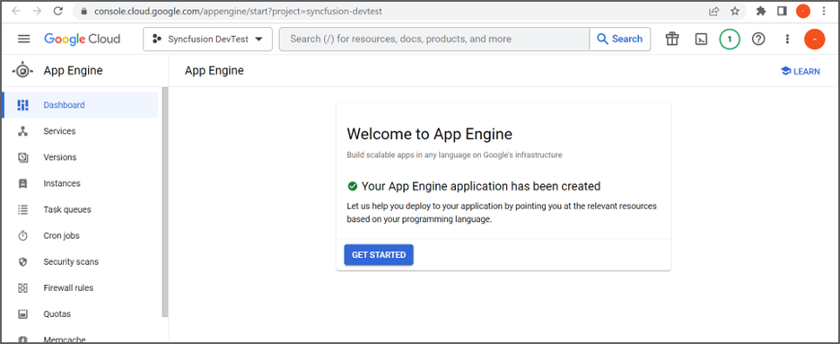

Step 2: Click the **Cloud Shell Editor** button to view the **Workspace**.

Step 3: Open **Cloud Shell Terminal** and run the following command to confirm authentication:



gcloud auth list




Step 4: Click the **Authorize** button to authenticate with Google Cloud.

## Create an application for App Engine

Step 1: Open Visual Studio and select the **ASP.NET Core Web app (Model-View-Controller)** template.
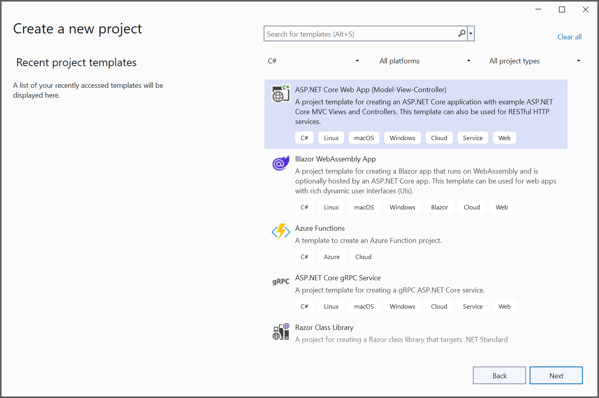

Step 2: Install the [Syncfusion.HtmlToPdfConverter.Net.Linux](https://www.nuget.org/packages/Syncfusion.HtmlToPdfConverter.Net.Linux/) NuGet package as a reference to your .NET Core application from [NuGet.org](https://www.nuget.org/).
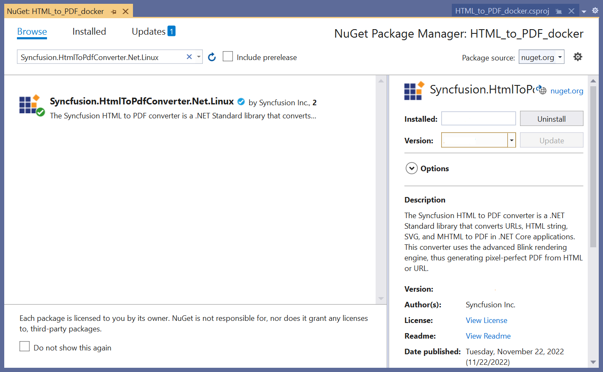

Step 3: Add the following namespaces to the **HomeController.cs** file:




using Syncfusion.HtmlConverter;
using Syncfusion.Pdf;




Step 4: A default action method named Index will be present in HomeController.cs. Right click on Index method and select **Go To View** where you will be directed to its associated view page **Index.cshtml**.

Step 5: Add a new button in the Index.cshtml as shown in the following.




@{Html.BeginForm("CreateDocument", "Home", FormMethod.Get);
    {
        

            <input type="submit" value="Convert HTML to PDF" style="width:200px;height:27px" />
        

    }
    Html.EndForm();
}



Step 6: Add a new action method in **HomeController.cs** to convert HTML to PDF using the [Convert](https://help.syncfusion.com/cr/document-processing/Syncfusion.HtmlConverter.HtmlToPdfConverter.html#Syncfusion_HtmlConverter_HtmlToPdfConverter_Convert_System_String_) method in the [HtmlToPdfConverter](https://help.syncfusion.com/cr/document-processing/Syncfusion.HtmlConverter.HtmlToPdfConverter.html) class:




public ActionResult ExportToPDF()
{
    // Initialize HTML to PDF converter with Blink rendering engine
    HtmlToPdfConverter htmlConverter = new HtmlToPdfConverter();

    // Convert URL to PDF document
    using (PdfDocument document = htmlConverter.Convert("https://www.google.com"))
    {
        // Save PDF document to output file
        document.Save("Output.pdf");
    }
}



## Move application to App Engine

Step 1: Open the **Cloud Shell editor**.

Step 2: Drag and drop the sample from your local machine to the **Workspace**.
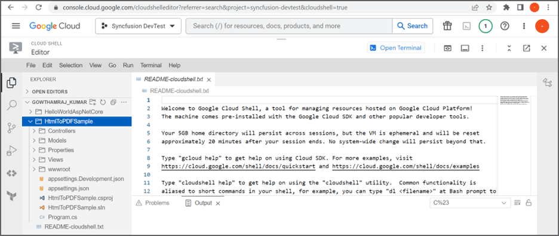

N> If you have your sample application on your local machine, drag and drop it into the Workspace. If you created the sample using the Cloud Shell terminal command, it will be available in the Workspace.

Step 3: Open the **Cloud Shell Terminal** and run the following command to view the files and directories within your current workspace:



ls




This will display the list of files and folders in your workspace. Navigate to the sample you want to run.

Step 4: Run the following command to navigate to the sample directory:



cd HtmlToPDFSample




Step 5: To verify the sample is working correctly, run the application using the following command:



dotnet run --urls=http://localhost:8080




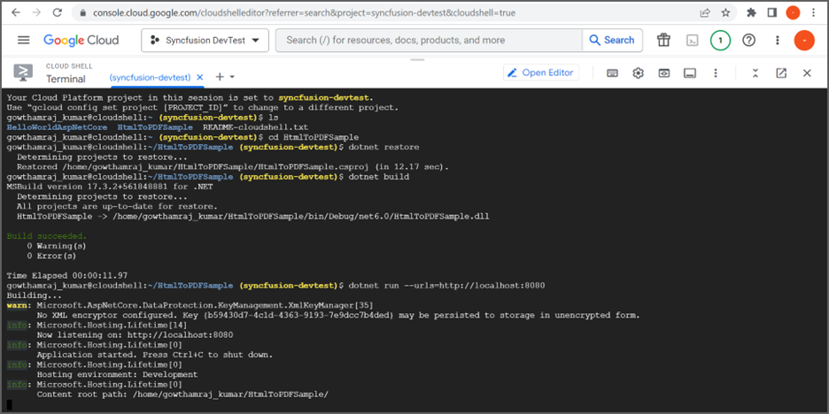

Step 6: Verify that the application is running properly by accessing **Web View > Preview on port 8080**.
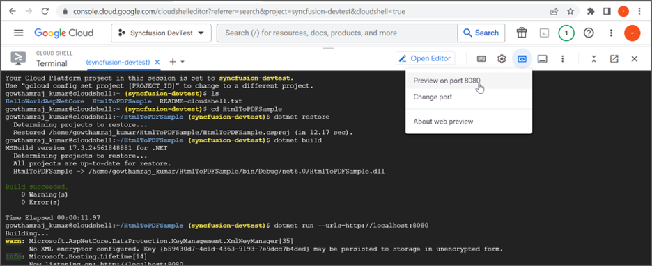

Step 7: You can now see the sample output on the preview page.
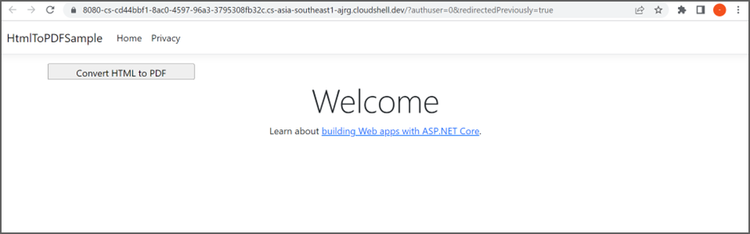

Step 8: Close the preview page and return to the terminal, then press **Ctrl+C** to stop the process.
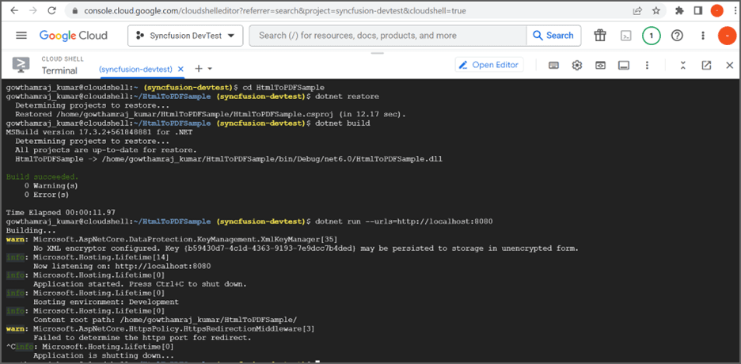

## Publish the application

Step 1: Run the following command in the **Cloud Shell Terminal** to publish the application in Release mode:



dotnet publish -c Release




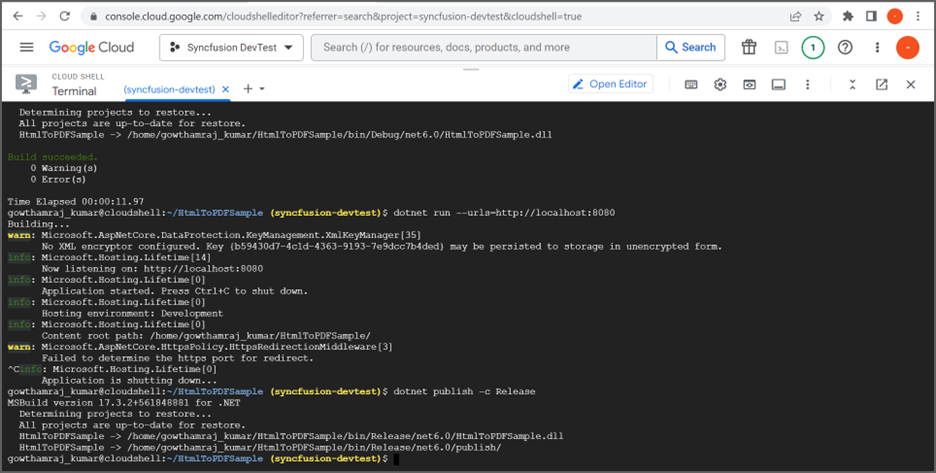

Step 2: Run the following command in the **Cloud Shell Terminal** to navigate to the publish folder:



cd bin/Release/net8.0/publish/




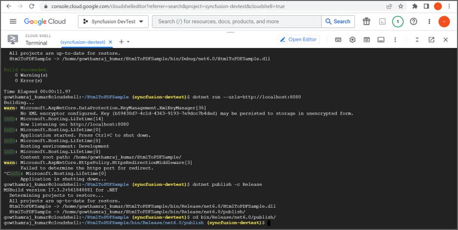

## Configure app.yaml and Dockerfile

Step 1: Add the **app.yaml** file to the publish folder with the following contents:



cat <<EOT >> app.yaml
env: flex
runtime: custom   
EOT




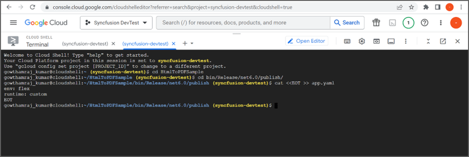

Step 2: Add the **Dockerfile** to the publish folder with the following contents to install Blink rendering dependencies:



cat <<EOT >> Dockerfile
FROM mcr.microsoft.com/dotnet/aspnet:8.0
RUN apt-get update && \
apt-get install -yq --no-install-recommends \ 
libasound2 libatk1.0-0 libc6 libcairo2 libcups2 libdbus-1-3 \ 
libexpat1 libfontconfig1 libgcc1 libgconf-2-4 libgdk-pixbuf2.0-0 libglib2.0-0 libgtk-3-0 libnspr4 \ 
libpango-1.0-0 libpangocairo-1.0-0 libstdc++6 libx11-6 libx11-xcb1 libxcb1 \ 
libxcursor1 libxdamage1 libxext6 libxfixes3 libxi6 libxrandr2 libxrender1 libxss1 libxtst6 \ 
libnss3 libgbm1

ADD / /app
EXPOSE 8080
ENV ASPNETCORE_URLS=http://*:8080
WORKDIR /app
ENTRYPOINT [ "dotnet", "HtmlToPDFSample.dll"]
EOT




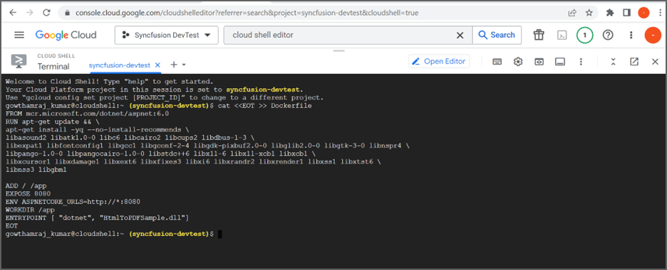

Step 3: Verify that the **Dockerfile** and **app.yaml** files have been added to the **Workspace**.
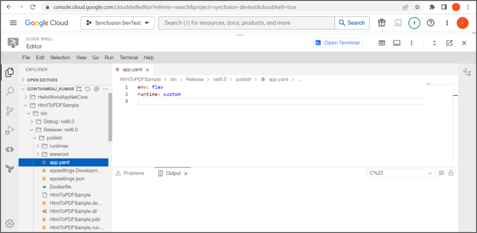

## Deploy to App Engine

Step 1: To deploy the application to App Engine, run the following command in the **Cloud Shell Terminal** and retrieve the deployment URL:



gcloud app deploy --version v0




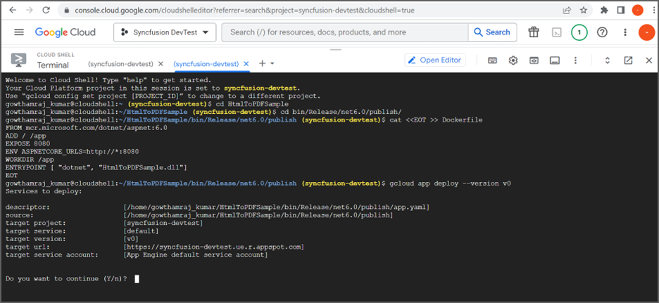
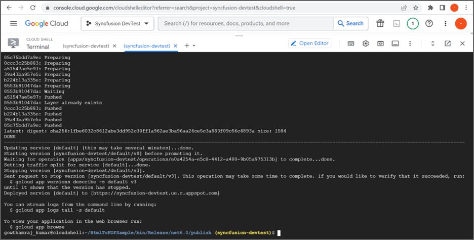

Step 2: Open the deployment **URL** to access the successfully deployed application.

Step 3: Execute the conversion by clicking the **Convert HTML to PDF** button. The PDF document will be generated and saved in the application's output directory.
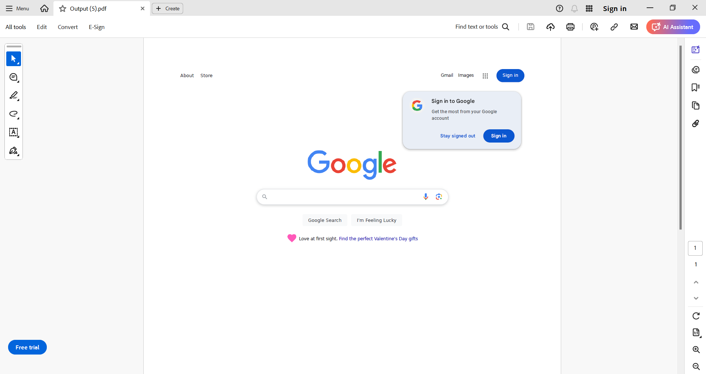

A complete working sample for converting HTML to PDF in Google App Engine can be downloaded from [GitHub](https://github.com/SyncfusionExamples/html-to-pdf-csharp-examples/tree/master/HtmlToPdf/HtmlToPDFSample).

Click [here](https://www.syncfusion.com/document-sdk/net-pdf-library/html-to-pdf) to explore the rich set of Syncfusion&reg; HTML to PDF converter library features. 

You can also view the online sample to [convert HTML to PDF documents](https://document.syncfusion.com/demos/pdf/htmltopdf#/tailwind3) in ASP.NET Core.