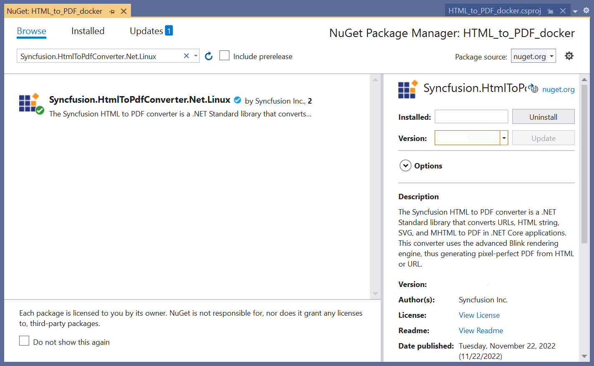
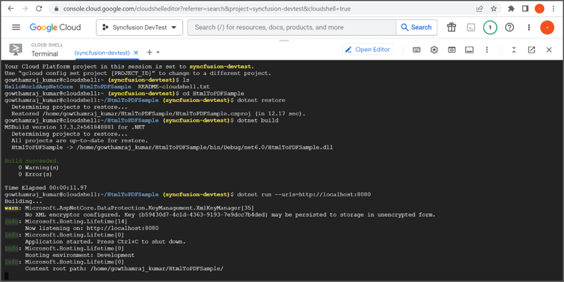
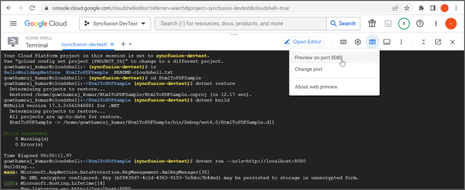
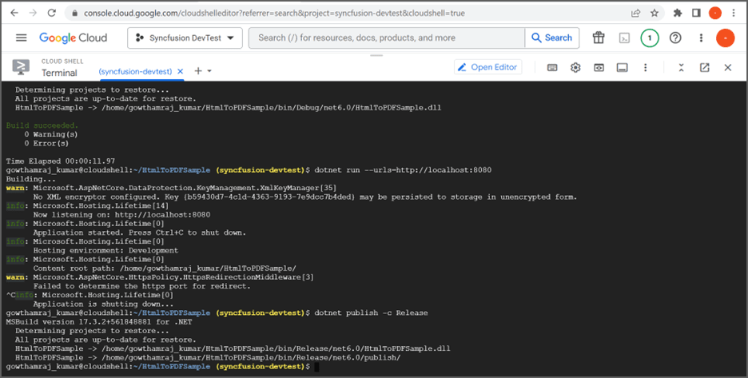
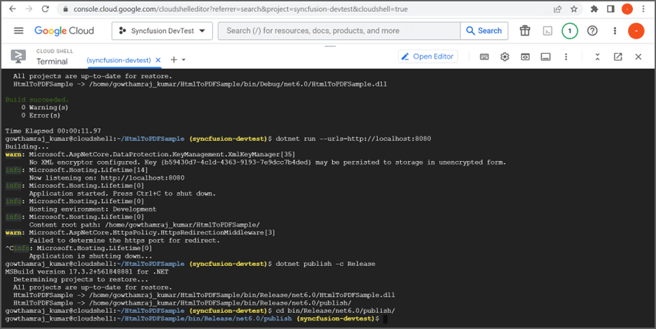
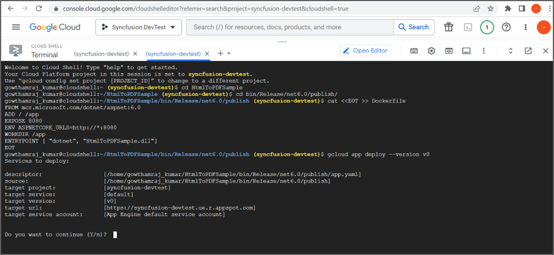

#  Convert HTML to PDF in Google App Engine

The Syncfusion&reg; [HTML to PDF converter](https://www.syncfusion.com/document-sdk/net-pdf-library/html-to-pdf) is a .NET library for converting webpages, SVG, MHTML, and HTML to PDF using C#. Using this library, you can convert HTML to PDF using C# with Blink rendering engine in Google App Engine.

## Set up App Engine

Step 1: Open the **Google Cloud Console** and click the **Activate Cloud Shell** button.

Step 2: Click the **Cloud Shell Editor** button to view the **Workspace**.

Step 3: Open **Cloud Shell Terminal**, and run the following **command** to confirm authentication.



gcloud auth list




Step 4: Click the **Authorize** button.

## Create an application for App Engine

Step 1: Open Visual Studio and select the ASP.NET Core Web app (Model-View-Controller) template.

Step 2: Install the [Syncfusion.HtmlToPdfConverter.Net.Linux](https://www.nuget.org/packages/Syncfusion.HtmlToPdfConverter.Net.Linux/) NuGet package as a reference to your .NET Core application [NuGet.org](https://www.nuget.org/).

N> Starting with v16.2.0.x, if you reference Syncfusion&reg; assemblies from the trial setup or from the NuGet feed, you also have to add the "Syncfusion.Licensing" assembly reference and include a license key in your projects. Please refer to this [link](https://help.syncfusion.com/common/essential-studio/licensing/overview) to learn about registering the Syncfusion&reg; license key in your application to use our components.

Step 5: Include the following namespaces in the **HomeController.cs** file.




using Syncfusion.HtmlConverter;
using Syncfusion.Pdf;
using System.IO;




Step 6: A default action method named Index will be present in HomeController.cs. Right click on Index method and select **Go To View** where you will be directed to its associated view page **Index.cshtml**.

Step 7: Add a new button in the Index.cshtml as shown in the following.




@{Html.BeginForm("CreateDocument", "Home", FormMethod.Get);
    {
        

            <input type="submit" value="Convert HTML to PDF" style="width:200px;height:27px" />
        

    }
    Html.EndForm();
}



Step 6: Add a new action method in HomeController.cs and include the below code example to convert HTML to PDF document using [Convert](https://help.syncfusion.com/cr/document-processing/Syncfusion.HtmlConverter.HtmlToPdfConverter.html#Syncfusion_HtmlConverter_HtmlToPdfConverter_Convert_System_String_) method in [HtmlToPdfConverter](https://help.syncfusion.com/cr/document-processing/Syncfusion.HtmlConverter.HtmlToPdfConverter.html) class.




public ActionResult ExportToPDF()
{
//Initialize HTML to PDF converter. 
HtmlToPdfConverter htmlConverter = new HtmlToPdfConverter();

//Convert URL to PDF document. 
using (PdfDocument document = htmlConverter.Convert("https://www.google.com"))
{
    //Save a PDF document. 
    document.Save("Output.pdf");
}
}



## Move application to App Engine

Step 1: Open the **Cloud Shell editor**.

Step 2: Drag and drop the sample from your local machine to **Workspace**.

N> If you have your sample application in your local machine, drag and drop it into the Workspace. If you created the sample using the Cloud Shell terminal command, it will be available in the Workspace.

Step 3: Open the Cloud Shell Terminal and run the following **command** to view the files and directories within your **current Workspace**.




ls




This will show the list of files and folders in workspace. Navigate to which sample you want run.

Step 4: Run the following **command** to navigate which sample you want to run.




cd HtmlToPDFSample




Step 5: To ensure that the sample is working correctly, please run the application using the following command.




dotnet run --urls=http://localhost:8080




Step 6: Verify that the application is running properly by accessing the **Web View -> Preview on port 8080**.

Step 7: Now you can see the sample output on the preview page.

Step 8: Close the preview page and return to the terminal then press **Ctrl+C** for which will typically stop the process.

## Publish the application

Step 1: Run the following command in the **Cloud Shell Terminal** to publish the application.




dotnet publish -c Release




Step 2: Run the following command in the **Cloud Shell Terminal** to navigate to the publish folder.




cd bin/Release/net8.0/publish/




## Configure app.yaml and docker file

Step 1: Add the app.yaml file to the publish folder with the following contents.




cat <<EOT >> app.yaml
env: flex
runtime: custom   
EOT




Step 2: Add the Docker file to the publish folder with the following contents.




cat <<EOT >> Dockerfile
FROM mcr.microsoft.com/dotnet/aspnet:8.0
RUN apt-get update && \
apt-get install -yq --no-install-recommends \ 
libasound2 libatk1.0-0 libc6 libcairo2 libcups2 libdbus-1-3 \ 
libexpat1 libfontconfig1 libgcc1 libgconf-2-4 libgdk-pixbuf2.0-0 libglib2.0-0 libgtk-3-0 libnspr4 \ 
libpango-1.0-0 libpangocairo-1.0-0 libstdc++6 libx11-6 libx11-xcb1 libxcb1 \ 
libxcursor1 libxdamage1 libxext6 libxfixes3 libxi6 libxrandr2 libxrender1 libxss1 libxtst6 \ 
libnss3 libgbm1

ADD / /app
EXPOSE 8080
ENV ASPNETCORE_URLS=http://*:8080
WORKDIR /app
ENTRYPOINT [ "dotnet", "HtmlToPDFSample.dll"]
EOT




Step 3: You can ensure **Docker** and **app.yaml** files are added in **Workspace**.

## Deploy to App Engine

Step 1: To deploy the application to the App Engine, run the following command in Cloud Shell Terminal. Afterwards, retrieve the **URL** from the Cloud Shell Terminal.




gcloud app deploy --version v0




Step 2: Open the **URL** to access the application, which has been successfully deployed.

You can download a complete working sample from [GitHub](https://github.com/SyncfusionExamples/html-to-pdf-csharp-examples/tree/master/HtmlToPdf/HtmlToPDFSample).

By executing the program, you will get the **PDF document** as follows. The output will be saved in the **bin folder**.

Click [here](https://www.syncfusion.com/document-sdk/net-pdf-library/html-to-pdf) to explore the rich set of Syncfusion&reg; HTML to PDF converter library features.

