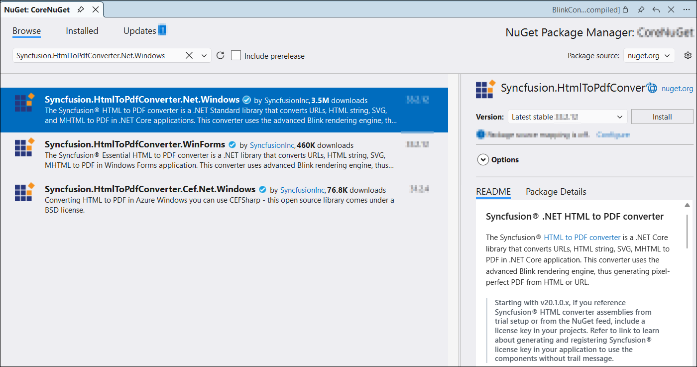
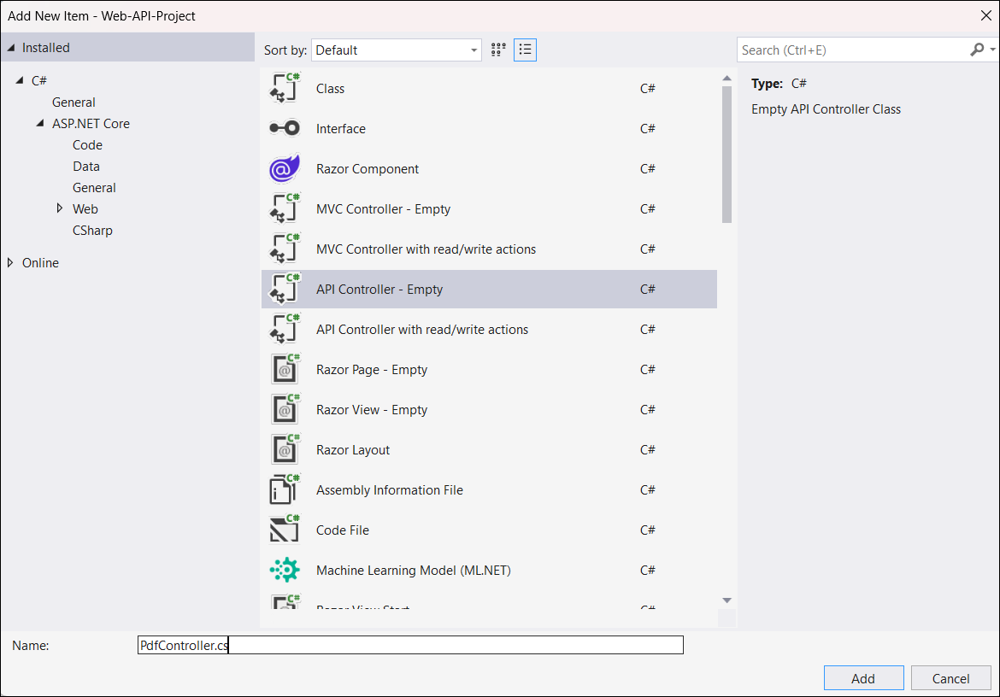

# Convert HTML to PDF file in ASP.NET Core Web API

The [HTML to PDF converter](https://www.syncfusion.com/document-sdk/net-pdf-library/html-to-pdf) is a .NET library for converting webpages, SVG, MHTML, and HTML to PDF using C#. Using this library, you can convert HTML to PDF documents in ASP.NET Core Web API applications.

## Prerequisites

**Version Compatibility**

The **Syncfusion.HtmlToPdfConverter.Net.Windows** NuGet package uses the Blink rendering engine for HTML to PDF conversion. This library is compatible with **.NET 8.0 and later** versions

**Supported Inputs**

The HTML to PDF converter supports the following input types:

- HTML String: Direct HTML content.
- URL: Web pages and online HTML content.
- HTML Files: Local HTML files.
- MHTML Files: Web archive (.mhtml/.mht) content.
- Authenticated Web Pages: Pages that require cookies, form authentication, or HTTP authentication.
- HTTP GET/POST Requests: HTML content accessed through GET or POST methods

**Register the license key**

N> Starting with v16.2.0.x, if you reference Syncfusion&reg; assemblies from trial setup or from the NuGet feed, you must add the "Syncfusion.Licensing" assembly reference and register a license key in your application. Please refer to this [link](https://help.syncfusion.com/common/essential-studio/licensing/overview) for details on registering a Syncfusion&reg; license key.

Include a license key in your **PdfController.cs** file before creating an **HtmlToPdfConverter** instance. Refer to the [Syncfusion License](https://help.syncfusion.com/common/essential-studio/licensing/overview) documentation to learn about registering the Syncfusion license key in your application.




using Syncfusion.Licensing;

public class PdfController
{
    // Register the Syncfusion license
    SyncfusionLicenseProvider.RegisterLicense("YOUR LICENSE KEY");
}




## Steps to convert HTML to PDF in ASP.NET Core Web API

Step 1: Create a new C# **ASP.NET Core Web API** project in Visual Studio.

Step 2: In the project configuration dialog, name your project and click **Create**.

Step 3: Install the [Syncfusion.HtmlToPdfConverter.Net.Windows](https://www.nuget.org/packages/Syncfusion.HtmlToPdfConverter.Net.Windows) NuGet package as a reference to your .NET application from [NuGet.org](https://www.nuget.org/).

Step 4: Add a new API controller to the project.

Step 5: Add the following namespaces to the **PdfController.cs** file:




using Syncfusion.Drawing;
using Syncfusion.HtmlConverter;
using Syncfusion.Pdf;




Step 6: Add the following code to the **PdfController.cs** file to convert HTML to PDF using the [Convert](https://help.syncfusion.com/cr/document-processing/Syncfusion.HtmlConverter.HtmlToPdfConverter.html#Syncfusion_HtmlConverter_HtmlToPdfConverter_Convert_System_String_) method in the [HtmlToPdfConverter](https://help.syncfusion.com/cr/document-processing/Syncfusion.HtmlConverter.HtmlToPdfConverter.html) class with [BlinkConverterSettings](https://help.syncfusion.com/cr/document-processing/Syncfusion.HtmlConverter.BlinkConverterSettings.html):




[HttpGet("/api/Pdf")]
public IActionResult ConvertHTMLtoPDF()
{
    // Initialize HTML to PDF converter with Blink rendering engine
    HtmlToPdfConverter htmlConverter = new HtmlToPdfConverter();
    // Create Blink converter settings for output rendering
    BlinkConverterSettings blinkConverterSettings = new BlinkConverterSettings();
    // Set Blink viewport size for responsive HTML rendering (width x height)
    blinkConverterSettings.ViewPortSize = new Size(1280, 0);
    // Assign Blink converter settings to HTML converter instance
    htmlConverter.ConverterSettings = blinkConverterSettings;
    // Convert URL to PDF document using Blink rendering
    PdfDocument document = htmlConverter.Convert("https://www.syncfusion.com");
    // Create memory stream to hold PDF binary data
    MemoryStream stream = new MemoryStream();
    // Save the PDF document to memory stream
    document.Save(stream);
    // Reset stream position to beginning for file response
    stream.Position = 0;
    // Return PDF file as HTTP response with proper MIME type and file name
    return File(stream, "application/pdf", "Output.pdf");
}




Step 7: Navigate to the **Swagger UI**, expand the **GET /api/Pdf** API endpoint, click **Execute**, and download the PDF response from the output.

By executing the program, the Web API will generate and return the PDF document:

A complete working sample for converting HTML to PDF in ASP.NET Core Web API can be downloaded from [GitHub](https://github.com/SyncfusionExamples/html-to-pdf-csharp-examples/tree/master/Web%20API).

Click [here](https://www.syncfusion.com/document-sdk/net-pdf-library/html-to-pdf) to explore the rich set of Syncfusion&reg; HTML to PDF converter library features. 

You can also view the online sample to [convert HTML to PDF documents](https://document.syncfusion.com/demos/pdf/htmltopdf#/tailwind3) in ASP.NET Core.