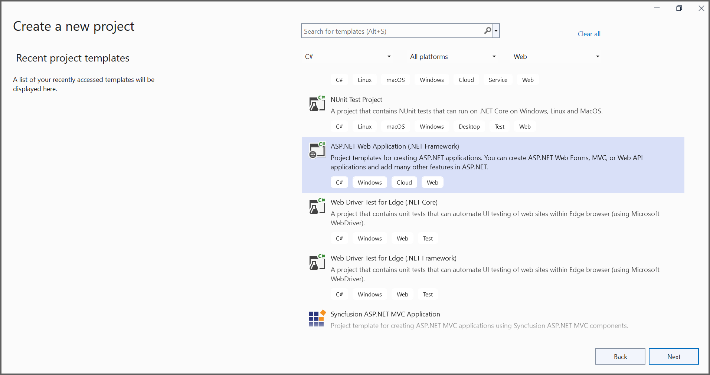
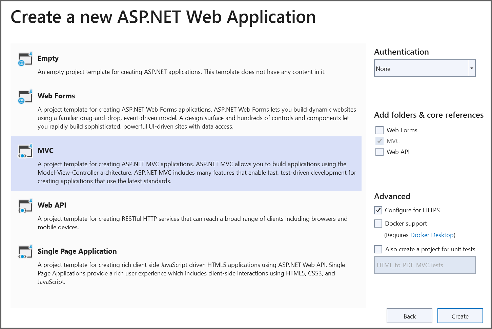
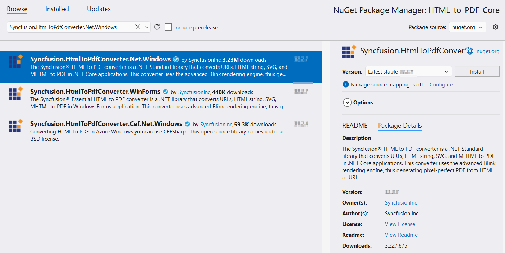
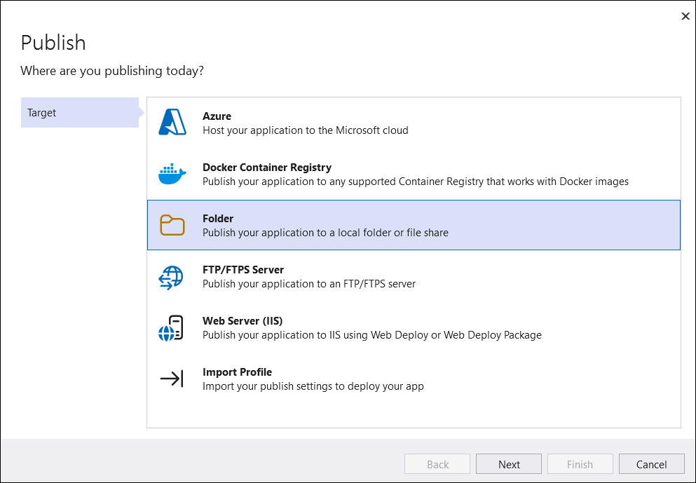
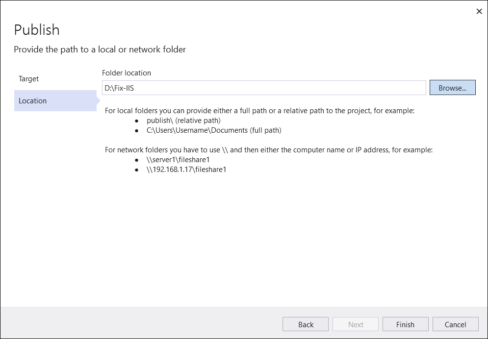
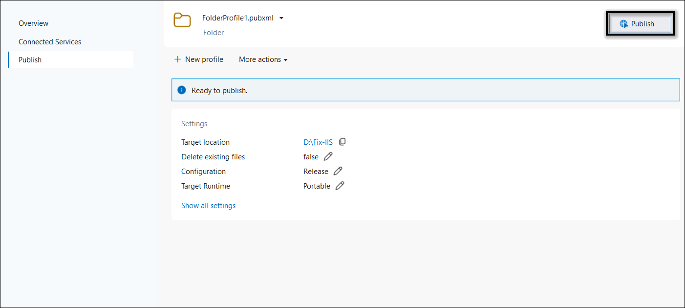
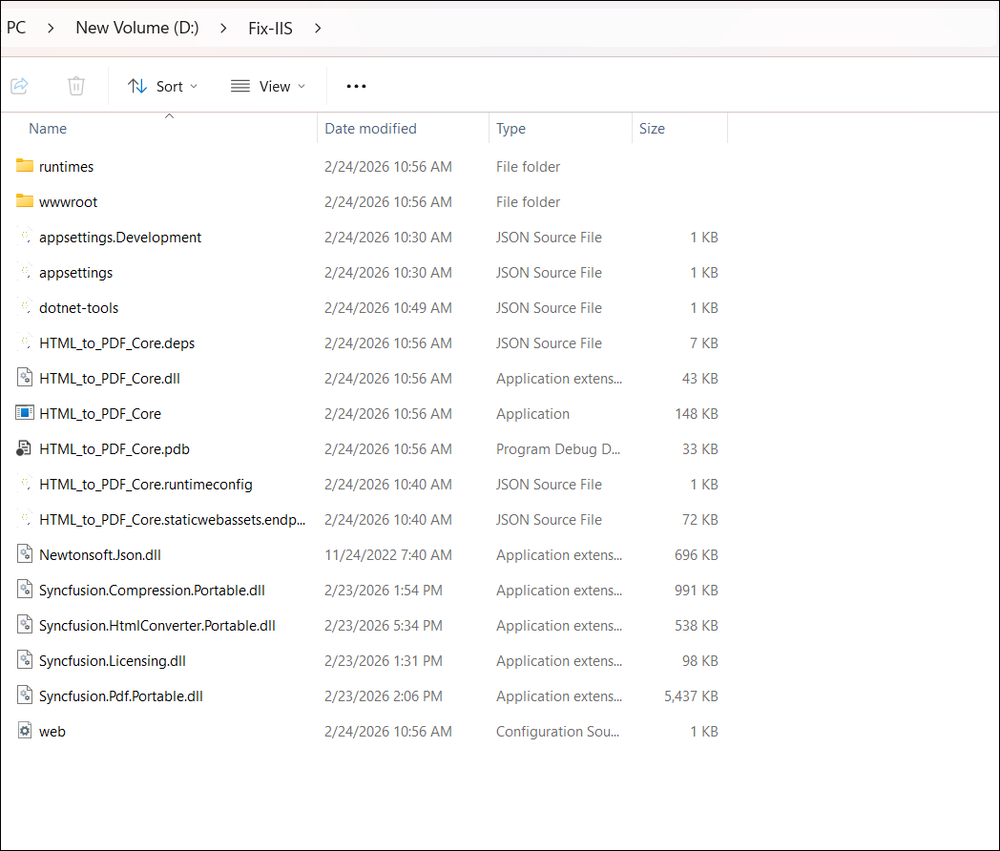
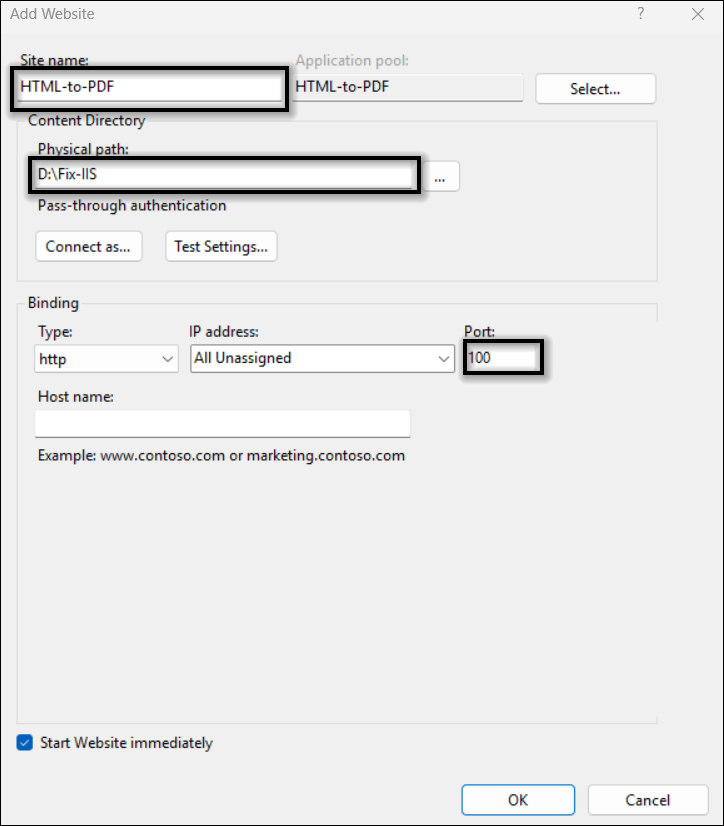
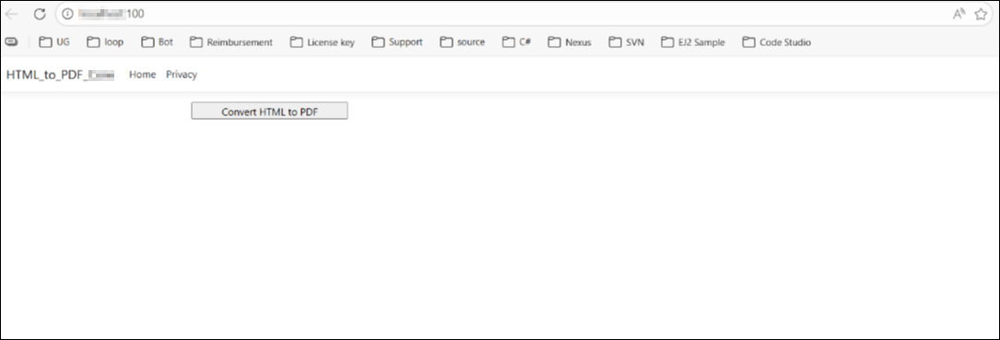
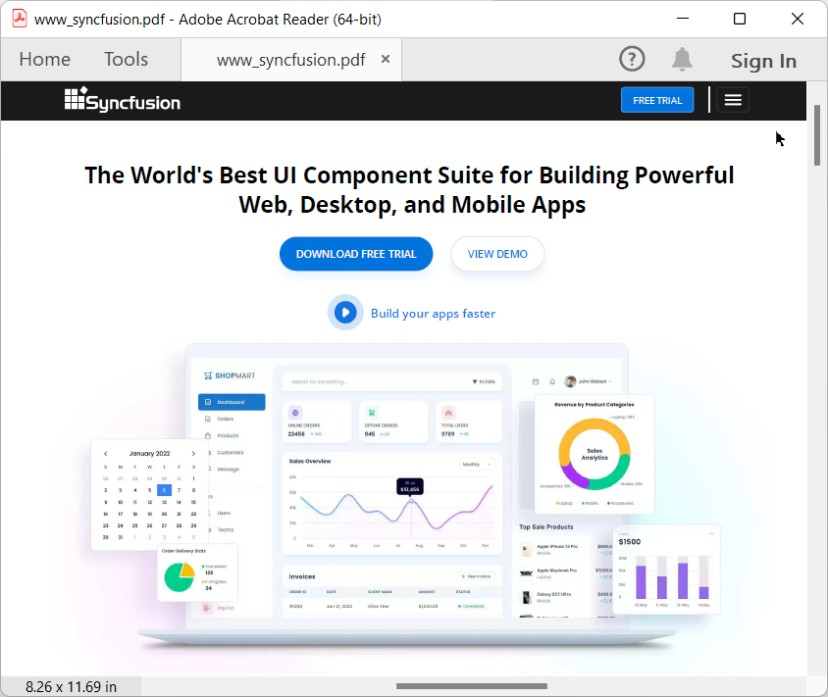

# Convert HTML to PDF on the Windows Server using IIS Manager

The [HTML to PDF converter](https://www.syncfusion.com/document-sdk/net-pdf-library/html-to-pdf) is a .NET library for converting webpages, SVG, MHTML, and HTML to PDF using C#. Using this library, you can convert HTML to PDF documents on a Windows Server using IIS Manager.

## Prerequisites

**Version Compatibility**

The **Syncfusion.HtmlToPdfConverter.Net.Windows** NuGet package uses the Blink rendering engine for HTML to PDF conversion. This library is compatible with **.NET 8.0 and later** versions

**Required Software**

- .NET 8.0 or later
- Windows Server with IIS installed and configured

**Supported Inputs**

The HTML to PDF converter supports the following input types:

- HTML String: Direct HTML content.
- URL: Web pages and online HTML content.
- HTML Files: Local HTML files.
- MHTML Files: Web archive (.mhtml/.mht) content.
- Authenticated Web Pages: Pages that require cookies, form authentication, or HTTP authentication.
- HTTP GET/POST Requests: HTML content accessed through GET or POST methods

**Register the license key**

N> Starting with v16.2.0.x, if you reference Syncfusion&reg; assemblies from trial setup or from the NuGet feed, you must add the "Syncfusion.Licensing" assembly reference and register a license key in your application. Please refer to this [link](https://help.syncfusion.com/common/essential-studio/licensing/overview) for details on registering a Syncfusion&reg; license key.

Include a license key in your **HomeController.cs** file before creating an **HtmlToPdfConverter** instance. Refer to the [Syncfusion License](https://help.syncfusion.com/common/essential-studio/licensing/overview) documentation to learn about registering the Syncfusion license key in your application.




using Syncfusion.Licensing;

public class HomeController
{
    // Register the Syncfusion license
    SyncfusionLicenseProvider.RegisterLicense("YOUR LICENSE KEY");
}




## Steps to convert HTML to PDF on Windows Server using IIS Manager

Step 1: Create a new C# **ASP.NET Web Application (.NET Framework)** project in Visual Studio.

Step 2: In the **Create a new ASP.NET Web Application** dialog, choose the **MVC** template and click **Next** to proceed.

Step 3: Install the [Syncfusion.HtmlToPdfConverter.Net.Windows](https://www.nuget.org/packages/Syncfusion.HtmlToPdfConverter.Net.Windows) NuGet package as a reference to your .NET application from [NuGet.org](https://www.nuget.org/).

Step 4: Add the following namespaces to the **HomeController.cs** file:




using Syncfusion.Pdf;
using Syncfusion.HtmlConverter;




Step 5: Add a new button in the Index.cshtml as shown below.




@{Html.BeginForm("ExportToPDF", "Home", FormMethod.Post);
    {
        

            <input type="submit" value="Convert PDF" style="width:150px;height:27px" />
        

    }
    Html.EndForm();
 }




Step 6: Add a new action method named **ExportToPDF** in **HomeController.cs** to convert HTML to PDF using the [Convert](https://help.syncfusion.com/cr/document-processing/Syncfusion.HtmlConverter.HtmlToPdfConverter.html#Syncfusion_HtmlConverter_HtmlToPdfConverter_Convert_System_String_) method in the [HtmlToPdfConverter](https://help.syncfusion.com/cr/document-processing/Syncfusion.HtmlConverter.HtmlToPdfConverter.html) class:




// Initialize HTML to PDF converter with Blink rendering engine
HtmlToPdfConverter htmlConverter = new HtmlToPdfConverter();
// Convert URL to PDF document
PdfDocument document = htmlConverter.Convert("https://www.syncfusion.com");
// Create memory stream to hold PDF binary data
MemoryStream stream = new MemoryStream();
// Save the PDF document to memory stream
document.Save(stream);
// Close the document and dispose resources
document.Close(true);
// Return PDF file as HTTP response with proper MIME type and file name
return File(stream.ToArray(), System.Net.Mime.MediaTypeNames.Application.Pdf, "HTML-to-PDF.pdf");




Step 7: Run the project and verify that HTML-to-PDF conversion works correctly in the local environment before publishing to the server.

## Publish the project to Windows Server using IIS

Step 1: Publish the project to a local folder by right-clicking the project, selecting **Publish**, choosing the **Folder** option, and clicking **Next**.

Step 2: Provide the folder path where the project should be published.

Step 3: After creating the publish profile, Visual Studio opens the Publish dashboard. Review the target location, configuration, and other settings, and adjust them if necessary. Once everything looks correct, click **Publish** to deploy the application to the selected destination.

Step 4: Visual Studio generates and publishes all necessary files to the local publish directory.

Step 5: Copy the published output folder to the Windows Server and host the application in IIS using the following steps:

   i. Open **IIS Manager** on the server and create a new website.

   ii. Enter a **site name** and select the **physical path** that points to the published output folder on the server.
   

   iii. Obtain the server's IP address after adding the website to IIS.

   iv. From your local computer, open a browser and navigate to the website using the server's IP address and port number. Once the site loads successfully, click the **Convert PDF** button to export the webpage to PDF.
   

The HTML-to-PDF conversion will complete and return the generated PDF document:

A complete working sample for converting HTML to PDF on Windows Server using IIS can be downloaded from [GitHub](https://github.com/SyncfusionExamples/html-to-pdf-csharp-examples/tree/master/ASP.NET%20Core).

Click [here](https://www.syncfusion.com/document-sdk/net-pdf-library/html-to-pdf) to explore the rich set of Syncfusion&reg; HTML to PDF converter library features. 

You can also view the online sample to [convert HTML to PDF documents](https://document.syncfusion.com/demos/pdf/htmltopdf#/tailwind3) in ASP.NET Core.