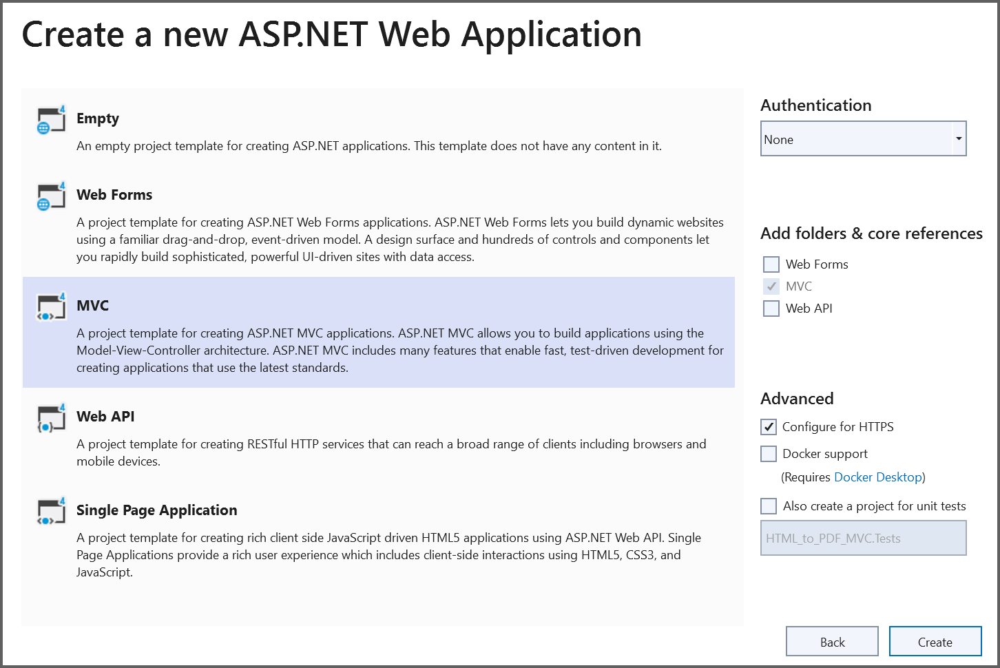

# Convert HTML to PDF on the Windows Server using IIS Manager

The Syncfusion&reg; HTML to PDF converter is a .NET library for converting webpages, SVG, MHTML, and HTML to PDF using C#. Using this library, convert HTML to PDF document on the Windows Server using IIS Manager.

## Steps to convert HTML to PDF on the windows server using IIS manager

Step 1: Create a new C# ASP.NET Web Application (.NET Framework) project.

Step 2: In the Create a new ASP.NET Web Application window, choose the MVC template and click Next to proceed.

Step 3: Install [Syncfusion.HtmlToPdfConverter.Net.Windows](https://www.nuget.org/packages/Syncfusion.HtmlToPdfConverter.Net.Windows) NuGet package as reference to your .NET Standard applications from [NuGet.org](https://www.nuget.org/).

Step 4: Include the following namespaces in the HomeController.cs file.



using Syncfusion.Pdf;
using Syncfusion.HtmlConverter;
using System.IO;



Step 5: Add a new button in the Index.cshtml as shown below.



@{Html.BeginForm("ExportToPDF", "Home", FormMethod.Post);
    {
        

            <input type="submit" value="Convert PDF" style="width:150px;height:27px" />
        

    }
    Html.EndForm();
 }



Step 6: Add a new action method named ExportToPDF in HomeController.cs and include the below code example to convert HTML to PDF document using [Convert](https://help.syncfusion.com/cr/document-processing/Syncfusion.HtmlConverter.HtmlToPdfConverter.html#Syncfusion_HtmlConverter_HtmlToPdfConverter_Convert_System_String_) method in [HtmlToPdfConverter](https://help.syncfusion.com/cr/document-processing/Syncfusion.HtmlConverter.HtmlToPdfConverter.html) class.



//Initialize HTML to PDF converter.
HtmlToPdfConverter htmlConverter = new HtmlToPdfConverter();
//Convert URL to PDF document.
PdfDocument document = htmlConverter.Convert("https://www.syncfusion.com");
//Create memory stream.
MemoryStream stream = new MemoryStream();
//Save the document to memory stream.
document.Save(stream);
document.Close(true);
return File(stream.ToArray(), System.Net.Mime.MediaTypeNames.Application.Pdf, "HTML-to-PDF.pdf");



Step 7: Run the project and verify that the HTML‑to‑PDF conversion functions correctly in the local environment.

## Publish the project to a Windows Server using IIS

Step 1: Publish the project to a local folder by right‑clicking the project, selecting **Publish**, choosing the **Folder** option, and clicking **Next**.

Step 2: Provide the folder path where the project should be published.

Step 3: After creating the publish profile, Visual Studio opens the Publish dashboard. Review the target location, configuration, and other settings, and adjust them if necessary. Once everything looks correct, click **Publish** to deploy the application to the selected destination.

Step 4: It will generate and publish all necessary files to the local publish directory.

Step 5: Copy the published output folder to the server and host the application in IIS.
i.Open **IIS Manager** on the server and create a new website.
ii.Enter a **site name** and select the **physical path** that points to the published output folder on the server.

iii. Obtain the server’s IP address after adding the website in the local IIS server.
iv. From your local computer, browse the website using the server’s IP address and port number. Once the site loads successfully, export the webpage to PDF.

A complete working sample is available for download from GitHub.

Click the button to convert the Syncfusion&reg; webpage into a PDF document. The generated PDF will appear as shown below.

