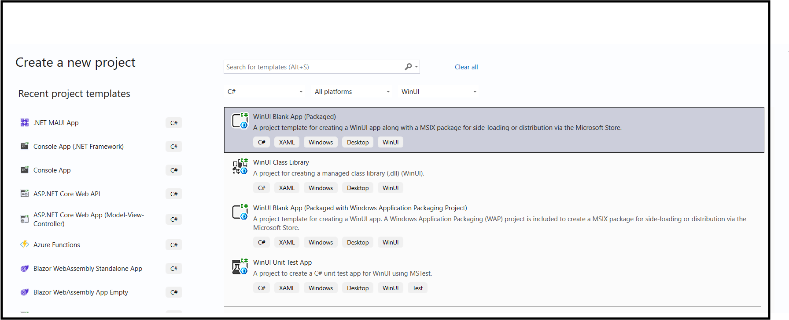
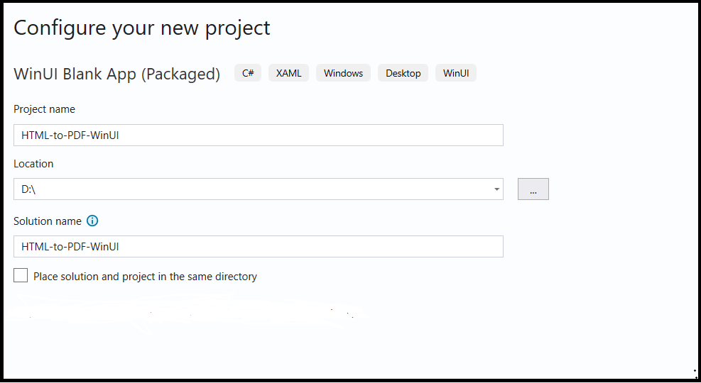
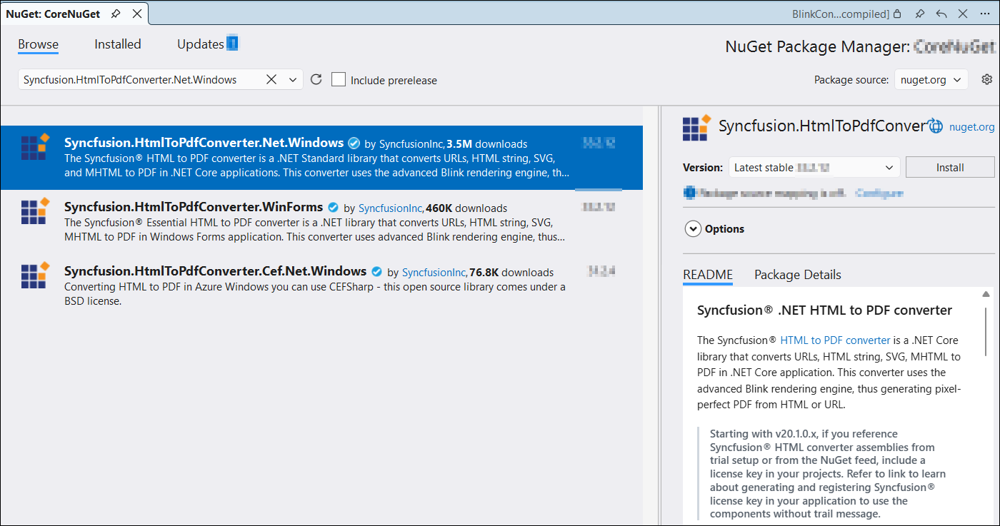
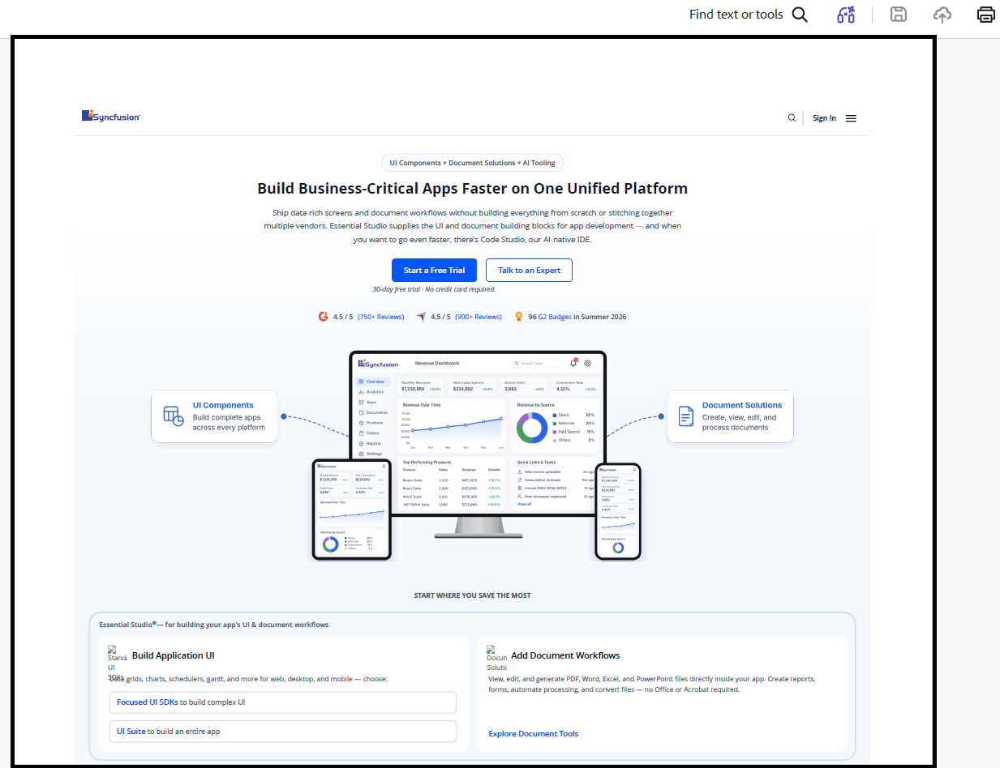

# HTML to PDF conversion in WinUI .NET Library

The [HTML to PDF converter](https://www.syncfusion.com/document-sdk/net-pdf-library/html-to-pdf) is a .NET library used to convert HTML or web pages to PDF documents in WinUI applications.

## WinUI Desktop app

Step 1: Create a new C# WinUI Desktop app. Select Blank App, Packaged with WAP (WinUI 3 in Desktop) from the template and click the **Next** button.
 

Step 2: Enter the project name and click **Create**.
 

Step 3: Install the [Syncfusion.HtmlToPdfConverter.Net.Windows](https://www.nuget.org/packages/Syncfusion.HtmlToPdfConverter.Net.Windows/) NuGet package as a reference to your project from [NuGet.org](https://www.nuget.org/).
 

Step 4: Register the Syncfusion&reg; license key in the *App.xaml.cs* file before any Syncfusion component is used, to remove the evaluation watermark. Replace `"YOUR LICENSE KEY"` with the actual key from your Syncfusion&reg; account.




using Microsoft.UI.Xaml;
using Syncfusion.Licensing;

namespace CreatePdfDemoSample
{
    public partial class App : Application
    {
        public App()
        {
            //Register the Syncfusion license key to remove the evaluation watermark.
            Syncfusion.Licensing.SyncfusionLicenseProvider.RegisterLicense("YOUR LICENSE KEY");
            this.InitializeComponent();
        }
    }
}




N> Starting with v16.2.0.x, if you reference Syncfusion&reg; assemblies from trial setup or from the NuGet feed, you must add the "Syncfusion.Licensing" assembly reference and register a license key in your application. Please refer to this [link](https://help.syncfusion.com/common/essential-studio/licensing/overview) for details on registering a Syncfusion&reg; license key.

Step 5: Add a new button to the **MainWindow.xaml** as shown below. This snippet replaces the default page contents of the empty WinUI 3 Desktop window.




<Window
    x:Class="HTML_to_PDF_WinUI.MainWindow"
    xmlns="http://schemas.microsoft.com/winfx/2006/xaml/presentation"
    xmlns:x="http://schemas.microsoft.com/winfx/2006/xaml"
    xmlns:local="using:HTML_to_PDF_WinUI"
    xmlns:d="http://schemas.microsoft.com/expression/blend/2008"
    xmlns:mc="http://schemas.openxmlformats.org/markup-compatibility/2006"
    mc:Ignorable="d"
    Title="HTML-to-PDF-WinUI">

    <Window.SystemBackdrop>
        <MicaBackdrop />
    </Window.SystemBackdrop>

    <Grid>
        <StackPanel
HorizontalAlignment="Center"
VerticalAlignment="Center"
Spacing="10">

            <Button Content="Convert HTML to PDF"
        Click="ConvertButton_Click"/>

            <TextBlock x:Name="StatusText"/>
        </StackPanel>
    </Grid>
    
</Window>




Step 6: Include the following namespaces in the **MainWindow.xaml.cs** file.




using Syncfusion.HtmlConverter;
using Syncfusion.Pdf;
using System;
using System.IO;





Step 7: Add a new action method `ConvertButton_Click` in *MainWindow.xaml.cs* to convert HTML to PDF using the [**Convert**](https://help.syncfusion.com/cr/document-processing/Syncfusion.HtmlConverter.HtmlToPdfConverter.html#Syncfusion_HtmlConverter_HtmlToPdfConverter_Convert_System_String_) method from the [**HtmlToPdfConverter**](https://help.syncfusion.com/cr/document-processing/Syncfusion.HtmlConverter.HtmlToPdfConverter.html) class. The HTML content will be scaled based on the [**ViewPortSize**](https://help.syncfusion.com/cr/document-processing/Syncfusion.HtmlConverter.BlinkConverterSettings.html#Syncfusion_HtmlConverter_BlinkConverterSettings_ViewPortSize) property of the [**BlinkConverterSettings**](https://help.syncfusion.com/cr/document-processing/Syncfusion.HtmlConverter.BlinkConverterSettings.html) class:




private void ConvertButton_Click(object sender, RoutedEventArgs e)
{
    try
    {
        // Initialize the HTML to PDF converter
        HtmlToPdfConverter converter = new HtmlToPdfConverter();
        // Create Blink converter settings
        BlinkConverterSettings settings = new BlinkConverterSettings();
        // Set Blink viewport size for rendering
        settings.ViewPortSize = new Syncfusion.Drawing.Size(1280, 0);
        // Assign Blink converter settings to the HTML converter
        converter.ConverterSettings = settings;
        // Convert URL to PDF document
        PdfDocument document = converter.Convert("https://www.syncfusion.com");

        string filePath = Path.Combine(Environment.GetFolderPath(Environment.SpecialFolder.Desktop),"Output.pdf");

        using FileStream stream = new FileStream(filePath, FileMode.Create, FileAccess.Write);
        // Save the document to file
        document.Save(stream);
        document.Close(true);

        StatusText.Text = $"PDF saved to: {filePath}";

        System.Diagnostics.Process.Start(new System.Diagnostics.ProcessStartInfo{FileName = filePath,UseShellExecute = true});
    }
    catch (Exception ex)
    {
        StatusText.Text = ex.ToString();

        System.Diagnostics.Debug.WriteLine(ex.ToString());
    }
}




You can download a complete working sample from [GitHub](https://github.com/SyncfusionExamples/PDF-Examples/tree/master/Getting%20Started/WinUI).

By executing the program, you will get the PDF document as follows.

Click [here](https://www.syncfusion.com/document-sdk/net-pdf-library/html-to-pdf) to explore the rich set of Syncfusion&reg; HTML to PDF converter library features. 

You can also view the online sample to [convert HTML to PDF documents](https://document.syncfusion.com/demos/pdf/htmltopdf#/tailwind3) in ASP.NET Core.