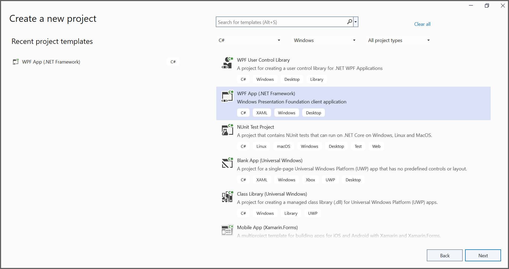
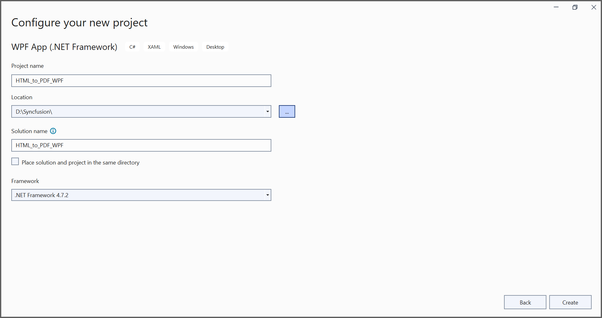
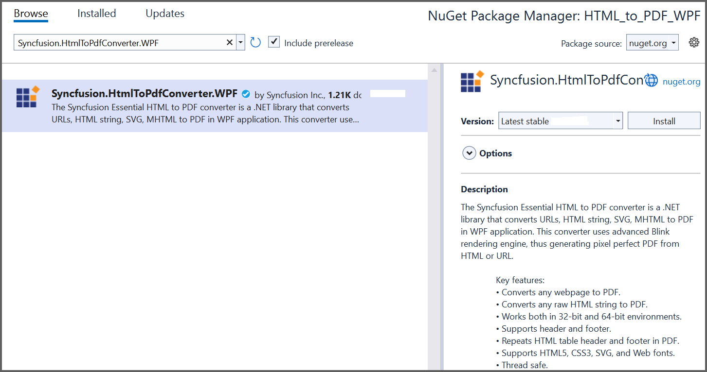

# Convert HTML to PDF file in WPF

The [HTML to PDF converter](https://www.syncfusion.com/document-sdk/net-pdf-library/html-to-pdf) is a .NET library used to convert HTML or web pages to PDF documents in WPF applications.

## Prerequisites

**Version Compatibility**

The **Syncfusion.HtmlToPdfConverter.WPF** NuGet package uses the Blink rendering engine for HTML to PDF conversion. This library is compatible with **.NET Framework 4.6.2 and later** versions.

**Supported Inputs**

The HTML to PDF converter supports the following input types:

- HTML String: Direct HTML content.
- URL: Web pages and online HTML content.
- HTML Files: Local HTML files.
- MHTML Files: Web archive (.mhtml/.mht) content.
- Authenticated Web Pages: Pages that require cookies, form authentication, or HTTP authentication.
- HTTP GET/POST Requests: HTML content accessed through GET or POST methods

**Register the license key**

N> Starting with v16.2.0.x, if you reference Syncfusion&reg; assemblies from trial setup or from the NuGet feed, you must add the "Syncfusion.Licensing" assembly reference and register a license key in your application. Please refer to this [link](https://help.syncfusion.com/common/essential-studio/licensing/overview) for details on registering a Syncfusion&reg; license key.

Include your license key in your application before initializing any Syncfusion components:




using Syncfusion.Licensing;

// Register your Syncfusion license key early in application startup
SyncfusionLicenseProvider.RegisterLicense("YOUR LICENSE KEY");




## Steps to Convert HTML to PDF in WPF

Step 1: Create a new WPF application project:

In the project configuration window, name your project and select **Create**:

Step 2: Install the [Syncfusion.HtmlToPdfConverter.WPF](https://www.nuget.org/packages/Syncfusion.HtmlToPdfConverter.WPF) NuGet package as a reference to your WPF application from [NuGet.org](https://www.nuget.org/):

Step 3: Include the following namespaces in the **MainWindow.xaml.cs** file to enable HTML-to-PDF conversion functionality:




using System.Windows;
using Syncfusion.Pdf;
using Syncfusion.HtmlConverter;




Step 4: Add a new button in the **MainWindow.xaml** file to trigger HTML to PDF conversion:




<Grid HorizontalAlignment="Left"
      Margin="0,0,0,-0.333"
      Width="793">
    <!-- Button control for triggering HTML to PDF conversion process -->
    <Button Content="Convert HTML to PDF"
            HorizontalAlignment="Left"
            VerticalAlignment="Top"
            Margin="318,210,0,0"
            Width="166"
            Height="19"
            Click="btnCreate_Click" />
    <!-- TextBlock for spacing and layout alignment -->
    <TextBlock HorizontalAlignment="Left"
               VerticalAlignment="Top"
               Margin="222,177,0,0"
               Height="17"
               TextWrapping="Wrap" />
    <!-- TextBlock displaying instruction text to the user -->
    <TextBlock HorizontalAlignment="Left"
               VerticalAlignment="Top"
               Margin="291,175,0,0"
               TextWrapping="Wrap"
               Text="Click the button to convert HTML to PDF." />
</Grid>




Step 5: Add the following code to the **btnCreate_Click** event handler to convert HTML to PDF documents using the [**Convert**](https://help.syncfusion.com/cr/document-processing/Syncfusion.HtmlConverter.HtmlToPdfConverter.html#Syncfusion_HtmlConverter_HtmlToPdfConverter_Convert_System_String_) method from the [**HtmlToPdfConverter**](https://help.syncfusion.com/cr/document-processing/Syncfusion.HtmlConverter.HtmlToPdfConverter.html) class. The HTML content will be scaled based on the [**ViewPortSize**](https://help.syncfusion.com/cr/document-processing/Syncfusion.HtmlConverter.BlinkConverterSettings.html#Syncfusion_HtmlConverter_BlinkConverterSettings_ViewPortSize) property of the [**BlinkConverterSettings**](https://help.syncfusion.com/cr/document-processing/Syncfusion.HtmlConverter.BlinkConverterSettings.html) class:




private void btnCreate_Click(object sender, RoutedEventArgs e)
{
   //Initialize HTML to PDF converter.
   HtmlToPdfConverter htmlConverter = new HtmlToPdfConverter();
   BlinkConverterSettings blinkConverterSettings = new BlinkConverterSettings();
   //Set Blink viewport size.
   blinkConverterSettings.ViewPortSize = new System.Drawing.Size(1280, 0);
   //Assign Blink converter settings to HTML converter.
   htmlConverter.ConverterSettings = blinkConverterSettings;
   //Convert URL to PDF document.
   PdfDocument document = htmlConverter.Convert("https://www.syncfusion.com");
   //Create file stream.
   FileStream stream = new FileStream("HTML-to-PDF.pdf", FileMode.CreateNew);
   //Save the document into stream.
   document.Save(stream);
   //If the position is not set to '0' then the PDF will be empty.
   stream.Position = 0;
   //Close the document.
   document.Close();
   stream.Dispose();
}




By executing the program, the application will convert the URL and generate a PDF document:

The generated PDF file will be saved as **HTML-to-PDF.pdf** in the application's working directory.

A complete working sample demonstrating HTML to PDF conversion in WPF can be downloaded from [GitHub](https://github.com/SyncfusionExamples/html-to-pdf-csharp-examples/tree/master/WPF).

Click [here](https://www.syncfusion.com/document-sdk/net-pdf-library/html-to-pdf) to explore the rich set of Syncfusion&reg; HTML to PDF converter library features. 

You can also view the online sample to [convert HTML to PDF documents](https://document.syncfusion.com/demos/pdf/htmltopdf#/tailwind3) in ASP.NET Core.