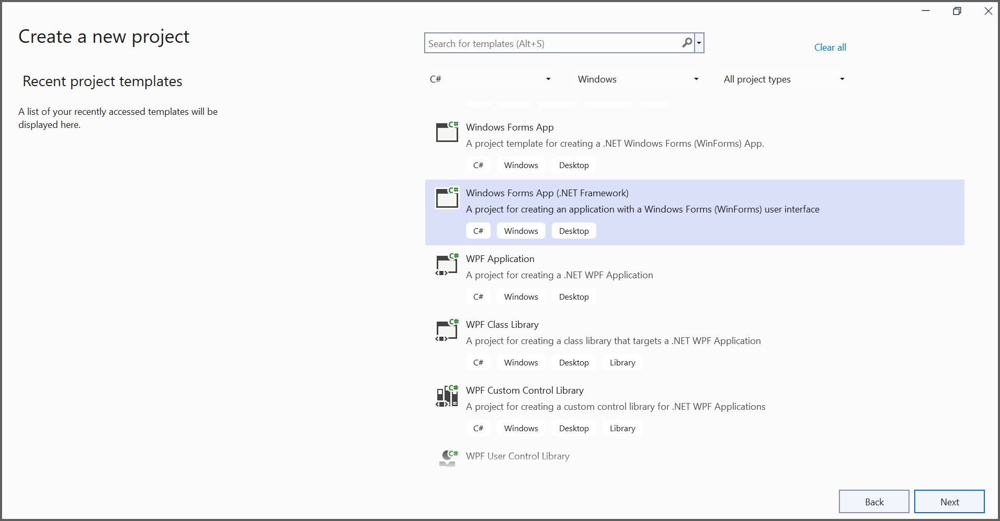
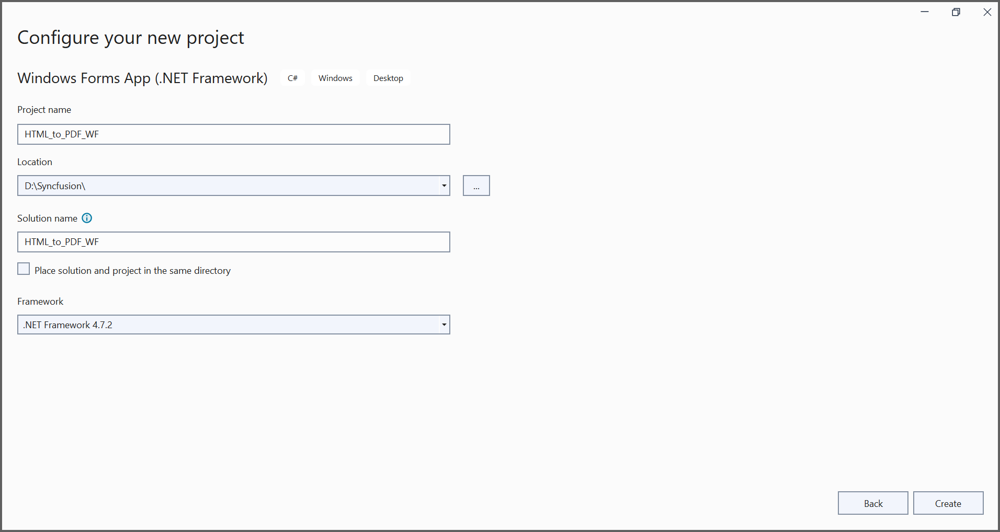
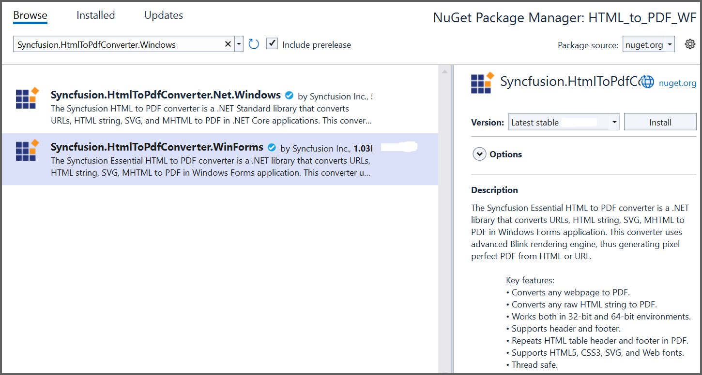

# Convert HTML to PDF file in Windows Forms

The [HTML to PDF converter](https://www.syncfusion.com/document-sdk/net-pdf-library/html-to-pdf) is a .NET library used to convert HTML or web pages to PDF documents in Windows Forms applications.

## Prerequisites

**Version Compatibility**

The **Syncfusion.HtmlToPdfConverter.WinForms** NuGet package uses the Blink rendering engine for HTML to PDF conversion. This library is compatible with **.NET Framework 4.6.2 and later** versions.

**Supported Inputs**

The HTML to PDF converter supports the following input types:

- HTML String: Direct HTML content.
- URL: Web pages and online HTML content.
- HTML Files: Local HTML files.
- MHTML Files: Web archive (.mhtml/.mht) content.
- Authenticated Web Pages: Pages that require cookies, form authentication, or HTTP authentication.
- HTTP GET/POST Requests: HTML content accessed through GET or POST methods

**Register the license key**

N> Starting with v16.2.0.x, if you reference Syncfusion&reg; assemblies from trial setup or from the NuGet feed, you must add the "Syncfusion.Licensing" assembly reference and register a license key in your application. Please refer to this [link](https://help.syncfusion.com/common/essential-studio/licensing/overview) for details on registering a Syncfusion&reg; license key.

Include your license key in your application before initializing any Syncfusion components:




using Syncfusion.Licensing;

// Register your Syncfusion license key early in application startup
SyncfusionLicenseProvider.RegisterLicense("YOUR LICENSE KEY");




## Steps to Convert HTML to PDF in Windows Forms

Step 1: Create a new Windows Forms application project:

In the project configuration window, name your project and select **Create**:

Step 2: Install the [Syncfusion.HtmlToPdfConverter.WinForms](https://www.nuget.org/packages/Syncfusion.HtmlToPdfConverter.WinForms) NuGet package as a reference to your Windows Forms application from [NuGet.org](https://www.nuget.org/):

Step 3: Add the following namespaces to the **Form1.Designer.cs** file:




using System;
using System.Windows.Forms;




Step 4: Add a new button in the **Form1.Designer.cs** file to convert HTML to PDF documents:




private Button btnCreate;
private Label label;

private void InitializeComponent()
{
   // Initialize button control instance
   btnCreate = new Button();
   // Initialize label control instance
   label = new Label();

   // Configure label properties for user instruction display
   label.Location = new System.Drawing.Point(0, 40);
   label.Size = new System.Drawing.Size(426, 35);
   label.Text = "Click the button to convert HTML to PDF file";
   label.TextAlign = System.Drawing.ContentAlignment.MiddleCenter;

   // Configure button properties for HTML to PDF conversion trigger
   btnCreate.Location = new System.Drawing.Point(180, 110);
   btnCreate.Size = new System.Drawing.Size(85, 26);
   btnCreate.Text = "Convert HTML to PDF";
   // Attach click event handler to button (btnCreate_Click method in Form1.cs)
   btnCreate.Click += new EventHandler(btnCreate_Click);

   // Configure form window properties and add controls
   ClientSize = new System.Drawing.Size(450, 150);
   Controls.Add(label);
   Controls.Add(btnCreate);
   Text = "Convert HTML to PDF";
}




Step 5: Include the following namespaces in the **Form1.cs** file to enable HTML-to-PDF conversion functionality:




using Syncfusion.HtmlConverter;
using Syncfusion.Pdf;




Step 6: Create the **btnCreate_Click** event handler and add the following code to convert HTML to PDF documents using the [**Convert**](https://help.syncfusion.com/cr/document-processing/Syncfusion.HtmlConverter.HtmlToPdfConverter.html#Syncfusion_HtmlConverter_HtmlToPdfConverter_Convert_System_String_) method from the [**HtmlToPdfConverter**](https://help.syncfusion.com/cr/document-processing/Syncfusion.HtmlConverter.HtmlToPdfConverter.html) class. The HTML content will be scaled based on the [**ViewPortSize**](https://help.syncfusion.com/cr/document-processing/Syncfusion.HtmlConverter.BlinkConverterSettings.html#Syncfusion_HtmlConverter_BlinkConverterSettings_ViewPortSize) property of the [**BlinkConverterSettings**](https://help.syncfusion.com/cr/document-processing/Syncfusion.HtmlConverter.BlinkConverterSettings.html) class:




private void btnCreate_Click(object sender, EventArgs e)
{
   // Initialize HTML to PDF converter
   HtmlToPdfConverter htmlConverter = new HtmlToPdfConverter();
   // Create Blink converter settings
   BlinkConverterSettings blinkConverterSettings = new BlinkConverterSettings();
   // Set Blink viewport size
   blinkConverterSettings.ViewPortSize = new System.Drawing.Size(1280, 0);
   // Assign Blink converter settings
   htmlConverter.ConverterSettings = blinkConverterSettings;
   // Convert the specified URL to a PDF document
   PdfDocument document = htmlConverter.Convert("https://www.syncfusion.com");
   // Create a FileStream
   FileStream stream = new FileStream("HTML-to-PDF.pdf", FileMode.CreateNew);
   // Save the PDF document
   document.Save(stream);
   // Reset the stream position
   stream.Position = 0;
   // Close the PDF document
   document.Close();
   // Close the stream
   stream.Dispose();
}




By executing the program, the application will convert the URL and generate a PDF document:

The generated PDF file will be saved as **HTML-to-PDF.pdf** in the application's working directory.

A complete working sample demonstrating HTML to PDF conversion in Windows Forms can be downloaded from [GitHub](https://github.com/SyncfusionExamples/html-to-pdf-csharp-examples/tree/master/Windows%20Forms).

Click [here](https://www.syncfusion.com/document-sdk/net-pdf-library/html-to-pdf) to explore the rich set of Syncfusion&reg; HTML to PDF converter library features. 

You can also view the online sample to [convert HTML to PDF documents](https://document.syncfusion.com/demos/pdf/htmltopdf#/tailwind3) in ASP.NET Core.