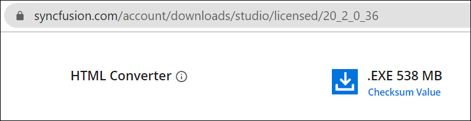
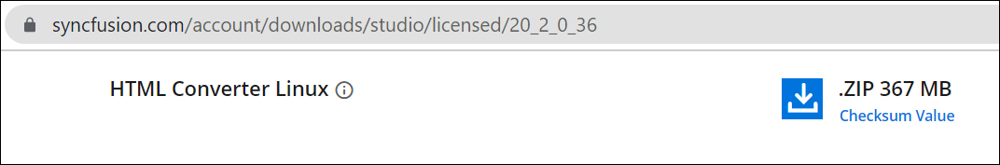
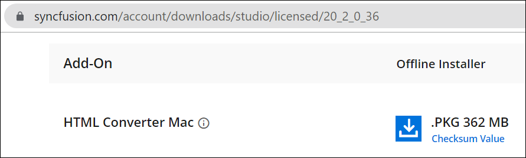

# Advanced Installation

The [HTML to PDF Converter](https://www.syncfusion.com/document-sdk/net-pdf-library/html-to-pdf) uses the Blink rendering engine to convert HTML, web pages, and web content into PDF documents. The converter is available for Windows, Linux, and macOS.

**Prerequisites:**
Before installing the HTML to PDF Converter:

* Ensure that you have a valid Syncfusion license.
* Verify that your development environment supports the version of Syncfusion&reg; PDF Library you are using.
* Download the latest installer package from the Syncfusion Downloads page:

[https://www.syncfusion.com/account/downloads](https://www.syncfusion.com/account/downloads)

## Windows

Get the required assemblies and demos for converting HTML to PDF by installing the HTML converter installer for windows. 

## Linux

Get the required assemblies and demos for converting HTML to PDF by installing the HTML converter installer for Linux. 

## Mac

Get the required assemblies and demos for converting HTML to PDF by installing the HTML converter installer for Mac. 

