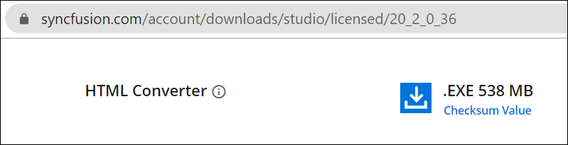
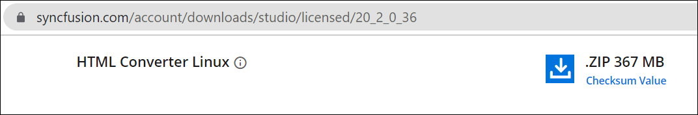
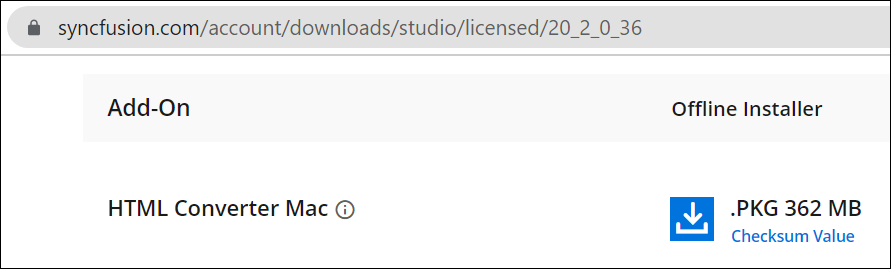

# Advanced Installation

You can download and install the HTML to PDF converter for Windows, Linux and Mac platforms. 

[https://www.syncfusion.com/account/downloads](https://www.syncfusion.com/account/downloads )

## Windows

Get the required assemblies and demos for converting HTML to PDF by installing the HTML converter installer for windows. 

## Linux

Get the required assemblies and demos for converting HTML to PDF by installing the HTML converter installer for Linux. 

## Mac

Get the required assemblies and demos for converting HTML to PDF by installing the HTML converter installer for Mac. 

