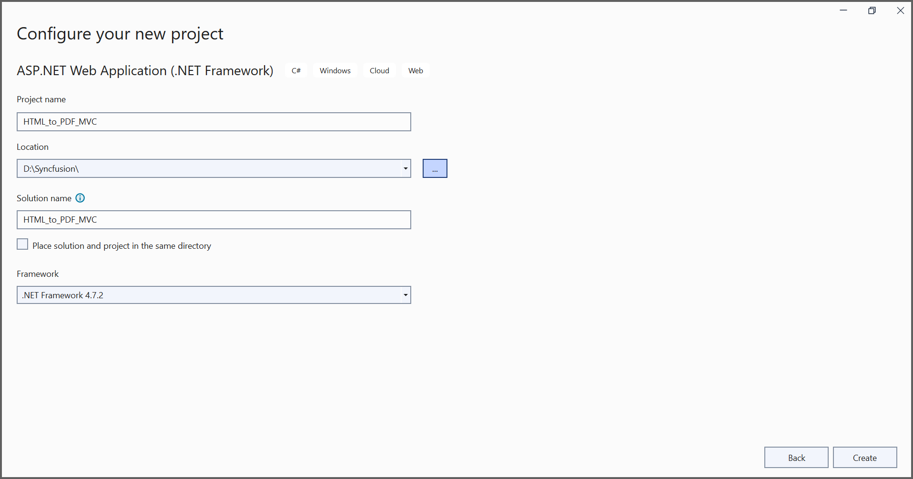
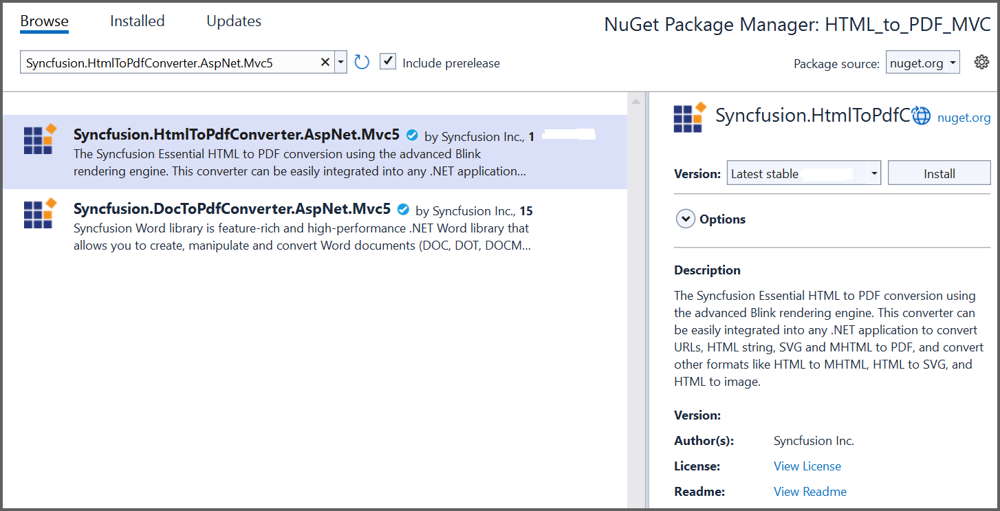

# Convert HTML to PDF file in ASP.NET MVC

The [HTML to PDF converter](https://www.syncfusion.com/document-sdk/net-pdf-library/html-to-pdf) is a .NET library used to convert HTML or web pages to PDF documents in ASP.NET MVC applications.

## Prerequisites

**Version Compatibility**

The **Syncfusion.HtmlToPdfConverter.AspNet.Mvc5** NuGet package uses the Blink rendering engine for HTML to PDF conversion. This library is compatible with **.NET Framework 4.6.2 and later** versions.

**Supported Inputs**

The HTML to PDF converter supports the following input types:

- HTML String: Direct HTML content.
- URL: Web pages and online HTML content.
- HTML Files: Local HTML files.
- MHTML Files: Web archive (.mhtml/.mht) content.
- Authenticated Web Pages: Pages that require cookies, form authentication, or HTTP authentication.
- HTTP GET/POST Requests: HTML content accessed through GET or POST methods

**Register the license key**

N> Starting with v16.2.0.x, if you reference Syncfusion&reg; assemblies from trial setup or from the NuGet feed, you must add the "Syncfusion.Licensing" assembly reference and register a license key in your application. Please refer to this [link](https://help.syncfusion.com/common/essential-studio/licensing/overview) for details on registering a Syncfusion&reg; license key.

Include a license key in the **Global.asax.cs** file before creating an **HtmlToPdfConverter** instance. Refer to the [Syncfusion License](https://help.syncfusion.com/common/essential-studio/licensing/overview) documentation to learn about registering the Syncfusion license key in your application.




using Syncfusion.Licensing;

protected void Application_Start()
{
    // Register the Syncfusion license
    SyncfusionLicenseProvider.RegisterLicense("YOUR LICENSE KEY");
}




## Steps to convert HTML to PDF document in ASP.NET MVC

Step 1: Create a new C# ASP.NET Web Application (.NET Framework) project targeting **.NET Framework 4.6.2** or **later**:
   

Step 2: In the project configuration window, name your project and select **Create**:
   
   

Step 3: Install the [Syncfusion.HtmlToPdfConverter.AspNet.Mvc5](https://www.nuget.org/packages/Syncfusion.HtmlToPdfConverter.AspNet.Mvc5) NuGet package into your .NET application from [NuGet.org](https://www.nuget.org/):

Step 4: Include the following namespaces in the **HomeController.cs** file:




using Syncfusion.Pdf;
using Syncfusion.HtmlConverter;




Step 5: Add a new button in the **Index.cshtml** as shown below:




@{Html.BeginForm("ExportToPDF", "Home", FormMethod.Post);
    {
        

            <input type="submit" value="Convert PDF" style="width:150px;height:27px" />
        

    }
    Html.EndForm();
 }




Step 6: Add a new action method named **ExportToPDF** in **HomeController.cs** and include the following code example to convert HTML to PDF document using the [Convert](https://help.syncfusion.com/cr/document-processing/Syncfusion.HtmlConverter.HtmlToPdfConverter.html#Syncfusion_HtmlConverter_HtmlToPdfConverter_Convert_System_String_) method of the [HtmlToPdfConverter](https://help.syncfusion.com/cr/document-processing/Syncfusion.HtmlConverter.HtmlToPdfConverter.html) class. The HTML content will be scaled based on the [ViewPortSize](https://help.syncfusion.com/cr/document-processing/Syncfusion.HtmlConverter.BlinkConverterSettings.html#Syncfusion_HtmlConverter_BlinkConverterSettings_ViewPortSize) property of the [BlinkConverterSettings](https://help.syncfusion.com/cr/document-processing/Syncfusion.HtmlConverter.BlinkConverterSettings.html) class:




public IActionResult ExportToPDF()
{
    // Initialize the HTML to PDF converter
    HtmlToPdfConverter htmlConverter = new HtmlToPdfConverter();
    // Create Blink converter settings
    BlinkConverterSettings blinkConverterSettings = new BlinkConverterSettings();
    // Set the Blink viewport size for rendering
    blinkConverterSettings.ViewPortSize = new Syncfusion.Drawing.Size(1280, 0);
    // Assign the Blink converter settings to the HTML converter
    htmlConverter.ConverterSettings = blinkConverterSettings;
    // Convert URL to PDF document
    PdfDocument document = htmlConverter.Convert("https://www.syncfusion.com");
    // Create memory stream for file download
    MemoryStream stream = new MemoryStream();
    // Save the document to memory stream
    document.Save(stream);
    // Close the document
    document.Close();
    // Return the PDF file to the browser
    return File(stream.ToArray(), System.Net.Mime.MediaTypeNames.Application.Pdf, "HTML-to-PDF.pdf");
}




By executing the program, you will obtain a PDF document as follows:
  

A complete working sample can be downloaded from [GitHub](https://github.com/SyncfusionExamples/html-to-pdf-csharp-examples/tree/master/ASP.NET%20MVC).

Click [here](https://www.syncfusion.com/document-processing/pdf-framework/net/html-to-pdf) to explore the rich set of Syncfusion&reg; HTML to PDF converter library features. 

An online sample link to [convert HTML to PDF document](https://document.syncfusion.com/demos/pdf/htmltopdf#/tailwind3) in ASP.NET MVC. 