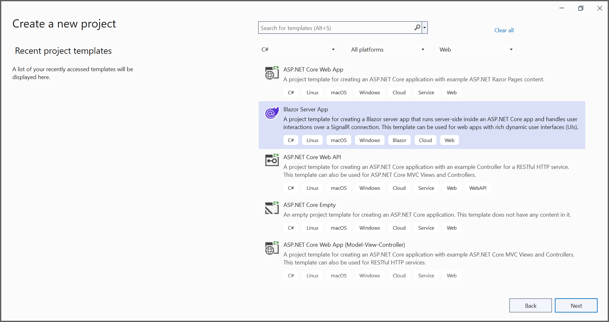
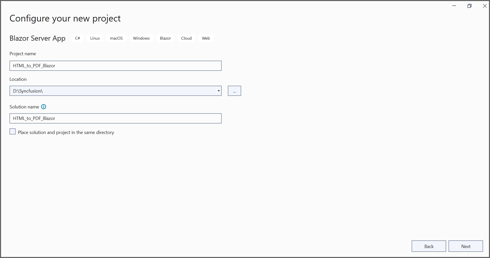
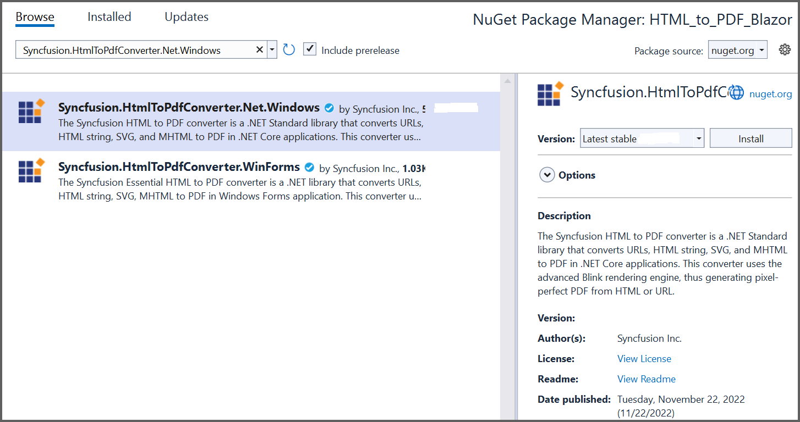
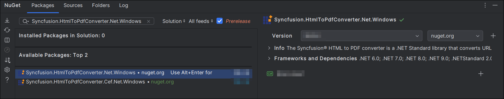
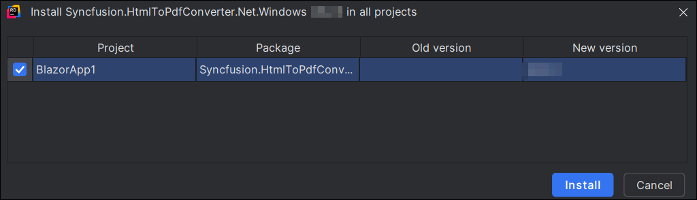
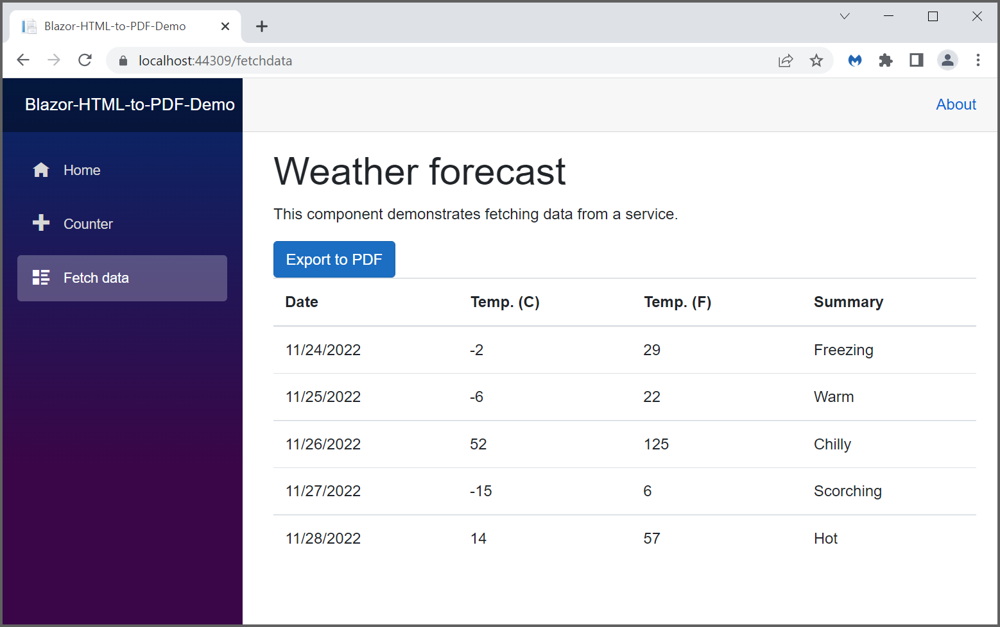
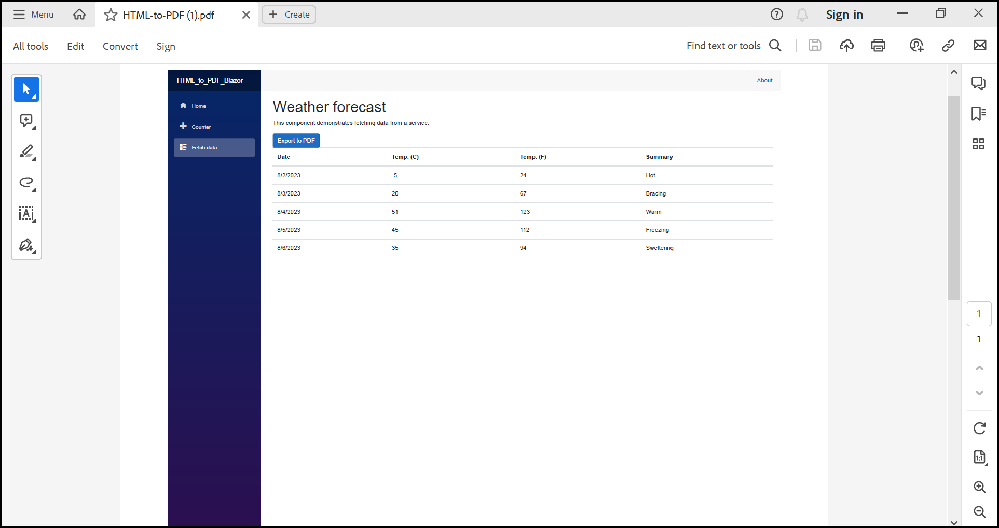

# Convert HTML to PDF file in Blazor

The [HTML to PDF converter](https://www.syncfusion.com/document-sdk/net-pdf-library/html-to-pdf) is a .NET library used to convert HTML or web pages to PDF documents in Blazor applications.

## Prerequisites

**Version Compatibility**

The **Syncfusion.HtmlToPdfConverter.Net.Windows** NuGet package uses the Blink rendering engine for HTML to PDF conversion. This library is compatible with **.NET 8.0 and later** versions.

N> HTML to PDF conversion is supported only in **Blazor Server-Side**, not in Blazor WebAssembly (WASM).

**Supported Inputs**

The HTML to PDF converter supports the following input types:

- HTML String: Direct HTML content.
- URL: Web pages and online HTML content.
- HTML Files: Local HTML files.
- MHTML Files: Web archive (.mhtml/.mht) content.
- Authenticated Web Pages: Pages that require cookies, form authentication, or HTTP authentication.
- HTTP GET/POST Requests: HTML content accessed through GET or POST methods

**Required Software**

- .NET 8 SDK or later
- Visual Studio, Visual Studio Code, or JetBrains Rider

**Register the license key**

N> Starting with v16.2.0.x, if you reference Syncfusion<sup>&reg;</sup> assemblies from trial setup or from the NuGet feed, you must add the "Syncfusion.Licensing" assembly reference and register a license key in your application. Please refer to this [link](https://help.syncfusion.com/common/essential-studio/licensing/overview) for details on registering a Syncfusion<sup>&reg;</sup> license key.

Include a license key in your **Startup.cs** file before creating an **HtmlToPdfConverter** instance. Refer to the [Syncfusion License](https://help.syncfusion.com/common/essential-studio/licensing/overview) documentation to learn about registering the Syncfusion license key in your application.




using Syncfusion.Licensing;

public void ConfigureServices(IServiceCollection services)
{
    // Register the Syncfusion license
    SyncfusionLicenseProvider.RegisterLicense("YOUR LICENSE KEY");
}




## Steps to convert HTML to PDF in Blazor application





Step 1: Create a new C# Blazor Server application project. Select **Blazor App** from the template and click the **Next** button:
  

In the project configuration window, name your project and select **Create**:
 

Step 2: Install the [Syncfusion.HtmlToPdfConverter.Net.Windows](https://www.nuget.org/packages/Syncfusion.HtmlToPdfConverter.Net.Windows/) NuGet package into your Blazor Server application from [NuGet.org](https://www.nuget.org/):


Step 3: Create a new class file named **ExportService** under the **Data** folder and include the following namespaces in the file:




using Syncfusion.HtmlConverter;
using Syncfusion.Pdf;




Step 4: Add the following code to the **ExportService** class to convert HTML to PDF document using the [Convert](https://help.syncfusion.com/cr/document-processing/Syncfusion.HtmlConverter.HtmlToPdfConverter.html#Syncfusion_HtmlConverter_HtmlToPdfConverter_Convert_System_String_) method of the [HtmlToPdfConverter](https://help.syncfusion.com/cr/document-processing/Syncfusion.HtmlConverter.HtmlToPdfConverter.html) class:




public MemoryStream CreatePdf(string url)
{
    // Initialize the HTML to PDF converter
    HtmlToPdfConverter htmlConverter = new HtmlToPdfConverter();    
    // Convert URL to PDF document
    PdfDocument document = htmlConverter.Convert(url);
    // Create memory stream for output
    MemoryStream stream = new MemoryStream();
    // Save the document to memory stream
    document.Save(stream);
    return stream;
}




Step 5: Register your service in the **ConfigureServices** method available in the **Startup.cs** class:




/// <summary>
/// Register your ExportService 
/// </summary>
public void ConfigureServices(IServiceCollection services)
{
    services.AddRazorPages();
    services.AddServerSideBlazor();
    services.AddSingleton<WeatherForecastService>();
    services.AddSingleton<ExportService>();
}




Step 6: Inject **ExportService** into **FetchData.razor** using the following code:




@inject ExportService exportService
@inject Microsoft.JSInterop.IJSRuntime JS
@inject NavigationManager NavigationManager
@using  System.IO




Step 7: Create a button in the **FetchData.razor** using the following code:




<button class="btn btn-primary" @onclick="@ExportToPdf">Export to PDF</button>




Step 8: Add the **ExportToPdf** method in the **FetchData.razor** page to call the export service:




@code {
    private string currentUrl;
    /// <summary>
    /// Get the current URL
    /// </summary>
    protected override void OnInitialized()
    {
        currentUrl = NavigationManager.Uri;
    }
}

@functions
{
    /// <summary>
    /// Create and download the PDF document
    /// </summary>
    protected async Task ExportToPdf()
    {
        ExportService exportService = new ExportService();
        using (MemoryStream excelStream = exportService.CreatePdf(currentUrl))
        {
            await JS.SaveAs("HTMLToPDF.pdf", excelStream.ToArray());
        }
    }
}




Step 9: Create a class file with FileUtil name and add the following code to invoke the JavaScript action to download the file in the browser.




public static class FileUtil
{
    public static ValueTask<object> SaveAs(this IJSRuntime js, string filename, byte[] data)
     => js.InvokeAsync<object>(
         "saveAsFile",
         filename,
         Convert.ToBase64String(data));
}




Step 10: Add the following JavaScript function in the _Host.cshtml available under the Pages folder.




<script type="text/javascript">
    function saveAsFile(filename, bytesBase64)
    {
        if (navigator.msSaveBlob)
        {
            //Download document in Edge browser
            var data = window.atob(bytesBase64);
            var bytes = new Uint8Array(data.length);
            for (var i = 0; i < data.length; i++)
            {
                bytes[i] = data.charCodeAt(i);
            }
            var blob = new Blob([bytes.buffer], { type: "application/octet-stream" });
            navigator.msSaveBlob(blob, filename);
        }
        else
        {
            var link = document.createElement('a');
            link.download = filename;
            link.href = "data:application/octet-stream;base64," + bytesBase64;
            document.body.appendChild(link); // Needed for Firefox
            link.click();
            document.body.removeChild(link);
        }
    }
</script>




Step 11: Build the project.

Click the **Build** button in the toolbar or press <kbd>Ctrl</kbd>+<kbd>Shift</kbd>+<kbd>B</kbd> to build the project.

Step 12: Run the project.

Click the **Run** button (green arrow) in the toolbar or press <kbd>F5</kbd> to run the app.





Step 1: Open the terminal (<kbd>Ctrl</kbd>+<kbd>`</kbd>) and run the following command to create a new Blazor Server application:

```
dotnet new blazorserver -n CreatePdfBlazorServerApp
```

Step 2: Replace **CreatePdfBlazorServerApp** with your desired project name.

Step 3: Navigate to the project directory using the following command:

```
cd CreatePdfBlazorServerApp
```

Step 4: Use the following command in the terminal to add the [Syncfusion.HtmlToPdfConverter.Net.Windows](https://www.nuget.org/packages/Syncfusion.HtmlToPdfConverter.Net.Windows/) package to your project:

```
dotnet add package Syncfusion.HtmlToPdfConverter.Net.Windows
```

Step 5: Create a new class file named **ExportService** under the **Data** folder and include the following namespaces in the file:




using Syncfusion.HtmlConverter;
using Syncfusion.Pdf;
using System.IO;




Step 6: Add the following code to the **ExportService** class to convert HTML to PDF document using the [Convert](https://help.syncfusion.com/cr/document-processing/Syncfusion.HtmlConverter.HtmlToPdfConverter.html#Syncfusion_HtmlConverter_HtmlToPdfConverter_Convert_System_String_) method of the [HtmlToPdfConverter](https://help.syncfusion.com/cr/document-processing/Syncfusion.HtmlConverter.HtmlToPdfConverter.html) class:




public MemoryStream CreatePdf(string url)
{
    // Initialize the HTML to PDF converter
    HtmlToPdfConverter htmlConverter = new HtmlToPdfConverter();    
    // Convert URL to PDF document
    PdfDocument document = htmlConverter.Convert(url);
    // Create memory stream for output
    MemoryStream stream = new MemoryStream();
    // Save the document to memory stream
    document.Save(stream);
    return stream;
}




Step 7: Register your service in the **ConfigureServices** method available in the **Startup.cs** class:




/// <summary>
/// Register your ExportService 
/// </summary>
public void ConfigureServices(IServiceCollection services)
{
    services.AddRazorPages();
    services.AddServerSideBlazor();
    services.AddSingleton<WeatherForecastService>();
    services.AddSingleton<ExportService>();
}




Step 8: Inject **ExportService** into **FetchData.razor** using the following code:




@inject ExportService exportService
@inject Microsoft.JSInterop.IJSRuntime JS
@inject NavigationManager NavigationManager




Step 9: Create a button in the **FetchData.razor** using the following code:




<button class="btn btn-primary" @onclick="@ExportToPdf">Export to PDF</button>




Step 10: Add the **ExportToPdf** method in the **FetchData.razor** page to call the export service:




@code {
    private string currentUrl;
    /// <summary>
    /// Get the current URL
    /// </summary>
    protected override void OnInitialized()
    {
        currentUrl = NavigationManager.Uri;
    }
}

@functions
{
    /// <summary>
    /// Create and download the PDF document
    /// </summary>
    protected async Task ExportToPdf()
    {
        ExportService exportService = new ExportService();
        using (MemoryStream excelStream = exportService.CreatePdf(currentUrl))
        {
            await JS.SaveAs("HTMLToPDF.pdf", excelStream.ToArray());
        }
    }
}




Step 11: Create a class file named **FileUtil** and add the following code to invoke the JavaScript action to download the file in the browser:




public static class FileUtil
{
    // Extension method for JavaScript interop to save files
    public static ValueTask<object> SaveAs(this IJSRuntime js, string filename, byte[] data)
     => js.InvokeAsync<object>(
         "saveAsFile",
         filename,
         Convert.ToBase64String(data));
}




Step 12: Add the following JavaScript function in the **_Host.cshtml** available under the **Pages** folder:




<script type="text/javascript">
    // Function to save file in browser with cross-browser compatibility
    function saveAsFile(filename, bytesBase64)
    {
        if (navigator.msSaveBlob)
        {
            // Download document in Edge browser using msSaveBlob API
            var data = window.atob(bytesBase64);
            var bytes = new Uint8Array(data.length);
            for (var i = 0; i < data.length; i++)
            {
                bytes[i] = data.charCodeAt(i);
            }
            var blob = new Blob([bytes.buffer], { type: "application/octet-stream" });
            navigator.msSaveBlob(blob, filename);
        }
        else
        {
            // Download document in standard browsers using anchor element
            var link = document.createElement('a');
            link.download = filename;
            link.href = "data:application/octet-stream;base64," + bytesBase64;
            document.body.appendChild(link); // Needed for Firefox
            link.click();
            document.body.removeChild(link);
        }
    }
</script>




Step 13: Build the project.

Run the following command in the terminal to build the project:

```
dotnet build
```

Step 14: Run the project.

Run the following command in the terminal to run the application:

```
dotnet run
```





Step 1: Open JetBrains Rider and create a new Blazor server-side app project:

* Launch **JetBrains Rider**.
* Click **New Solution** on the welcome screen:


* In the **New Solution** dialog, select **Project Type** as **Web**.
* Enter a project name and specify the location.
* Choose template as **Blazor Server App**.
* Select the target framework (e.g., .NET 8.0, .NET 9.0).
* Click **Create**:


Step 2: Install the NuGet package from [NuGet.org](https://www.nuget.org/):

* Click the **NuGet** icon in the Rider toolbar and type [Syncfusion.HtmlToPdfConverter.Net.Windows](https://www.nuget.org/packages/Syncfusion.HtmlToPdfConverter.Net.Windows/) in the search bar.
* Ensure that **nuget.org** is selected as the package source.
* Select the latest **Syncfusion.HtmlToPdfConverter.Net.Windows** NuGet package from the list.
* Click the **+** (Add) button to add the package:



* Click the **Install** button to complete the installation:



Step 3: Create a new class file named **ExportService** under the **Data** folder and include the following namespaces in the file:




using Syncfusion.HtmlConverter;
using Syncfusion.Pdf;




Step 4: Add the following code to the **ExportService** class to convert HTML to PDF document using the [Convert](https://help.syncfusion.com/cr/document-processing/Syncfusion.HtmlConverter.HtmlToPdfConverter.html#Syncfusion_HtmlConverter_HtmlToPdfConverter_Convert_System_String_) method of the [HtmlToPdfConverter](https://help.syncfusion.com/cr/document-processing/Syncfusion.HtmlConverter.HtmlToPdfConverter.html) class:




public MemoryStream CreatePdf(string url)
{
    // Initialize the HTML to PDF converter
    HtmlToPdfConverter htmlConverter = new HtmlToPdfConverter();    
    // Convert URL to PDF document
    PdfDocument document = htmlConverter.Convert(url);
    // Create memory stream for output
    MemoryStream stream = new MemoryStream();
    // Save the document to memory stream
    document.Save(stream);
    return stream;
}




Step 5: Register your service in the **ConfigureServices** method available in the **Startup.cs** class:




/// <summary>
/// Register your ExportService 
/// </summary>
public void ConfigureServices(IServiceCollection services)
{
    services.AddRazorPages();
    services.AddServerSideBlazor();
    services.AddSingleton<WeatherForecastService>();
    services.AddSingleton<ExportService>();
}




Step 6: Inject **ExportService** into **FetchData.razor** using the following code:




@inject ExportService exportService
@inject Microsoft.JSInterop.IJSRuntime JS
@inject NavigationManager NavigationManager




Step 7: Create a button in the **FetchData.razor** using the following code:




<button class="btn btn-primary" @onclick="@ExportToPdf">Export to PDF</button>




Step 8: Add the **ExportToPdf** method in the **FetchData.razor** page to call the export service:




@code {
    private string currentUrl;
    /// <summary>
    /// Get the current URL
    /// </summary>
    protected override void OnInitialized()
    {
        currentUrl = NavigationManager.Uri;
    }
}

@functions
{
    /// <summary>
    /// Create and download the PDF document
    /// </summary>
    protected async Task ExportToPdf()
    {
        // Create an instance of the ExportService
        ExportService exportService = new ExportService();
        // Call CreatePdf method and convert URL to PDF
        using (MemoryStream pdfStream = exportService.CreatePdf(currentUrl))
        {
            // Save PDF file to browser
            await JS.SaveAs("HTMLToPDF.pdf", pdfStream.ToArray());
        }
    }
}




Step 9: Create a class file named **FileUtil** and add the following code to invoke the JavaScript action to download the file in the browser:




public static class FileUtil
{
    // Extension method for JavaScript interop to save files
    public static ValueTask<object> SaveAs(this IJSRuntime js, string filename, byte[] data)
     => js.InvokeAsync<object>(
         "saveAsFile",
         filename,
         Convert.ToBase64String(data));
}




Step 10: Add the following JavaScript function in the **_Host.cshtml** available under the **Pages** folder:




<script type="text/javascript">
    // Function to save file in browser with cross-browser compatibility
    function saveAsFile(filename, bytesBase64)
    {
        if (navigator.msSaveBlob)
        {
            // Download document in Edge browser using msSaveBlob API
            var data = window.atob(bytesBase64);
            var bytes = new Uint8Array(data.length);
            for (var i = 0; i < data.length; i++)
            {
                bytes[i] = data.charCodeAt(i);
            }
            var blob = new Blob([bytes.buffer], { type: "application/octet-stream" });
            navigator.msSaveBlob(blob, filename);
        }
        else
        {
            // Download document in standard browsers using anchor element
            var link = document.createElement('a');
            link.download = filename;
            link.href = "data:application/octet-stream;base64," + bytesBase64;
            document.body.appendChild(link); // Needed for Firefox
            link.click();
            document.body.removeChild(link);
        }
    }
</script>




Step 11: Build the project.

Click the **Build** button in the toolbar or press <kbd>Ctrl</kbd>+<kbd>Shift</kbd>+<kbd>B</kbd> to build the project.

Step 12: Run the project.

Click the **Run** button in the toolbar or press <kbd>F5</kbd> to run the application.


 


By executing the program, you will obtain the following output in the browser:

   

Click the **Export to PDF** button, and you will obtain the PDF document with the following output:

   

A complete working sample for converting HTML to PDF in the Blazor framework can be downloaded from [GitHub](https://github.com/SyncfusionExamples/html-to-pdf-csharp-examples/tree/master/Blazor).

Click [here](https://www.syncfusion.com/document-sdk/net-pdf-library/html-to-pdf) to explore the rich set of Syncfusion<sup>&reg;</sup> HTML to PDF converter library features. 

You can also view the online sample to [convert HTML to PDF documents](https://document.syncfusion.com/demos/pdf/htmltopdf#/tailwind3) in ASP.NET Core.