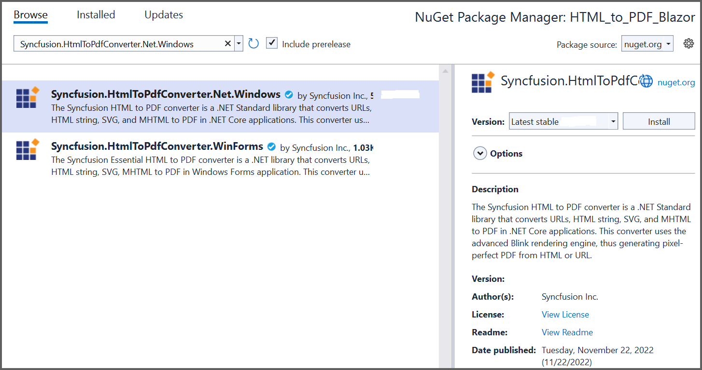
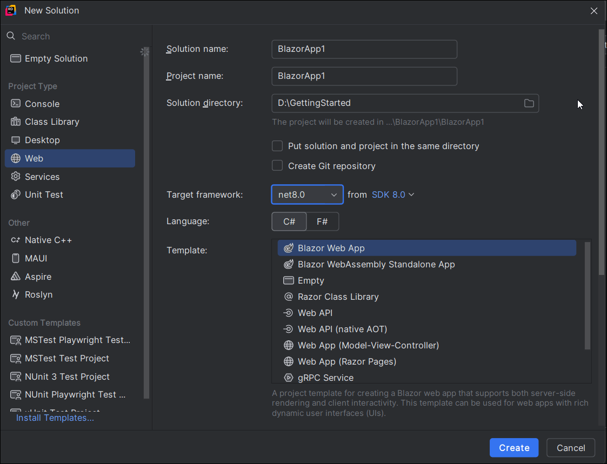
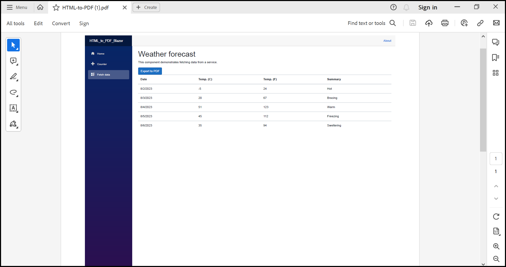

# Convert HTML to PDF file in Blazor

The Syncfusion<sup>&reg;</sup> HTML to PDF converter is a .NET library used to convert HTML or web pages to PDF document in Blazor application.

N> Currently, HTML to PDF converter is mainly supported in Blazor Server-Side, while it is not compatible with Blazor WASM (WebAssembly).

## Steps to convert HTML to PDF in Blazor application





**Prerequisites**:

* Install .NET SDK: Ensure that you have the .NET SDK installed on your system. You can download it from the [.NET Downloads page](https://dotnet.microsoft.com/en-us/download).
* Install Visual Studio: Download and install Visual Studio Code from the [official website](https://code.visualstudio.com/download).

Step 1: Create a new C# Blazor Server application project. Select Blazor App from the template and click the Next button.
  

In the project configuration window, name your project and select Create.
 

Step 2: Install the [Syncfusion.HtmlToPdfConverter.Net.Windows](https://www.nuget.org/packages/Syncfusion.HtmlToPdfConverter.Net.Windows/) NuGet package as a reference to your Blazor Server application from [NuGet.org](https://www.nuget.org/).
  

N> Starting with v16.2.0.x, if you reference Syncfusion<sup>&reg;</sup> assemblies from trial setup or from the NuGet feed, you also have to add "Syncfusion.Licensing" assembly reference and include a license key in your projects. Please refer to this [link](https://help.syncfusion.com/common/essential-studio/licensing/overview) to know about registering Syncfusion<sup>&reg;</sup> license key in your application to use our components.

Step 3: Create a new class file named ExportService under Data folder and include the following namespaces in the file.



using Syncfusion.HtmlConverter;
using Syncfusion.Pdf;
using System.IO;



Step 4: Add the following code to convert HTML to PDF document in ExportService class using [Convert](https://help.syncfusion.com/cr/document-processing/Syncfusion.HtmlConverter.HtmlToPdfConverter.html#Syncfusion_HtmlConverter_HtmlToPdfConverter_Convert_System_String_) method in [HtmlToPdfConverter](https://help.syncfusion.com/cr/document-processing/Syncfusion.HtmlConverter.HtmlToPdfConverter.html) class.



public MemoryStream CreatePdf(string url)
{
    //Initialize HTML to PDF converter.
    HtmlToPdfConverter htmlConverter = new HtmlToPdfConverter();    
    //Convert URL to PDF document.
    PdfDocument document = htmlConverter.Convert(url);
    //Create memory stream.
    MemoryStream stream = new MemoryStream();
    //Save the document to memory stream.
    document.Save(stream);
    return stream;
}



Step 5: Register your service in the ConfigureServices method available in the Startup.cs class as follows.



/// <summary>
/// Register your ExportService 
/// </summary>
public void ConfigureServices(IServiceCollection services)
{
    services.AddRazorPages();
    services.AddServerSideBlazor();
    services.AddSingleton<WeatherForecastService>();
    services.AddSingleton<ExportService>();
}



Step 6: Inject ExportService into FetchData.razor using the following code.



@inject ExportService exportService
@inject Microsoft.JSInterop.IJSRuntime JS
@inject NavigationManager NavigationManager
@using  System.IO;



Step 7: Create a button in the FetchData.razor using the following code.



<button class="btn btn-primary" @onclick="@ExportToPdf">Export to PDF</button>



Step 8: Add the ExportToPdf method in FetchData.razor page to call the export service.



@code {
    private string currentUrl;
    /// <summary>
    /// Get the current URL
    /// </summary>
    protected override void OnInitialized()
    {
        currentUrl = NavigationManager.Uri;
    }
}

@functions
{
    /// <summary>
    /// Create and download the PDF document
    /// </summary>
    protected async Task ExportToPdf()
    {
        ExportService exportService = new ExportService();
        using (MemoryStream excelStream = exportService.CreatePdf(currentUrl))
        {
            await JS.SaveAs("HTMLToPDF.pdf", excelStream.ToArray());
        }
    }
}



Step 9: Create a class file with FileUtil name and add the following code to invoke the JavaScript action to download the file in the browser.



public static class FileUtil
{
    public static ValueTask<object> SaveAs(this IJSRuntime js, string filename, byte[] data)
     => js.InvokeAsync<object>(
         "saveAsFile",
         filename,
         Convert.ToBase64String(data));
}



Step 10: Add the following JavaScript function in the _Host.cshtml available under the Pages folder.



<script type="text/javascript">
    function saveAsFile(filename, bytesBase64)
    {
        if (navigator.msSaveBlob)
        {
            //Download document in Edge browser
            var data = window.atob(bytesBase64);
            var bytes = new Uint8Array(data.length);
            for (var i = 0; i < data.length; i++)
            {
                bytes[i] = data.charCodeAt(i);
            }
            var blob = new Blob([bytes.buffer], { type: "application/octet-stream" });
            navigator.msSaveBlob(blob, filename);
        }
        else
        {
            var link = document.createElement('a');
            link.download = filename;
            link.href = "data:application/octet-stream;base64," + bytesBase64;
            document.body.appendChild(link); // Needed for Firefox
            link.click();
            document.body.removeChild(link);
        }
    }
</script>



Step 11: Build the project.

Click on Build > Build Solution or press Ctrl + Shift + B to build the project.

Step 12: Run the project.

Click the Start button (green arrow) or press F5 to run the app.





**Prerequisites**:

* Install .NET SDK: Ensure that you have the .NET SDK installed on your system. You can download it from the [.NET Downloads page](https://dotnet.microsoft.com/en-us/download).
* Install Visual Studio Code:  Download and install Visual Studio Code from the [official website](https://code.visualstudio.com/download).
* Install C# Extension for VS Code: Open Visual Studio Code, go to the Extensions view (Ctrl+Shift+X), and search for 'C#'. Install the official [C# extension provided by Microsoft](https://marketplace.visualstudio.com/items?itemName=ms-dotnettools.csharp).

Step 1: Open the terminal (Ctrl+` ) and run the following command to create a new Blazor Server application

```
dotnet new blazorserver -n CreatePdfBlazorServerApp
```
Step 2: Replace ****CreatePdfBlazorServerApp** with your desired project name.

Step 3: Navigate to the project directory using the following command

```
cd CreatePdfBlazorServerApp
```
Step 4: Use the following command in the terminal to add the [Syncfusion.HtmlToPdfConverter.Net.Windows](https://www.nuget.org/packages/Syncfusion.HtmlToPdfConverter.Net.Windows/) package to your project.

```
dotnet add package Syncfusion.HtmlToPdfConverter.Net.Windows
```
N> Starting with v16.2.0.x, if you reference Syncfusion<sup>&reg;</sup> assemblies from trial setup or from the NuGet feed, you also have to add "Syncfusion.Licensing" assembly reference and include a license key in your projects. Please refer to this [link](https://help.syncfusion.com/common/essential-studio/licensing/overview) to know about registering Syncfusion<sup>&reg;</sup> license key in your application to use our components.

Step 5: Create a new class file named ExportService under Data folder and include the following namespaces in the file.



using Syncfusion.HtmlConverter;
using Syncfusion.Pdf;
using System.IO;



Step 6: Add the following code to convert HTML to PDF document in ExportService class using [Convert](https://help.syncfusion.com/cr/document-processing/Syncfusion.HtmlConverter.HtmlToPdfConverter.html#Syncfusion_HtmlConverter_HtmlToPdfConverter_Convert_System_String_) method in [HtmlToPdfConverter](https://help.syncfusion.com/cr/document-processing/Syncfusion.HtmlConverter.HtmlToPdfConverter.html) class.



public MemoryStream CreatePdf(string url)
{
    //Initialize HTML to PDF converter.
    HtmlToPdfConverter htmlConverter = new HtmlToPdfConverter();    
    //Convert URL to PDF document.
    PdfDocument document = htmlConverter.Convert(url);
    //Create memory stream.
    MemoryStream stream = new MemoryStream();
    //Save the document to memory stream.
    document.Save(stream);
    return stream;
}



Step 7: Register your service in the ConfigureServices method available in the Startup.cs class as follows.



/// <summary>
/// Register your ExportService 
/// </summary>
public void ConfigureServices(IServiceCollection services)
{
    services.AddRazorPages();
    services.AddServerSideBlazor();
    services.AddSingleton<WeatherForecastService>();
    services.AddSingleton<ExportService>();
}



Step 8: Inject ExportService into FetchData.razor using the following code.



@inject ExportService exportService
@inject Microsoft.JSInterop.IJSRuntime JS
@inject NavigationManager NavigationManager
@using  System.IO;



Step 9: Create a button in the FetchData.razor using the following code.



<button class="btn btn-primary" @onclick="@ExportToPdf">Export to PDF</button>



Step 10: Add the ExportToPdf method in FetchData.razor page to call the export service.



@code {
    private string currentUrl;
    /// <summary>
    /// Get the current URL
    /// </summary>
    protected override void OnInitialized()
    {
        currentUrl = NavigationManager.Uri;
    }
}

@functions
{
    /// <summary>
    /// Create and download the PDF document
    /// </summary>
    protected async Task ExportToPdf()
    {
        ExportService exportService = new ExportService();
        using (MemoryStream excelStream = exportService.CreatePdf(currentUrl))
        {
            await JS.SaveAs("HTMLToPDF.pdf", excelStream.ToArray());
        }
    }
}



Step 11: Create a class file with FileUtil name and add the following code to invoke the JavaScript action to download the file in the browser.



public static class FileUtil
{
    public static ValueTask<object> SaveAs(this IJSRuntime js, string filename, byte[] data)
     => js.InvokeAsync<object>(
         "saveAsFile",
         filename,
         Convert.ToBase64String(data));
}



Step 12: Add the following JavaScript function in the _Host.cshtml available under the Pages folder.



<script type="text/javascript">
    function saveAsFile(filename, bytesBase64)
    {
        if (navigator.msSaveBlob)
        {
            //Download document in Edge browser
            var data = window.atob(bytesBase64);
            var bytes = new Uint8Array(data.length);
            for (var i = 0; i < data.length; i++)
            {
                bytes[i] = data.charCodeAt(i);
            }
            var blob = new Blob([bytes.buffer], { type: "application/octet-stream" });
            navigator.msSaveBlob(blob, filename);
        }
        else
        {
            var link = document.createElement('a');
            link.download = filename;
            link.href = "data:application/octet-stream;base64," + bytesBase64;
            document.body.appendChild(link); // Needed for Firefox
            link.click();
            document.body.removeChild(link);
        }
    }
</script>



Step 13: Build the project.

Run the following command in terminal to build the project.

```
dotnet build
```

Step 14: Run the project.

Run the following command in terminal to build the project.

```
dotnet run
```




**Prerequisites:**

* JetBrains Rider.
* Install .NET 8 SDK or later.

Step 1. Open JetBrains Rider and create a new Blazor server-side app project.
* Launch JetBrains Rider.
* Click new solution on the welcome screen.


* In the new Solution dialog, select Project Type as Web.
* Enter a project name and specify the location.
* Choose template as **Blazor Server App**.
* Select the target framework (e.g., .NET 8.0, .NET 9.0).
* Click create.



Step 2: Install the NuGet package from [NuGet.org](https://www.nuget.org/).
* Click the NuGet icon in the Rider toolbar and type [Syncfusion.HtmlToPdfConverter.Net.Windows](https://www.nuget.org/packages/Syncfusion.HtmlToPdfConverter.Net.Windows/) in the search bar.
* Ensure that "nuget.org" is selected as the package source.
* Select the latest Syncfusion.HtmlToPdfConverter.Net.Windows NuGet package from the list.
* Click the + (Add) button to add the package.


* Click the Install button to complete the installation.


N> Starting with v16.2.0.x, if you reference Syncfusion<sup>&reg;</sup> assemblies from trial setup or from the NuGet feed, you also have to add "Syncfusion.Licensing" assembly reference and include a license key in your projects. Please refer to this [link](https://help.syncfusion.com/common/essential-studio/licensing/overview) to know about registering Syncfusion<sup>&reg;</sup> license key in your application to use our components.

Step 3: Create a new class file named ExportService under Data folder and include the following namespaces in the file.



using Syncfusion.HtmlConverter;
using Syncfusion.Pdf;
using System.IO;



Step 4: Add the following code to convert HTML to PDF document in ExportService class using [Convert](https://help.syncfusion.com/cr/document-processing/Syncfusion.HtmlConverter.HtmlToPdfConverter.html#Syncfusion_HtmlConverter_HtmlToPdfConverter_Convert_System_String_) method in [HtmlToPdfConverter](https://help.syncfusion.com/cr/document-processing/Syncfusion.HtmlConverter.HtmlToPdfConverter.html) class.



public MemoryStream CreatePdf(string url)
{
    //Initialize HTML to PDF converter.
    HtmlToPdfConverter htmlConverter = new HtmlToPdfConverter();    
    //Convert URL to PDF document.
    PdfDocument document = htmlConverter.Convert(url);
    //Create memory stream.
    MemoryStream stream = new MemoryStream();
    //Save the document to memory stream.
    document.Save(stream);
    return stream;
}



Step 5: Register your service in the ConfigureServices method available in the Startup.cs class as follows.



/// <summary>
/// Register your ExportService 
/// </summary>
public void ConfigureServices(IServiceCollection services)
{
    services.AddRazorPages();
    services.AddServerSideBlazor();
    services.AddSingleton<WeatherForecastService>();
    services.AddSingleton<ExportService>();
}



Step 6: Inject ExportService into FetchData.razor using the following code.



@inject ExportService exportService
@inject Microsoft.JSInterop.IJSRuntime JS
@inject NavigationManager NavigationManager
@using  System.IO;



Step 7: Create a button in the FetchData.razor using the following code.



<button class="btn btn-primary" @onclick="@ExportToPdf">Export to PDF</button>



Step 8: Add the ExportToPdf method in FetchData.razor page to call the export service.



@code {
    private string currentUrl;
    /// <summary>
    /// Get the current URL
    /// </summary>
    protected override void OnInitialized()
    {
        currentUrl = NavigationManager.Uri;
    }
}

@functions
{
    /// <summary>
    /// Create and download the PDF document
    /// </summary>
    protected async Task ExportToPdf()
    {
        ExportService exportService = new ExportService();
        using (MemoryStream excelStream = exportService.CreatePdf(currentUrl))
        {
            await JS.SaveAs("HTMLToPDF.pdf", excelStream.ToArray());
        }
    }
}



Step 9: Create a class file with FileUtil name and add the following code to invoke the JavaScript action to download the file in the browser.



public static class FileUtil
{
    public static ValueTask<object> SaveAs(this IJSRuntime js, string filename, byte[] data)
     => js.InvokeAsync<object>(
         "saveAsFile",
         filename,
         Convert.ToBase64String(data));
}



Step 10: Add the following JavaScript function in the _Host.cshtml available under the Pages folder.



<script type="text/javascript">
    function saveAsFile(filename, bytesBase64)
    {
        if (navigator.msSaveBlob)
        {
            //Download document in Edge browser
            var data = window.atob(bytesBase64);
            var bytes = new Uint8Array(data.length);
            for (var i = 0; i < data.length; i++)
            {
                bytes[i] = data.charCodeAt(i);
            }
            var blob = new Blob([bytes.buffer], { type: "application/octet-stream" });
            navigator.msSaveBlob(blob, filename);
        }
        else
        {
            var link = document.createElement('a');
            link.download = filename;
            link.href = "data:application/octet-stream;base64," + bytesBase64;
            document.body.appendChild(link); // Needed for Firefox
            link.click();
            document.body.removeChild(link);
        }
    }
</script>



Step 11: Build the project.

Click the **Build** button in the toolbar or press <kbd>Ctrl</kbd>+<kbd>Shift</kbd>+<kbd>B</kbd> to build the project.

Step 12: Run the project.

Click the **Run** button (green arrow) in the toolbar or press <kbd>F5</kbd> to run the app.


 


By executing the program, you will get the following output in the browser.
   

Click the Export to PDF button, and you will get the PDF document with the following output.
   
    
A complete working sample for converting an HTML to PDF in the Blazor framework can be downloaded from [Github](https://github.com/SyncfusionExamples/html-to-pdf-csharp-examples/tree/master/Blazor).

Click [here](https://www.syncfusion.com/document-processing/pdf-framework/blazor/html-to-pdf) to explore the rich set of Syncfusion<sup>&reg;</sup> HTML to PDF converter library features. 

An online sample link to [convert HTML to PDF document](https://ej2.syncfusion.com/aspnetcore/PDF/HtmltoPDF#/material3) in ASP.NET Core.