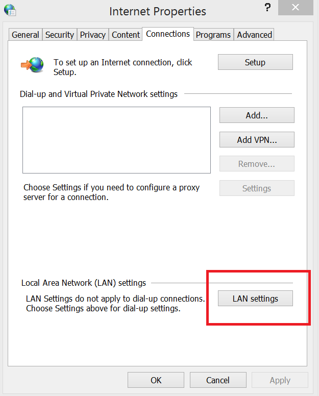
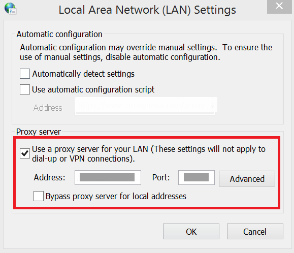

# HTML converter Features

## URL to PDF

To convert website URL or local HTML file to PDF document using [Convert](https://help.syncfusion.com/cr/document-processing/Syncfusion.HtmlConverter.HtmlToPdfConverter.html#Syncfusion_HtmlConverter_HtmlToPdfConverter_Convert_System_String_) method in [HtmlToPdfConverter](https://help.syncfusion.com/cr/document-processing/Syncfusion.HtmlConverter.HtmlToPdfConverter.html) class. refer to the following code example.



{% highlight c# tabtitle="C# [Cross-platform]" playgroundButtonLink="https://raw.githubusercontent.com/SyncfusionExamples/PDF-Examples/master/HTML%20to%20PDF/Blink/Convert-website-URL-to-PDF-document/.NET/Convert-website-URL-to-PDF-document/Program.cs, 300" %}

using Syncfusion.HtmlConverter;
using Syncfusion.Pdf;

//Initialize HTML to PDF converter.
HtmlToPdfConverter htmlConverter = new HtmlToPdfConverter();
//Convert URL to PDF
PdfDocument document = htmlConverter.Convert("https://www.google.com");

//Save and close the PDF document.
document.Save("Output.pdf");
document.Close(true);






Imports Syncfusion.HtmlConverter
Imports Syncfusion.Pdf

'Initialize HTML to PDF converter
Dim htmlConverter As HtmlToPdfConverter = New HtmlToPdfConverter()
'Convert URL to PDF
Dim document As PdfDocument = htmlConverter.Convert("https://www.google.com")

'Save and close the PDF document 
document.Save("Output.pdf")
document.Close(True)





You can download a complete working sample from [GitHub](https://github.com/SyncfusionExamples/PDF-Examples/tree/master/HTML%20to%20PDF/Blink/Convert-website-URL-to-PDF-document).

## HTML String to PDF

The HTML to PDF converter provides support for converting HTML string to PDF. While converting HTML string to PDF, converter provides option to specify the base URL.

<b>baseURL:</b> Path of the resources (images, style sheets, scripts.,) used in the input HTML string.

For the following HTML string, the baseURL will be the path of the <font color="blue"><i>syncfusion_logo.gif</i></font> image.

For example, if the above image is in <i>“C:/Temp/ HTMLFiles/syncfusion_logo.gif”</i> location, then the baseURL will be as follows.

<b>baseURL:</b> C:/Temp/HTMLFiles/

To convert the HTML string to PDF using [Convert](https://help.syncfusion.com/cr/document-processing/Syncfusion.HtmlConverter.HtmlToPdfConverter.html#Syncfusion_HtmlConverter_HtmlToPdfConverter_Convert_System_String_System_String_) method, refer to the following code example. 



{% highlight c# tabtitle="C# [Cross-platform]" playgroundButtonLink="https://raw.githubusercontent.com/SyncfusionExamples/PDF-Examples/master/HTML%20to%20PDF/Blink/Convert-the-HTML-string-to-PDF-document/.NET/Convert-the-HTML-string-to-PDF-document/Program.cs, 300" %}

using Syncfusion.Drawing;
using Syncfusion.HtmlConverter;

//Initialize HTML to PDF converter
HtmlToPdfConverter htmlConverter = new HtmlToPdfConverter();

//HTML string and Base URL 
string htmlText = "<html><body><p> Hello World</p></body></html>";
string baseUrl = @"C:/Temp/HTMLFiles/";

//Convert URL to PDF
PdfDocument document = htmlConverter.Convert(htmlText, baseUrl);

//Save and close the PDF document.
document.Save("Output.pdf");
document.Close(true);





Imports System.Drawing
Imports Syncfusion.HtmlConverter

'Initialize HTML to PDF converter
Dim htmlConverter As HtmlToPdfConverter = New HtmlToPdfConverter()

'HTML string and Base URL 
Dim htmlText As String = "<html><body><p> Hello World</p></body></html>"
Dim baseUrl As String = "C:/Temp/HTMLFiles/"

'Convert URL to PDF
Dim document As PdfDocument = htmlConverter.Convert(htmlText, baseUrl)
'Save and close the PDF document
document.Save("Output.pdf")
document.Close(True)




<html>
<body>

<p> Hello World</p>
</body>
</html>





You can download a complete working sample from [GitHub](https://github.com/SyncfusionExamples/PDF-Examples/tree/master/HTML%20to%20PDF/Blink/Convert-the-HTML-string-to-PDF-document).

## URL to Image

To convert website URL or local HTML file to Image using [ConvertToImage](https://help.syncfusion.com/cr/document-processing/Syncfusion.HtmlConverter.HtmlToPdfConverter.html#Syncfusion_HtmlConverter_HtmlToPdfConverter_ConvertToImage_System_String_) method, refer to the following code example.



{% highlight c# tabtitle="C# [Cross-platform]" playgroundButtonLink="https://raw.githubusercontent.com/SyncfusionExamples/PDF-Examples/master/HTML%20to%20PDF/Blink/Convert-website-URL-to-image-file/.NET/Convert-website-URL-to-image-file/Program.cs, 300" %}

using Syncfusion.Drawing;
using Syncfusion.HtmlConverter;

//Initialize HTML to PDF converter.
HtmlToPdfConverter htmlConverter = new HtmlToPdfConverter();
//Convert URL to Image
Image image = htmlConverter.ConvertToImage("https://www.google.com");
//Save the image.
File.WriteAllBytes(Path.GetFullPath(@"Output/Output.jpg"), image.ImageData);





using Syncfusion.Drawing;
using Syncfusion.HtmlConverter;

//Initialize HTML to PDF converter
HtmlToPdfConverter htmlConverter = new HtmlToPdfConverter();
//Convert URL to Image
Image[] image = htmlConverter.ConvertToImage("https://www.google.com");
//Save the image.
File.WriteAllBytes(Path.GetFullPath(@"Output/Output.jpg"), image.ImageData);





Imports System.Drawing
Imports Syncfusion.HtmlConverter

'Initialize HTML to PDF converter.
Dim htmlConverter As HtmlToPdfConverter = New HtmlToPdfConverter()
'Convert URL to Image
Dim image As Image[] = htmlConverter.ConvertToImage("https://www.google.com")
'Save the image.
File.WriteAllBytes(Path.GetFullPath(@"Output/Output.jpg"), image.ImageData)





You can download a complete working sample from [GitHub](https://github.com/SyncfusionExamples/PDF-Examples/tree/master/HTML%20to%20PDF/Blink/Convert-website-URL-to-image-file).

## HTML String to Image

The Blink rendering engine supports converting HTML string to Image. While converting HTML string to Image, converter provides an option to specify the base URL.

<b>baseURL:</b> Path of the resources (images, style sheets, scripts.,) used in the input HTML string.

For the following HTML string, the baseURL will be the path of the <font color="blue"><i>syncfusion_logo.gif</i></font> image.

For example, if the previous image is in <i>“C:/Temp/ HTMLFiles/syncfusion_logo.gif”</i> location then the baseURL will be as follows.

<b>baseURL:</b> C:/Temp/HTMLFiles/

To convert the HTML string to Image using [ConvertToImage](https://help.syncfusion.com/cr/document-processing/Syncfusion.HtmlConverter.HtmlToPdfConverter.html#Syncfusion_HtmlConverter_HtmlToPdfConverter_ConvertToImage_System_String_System_String_) method, refer to the following code example.

 

{% highlight c# tabtitle="C# [Cross-platform]" playgroundButtonLink="https://raw.githubusercontent.com/SyncfusionExamples/PDF-Examples/master/HTML%20to%20PDF/Blink/Convert-the-HTML-string-to-image-file/.NET/Convert-the-HTML-string-to-image-file/Program.cs, 300" %}

using Syncfusion.Drawing;
using Syncfusion.HtmlConverter;

//Initialize HTML to PDF converter.
HtmlToPdfConverter htmlConverter = new HtmlToPdfConverter();

//HTML string and Base URL
string htmlText = "<html><body><p> Hello World</p></body></html>";
string baseUrl = @"C:/Temp/HTMLFiles/";

//Convert HTML string to Image
Image image = htmlConverter.ConvertToImage(htmlText, baseUrl);
//Save the image.
File.WriteAllBytes(Path.GetFullPath(@"Output/Output.jpg"), image.ImageData);





using System.Drawing;
using Syncfusion.HtmlConverter;

//Initialize HTML to PDF converter.
HtmlToPdfConverter htmlConverter = new HtmlToPdfConverter();

//HTML string and Base URL
string htmlText = "<html><body><p> Hello World</p></body></html>";
string baseUrl = @"C:/Temp/HTMLFiles/";

//Convert HTML string to Image
Image[] image = htmlConverter.ConvertToImage(htmlText, baseUrl);
//Save the image.
File.WriteAllBytes(Path.GetFullPath(@"Output/Output.jpg"), image.ImageData);





Imports System.Drawing
Imports Syncfusion.HtmlConverter

'Initialize the HTML to PDF converter.
Dim htmlConverter As HtmlToPdfConverter = New HtmlToPdfConverter()

'HTML string and Base URL
Dim htmlText As String = "<html><body><p> Hello World</p></body></html>"
Dim baseUrl As String = "C:/Temp/HTMLFiles/"

'Convert HTML string to Image
Dim image As Image[] = htmlConverter.Convert(htmlText, baseUrl)
'Save the image.
File.WriteAllBytes(Path.GetFullPath(@"Output/Output.jpg"), image.ImageData)





<html>
<body>
    
    <p> Hello World</p>
</body>
</html>





You can download a complete working sample from [GitHub](https://github.com/SyncfusionExamples/PDF-Examples/tree/master/HTML%20to%20PDF/Blink/Convert-the-HTML-string-to-image-file).

## SVG file to Image

To convert SVG file to Image using [ConvertToImage](https://help.syncfusion.com/cr/document-processing/Syncfusion.HtmlConverter.HtmlToPdfConverter.html#Syncfusion_HtmlConverter_HtmlToPdfConverter_ConvertToImage_System_String_) method, refer to the following code example.



{% highlight c# tabtitle="C# [Cross-platform]" playgroundButtonLink="https://raw.githubusercontent.com/SyncfusionExamples/PDF-Examples/master/HTML%20to%20PDF/Blink/Converting_SVG_to_Image_using_HtmlConverter/.NET/Converting_SVG_to_Image_using_HtmlConverter/Program.cs" %}

using Syncfusion.Drawing;
using Syncfusion.HtmlConverter;

// Create an instance of the Syncfusion HtmlToPdfConverter
HtmlToPdfConverter htmlConverter = new HtmlToPdfConverter();

// Read the SVG content from a file
string svg = File.ReadAllText("sample.svg");

// Convert the SVG content to an image using the converter
Image image = htmlConverter.ConvertToImage(svg, "");

// Extract the image data as a byte array
byte[] imageBytes = image.ImageData;

// Save the image data to a file in JPEG format
File.WriteAllBytes("Output.jpg"), imageBytes);





Imports Syncfusion.Drawing
Imports Syncfusion.HtmlConverter

' Create an instance of the Syncfusion HtmlToPdfConverter
Dim htmlConverter As New HtmlToPdfConverter()

' Read the SVG content from a file
Dim svg As String = File.ReadAllText("sample.svg")

' Convert the SVG content to an image using the converter
Dim image As Syncfusion.Drawing.Image = htmlConverter.ConvertToImage(svg, "")

' Extract the image data as a byte array
Dim imageBytes As Byte() = image.ImageData

' Save the image data to a file in JPEG format
File.WriteAllBytes("Output.jpg", imageBytes)





You can download a complete working sample from [GitHub](https://github.com/SyncfusionExamples/PDF-Examples/tree/master/HTML%20to%20PDF/Blink/Converting_SVG_to_Image_using_HtmlConverter/.NET).

## JavaScript

The Blink HTML converter supports enabling or disabling the JavaScript using [EnableJavaScript](https://help.syncfusion.com/cr/document-processing/Syncfusion.HtmlConverter.BlinkConverterSettings.html#Syncfusion_HtmlConverter_BlinkConverterSettings_EnableJavaScript) property in [BlinkConverterSettings](https://help.syncfusion.com/cr/document-processing/Syncfusion.HtmlConverter.BlinkConverterSettings.html) class. while converting HTML to PDF. Refer to the following code example.



{% highlight c# tabtitle="C# [Cross-platform]" playgroundButtonLink="https://raw.githubusercontent.com/SyncfusionExamples/PDF-Examples/master/HTML%20to%20PDF/Blink/Disable-JavaScript-when-convert-HTML-to-PDF/.NET/Disable-JavaScript-when-convert-HTML-to-PDF/Program.cs, 300" %}

using Syncfusion.HtmlConverter;
using Syncfusion.Pdf;

//Initialize the HTML to PDF converter.
HtmlToPdfConverter htmlConverter = new HtmlToPdfConverter();

BlinkConverterSettings blinkConverterSettings = new BlinkConverterSettings();
//Disable JavaScript; By default, true
blinkConverterSettings.EnableJavaScript = false;
//Assign Blink converter settings to HTML converter
htmlConverter.ConverterSettings = blinkConverterSettings;

//Convert URL to PDF
PdfDocument document = htmlConverter.Convert("https://www.google.com");

//Save and close the PDF document.
document.Save("Output.pdf");
document.Close(true);





Imports Syncfusion.HtmlConverter
Imports Syncfusion.Pdf

'Initialize the HTML to PDF converter.
Dim htmlConverter As HtmlToPdfConverter = New HtmlToPdfConverter()

Dim blinkConverterSettings As BlinkConverterSettings = New BlinkConverterSettings()
'Disable JavaScript; By default True
blinkConverterSettings.EnableJavaScript = False
'Assign Blink converter settings to HTML converter
htmlConverter.ConverterSettings = blinkConverterSettings

'Convert URL to PDF
Dim document As PdfDocument = htmlConverter.Convert("https://www.google.com")
'Save and close the PDF document
document.Save("Output.pdf")
document.Close(True)





You can download a complete working sample from [GitHub](https://github.com/SyncfusionExamples/PDF-Examples/tree/master/HTML%20to%20PDF/Blink/Disable-JavaScript-when-convert-HTML-to-PDF).

## Additional delay

The Blink HTML converter provides an option to set the [AdditionalDelay](https://help.syncfusion.com/cr/document-processing/Syncfusion.HtmlConverter.BlinkConverterSettings.html#Syncfusion_HtmlConverter_BlinkConverterSettings_AdditionalDelay) property while converting HTML to PDF. When a converter loads a webpage, it often needs to retrieve external resources like stylesheets, scripts, and images. This process can introduce additional delays, especially if the resources are large or hosted on slow servers. This property allows you to increase or decrease the waiting time (additional delay) of converter based on the input HTML specified for converting to PDF. Most of the HTML takes around 1000 to 2000 milliseconds for loading completely in the browser, hence we used default value 2000 milliseconds for this property. You can reduce this delay to 0, if your HTML files are small and no external resource dependency. Also, you can change this additional delay property for each HTML you input.

Refer the following code example to set the [AdditionalDelay](https://help.syncfusion.com/cr/document-processing/Syncfusion.HtmlConverter.BlinkConverterSettings.html#Syncfusion_HtmlConverter_BlinkConverterSettings_AdditionalDelay) property while converting HTML to PDF.



{% highlight c# tabtitle="C# [Cross-platform]" playgroundButtonLink="https://raw.githubusercontent.com/SyncfusionExamples/PDF-Examples/master/HTML%20to%20PDF/Blink/Set-additional-delay-while-converting-HTML-to-PDF/.NET/Set-additional-delay-while-converting-HTML-to-PDF/Program.cs, 300" %}

using Syncfusion.HtmlConverter;
using Syncfusion.Pdf;

//Initialize the HTML to PDF converter.
HtmlToPdfConverter htmlConverter = new HtmlToPdfConverter();

BlinkConverterSettings blinkConverterSettings = new BlinkConverterSettings();
// Set additional delay; units in milliseconds
blinkConverterSettings.AdditionalDelay = 3000;
//Assign Blink converter settings to HTML converter
htmlConverter.ConverterSettings = blinkConverterSettings;

//Convert URL to PDF
PdfDocument document = htmlConverter.Convert("https://www.google.com");

//Save and close the PDF document.
document.Save("Output.pdf");
document.Close(true);





Imports Syncfusion.HtmlConverter
Imports Syncfusion.Pdf

'Initialize the HTML to PDF converter.
Dim htmlConverter As HtmlToPdfConverter = New HtmlToPdfConverter()

Dim blinkConverterSettings As BlinkConverterSettings = New BlinkConverterSettings()
'Set additional delay; units in milliseconds
blinkConverterSettings.AdditionalDelay = 3000
'Assign Blink converter settings to HTML converter
htmlConverter.ConverterSettings = blinkConverterSettings

'Convert URL to PDF
Dim document As PdfDocument = htmlConverter.Convert("https://www.google.com")
'Save and close the PDF document
document.Save("Output.pdf")

document.Close(True)





You can download a complete working sample from [GitHub](https://github.com/SyncfusionExamples/PDF-Examples/tree/master/HTML%20to%20PDF/Blink/Set-additional-delay-while-converting-HTML-to-PDF).

## Hyperlinks

The Blink HTML converter support preserving URL links from HTML to PDF using [EnableHyperLink ](https://help.syncfusion.com/cr/document-processing/Syncfusion.HtmlConverter.BlinkConverterSettings.html#Syncfusion_HtmlConverter_BlinkConverterSettings_EnableHyperLink) property in [BlinkConverterSettings](https://help.syncfusion.com/cr/document-processing/Syncfusion.HtmlConverter.BlinkConverterSettings.html) class. Refer to the following code snippet.



{% highlight c# tabtitle="C# [Cross-platform]" playgroundButtonLink="https://raw.githubusercontent.com/SyncfusionExamples/PDF-Examples/master/HTML%20to%20PDF/Blink/Disable-URL-links-while-converting-HTML-to-PDF/.NET/Disable-URL-links-while-converting-HTML-to-PDF/Program.cs, 300" %}

using Syncfusion.HtmlConverter;
using Syncfusion.Pdf;

//Initialize the HTML to PDF converter.
HtmlToPdfConverter htmlConverter = new HtmlToPdfConverter();

BlinkConverterSettings blinkConverterSettings = new BlinkConverterSettings();
//Enable hyperlinks; By default - true
blinkConverterSettings.EnableHyperLink = false;
//Assign Blink converter settings to HTML converter
htmlConverter.ConverterSettings = blinkConverterSettings;

//Convert URL to PDF
PdfDocument document = htmlConverter.Convert("https://www.google.com");

//Save and close the PDF document.
document.Save("Output.pdf");
document.Close(true);





Imports Syncfusion.HtmlConverter
Imports Syncfusion.Pdf

'Initialize the HTML to PDF converter.
Dim htmlConverter As HtmlToPdfConverter = NewHtmlToPdfConverter()

Dim blinkConverterSettings As BlinkConverterSettings = New BlinkConverterSettings()
'Enable hyperlinks; By default - True
blinkConverterSettings.EnableHyperLink = False
'Assign Blink converter settings to HTML converter
htmlConverter.ConverterSettings = blinkConverterSettings

'Convert URL to PDF
Dim document As PdfDocument = htmlConverter.Convert("https://www.google.com")
'Save and close the PDF document
document.Save("Output.pdf")
document.Close(True)





You can download a complete working sample from [GitHub](https://github.com/SyncfusionExamples/PDF-Examples/tree/master/HTML%20to%20PDF/Blink/Disable-URL-links-while-converting-HTML-to-PDF).

## Bookmarks

The Blink HTML converter provides support for creating bookmarks automatically by enabling the [EnableBookmarks](https://help.syncfusion.com/cr/document-processing/Syncfusion.HtmlConverter.BlinkConverterSettings.html#Syncfusion_HtmlConverter_BlinkConverterSettings_EnableBookmarks) property.

N> The bookmarks are added from the ```<h>``` tag, it supports from ```<h1>``` to ```<h6>```.

Refer to the following code snippet.



{% highlight c# tabtitle="C# [Cross-platform]" playgroundButtonLink="https://raw.githubusercontent.com/SyncfusionExamples/PDF-Examples/master/HTML%20to%20PDF/Blink/Creating-bookmarks-while-converting-HTML-to-PDF/.NET/Creating-bookmarks-while-converting-HTML-to-PDF/Program.cs, 300" %}

using Syncfusion.HtmlConverter;
using Syncfusion.Pdf;

//Initialize the HTML to PDF converter.
HtmlToPdfConverter htmlConverter = new HtmlToPdfConverter();

BlinkConverterSettings settings = new BlinkConverterSettings();
//Set enable bookmarks
settings.EnableBookmarks = true;
//Assign Blink converter settings to HTML converter
htmlConverter.ConverterSettings = settings;

//Convert HTML to PDF
PdfDocument document = htmlConverter.Convert("input.html"); 

//Save and close the PDF document.
document.Save("Output.pdf");
document.Close(true);




Imports Syncfusion.HtmlConverter
Imports Syncfusion.Pdf

'Initialize the HTML to PDF converter.
Dim htmlConverter As HtmlToPdfConverter = New HtmlToPdfConverter()

Dim settings As BlinkConverterSettings = New BlinkConverterSettings()
'Set enable bookmarks
settings.EnableBookmarks = True
'Assign Blink converter settings to HTML converter
htmlConverter.ConverterSettings = settings

'Convert HTML to PDF
Dim document As PdfDocument = htmlConverter.Convert("input.html")
'Save and close the PDF document
document.Save("Output.pdf")
document.Close(True)





<html>
<head>
<style>
body
{
text-align: left;
font-size: large;
padding-left: 5px;
}
</style>
</head>
<body>

<h1>Syncfusion<sup>&reg;</sup></h1>

<h2>Introduction</h2>
	Syncfusion<sup>&reg;</sup> is the enterprise technology partner of choice for software development, delivering a broad range of web, mobile, and desktop controls coupled with a service-oriented approach throughout the entire application life cycle. 
<h2>Products</h2>
	<h4>WEB</h4>
		The most comprehensive suite for enterprise web development.
	<h4>Desktop</h4>
		Comprehensive suite of over 115 components including the fastest chart and grid components.
	<h4>Mobile</h4>
		Comprehensive suite of components for Xamarin.iOS, Xamarin.Android and Xamarin.Forms including the fastest chart and grid.
<h2>Consulting</h2>
	We can build web, mobile, and desktop applications better and faster than anyone since we build on top of our award-winning suite of components and frameworks, saving you time and money.
<h2>Company</h2>
	<h4>About us</h4>
		Syncfusion<sup>&reg;</sup> has established itself as the trusted partner worldwide for use in mission-critical applications. Founded in 2001 and headquartered in Research Triangle Park, N.C., Syncfusion<sup>&reg;</sup> has more than 12,000 customers, including large financial institutions, Fortune 100 companies, and global IT consultancies.
	<h4>contact us</h4>
		Morrisville Office
		Company Headquarters
		2501 Aerial Center Parkway
		Suite 200
		Morrisville, NC 27560
		USA
</body>
</html>





You can download a complete working sample from [GitHub](https://github.com/SyncfusionExamples/PDF-Examples/tree/master/HTML%20to%20PDF/Blink/Creating-bookmarks-while-converting-HTML-to-PDF).

## Table of contents

The Blink HTML converter provides support for creating a table of contents automatically by using the [EnableToc](https://help.syncfusion.com/cr/document-processing/Syncfusion.HtmlConverter.BlinkConverterSettings.html#Syncfusion_HtmlConverter_BlinkConverterSettings_Toc) property.

N> TOC are added from the ```<h>``` tag, it supports from ```<h1>``` to ```<h6>```.

Refer to the following code snippet.



{% highlight c# tabtitle="C# [Cross-platform]" playgroundButtonLink="https://raw.githubusercontent.com/SyncfusionExamples/PDF-Examples/master/HTML%20to%20PDF/Blink/Create-TOC-while-converting-HTML-to-PDF/.NET/Create-TOC-while-converting-HTML-to-PDF/Program.cs, 300" %}

using Syncfusion.HtmlConverter;
using Syncfusion.Pdf;

//Initialize the HTML to PDF converter.
HtmlToPdfConverter htmlConverter = new HtmlToPdfConverter();

BlinkConverterSettings settings = new BlinkConverterSettings();
//Set enable table of contents
settings.EnableToc = true;
//Assign Blink converter settings to HTML converter
htmlConverter.ConverterSettings = settings;

//Convert HTML to PDF
PdfDocument document = htmlConverter.Convert("input.html");

//Save and close the PDF document.
document.Save("Output.pdf");
document.Close(true);





Imports Syncfusion.HtmlConverter
Imports Syncfusion.Pdf

'Initialize the HTML to PDF converter.
Dim htmlConverter As HtmlToPdfConverter = New HtmlToPdfConverter()

Dim settings As BlinkConverterSettings = New BlinkConverterSettings()
'Set enable table of contents
settings.EnableToc = True
'Assign Blink converter settings to HTML converter
htmlConverter.ConverterSettings = settings

'Convert HTML to PDF
Dim document As PdfDocument = htmlConverter.Convert("input.html")
'Save and close the PDF document
document.Save("Output.pdf")
document.Close(True)





<html>
<head>
<style>
body
{
text-align: left;
font-size: large;
padding-left: 5px;
}
</style>
</head>
<body>

<h1>Syncfusion<sup>&reg;</sup></h1>

<h2>Introduction</h2>
	Syncfusion<sup>&reg;</sup> is the enterprise technology partner of choice for software development, delivering a broad range of web, mobile, and desktop controls coupled with a service-oriented approach throughout the entire application life cycle. 
<h2>Products</h2>
	<h4>WEB</h4>
		The most comprehensive suite for enterprise web development.
	<h4>Desktop</h4>
		Comprehensive suite of over 115 components including the fastest chart and grid components.
	<h4>Mobile</h4>
		Comprehensive suite of components for Xamarin.iOS, Xamarin.Android and Xamarin.Forms including the fastest chart and grid.
<h2>Consulting</h2>
	We can build web, mobile, and desktop applications better and faster than anyone since we build on top of our award-winning suite of components and frameworks, saving you time and money.
<h2>Company</h2>
	<h4>About us</h4>
		Syncfusion<sup>&reg;</sup> has established itself as the trusted partner worldwide for use in mission-critical applications. Founded in 2001 and headquartered in Research Triangle Park, N.C., Syncfusion<sup>&reg;</sup> has more than 12,000 customers, including large financial institutions, Fortune 100 companies, and global IT consultancies.
	<h4>contact us</h4>
		Morrisville Office
		Company Headquarters
		2501 Aerial Center Parkway
		Suite 200
		Morrisville, NC 27560
		USA
</body>
</html>





You can download a complete working sample from [GitHub](https://github.com/SyncfusionExamples/PDF-Examples/tree/master/HTML%20to%20PDF/Blink/Create-TOC-while-converting-HTML-to-PDF).

### Table of contents with custom style

The Blink HTML converter provides support for customizing the table of contents style. Each header tag style can be customized by using [HtmlToPdfTocStyle](https://help.syncfusion.com/cr/document-processing/Syncfusion.Pdf.HtmlToPdf.HtmlToPdfTocStyle.html). 

Refer to the following code snippet.



{% highlight c# tabtitle="C# [Cross-platform]" playgroundButtonLink="https://raw.githubusercontent.com/SyncfusionExamples/PDF-Examples/master/HTML%20to%20PDF/Blink/Create-custom-style-TOC-when-converting-HTML-to-PDF/.NET/Create-custom-style-TOC-when-converting-HTML-to-PDF/Program.cs, 300" %}

using Syncfusion.Drawing;
using Syncfusion.HtmlConverter;
using Syncfusion.Pdf;
using Syncfusion.Pdf.Graphics;
using Syncfusion.Pdf.HtmlToPdf;

//Initialize the HTML to PDF converter.
HtmlToPdfConverter htmlConverter = new HtmlToPdfConverter();

BlinkConverterSettings settings = new BlinkConverterSettings();
//Set enable table of contents
settings.EnableToc = true;
//Set the style for level 1(H1) items in table of contents
HtmlToPdfTocStyle tocstyleH1 = new HtmlToPdfTocStyle();
tocstyleH1.Font = new PdfStandardFont(PdfFontFamily.TimesRoman, 10, PdfFontStyle.Regular);
tocstyleH1.BackgroundColor = new PdfSolidBrush(new PdfColor(Color.FromArgb(68, 114, 196)));
tocstyleH1.ForeColor = PdfBrushes.White;
tocstyleH1.Padding = new PdfPaddings(5, 5, 3, 3);
settings.Toc.SetItemStyle(1, tocstyleH1);
//Assign Blink converter settings to HTML converter
htmlConverter.ConverterSettings = settings;

//Convert HTML to PDF
PdfDocument document = htmlConverter.Convert("input.html");

//Save and close the PDF document.
document.Save("Output.pdf");
document.Close(true);





Imports Syncfusion.Drawing
Imports Syncfusion.HtmlConverter
Imports Syncfusion.Pdf
Imports Syncfusion.Pdf.Graphics
Imports Syncfusion.Pdf.HtmlToPdf

'Initialize the HTML to PDF converter.
Dim htmlConverter As HtmlToPdfConverter = New HtmlToPdfConverter()

Dim settings As BlinkConverterSettings = New BlinkConverterSettings()
'Set enable table of contents
settings.EnableToc = True
'Set the style for level 1(H1) items in table of contents
Dim tocstyleH1 As New HtmlToPdfTocStyle()
tocstyleH1.Font = New PdfStandardFont(PdfFontFamily.TimesRoman, 10, PdfFontStyle.Regular)
tocstyleH1.BackgroundColor = New PdfSolidBrush(New PdfColor(Color.FromArgb(68, 114, 196)))
tocstyleH1.ForeColor = PdfBrushes.White
tocstyleH1.Padding = New PdfPaddings(5, 5, 3, 3)
settings.Toc.SetItemStyle(1, tocstyleH1)
'Assign Blink converter settings to HTML converter
htmlConverter.ConverterSettings = settings

'Convert HTML to PDF
Dim document As PdfDocument = htmlConverter.Convert("input.html")
'Save and close the PDF document
document.Save("Output.pdf")
document.Close(True)





<html>
<head>
<style>
body
{
text-align: left;
font-size: large;
padding-left: 5px;
}
</style>
</head>
<body>

<h1>Syncfusion<sup>&reg;</sup></h1>

<h2>Introduction</h2>
	Syncfusion<sup>&reg;</sup> is the enterprise technology partner of choice for software development, delivering a broad range of web, mobile, and desktop controls coupled with a service-oriented approach throughout the entire application life cycle. 
<h2>Products</h2>
	<h4>WEB</h4>
		The most comprehensive suite for enterprise web development.
	<h4>Desktop</h4>
		Comprehensive suite of over 115 components including the fastest chart and grid components.
	<h4>Mobile</h4>
		Comprehensive suite of components for Xamarin.iOS, Xamarin.Android and Xamarin.Forms including the fastest chart and grid.
<h2>Consulting</h2>
	We can build web, mobile, and desktop applications better and faster than anyone since we build on top of our award-winning suite of components and frameworks, saving you time and money.
<h2>Company</h2>
	<h4>About us</h4>
		Syncfusion<sup>&reg;</sup> has established itself as the trusted partner worldwide for use in mission-critical applications. Founded in 2001 and headquartered in Research Triangle Park, N.C., Syncfusion<sup>&reg;</sup> has more than 12,000 customers, including large financial institutions, Fortune 100 companies, and global IT consultancies.
	<h4>contact us</h4>
		Morrisville Office
		Company Headquarters
		2501 Aerial Center Parkway
		Suite 200
		Morrisville, NC 27560
		USA
</body>
</html>





You can download a complete working sample from [GitHub](https://github.com/SyncfusionExamples/PDF-Examples/tree/master/HTML%20to%20PDF/Blink/Create-custom-style-TOC-when-converting-HTML-to-PDF).

## Media Type

The Blink HTML Converter allows selection of media type while converting HTML to PDF. Blink rendering engine supports <b>Screen</b> and <b>Print</b> media types. Refer to the following code snippet to select Print [MediaType](https://help.syncfusion.com/cr/document-processing/Syncfusion.HtmlConverter.BlinkConverterSettings.html#Syncfusion_HtmlConverter_BlinkConverterSettings_MediaType).



{% highlight c# tabtitle="C# [Cross-platform]" playgroundButtonLink="https://raw.githubusercontent.com/SyncfusionExamples/PDF-Examples/master/HTML%20to%20PDF/Blink/Selection-of-media-type-while-converting-HTML-to-PDF/.NET/Selection-of-media-type-while-converting-HTML-to-PDF/Program.cs, 300" %}

using Syncfusion.HtmlConverter;
using Syncfusion.Pdf;

//Initialize the HTML to PDF converter.
HtmlToPdfConverter htmlConverter = new HtmlToPdfConverter();

BlinkConverterSettings blinkConverterSettings = new BlinkConverterSettings();
//Set print media type
blinkConverterSettings.MediaType = MediaType.Print;
//Assign Blink converter settings to HTML converter
htmlConverter.ConverterSettings = blinkConverterSettings;

//Convert URL to PDF
PdfDocument document = htmlConverter.Convert("https://www.google.com");

//Save and close the PDF document.
document.Save("Output.pdf");
document.Close(true);





Imports Syncfusion.HtmlConverter
Imports Syncfusion.Pdf

'Initialize the HTML to PDF converter.
Dim htmlConverter As HtmlToPdfConverter = New HtmlToPdfConverter()

Dim blinkConverterSettings As BlinkConverterSettings = New BlinkConverterSettings()
'Set print media type
blinkConverterSettings.MediaType = MediaType.Print
'Assign Blink converter settings to HTML converter
htmlConverter.ConverterSettings = blinkConverterSettings

'Convert URL to PDF
Dim document As PdfDocument = htmlConverter.Convert("https://www.google.com")
'Save and close the PDF document
document.Save("Output.pdf")
document.Close(True)





You can download a complete working sample from [GitHub](https://github.com/SyncfusionExamples/PDF-Examples/tree/master/HTML%20to%20PDF/Blink/Selection-of-media-type-while-converting-HTML-to-PDF).

N> Print [MediaType](https://help.syncfusion.com/cr/document-processing/Syncfusion.HtmlConverter.BlinkConverterSettings.html#Syncfusion_HtmlConverter_BlinkConverterSettings_MediaType) MediaType enables the repeat html table header and footer support on every PDF page. 

## HTML Form to PDF Form

Blink rendering engine provides support for converting HTML forms to PDF fillable forms automatically by using the [EnableForm](https://help.syncfusion.com/cr/document-processing/Syncfusion.HtmlConverter.BlinkConverterSettings.html#Syncfusion_HtmlConverter_BlinkConverterSettings_EnableForm) property. To convert HTML form to PDF form, refer to the following code example.



{% highlight c# tabtitle="C# [Cross-platform]" playgroundButtonLink="https://raw.githubusercontent.com/SyncfusionExamples/PDF-Examples/master/HTML%20to%20PDF/Blink/Convert-HTML-form-to-PDF-fillable-form/.NET/Convert-HTML-form-to-PDF-fillable-form/Program.cs, 300" %}

using Syncfusion.HtmlConverter;
using Syncfusion.Pdf;

//Initialize the HTML to PDF converter.
HtmlToPdfConverter htmlConverter = new HtmlToPdfConverter();

BlinkConverterSettings settings = new BlinkConverterSettings();
//Set enable form
settings.EnableForm = true;
//Assign Blink converter settings to HTML converter
htmlConverter.ConverterSettings = settings;

//Convert URL to PDF
PdfDocument document = htmlConverter.Convert("https://www.syncfusion.com"); 

//Save and close the PDF document.
document.Save("Output.pdf");
document.Close(true);





Imports Syncfusion.HtmlConverter
Imports Syncfusion.Pdf

'Initialize the HTML to PDF converter.
Dim htmlConverter As HtmlToPdfConverter = New HtmlToPdfConverter()

Dim settings As BlinkConverterSettings = New BlinkConverterSettings()
'Set enable form
settings.EnableForm = True
'Assign Blink converter settings to HTML converter
htmlConverter.ConverterSettings = settings

'Convert URL to PDF
Dim document As PdfDocument = htmlConverter.Convert("https://www.syncfusion.com")
'Save and close the PDF document
document.Save("Output.pdf")
document.Close(True)





You can download a complete working sample from [GitHub](https://github.com/SyncfusionExamples/PDF-Examples/tree/master/HTML%20to%20PDF/Blink/Convert-HTML-form-to-PDF-fillable-form).

## Windows authentication

The webpage you want to convert may protected with windows authentication. Blink rendering engine provides support for converting the Windows Authenticated webpage to PDF document by providing the [Username](https://help.syncfusion.com/cr/document-processing/Syncfusion.HtmlConverter.BlinkConverterSettings.html#Syncfusion_HtmlConverter_BlinkConverterSettings_Username) and [Password](https://help.syncfusion.com/cr/document-processing/Syncfusion.HtmlConverter.BlinkConverterSettings.html#Syncfusion_HtmlConverter_BlinkConverterSettings_Password) property in [BlinkConverterSettings](https://help.syncfusion.com/cr/document-processing/Syncfusion.HtmlConverter.BlinkConverterSettings.html) class. Refer to the following code example.



{% highlight c# tabtitle="C# [Cross-platform]" playgroundButtonLink="https://raw.githubusercontent.com/SyncfusionExamples/PDF-Examples/master/HTML%20to%20PDF/Blink/Convert-windows-authenticated-webpage-to-PDF-document/.NET/Convert-windows-authenticated-webpage-to-PDF-document/Program.cs, 300" %}

using Syncfusion.HtmlConverter;
using Syncfusion.Pdf;

// Initialize the HTML to PDF converter.
HtmlToPdfConverter htmlConverter = new HtmlToPdfConverter();

BlinkConverterSettings blinkConverterSettings = new BlinkConverterSettings();
blinkConverterSettings.Username = "username";
blinkConverterSettings.Password = "password";
//Assign Blink converter settings to HTML converter
htmlConverter.ConverterSettings = blinkConverterSettings;

//Convert URL to PDF
PdfDocument document = htmlConverter.Convert("https://www.example.com");

//Save and close the PDF document.
document.Save("Output.pdf");
document.Close(true);





Imports Syncfusion.HtmlConverter
Imports Syncfusion.Pdf

'Initialize the HTML to PDF converter.
Dim htmlConverter As HtmlToPdfConverter = New HtmlToPdfConverter()

Dim blinkConverterSettings As BlinkConverterSettings = New BlinkConverterSettings()
blinkConverterSettings.Username = "username"
blinkConverterSettings.Password = "password"
'Assign Blink converter settings to HTML converter
htmlConverter.ConverterSettings = blinkConverterSettings

'Convert URL to PDF
Dim document As PdfDocument = htmlConverter.Convert("https://www.example.com")
'Save and close the PDF document
document.Save("Output.pdf")
document.Close(True)





You can download a complete working sample from [GitHub](https://github.com/SyncfusionExamples/PDF-Examples/tree/master/HTML%20to%20PDF/Blink/Convert-windows-authenticated-webpage-to-PDF-document).

## Form authentication

The Blink HTML converter provides support for form authentication by using [Cookies](https://help.syncfusion.com/cr/document-processing/Syncfusion.HtmlConverter.BlinkConverterSettings.html#Syncfusion_HtmlConverter_BlinkConverterSettings_Cookies) property in [BlinkConverterSettings](https://help.syncfusion.com/cr/document-processing/Syncfusion.HtmlConverter.BlinkConverterSettings.html) class. The cookies are send to web server for form authentication when the HTML page is requested. Each cookie is represented by a name and value. Refer to the following code example.



{% highlight c# tabtitle="C# [Cross-platform]" playgroundButtonLink="https://raw.githubusercontent.com/SyncfusionExamples/PDF-Examples/master/HTML%20to%20PDF/Blink/Convert-form-authenticated-webpage-to-PDF-document/.NET/Convert-form-authenticated-webpage-to-PDF-document/Program.cs, 300" %}

using Syncfusion.HtmlConverter;
using Syncfusion.Pdf;

// Initialize the HTML to PDF converter.
HtmlToPdfConverter htmlConverter = new HtmlToPdfConverter();

BlinkConverterSettings blinkConverterSettings = new BlinkConverterSettings();
// Add cookies as name and value pair
blinkConverterSettings.Cookies.Add("CookieName1", " CookieValue1");
blinkConverterSettings.Cookies.Add("CookieName2", " CookieValue2");
//Assign Blink converter settings to HTML converter
htmlConverter.ConverterSettings = blinkConverterSettings;

//Convert URL to PDF
PdfDocument document = htmlConverter.Convert("https://www.example.com");

//Save and close the PDF document.
document.Save("Output.pdf");
document.Close(true);





Imports Syncfusion.HtmlConverter
Imports Syncfusion.Pdf

'Initialize the HTML to PDF converter.
Dim htmlConverter As HtmlToPdfConverter = New HtmlToPdfConverter()

Dim blinkConverterSettings As BlinkConverterSettings = New BlinkConverterSettings()
'Add cookies
blinkConverterSettings.Cookies.Add("Name1", "Value1")
blinkConverterSettings.Cookies.Add("Name2", "Value2")
'Assign Blink converter settings to HTML converter
htmlConverter.ConverterSettings = blinkConverterSettings

'Convert URL to PDF
Dim document As PdfDocument = htmlConverter.Convert("https://www.example.com")
'Save and close the PDF document
document.Save("Output.pdf")
document.Close(True)





You can download a complete working sample from [GitHub](https://github.com/SyncfusionExamples/PDF-Examples/tree/master/HTML%20to%20PDF/Blink/Convert-form-authenticated-webpage-to-PDF-document).

## Token-based authentication

The Blink HTML converter supports token-based authentication by using the [HttpRequestHeaders](https://help.syncfusion.com/cr/document-processing/Syncfusion.HtmlConverter.BlinkConverterSettings.html#Syncfusion_HtmlConverter_BlinkConverterSettings_HttpRequestHeaders) property in [BlinkConverterSettings](https://help.syncfusion.com/cr/document-processing/Syncfusion.HtmlConverter.BlinkConverterSettings.html) class.. The token values will be send to web server when the HTML page is requested. Refer to the following code example.



{% highlight c# tabtitle="C# [Cross-platform]" playgroundButtonLink="https://raw.githubusercontent.com/SyncfusionExamples/PDF-Examples/master/HTML%20to%20PDF/Blink/Convert-token-based-authenticated-webpage-to-PDF/.NET/Convert-token-based-authenticated-webpage-to-PDF/Program.cs, 300" %}

using Syncfusion.HtmlConverter;
using Syncfusion.Pdf;

//Initialize HTML to PDF converter 
HtmlToPdfConverter htmlConverter = new HtmlToPdfConverter();

BlinkConverterSettings settings = new BlinkConverterSettings();
//Add a bearer token to login a webpage
settings.HttpRequestHeaders.Add("Authorization", "bearer <<token value here>>");
//Assign Blink settings to HTML converter
htmlConverter.ConverterSettings = settings;

//Convert URL to PDF
PdfDocument document = htmlConverter.Convert("https://www.example.com");

//Save and close the PDF document.
document.Save("Output.pdf");
document.Close(true);





Imports Syncfusion.HtmlConverter
Imports Syncfusion.Pdf

'Initialize HTML to PDF converter 
Dim htmlConverter As HtmlToPdfConverter = New HtmlToPdfConverter()

Dim settings As BlinkConverterSettings = New BlinkConverterSettings
'Add a bearer token to login a webpage
settings.HttpRequestHeaders.Add("Authorization", "bearer <<token value here>>")
'Assign Blink settings to HTML converter
htmlConverter.ConverterSettings = settings

'Convert URL to PDF
Dim document As PdfDocument = htmlConverter.Convert("https://www.example.com")
'Save and close the PDF document 
document.Save("Output.pdf")
document.Close(true)





You can download a complete working sample from [GitHub](https://github.com/SyncfusionExamples/PDF-Examples/tree/master/HTML%20to%20PDF/Blink/Convert-token-based-authenticated-webpage-to-PDF).

## Offline conversion

The Blink HTML converter supports converting HTML to PDF in offline mode using [EnableOfflineMode](https://help.syncfusion.com/cr/document-processing/Syncfusion.HtmlConverter.BlinkConverterSettings.html#Syncfusion_HtmlConverter_BlinkConverterSettings_EnableOfflineMode) property in [BlinkConverterSettings](https://help.syncfusion.com/cr/document-processing/Syncfusion.HtmlConverter.BlinkConverterSettings.html) class. While converting HTML to PDF in offline mode, the converter does not access the resources from the internet. This may increase the performance in slow internet connection.

N> If an online URL is converted in offline mode, the converter will generate empty PDF as it will not try to load any resource from online.

Refer to the following code snippet.



{% highlight c# tabtitle="C# [Cross-platform]" playgroundButtonLink="https://raw.githubusercontent.com/SyncfusionExamples/PDF-Examples/master/HTML%20to%20PDF/Blink/Convert-HTML-to-PDF-in-offline-mode/.NET/Convert-HTML-to-PDF-in-offline-mode/Program.cs, 300" %}

using Syncfusion.HtmlConverter;
using Syncfusion.Pdf;

//Initialize the HTML to PDF converter.
HtmlToPdfConverter htmlConverter = new HtmlToPdfConverter();
BlinkConverterSettings blinkConverterSettings = new BlinkConverterSettings();

//Enable offline mode
blinkConverterSettings.EnableOfflineMode = true;

//Assign Blink converter settings to HTML converter
htmlConverter.ConverterSettings = blinkConverterSettings;
string inputHTML = Path.GetFullPath("input.html");
//Convert URL to PDF
PdfDocument document = htmlConverter.Convert(inputHTML);
//Save and close the PDF document.
document.Save("Output.pdf");
document.Close(true);





Imports Syncfusion.HtmlConverter
Imports Syncfusion.Pdf

' Initialize the HTML to PDF converter
Dim htmlConverter As New HtmlToPdfConverter()
Dim blinkConverterSettings As New BlinkConverterSettings()

' Enable offline mode
blinkConverterSettings.EnableOfflineMode = True

' Assign Blink converter settings to HTML converter
htmlConverter.ConverterSettings = blinkConverterSettings
Dim inputHTML As String = Path.GetFullPath("input.html")
' Convert HTML to PDF
Dim document As PdfDocument = htmlConverter.Convert(inputHTML)
' Save and close the PDF document
document.Save("Output.pdf")
document.Close(True)





You can download a complete working sample from [GitHub](https://github.com/SyncfusionExamples/PDF-Examples/tree/master/HTML%20to%20PDF/Blink/Convert-HTML-to-PDF-in-offline-mode).

## HTTP GET and POST

The Blink HTML converter supports transmitting the parameter to the webpage. There are two methods to access a webpage. By default, Blink uses GET method. By using HTTP GET method, the parameters can be passed in the query string. In POST method, the parameters can be passed by using the [HttpPostFields](https://help.syncfusion.com/cr/document-processing/Syncfusion.HtmlConverter.BlinkConverterSettings.html#Syncfusion_HtmlConverter_BlinkConverterSettings_HttpPostFields) property.
Refer to the following code snippet to access a webpage using HTTP POST.



{% highlight c# tabtitle="C# [Cross-platform]" playgroundButtonLink="https://raw.githubusercontent.com/SyncfusionExamples/PDF-Examples/master/HTML%20to%20PDF/Blink/Access-a-webpage-using-HTTP-POST/.NET/Access-a-webpage-using-HTTP-POST/Program.cs, 300" %}

using Syncfusion.HtmlConverter;
using Syncfusion.Pdf;

//Initialize the HTML to PDF converter.
HtmlToPdfConverter htmlConverter = new HtmlToPdfConverter();

BlinkConverterSettings settings = new BlinkConverterSettings();
//Add HTTP post parameters to HttpPostFields
settings.HttpPostFields.Add("firstName", "Andrew");
settings.HttpPostFields.Add("lastName", "Fuller");
//Assign Blink converter settings to HTML converter
htmlConverter.ConverterSettings = settings;

//Convert URL to PDF
PdfDocument document = htmlConverter.Convert("https://www.example.com");

//Save and close the PDF document.
document.Save("Output.pdf");
document.Close(true);





Imports Syncfusion.HtmlConverter
Imports Syncfusion.Pdf

'Initialize the HTML to PDF converter.
Dim htmlConverter As HtmlToPdfConverter = New HtmlToPdfConverter()

Dim settings As BlinkConverterSettings = New BlinkConverterSettings()
'Add HTTP Post parameters to HttpPostFields 
settings.HttpPostFields.Add("firstName", "Andrew")
settings.HttpPostFields.Add("lastName", "Fuller")
'Assign Blink converter settings to HTML converter
htmlConverter.ConverterSettings = settings

'Convert URL to PDF
Dim document As PdfDocument = htmlConverter.Convert("https://www.example.com")
'Save and close the PDF document
document.Save("Output.pdf")
document.Close(True)





You can download a complete working sample from [GitHub](https://github.com/SyncfusionExamples/PDF-Examples/tree/master/HTML%20to%20PDF/Blink/Access-a-webpage-using-HTTP-POST).

Use the following code snippet to access a webpage using HTTP GET.



{% highlight c# tabtitle="C# [Cross-platform]" playgroundButtonLink="https://raw.githubusercontent.com/SyncfusionExamples/PDF-Examples/master/HTML%20to%20PDF/Blink/Access-a-webpage-using-HTTP-GET/.NET/Access-a-webpage-using-HTTP-GET/Program.cs, 300" %}

using Syncfusion.HtmlConverter;
using Syncfusion.Pdf;

//Initialize the HTML to PDF converter.
HtmlToPdfConverter htmlConverter = new HtmlToPdfConverter();

string url = "https://www.example.com";
Uri getMethodUri = new Uri(url);
string httpGetData = getMethodUri.Query.Length > 0 ? "&" : "?" + String.Format("{0}={1}", "firstName", "Andrew");
httpGetData += String.Format("&{0}={1}", "lastName", "Fuller");
string urlToConvert = url + httpGetData;

//Convert URL to PDF
PdfDocument document = htmlConverter.Convert(urlToConvert);

//Save and close the PDF document.
document.Save("Output.pdf");
document.Close(true);





Imports Syncfusion.HtmlConverter
Imports Syncfusion.Pdf

'Initialize the HTML to PDF converter.
Dim htmlConverter As HtmlToPdfConverter = New HtmlToPdfConverter()

Dim url As String = "https://www.example.com"
Dim getMethodUri As New Uri(url)
Dim httpGetData As String = If(getMethodUri.Query.Length > 0, "&", "?" + [String].Format("{0}={1}", "firstName", "Andrew"))
httpGetData += [String].Format("&{0}={1}", "lastName", "Fuller")
Dim urlToConvert As String = url & httpGetData

'Convert URL to PDF
Dim document As PdfDocument = htmlConverter.Convert(urlToConvert)
'Save and close the PDF document
document.Save("Output.pdf")
document.Close(True)





You can download a complete working sample from [GitHub](https://github.com/SyncfusionExamples/PDF-Examples/tree/master/HTML%20to%20PDF/Blink/Access-a-webpage-using-HTTP-GET).

## System proxy

By default, the Blink rendering engine use system proxy settings for converting HTML to PDF. If proxy server is configured in the system, then the rendering engine automatically use the same settings for the conversion. Follow the below steps to set the system proxy settings:

1. Control Panel > Network and Internet > Internet Options.
2. From Internet properties window, open LAN settings under connections tab.
3. Then, set proxy server address and port in LAN settings window.

<b>Please refer below screenshots:</b>
 




## Manual proxy

You can specify the manual proxy settings for the conversion using the [ProxySettings](https://help.syncfusion.com/cr/document-processing/Syncfusion.HtmlConverter.BlinkConverterSettings.html#Syncfusion_HtmlConverter_BlinkConverterSettings_ProxySettings) property. Refer to the following code snippet to configure the manual proxy settings for the conversion.





using Syncfusion.HtmlConverter;
using Syncfusion.Pdf;

//Initialize the HTML to PDF converter.
HtmlToPdfConverter htmlConverter = new HtmlToPdfConverter();

BlinkConverterSettings settings = new BlinkConverterSettings();
//Set manual proxy settings
settings.ProxySettings.HostName = "127.0.0.1";
settings.ProxySettings.PortNumber = 8080;
settings.ProxySettings.Type = BlinkProxyType.HTTP;
//Assign Blink converter settings to HTML converter
htmlConverter.ConverterSettings = settings;

//Convert URL to PDF
PdfDocument document = htmlConverter.Convert("https://www.google.com");

//Save and close the PDF document.
document.Save("Output.pdf");
document.Close(true);





Imports Syncfusion.HtmlConverter
Imports Syncfusion.Pdf

'Initialize the HTML to PDF converter.
Dim htmlConverter As HtmlToPdfConverter = New HtmlToPdfConverter()

Dim settings As BlinkConverterSettings = New BlinkConverterSettings()
'Set manual proxy settings
settings.ProxySettings.HostName = "127.0.0.1"
settings.ProxySettings.PortNumber = 8080
settings.ProxySettings.Type = BlinkProxyType.HTTP
'Assign Blink converter settings to HTML converter
htmlConverter.ConverterSettings = settings

'Convert URL to PDF
Dim document As PdfDocument = htmlConverter.Convert("https://www.google.com")
'Save and close the PDF document
document.Save("Output.pdf")
document.Close(True)





## Viewport

Adjusting the HTML content size in PDF is possible by using the [ViewPortSize](https://help.syncfusion.com/cr/document-processing/Syncfusion.HtmlConverter.BlinkConverterSettings.html#Syncfusion_HtmlConverter_BlinkConverterSettings_ViewPortSize) property of Blink HTML converter. 
Refer to the following code snippet to adjust Blink viewport.

N> The HTML converter internally uses the viewport size in points.



{% highlight c# tabtitle="C# [Cross-platform]" playgroundButtonLink="https://raw.githubusercontent.com/SyncfusionExamples/PDF-Examples/master/HTML%20to%20PDF/Blink/Adjusting-the-HTML-content-size-in-PDF-document/.NET/Adjusting-the-HTML-content-size-in-PDF-document/Program.cs, 300" %}

using Syncfusion.Drawing;
using Syncfusion.HtmlConverter;
using Syncfusion.Pdf;

//Initialize the HTML to PDF converter.
HtmlToPdfConverter htmlConverter = new HtmlToPdfConverter();

BlinkConverterSettings blinkConverterSettings = new BlinkConverterSettings();
//Set Blink viewport size
blinkConverterSettings.ViewPortSize = new Size(800, 0);
//Assign Blink converter settings to HTML converter
htmlConverter.ConverterSettings = blinkConverterSettings;

//Convert URL to PDF
PdfDocument document = htmlConverter.Convert("https://www.google.com");

//Save and close the PDF document.
document.Save("Output.pdf");
document.Close(true);





Imports System.Drawing
Imports Syncfusion.HtmlConverter
Imports Syncfusion.Pdf

'Initialize the HTML to PDF converter.
Dim htmlConverter As HtmlToPdfConverter = New HtmlToPdfConverter()

Dim blinkConverterSettings As BlinkConverterSettings = New BlinkConverterSettings()
'Set Blink viewport size
blinkConverterSettings.ViewPortSize = New Size(800, 0)
'Assign Blink converter settings to HTML converter
htmlConverter.ConverterSettings = blinkConverterSettings

'Convert URL to PDF
Dim document As PdfDocument = htmlConverter.Convert("https://www.google.com")
'Save and close the PDF document
document.Save("Output.pdf")
document.Close(True)





You can download a complete working sample from [GitHub](https://github.com/SyncfusionExamples/PDF-Examples/tree/master/HTML%20to%20PDF/Blink/Adjusting-the-HTML-content-size-in-PDF-document).

## Partial webpage to PDF

The Blink rendering engine provides support for converting only the part of an HTML document like a table, div, or image elements from the URL/HTML string. You can convert the particular HTML element using [ConvertPartialHtml](https://help.syncfusion.com/cr/document-processing/Syncfusion.HtmlConverter.HtmlToPdfConverter.html#Syncfusion_HtmlConverter_HtmlToPdfConverter_ConvertPartialHtml_System_String_System_String_) method by specifying the HTML element ID, refer to the following code example.



{% highlight c# tabtitle="C# [Cross-platform]" playgroundButtonLink="https://raw.githubusercontent.com/SyncfusionExamples/PDF-Examples/master/HTML%20to%20PDF/Blink/Convert-partial-webpage-to-PDF-document/.NET/Convert-partial-webpage-to-PDF-document/Program.cs, 300" %}

using Syncfusion.HtmlConverter;
using Syncfusion.Pdf;

//Initialize the HTML to PDF converter.
HtmlToPdfConverter htmlConverter = new HtmlToPdfConverter();

//Convert Partial webpage to PDF
PdfDocument document = htmlConverter.ConvertPartialHtml("input.html", "pic");

//Save and close the PDF document.
document.Save("Output.pdf");
document.Close(true);





Imports Syncfusion.HtmlConverter
Imports Syncfusion.Pdf

'Initialize the HTML to PDF converter.
Dim htmlConverter As HtmlToPdfConverter = New HtmlToPdfConverter()

'Convert Partial webpage to PDF
Dim document As PdfDocument = htmlConverter. ConvertPartialHtml("input.html", "pic")
'Save and close the PDF document
document.Save("Output.pdf")
document.Close(True)





<html>
<head>
</head>
<body>
Hello world
	<div id="pic">
		<br>
		This is a Syncfusion Logo
	</div>
	<div>
		Hello world
	</div>
</body>
</html>





You can download a complete working sample from [GitHub](https://github.com/SyncfusionExamples/PDF-Examples/tree/master/HTML%20to%20PDF/Blink/Convert-partial-webpage-to-PDF-document).

## HTML to single PDF page

By using this [SinglePageLayout](https://help.syncfusion.com/cr/document-processing/Syncfusion.HtmlConverter.BlinkConverterSettings.html#Syncfusion_HtmlConverter_BlinkConverterSettings_SinglePageLayout) property, you can render the whole HTML content into a single PDF page. The PDF page size is limited to 14400 points. There are two options to enable this feature since this is disabled by default.

	1. FitWidth
	2. FitHeight

<b>Fit width option:</b> Using this option, the HTML converter adjusts the PDF page height based on the HTML content height. PDF page width remains constant for this option. 
<b>Fit height option:</b> Using this option, the HTML converter scale the HTML content and PDF page width to render the whole HTML content within the height. PDF page height remains constant for this option. 

Refer to the following code snippet.





using Syncfusion.HtmlConverter;
using Syncfusion.Pdf;

//Initialize the HTML to PDF converter.
HtmlToPdfConverter htmlConverter = new HtmlToPdfConverter();

BlinkConverterSettings settings = new BlinkConverterSettings();
//Set singlePageLayout option to render the whole HTML content in a single PDF page
settings.SinglePageLayout = SinglePageLayout.FitWidth;
//Assign Blink converter settings to HTML converter
htmlConverter.ConverterSettings = settings;

//Convert URL to PDF
PdfDocument document = htmlConverter.Convert("https://www.google.com");

//Save and close the PDF document.
document.Save("Output.pdf");
document.Close(true);





Imports Syncfusion.HtmlConverter
Imports Syncfusion.Pdf

'Initialize the HTML to PDF converter.
Dim htmlConverter As HtmlToPdfConverter = New HtmlToPdfConverter()

Dim settings As BlinkConverterSettings = New BlinkConverterSettings()
'Set singlePageLayout option to render the whole HTML content in a single PDF page
settings.SinglePageLayout = SinglePageLayout.FitWidth
'Assign Blink converter settings to HTML converter
htmlConverter.ConverterSettings = settings

'Convert URL to PDF
Dim document As PdfDocument = htmlConverter.Convert("https://www.google.com")
'Save and close the PDF document
document.Save("Output.pdf")
document.Close(True)





## Layout Result

Getting height of the HTML content in PDF document is possible by using the [PdfLayoutResult](https://help.syncfusion.com/cr/document-processing/Syncfusion.Pdf.Graphics.PdfLayoutResult.html) class. Using this result, you can add contents after converting HTML to PDF. Refer to the following code example.





using Syncfusion.HtmlConverter;
using Syncfusion.Pdf;

//Initialize the HTML to PDF converter.
HtmlToPdfConverter htmlConverter = new HtmlToPdfConverter();

PdfLayoutResult layoutResult = null;
//Convert URL to PDF
PdfDocument document = htmlConverter.Convert("https://www.syncfusion.com", out layoutResult); 
//Draw the text at the end of HTML content
PdfFont font = new PdfStandardFont(PdfFontFamily.Helvetica, 11);
document.Pages[document.Pages.Count - 1].Graphics.DrawString("End of HTML content", font, PdfBrushes.Red, new PointF(0, layoutResult.Bounds.Bottom));

//Save and close the PDF document.
document.Save("Output.pdf");
document.Close(true);





Imports Syncfusion.HtmlConverter
Imports Syncfusion.Pdf

'Initialize the HTML to PDF converter.
Dim htmlConverter As HtmlToPdfConverter = New HtmlToPdfConverter()

Dim layoutResult As PdfLayoutResult = Nothing
'Convert URL to PDF
Dim document As PdfDocument = htmlConverter.Convert("https://www.syncfusion.com", layoutResult)
'Draw the text at the end of HTML content
Dim font As PdfFont = New PdfStandardFont(PdfFontFamily.Helvetica, 11)
document.Pages((document.Pages.Count - 1)).Graphics.DrawString("End of HTML content", font, PdfBrushes.Red, New PointF(0, layoutResult.Bounds.Bottom))
'Save and close the PDF document
document.Save("Output.pdf")
document.Close(True)





## Windows status

Windows status can be used instead of additional delay. In additional delay, the amount of time required for loading the resources is unpredictable. This behavior can be avoided by using [WindowStatus ](https://help.syncfusion.com/cr/document-processing/Syncfusion.HtmlConverter.BlinkConverterSettings.html#Syncfusion_HtmlConverter_BlinkConverterSettings_WindowStatus) property.

N> This feature requires changes in the HTML file.

N> If windows status does not match in code and HTML, then the converter will meet with deadlock.

Refer to the following code snippet.



{% highlight c# tabtitle="C# [Cross-platform]" playgroundButtonLink="https://raw.githubusercontent.com/SyncfusionExamples/PDF-Examples/master/HTML%20to%20PDF/Blink/Set-windows-status-while-converting-HTML-to-PDF/.NET/Set-windows-status-while-converting-HTML-to-PDF/Program.cs, 300" %}

using Syncfusion.HtmlConverter;
using Syncfusion.Pdf;

// Initialize the HTML to PDF converter.
HtmlToPdfConverter htmlConverter = new HtmlToPdfConverter();

BlinkConverterSettings blinkConverterSettings = new BlinkConverterSettings();
//Set windows status
blinkConverterSettings.WindowStatus = "completed";
//Assign Blink converter settings to HTML converter
htmlConverter.ConverterSettings = blinkConverterSettings;

//Convert URL to PDF
PdfDocument document = htmlConverter.Convert("input.html");

//Save and close the PDF document.
document.Save("Output.pdf");
document.Close(true);





Imports Syncfusion.HtmlConverter
Imports Syncfusion.Pdf

'Initialize HTML to PDF converter.
Dim htmlConverter As HtmlToPdfConverter = New HtmlToPdfConverter()

Dim blinkConverterSettings As BlinkConverterSettings = New BlinkConverterSettings()
'Set windows status.
blinkConverterSettings.WindowStatus = "completed"
'Assign Blink converter settings to HTML converter
htmlConverter.ConverterSettings = blinkConverterSettings

'Convert URL to PDF
Dim document As PdfDocument = htmlConverter.Convert("input.html")
'Save and close the PDF document
document.Save("Output.pdf")
document.Close(True)





<html>
<head>
</head>
<body>
    <div id="message">
        Wait for 2 Seconds
    </div>
    <script type="text/javascript">
        setTimeout(function () {
            document.getElementById("message").innerHTML = "Hello World!!";
            window.status = "completed";
        }, 2000);
    </script>
</body>
</html>





You can download a complete working sample from [GitHub](https://github.com/SyncfusionExamples/PDF-Examples/tree/master/HTML%20to%20PDF/Blink/Set-windows-status-while-converting-HTML-to-PDF).

## Page size customization

To set the page size when converting HTML to PDF, utilize the [PdfPageSize](https://help.syncfusion.com/cr/document-processing/Syncfusion.HtmlConverter.BlinkConverterSettings.html#Syncfusion_HtmlConverter_BlinkConverterSettings_PdfPageSize) property in the [BlinkConverterSettings](https://help.syncfusion.com/cr/document-processing/Syncfusion.HtmlConverter.BlinkConverterSettings.html) class. Please refer to the following code example.



{% highlight c# tabtitle="C# [Cross-platform]" playgroundButtonLink="https://raw.githubusercontent.com/SyncfusionExamples/PDF-Examples/master/HTML%20to%20PDF/Blink/HTML-to-PDF-page-size-customization/.NET/HTML-to-PDF-page-size-customization/Program.cs, 300" %}

using Syncfusion.HtmlConverter;
using Syncfusion.Pdf;

//Initialize the HTML to PDF converter.
HtmlToPdfConverter htmlConverter = new HtmlToPdfConverter();
//Initialize blink converter settings. 
BlinkConverterSettings blinkConverterSettings = new BlinkConverterSettings();
//Set the page size.
blinkConverterSettings.PdfPageSize = PdfPageSize.A4;      
//Assign Blink converter settings to HTML converter.
htmlConverter.ConverterSettings = blinkConverterSettings;
//Convert URL to PDF document.  
PdfDocument document = htmlConverter.Convert("https://www.google.com");

//Save the PDF document
document.Save("Output.pdf");	
//Close the document.
document.Close(true);





Imports Syncfusion.HtmlConverter
Imports Syncfusion.Pdf

'Initialize HTML to PDF converter.
Dim htmlConverter As HtmlToPdfConverter = New HtmlToPdfConverter()
Dim blinkConverterSettings As BlinkConverterSettings = New BlinkConverterSettings()
'Set the page size.
blinkConverterSettings.PdfPageSize = PdfPageSize.A4
'Assign Blink converter settings to HTML converter.
htmlConverter.ConverterSettings = blinkConverterSettings
'Convert URL to PDF document.
Dim document As PdfDocument = htmlConverter.Convert("https://www.google.com")

'Save and close the PDF document.
document.Save("Output.pdf")
document.Close(True)





You can download a complete working sample from [GitHub](https://github.com/SyncfusionExamples/PDF-Examples/tree/master/HTML%20to%20PDF/Blink/HTML-to-PDF-page-size-customization).

## Margin customization

To set the margin when converting HTML to PDF, utilize the [Margin](https://help.syncfusion.com/cr/document-processing/Syncfusion.HtmlConverter.BlinkConverterSettings.html#Syncfusion_HtmlConverter_BlinkConverterSettings_Margin) property in the [BlinkConverterSettings](https://help.syncfusion.com/cr/document-processing/Syncfusion.HtmlConverter.BlinkConverterSettings.html) class. Please refer to the following code example.



{% highlight c# tabtitle="C# [Cross-platform]" playgroundButtonLink="https://raw.githubusercontent.com/SyncfusionExamples/PDF-Examples/master/HTML%20to%20PDF/Blink/HTML-to-PDF-margin-customization/.NET/HTML-to-PDF-margin-customization/Program.cs, 300" %}

using Syncfusion.HtmlConverter;
using Syncfusion.Pdf;

//Initialize the HTML to PDF converter.
HtmlToPdfConverter htmlConverter = new HtmlToPdfConverter();
//Initialize blink converter settings. 
BlinkConverterSettings blinkConverterSettings = new BlinkConverterSettings();
//Set the margin.
blinkConverterSettings.Margin.All = 50;      
//Assign Blink converter settings to HTML converter.
htmlConverter.ConverterSettings = blinkConverterSettings;
//Convert URL to PDF document.  
PdfDocument document = htmlConverter.Convert("https://www.google.com");

//Save the PDF document
document.Save("Output.pdf");
//Close the document.
document.Close(true);





Imports Syncfusion.HtmlConverter
Imports Syncfusion.Pdf

'Initialize HTML to PDF converter.
Dim htmlConverter As HtmlToPdfConverter = New HtmlToPdfConverter()
Dim blinkConverterSettings As BlinkConverterSettings = New BlinkConverterSettings()
'Set the margin.
blinkConverterSettings.Margin.All = 50
'Assign Blink converter settings to HTML converter.
htmlConverter.ConverterSettings = blinkConverterSettings
'Convert URL to PDF document.
Dim document As PdfDocument = htmlConverter.Convert("https://www.google.com")

'Save and close the PDF document.
document.Save("Output.pdf")
document.Close(True)





You can download a complete working sample from [GitHub](https://github.com/SyncfusionExamples/PDF-Examples/tree/master/HTML%20to%20PDF/Blink/HTML-to-PDF-margin-customization).

## Header and footer

To set the header and footer when converting HTML to PDF, utilize the [PdfHeader](https://help.syncfusion.com/cr/document-processing/Syncfusion.HtmlConverter.BlinkConverterSettings.html#Syncfusion_HtmlConverter_BlinkConverterSettings_PdfHeader) and [PdfFooter](https://help.syncfusion.com/cr/document-processing/Syncfusion.HtmlConverter.BlinkConverterSettings.html#Syncfusion_HtmlConverter_BlinkConverterSettings_PdfFooter) properties in the [BlinkConverterSettings](https://help.syncfusion.com/cr/document-processing/Syncfusion.HtmlConverter.BlinkConverterSettings.html) class. Please refer to the following code example.



{% highlight c# tabtitle="C# [Cross-platform]" playgroundButtonLink="https://raw.githubusercontent.com/SyncfusionExamples/PDF-Examples/master/HTML%20to%20PDF/Blink/HTML-to-PDF-Header-and-footer/.NET/HTML-to-PDF-Header-and-footer/Program.cs, 300" %}

using Syncfusion.HtmlConverter;
using Syncfusion.Pdf.Graphics;
using Syncfusion.Pdf;
using Syncfusion.Drawing;

//Initialize HTML to PDF converter.
HtmlToPdfConverter htmlConverter = new HtmlToPdfConverter();
BlinkConverterSettings blinkConverterSettings = new BlinkConverterSettings();
//Create PDF page template element for header with bounds.
PdfPageTemplateElement header = new PdfPageTemplateElement(new RectangleF(0, 0, blinkConverterSettings.PdfPageSize.Width, 50));
//Create font and brush for header element.
PdfFont font = new PdfStandardFont(PdfFontFamily.Helvetica, 7);
PdfBrush brush = new PdfSolidBrush(Color.Black);
//Draw the header string in header template element. 
header.Graphics.DrawString("This is header", font, brush, PointF.Empty);
//Assign the header element to PdfHeader of Blink converter settings.
blinkConverterSettings.PdfHeader = header;
//Create PDF page template element for footer with bounds.
PdfPageTemplateElement footer = new PdfPageTemplateElement(new RectangleF(0, 0, blinkConverterSettings.PdfPageSize.Width, 50));
//Create page number field.
PdfPageNumberField pageNumber = new PdfPageNumberField(font, PdfBrushes.Black);
//Create page count field.
PdfPageCountField count = new PdfPageCountField(font, PdfBrushes.Black);
//Add the fields in composite fields.
PdfCompositeField compositeField = new PdfCompositeField(font, PdfBrushes.Black, "Page {0} of {1}", pageNumber, count);
//Draw the composite field in footer
compositeField.Draw(footer.Graphics, PointF.Empty);
//Assign the footer element to PdfFooter of Blink converter settings.
blinkConverterSettings.PdfFooter = footer;
//Set Blink viewport size.
blinkConverterSettings.ViewPortSize = new Size(1024, 0);
htmlConverter.ConverterSettings = blinkConverterSettings;
//Convert URL to PDF.
PdfDocument document = htmlConverter.Convert("https://www.google.com/");

//Save a PDF document
document.Save("Output.pdf");
//Close the document.
document.Close(true);





Imports Syncfusion.HtmlConverter
Imports Syncfusion.Pdf.Graphics
Imports Syncfusion.Pdf
Imports System.Drawing

'Initialize HTML to PDF converter.
Dim htmlConverter As HtmlToPdfConverter = New HtmlToPdfConverter()
Dim blinkConverterSettings As BlinkConverterSettings = New BlinkConverterSettings()
'Create PDF page template element for header with bounds.
Dim header As New PdfPageTemplateElement(New RectangleF(0, 0, blinkConverterSettings.PdfPageSize.Width, 50))
'Create font and brush for header element.
Dim font As PdfFont = New PdfStandardFont(PdfFontFamily.Helvetica, 7)
Dim brush As PdfBrush = New PdfSolidBrush(Color.Black)
'Draw the header string in header template element. 
header.Graphics.DrawString("This is header", font, brush, PointF.Empty)
'Assign the header element to PdfHeader of Blink converter settings.
blinkConverterSettings.PdfHeader = header
'Create PDF page template element for footer with bounds.
Dim footer As New PdfPageTemplateElement(New RectangleF(0, 0, blinkConverterSettings.PdfPageSize.Width, 50))
'Create page number field.
Dim pageNumber As PdfPageNumberField = New PdfPageNumberField(font, PdfBrushes.Black)
'Create page count field.
Dim count As PdfPageCountField = New PdfPageCountField(font, PdfBrushes.Black)
'Add the fields in composite fields.
Dim compositeField As PdfCompositeField = New PdfCompositeField(font, PdfBrushes.Black, "Page {0} of {1}", pageNumber, count)
'Draw the composite field in footer
compositeField.Draw(footer.Graphics, PointF.Empty)
'Assign the footer element to PdfFooter of Blink converter settings.
blinkConverterSettings.PdfFooter = footer
'Set Blink viewport size. 
blinkConverterSettings.ViewPortSize = new Size(1024, 0)
'Assign Blink converter settings to HTML converter.
htmlConverter.ConverterSettings = blinkConverterSettings
'Convert URL to PDF document.
Dim document As PdfDocument = htmlConverter.Convert("https://www.google.com")

'Save and close the PDF document.
document.Save("Output.pdf")
document.Close(True)





You can download a complete working sample from [GitHub](https://github.com/SyncfusionExamples/PDF-Examples/tree/master/HTML%20to%20PDF/Blink/HTML-to-PDF-Header-and-footer).

## Page orientation customization

To set the Orientation when converting HTML to PDF, utilize the [Orientation](https://help.syncfusion.com/cr/document-processing/Syncfusion.HtmlConverter.BlinkConverterSettings.html#Syncfusion_HtmlConverter_BlinkConverterSettings_Orientation) property in the [BlinkConverterSettings](https://help.syncfusion.com/cr/document-processing/Syncfusion.HtmlConverter.BlinkConverterSettings.html) class. Please refer to the following code example.



{% highlight c# tabtitle="C# [Cross-platform]" playgroundButtonLink="https://raw.githubusercontent.com/SyncfusionExamples/PDF-Examples/master/HTML%20to%20PDF/Blink/HTML-to-PDF-page-orientation-customization/.NET/HTML-to-PDF-page-orientation-customization/Program.cs, 300" %}

using Syncfusion.HtmlConverter;
using Syncfusion.Pdf;

//Initialize the HTML to PDF converter.
HtmlToPdfConverter htmlConverter = new HtmlToPdfConverter();
//Initialize blink converter settings. 
BlinkConverterSettings blinkConverterSettings = new BlinkConverterSettings();
//Set the Orientation.
blinkConverterSettings.Orientation = PdfPageOrientation.Landscape;
//Assign Blink converter settings to HTML converter.
htmlConverter.ConverterSettings = blinkConverterSettings;
//Convert URL to PDF document.  
PdfDocument document = htmlConverter.Convert("https://www.google.com");

//Save a PDF document.
document.Save("Output.pdf");
//Close the document.
document.Close(true);





Imports Syncfusion.HtmlConverter
Imports Syncfusion.Pdf

'Initialize HTML to PDF converter.
Dim htmlConverter As HtmlToPdfConverter = New HtmlToPdfConverter()
Dim blinkConverterSettings As BlinkConverterSettings = New BlinkConverterSettings()
'Set the Orientation.
blinkConverterSettings.Orientation = PdfPageOrientation.Landscape
'Assign Blink converter settings to HTML converter.
htmlConverter.ConverterSettings = blinkConverterSettings
'Convert URL to PDF document.
Dim document As PdfDocument = htmlConverter.Convert("https://www.google.com")

'Save and close the PDF document.
document.Save("Output.pdf")
document.Close(True)





You can download a complete working sample from [GitHub](https://github.com/SyncfusionExamples/PDF-Examples/tree/master/HTML%20to%20PDF/Blink/HTML-to-PDF-page-orientation-customization).

## Rotate page

To set the page rotation when converting HTML to PDF, utilize the [PageRotateAngle](https://help.syncfusion.com/cr/document-processing/Syncfusion.HtmlConverter.BlinkConverterSettings.html#Syncfusion_HtmlConverter_BlinkConverterSettings_PageRotateAngle) property in the [BlinkConverterSettings](https://help.syncfusion.com/cr/document-processing/Syncfusion.HtmlConverter.BlinkConverterSettings.html) class. Please refer to the following code example.



{% highlight c# tabtitle="C# [Cross-platform]" playgroundButtonLink="https://raw.githubusercontent.com/SyncfusionExamples/PDF-Examples/master/HTML%20to%20PDF/Blink/HTML-to-PDF-rotate-page/.NET/HTML-to-PDF-rotate-page/Program.cs, 300" %}

using Syncfusion.HtmlConverter;
using Syncfusion.Pdf;

//Initialize the HTML to PDF converter.
HtmlToPdfConverter htmlConverter = new HtmlToPdfConverter();
//Initialize blink converter settings. 
BlinkConverterSettings blinkConverterSettings = new BlinkConverterSettings();
//Set the page rotate.
blinkConverterSettings.PageRotateAngle = PdfPageRotateAngle.RotateAngle90;
//Assign Blink converter settings to the HTML converter.
htmlConverter.ConverterSettings = blinkConverterSettings;
//Convert URL to PDF document.  
PdfDocument document = htmlConverter.Convert("https://www.google.com");

//Save a PDF document
document.Save("Output.pdf");
//Close the document.
document.Close(true);





Imports Syncfusion.HtmlConverter
Imports Syncfusion.Pdf

'Initialize HTML to PDF converter.
Dim htmlConverter As HtmlToPdfConverter = New HtmlToPdfConverter()
Dim blinkConverterSettings As BlinkConverterSettings = New BlinkConverterSettings()
'Set the page rotate.
blinkConverterSettings.PageRotateAngle = PdfPageRotateAngle.RotateAngle90
'Assign Blink converter settings to HTML converter.
htmlConverter.ConverterSettings = blinkConverterSettings
'Convert URL to PDF document.
Dim document As PdfDocument = htmlConverter.Convert("https://www.google.com")

'Save and close the PDF document.
document.Save("Output.pdf")
document.Close(True)





You can download a complete working sample from [GitHub](https://github.com/SyncfusionExamples/PDF-Examples/tree/master/HTML%20to%20PDF/Blink/HTML-to-PDF-rotate-page).

## HTML Header and Footer

When converting HTML to PDF, you can set an HTML file as header and footer. Use the **HtmlHeader** and **HtmlFooter** properties within the [BlinkConverterSettings](https://help.syncfusion.com/cr/document-processing/Syncfusion.HtmlConverter.BlinkConverterSettings.html) class to do this.



{% highlight c# tabtitle="C# [Cross-platform]" playgroundButtonLink="https://raw.githubusercontent.com/SyncfusionExamples/PDF-Examples/master/HTML%20to%20PDF/Blink/HTML-Header-and-Footer/.NET/HTML-Header-and-Footer/Program.cs, 300" %}

using Syncfusion.Drawing;
using Syncfusion.HtmlConverter;
using Syncfusion.Pdf;

//Initialize HTML to PDF converter.
HtmlToPdfConverter htmlConverter = new HtmlToPdfConverter();
//Initialize blink converter settings. 
BlinkConverterSettings blinkConverterSettings = new BlinkConverterSettings();
//Set the Blink viewport size.
blinkConverterSettings.ViewPortSize = new Size(1280, 0);
//Set the html margin-top value based on the html header height and margin-top value.
blinkConverterSettings.Margin.Top = 70;
//Set the html margin-bottom value based on the html footer height and margin-bottom value.
blinkConverterSettings.Margin.Bottom = 40;
//Set the custom HTML header to add at the top of each page.
blinkConverterSettings.HtmlHeader = File.ReadAllText("header.html"); 
//Set the custom HTML footer to add at the bottom of each page.
blinkConverterSettings.HtmlFooter = File.ReadAllText("footer.html");
//Assign Blink converter settings to the HTML converter.
htmlConverter.ConverterSettings = blinkConverterSettings;
//Convert the URL to a PDF document.
PdfDocument document = htmlConverter.Convert("https://www.syncfusion.com");

//Save and close a PDF document.
document.Save("Output.pdf");
document.Close(true);





Imports Syncfusion.HtmlConverter
Imports Syncfusion.Pdf
Imports System.Drawing

'Initialize HTML to PDF converter.
Dim htmlConverter As HtmlToPdfConverter = New HtmlToPdfConverter()
'Initialize blink converter settings.
Dim blinkConverterSettings As BlinkConverterSettings = New BlinkConverterSettings()
'Set the Blink viewport size.
blinkConverterSettings.ViewPortSize = New Size(1280, 0)
'Set the html margin-top value based on the html header height and margin-top value.
blinkConverterSettings.Margin.Top = 70
'Set the html margin-bottom value based on the html footer height and margin-bottom value.
blinkConverterSettings.Margin.Bottom = 40
'Set the custom HTML header to add at the top of each page.
blinkConverterSettings.HtmlHeader = File.ReadAllText("header.html")
'Set the custom HTML footer to add at the bottom of each page.
blinkConverterSettings.HtmlFooter = File.ReadAllText("footer.html")
'Assign Blink converter settings to the HTML converter.
htmlConverter.ConverterSettings = blinkConverterSettings
'Convert the URL to a PDF document.
Dim document As PdfDocument = htmlConverter.Convert("https://www.syncfusion.com")

'Save and close a PDF document.
document.Save("Output.pdf")
document.Close(True)





You can download a complete working sample from [GitHub](https://github.com/SyncfusionExamples/PDF-Examples/tree/master/HTML%20to%20PDF/Blink/HTML-Header-and-Footer).

N> Adjust the HTML margin top and bottom values according to the height of the HTML header and footer, as well as the margin settings.
N> The <b>HtmlHeader</b> and <b>HtmlFooter</b> properties have certain limitations, such as supporting only base64-encoded strings for images and allowing only inline CSS styles for formatting.


## Inject custom CSS

The Blink rendering engine supports the injection of custom CSS to be applied to HTML or a URL before rendering it into a PDF document using the 'Css' property of the [BlinkConverterSettings](https://help.syncfusion.com/cr/document-processing/Syncfusion.HtmlConverter.BlinkConverterSettings.html) class 



{% highlight c# tabtitle="C# [Cross-platform]" playgroundButtonLink="https://raw.githubusercontent.com/SyncfusionExamples/PDF-Examples/master/HTML%20to%20PDF/Blink/Inject_custom_CSS_to_HTML/.NET/Inject_custom_CSS_to_HTML/Program.cs, 300" %}

using Syncfusion.Drawing;
using Syncfusion.HtmlConverter;
using Syncfusion.Pdf;

//Initialize the HTML to PDF converter.
HtmlToPdfConverter htmlConverter = new HtmlToPdfConverter();
BlinkConverterSettings blinkConverterSettings = new BlinkConverterSettings();
//Set the Blink viewport size.
blinkConverterSettings.ViewPortSize = new Size(1280, 0);
blinkConverterSettings.Margin.All = 30;
//Set the custom CSS
blinkConverterSettings.Css = "body {\r\n background-color: red; \r\n}";
htmlConverter.ConverterSettings = blinkConverterSettings;
//Convert the URL to PDF document.
PdfDocument document = htmlConverter.Convert("https://www.syncfusion.com");

//Save and close the PDF document.
document.Save("Output.pdf");
document.Close(true);





Imports Syncfusion.HtmlConverter
Imports Syncfusion.Pdf
Imports System.Drawing

'Initialize the HTML to PDF converter.
Dim htmlConverter As HtmlToPdfConverter = New HtmlToPdfConverter()
Dim blinkConverterSettings As BlinkConverterSettings = New BlinkConverterSettings()
'Set Blink viewport size.
blinkConverterSettings.ViewPortSize = New Size(1280, 0)
blinkConverterSettings.Margin.All = 30
'Set custom CSS
blinkConverterSettings.Css = "body {\r\n background-color: red; \r\n}"
htmlConverter.ConverterSettings = blinkConverterSettings
'Convert the URL to PDF document.
Dim document As PdfDocument = htmlConverter.Convert(https://www.syncfusion.com)

'Save and close the PDF document.
document.Save("Output.pdf")
document.Close(true)





You can download a complete working sample from [GitHub](https://github.com/SyncfusionExamples/PDF-Examples/tree/master/HTML%20to%20PDF/Blink/Inject_custom_CSS_to_HTML).

N> We're injecting custom CSS into the header tag of the input HTML/URL.

## Inject custom JavaScript

The Blink rendering engine offers support for injecting custom JavaScript to be applied to the HTML or a URL before rendering it into a PDF document using the 'JavaScript' property of the [BlinkConverterSettings](https://help.syncfusion.com/cr/document-processing/Syncfusion.HtmlConverter.BlinkConverterSettings.html) class.



{% highlight c# tabtitle="C# [Cross-platform]" playgroundButtonLink="https://raw.githubusercontent.com/SyncfusionExamples/PDF-Examples/master/HTML%20to%20PDF/Blink/Inject_custom_JavaScript_to_HTML/.NET/Inject_custom_JavaScript_to_HTML/Program.cs, 300" %}

using Syncfusion.Drawing;
using Syncfusion.HtmlConverter;
using Syncfusion.Pdf;

//Initialize the HTML to PDF converter.
HtmlToPdfConverter htmlConverter = new HtmlToPdfConverter();
BlinkConverterSettings blinkConverterSettings = new BlinkConverterSettings();
//Set the Blink viewport size.
blinkConverterSettings.ViewPortSize = new Size(1280, 0);
blinkConverterSettings.Margin.All = 30;
//Set the Custom JavaScript
blinkConverterSettings.JavaScript = "document.querySelectorAll('img').forEach((node)=>{node.remove();})";
htmlConverter.ConverterSettings = blinkConverterSettings;
//Convert the URL to PDF document.
PdfDocument document = htmlConverter.Convert("https://www.syncfusion.com");

//Save and close the PDF document.
document.Save("Output.pdf");
document.Close(true);





Imports Syncfusion.HtmlConverter
Imports Syncfusion.Pdf
Imports System.Drawing

'Initialize the HTML to PDF converter.
Dim htmlConverter As HtmlToPdfConverter = New HtmlToPdfConverter()
Dim blinkConverterSettings As BlinkConverterSettings = New BlinkConverterSettings()
'Set the Blink viewport size.
blinkConverterSettings.ViewPortSize = new Size(1280, 0)
blinkConverterSettings.Margin.All = 30
'Set the Custom JavaScript
blinkConverterSettings.JavaScript = "document.querySelectorAll('img').forEach((node)=>{node.remove();})"
htmlConverter.ConverterSettings = blinkConverterSettings
'Convert the URL to PDF document.
Dim document As PdfDocument = htmlConverter.Convert("https://www.syncfusion.com")

'Save and close the PDF document.
document.Save("Output.pdf")
document.Close(true)





You can download a complete working sample from [GitHub](https://github.com/SyncfusionExamples/PDF-Examples/tree/master/HTML%20to%20PDF/Blink/Inject_custom_JavaScript_to_HTML).

N> Note: We're injecting custom JavaScript into the header tag of the input HTML/URL.

## Performance optimization

The Blink rendering engine provides support for reusing the browser process to optimize the HTML to a PDF performance for multiple operations using the 'ReuseBrowserProcess' property of the [HtmlToPdfConverter](https://help.syncfusion.com/cr/document-processing/Syncfusion.HtmlConverter.HtmlToPdfConverter.html) class.



{% highlight c# tabtitle="C# [Cross-platform]" playgroundButtonLink="https://raw.githubusercontent.com/SyncfusionExamples/PDF-Examples/master/HTML%20to%20PDF/Blink/Optimize-HTML-to-PDF-performance/.NET/Optimize-HTML-to-PDF-performance/Program.cs, 300" %}

using Syncfusion.HtmlConverter;
using Syncfusion.Pdf;

//Initialize the HTML to PDF converter.
HtmlToPdfConverter htmlConverter = new HtmlToPdfConverter();
//Reuse the browser instance.           
htmlConverter.ReuseBrowserProcess = true;
//Create PDF document. 
PdfDocument document = new PdfDocument();

for (int i = 0; i < 10; i++)
{
    //Initialize the blink converter settings. 
    BlinkConverterSettings settings = new BlinkConverterSettings();
    settings.AdditionalDelay = 1000;
    settings.EnableJavaScript = true;
    //Assign the settings to HTML converter.
    htmlConverter.ConverterSettings = settings;  
    //Convert the URL to PDF document.
    document = htmlConverter.Convert("https://www.google.com");
    //Save and close the PDF document.
    document.Save("Output.pdf");
    document.Close(true);
}
//Close HTML converter.
htmlConverter.Close();





Imports Syncfusion.HtmlConverter
Imports Syncfusion.Pdf

'Initialize the HTML to PDF converter.
Dim htmlConverter As HtmlToPdfConverter = New HtmlToPdfConverter()
'Reuse the browser instance. 
htmlConverter.ReuseBrowserProcess = True
'Create PDF document. 
Dim document As PdfDocument = New PdfDocument()

For i As Integer = 0 To 10 - 1
    'Initialize the blink converter settings. 
    Dim settings As BlinkConverterSettings = New BlinkConverterSettings()
    settings.AdditionalDelay = 1000
    settings.EnableJavaScript = True
    'Assign the settings to HTML converter.
    htmlConverter.ConverterSettings = settings
    'Convert the URL to PDF document.
    document = htmlConverter.Convert("https://www.google.com")
    'Save and close the PDF document.
    document.Save("Output.pdf")
    document.Close(True)
Next
'Close HTML converter.
htmlConverter.Close()





N> Our HTML to PDF converter is thread-safe and suitable for multi-threaded environments without synchronization conflicts or data corruption. However, when the [ReuseBrowserProcess](https://help.syncfusion.com/cr/document-processing/Syncfusion.HtmlConverter.HtmlToPdfConverter.html#Syncfusion_HtmlConverter_HtmlToPdfConverter_ReuseBrowserProcess) property is `enabled`, the same HtmlToPdfConverter instance must be reused across threads, which involves sharing a single browser process. This makes it not thread-safe unless proper synchronization mechanisms, such as locks, are used to serialize access. `Disabling ReuseBrowserProcess` allows true parallelism with isolated browser instances per thread.

You can download a complete working sample from [GitHub](https://github.com/SyncfusionExamples/PDF-Examples/tree/master/HTML%20to%20PDF/Blink/Optimize-HTML-to-PDF-performance).

## Temporary path

The Blink HTML converter launching Chrome browser to perform conversion. While launching Chrome browser, temporary files are created in a temporary folder.

By default, HTML converter takes system temporary path (C:\Users\<<username>>\AppData\Local\Temp or C:\Windows\Temp) to perform the conversion.

The temporary path can be changed by using the [TempPath](https://help.syncfusion.com/cr/document-processing/Syncfusion.HtmlConverter.BlinkConverterSettings.html#Syncfusion_HtmlConverter_BlinkConverterSettings_TempPath) property of [BlinkConverterSettings](https://help.syncfusion.com/cr/document-processing/Syncfusion.HtmlConverter.BlinkConverterSettings.html). If this property is set, the converter uses the provided path to perform the conversion. Refer to the following code example.



{% highlight c# tabtitle="C# [Cross-platform]" playgroundButtonLink="https://raw.githubusercontent.com/SyncfusionExamples/PDF-Examples/master/HTML%20to%20PDF/Blink/Set-temporary-path-while-converting-HTML-to-PDF/.NET/Set-temporary-path-while-converting-HTML-to-PDF/Program.cs, 300" %}

using Syncfusion.HtmlConverter;
using Syncfusion.Pdf;

//Initialize the HTML to PDF converter.
HtmlToPdfConverter htmlConverter = new HtmlToPdfConverter();

BlinkConverterSettings blinkConverterSettings = new BlinkConverterSettings();
//Set Temporary Path to generate temporary files
blinkConverterSettings.TempPath = @"C:/HtmlConversion/Temp/";
//Assign Blink converter settings to HTML converter
htmlConverter.ConverterSettings = blinkConverterSettings;

//Convert URL to PDF
PdfDocument document = htmlConverter.Convert("https://www.google.com");

//Save and close the PDF document.
document.Save("Output.pdf");
document.Close(true);





Imports Syncfusion.HtmlConverter
Imports Syncfusion.Pdf

'Initialize the HTML to PDF converter.
Dim htmlConverter As HtmlToPdfConverter = New HtmlToPdfConverter()

Dim blinkConverterSettings As BlinkConverterSettings = New BlinkConverterSettings()
'Set Temporary Path to generate temporary files
blinkConverterSettings.TempPath = "C:/HtmlConversion/Temp/"
'Assign Blink converter settings to HTML converter
htmlConverter.ConverterSettings = blinkConverterSettings

'Convert URL to PDF
Dim document As PdfDocument = htmlConverter.Convert("https://www.google.com")
'Save and close the PDF document
document.Save("Output.pdf")
document.Close(True)





You can download a complete working sample from [GitHub](https://github.com/SyncfusionExamples/PDF-Examples/tree/master/HTML%20to%20PDF/Blink/Set-temporary-path-while-converting-HTML-to-PDF).

## Blink path 
When converting HTML to a PDF document, the default reference to the blink binaries path eliminates the need for manual addition. Nonetheless, if you prefer to manually add the blink binaries path or reference it from a custom location, simply set the path of the BlinkBinaries folder to the [BlinkPath](https://help.syncfusion.com/cr/document-processing/Syncfusion.HtmlConverter.BlinkConverterSettings.html#Syncfusion_HtmlConverter_BlinkConverterSettings_BlinkPath) property of [BlinkConverterSettings](https://help.syncfusion.com/cr/document-processing/Syncfusion.HtmlConverter.BlinkConverterSettings.html).

N> * The BlinkBinaries will be available in the HTMLConverter installed location ($SystemDrive\Program Files (x86)\Syncfusion\HTMLConverter\xx.x.x.xx\BlinkBinaries)
N> * The BlinkBinaries also available in NuGet package installed location if you are using Blink HTML converter from NuGet packages. 



{% highlight c# tabtitle="C# [Cross-platform]" playgroundButtonLink="https://raw.githubusercontent.com/SyncfusionExamples/PDF-Examples/master/HTML%20to%20PDF/Blink/Set_blink_path_in_HTML_to_PDF/.NET/Set_blink_path_in_HTML_to_PDF/Program.cs, 300" %}

using Syncfusion.HtmlConverter;
using Syncfusion.Pdf;

//Initialize HTML to PDF converter.
HtmlToPdfConverter htmlConverter = new HtmlToPdfConverter();
BlinkConverterSettings blinkConverterSettings = new BlinkConverterSettings();
//Set Blink binaries path.
blinkConverterSettings.BlinkPath = @"C:/HtmlConversion/BlinkBinaries/";
//Assign Blink converter settings to HTML converter.
htmlConverter.ConverterSettings = blinkConverterSettings;
//Convert URL to PDF document.
PdfDocument document = htmlConverter.Convert("https://www.syncfusion.com");

//Save and close the PDF document.
document.Save("Output.pdf");
document.Close(true);





Imports Syncfusion.HtmlConverter
Imports Syncfusion.Pdf

'Initialize HTML to PDF converter.
Dim htmlConverter As HtmlToPdfConverter = New HtmlToPdfConverter()
Dim blinkConverterSettings As BlinkConverterSettings = New BlinkConverterSettings()
'Set Blink binaries path.
blinkConverterSettings.BlinkPath = "C:/HtmlConversion/BlinkBinaries/"
'Assign Blink converter settings to HTML converter.
htmlConverter.ConverterSettings = blinkConverterSettings
'Convert URL to PDF document.
Dim document As PdfDocument = htmlConverter.Convert("https://www.syncfusion.com")

'Save and close the PDF document.
document.Save("Output.pdf")
document.Close(True)





You can download a complete working sample from [GitHub](https://github.com/SyncfusionExamples/PDF-Examples/tree/master/HTML%20to%20PDF/Blink/Set_blink_path_in_HTML_to_PDF).

## Scale
Resizing the HTML content within a PDF can be achieved through the utilization of the [Scale](https://help.syncfusion.com/cr/document-processing/Syncfusion.HtmlConverter.BlinkConverterSettings.html#Syncfusion_HtmlConverter_BlinkConverterSettings_Scale) property of Blink in HTML Converter.

N> The scaling factor should be within the range of 0.1 to 2.0. 

Refer to the following code snippet to resize the page content size.



{% highlight c# tabtitle="C# [Cross-platform]" playgroundButtonLink="https://raw.githubusercontent.com/SyncfusionExamples/PDF-Examples/master/HTML%20to%20PDF/Blink/HTML-to-PDF-scale-property/.NET/Scale_property_in_HTML_converter/Program.cs, 300" %}

using Syncfusion.HtmlConverter;
using Syncfusion.Pdf;

//Initialize the HTML to PDF converter.
HtmlToPdfConverter htmlConverter = new HtmlToPdfConverter();
//Initialize the blink converter settings.
BlinkConverterSettings blinkConverterSettings = new BlinkConverterSettings();
//Set the Scale.
blinkConverterSettings.Scale = 1.0f;
//Assign the Blink converter settings to the HTML converter.
htmlConverter.ConverterSettings = blinkConverterSettings;
//Convert the URL to a PDF document. 
PdfDocument document = htmlConverter.Convert("https://www.syncfusion.com");

//Save a PDF document
document.Save("Output.pdf");
//Close the document.
document.Close(true);





Imports Syncfusion.HtmlConverter
Imports Syncfusion.Pdf

'Initialize the HTML to PDF converter.
Dim htmlConverter As New HtmlToPdfConverter()
'Initialize the blink converter settings.
Dim blinkConverterSettings As New BlinkConverterSettings()
'Set the Scale.
blinkConverterSettings.Scale = 1.0F
'Assign the Blink converter settings to HTML converter.
htmlConverter.ConverterSettings = blinkConverterSettings
'Convert the URL to a PDF document.
Dim document As PdfDocument = htmlConverter.Convert("https://www.syncfusion.com")
'Save a PDF document
document.Save("HTMLtoPDF.pdf")
'Close the document.
document.Close(True)





You can download a complete working sample from [GitHub](https://github.com/SyncfusionExamples/PDF-Examples/tree/master/HTML%20to%20PDF/Blink/HTML-to-PDF-scale-property).

## Enable Auto Scaling

The [EnableAutoScaling](https://help.syncfusion.com/cr/document-processing/Syncfusion.HtmlConverter.BlinkConverterSettings.html#Syncfusion_HtmlConverter_BlinkConverterSettings_EnableAutoScaling) property allows you to automatically scale the HTML content to fit the PDF dimensions during the conversion process. When set to true, the HTML content will be resized to fit the size of the generated PDF, ensuring that the content fits within the page without clipping or overflowing.

N>  EnableAutoScaling and GetHtmlBounds cannot be used simultaneously in the HTML to PDF conversion process.





using Syncfusion.HtmlConverter;
using Syncfusion.Pdf;

// Initialize the HTML to PDF converter.
HtmlToPdfConverter htmlConverter = new HtmlToPdfConverter();
// Initialize BlinkConverterSettings to configure the Blink rendering engine.
BlinkConverterSettings blinkConverterSettings = new BlinkConverterSettings();

// Enables automatic scaling to adjust the HTML content to fit the PDF's dimensions.
blinkConverterSettings.EnableAutoScaling = true;

// Assigns the Blink settings to the HTML to PDF converter.
htmlConverter.ConverterSettings = blinkConverterSettings;
// Converts the HTML file to a PDF document, using the path of the HTML file.
PdfDocument document = htmlConverter.Convert(Path.GetFullPath("../../../Input.html"));
// Save the generated PDF document to a specified output file.
document.Save("Output.pdf");
// Close the document.
document.Close(true);





Imports Syncfusion.HtmlConverter
Imports Syncfusion.Pdf

' Initialize the HTML to PDF converter.
Dim htmlConverter As New HtmlToPdfConverter()
' Initialize BlinkConverterSettings to configure the Blink rendering engine.
Dim blinkConverterSettings As New BlinkConverterSettings()

' Enables automatic scaling to adjust the HTML content to fit the PDF's dimensions.
blinkConverterSettings.EnableAutoScaling = True

' Assigns the Blink settings to the HTML to PDF converter.
htmlConverter.ConverterSettings = blinkConverterSettings
' Converts the HTML file to a PDF document, using the path of the HTML file.
Dim document As PdfDocument = htmlConverter.Convert(Path.GetFullPath("../../../Input.html"))
' Save the generated PDF document to a specified output file.
document.Save("Output.pdf")
' Close the document.
document.Close(True)





## Timeout

HTML content being converted takes a long time to render or convert into a PDF can be achieved through the utilization of the Timeout property of Blink in HTML Converter.

Refer to the following code snippet to set the timeout for HTML to PDF conversion.



{% highlight c# tabtitle="C# [Cross-platform]" playgroundButtonLink="https://raw.githubusercontent.com/SyncfusionExamples/PDF-Examples/master/HTML%20to%20PDF/Blink/Time-out-support-in-HTML-to-PDF/.NET/Time-out-support-in-HTML-to-PDF/Program.cs, 300" %}
    
using Syncfusion.HtmlConverter;
using Syncfusion.Pdf;

//Initialize the HTML to PDF converter.
HtmlToPdfConverter htmlConverter = new HtmlToPdfConverter();
//Initialize the blink converter settings.
BlinkConverterSettings blinkConverterSettings = new BlinkConverterSettings();
// Set the conversion timeout to 5000 milliseconds 
blinkConverterSettings.ConversionTimeout = 5000;
//Assign Blink converter settings to HTML converter
htmlConverter.ConverterSettings = blinkConverterSettings;
//Convert URL to PDF
PdfDocument document = htmlConverter.Convert("https://www.google.com");

//Save and close the PDF document.
document.Save("Output.pdf");
document.Close(true);





Imports Syncfusion.HtmlConverter
Imports Syncfusion.Pdf

'Initialize the HTML to PDF converter.
Dim htmlConverter As New HtmlToPdfConverter()
'Initialize the blink converter settings.
Dim blinkConverterSettings As New BlinkConverterSettings()
'Set the conversion timeout to 5000 milliseconds 
blinkConverterSettings.ConversionTimeout = 5000
'Assign Blink converter settings to HTML converter
htmlConverter.ConverterSettings = blinkConverterSettings
'Convert URL to PDF
Dim document As PdfDocument = htmlConverter.Convert("https://www.google.com")

'Save and close the PDF document.
document.Save("Output.pdf")
document.Close(True)





You can download a complete working sample from [GitHub](https://github.com/SyncfusionExamples/PDF-Examples/tree/master/HTML%20to%20PDF/Blink/Time-out-support-in-HTML-to-PDF).

## Wait For External Fonts

The [WaitForExternalFonts](https://help.syncfusion.com/cr/document-processing/Syncfusion.HtmlConverter.BlinkConverterSettings.html#Syncfusion_HtmlConverter_BlinkConverterSettings_WaitForExternalFonts) property allows you to control whether the HTML to PDF conversion should wait for external fonts to load in the browser before rendering the PDF.





using Syncfusion.HtmlConverter;
using Syncfusion.Pdf;

// Initialize HTML to PDF converter
HtmlToPdfConverter htmlConverter = new HtmlToPdfConverter();
// Initialize Blink converter settings
BlinkConverterSettings blinkConverterSettings = new BlinkConverterSettings();
// Set the converter to wait for external fonts to be loaded before converting
blinkConverterSettings.WaitForExternalFonts = true;

// Assign Blink converter settings to HTML converter
htmlConverter.ConverterSettings = blinkConverterSettings;
// Convert URL (or file path) to PDF
PdfDocument document = htmlConverter.Convert(Path.GetFullPath("Input.html"));

// Save the PDF document.
document.Save("Output.pdf");
// Close the document.
document.Close(true);





Imports Syncfusion.HtmlConverter
Imports Syncfusion.Pdf

' Initialize HTML to PDF converter
Dim htmlConverter As New HtmlToPdfConverter()
' Initialize Blink converter settings
Dim blinkConverterSettings As New BlinkConverterSettings()
' Set the converter to wait for external fonts to be loaded before converting
blinkConverterSettings.WaitForExternalFonts = True

' Assign Blink converter settings to HTML converter
htmlConverter.ConverterSettings = blinkConverterSettings
' Convert URL (or file path) to PDF
Dim document As PdfDocument = htmlConverter.Convert(Path.GetFullPath("Input.html"))

' Save the PDF document.
document.Save("Output.pdf")
' Close the document.
document.Close(True)





## Accessible PDF

The Blink HTML converter supports preserving tags from HTML to PDF using the EnableAccessibilityTags property in the BlinkConverterSettings class. Refer to the following code sample.

N> This support fully depends on the Chromium headless browser. Our converter preserves the tags, same as the saved PDF from Chrome.



{% highlight c# tabtitle="C# [Cross-platform]" playgroundButtonLink="https://raw.githubusercontent.com/SyncfusionExamples/PDF-Examples/master/HTML%20to%20PDF/Blink/Accessible_PDF_In_HTML_to_PDF/.NET/Accessible%20PDF/Program.cs, 300" %}

using Syncfusion.HtmlConverter;
using Syncfusion.Pdf;

//Initialize HTML to PDF converter.
HtmlToPdfConverter htmlConverter = new HtmlToPdfConverter();
//Initialize the BlinkConverterSettings.
BlinkConverterSettings settings = new BlinkConverterSettings();
//Set true to enable the accessibility tags in PDF generation.
settings.EnableAccessibilityTags= true;
//Assign the BlinkConverterSettings to the ConverterSettings property of HtmlToPdfConverter.
htmlConverter.ConverterSettings = settings;
//Convert URL to PDF.
PdfDocument document = htmlConverter.Convert("Input.html");
//Save and close the PDF document.   
document.Save("Output.pdf");
document.Close(true);





Imports Syncfusion.HtmlConverter
Imports Syncfusion.Pdf

'Initialize HTML to PDF converter.
Dim htmlConverter As New HtmlToPdfConverter()
'Initialize the BlinkConverterSettings.
Dim settings As New BlinkConverterSettings()
'Set true to enable the accessibility tags in PDF generation.
settings.EnableAccessibilityTags = True
'Assign the BlinkConverterSettings to the ConverterSettings property of HtmlToPdfConverter.
htmlConverter.ConverterSettings = settings
'Convert URL to PDF.
Dim document As PdfDocument = htmlConverter.Convert("Input.html")
'Save and close the PDF document.  
document.Save("Output.pdf")
document.Close(True)





You can download a complete working sample from [GitHub](https://github.com/SyncfusionExamples/PDF-Examples/tree/master/HTML%20to%20PDF/Blink/Accessible_PDF_In_HTML_to_PDF).


## Image Background

The Blink HTML converter support adding the image background from HTML to Image using the ImageBackgroundColor property in BlinkConverterSettings class. Refer to the following code sample.



{% highlight c# tabtitle="C# [Cross-platform]" playgroundButtonLink="https://raw.githubusercontent.com/SyncfusionExamples/PDF-Examples/master/HTML%20to%20PDF/Blink/Image_Background_In_HTML_to_PDF/.NET/Image_Background_In_HTML_to_PDF/Program.cs, 300" %}

using Syncfusion.Drawing;
using Syncfusion.HtmlConverter;

//Initialize HTML to PDF converter.
HtmlToPdfConverter htmlConverter = new HtmlToPdfConverter();
//Initialize the BlinkConverterSettings.
BlinkConverterSettings settings = new BlinkConverterSettings();
//Set the Image Background color.
settings.ImageBackgroundColor = Color.Transparent;
//Assign the BlinkConverterSettings to the ConverterSettings property of HtmlToPdfConverter.
htmlConverter.ConverterSettings = settings;
//Convert HTML to Image.
Image image = htmlConverter.ConvertToImage("Input.html");
//Save the image.
File.WriteAllBytes(Path.GetFullPath(@"Output/Output.jpg"), image.ImageData);





Imports Syncfusion.HtmlConverter
Imports Syncfusion.Pdf

' Initialize HTML to PDF converter.
Dim htmlConverter As New HtmlToPdfConverter()
' Initialize the BlinkConverterSettings.
Dim settings As New BlinkConverterSettings()
' Set the Image Background color.
settings.ImageBackgroundColor = Color.Transparent
' Assign the BlinkConverterSettings to the ConverterSettings property of HtmlToPdfConverter.
htmlConverter.ConverterSettings = settings
' Convert HTML to Image.
Dim image As Image = htmlConverter.ConvertToImage("Input.html")
' Save the image.
File.WriteAllBytes(Path.GetFullPath(@"Output/Output.jpg"), image.ImageData)





You can download a complete working sample from [GitHub](https://github.com/SyncfusionExamples/PDF-Examples/tree/master/HTML%20to%20PDF/Blink/Image_Background_In_HTML_to_PDF).

## Get HTML Bounds

We can calculate and retrieve the dimensions (width and height) of the HTML content based on the current settings, such as viewport width and scale, using the [GetHtmlBounds](https://help.syncfusion.com/cr/document-processing/Syncfusion.HtmlConverter.HtmlToPdfConverter.html#Syncfusion_HtmlConverter_HtmlToPdfConverter_GetHtmlBounds_System_String_) method in the [HtmlToPdfConverter](https://help.syncfusion.com/cr/document-processing/Syncfusion.HtmlConverter.HtmlToPdfConverter.html) class.

N> EnableAutoScaling and GetHtmlBounds cannot be used simultaneously in the HTML to PDF conversion process.



{% highlight c# tabtitle="C# [Cross-platform]" playgroundButtonLink="https://raw.githubusercontent.com/SyncfusionExamples/PDF-Examples/master/HTML%20to%20PDF/Blink/Get-Bounds-in-HTML-file/.NET/Get-Bounds-in-HTML-file/Program.cs, 300" %}

using Syncfusion.Drawing;
using Syncfusion.HtmlConverter;

// Initialize HTML to PDF converter
HtmlToPdfConverter htmlConverter = new HtmlToPdfConverter();
// Initialize Blink converter settings
BlinkConverterSettings blinkConverterSettings = new BlinkConverterSettings();

// Set the crop region for the HTML conversion based on the bounds of the HTML file
blinkConverterSettings.CropRegion = htmlConverter.GetHtmlBounds(Path.GetFullPath("Input.html"));

// Assign Blink converter settings to the HTML converter
htmlConverter.ConverterSettings = blinkConverterSettings;
// Convert the HTML file to an image
Image image = htmlConverter.ConvertToImage(Path.GetFullPath("Input.html"));
//Save the image.
File.WriteAllBytes(Path.GetFullPath(@"Output/Output.jpg"), image.ImageData);





Imports Syncfusion.HtmlConverter
Imports System.Pdf

' Initialize HTML to PDF converter
Dim htmlConverter As New HtmlToPdfConverter()
' Initialize Blink converter settings
Dim blinkConverterSettings As New BlinkConverterSettings()

' Set the crop region for the HTML conversion based on the bounds of the HTML file
blinkConverterSettings.CropRegion = htmlConverter.GetHtmlBounds(Path.GetFullPath("Input.html"))

' Assign Blink converter settings to the HTML converter
htmlConverter.ConverterSettings = blinkConverterSettings
' Convert the HTML file to an image
Dim image As Image = htmlConverter.ConvertToImage(Path.GetFullPath("Input.html"))
' Save the image
File.WriteAllBytes(Path.GetFullPath(@"Output/Output.jpg"), image.ImageData)





You can download a complete working sample from [GitHub](https://github.com/SyncfusionExamples/PDF-Examples/tree/master/HTML%20to%20PDF/Blink/Get-Bounds-in-HTML-file/.NET).

## Disable Local File Access

The Blink HTML converter provides an option to disable local file access during the HTML-to-PDF conversion process using the [EnableLocalFileAccess](https://help.syncfusion.com/cr/document-processing/Syncfusion.HtmlConverter.BlinkConverterSettings.html#Syncfusion_HtmlConverter_BlinkConverterSettings_EnableLocalFileAccess) property in the [BlinkConverterSettings](https://help.syncfusion.com/cr/document-processing/Syncfusion.HtmlConverter.BlinkConverterSettings.html) class.

Refer to the following code sample to Disabling local file access.



{% highlight c# tabtitle="C# [Cross-platform]" playgroundButtonLink="https://raw.githubusercontent.com/SyncfusionExamples/PDF-Examples/master/HTML%20to%20PDF/Blink/Disabling-local-file-access-HTML-to-PDF/.NET/Disabling-local-file-access-HTML-to-PDF/Program.cs, 300" %}

using Syncfusion.Drawing;
using Syncfusion.HtmlConverter;
using Syncfusion.Pdf;

// Initialize HTML to PDF converter with a using statement to ensure disposal
using (HtmlToPdfConverter htmlConverter = new HtmlToPdfConverter())
{
    // Initialize Blink converter settings
    BlinkConverterSettings blinkConverterSettings = new BlinkConverterSettings();
    // Set Blink viewport size
    blinkConverterSettings.ViewPortSize = new Size(1280, 0);

    // Restricts external CSS and images in local HTML content
    blinkConverterSettings.EnableLocalFileAccess = false;

    // Assign Blink converter settings to HTML converter
    htmlConverter.ConverterSettings = blinkConverterSettings;
    // Read HTML content from file
    string html = File.ReadAllText("sample.html");
    // Convert HTML to PDF document
    using (PdfDocument document = htmlConverter.Convert(html, ""))
    {
        // Save the PDF document.
        document.Save("Output.pdf");
    }
}





Imports System.Drawing
Imports Syncfusion.HtmlConverter
Imports Syncfusion.Pdf

' Initialize HTML to PDF converter with a Using statement to ensure disposal
Using htmlConverter As New HtmlToPdfConverter()
    ' Initialize Blink converter settings
    Dim blinkConverterSettings As New BlinkConverterSettings()
    ' Set Blink viewport size
    blinkConverterSettings.ViewPortSize = New Size(1280, 0)

    ' Restricts external CSS and images in local HTML content
    blinkConverterSettings.EnableLocalFileAccess = False

    ' Assign Blink converter settings to HTML converter
    htmlConverter.ConverterSettings = blinkConverterSettings
    ' Read HTML content from file
    Dim html As String = File.ReadAllText("sample.html")
    ' Convert HTML to PDF document
    Using document As PdfDocument = htmlConverter.Convert(html, "")
        ' Save the PDF document
        document.Save("Output.pdf")
    End Using
End Using





You can download a complete working sample from [GitHub](https://github.com/SyncfusionExamples/PDF-Examples/tree/master/HTML%20to%20PDF/Blink/Disabling-local-file-access-HTML-to-PDF/.NET).

N> This property determines whether the Blink rendering engine can load local resources such as CSS files, JavaScript files, images, and fonts referenced in the HTML. By default, this property is set to true.

## Adding Digital Signatures to HTML-converted PDFs

This section demonstrates implementing digital signatures in PDFs generated from HTML sources using [HtmlToPdfConverter](https://help.syncfusion.com/cr/document-processing/Syncfusion.HtmlConverter.HtmlToPdfConverter.html) class. Digital signatures provide cryptographic proof of document authenticity and integrity.

The following code examples demonstrate how to convert HTML to PDF and programmatically add signature fields to the generated document.





using Syncfusion.Drawing;
using Syncfusion.HtmlConverter;
using Syncfusion.Pdf;

// Initialize the HTML to PDF converter using the Blink rendering engine
HtmlToPdfConverter htmlConverter = new HtmlToPdfConverter();

// Configure the converter to preserve form fields in the PDF
BlinkConverterSettings settings = new BlinkConverterSettings
{
    EnableForm = true // Ensures form elements like <input>, <textarea> are converted to PDF fields
};
htmlConverter.ConverterSettings = settings;

// Convert the HTML file to a PDF document
PdfDocument document = htmlConverter.Convert("Test.html");

// Optional: Remove default appearances for form fields to match the page style
document.Form.SetDefaultAppearance(false);

// Save the PDF to a memory stream for further processing
using (MemoryStream stream = new MemoryStream())
{
    document.Save(stream);
    stream.Position = 0;
    document.Close(true);             

    // Replace the "signature" textarea with an actual signature field
    AddPdfSignatureField(stream);     
}

/// <summary>
/// Finds the "signature" field in the form, removes it, and replaces it with a true PDF signature field.
/// </summary>
/// <param name="stream">MemoryStream containing the PDF document</param>
public void AddPdfSignatureField(MemoryStream stream)
{
    // Load the PDF document from memory stream
    using (PdfLoadedDocument loadedDocument = new PdfLoadedDocument(stream))
    {
        PdfLoadedForm loadedForm = loadedDocument.Form;

        // Check for a field named "signature"
        if (loadedForm.Fields["signature"] is PdfLoadedTextBoxField signatureTextBox)
        {
            // Get the original field's position and page
            RectangleF bounds = signatureTextBox.Bounds;
            PdfPageBase page = signatureTextBox.Page;

            // Remove the original textbox field
            loadedForm.Fields.Remove(signatureTextBox);

            // Create a new signature field at the same location
            PdfSignatureField signatureField = new PdfSignatureField(page, "ClientSignature")
            {
                Bounds = bounds
            };

            // Add the new signature field to the form
            loadedForm.Fields.Add(signatureField);
        }
        // Save the modified document.
        loadedDocument.Save("Output.pdf");
        // Close the document and release resources
        loadedDocument.Close(true);
    }
}





Imports System.Drawing
Imports Syncfusion.HtmlConverter
Imports Syncfusion.Pdf

' Initialize the HTML to PDF converter using the Blink rendering engine
Dim htmlConverter As New HtmlToPdfConverter()

' Configure the converter to preserve form fields in the PDF
Dim settings As New BlinkConverterSettings()
settings.EnableForm = True ' Ensures form elements like <input>, <textarea> are converted to PDF fields
htmlConverter.ConverterSettings = settings

' Convert the HTML file to a PDF document
Dim document As PdfDocument = htmlConverter.Convert("Test.html")

' Optional: Remove default appearances for form fields to match the page style
document.Form.SetDefaultAppearance(False)

' Save the PDF to a memory stream for further processing
Using stream As New MemoryStream()
    document.Save(stream)         ' Save converted PDF to memory
    stream.Position = 0           ' Reset stream position
    document.Close(True)          ' Close the original document

    ' Replace the "signature" textarea with an actual signature field
    AddPdfSignatureField(stream)
End Using

    ''' <summary>
    ''' Finds the "signature" field in the form, removes it, and replaces it with a true PDF signature field.
    ''' </summary>
    ''' <param name="stream">MemoryStream containing the PDF document</param>
    Sub AddPdfSignatureField(stream As MemoryStream)
        ' Load the PDF document from memory stream
        Using loadedDocument As New PdfLoadedDocument(stream)
            Dim loadedForm As PdfLoadedForm = loadedDocument.Form

            ' Check for a field named "signature"
            Dim signatureTextBox As PdfLoadedTextBoxField = TryCast(loadedForm.Fields("signature"), PdfLoadedTextBoxField)
            If signatureTextBox IsNot Nothing Then
                ' Get the original field's position and page
                Dim bounds As RectangleF = signatureTextBox.Bounds
                Dim page As PdfPageBase = signatureTextBox.Page

                ' Remove the original textbox field
                loadedForm.Fields.Remove(signatureTextBox)

                ' Create a new signature field at the same location
                Dim signatureField As New PdfSignatureField(page, "ClientSignature")
                signatureField.Bounds = bounds

                ' Add the new signature field to the form
                loadedForm.Fields.Add(signatureField)
            End If

            ' Save the modified document
            loadedDocument.Save("Output.pdf")

            ' Close the document and release resources
            loadedDocument.Close(True)
        End Using
    End Sub





You can download a complete working sample from GitHub.

## Wait until browser navigation completes

The Blink rendering engine now supports waiting for specific browser navigation events before starting the HTML to PDF conversion. This ensures that the conversion begins only after the desired level of page loading is complete, improving accuracy and consistency in rendering.

<b>Supported Navigation Events</b>

You can configure the wait behavior using the [WaitForNavigation](https://help.syncfusion.com/cr/document-processing/Syncfusion.HtmlConverter.BlinkConverterSettings.html#Syncfusion_HtmlConverter_BlinkConverterSettings_WaitForNavigation) property in [BlinkConverterSettings](https://help.syncfusion.com/cr/document-processing/Syncfusion.HtmlConverter.BlinkConverterSettings.html). The following options are available via the [WaitOption](https://help.syncfusion.com/cr/document-processing/Syncfusion.HtmlConverter.WaitOption.html) enum:

<b>Load</b>: Waits until the `load` event is fired. Ensures all external resources (images, styles, scripts) are fully loaded.
<b>DomContentLoaded</b>: Waits until the `DOMContentLoaded` event is fired. Does not wait for external resources.
<b>NetworkIdle0</b>: Waits until there are no more than 0 network connections for at least 500 ms.
<b>NetworkIdle2</b>: Waits until there are no more than 2 network connections for at least 500 ms.
<b>None</b>: No waiting; conversion starts immediately.

N> This feature is applicable only to the Blink rendering engine and is supported in both .NET Core and .NET Framework libraries.

Refer to the following code sample to wait until browser navigation completes.





using Syncfusion.HtmlConverter;
using Syncfusion.Pdf;

// Initialize HTML to PDF converter.
HtmlToPdfConverter htmlToPdfConverter = new HtmlToPdfConverter();
// Initialize BlinkConverterSettings.
BlinkConverterSettings settings = new BlinkConverterSettings();
 
// Set the navigation wait event.
settings.WaitForNavigation = WaitOption.DomContentLoaded;
 
// Assign settings to the converter.
htmlToPdfConverter.ConverterSettings = settings;
// Convert HTML to PDF.
PdfDocument document = htmlToPdfConverter.Convert("input.html");
 
// Save the document.
document.Save("Output.pdf");
// Close the document.
document.Close(true);





Imports Syncfusion.HtmlConverter
Imports Syncfusion.Pdf

' Initialize HTML to PDF converter.
Dim htmlToPdfConverter As New HtmlToPdfConverter()
' Initialize BlinkConverterSettings.
Dim settings As New BlinkConverterSettings()

' Set the navigation wait event.
settings.WaitForNavigation = WaitOption.DomContentLoaded

' Assign settings to the converter.
htmlToPdfConverter.ConverterSettings = settings
' Convert HTML to PDF.
Dim document As PdfDocument = htmlToPdfConverter.Convert("input.html")

' Save the document.
document.Save("Output.pdf")
' Close the document.
document.Close(True)


