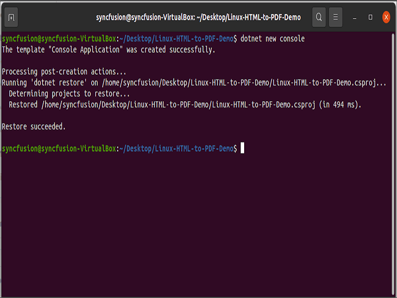
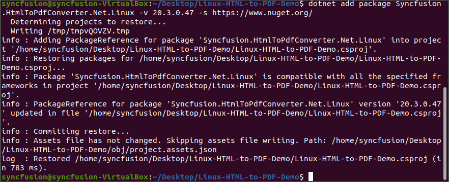
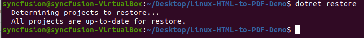
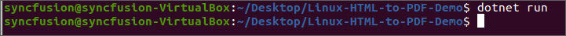

# Convert HTML to PDF file in Linux

The [HTML to PDF converter](https://www.syncfusion.com/document-sdk/net-pdf-library/html-to-pdf) is a .NET library that converts HTML or web pages to PDF documents in Linux.

## Prerequisites

**Version Compatibility**

The **Syncfusion.HtmlToPdfConverter.Net.Linux** NuGet package uses the Blink rendering engine for HTML to PDF conversion. This library is compatible with **.NET 8.0 and later** versions

**Supported Inputs**

The HTML to PDF converter supports the following input types:

- HTML String: Direct HTML content.
- URL: Web pages and online HTML content.
- HTML Files: Local HTML files.
- MHTML Files: Web archive (.mhtml/.mht) content.
- Authenticated Web Pages: Pages that require cookies, form authentication, or HTTP authentication.
- HTTP GET/POST Requests: HTML content accessed through GET or POST methods

**Required Software**

- .NET 8.0 or later
- Visual Studio 2022 or later
- Linux OS (Ubuntu, CentOS, or other distributions)

**Register the license key**

N> Starting with v16.2.0.x, if you reference Syncfusion<sup>&reg;</sup> assemblies from trial setup or from the NuGet feed, you must add the "Syncfusion.Licensing" assembly reference and register a license key in your application. Please refer to this [link](https://help.syncfusion.com/common/essential-studio/licensing/overview) for details on registering a Syncfusion<sup>&reg;</sup> license key.

Include a license key in your **Program.cs** file before creating an **HtmlToPdfConverter** instance. Refer to the [Syncfusion License](https://help.syncfusion.com/common/essential-studio/licensing/overview) documentation to learn about registering the Syncfusion license key in your application.




using Syncfusion.Licensing;

public class Program
{
    // Register the Syncfusion license
    SyncfusionLicenseProvider.RegisterLicense("YOUR LICENSE KEY");
}




N> Starting from **version 29.2.4**, it is no longer necessary to manually add the following command-line arguments when using the Blink rendering engine:
N> ```csharp
N> settings.CommandLineArguments.Add("--no-sandbox");
N> settings.CommandLineArguments.Add("--disable-setuid-sandbox");
N> ```
N> These arguments are only required when using **older versions** of the library that depend on Blink in sandbox-restricted environments.

## Steps to convert HTML to PDF in .NET Core application on Linux

Step 1: Execute the following command in the Linux terminal to create a new .NET Core Console application.




dotnet new console




  

Step 2: Install the [Syncfusion.HtmlToPdfConverter.Net.Linux](https://www.nuget.org/packages/Syncfusion.HtmlToPdfConverter.Net.Linux/) NuGet package as a reference to your project from [NuGet.org](https://www.nuget.org/) by executing the following command:




dotnet add package Syncfusion.HtmlToPdfConverter.Net.Linux -v xx.x.x.xx -s https://www.nuget.org/






Step 3: Add the following namespaces to your **Program.cs** file:




using Syncfusion.HtmlConverter;
using Syncfusion.Pdf;




Step 4: Add code to the **Program.cs** file to convert HTML to PDF using the [Convert](https://help.syncfusion.com/cr/document-processing/Syncfusion.HtmlConverter.HtmlToPdfConverter.html#Syncfusion_HtmlConverter_HtmlToPdfConverter_Convert_System_String_) method in the [HtmlToPdfConverter](https://help.syncfusion.com/cr/document-processing/Syncfusion.HtmlConverter.HtmlToPdfConverter.html) class:




// Initialize HTML to PDF converter with Blink rendering engine
HtmlToPdfConverter htmlConverter = new HtmlToPdfConverter();
// Create Blink converter settings for output rendering
BlinkConverterSettings settings = new BlinkConverterSettings();
// Assign Blink converter settings to HTML converter instance
htmlConverter.ConverterSettings = settings;
// Convert URL to PDF document using Blink rendering
PdfDocument document = htmlConverter.Convert("https://www.syncfusion.com");
// Create file stream to write PDF output to disk
FileStream fileStream = new FileStream("HTML-to-PDF.pdf", FileMode.CreateNew, FileAccess.ReadWrite);
// Save the PDF document to file stream
document.Save(fileStream);
// Close the document and dispose resources
document.Close(true);




Step 5: Execute the following command to restore the NuGet packages:




dotnet restore






Step 6: Execute the following command in the terminal to run the application:




dotnet run






By executing the program, the application will generate and save the PDF document in the same directory as the **Program.cs** file:


A complete working sample for converting HTML to PDF in Linux can be downloaded from [GitHub](https://github.com/SyncfusionExamples/html-to-pdf-csharp-examples/tree/master/Linux).

Click [here](https://www.syncfusion.com/document-sdk/net-pdf-library/html-to-pdf) to explore the rich set of Syncfusion<sup>&reg;</sup> HTML to PDF converter library features. 

You can also view the online sample to [convert HTML to PDF documents](https://document.syncfusion.com/demos/pdf/htmltopdf#/tailwind3) in ASP.NET Core.