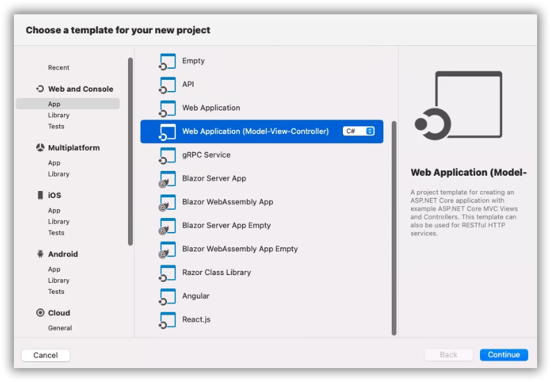
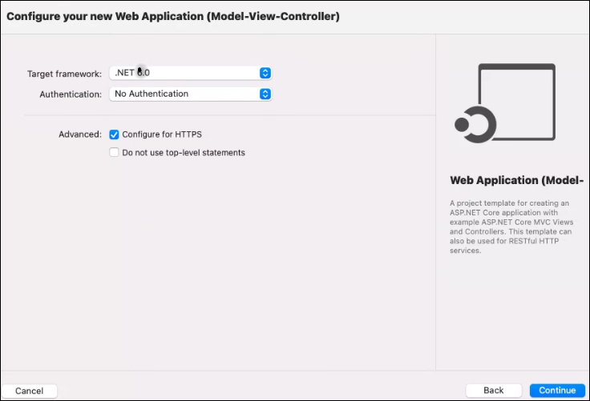
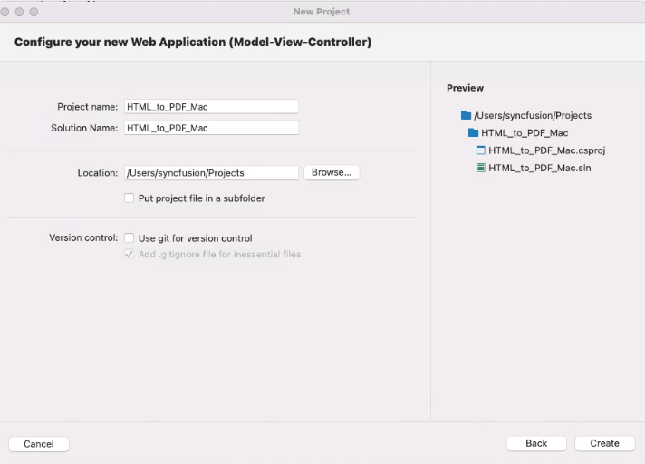
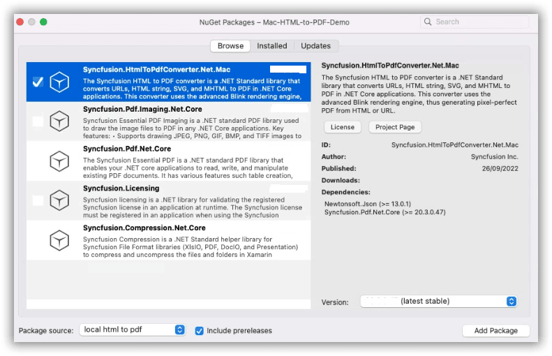
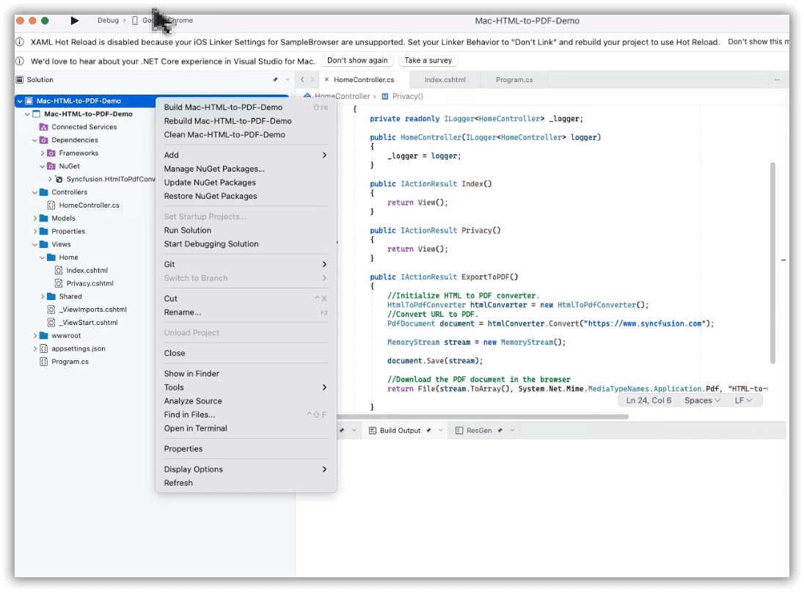
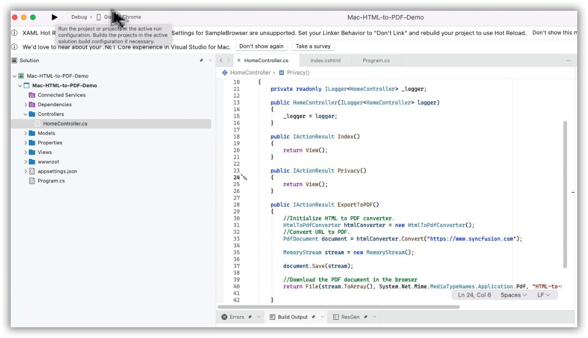

# Convert HTML to PDF file in macOS using C#

The [HTML to PDF converter](https://www.syncfusion.com/document-sdk/net-pdf-library/html-to-pdf) is a .NET library for converting webpages, SVG, MHTML, and HTML to PDF using C#. It is reliable and accurate. Using this library, you can convert HTML to PDF documents in macOS.

## Prerequisites

**Version Compatibility**

The **Syncfusion.HtmlToPdfConverter.Net.Mac** NuGet package uses the Blink rendering engine for HTML to PDF conversion. This library is compatible with **.NET 8.0 and later** versions.

**Required Software**

- .NET 8.0 or later
- Visual Studio or Visual Studio Code
- macOS operating system

**Supported Inputs**

The HTML to PDF converter supports the following input types:

- HTML String: Direct HTML content.
- URL: Web pages and online HTML content.
- HTML Files: Local HTML files.
- MHTML Files: Web archive (.mhtml/.mht) content.
- Authenticated Web Pages: Pages that require cookies, form authentication, or HTTP authentication.
- HTTP GET/POST Requests: HTML content accessed through GET or POST methods

**Register the license key**

N> Starting with v16.2.0.x, if you reference Syncfusion<sup>&reg;</sup> assemblies from trial setup or from the NuGet feed, you must add the "Syncfusion.Licensing" assembly reference and register a license key in your application. Please refer to this [link](https://help.syncfusion.com/common/essential-studio/licensing/overview) for details on registering a Syncfusion<sup>&reg;</sup> license key.

Include your license key in your application before initializing any Syncfusion components:




using Syncfusion.Licensing;

// Register your Syncfusion license key early in application startup
SyncfusionLicenseProvider.RegisterLicense("YOUR LICENSE KEY");




## Steps to Convert HTML to PDF in ASP.NET Core MVC





Step 1: Create a new C# ASP.NET Core Web Application project.
  

Step 2: Select the Target Framework (e.g., .NET 8.0 or later) of your project.
  

Step 3: Configure your application and click Create.


Step 4: Install the [Syncfusion.HtmlToPdfConverter.Net.Mac](https://www.nuget.org/packages/Syncfusion.HtmlToPdfConverter.Net.Mac) NuGet package as a reference to your .NET applications from [NuGet.org](https://www.nuget.org/).


Step 5: A default controller named **HomeController.cs** is added when creating an ASP.NET Core MVC project. Include the following namespaces in the **HomeController.cs** file to enable HTML-to-PDF conversion functionality:




using Syncfusion.Pdf;
using Syncfusion.HtmlConverter;
using Microsoft.AspNetCore.Hosting;




Step 6: The **HomeController.cs** file contains a default action method named **Index**. Right-click on the **Index** method and select **Go To View** to navigate to the **Index.cshtml** view page. Add a new button in the **Index.cshtml** file as shown below:




@{Html.BeginForm("ExportToPDF", "Home", FormMethod.Post);
    {
        <div>
            <input type="submit" value="Convert PDF" style="width:150px;height:27px" />
        </div>
     }
        Html.EndForm();
 }




Step 7: Add a new action method named **ExportToPDF** in the **HomeController.cs** file to convert HTML to PDF using the [**Convert**](https://help.syncfusion.com/cr/document-processing/Syncfusion.HtmlConverter.HtmlToPdfConverter.html#Syncfusion_HtmlConverter_HtmlToPdfConverter_Convert_System_String_) method from the [**HtmlToPdfConverter**](https://help.syncfusion.com/cr/document-processing/Syncfusion.HtmlConverter.HtmlToPdfConverter.html) class:




public IActionResult ExportToPDF()
{
    // Initialize HTML to PDF converter
    HtmlToPdfConverter htmlConverter = new HtmlToPdfConverter();
    // This renders the Syncfusion website
    PdfDocument document = htmlConverter.Convert("https://www.syncfusion.com");
    // Create a MemoryStream to hold the PDF binary data
    MemoryStream stream = new MemoryStream();
    // Save the PDF document
    document.Save(stream);
    // Return the PDF file as a downloadable attachment to the browser
    return File(stream.ToArray(), System.Net.Mime.MediaTypeNames.Application.Pdf, "HTML-to-PDF.pdf");
}




Step 8: Right-click the project and select **Build**:


N> After the build completes successfully, you must extract the **Chromium.app** file from the build output directory: `bin/Debug/net8.0/runtimes/osx/native/Chromium.app`. This is required for the WebKit rendering engine to function on macOS.

Step 9: Run the application:






Step 1: Open a terminal in Visual Studio Code (press **Ctrl+`**) and run the following command to create a new ASP.NET Core MVC project:

```bash
# Create a new ASP.NET Core MVC project
dotnet new mvc -n CreatePdfMacOSApp
```

Step 2: Replace **CreatePdfMacOSApp** with your desired project name.

Step 3: Navigate to the project directory using the following command:

```bash
# Change to the project directory
cd CreatePdfMacOSApp
```

Step 4: Use the following command in the terminal to add the **Syncfusion.HtmlToPdfConverter.Net.Mac** NuGet package to your project:

```bash
# Add Syncfusion HTML to PDF converter for macOS
dotnet add package Syncfusion.HtmlToPdfConverter.Net.Mac
```

Step 5: A default controller named **HomeController.cs** is added when creating an ASP.NET Core MVC project. Include the following namespaces in the **HomeController.cs** file to enable HTML-to-PDF conversion functionality:




using Syncfusion.Pdf;
using Syncfusion.HtmlConverter;
using System.IO;
using Microsoft.AspNetCore.Hosting;




Step 6: The **HomeController.cs** file contains a default action method named **Index**. In Visual Studio Code, open the **Index.cshtml** view file (located in the **Views/Home** folder) and add a button to trigger the PDF conversion:




@{Html.BeginForm("ExportToPDF", "Home", FormMethod.Post);
    {
        <div>
            <input type="submit" value="Convert PDF" style="width:150px;height:27px" />
        </div>
     }
        Html.EndForm();
 }




Step 7: Add a new action method named **ExportToPDF** in the **HomeController.cs** file to convert HTML to PDF using the [**Convert**](https://help.syncfusion.com/cr/document-processing/Syncfusion.HtmlConverter.HtmlToPdfConverter.html#Syncfusion_HtmlConverter_HtmlToPdfConverter_Convert_System_String_) method from the [**HtmlToPdfConverter**](https://help.syncfusion.com/cr/document-processing/Syncfusion.HtmlConverter.HtmlToPdfConverter.html) class:




public IActionResult ExportToPDF()
{
    // Initialize HTML to PDF converter
    HtmlToPdfConverter htmlConverter = new HtmlToPdfConverter();
    // This renders the Syncfusion website
    PdfDocument document = htmlConverter.Convert("https://www.syncfusion.com");
    // Create a MemoryStream to hold the PDF binary data
    MemoryStream stream = new MemoryStream();
    // Save the PDF document
    document.Save(stream);
    // Return the PDF file as a downloadable attachment to the browser
    return File(stream.ToArray(), System.Net.Mime.MediaTypeNames.Application.Pdf, "HTML-to-PDF.pdf");
}




Step 8: Build the project by running the following command in the terminal:

```bash
# Build the project and restore all dependencies
dotnet build
```

Step 9: Run the application by executing the following command in the terminal:

```bash
# Run the ASP.NET Core application on the local development server
dotnet run
```

 


By executing the program, the application will convert the URL and generate a PDF document:


A complete working sample demonstrating HTML to PDF conversion in macOS can be downloaded from [GitHub](https://github.com/SyncfusionExamples/html-to-pdf-csharp-examples/tree/master/Mac).

Click [here](https://www.syncfusion.com/document-sdk/net-pdf-library/html-to-pdf) to explore the rich set of Syncfusion<sup>&reg;</sup> HTML to PDF converter library features. 

You can also view the online sample to [convert HTML to PDF documents](https://document.syncfusion.com/demos/pdf/htmltopdf#/tailwind3) in ASP.NET Core.