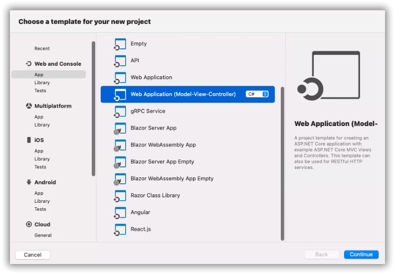
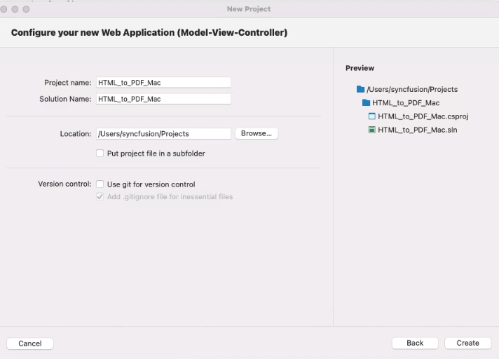

# Convert HTML to PDF file in Mac using C#

The Syncfusion<sup>&reg;</sup> [HTML to PDF converter](https://www.syncfusion.com/pdf-framework/net/html-to-pdf) is a .NET library for converting webpages, SVG, MHTML, and HTML to PDF using C#. It is reliable and accurate. Using this library, you can convert HTML to PDF document in Mac.

## Steps to convert HTML to PDF in ASP.NET Core MVC





**Prerequisites**:

* Install .NET SDK: Ensure that you have the .NET SDK installed on your system. You can download it from the [.NET Downloads page](https://dotnet.microsoft.com/en-us/download).
* Install Visual Studio: Download and install Visual Studio Code from the [official website](https://code.visualstudio.com/download).

Step 1: Create a new C# ASP.NET Core Web Application project.
  

Step 2: Select the Target Framework of your project.
  

Step 3: Configure your application and click Create.


Step 4: Install the [Syncfusion.HtmlToPdfConverter.Net.Mac](https://www.nuget.org/packages/Syncfusion.HtmlToPdfConverter.Net.Mac) NuGet package as reference to your .NET Standard applications from [NuGet.org](https://www.nuget.org/).


N> Starting with v16.2.0.x, if you reference Syncfusion<sup>&reg;</sup> assemblies from trial setup or from the NuGet feed, you also have to add "Syncfusion.Licensing" assembly reference and include a license key in your projects. Please refer to this [link](https://help.syncfusion.com/common/essential-studio/licensing/overview) to know about registering Syncfusion<sup>&reg;</sup> license key in your application to use our components.

Step 5: A default controller with name HomeController.cs gets added on creation of ASP.NET MVC project. Include the following namespaces in that HomeController.cs file.



using Syncfusion.Pdf;
using Syncfusion.HtmlConverter;
using System.IO;
using Microsoft.AspNetCore.Hosting;



Step 6: A default action method named Index will be present in HomeController.cs. Right click on Index method and select Go To View where you will be directed to its associated view page Index.cshtml. Add a new button in the Index.cshtml as shown below.



@{Html.BeginForm("ExportToPDF", "Home", FormMethod.Post);
    {
        <div>
            <input type="submit" value="Convert PDF" style="width:150px;height:27px" />
        </div>
     }
        Html.EndForm();
 }



Step 7: Add a new action method ExportToPDF in HomeController.cs and include the below code example to convert HTML to PDF file using [Convert](https://help.syncfusion.com/cr/document-processing/Syncfusion.HtmlConverter.HtmlToPdfConverter.html#Syncfusion_HtmlConverter_HtmlToPdfConverter_Convert_System_String_) method in [HtmlToPdfConverter](https://help.syncfusion.com/cr/document-processing/Syncfusion.HtmlConverter.HtmlToPdfConverter.html) class.



public IActionResult ExportToPDF()
{
    //Initialize HTML to PDF converter.
    HtmlToPdfConverter htmlConverter = new HtmlToPdfConverter();
    //Convert URL to PDF.
    PdfDocument document = htmlConverter.Convert("https://www.syncfusion.com");
    MemoryStream stream = new MemoryStream();
    document.Save(stream);
    //Download the PDF document in the browser
    return File(stream.ToArray(), System.Net.Mime.MediaTypeNames.Application.Pdf, "HTML-to-PDF.pdf");
}



Step 8: Right click the project and select Build.


N> Once the build succeeded, unzip the chromium.app file in bin folder (bin-> Debug-> net6.0-> runtimes-> osx-> native-> Chromium.app)`

Step 9: Run the application.






**Prerequisites**:

* Install .NET SDK: Ensure that you have the .NET SDK installed on your system. You can download it from the [.NET Downloads page](https://dotnet.microsoft.com/en-us/download).
* Install Visual Studio Code: Download and install Visual Studio Code from the [official website](https://code.visualstudio.com/download).
* Install C# Extension for VS Code: Open Visual Studio Code, go to the Extensions view (Ctrl+Shift+X), and search for 'C#'. Install the official [C# extension provided by Microsoft](https://marketplace.visualstudio.com/items?itemName=ms-dotnettools.csharp).

Step 1: Open the terminal (Ctrl+` ) and run the following command to create a new Blazor Server application

```
dotnet new blazorserver -n CreatePdfMacOSApp
```
Step 2: Replace ****CreatePdfMacOSApp** with your desired project name.

Step 3: Navigate to the project directory using the following command

```
cd CreatePdfMacOSApp
```
Step 4: Use the following command in the terminal to add the [Syncfusion.HtmlToPdfConverter.Net.Mac](https://www.nuget.org/packages/Syncfusion.HtmlToPdfConverter.Net.Mac)) package to your project.

```
dotnet add package Syncfusion.HtmlToPdfConverter.Net.Mac
```
N> Starting with v16.2.0.x, if you reference Syncfusion<sup>&reg;</sup> assemblies from trial setup or from the NuGet feed, you also have to add "Syncfusion.Licensing" assembly reference and include a license key in your projects. Please refer to this [link](https://help.syncfusion.com/common/essential-studio/licensing/overview) to know about registering Syncfusion<sup>&reg;</sup> license key in your application to use our components.

Step 5: A default controller with name HomeController.cs gets added on creation of ASP.NET MVC project. Include the following namespaces in that HomeController.cs file.



using Syncfusion.Pdf;
using Syncfusion.HtmlConverter;
using System.IO;
using Microsoft.AspNetCore.Hosting;



Step 6: A default action method named Index will be present in HomeController.cs. Right click on Index method and select Go To View where you will be directed to its associated view page Index.cshtml. Add a new button in the Index.cshtml as shown below.



@{Html.BeginForm("ExportToPDF", "Home", FormMethod.Post);
    {
        <div>
            <input type="submit" value="Convert PDF" style="width:150px;height:27px" />
        </div>
     }
        Html.EndForm();
 }



Step 7: Add a new action method ExportToPDF in HomeController.cs and include the below code example to convert HTML to PDF file using [Convert](https://help.syncfusion.com/cr/document-processing/Syncfusion.HtmlConverter.HtmlToPdfConverter.html#Syncfusion_HtmlConverter_HtmlToPdfConverter_Convert_System_String_) method in [HtmlToPdfConverter](https://help.syncfusion.com/cr/document-processing/Syncfusion.HtmlConverter.HtmlToPdfConverter.html) class.



public IActionResult ExportToPDF()
{
    //Initialize HTML to PDF converter.
    HtmlToPdfConverter htmlConverter = new HtmlToPdfConverter();
    //Convert URL to PDF.
    PdfDocument document = htmlConverter.Convert("https://www.syncfusion.com");
    MemoryStream stream = new MemoryStream();
    document.Save(stream);
    //Download the PDF document in the browser
    return File(stream.ToArray(), System.Net.Mime.MediaTypeNames.Application.Pdf, "HTML-to-PDF.pdf");
}



Step 8: Build the project.

Run the following command in terminal to build the project.

```
dotnet build
```

Step 9: Run the project.

Run the following command in terminal to build the project.

```
dotnet run
```

 


By executing the program, you will get the PDF document as follows.


A complete working sample can be downloaded from [Github](https://github.com/SyncfusionExamples/html-to-pdf-csharp-examples/tree/master/Mac).

Click [here](https://www.syncfusion.com/document-processing/pdf-framework/net-core/html-to-pdf) to explore the rich set of Syncfusion<sup>&reg;</sup> HTML to PDF converter library features. 

An online sample link to [convert HTML to PDF document](https://ej2.syncfusion.com/aspnetcore/PDF/HtmltoPDF#/material3) in ASP.NET Core. 