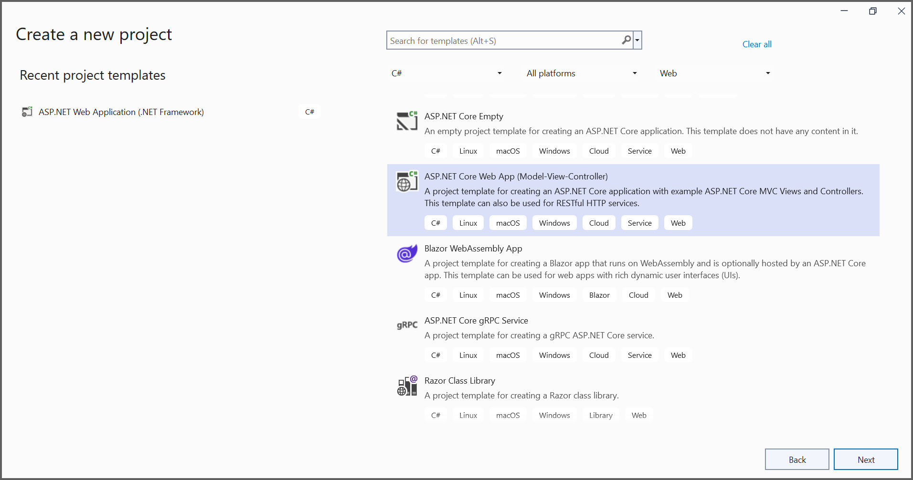
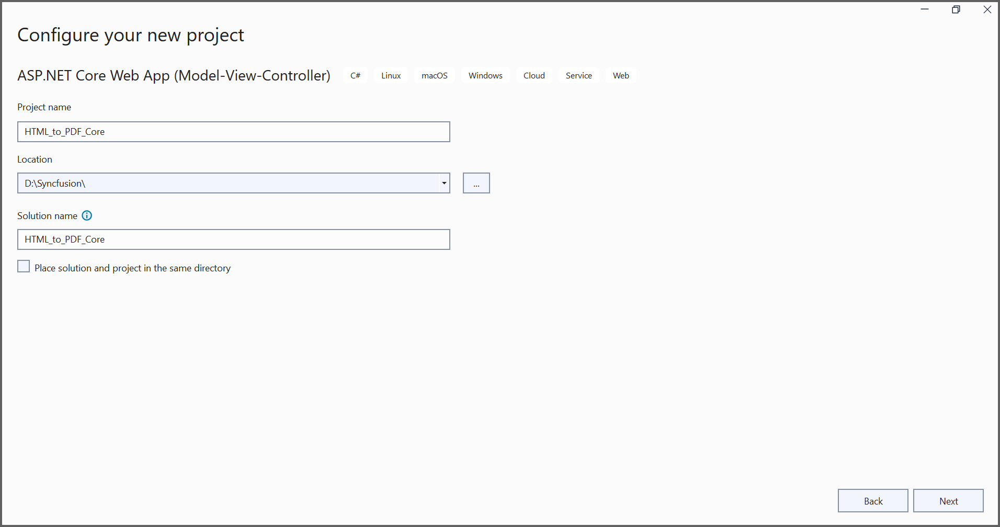
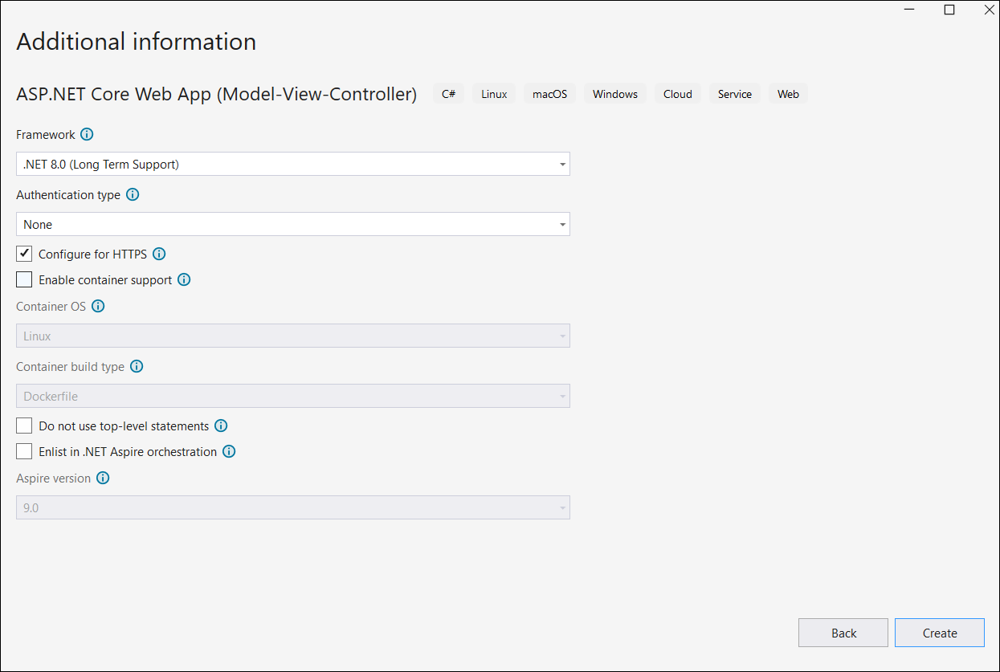
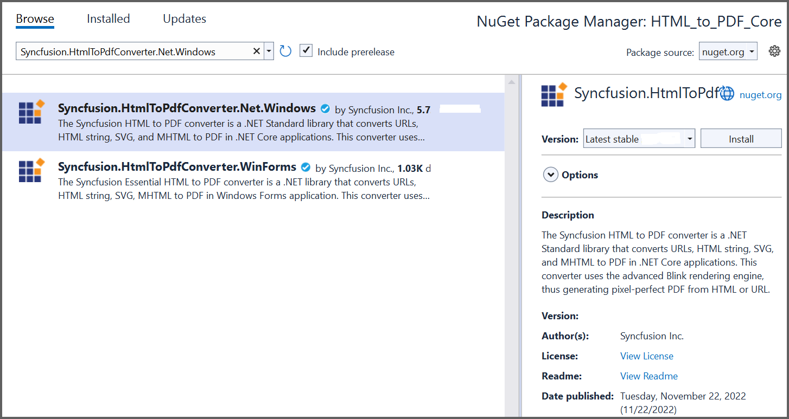
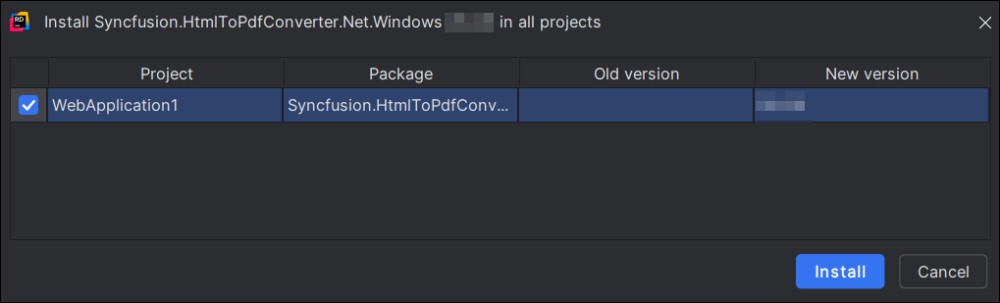

# Convert HTML to PDF file in ASP.NET Core

The [HTML to PDF converter](https://www.syncfusion.com/document-sdk/net-pdf-library/html-to-pdf) is a .NET library used to convert HTML or web pages to PDF documents in ASP.NET Core applications.

To quickly get started with converting HTML to PDF in ASP.NET Core using the HTML-to-PDF Library, check this video:


## Prerequisites

**Version Compatibility**

The **Syncfusion.HtmlToPdfConverter.Net.Windows** NuGet package uses the Blink rendering engine for HTML to PDF conversion. This library is compatible with **.NET 8.0 and later** versions

**Required Software**

- .NET 8 SDK or later
- Visual Studio, Visual Studio Code, or JetBrains Rider

**Supported Inputs**

The HTML to PDF converter supports the following input types:

- HTML String: Direct HTML content.
- URL: Web pages and online HTML content.
- HTML Files: Local HTML files.
- MHTML Files: Web archive (.mhtml/.mht) content.
- Authenticated Web Pages: Pages that require cookies, form authentication, or HTTP authentication.
- HTTP GET/POST Requests: HTML content accessed through GET or POST methods

**Register the license key**

N> Starting with v16.2.0.x, if you reference Syncfusion<sup>&reg;</sup> assemblies from trial setup or from the NuGet feed, you must add the "Syncfusion.Licensing" assembly reference and register a license key in your application. Please refer to this [link](https://help.syncfusion.com/common/essential-studio/licensing/overview) for details on registering a Syncfusion<sup>&reg;</sup> license key.

Include a license key in your **HomeController.cs** file before creating an **HtmlToPdfConverter** instance. Refer to the [Syncfusion License](https://help.syncfusion.com/common/essential-studio/licensing/overview) documentation to learn about registering the Syncfusion license key in your application.




using Syncfusion.Licensing;

public class HomeController
{
    // Register the Syncfusion license
    SyncfusionLicenseProvider.RegisterLicense("YOUR LICENSE KEY");
}




## Steps to Convert HTML to PDF in ASP.NET Core





Step 1: Create a new C# ASP.NET Core Web Application project:


Step 2:  In configuration windows, name your project and select Next.



Step 3: Install the [Syncfusion.HtmlToPdfConverter.Net.Windows](https://www.nuget.org/packages/Syncfusion.HtmlToPdfConverter.Net.Windows) NuGet package as a reference to your .NET applications from [NuGet.org](https://www.nuget.org/):


Step 4: A default controller named **HomeController.cs** is added when creating an ASP.NET Core MVC project. Include the following namespaces in the **HomeController.cs** file to enable HTML-to-PDF conversion functionality:




using Syncfusion.Pdf;
using Syncfusion.HtmlConverter;




Step 5: Add a new button in the **Index.cshtml** file to trigger the PDF conversion:




@{Html.BeginForm("ExportToPDF", "Home", FormMethod.Post);
    {
        <div>
            <input type="submit" value="Convert HTML to PDF" style="width:150px;height:27px" />
        </div>
    }
    Html.EndForm();
}




Step 6: Add a new action method named **ExportToPDF** in the **HomeController.cs** file to convert HTML to PDF using the [**Convert**](https://help.syncfusion.com/cr/document-processing/Syncfusion.HtmlConverter.HtmlToPdfConverter.html#Syncfusion_HtmlConverter_HtmlToPdfConverter_Convert_System_String_) method from the [**HtmlToPdfConverter**](https://help.syncfusion.com/cr/document-processing/Syncfusion.HtmlConverter.HtmlToPdfConverter.html) class. The HTML content will be scaled based on the [**ViewPortSize**](https://help.syncfusion.com/cr/document-processing/Syncfusion.HtmlConverter.BlinkConverterSettings.html#Syncfusion_HtmlConverter_BlinkConverterSettings_ViewPortSize) property of the [**BlinkConverterSettings**](https://help.syncfusion.com/cr/document-processing/Syncfusion.HtmlConverter.BlinkConverterSettings.html) class:




public IActionResult ExportToPDF()
{
    // Initialize HTML to PDF converter
    HtmlToPdfConverter htmlConverter = new HtmlToPdfConverter();
    // Create Blink converter settings
    BlinkConverterSettings blinkConverterSettings = new BlinkConverterSettings();
    // Set Blink viewport size
    blinkConverterSettings.ViewPortSize = new Size(1280, 0);
    // Assign Blink converter settings to the HTML converter instance
    htmlConverter.ConverterSettings = blinkConverterSettings;
    // Convert the specified URL to a PDF
    PdfDocument document = htmlConverter.Convert("https://www.syncfusion.com");
    // Create a MemoryStream to hold the PDF binary data
    MemoryStream stream = new MemoryStream();
    // Save the PDF document
    document.Save(stream);
    // Close the PDF document
    document.Close();
    // Return the PDF file
    return File(stream.ToArray(), System.Net.Mime.MediaTypeNames.Application.Pdf, "HTML-to-PDF.pdf");
}




Step 7: Build the project by clicking **Build > Build Solution** or pressing **Ctrl+Shift+B**:

Step 8: Run the application by clicking the **Start** button (green arrow) or pressing **F5**:





Step 1: Open a terminal in Visual Studio Code (press **Ctrl+`**) and run the following command to create a new ASP.NET Core MVC project:

```bash
# Create a new ASP.NET Core MVC project
dotnet new mvc -n CreatePdfASPNETCoreAPP
```

Step 2: Replace **CreatePdfASPNETCoreAPP** with your desired project name.

Step 3: Navigate to the project directory using the following command:

```bash
# Change to the project directory
cd CreatePdfASPNETCoreAPP
```

Step 4: Use the following command in the terminal to add the **Syncfusion.HtmlToPdfConverter.Net.Windows** NuGet package to your project:

```bash
# Add Syncfusion HTML to PDF converter for Windows
dotnet add package Syncfusion.HtmlToPdfConverter.Net.Windows
```

Step 5: A default controller named **HomeController.cs** is added when creating an ASP.NET Core MVC project. Include the following namespaces in the **HomeController.cs** file to enable HTML-to-PDF conversion functionality:




using Syncfusion.Pdf;
using Syncfusion.HtmlConverter;




Step 6: Add a new button in the **Index.cshtml** file (located in the **Views/Home** folder) to trigger the PDF conversion:




@{Html.BeginForm("ExportToPDF", "Home", FormMethod.Post);
    {
        <div>
            <input type="submit" value="Convert HTML to PDF" style="width:150px;height:27px" />
        </div>
    }
    Html.EndForm();
}




Step 7: Add a new action method named **ExportToPDF** in the **HomeController.cs** file to convert HTML to PDF using the [**Convert**](https://help.syncfusion.com/cr/document-processing/Syncfusion.HtmlConverter.HtmlToPdfConverter.html#Syncfusion_HtmlConverter_HtmlToPdfConverter_Convert_System_String_) method from the [**HtmlToPdfConverter**](https://help.syncfusion.com/cr/document-processing/Syncfusion.HtmlConverter.HtmlToPdfConverter.html) class. The HTML content will be scaled based on the [**ViewPortSize**](https://help.syncfusion.com/cr/document-processing/Syncfusion.HtmlConverter.BlinkConverterSettings.html#Syncfusion_HtmlConverter_BlinkConverterSettings_ViewPortSize) property of the [**BlinkConverterSettings**](https://help.syncfusion.com/cr/document-processing/Syncfusion.HtmlConverter.BlinkConverterSettings.html) class:




public IActionResult ExportToPDF()
{
    // Initialize HTML to PDF converter
    HtmlToPdfConverter htmlConverter = new HtmlToPdfConverter();
    // Create Blink converter settings
    BlinkConverterSettings blinkConverterSettings = new BlinkConverterSettings();
    // Set Blink viewport size
    blinkConverterSettings.ViewPortSize = new Size(1280, 0);
    // Assign Blink converter settings to the HTML converter instance
    htmlConverter.ConverterSettings = blinkConverterSettings;
    // Convert the specified URL to a PDF
    PdfDocument document = htmlConverter.Convert("https://www.syncfusion.com");
    // Create a MemoryStream to hold the PDF binary data
    MemoryStream stream = new MemoryStream();
    // Save the PDF document
    document.Save(stream);
    // Close the PDF document
    document.Close();
    // Return the PDF file
    return File(stream.ToArray(), System.Net.Mime.MediaTypeNames.Application.Pdf, "HTML-to-PDF.pdf");
}




Step 8: Build the project by running the following command in the terminal:

```bash
# Build the project and restore all dependencies
dotnet build
```

Step 9: Run the application by executing the following command in the terminal:

```bash
# Run the ASP.NET Core application on the local development server
dotnet run
```




Step 1: Open JetBrains Rider and create a new ASP.NET Core Web application project:
* Launch JetBrains Rider
* Click **New Solution** on the welcome screen


* In the **New Solution** dialog, select **Project Type** as **Web**
* Select the target framework (e.g., **.NET 8.0**, **.NET 9.0**) and template as **Web App (Model-View-Controller)**
* Enter a project name and specify the location
* Click **Create**


Step 2: Install the NuGet package from [NuGet.org](https://www.nuget.org/):
* Click the **NuGet** icon in the Rider toolbar and type [**Syncfusion.HtmlToPdfConverter.Net.Windows**](https://www.nuget.org/packages/Syncfusion.HtmlToPdfConverter.Net.Windows) in the search bar
* Ensure that **nuget.org** is selected as the package source
* Select the latest **Syncfusion.HtmlToPdfConverter.Net.Windows** NuGet package from the list
* Click the **+** (Add) button to add the package


* Click the **Install** button to complete the installation



Step 3: A default controller named **HomeController.cs** is added when creating an ASP.NET Core MVC project. Include the following namespaces in the **HomeController.cs** file to enable HTML-to-PDF conversion functionality:




using Syncfusion.Pdf;
using Syncfusion.HtmlConverter;




Step 4: Add a new button in the **Index.cshtml** file to trigger the PDF conversion:




@{Html.BeginForm("ExportToPDF", "Home", FormMethod.Post);
    {
        <div>
            <input type="submit" value="Convert HTML to PDF" style="width:150px;height:27px" />
        </div>
    }
    Html.EndForm();
}




Step 5: Add a new action method named **ExportToPDF** in the **HomeController.cs** file to convert HTML to PDF using the [**Convert**](https://help.syncfusion.com/cr/document-processing/Syncfusion.HtmlConverter.HtmlToPdfConverter.html#Syncfusion_HtmlConverter_HtmlToPdfConverter_Convert_System_String_) method from the [**HtmlToPdfConverter**](https://help.syncfusion.com/cr/document-processing/Syncfusion.HtmlConverter.HtmlToPdfConverter.html) class. The HTML content will be scaled based on the [**ViewPortSize**](https://help.syncfusion.com/cr/document-processing/Syncfusion.HtmlConverter.BlinkConverterSettings.html#Syncfusion_HtmlConverter_BlinkConverterSettings_ViewPortSize) property of the [**BlinkConverterSettings**](https://help.syncfusion.com/cr/document-processing/Syncfusion.HtmlConverter.BlinkConverterSettings.html) class:




public IActionResult ExportToPDF()
{
    // Initialize HTML to PDF converter
    HtmlToPdfConverter htmlConverter = new HtmlToPdfConverter();
    // Create Blink converter settings
    BlinkConverterSettings blinkConverterSettings = new BlinkConverterSettings();
    // Set Blink viewport size
    blinkConverterSettings.ViewPortSize = new Size(1280, 0);
    // Assign Blink converter settings to the HTML converter instance
    htmlConverter.ConverterSettings = blinkConverterSettings;
    // Convert the specified URL to a PDF
    PdfDocument document = htmlConverter.Convert("https://www.syncfusion.com");
    // Create a MemoryStream to hold the PDF binary data
    MemoryStream stream = new MemoryStream();
    // Save the PDF document
    document.Save(stream);
    // Close the PDF document
    document.Close();
    // Return the PDF file
    return File(stream.ToArray(), System.Net.Mime.MediaTypeNames.Application.Pdf, "HTML-to-PDF.pdf");
}




Step 6: Build the project by clicking the **Build** button in the toolbar or pressing <kbd>Ctrl</kbd>+<kbd>Shift</kbd>+<kbd>B</kbd>:

Step 7: Run the application by clicking the **Run** button (green arrow) in the toolbar or pressing <kbd>F5</kbd>:


 


By executing the program, the application will convert the URL and generate a PDF document:


A complete working sample demonstrating HTML to PDF conversion in ASP.NET Core can be downloaded from [GitHub](https://github.com/SyncfusionExamples/html-to-pdf-csharp-examples/tree/master/ASP.NET%20Core).

Click [here](https://www.syncfusion.com/document-sdk/net-pdf-library/html-to-pdf) to explore the rich set of Syncfusion<sup>&reg;</sup> HTML to PDF converter library features. 

You can also view the online sample to [convert HTML to PDF documents](https://document.syncfusion.com/demos/pdf/htmltopdf#/tailwind3) in ASP.NET Core.