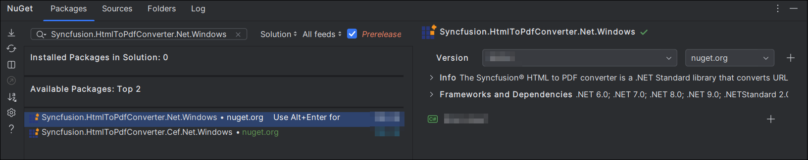
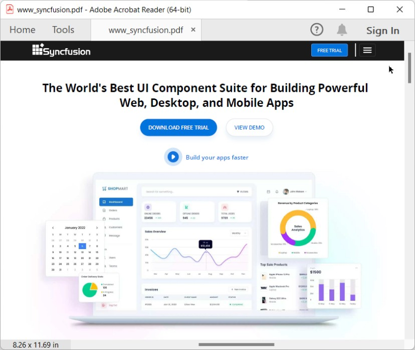

# Convert HTML to PDF file in ASP.NET Core

The Syncfusion<sup>&reg;</sup> HTML to PDF converter is a .NET library used to convert HTML or web pages to PDF document in ASP.NET Core application.  

To quickly get started with converting HTML to PDF in ASP.NET Core using the HTML-to-PDF Library. Please, check this video:


## Steps to convert HTML to PDF in ASP.NET Core application





**Prerequisites:**

* Visual Studio 2022.
* Install [.NET 8 SDK](https://dotnet.microsoft.com/en-us/download/dotnet/8.0) or later.

Step 1: Create a new C# ASP.NET Core Web Application project.


Step 2:  In configuration windows, name your project and select Next.


Step 3:  Install [Syncfusion.HtmlToPdfConverter.Net.Windows](https://www.nuget.org/packages/Syncfusion.HtmlToPdfConverter.Net.Windows) NuGet package as reference to your .NET Standard applications from [NuGet.org](https://www.nuget.org/).   


N> Starting with v16.2.0.x, if you reference Syncfusion<sup>&reg;</sup> assemblies from trial setup or from the NuGet feed, you also have to add "Syncfusion.Licensing" assembly reference and include a license key in your projects. Please refer to this [link](https://help.syncfusion.com/common/essential-studio/licensing/overview) to know about registering Syncfusion<sup>&reg;</sup> license key in your application to use our components.

Step 4: A default controller with name HomeController.cs gets added on creation of ASP.NET Core MVC project. Include the following namespaces in that HomeController.cs file.



using Syncfusion.Pdf;
using Syncfusion.HtmlConverter;
using System.IO;



Step 5: Add a new button in index.cshtml as shown below.



@{Html.BeginForm("ExportToPDF", "Home", FormMethod.Post);
    {
        <div>
            <input type="submit" value="Convert HTML to PDF" style="width:150px;height:27px" />
        </div>
    }
    Html.EndForm();
}



Step 6: Add a new action method named ExportToPDF in HomeController.cs and include the below code example to convert HTML to PDF document using [Convert](https://help.syncfusion.com/cr/document-processing/Syncfusion.HtmlConverter.HtmlToPdfConverter.html#Syncfusion_HtmlConverter_HtmlToPdfConverter_Convert_System_String_) method in [HtmlToPdfConverter](https://help.syncfusion.com/cr/document-processing/Syncfusion.HtmlConverter.HtmlToPdfConverter.html) class. The HTML content will be scaled based on the given [ViewPortSize](https://help.syncfusion.com/cr/document-processing/Syncfusion.HtmlConverter.BlinkConverterSettings.html#Syncfusion_HtmlConverter_BlinkConverterSettings_ViewPortSize) property of [BlinkConverterSettings](https://help.syncfusion.com/cr/document-processing/Syncfusion.HtmlConverter.BlinkConverterSettings.html) class.



//Initialize HTML to PDF converter.
HtmlToPdfConverter htmlConverter = new HtmlToPdfConverter();
BlinkConverterSettings blinkConverterSettings = new BlinkConverterSettings();
//Set Blink viewport size.
blinkConverterSettings.ViewPortSize = new Syncfusion.Drawing.Size(1280, 0);
//Assign Blink converter settings to HTML converter.
htmlConverter.ConverterSettings = blinkConverterSettings;
//Convert URL to PDF document.
PdfDocument document = htmlConverter.Convert("https://www.syncfusion.com");
//Create memory stream.
MemoryStream stream = new MemoryStream();
//Save and close the document. 
document.Save(stream);
document.Close(); 
return File(stream.ToArray(), System.Net.Mime.MediaTypeNames.Application.Pdf, "HTML-to-PDF.pdf");



Step 7: Build the project.

Click on Build > Build Solution or press Ctrl + Shift + B to build the project.

Step 8: Run the project.

Click the Start button (green arrow) or press F5 to run the app.





**Prerequisites**:

* Install .NET SDK: Ensure that you have the .NET SDK installed on your system. You can download it from the [.NET Downloads page](https://dotnet.microsoft.com/en-us/download).
* Install Visual Studio Code: Download and install Visual Studio Code from the [official website](https://code.visualstudio.com/download).
* Install C# Extension for VS Code: Open Visual Studio Code, go to the Extensions view (Ctrl+Shift+X), and search for 'C#'. Install the official [C# extension provided by Microsoft](https://marketplace.visualstudio.com/items?itemName=ms-dotnettools.csharp).

Step 1: Open the terminal (Ctrl+` ) and run the following command to create a new ASP.NET Core Web Application project.

```
dotnet new mvc -n CreatePdfASPNETCoreAPP
```
Step 2: Replace ****CreatePdfASPNETCoreAPP** with your desired project name.

Step 3: Navigate to the project directory using the following command

```
cd CreatePdfASPNETCoreAPP
```
Step 4: Use the following command in the terminal to add the [Syncfusion.HtmlToPdfConverter.Net.Windows](https://www.nuget.org/packages/Syncfusion.HtmlToPdfConverter.Net.Windows) package to your project.

```
dotnet add package Syncfusion.HtmlToPdfConverter.Net.Windows
```
N> Starting with v16.2.0.x, if you reference Syncfusion<sup>&reg;</sup> assemblies from trial setup or from the NuGet feed, you also have to add "Syncfusion.Licensing" assembly reference and include a license key in your projects. Please refer to this [link](https://help.syncfusion.com/common/essential-studio/licensing/overview) to know about registering Syncfusion<sup>&reg;</sup> license key in your application to use our components.

Step 5: A default controller with name HomeController.cs gets added on creation of ASP.NET Core MVC project. Include the following namespaces in that HomeController.cs file.



using Syncfusion.Pdf;
using Syncfusion.HtmlConverter;
using System.IO;



Step 6: Add a new button in index.cshtml as shown below.



@{Html.BeginForm("ExportToPDF", "Home", FormMethod.Post);
    {
        <div>
            <input type="submit" value="Convert HTML to PDF" style="width:150px;height:27px" />
        </div>
    }
    Html.EndForm();
}



Step 7: Add a new action method named ExportToPDF in HomeController.cs and include the below code example to convert HTML to PDF document using [Convert](https://help.syncfusion.com/cr/document-processing/Syncfusion.HtmlConverter.HtmlToPdfConverter.html#Syncfusion_HtmlConverter_HtmlToPdfConverter_Convert_System_String_) method in [HtmlToPdfConverter](https://help.syncfusion.com/cr/document-processing/Syncfusion.HtmlConverter.HtmlToPdfConverter.html) class. The HTML content will be scaled based on the given [ViewPortSize](https://help.syncfusion.com/cr/document-processing/Syncfusion.HtmlConverter.BlinkConverterSettings.html#Syncfusion_HtmlConverter_BlinkConverterSettings_ViewPortSize) property of [BlinkConverterSettings](https://help.syncfusion.com/cr/document-processing/Syncfusion.HtmlConverter.BlinkConverterSettings.html) class.



//Initialize HTML to PDF converter.
HtmlToPdfConverter htmlConverter = new HtmlToPdfConverter();
BlinkConverterSettings blinkConverterSettings = new BlinkConverterSettings();
//Set Blink viewport size.
blinkConverterSettings.ViewPortSize = new Syncfusion.Drawing.Size(1280, 0);
//Assign Blink converter settings to HTML converter.
htmlConverter.ConverterSettings = blinkConverterSettings;
//Convert URL to PDF document.
PdfDocument document = htmlConverter.Convert("https://www.syncfusion.com");
//Create memory stream.
MemoryStream stream = new MemoryStream();
//Save and close the document. 
document.Save(stream);
document.Close(); 
return File(stream.ToArray(), System.Net.Mime.MediaTypeNames.Application.Pdf, "HTML-to-PDF.pdf");



Step 8: Build the project.

Run the following command in terminal to build the project.

```
dotnet build
```

Step 9: Run the project.

Run the following command in terminal to build the project.

```
dotnet run
```




**Prerequisites:**

* JetBrains Rider.
* Install .NET 8 SDK or later.

Step 1. Open JetBrains Rider and create a new ASP.NET Core Web application project.
* Launch JetBrains Rider.
* Click new solution on the welcome screen.


* In the new Solution dialog, select Project Type as Web.
* Select the target framework (e.g., .NET 8.0, .NET 9.0) and template as **Web App(Model-View-Controller)**. 
* Enter a project name and specify the location.
* Click create.


Step 2: Install the NuGet package from [NuGet.org](https://www.nuget.org/).
* Click the NuGet icon in the Rider toolbar and type [Syncfusion.HtmlToPdfConverter.Net.Windows](https://www.nuget.org/packages/Syncfusion.HtmlToPdfConverter.Net.Windows) in the search bar.
* Ensure that "nuget.org" is selected as the package source.
* Select the latest Syncfusion.HtmlToPdfConverter.Net.Windows NuGet package from the list.
* Click the + (Add) button to add the package.



* Click the Install button to complete the installation.


N> Starting with v16.2.0.x, if you reference Syncfusion<sup>&reg;</sup> assemblies from trial setup or from the NuGet feed, you also have to add "Syncfusion.Licensing" assembly reference and include a license key in your projects. Please refer to this [link](https://help.syncfusion.com/common/essential-studio/licensing/overview) to know about registering Syncfusion<sup>&reg;</sup> license key in your application to use our components.

Step 4: A default controller with name HomeController.cs gets added on creation of ASP.NET Core MVC project. Include the following namespaces in that HomeController.cs file.



using Syncfusion.Pdf;
using Syncfusion.HtmlConverter;
using System.IO;



Step 5: Add a new button in index.cshtml as shown below.



@{Html.BeginForm("ExportToPDF", "Home", FormMethod.Post);
    {
        <div>
            <input type="submit" value="Convert HTML to PDF" style="width:150px;height:27px" />
        </div>
    }
    Html.EndForm();
}



Step 6: Add a new action method named ExportToPDF in HomeController.cs and include the below code example to convert HTML to PDF document using [Convert](https://help.syncfusion.com/cr/document-processing/Syncfusion.HtmlConverter.HtmlToPdfConverter.html#Syncfusion_HtmlConverter_HtmlToPdfConverter_Convert_System_String_) method in [HtmlToPdfConverter](https://help.syncfusion.com/cr/document-processing/Syncfusion.HtmlConverter.HtmlToPdfConverter.html) class. The HTML content will be scaled based on the given [ViewPortSize](https://help.syncfusion.com/cr/document-processing/Syncfusion.HtmlConverter.BlinkConverterSettings.html#Syncfusion_HtmlConverter_BlinkConverterSettings_ViewPortSize) property of [BlinkConverterSettings](https://help.syncfusion.com/cr/document-processing/Syncfusion.HtmlConverter.BlinkConverterSettings.html) class.



//Initialize HTML to PDF converter.
HtmlToPdfConverter htmlConverter = new HtmlToPdfConverter();
BlinkConverterSettings blinkConverterSettings = new BlinkConverterSettings();
//Set Blink viewport size.
blinkConverterSettings.ViewPortSize = new Syncfusion.Drawing.Size(1280, 0);
//Assign Blink converter settings to HTML converter.
htmlConverter.ConverterSettings = blinkConverterSettings;
//Convert URL to PDF document.
PdfDocument document = htmlConverter.Convert("https://www.syncfusion.com");
//Create memory stream.
MemoryStream stream = new MemoryStream();
//Save and close the document. 
document.Save(stream);
document.Close(); 
return File(stream.ToArray(), System.Net.Mime.MediaTypeNames.Application.Pdf, "HTML-to-PDF.pdf");



Step 7: Build the project.

Click the **Build** button in the toolbar or press <kbd>Ctrl</kbd>+<kbd>Shift</kbd>+<kbd>B</kbd> to build the project.

Step 8: Run the project.

Click the **Run** button (green arrow) in the toolbar or press <kbd>F5</kbd> to run the app.


 


By executing the program, you will get the PDF document as follows.

 
A complete working sample can be downloaded from [Github](https://github.com/SyncfusionExamples/html-to-pdf-csharp-examples/tree/master/ASP.NET%20Core).

Click [here](https://www.syncfusion.com/document-processing/pdf-framework/net-core) to explore the rich set of Syncfusion<sup>&reg;</sup> HTML to PDF converter library features. 

An online sample link to [convert HTML to PDF document](https://ej2.syncfusion.com/aspnetcore/PDF/HtmltoPDF#/bootstrap5) in ASP.NET Core. 
   