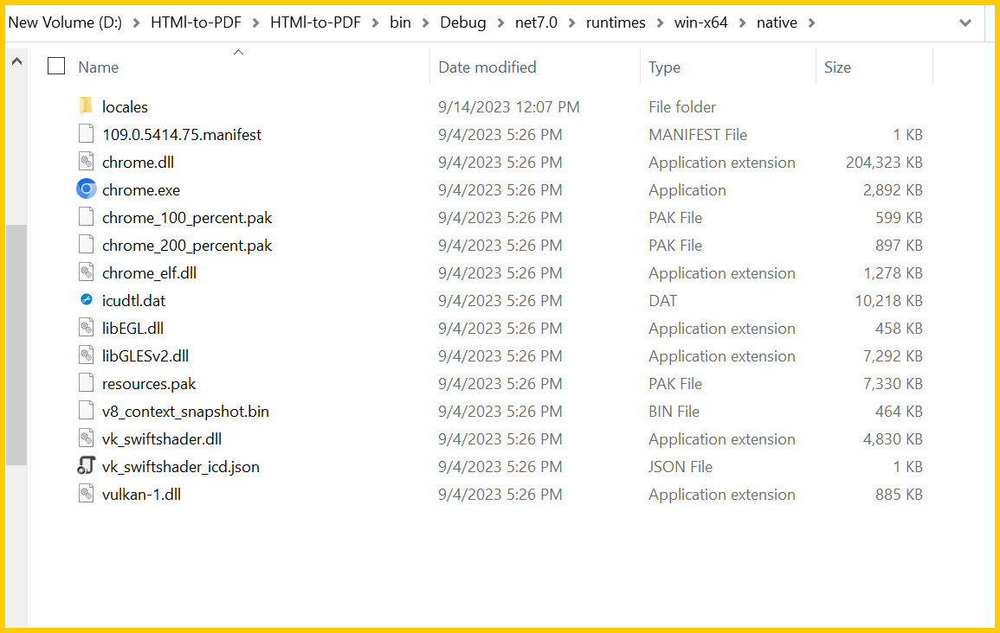
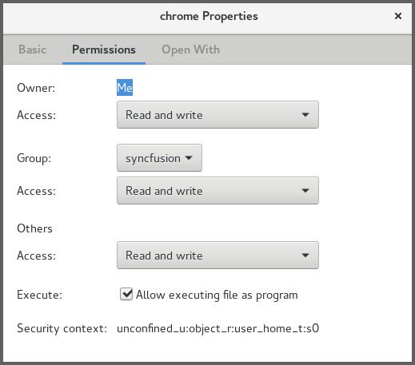
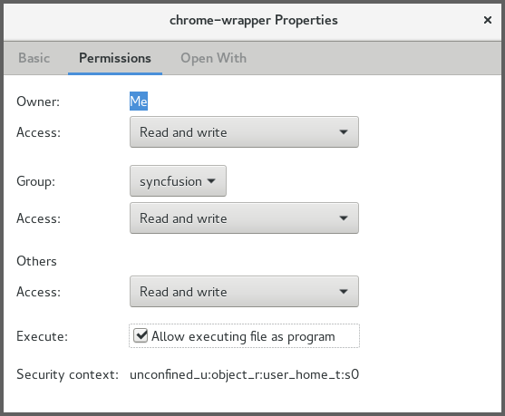
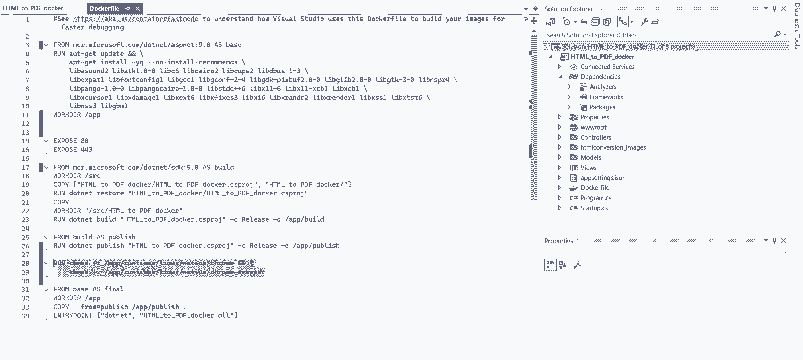
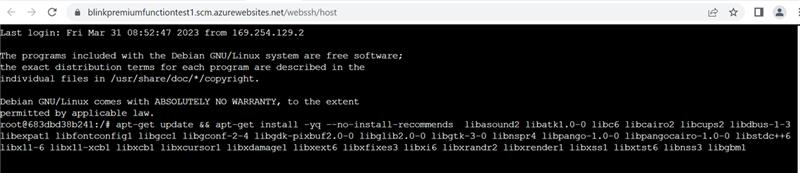
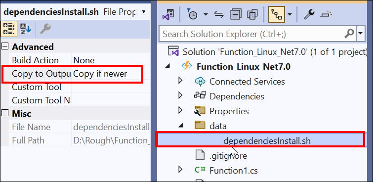

# Troubleshooting and FAQ

## Blink files are missing

<table>
<th style="font-size:14px" width="100px">Exception</th>
<th style="font-size:14px">Blink files are missing</th>
<tr>
<th style="font-size:14px" width="100px">Reason
</th>
<td>The exception may occur if the <i>'runtimes'</i> folder is not copied correctly from the NuGet folder.
</td>
</tr>
<tr>
<th style="font-size:14px" width="100px">Solution</th>
<td>
Ensure that the runtimes folder is copied properly to bin folder of the application from NuGet package location.
  
Please refer to the below screenshot,
  

  
(Or)
  
You can set the runtimes folder path explicitly in BlinkPath property in BlinkConverterSettings class.
  
Ex path: <i>C:\HtmlConversion\HTMl-to-PDF\HTMl-to-PDF\bin\Debug\net7.0\runtimes\win-x64\native\</i>
  



//Initialize the HTML to PDF converter.
HtmlToPdfConverter htmlConverter = new HtmlToPdfConverter();
BlinkConverterSettings blinkConverterSettings = new BlinkConverterSettings();
//Set Blink the binaries path.
blinkConverterSettings.BlinkPath = @"C:/HtmlConversion/BlinkBinaries/";
//Assign the Blink converter settings to HTML converter.
htmlConverter.ConverterSettings = blinkConverterSettings;
//Convert the URL to PDF document.
PdfDocument document = htmlConverter.Convert("https://www.syncfusion.com");
//Create a file stream to save the PDF document. 
FileStream fileStream = new FileStream("HTML-to-PDF.pdf", FileMode.CreateNew, FileAccess.ReadWrite);
//Save and close the PDF document.
document.Save(fileStream);
document.Close(true);



</td>
</tr>

</table>

## BlinkBinaries access is denied in server

<table>
<th style="font-size:14px" width="100px">Exception
</th>
<th style="font-size:14px">BlinkBinaries access is denied in server.
</th>

<tr>
<th style="font-size:14px" width="100px">Reason
</th>
<td>If the BlinkBinaries folder does not have elevated permission for the respective user, then the Blink HTML converter may throw this exception.
</td>
</tr>

<tr>
<th style="font-size:14px" width="100px">Solution
</th>
<td>You can add read/write/execute permission to for the BlinkBinaries folder for the respective user group.
</td>
</tr>
</table>

## Blink rendering engine only supported from .NET Framework 4.5

<table>

<th style="font-size:14px" width="100px">Exception
</th>
<th style="font-size:14px">Blink rendering engine only supported from .NET Framework 4.5.
</th>

<tr>
<th style="font-size:14px" width="100px">Reason
</th>
<td>HTML conversion using blink is only supported from .NET framework 4.5 or above. 
</td>
</tr>

<tr>
<th style="font-size:14px" width="100px">Solution
</th>
<td>The application should target .NET Framework 4.5 or above to convert the HTML using the Blink rendering engine. 
</td>
</tr>

</table>

## Failed to launch chromium: Running as root without --no-sandbox is not supported

<table>

<th style="font-size:14px" width="100px">Exception
</th>
<th style="font-size:14px">Failed to launch chromium: Running as root without --no-sandbox is not supported
</th>

<tr>
<th style="font-size:14px" width="100px">Reason
</th>
<td>The exception may occur in the Linux CentOS/Docker environment due to the Chrome browser unable to launch from sandbox mode in CentOS.
</td>
</tr>
<tr>

<th style="font-size:14px" width="100px">Solution
</th>
<td>To overcome the exception in the Linux CentOS/Docker environment, provide the execute permission for chrome and chrome-wrapper files inside the BlinkBinaries folder.
 
<b>Refer to the following screenshot:</b>
 

 

 
Also, please add the following command line arguments in our converter setting.
 
<table>
<tr>
<td>



//Set command line arguments to run without sandbox.
blinkConverterSettings.CommandLineArguments.Add("--no-sandbox");
blinkConverterSettings.CommandLineArguments.Add("--disable-setuid-sandbox");



</td>
</tr>
</table>
 
</td>
</tr>

</table>

## Failed to launch Base

<table>
<th style="font-size:14px" width="100px">Exception
</th>
<th style="font-size:14px">Failed to launch Base
</th>

<tr>
<th style="font-size:14px" width="100px">Reason
</th>
<td>The exception may occur due to missing of required dependent packages.
</td>
</tr>

<tr>
<th style="font-size:14px" width="100px">Solution
</th>
<td>To overcome the exception, you can ensure the required dependency in docker file.
</td>
</tr>
</table>

## Failed to launch chromium: Missing required dependent packages

<table>

<th style="font-size:14px" width="100px">Exception
</th>
<th style="font-size:14px">Failed to launch chromium: Missing required dependent packages
</th>

<tr>
<th style="font-size:14px" width="100px">Reason
</th>
<td>The required dependencies for the Chromium are not installed on the system.
</td>
</tr>

<tr>
<th style="font-size:14px" width="100px">Solution
</th>
<td>Ensure all required dependencies for the Chromium are installed on the system. This may include additional libraries or packages.
</td>
</tr>

</table>

## Access is denied in runtimes folders. Runtimes folder requires read/write/execute permission

<table>

<th style="font-size:14px" width="100px">Exception
</th>
<th style="font-size:14px">Access is denied in runtimes folders. Runtimes folder requires read/write/execute permission
</th>

<tr>
<th style="font-size:14px" width="100px">Reason
</th>
<td>The exception may occur if the runtimes folder is not accessed.
</td>
</tr>

<tr>
<th style="font-size:14px" width="100px">Solution
</th>
<td>To overcome the exception, you can add read, write, and execute permissions for the runtimes folder.
</td>
</tr>

</table>

## Access denied for specified temporary folder

<table>

<th style="font-size:14px" width="100px">Exception
</th>
<th style="font-size:14px">Access denied for specified temporary folder
</th>

<tr>
<th style="font-size:14px" width="100px">Reason
</th>
<td>The specified temporary folder path might be inaccessible.
</td>
</tr>

<tr>
<th style="font-size:14px" width="100px">Solution
</th>
<td>To overcome the exception, you can add read, write, and execute permissions for the temporary folder. Refer to the following code sample to set the temp folder.
  



BlinkConverterSettings settings = new BlinkConverterSettings();
settings.TempPath = "D://MyProject//bin";



</td>
</tr>

</table>

## The temporary folder does not have read permission

<table>
<th style="font-size:14px" width="100px">Exception
</th>
<th style="font-size:14px">The temporary folder does not have read permission
</th>

<tr>
<th style="font-size:14px" width="100px">Reason
</th>
<td>If the temporary folder does not have elevated permission for the respective user, then the Blink HTML converter may throw this exception.
</td>
</tr>

<tr>
<th style="font-size:14px" width="100px">Solution
</th>
<td>The Blink HTML converter has support for setting the temporary path. Using the <i>TempPath</i> property, you can set any folder path that has read/write/execute permission. Then, the converter uses this path for creating temporary files.

</td>
</tr>

</table>

## Blink converter may create PDF with blank pages

<table>
<th style="font-size:14px" width="100px">Issue
</th>
<th style="font-size:14px">Blink converter may create PDF with blank pages.
</th>

<tr>
<th style="font-size:14px" width="100px">Reason
</th>
<td>When the webpage (HTML) is not available or accessible.
</td>
</tr>

<tr>
<th style="font-size:14px" width="100px">Solution
</th>
<td>Please check the internet connection and the HTML page is available in the mentioned location.
  
Check the HTML file or URL is rendered properly in Chrome browser's print preview. 
</td>
</tr>
</table>

## Failed to launch chromium: Due to insufficient permission unable to launch the chromium process for conversion

<table>
<th style="font-size:14px" width="100px">Exception
</th>
<th style="font-size:14px">Failed to launch chromium: Due to insufficient permission unable to launch chromium process for conversion.
</th>

<tr>
<th style="font-size:14px" width="100px">Reason
</th>
<td>This exception might arise because the Blink binary files lack sufficient permissions to be launched from the specified BlinkPath location.
</td>
</tr>

<tr>
<th style="font-size:14px" width="100px">Solution
</th>
<td>To overcome this exception, you can provide an execute permission for chrome and chrome-wrapper files inside the runtimes/linux/native folder by using the docker command.
  

  



COPY . /app
WORKDIR /app

RUN chmod +x /app/runtimes/linux/native/chrome && \
    chmod +x /app/runtimes/linux/native/chrome-wrapper



</td>
</tr>
</table>

## Images or other contents in the HTML are missing in the resultant PDF document

<table>
<th style="font-size:14px" width="100px">Issue
</th>
<th style="font-size:14px">Images or other contents in the HTML are missing in the resultant PDF document.
</th>

<tr>
<th style="font-size:14px" width="100px">Reason
</th>
<td>The issue may be due to the slow internet connection or due to the behavior that the conversion completed before the page is loaded completely.
</td>
</tr>
<tr>
<th style="font-size:14px" width="100px">Solution
</th>
<td>To overcome this issue, add suitable delay for the conversion using the <a href="https://help.syncfusion.com/cr/document-processing/Syncfusion.HtmlConverter.BlinkConverterSettings.html#Syncfusion_HtmlConverter_BlinkConverterSettings_AdditionalDelay">AdditionalDelay</a> property of the HTMLConverter. 
  



BlinkConverterSettings settings = new BlinkConverterSettings();
settings.AdditionalDelay = 4000;



</td>
</tr>

<tr>
<th style="font-size:14px" width="100px">Reason
</th>
<td>While converting HTML string to PDF, the resources may be missed due to the invalid Base URL.
</td>
</tr>
<tr>
<th style="font-size:14px" width="100px">Solution
</th>
<td>Overcome this issue by passing the valid base URL (path of the resources) along with the HTML string.
</td>
</tr>

</table>

## Blink conversion failed in Azure app service (Windows)

<table>
<th style="font-size:14px" width="100px">Issue
</th>
<th style="font-size:14px">Blink conversion failed in Azure app service (Windows).
<i>“The process was terminated due to an unhandled exception”</i>
</th>

<tr>
<th style="font-size:14px" width="100px">Reason
</th>
<td>Blink rendering engine uses GDI calls for viewing and rendering the webpages. But Azure app service blocks GDI calls in Azure website environment. As azure website does not have the elevated permission and enough rights, so we could not launch the Chrome headless browser in Azure app service (Azure website and Azure function).
</td>
</tr>

<tr>
<th style="font-size:14px" width="100px">Solution
</th>
<td>You can convert HTML to PDF using the Blink rendering engine in Azure cloud service (which has the elevated permission and rights to access the GDI calls). 
Refer to this <a href="https://www.syncfusion.com/kb/10258/how-to-convert-html-to-pdf-in-azure-using-blink">link</a> for more information. 
</td>
</tr>
</table>

## Unable to convert unsecured https URL to PDF using Blink

<table>
<th style="font-size:14px" width="100px">Issue
</th>
<th style="font-size:14px">Unable to convert unsecured https URL to PDF using Blink.
</th>

<tr>
<th style="font-size:14px" width="100px">Reason
</th>
<td>The issue is happen due to invalid SSL certificate errors in unsecured sites.
</td>
</tr>

<tr>
<th style="font-size:14px" width="100px">Solution
</th>
<td>You can able to bypass the invalid SSL certificate errors using the command line arguments property of Blink converter settings.
  



BlinkConverterSettings settings = new BlinkConverterSettings();
settings.CommandLineArguments.Add("--ignore-certificate-errors");



</td>
</tr>
</table>

## Conversion failure in windows server 2012 R2

<table>
<th style="font-size:14px" width="100px">Issue
</th>
<th style="font-size:14px">Conversion failure in windows server 2012 R2.
</th>

<tr>
<th style="font-size:14px" width="100px">Reason
</th>
<td>The issue may happen due to windows server environment permission restriction.
</td>
</tr>

<tr>
<th style="font-size:14px" width="100px">Solution
</th>
<td>We can resolve this permission related failure in the Blink rendering engine using below command line arguments in our converter settings. 
  



//Set command line arguments to run without sandbox.
blinkConverterSettings.CommandLineArguments.Add("--no-sandbox");
blinkConverterSettings.CommandLineArguments.Add("--disable-setuid-sandbox");



</td>
</tr>
</table>

## Converting the HTML to PDF fails in x32 bit windows system environment

<table>
<th style="font-size:14px" width="100px">Exception
</th>
<th style="font-size:14px">Converting the HTML to PDF fails in x32 bit windows system environment.
</th>

<tr>
<th style="font-size:14px" width="100px">Reason
</th>
<td>The existing x64 bit Blink binaries windows are not compatible with x32 bit windows system architecture.
</td>
</tr>

<tr>
<th style="font-size:14px" width="100px">Solution
</th>
<td>To overcome this issue, we can use the x32 bit blink binaries. The x32 bit windows blink binaries are compatible with the x32 bit windows system environment. Please download the x32 bit blink binaries for windows <a href="https://www.syncfusion.com/downloads/support/directtrac/general/ze/BLINKB~1124441598">here</a> and replace these binaries in the existing x64 bit blink binaries folder.
</td>
</tr>
</table>

## ERROR:The specified module could not be found in windows server 2012 R2

<table>
<th style="font-size:14px" width="100px">Exception
</th>
<th style="font-size:14px">The specified module could not be found in windows server 2012 R2.
</th>

<tr>
<th style="font-size:14px" width="100px">Reason
</th>
<td>The issue happened because the Windows Server Essentials Media Pack was missing in the Windows server 2012 R2.
</td>
</tr>

<tr>
<th style="font-size:14px" width="100px">Solution
</th>
<td>We can resolve this issue by installing the Windows Server Essentials Media Pack.
To install the Windows Server Essentials Media Pack, first install the Windows Server Essentials. 
1.	Open the Server Manager in the Taskbar. 
2.	Click Manage in the Server Manager and select Add Roles and Features option. 
3.	Select the Role-based or feature-based installation option and click next. 
4.	In the left side menu, select server roles, then Windows Server Essentials Experience in the server roles and then click next. 
5.	Now, the Windows Server Essentials will be installed. 
6.	After successful installation, install the Windows Server Essentials Media Pack. 
Go to the <a href="https://www.microsoft.com/en-us/download/details.aspx?id=40837">official website</a> to download and Install the Windows Server Essentials Media Pack.  

{{'**Note:**'| markdownify }}This version is only applicable to Windows Server 2012 R2 Standard.

</td>
</tr>
</table>

## How to Exclude BlinkBinaries or Runtime Files in Build or Deployment

The runtime files, or blink binaries, will be copied into a bin or published folder while building and publishing the application.

By including the <b><ExcludeAssets>native</ExcludeAssets></b> option in the package reference of the csproj file, you can exclude the runtime files or blink binaries from being copied into the bin or publish folder while building and publishing the application. But you need to place the BlinkBinaries in the server disk and set the BlinkPath in the BlinkConverterSettings to perform the conversion. 

{{'**Note:**'| markdownify }}Using this approach, you can reduce the deployment size on your own servers.

Refer to the following package reference:

 

## HTML conversion support in Azure

<table>
	<tr>
		<th style="font-size:14px" colspan="2">HTML conversion support in Azure</th>
	</tr>
	<tr>
		<th style="font-size:14px">Azure App Service (Linux)</th>
		<td>Yes</td>
	</tr>
	<tr>
		<th style="font-size:14px">Azure Functions (Linux)</th>
		<td>Yes</td>
	</tr>
	<tr>
		<th style="font-size:14px">Azure Cloud Service</th>
		<td>Yes</td>
	</tr>
		<tr>
		<th style="font-size:14px">Azure App Service with Linux docker</th>
		<td>Yes</td>
	</tr>
</table>

## Failed to convert Webpage exception with Linux docker in Mac M1 machine.

<table>
<th style="font-size:14px" width="100px">Exception
</th>
<th style="font-size:14px">Failed to convert Webpage exception using Linux Docker in Mac M1 system environment.
</th>

<tr>
<th style="font-size:14px" width="100px">Reason
</th>
<td>The existing x64-bit Blink binaries for Linux are not compatible with the x64 ARM Mac M1 system architecture with Linux Docker.
</td>
</tr>

<tr>
<th style="font-size:14px" width="100px">Solution
</th>
<td>
To resolve this issue, we can install the chromium using the docker file and set the Blink Path to the location where chromium is installed.
  
Docker File:  




	FROM mcr.microsoft.com/dotnet/aspnet:7.0 AS base 

	RUN apt-get update && apt-get install -y \ 

    libasound2 libatk1.0-0 libc6 libcairo2 libcups2 libdbus-1-3 \ 

    libexpat1 libfontconfig1 libgcc1 libgconf-2-4 libgdk-pixbuf2.0-0 libglib2.0-0 libgtk-3-0 libnspr4 \ 

    libpango-1.0-0 libpangocairo-1.0-0 libstdc++6 libx11-6 libx11-xcb1 libxcb1 \ 

    libxcursor1 libxdamage1 libxext6 libxfixes3 libxi6 libxrandr2 libxrender1 libxss1 libxtst6 \ 

    libnss3 libgbm1 chromium 

	WORKDIR /app 

	EXPOSE 80 

	EXPOSE 443 





Code snippet:




	BlinkConverterSettings settings = new BlinkConverterSettings();  

	//To utilize the Blink binaries from the arm64-based chromium installed using the docker file, execute the following command.   

	settings.BlinkPath = @"/usr/lib/chromium/chromium";





</td>
</tr>
</table>

## Background color missing issue in HTML Header and Footer

<table>
<th style="font-size:14px" width="100px">Exception
</th>
<th style="font-size:14px">Background color missing issue in HTML Header and Footer.
</th>

<tr>
<th style="font-size:14px" width="100px">Reason
</th>
<td>We do not have the support for adding a custom CSS style in the HTML header and footer.
</td>
</tr>

<tr>
<th style="font-size:14px" width="100px">Solution
</th>
<td>
To resolve this issue, we can add inline styles in element. However, we have attached the sample and output documents for your reference.
  





	HtmlToPdfConverter htmlConverter = new HtmlToPdfConverter();
	//Initialize blink converter settings. 
	BlinkConverterSettings blinkConverterSettings = new BlinkConverterSettings();
	//Set the Blink viewport size.
	blinkConverterSettings.ViewPortSize = new Size(1280, 0);
	//Set the html margin-top value based on the html header height and margin-top value.
	blinkConverterSettings.Margin.Top = 70;
	//Set the html margin-bottom value based on the html footer height and margin-bottom value.
	blinkConverterSettings.Margin.Bottom = 40;
	//Set the custom HTML header to add at the top of each page.
	blinkConverterSettings.HtmlHeader = " 
HTML Header
";
	//Set the custom HTML footer to add at the bottom of each page.
	blinkConverterSettings.HtmlFooter = " 
HTML Footer
";
	//Assign Blink converter settings to the HTML converter.
	htmlConverter.ConverterSettings = blinkConverterSettings;
	//Convert the URL to a PDF document.
	PdfDocument document = htmlConverter.Convert("
Hello World
",string.Empty);
	//Create a filestream.
	FileStream fileStream = new FileStream("Output.pdf", FileMode.Create, FileAccess.ReadWrite);
	//Save and close a PDF document.
	document.Save(fileStream);
	document.Close(true);





You can downloaded a complete working sample from [GitHub](https://github.com/SyncfusionExamples/PDF-Examples/tree/master/HTML%20to%20PDF/Blink/HTML-Footer-Background-Colour/.NET).

</td>
</tr>
</table>

## Zombie process are not closed by default from chrome headless in Linux platform

 The zombie process are not closed by default from chrome headless in Linux. However, We can resolve the zombie process issue by using the below command line arguments in converter settings.





		//Set command line arguments to run without the sandbox.

		settings.CommandLineArguments.Add("--no-sandbox");

		settings.CommandLineArguments.Add("--disable-setuid-sandbox");

		settings.CommandLineArguments.Add("--no-zygote");

		settings.CommandLineArguments.Add("--disable-dev-shm-usage");

		settings.CommandLineArguments.Add("--single-process");





## Failed to launch chromium: Missing required dependent packages issue occurs in Azure function Linux with premium plans.

<table>
<th style="font-size:14px" width="100px">Exception</th>
<th style="font-size:14px">Failed to launch chromium: Missing required dependent packages issue occurs in Azure function Linux with premium plans.
</th>
<tr>
<th style="font-size:14px" width="100px">Reason
</th>
<td>The reported issue occurs due to missing of required Linux dependencies in Azure function to perform the conversion in premium plans (such as Ep1)
</td>
</tr>
<tr>
<th style="font-size:14px" width="100px">Solution</th>
<td>
To overcome this issue by installing the Linux dependencies package in SSH window. Please refer the below commands and screenshot,





apt-get update && apt-get install -yq --no-install-recommends libasound2 libatk1.0-0 libc6 libcairo2 libcups2 libdbus-1-3 libexpat1 libfontconfig1 libgcc1 libgconf-2-4 libgdk-pixbuf2.0-0 libglib2.0-0 libgtk-3-0 libnspr4 libpango-1.0-0 libpangocairo-1.0-0 libstdc++6 libx11-6 libx11-xcb1 libxcb1 libxcursor1 libxdamage1 libxext6 libxfixes3 libxi6 libxrandr2 libxrender1 libxss1 libxtst6 libnss3 libgbm1



  
Please refer to the below screenshot,
  

 
  
(Or)
  
We can install the required dependencies using the dependencies vis shell script. Please find the below.
  
 
  
code snippet:
  



	private static void InstallLinuxPackages(FileInfo functionAppDirectory)
	{
		if (!RuntimeInformation.IsOSPlatform(OSPlatform.Linux))
		{
			return;
		}
		FileAccessPermissions ExecutableFilePermissions = FileAccessPermissions.UserRead | FileAccessPermissions.UserWrite | FileAccessPermissions.UserExecute |
		FileAccessPermissions.GroupRead | FileAccessPermissions.GroupExecute | FileAccessPermissions.OtherRead | FileAccessPermissions.OtherExecute;
		//Install the dependencies packages for HTML to PDF conversion in Linux
		string shellFilePath = Path.Combine(functionAppDirectory.Directory.Parent.FullName, @"wwwroot/data");
		string tempBlinkDir = Path.GetTempPath();
		string dependenciesPath = Path.Combine(tempBlinkDir, "dependenciesInstall.sh");
		if (!File.Exists(dependenciesPath))
		{
			CopyFilesRecursively(shellFilePath, tempBlinkDir);
			var execPath = Path.Combine(tempBlinkDir, "dependenciesInstall.sh");
			if (File.Exists(execPath))
			{
				var code = Function1.Chmod(execPath, ExecutableFilePermissions);
				if (code != 0)
				{
					throw new Exception("Chmod operation failed");
				}
			}
			Process process = new Process
			{
				StartInfo = new ProcessStartInfo
				{
					FileName = "/bin/bash",
					Arguments = "-c " + execPath,
					CreateNoWindow = true,
					UseShellExecute = false,
				}
			};
			process.Start();
			process.WaitForExit();
		}
	}



</td>
</tr>

</table>

## Failed to load Chrome DLL exception occurs on Windows 7/8 and Windows Server 2008/2012 machines

<table>
<th style="font-size:14px" width="100px">Exception</th>
<th style="font-size:14px">Failed to load Chrome DLL exception occurs on Windows 7/8 and Windows Server 2008/2012 machines.
</th>
<tr>
<th style="font-size:14px" width="100px">Reason
</th>
<td>The reported issue occurs due to an unsupported OS platform with the latest binaries.
</td>
</tr>
<tr>
<th style="font-size:14px" width="100px">Solution</th>
<td>
If you are using Windows 7/8 or Windows Server 2008/2012, please use Chromium version 109 instead of the newer versions. Chromium has discontinued support for these operating systems, and the last compatible version is 109.
  

Please refer to the below thread for more information,
<a href="https://support.google.com/chrome/thread/185534985">https://support.google.com/chrome/thread/185534985</a>

 

Blink binaries (Version 109.0.5414.75),
<a href="https://www.syncfusion.com/downloads/support/directtrac/general/ze/BlinkBinaries_109.0.5414.7560606898">https://www.syncfusion.com/downloads/support/directtrac/general/ze/BlinkBinaries_109.0.5414.7560606898</a>

</td>
</tr>

</table>

## There was an error opening this document. This file is already open or in use by another application.

<table>
<th style="font-size:14px" width="100px">Issue</th>
<th style="font-size:14px">There was an error opening this document. This file is already open or in use by another application.
</th>
<tr>
<th style="font-size:14px" width="100px">Reason
</th>
<td>The reported issue occurs due to the document or file not being properly disposed or closed, leading to conflicts when attempting to access it again.
</td>
</tr>
<tr>
<th style="font-size:14px" width="100px">Solution</th>
<td>

We can resolve the reported issue by using the FileStream within the "using" block.



	using (FileStream fs = new FileStream("path_to_file", FileMode.Open))
	{
    	// Use the file here
	} // File stream is automatically closed and disposed




Or

Dispose of the FileStream at the end of the process and ensure that the file or document is not already open in another application.



	
	PdfDocument document = htmlConverter.Convert(");

	FileStream fileStream = new FileStream(baseUrl+ "Bill_PDF_04_16_24.pdf", FileMode.CreateNew, FileAccess.ReadWrite);

	//Save and close the PDF document.

	document.Save(fileStream);

	document.Close(true);

	document.Dispose();

	fileStream.Dispose();



</td>
</tr>

</table>

## HTML to PDF Performance Benchmarks:

We have prepared the following benchmark details for converting HTML to PDF, using the specified machine configuration and input HTML files:

<h2>Environment Details:</h2>
 

OS Edition          : Windows 11 Enterprise

Version               : 22H2

Processor           : 11th Gen Intel(R) Core(TM) i5-1135G7 @ 2.40GHz   2.42 GHz

Installed RAM    : 20.0 GB (19.7 GB usable)

System type       : 64-bit operating system, x64-based processor
 

<h2>Example Application:</h2>

The benchmark details were obtained using the [Syncfusion.HtmlToPdfConverter.Net.Windows](https://www.nuget.org/packages/Syncfusion.HtmlToPdfConverter.Net.Windows) package. You can refer to the following sample, as well as the input and output files used:

Sample link        : <a href="https://www.syncfusion.com/downloads/support/directtrac/general/ze/HTMLToPDF_Demo_2-1367619702">https://www.syncfusion.com/downloads/support/directtrac/general/ze/HTMLToPDF_Demo_2-1367619702</a>

Input Html files         : <a href="https://www.syncfusion.com/downloads/support/directtrac/general/ze/Input1125518413">https://www.syncfusion.com/downloads/support/directtrac/general/ze/Input1125518413</a>

Output PDF files        : <a href="https://www.syncfusion.com/downloads/support/directtrac/general/ze/OutputDocuments_1715564825">https://www.syncfusion.com/downloads/support/directtrac/general/ze/OutputDocuments_1715564825</a>

<h2>Results:</h2>

<table border="1">
<th style="font-size:14px" width="100px">Input Page count</th>
<th style="font-size:14px">Conversion time

(Avg value of 5 conversions)
</th>
<th style="font-size:14px">Process Memory and CPU usage
</th>
<tr>
    <td>10+ Pages</td>
    <td>2.78 seconds</td>
    <td>	
Memory usage: 318 MB

CPU usage: 10%</td>
</tr>
<tr>
    <td>100+ pages</td>
    <td>3.65 seconds</td>
    <td>Memory usage: 367 MB

CPU usage: 14%</td>
</tr>
<tr>
    <td>1000+ pages</td>
    <td>6.72 seconds</td>
    <td>Memory usage: 813 MB

CPU usage: 27%</td>
</tr>
<tr>
    <td>10 documents with 100+ pages in a loop</td>
    <td>30.52 seconds</td>
    <td>	
Memory usage: 663 MB

CPU usage: 15%</td>
</tr>
<tr>
    <td>10 documents with 1000+ pages in a loop</td>
    <td>1 minute 10 seconds</td>
    <td>	
Memory usage: 2.2 GB

CPU usage: 64%</td>
</tr>
</table>

N> Note: The performance metrics were recorded on a freshly configured machine. Speed and memory usage may vary if the machine is running other processes. Additionally, performance can be affected by:

* External resources loaded in the HTML (such as images, scripts, and styles)
* Network speed for online URL conversions
* Hardware resources (CPU and memory)

## Custom fonts are not rendered in Azure App Service and Function Linux using Blink.

<table>
<th style="font-size:14px" width="100px">Issue</th>
<th style="font-size:14px">Custom fonts are not rendered in Azure App Service and Function Linux using Blink.
</th>
<tr>
<th style="font-size:14px" width="100px">Reason
</th>
<td>We are internally using the Blink rendering engine to convert HTML to PDF document. Due to the sandbox GDI limitation on Azure App services and Function, custom fonts are not rendered (system-installed font is used instead) because of sandbox GDI API limitations that present even in VM-based Azure Apps plans. So, that the converter will automatically renders with default font.

Refer below link for more information. This is a limitation of Azure cloud environment.
[https://github.com/projectkudu/kudu/wiki/Azure-Web-App-sandbox](https://github.com/projectkudu/kudu/wiki/Azure-Web-App-sandbox)

</td>
</tr>
<tr>
<th style="font-size:14px" width="100px">Solution</th>
<td>
we can overcome this issue by using Azure cloud service which has the elevated access permissions. If it is possible to use Azure cloud service API for converting HTML to PDF. Please refer below link for converting HTML to PDF in Azure cloud service. The custom font may work in Azure cloud service/Azure VM, we ensured this by creating simple sample in Azure VM and the font is working properly. If possible, kindly use the Azure cloud service with VM to resolve the reported issue. 

KB: [https://www.syncfusion.com/kb/10258/how-to-convert-html-to-pdf-in-azure-using-blink](https://www.syncfusion.com/kb/10258/how-to-convert-html-to-pdf-in-azure-using-blink)
</td>
</tr>

</table>

## Conversion failed in Azure App Service when pushing via Azure Pipeline using the WebKit rendering engine.

<table>
<th style="font-size:14px" width="100px">Issue</th>
<th style="font-size:14px">Conversion failed in Azure App Service when pushing via Azure Pipeline using the WebKit rendering engine.
</th>
<tr>
<th style="font-size:14px" width="100px">Reason
</th>
<td>	
The problem that was reported may be caused by using the Zip deploy method to publish the project. When the project is pushed, it will automatically utilize the zip deploy method within the Azure pipeline.

</td>
</tr>
<tr>
<th style="font-size:14px" width="100px">Solution</th>
<td>
We can resolve the reported issue by changing the deployment method to web deploy in the yml file. Please refer to the code snippet below.




	trigger:

	- main

	pool:

	vmImage: windows-latest

	variables:

	buildConfiguration: 'Release'

	steps:

	- script: dotnet build --configuration $(buildConfiguration)

	displayName: 'dotnet build $(buildConfiguration)'

	- task: DotNetCoreCLI@2

	inputs:

	command: 'publish'

	publishWebProjects: true

	arguments: '--configuration $(buildConfiguration)'

	zipAfterPublish: true

	- task: AzureRmWebAppDeployment@4

	inputs:

	ConnectionType: 'AzureRM'

	azureSubscription: 'htmlconnection'

	appType: 'webApp'

	WebAppName: 'pipelineHtmlToPDF'

	packageForLinux: '$(System.DefaultWorkingDirectory)/**/*.zip'

	enableCustomDeployment: true

	DeploymentType: 'webDeploy'

	


</td>
</tr>

</table>

## Due to insufficient permissions, we are unable to launch the Chromium process for conversion in Azure Function .NET 8.0 with premium plans.

The problem is limited to Azure Functions with premium plans in Net 8.0 version. To fix this, we can either manually install the necessary Chromium dependencies in the SSH portal or include the runtimes folder (Blink binaries) in the project location.

Prerequisites dependencies:




	apt-get update && apt-get install -yq --no-install-recommends libasound2 libatk1.0-0 libc6 libcairo2 libcups2 libdbus-1-3 libexpat1 libfontconfig1 libgcc1 libgconf-2-4 libgdk-pixbuf2.0-0 libglib2.0-0 libgtk-3-0 libnspr4 libpango-1.0-0 libpangocairo-1.0-0 libstdc++6 libx11-6 libx11-xcb1 libxcb1 libxcursor1 libxdamage1 libxext6 libxfixes3 libxi6 libxrandr2 libxrender1 libxss1 libxtst6 libnss3 libgbm1




N> Note: We have option to exclude the default Blink binaries from the installation package. This will reduce the size of your deployment package in azure. Please refer to the code snippet below.




	<PackageReference Include="Syncfusion.HtmlToPdfConverter.Net.Linux" Version="25.1.35" >

	<ExcludeAssets>native</ExcludeAssets>

	</PackageReference>


