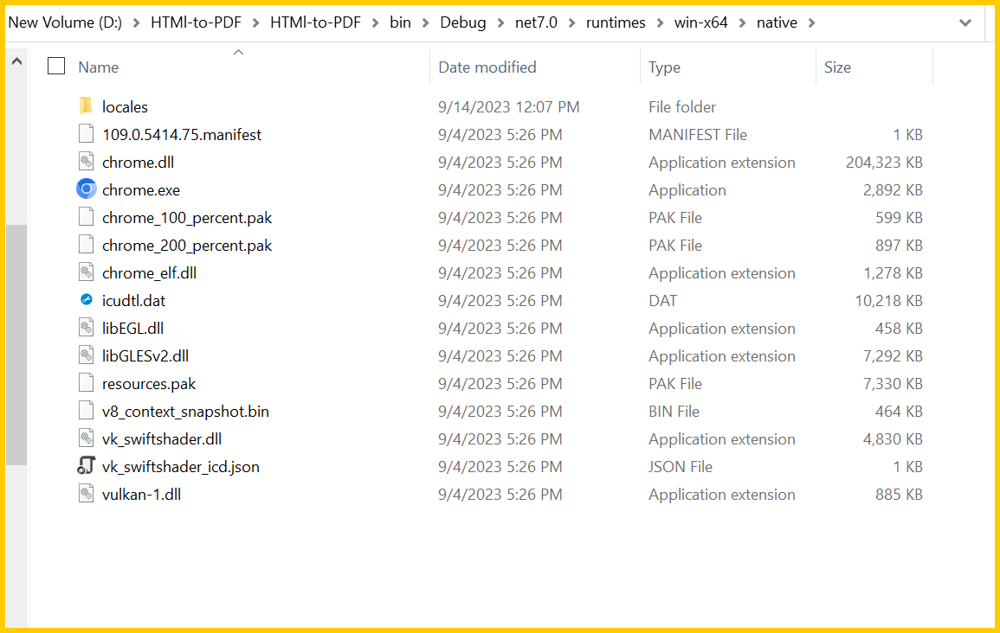
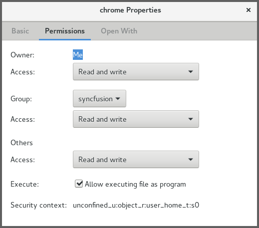
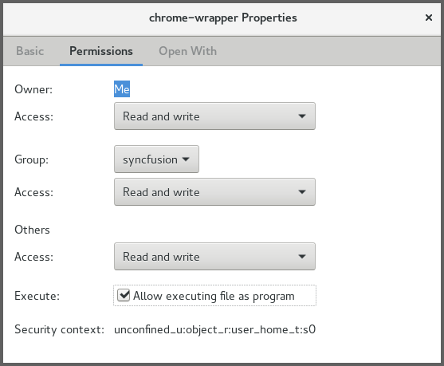
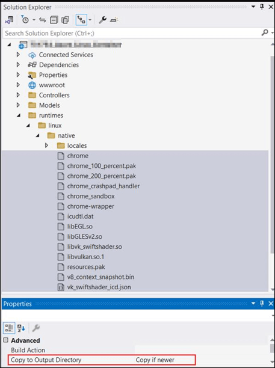
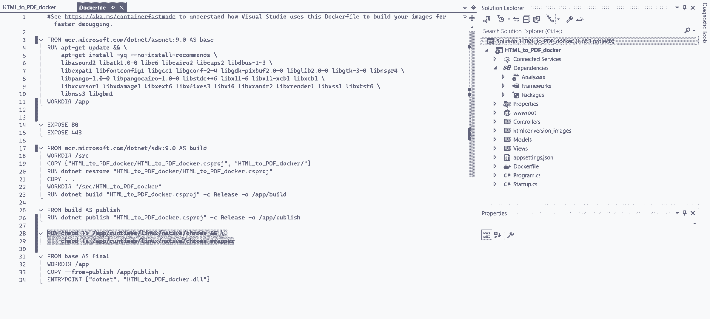
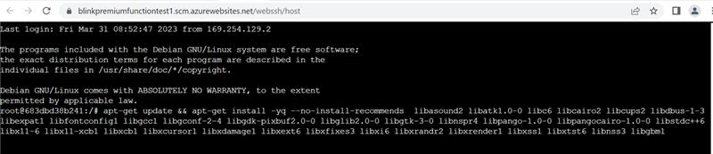
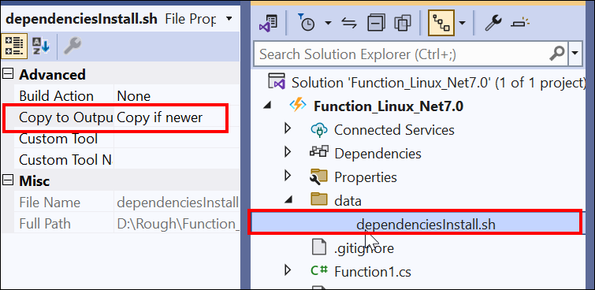
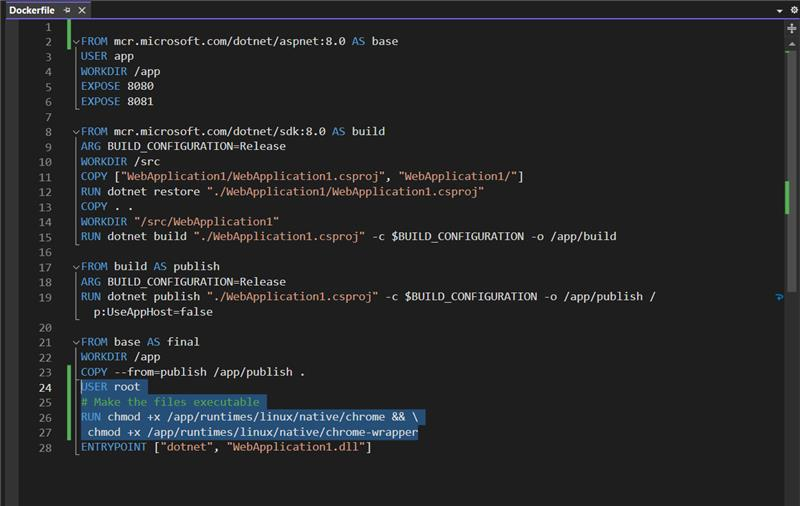
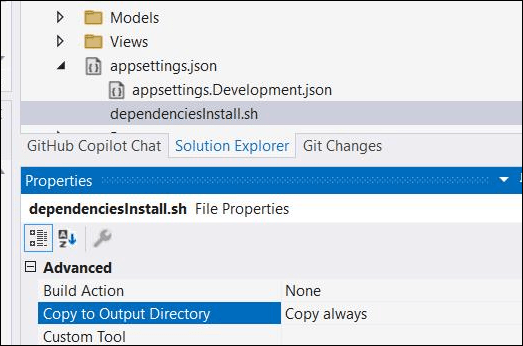
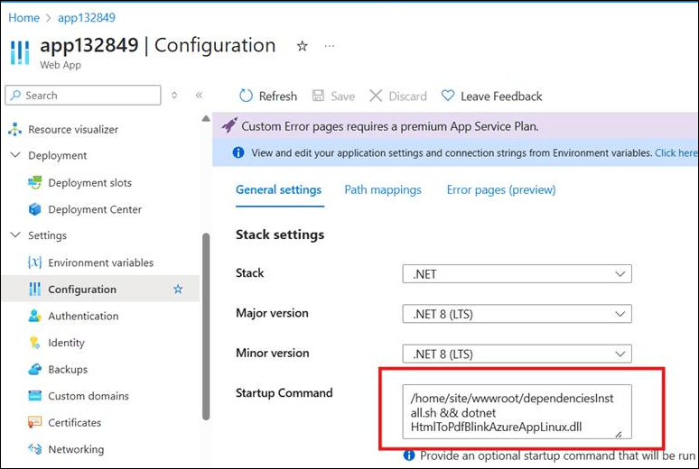

# Troubleshooting and FAQ

## Blink files are missing

<table>
<th style="font-size:14px" width="100px">Exception</th>
<th style="font-size:14px">Blink files are missing</th>
<tr>
<th style="font-size:14px" width="100px">Reason
</th>
<td>The exception may occur if the <i>runtimes</i> folder is not copied correctly from the NuGet folder.
</td>
</tr>
<tr>
<th style="font-size:14px" width="100px">Solution</th>
<td>
Ensure that the runtimes folder is copied properly to the <i>bin</i> folder of the application from the NuGet package location.
  
Please refer to the screenshot below:
  

  
(Or)
  
You can set the runtimes folder path explicitly using the <b>BlinkPath</b> property in the <b>BlinkConverterSettings</b> class.
  
Example path: <i>C:\HtmlConversion\HTMl-to-PDF\HTMl-to-PDF\bin\Debug\net7.0\runtimes\win-x64\native\</i>
  



//Initialize the HTML to PDF converter.
HtmlToPdfConverter htmlConverter = new HtmlToPdfConverter();
BlinkConverterSettings blinkConverterSettings = new BlinkConverterSettings();
//Set the Blink binaries path.
blinkConverterSettings.BlinkPath = @"C:/HtmlConversion/BlinkBinaries/";
//Assign the Blink converter settings to HTML converter.
htmlConverter.ConverterSettings = blinkConverterSettings;
//Convert the URL to PDF document.
PdfDocument document = htmlConverter.Convert("https://www.syncfusion.com");

//Save and close the PDF document.
document.Save("Output.pdf");
document.Close(true);



</td>
</tr>

</table>

## BlinkBinaries access is denied on the server

<table>
<th style="font-size:14px" width="100px">Exception
</th>
<th style="font-size:14px">BlinkBinaries access is denied on the server.
</th>

<tr>
<th style="font-size:14px" width="100px">Reason
</th>
<td>If the BlinkBinaries folder does not have elevated permission for the respective user, the Blink HTML converter may throw this exception.
</td>
</tr>

<tr>
<th style="font-size:14px" width="100px">Solution
</th>
<td>You can add read/write/execute permission for the BlinkBinaries folder to the respective user group.
</td>
</tr>
</table>

## Blink rendering engine is only supported from .NET Framework 4.5

<table>

<th style="font-size:14px" width="100px">Exception
</th>
<th style="font-size:14px">Blink rendering engine is only supported from .NET Framework 4.5.
</th>

<tr>
<th style="font-size:14px" width="100px">Reason
</th>
<td>HTML conversion using Blink is only supported from .NET Framework 4.5 or above.
</td>
</tr>

<tr>
<th style="font-size:14px" width="100px">Solution
</th>
<td>The application should target .NET Framework 4.5 or above to convert HTML using the Blink rendering engine.
</td>
</tr>

</table>

## Failed to launch chromium: Running as root without --no-sandbox is not supported

<table>

<th style="font-size:14px" width="100px">Exception
</th>
<th style="font-size:14px">Failed to launch chromium: Running as root without --no-sandbox is not supported
</th>

<tr>
<th style="font-size:14px" width="100px">Reason
</th>
<td>This exception may occur in the Linux CentOS/Docker environment because the Chrome browser is unable to launch from sandbox mode in CentOS.
</td>
</tr>
<tr>

<th style="font-size:14px" width="100px">Solution
</th>
<td>To overcome this exception in the Linux CentOS/Docker environment, provide execute permission for the <i>chrome</i> and <i>chrome-wrapper</i> files inside the BlinkBinaries folder.
 
<b>Refer to the following screenshots:</b>
 

 

 
Also, add the following command line arguments in the converter settings.
 
<table>
<tr>
<td>



//Set command line arguments to run without sandbox.
blinkConverterSettings.CommandLineArguments.Add("--no-sandbox");
blinkConverterSettings.CommandLineArguments.Add("--disable-setuid-sandbox");



</td>
</tr>
</table>
 
</td>
</tr>

</table>

## Failed to launch Base

<table>
<th style="font-size:14px" width="100px">Exception
</th>
<th style="font-size:14px">Failed to launch Base
</th>

<tr>
<th style="font-size:14px" width="100px">Reason
</th>
<td>This exception may occur due to missing required dependent packages.
</td>
</tr>

<tr>
<th style="font-size:14px" width="100px">Solution
</th>
<td>To overcome this exception, ensure the required dependencies are installed in the Docker file.
</td>
</tr>
</table>

## Failed to launch chromium: Missing required dependent packages

<table>
<th style="font-size:14px" width="100px">Exception
</th>
<th style="font-size:14px">Failed to launch chromium: Missing required dependent packages
</th>
<tr>
<th style="font-size:14px" width="100px">Reason
</th>
<td>The required dependencies for Chromium are not installed on the system.
</td>
</tr>
<tr>
<th style="font-size:14px" width="100px">Solution
</th>
<td>Ensure all required dependencies for Chromium are installed on the system. This may include additional libraries or packages. Here's how you can modify your Docker file:

FROM your-base-image
RUN apt-get update && apt-get install -yq --no-install-recommends \
    libasound2 \
    libatk1.0-0 \
    libc6 \
    libcairo2 \
    libcups2 \
    libdbus-1-3 \
    libexpat1 \
    libfontconfig1 \
    libgcc1 \
    libgconf-2-4 \
    libgdk-pixbuf2.0-0 \
    libglib2.0-0 \
    libgtk-3-0 \
    libnspr4 \
    libpango-1.0-0 \
    libpangext6 \
    libxfixes3 \
    libxi6 \
    libxrandr2 \
    libxrender1 \
    libxss1 \
    libxtst6 \
    libnss3 \
    libgbm1 \
 && apt-get clean \
 && rm -rf /var/lib/apt/lists/*

</td>
</tr>
</table>

## Application Crash in Syncfusion 29.X.X Due to Missing `locales` Folder Required by Chromium During HTML Rendering or Conversion

<table>
<th style="font-size:14px" width="100px">Exception
</th>
<th style="font-size:14px">Application crashes in Syncfusion libraries version 29.2.11 because Chromium fails to find the required `locales` folder in the published output directory, leading to runtime errors when launching HTML rendering or conversion.
</th>

<tr>
<th style="font-size:14px" width="100px">Reason
</th>
<td>Starting with Syncfusion package version 29.X.X, Chromium was updated to 133.x.x, which now requires the `locales` directory to be present at runtime. However, when publishing a .NET application with the `linux-x64` runtime identifier, only files are copied to the root output folder and the folder structure including `locales` is omitted. As a result, Chromium cannot locate the required `locales` directory, triggering a runtime exception during HTML rendering or conversion.
</td>
</tr>

<tr>
<th style="font-size:14px" width="100px">Solution
</th>
<td>
There are three workaround solutions to overcome this issue.
 
<b>Step 1:</b> Using the <b>Portable</b> Runtime Identifier ensures that the runtime files are copied into the correct folder structure, allowing the conversion process to complete without any issues. 
<b>Step 2:</b> Copy the <b>runtimes</b> folder into the project directory, placing it at the same level as the <b>.csproj</b> file. Additionally, ensure that all files within the runtimes folder have their <b>Copy to Output Directory</b> property set to <b>Copy if newer</b>. Please refer to the screenshot below for guidance. 
 

<b>Step 3:</b> If manually copying the files does not meet your requirements, apply the following code changes in the <b>.csproj</b> file and update the publish profile. This ensures the necessary files are copied automatically during the publishing process. 
Add the following code snippet to the <b>.pubxml</b> file to apply the necessary configuration. 



<PropertyGroup>
 <ErrorOnDuplicatePublishOutputFiles>false</ErrorOnDuplicatePublishOutputFiles>
</PropertyGroup>



Add the following code to the <b>.csproj</b> file to ensure the <b>locales</b> folder is copied to the publish directory during the build process. 



<ItemGroup>
	<None Include="bin\Release\net9.0\runtimes\linux\native\locales\**\*"
		CopyToOutputDirectory="Always"
		Link="runtimes/linux/native/locales/%(RecursiveDir)%(Filename)%(Extension)"/>
</ItemGroup>



</td>
</tr>
</table>

## Access is denied in runtimes folders. Runtimes folder requires read/write/execute permission

<table>

<th style="font-size:14px" width="100px">Exception
</th>
<th style="font-size:14px">Access is denied in runtimes folders. Runtimes folder requires read/write/execute permission
</th>

<tr>
<th style="font-size:14px" width="100px">Reason
</th>
<td>The exception may occur if the runtimes folder cannot be accessed.
</td>
</tr>

<tr>
<th style="font-size:14px" width="100px">Solution
</th>
<td>To overcome this exception, add read, write, and execute permissions for the runtimes folder.
</td>
</tr>

</table>

## Access denied for specified temporary folder

<table>

<th style="font-size:14px" width="100px">Exception
</th>
<th style="font-size:14px">Access denied for specified temporary folder
</th>

<tr>
<th style="font-size:14px" width="100px">Reason
</th>
<td>The specified temporary folder path might be inaccessible.
</td>
</tr>

<tr>
<th style="font-size:14px" width="100px">Solution
</th>
<td>To overcome this exception, add read, write, and execute permissions for the temporary folder. Refer to the following code sample to set the temp folder.
  



BlinkConverterSettings settings = new BlinkConverterSettings();
settings.TempPath = "D://MyProject//bin";



</td>
</tr>

</table>

## The temporary folder does not have read permission

<table>
<th style="font-size:14px" width="100px">Exception
</th>
<th style="font-size:14px">The temporary folder does not have read permission
</th>

<tr>
<th style="font-size:14px" width="100px">Reason
</th>
<td>If the temporary folder does not have elevated permission for the respective user, the Blink HTML converter may throw this exception.
</td>
</tr>

<tr>
<th style="font-size:14px" width="100px">Solution
</th>
<td>The Blink HTML converter supports setting the temporary path. Using the <i>TempPath</i> property, you can set any folder path that has read/write/execute permission. Then, the converter uses this path for creating temporary files.

</td>
</tr>

</table>

## Blink converter may create PDF with blank pages

<table>
<th style="font-size:14px" width="100px">Issue
</th>
<th style="font-size:14px">Blink converter may create PDF with blank pages.
</th>

<tr>
<th style="font-size:14px" width="100px">Reason
</th>
<td>The webpage (HTML) is not available or accessible.
</td>
</tr>

<tr>
<th style="font-size:14px" width="100px">Solution
</th>
<td>Check the internet connection and ensure the HTML page is available at the specified location.
  
Also, verify that the HTML file or URL is rendered properly in the Chrome browser's print preview.
</td>
</tr>
</table>

## Failed to launch chromium: Due to insufficient permission unable to launch the chromium process for conversion

<table>
<th style="font-size:14px" width="100px">Exception
</th>
<th style="font-size:14px">Failed to launch chromium: Due to insufficient permission unable to launch chromium process for conversion.
</th>

<tr>
<th style="font-size:14px" width="100px">Reason
</th>
<td>This exception might arise because the Blink binary files lack sufficient permissions to be launched from the specified BlinkPath location.
</td>
</tr>

<tr>
<th style="font-size:14px" width="100px">Solution
</th>
<td>To overcome this exception, provide execute permission for the <i>chrome</i> and <i>chrome-wrapper</i> files inside the <i>runtimes/linux/native</i> folder using the Docker command.
  

  



RUN chmod +x /app/runtimes/linux/native/chrome && \
    chmod +x /app/runtimes/linux/native/chrome-wrapper



</td>
</tr>
</table>

## Images or other contents in the HTML are missing in the resultant PDF document

<table>
<th style="font-size:14px" width="100px">Issue
</th>
<th style="font-size:14px">Images or other contents in the HTML are missing in the resultant PDF document.
</th>

<tr>
<th style="font-size:14px" width="100px">Reason
</th>
<td>The issue may be due to a slow internet connection, or because the conversion completed before the page was loaded completely.
</td>
</tr>
<tr>
<th style="font-size:14px" width="100px">Solution
</th>
<td>To overcome this issue, add a suitable delay for the conversion using the <a href="https://help.syncfusion.com/cr/document-processing/Syncfusion.HtmlConverter.BlinkConverterSettings.html#Syncfusion_HtmlConverter_BlinkConverterSettings_AdditionalDelay">AdditionalDelay</a> property of the HTMLConverter.
  



BlinkConverterSettings settings = new BlinkConverterSettings();
settings.AdditionalDelay = 4000;



</td>
</tr>

<tr>
<th style="font-size:14px" width="100px">Reason
</th>
<td>While converting an HTML string to PDF, the resources may be missed due to an invalid base URL.
</td>
</tr>
<tr>
<th style="font-size:14px" width="100px">Solution
</th>
<td>Overcome this issue by passing a valid base URL (path of the resources) along with the HTML string.
</td>
</tr>

</table>

## Blink conversion failed in Azure app service (Windows)

<table>
<th style="font-size:14px" width="100px">Issue
</th>
<th style="font-size:14px">Blink conversion failed in Azure app service (Windows).
<i>"The process was terminated due to an unhandled exception"</i>
</th>

<tr>
<th style="font-size:14px" width="100px">Reason
</th>
<td>The Blink rendering engine uses GDI calls for viewing and rendering webpages. However, Azure app service blocks GDI calls in the Azure website environment. Since the Azure website does not have elevated permissions or sufficient rights, the Chrome headless browser cannot be launched in Azure app service (Azure website and Azure function).
</td>
</tr>

<tr>
<th style="font-size:14px" width="100px">Solution
</th>
<td>You can convert HTML to PDF using the Blink rendering engine in Azure cloud service, which has elevated permissions and rights to access GDI calls.
Refer to this <a href="https://www.syncfusion.com/kb/10258/how-to-convert-html-to-pdf-in-azure-using-blink">link</a> for more information.
</td>
</tr>
</table>

## HTML to PDF conversion fails after deploying to Azure Function Linux Flex Consumption Plan

<table>
<th style="font-size:14px" width="100px">Issue
</th>
<th style="font-size:14px">HTML to PDF conversion fails after deploying to Azure Function Linux Flex Consumption Plan
</th>
<tr>
<th style="font-size:14px" width="100px">Reason
</th>
<td>The Syncfusion HTML-to-PDF converter internally uses the <b>Blink rendering engine</b>, which relies on a <b>headless Chromium browser</b> to render HTML content. On <b>Linux environments</b>, Chromium requires several native dependencies to launch successfully. 

In the <b>Azure Function Linux Flex Consumption Plan</b>, these dependencies cannot be installed due to the following limitations:

* No SSH access to manually install packages. 
* Shell script installation attempts fail due to <b>permission restrictions</b>, even when permissions are explicitly set. 

As a result, the Blink-based converter cannot initialize Chromium, leading to failure in HTML-to-PDF conversion.
</td>
</tr>

<tr>
<th style="font-size:14px" width="100px">Solution
</th>
<td>To enable HTML-to-PDF conversion using Blink in Azure Functions: 

* Do not use the Flex Consumption Plan for Linux-based Azure Functions. 
* Instead, use one of the following: 
1.Premium Plan 
2.Standard Consumption Plan 
These plans provide the necessary environment and permissions to support Chromium and its dependencies, allowing the Blink engine to function correctly. 
</td>
</tr>
</table>

## Unable to convert unsecured https URL to PDF using Blink

<table>
<th style="font-size:14px" width="100px">Issue
</th>
<th style="font-size:14px">Unable to convert unsecured https URL to PDF using Blink.
</th>

<tr>
<th style="font-size:14px" width="100px">Reason
</th>
<td>This issue occurs due to invalid SSL certificate errors on unsecured sites.
</td>
</tr>

<tr>
<th style="font-size:14px" width="100px">Solution
</th>
<td>You can bypass the invalid SSL certificate errors using the <b>CommandLineArguments</b> property of Blink converter settings.
  



BlinkConverterSettings settings = new BlinkConverterSettings();
settings.CommandLineArguments.Add("--ignore-certificate-errors");



</td>
</tr>
</table>

## Security Alert - Bundled chrome.exe in HTML-to-PDF Conversion

<table>
<th style="font-size:14px" width="100px">Issue
</th>
<th style="font-size:14px">Security alerts are triggered when the Syncfusion HTML-to-PDF converter uses a bundled `chrome.exe` executable to render HTML content in headless mode during PDF generation.
</th>

<tr>
<th style="font-size:14px" width="100px">Reason
</th>
<td>The HTML-to-PDF conversion relies on Chromium's Blink rendering engine: 

1. The NuGet package includes Blink binaries (`chrome.exe`) under `runtimes/win-x64/native`. 
2. This bundled Chrome instance launches in headless mode to render web content. 
3. Security systems flag the execution of embedded binaries as potential risks. 
</td>
</tr>

<tr>
<th style="font-size:14px" width="100px">Solution
</th>
<td>Use system-installed Chromium instead of the bundled binaries:
  
<b>Step 1:</b> Configure the Blink Path



HtmlToPdfConverter htmlConverter = new HtmlToPdfConverter();
BlinkConverterSettings settings = new BlinkConverterSettings();

// Point to system-installed Chrome.
settings.BlinkPath = @"C:\Program Files\Google\Chrome\Application"; 

//Convert HTML to PDF.
htmlConverter.ConverterSettings = settings;
PdfDocument document = htmlConverter.Convert("https://example.com");

//Save and close the document. 
document.Save("Output.pdf");
document.Close(true);



<b>Step 2:</b> Verify Installation  
Ensure Chrome exists at the specified path (standard locations): `C:\Program Files\Google\Chrome\Application`

</td>
</tr>
</table>

## Conversion failure in Windows Server 2012 R2

<table>
<th style="font-size:14px" width="100px">Issue
</th>
<th style="font-size:14px">Conversion failure in Windows Server 2012 R2.
</th>

<tr>
<th style="font-size:14px" width="100px">Reason
</th>
<td>The issue may occur due to Windows Server environment permission restrictions.
</td>
</tr>

<tr>
<th style="font-size:14px" width="100px">Solution
</th>
<td>This permission-related failure in the Blink rendering engine can be resolved using the following command line arguments in the converter settings.
  



//Set command line arguments to run without sandbox.
blinkConverterSettings.CommandLineArguments.Add("--no-sandbox");
blinkConverterSettings.CommandLineArguments.Add("--disable-setuid-sandbox");



</td>
</tr>
</table>

## Converting HTML to PDF fails in x32 bit Windows system environment

<table>
<th style="font-size:14px" width="100px">Exception
</th>
<th style="font-size:14px">Converting HTML to PDF fails in x32 bit Windows system environment.
</th>

<tr>
<th style="font-size:14px" width="100px">Reason
</th>
<td>The existing x64 bit Blink binaries for Windows are not compatible with the x32 bit Windows system architecture.
</td>
</tr>

<tr>
<th style="font-size:14px" width="100px">Solution
</th>
<td>To overcome this issue, use the x32 bit Blink binaries. The x32 bit Windows Blink binaries are compatible with the x32 bit Windows system environment. Please download the x32 bit Blink binaries for Windows <a href="https://www.syncfusion.com/downloads/support/directtrac/general/ze/BLINKB~1124441598">here</a> and replace these binaries in the existing x64 bit Blink binaries folder.
</td>
</tr>
</table>

## Hyperlink appearances do not navigate to their referenced URLs when using `CreateTemplate` and `DrawPdfTemplate` methods

<table>
<th style="font-size:14px" width="100px">Issue
</th>
<th style="font-size:14px">Hyperlink appearances do not navigate to their referenced URLs when using `CreateTemplate` and `DrawPdfTemplate` methods
</th>

<tr>
<th style="font-size:14px" width="100px">Reason
</th>
<td>The <b>CreateTemplate</b> and <b>DrawPdfTemplate</b> methods generally do not import annotation details, including hyperlink information, from the original PDF document. This means that while the visual appearance of a hyperlink (blue, underlined text) might be preserved, the underlying functionality of navigating to the URL is not transferred.
</td>
</tr>

<tr>
<th style="font-size:14px" width="100px">Solution
</th>
<td>A workaround involves manually extracting and re-applying hyperlink annotations. This can be achieved by following these steps: 
1. <b>Extract Annotations</b>: Before creating and drawing the PDF template, extract all annotations, specifically hyperlink annotations, from the original PDF document. 
2. <b>Draw PDF Template</b>: Use the <b>CreateTemplate</b> and <b>DrawPdfTemplate</b> methods to draw the PDF content into a new document. 
3. <b>Incorporate Annotations</b>: After the template has been drawn, programmatically add the extracted hyperlink annotations to the corresponding positions in the new document. This will restore the interactive functionality of the hyperlinks. 
Please refer to the sample project: <a href="https://github.com/SyncfusionExamples/PDF-Examples/tree/master/HTML%20to%20PDF/Blink/HTMLtoPDF_Hyperlink/.NET">HTML-to-PDF-Hyperlink</a>
</td>
</tr>
</table>

## ERROR: The specified module could not be found in Windows Server 2012 R2

<table>
<th style="font-size:14px" width="100px">Exception
</th>
<th style="font-size:14px">The specified module could not be found in Windows Server 2012 R2.
</th>

<tr>
<th style="font-size:14px" width="100px">Reason
</th>
<td>This issue occurs because the Windows Server Essentials Media Pack is missing on Windows Server 2012 R2.
</td>
</tr>

<tr>
<th style="font-size:14px" width="100px">Solution
</th>
<td>This issue can be resolved by installing the Windows Server Essentials Media Pack.
To install the Windows Server Essentials Media Pack, first install the Windows Server Essentials. 
1.Open the Server Manager in the Taskbar. 
2.Click <b>Manage</b> in the Server Manager and select <b>Add Roles and Features</b>. 
3.Select the <b>Role-based or feature-based installation</b> option and click <b>Next</b>. 
4.In the left side menu, select <b>Server Roles</b>, then enable <b>Windows Server Essentials Experience</b>, and click <b>Next</b>. 
5.The Windows Server Essentials will be installed. 
6.After successful installation, install the Windows Server Essentials Media Pack. 
Go to the <a href="https://www.microsoft.com/en-us/download/details.aspx?id=40837">official website</a> to download and install the Windows Server Essentials Media Pack.  

**Note:** This version is only applicable to Windows Server 2012 R2 Standard.

</td>
</tr>
</table>

## HTML conversion support in Azure

<table>
	<tr>
		<th style="font-size:14px" colspan="2">HTML conversion support in Azure</th>
	</tr>
	<tr>
		<th style="font-size:14px">Azure App Service (Linux)</th>
		<td>Yes</td>
	</tr>
	<tr>
		<th style="font-size:14px">Azure Functions (Linux)</th>
		<td>Yes</td>
	</tr>
	<tr>
		<th style="font-size:14px">Azure Cloud Service</th>
		<td>Yes</td>
	</tr>
		<tr>
		<th style="font-size:14px">Azure App Service with Linux docker</th>
		<td>Yes</td>
	</tr>
</table>

## Failed to convert Webpage exception with Linux Docker on Mac M1 machine

<table>
<th style="font-size:14px" width="100px">Exception
</th>
<th style="font-size:14px">Failed to convert Webpage exception using Linux Docker in Mac M1 system environment.
</th>

<tr>
<th style="font-size:14px" width="100px">Reason
</th>
<td>The existing x64-bit Blink binaries for Linux are not compatible with the ARM64 Mac M1 system architecture running Linux Docker.
</td>
</tr>

<tr>
<th style="font-size:14px" width="100px">Solution
</th>
<td>
To resolve this issue, install Chromium using the Dockerfile and set the Blink Path to the location where Chromium is installed.
  
<b>Dockerfile:</b>  



FROM mcr.microsoft.com/dotnet/aspnet:7.0 AS base 
RUN apt-get update && apt-get install -y \ 
libasound2 libatk1.0-0 libc6 libcairo2 libcups2 libdbus-1-3 \ 
libexpat1 libfontconfig1 libgcc1 libgconf-2-4 libgdk-pixbuf2.0-0 libglib2.0-0 libgtk-3-0 libnspr4 \ 
libpango-1.0-0 libpangocairo-1.0-0 libstdc++6 libx11-6 libx11-xcb1 libxcb1 \ 
libxcursor1 libxdamage1 libxext6 libxfixes3 libxi6 libxrandr2 libxrender1 libxss1 libxtst6 \ 
libnss3 libgbm1 chromium 
WORKDIR /app 
EXPOSE 80 
EXPOSE 443 



<b>Code example:</b>



BlinkConverterSettings settings = new BlinkConverterSettings();  

//To utilize the Blink binaries from the arm64-based chromium installed using the docker file, execute the following command.   

settings.BlinkPath = @"/usr/lib/chromium/chromium";



</td>
</tr>
</table>

## Background color missing issue in HTML Header and Footer

<table>
<th style="font-size:14px" width="100px">Exception
</th>
<th style="font-size:14px">Background color missing issue in HTML Header and Footer.
</th>

<tr>
<th style="font-size:14px" width="100px">Reason
</th>
<td>Adding a custom CSS style in the HTML header and footer is not supported.
</td>
</tr>

<tr>
<th style="font-size:14px" width="100px">Solution
</th>
<td>
To resolve this issue, add inline styles to the element. The following sample demonstrates the approach.
  



using Syncfusion.Drawing;
using Syncfusion.HtmlConverter;
using Syncfusion.Pdf;

HtmlToPdfConverter htmlConverter = new HtmlToPdfConverter();
//Initialize blink converter settings. 
BlinkConverterSettings blinkConverterSettings = new BlinkConverterSettings();
//Set the Blink viewport size.
blinkConverterSettings.ViewPortSize = new Size(1280, 0);
//Set the html margin-top value based on the html header height and margin-top value.
blinkConverterSettings.Margin.Top = 70;
//Set the html margin-bottom value based on the html footer height and margin-bottom value.
blinkConverterSettings.Margin.Bottom = 40;
//Set the custom HTML header to add at the top of each page.
blinkConverterSettings.HtmlHeader = " 
HTML Header
";
//Set the custom HTML footer to add at the bottom of each page.
blinkConverterSettings.HtmlFooter = " 
HTML Footer
";
//Assign Blink converter settings to the HTML converter.
htmlConverter.ConverterSettings = blinkConverterSettings;
//Convert the URL to a PDF document.
PdfDocument document = htmlConverter.Convert("
Hello World
", string.Empty);

//Save and close a PDF document.
document.Save("Output.pdf");
document.Close(true);



You can download a complete working sample from <a href="https://github.com/SyncfusionExamples/PDF-Examples/tree/master/HTML%20to%20PDF/Blink/HTML-Footer-Background-Colour/.NET">GitHub</a>.

</td>
</tr>
</table>

## Zombie processes are not closed by default from chrome headless on Linux platform

Zombie processes are not closed by default from chrome headless in Linux. However, this issue can be resolved by using the following command line arguments in the converter settings.



//Set command line arguments to run without the sandbox.
settings.CommandLineArguments.Add("--no-sandbox");
settings.CommandLineArguments.Add("--disable-setuid-sandbox");
settings.CommandLineArguments.Add("--no-zygote");
settings.CommandLineArguments.Add("--disable-dev-shm-usage");
settings.CommandLineArguments.Add("--single-process");



## Failed to launch chromium: Missing required dependent packages issue occurs in Azure function Linux with premium plans.

<table>
<th style="font-size:14px" width="100px">Exception</th>
<th style="font-size:14px">Failed to launch chromium: Missing required dependent packages issue occurs in Azure function Linux with premium plans.
</th>
<tr>
<th style="font-size:14px" width="100px">Reason
</th>
<td>This issue occurs due to missing required Linux dependencies in the Azure function to perform the conversion in premium plans (such as EP1).
</td>
</tr>
<tr>
<th style="font-size:14px" width="100px">Solution</th>
<td>
To overcome this issue, install the Linux dependencies package using the SSH window. Please refer to the commands and screenshot below:



apt-get update && apt-get install -yq --no-install-recommends libasound2 libatk1.0-0 libc6 libcairo2 libcups2 libdbus-1-3 libexpat1 libfontconfig1 libgcc1 libgconf-2-4 libgdk-pixbuf2.0-0 libglib2.0-0 libgtk-3-0 libnspr4 libpango-1.0-0 libpangocairo-1.0-0 libstdc++6 libx11-6 libx11-xcb1 libxcb1 libxcursor1 libxdamage1 libxext6 libxfixes3 libxi6 libxrandr2 libxrender1 libxss1 libxtst6 libnss3 libgbm1


  
Please refer to the screenshot below:
  

 
  
(Or)
  
The required dependencies can also be installed using a shell script.
  
 
  
<b>Code example:</b>
  



private static void InstallLinuxPackages(FileInfo functionAppDirectory)
{
	if (!RuntimeInformation.IsOSPlatform(OSPlatform.Linux))
	{
		return;
	}
	FileAccessPermissions ExecutableFilePermissions = FileAccessPermissions.UserRead | FileAccessPermissions.UserWrite | FileAccessPermissions.UserExecute |
	FileAccessPermissions.GroupRead | FileAccessPermissions.GroupExecute | FileAccessPermissions.OtherRead | FileAccessPermissions.OtherExecute;
	//Install the dependencies packages for HTML to PDF conversion in Linux
	string shellFilePath = Path.Combine(functionAppDirectory.Directory.Parent.FullName, @"wwwroot/data");
	string tempBlinkDir = Path.GetTempPath();
	string dependenciesPath = Path.Combine(tempBlinkDir, "dependenciesInstall.sh");
	if (!File.Exists(dependenciesPath))
	{
		CopyFilesRecursively(shellFilePath, tempBlinkDir);
		var execPath = Path.Combine(tempBlinkDir, "dependenciesInstall.sh");
		if (File.Exists(execPath))
		{
			var code = Function1.Chmod(execPath, ExecutableFilePermissions);
			if (code != 0)
			{
				throw new Exception("Chmod operation failed");
			}
		}
		Process process = new Process
		{
			StartInfo = new ProcessStartInfo
			{
				FileName = "/bin/bash",
				Arguments = "-c " + execPath,
				CreateNoWindow = true,
				UseShellExecute = false,
			}
		};
		process.Start();
		process.WaitForExit();
	}
}



</td>
</tr>
</table>

## Failed to load Chrome DLL exception occurs on Windows 7/8 and Windows Server 2008/2012 machines

<table>
<th style="font-size:14px" width="100px">Exception</th>
<th style="font-size:14px">Failed to load Chrome DLL exception occurs on Windows 7/8 and Windows Server 2008/2012 machines.
</th>
<tr>
<th style="font-size:14px" width="100px">Reason
</th>
<td>This issue occurs due to an unsupported OS platform with the latest binaries.
</td>
</tr>
<tr>
<th style="font-size:14px" width="100px">Solution</th>
<td>
If you are using Windows 7/8 or Windows Server 2008/2012, please use Chromium version 109 instead of the newer versions. Chromium has discontinued support for these operating systems, and the last compatible version is 109.
  

Please refer to the thread below for more information:
<a href="https://support.google.com/chrome/thread/185534985">Thread</a>
 
Blink binaries (Version 109.0.5414.75):
<a href="https://www.syncfusion.com/downloads/support/directtrac/general/ze/BlinkBinaries_109.0.5414.7560606898">Blink Binaries</a>
</td>
</tr>
</table>

## There was an error opening this document. This file is already open or in use by another application.

<table>
<th style="font-size:14px" width="100px">Issue</th>
<th style="font-size:14px">There was an error opening this document. This file is already open or in use by another application.
</th>
<tr>
<th style="font-size:14px" width="100px">Reason
</th>
<td>This issue occurs because the document or file is not properly disposed or closed, leading to conflicts when attempting to access it again.
</td>
</tr>
<tr>
<th style="font-size:14px" width="100px">Solution</th>
<td>

This issue can be resolved by using the `FileStream` within a `using` block.



using (FileStream fs = new FileStream("path_to_file", FileMode.Open))
{
// Use the file here
} // File stream is automatically closed and disposed



Or

Dispose of the `FileStream` at the end of the process and ensure that the file or document is not already open in another application.


	
PdfDocument document = htmlConverter.Convert(");
FileStream fileStream = new FileStream(baseUrl+ "Bill_PDF_04_16_24.pdf", FileMode.CreateNew, FileAccess.ReadWrite);
//Save and close the PDF document.
document.Save(fileStream);
document.Close(true);
document.Dispose();

fileStream.Dispose();



</td>
</tr>
</table>

## Custom fonts are not rendered in Azure App Service and Function Linux using Blink.

<table>
<th style="font-size:14px" width="100px">Issue</th>
<th style="font-size:14px">Custom fonts are not rendered in Azure App Service and Function Linux using Blink.
</th>
<tr>
<th style="font-size:14px" width="100px">Reason
</th>
<td>Internally, the Blink rendering engine is used to convert HTML to PDF. Due to the sandbox GDI limitation on Azure App Services and Functions, custom fonts are not rendered (the system-installed font is used instead) because of sandbox GDI API limitations that exist even in VM-based Azure Apps plans. As a result, the converter automatically renders with the default font.

Refer to the link below for more information. This is a limitation of the Azure cloud environment.
<a href="https://github.com/projectkudu/kudu/wiki/Azure-Web-App-sandbox">Azure Web App sandbox</a>

</td>
</tr>
<tr>
<th style="font-size:14px" width="100px">Solution</th>
<td>
This issue can be overcome by using Azure cloud service, which has elevated access permissions. Use the Azure cloud service API for converting HTML to PDF. Please refer to the link below for converting HTML to PDF in Azure cloud service. The custom font may work in Azure cloud service/Azure VM; this was verified by creating a simple sample in an Azure VM, where the font renders properly. If possible, use the Azure cloud service with a VM to resolve this issue.

KB: <a href="https://www.syncfusion.com/kb/10258/how-to-convert-html-to-pdf-in-azure-using-blink">Convert HTML to PDF in Azure using Blink</a>
</td>
</tr>

</table>

## Blink files are missing at /user/local/bin while performing HTML to PDF conversion with Docker and docker-compose file.

<table>
<th style="font-size:14px" width="100px">Issue</th>
<th style="font-size:14px">Blink files are missing at /user/local/bin while performing HTML to PDF conversion with Docker and docker-compose file.
</th>
<tr>
<th style="font-size:14px" width="100px">Reason
</th>
<td>
This exception may occur while performing HTML to PDF conversion with Docker and docker-compose file due to permission-related issues.

</td>
</tr>
<tr>
<th style="font-size:14px" width="100px">Solution</th>
<td>
To overcome this exception, mark the root files as executable. The following code snippet can be added to your Dockerfile:



USER root
RUN chmod +x /app/runtimes/linux/native/chrome && \
chmod +x /app/runtimes/linux/native/chrome-wrapper



  
Please refer to the screenshot below:
  

  

</td>
</tr>

</table>

## Converting HTML to PDF using the Alpine Docker image crashes after the first conversion.

<table>
<th style="font-size:14px" width="100px">Issue</th>
<th style="font-size:14px">Converting HTML to PDF using the Alpine Docker image crashes after the first conversion.
</th>
<tr>
<th style="font-size:14px" width="100px">Reason
</th>
<td>

The issue occurs within Chromium specifically for Alpine.

</td>
</tr>
<tr>
<th style="font-size:14px" width="100px">Solution</th>
<td>
This issue can be resolved by adding command-line arguments to the Blink converter settings. Please refer to the code snippet below:



blinkConverterSettings.CommandLineArguments.Add("--disable-gpu");
	


</td>
</tr>

</table>

## Failed to launch Base! chrome_crashpad_handler: --database is required while performing HTML to PDF conversion with Alpine Docker

<table>
<th style="font-size:14px" width="100px">Exception</th>
<th style="font-size:14px">Failed to launch Base! chrome_crashpad_handler: --database is required while performing HTML to PDF conversion with Alpine Docker
</th>
<tr>
<th style="font-size:14px" width="100px">Reason
</th>
<td>

This issue may occur due to missing crashpad handler configuration in the Dockerfile.

</td>
</tr>
<tr>
<th style="font-size:14px" width="100px">Solution</th>
<td>
You can try the following solution steps to overcome the issue `'Failed to launch Base! chrome_crashpad_handler: --database is required'`: 
 
<b>Step 1:</b> Apply the following Dockerfile changes in your sample to resolve the `chrome_crashpad_handler` issue. 



FROM mcr.microsoft.com/dotnet/aspnet:8.0-alpine
LABEL pipelineName="PDFSearch" \
      pipelineKey="ECUNZKAJ" \
      offeringKey="LUSUYQTB"
  
RUN apk upgrade -U
RUN apk add --no-cache tzdata
RUN apk add --no-cache icu-libs
RUN apk update && \
    apk upgrade && \
    apk add --no-cache \
        openssl
RUN apk update && \
   apk upgrade --available && \
   apk add --update ca-certificates && \
   apk add chromium --update-cache --repository  http://nl.alpinelinux.org/alpine/edge/community \
   rm -rf /var/cache/apk/*
COPY . /app
WORKDIR /app
 
RUN mkdir -p /crashpad && \
    chown -R root:root /crashpad
 
ENV XDG_CONFIG_HOME=/tmp/.chromium
ENV XDG_CACHE_HOME=/tmp/.chromium

ENV CHROME_CRASHPAD_DATABASE=/crashpad
 
ARG dotnet_cli_home_dir=/tmp
 
EXPOSE 5000 7000
ENV ASPNETCORE_URLS=http://*:5000
ENV DOTNET_CLI_HOME=$dotnet_cli_home_dir
WORKDIR /app
COPY . /app
USER guest
ENTRYPOINT ["dotnet", "Ops.PDFSearch.Web.dll"]
	


A modified Dockerfile is available for your reference: <a href="https://www.syncfusion.com/downloads/support/directtrac/general/ze/Dockerfile-431990059">Docker file</a>. 

<b>Step 2:</b> From Chromium version 128.x.x.x.x, the `--database` flag is required for the Chrome crashpad handler. This may cause the issue on your end. Try the steps below to resolve the issue. 
 
Add the following commands in the Dockerfile: 



RUN mkdir -p /var/www/.config/google-chrome/Crashpad
RUN chown -R www-data:www-data /var/www/.config
	


Add the following command-line arguments in the conversion code: 



if (RuntimeInformation.IsOSPlatform(OSPlatform.Linux))
{
    strLogs.Append("\nPDF: BlinkConverterSettings  for Linux updated BlinkPath to chromium " + GetCurrentTime());
    settings.BlinkPath = "/usr/lib/chromium";
    settings.CommandLineArguments.Add("--no-sandbox");
    settings.CommandLineArguments.Add("--disable-setuid-sandbox");
    settings.CommandLineArguments.Add("--disable-crash-reporter");
    settings.CommandLineArguments.Add("--no-crashpad");
    settings.CommandLineArguments.Add("--disable-dev-shm-usage");
}



Please refer to the <a href="https://github.com/chrome-php/chrome/issues/649">Chromium forum link</a> for more information about this issue.

</td>
</tr>

</table>

## HTML to PDF Conversion Does Not Work in Azure App Service (Windows) Using Blink Rendering Engine

<table>
<th style="font-size:14px" width="100px">Issue</th>
<th style="font-size:14px">HTML to PDF Conversion Does Not Work in Azure App Service (Windows) Using Blink Rendering Engine
</th>
<tr>
<th style="font-size:14px" width="100px">Reason
</th>
<td>
The Blink rendering engine is not supported for HTML to PDF conversion in <b>Azure App Service (Windows)</b> due to the GDI limitations and restrictions inherent in the Azure App Service environment.

</td>
</tr>
<tr>
<th style="font-size:14px" width="100px">Solution</th>
<td>

<b>Use the Blink Rendering Engine in Azure App Service Linux or Azure Functions Linux</b> 

To perform HTML to PDF conversion using the Blink rendering engine, you can use the following alternatives: 

*<a href="https://help.syncfusion.com/document-processing/pdf/conversions/html-to-pdf/net/convert-html-to-pdf-in-azure-app-service-linux">Azure App Service (Linux)</a>: The Blink rendering engine is compatible with Azure App Service running on Linux. 

*<a href="https://help.syncfusion.com/document-processing/pdf/conversions/html-to-pdf/net/convert-html-to-pdf-in-azure-functions-linux">Azure Functions (Linux)</a>: Linux-based Azure Functions can also utilize the Blink rendering engine for successful conversions. 
*<a href="https://help.syncfusion.com/document-processing/pdf/conversions/html-to-pdf/net/convert-html-to-pdf-in-azure-app-service-linux-with-docker">Azure App Service (Linux Docker)</a>: Deploying the application in a Linux-based Docker container offers another way to use Blink. 

</td>
</tr>

</table>

## Failed to launch chromium: Missing required dependent packages issue occurs in Azure App Service (Linux)

<table>
<th style="font-size:14px" width="100px">Issue</th>
<th style="font-size:14px">Failed to launch chromium: Missing required dependent packages issue occurs in Azure App Service (Linux)
</th>
<tr>
<th style="font-size:14px" width="100px">Reason
</th>
<td>
This issue may occur due to one of the following reasons: 
1.Missing required Linux dependencies 
2.Missing Chromium dependency files 
3.Lack of access permissions for the `chrome` and `chrome-wrapper` files 

</td>
</tr>
<tr>
<th style="font-size:14px" width="100px">Solution</th>
<td>
To resolve the issue and ensure successful HTML to PDF conversion in Azure App Service (Linux), follow these steps: 

<b>1: Grant File Access Permissions</b> 

Provide read, write, and execute permissions for the `chrome` and `chrome-wrapper` files located in the `runtimes/linux/native` directory. Use the following commands:



chmod +rwx   chrome-wrapper
chmod +rwx  chrome
	


<b>2: Verify Chrome Dependency Packages</b> 

Check if the necessary dependencies for Chromium are installed by running the following command in the `runtimes/linux/native` directory:



ldd chrome
	


<b>3: Install Required Dependencies</b> 

You can also perform HTML to PDF conversion in Azure App Service (Linux) by installing the required dependencies directly through the SSH terminal. Use the following command:



apt-get update && apt-get install -yq --no-install-recommends  libasound2 libatk1.0-0 libc6 libcairo2 libcups2 libdbus-1-3 libexpat1 libfontconfig1 libgcc1 libgconf-2-4 libgdk-pixbuf2.0-0 libglib2.0-0 libgtk-3-0 libnspr4 libpango-1.0-0 libpangocairo-1.0-0 libstdc++6 libx11-6 libx11-xcb1 libxcb1 libxcursor1 libxdamage1 libxext6 libxfixes3 libxi6 libxrandr2 libxrender1 libxss1 libxtst6 libnss3 libgbm1
	


For more details on installing the dependencies through the SSH terminal window, refer to the documentation:
<a href="https://help.syncfusion.com/document-processing/pdf/conversions/html-to-pdf/net/convert-html-to-pdf-in-azure-app-service-linux">Convert HTML to PDF in Azure App Service on Linux | Syncfusion</a>

</td>
</tr>

</table>

## Azure App Service is user interactable before installing the Blink prerequisites by script file

<table>
<th style="font-size:14px" width="100px">Issue</th>
<th style="font-size:14px">Azure App Service is user interactable before installing the Blink prerequisites by script file
</th>
<tr>
<th style="font-size:14px" width="100px">Reason
</th>
<td>
<b>User Interaction</b>: The App service might start before installing the required prerequisites, causing user interaction.
</td>
</tr>
<tr>
<th style="font-size:14px" width="100px">Solution</th>
<td>

<b>1.Script Execution at Startup</b> 
Copy the prerequisites script (`dependenciesInstall.sh`) into your application directory. 

Ensure it is configured to always be copied to the output directory during build/publish.
 

 
<b>2.Deploy to Azure App Service (Linux)</b> 
Publish your application to the Azure App Service. 
<b>3.Configure Startup Command</b> 
After deployment, go to the Azure portal configuration for your app service. 
In the Startup Command section, add: 



/home/site/wwwroot/dependenciesInstall.sh && dotnet YourApplicationName.dll



 

 
This ensures that your script runs to install the necessary dependencies before the application launches.
 
<b>4.Restart the App Service</b>
 
This will trigger the execution of your startup script, resolving installation and font issues.
 
<b>5.Verification</b>
 
After the service restarts, try the conversion or operation again to ensure the issues are resolved.
 
</td>
</tr>

</table>

## Ubuntu 24.04 dependency install fails: libasound2 migrated to libasound2t64; libgconf-2-4 removed

<table>
<th style="font-size:14px" width="100px">Exception</th>
<th style="font-size:14px">Installing dependencies on Ubuntu 24.04 fails when attempting to install libasound2 and libgconf-2-4, leading to build/launch errors
</th>
<tr>
<th style="font-size:14px" width="100px">Reason
</th>
<td>
<b>Time64 transition:</b> Ubuntu 24.04 adopted 64-bit timestamp support, renaming several libraries with the t64 suffix. `libasound2` is now a virtual package provided by `libasound2t64`, so installing `libasound2` directly fails.

<b>Deprecated removal:</b> `libgconf-2-4` was deprecated and removed starting with Ubuntu 23.10 and is not available in 24.04 repositories.
</td>
</tr>
<tr>
<th style="font-size:14px" width="100px">Solution</th>
<td>
Update the dependency installation script to use t64 packages and omit `libgconf-2-4`. The following command installs the supported libraries on Ubuntu 24.04:



Run apt-get update && apt-get install -yq --no-install-recommends \
  libasound2t64 libatk1.0-0 libc6 libcairo2 libcups2 libdbus-1-3 libexpat1 \
  libfontconfig1 libgcc-s1 libgdk-pixbuf2.0-0 libglib2.0-0t64 libgtk-3-0t64 \
  libnspr4 libpango-1.0-0 libpangocairo-1.0-0 libstdc++6 libx11-6 libx11-xcb1 \
  libxcb1 libxcursor1 libxdamage1 libxext6 libxfixes3 libxi6 libxrandr2 \
  libxrender1 libxss1 libxtst6 libnss3 libgbm1



After applying this change, all required dependencies are installed successfully.
</td>
</tr>

</table>

## Localized Content Not Reflected in PDF Output When Using Blink HTML-to-PDF Conversion Despite Browser Culture Change

<table>

<th style="font-size:14px" width="100px">Exception
</th>
<th style="font-size:14px">The output PDF does not display the expected localized (e.g., German) content when converting HTML with the Blink rendering engine, even if the web app's culture is changed in the browser.
</th>

<tr>
<th style="font-size:14px" width="100px">Reason
</th>
<td>The HTML to PDF converter launches the Blink rendering engine (Chromium headless browser) internally and converts the content at the specified URL or HTML string. If culture or language selection (such as switching from English to German) is implemented using cookies (e.g., <b>.AspNetCore.Culture</b>), the URL itself does not change; only cookies control the localization. The converter does not automatically read or apply browser cookies set during user interaction, so the correct culture is not applied during rendering, resulting in the default (often English) content in the PDF.
</td>
</tr>

<tr>
<th style="font-size:14px" width="100px">Solution
</th>
<td><b>To ensure that the correct localized or culture-specific content appears in the generated PDF:</b> 
Set the required culture cookie explicitly using the <b>Cookies</b> property in <b>BlinkConverterSettings</b> before starting the conversion. 
Example for setting German culture: 



HtmlToPdfConverter htmlConverter = new HtmlToPdfConverter();
BlinkConverterSettings settings = new BlinkConverterSettings();
// Sets German culture
settings.Cookies.Add(".AspNetCore.Culture", "c%3Dde-DE%7Cuic%3Dde-DE"); 
htmlConverter.ConverterSettings = settings;
PdfDocument doc = htmlConverter.Convert(url);



</td>
</tr>

</table>

## Due to insufficient permissions, we are unable to launch the Chromium process for conversion in Azure Function .NET 8.0 with premium plans.

The problem is limited to Azure Functions with premium plans in .NET 8.0 version. To fix this, manually install the necessary Chromium dependencies in the SSH portal or include the runtimes folder (Blink binaries) in the project location.

**Prerequisites dependencies:**



apt-get update && apt-get install -yq --no-install-recommends libasound2 libatk1.0-0 libc6 libcairo2 libcups2 libdbus-1-3 libexpat1 libfontconfig1 libgcc1 libgconf-2-4 libgdk-pixbuf2.0-0 libglib2.0-0 libgtk-3-0 libnspr4 libpango-1.0-0 libpangocairo-1.0-0 libstdc++6 libx11-6 libx11-xcb1 libxcb1 libxcursor1 libxdamage1 libxext6 libxfixes3 libxi6 libxrandr2 libxrender1 libxss1 libxtst6 libnss3 libgbm1



N> You have the option to exclude the default Blink binaries from the installation package. This reduces the size of your deployment package in Azure. Please refer to the code example below.




<PackageReference Include="Syncfusion.HtmlToPdfConverter.Net.Linux" Version="25.1.35" >
	<ExcludeAssets>native</ExcludeAssets>
</PackageReference>




## How to Exclude BlinkBinaries or Runtime Files in Build or Deployment

When you build or publish the application, the Syncfusion HTML‑to‑PDF converter automatically copies the Blink runtime files (BlinkBinaries) into the <i>bin</i> or <i>publish</i> output folder. These binaries are required for HTML‑to‑PDF conversion at runtime. However, in certain deployment scenarios—such as reducing the deployment size or using a shared/system‑installed Chromium—you can exclude these files and instead provide the Blink binaries manually on the host machine.

To exclude BlinkBinaries during the build process, configure your project file depending on whether you are using **.NET Core/.NET** or **.NET Framework**.

**Exclude BlinkBinaries in .NET Core**

You can prevent runtime files from being included by restricting the package to **compile-only** assets using the **IncludeAssets** tag in the **PackageReference**. This stops all Blink runtime binaries from being copied into the output folder.

Refer to the following package reference:




<ItemGroup>
    <PackageReference Include="Syncfusion.HtmlToPdfConverter.Net.Windows" Version="32.1.21">
        <IncludeAssets>compile;runtime</IncludeAssets>
    </PackageReference>
</ItemGroup>




By using **IncludeAssets="compile"**, only the required compile-time metadata is included, and all runtime dependencies (BlinkBinaries) are excluded from the final build or publish output.

N> If you exclude runtime files, you must manually place BlinkBinaries on the server and configure BlinkPath in BlinkConverterSettings for conversion to work.

**Exclude BlinkBinaries in .NET Framework Projects**

For .NET Framework applications, Blink runtime files are included through a `.targets` file referenced in the project.
To exclude BlinkBinaries, remove this import entry.




<Import Project="packages\Syncfusion.HtmlToPdfConverter.AspNet.Mvc5.32.1.20\build\net462\Syncfusion.HtmlToPdfConverter.AspNet.Mvc5.targets" Condition="Exists('packages\Syncfusion.HtmlToPdfConverter.AspNet.Mvc5.32.1.20\build\net462\Syncfusion.HtmlToPdfConverter.AspNet.Mvc5.targets')" />




Removing this line prevents the Syncfusion&reg; build targets from copying BlinkBinaries and other runtime files into your `bin` folder during build or publish.

N> By excluding BlinkBinaries, you can significantly reduce the size of your deployment package, especially in server environments where disk usage and deployment time matter.