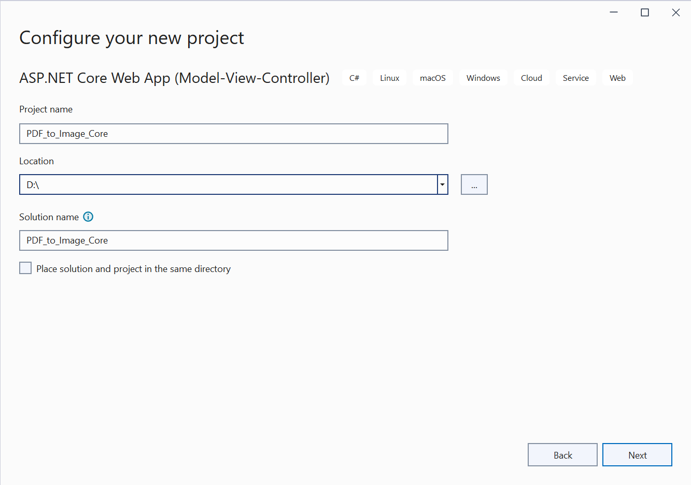
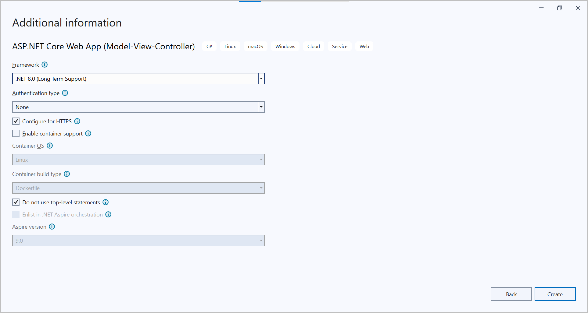
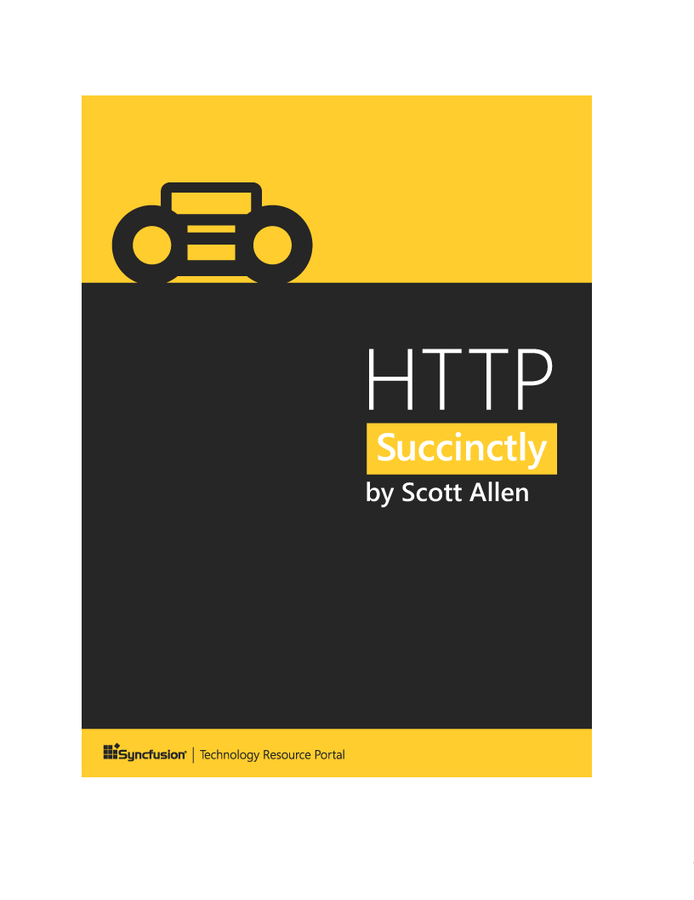

# Convert PDF file to Image in ASP.NET Core

The Syncfusion&reg; PDF to Image converter is a .NET library used to convert PDF document to image in ASP.NET Core application.

## Steps to convert PDF document to Image in ASP.NET Core application





**Prerequisites:**

* Visual Studio 2022.
* Install [.NET 8 SDK](https://dotnet.microsoft.com/en-us/download/dotnet/8.0) or later.


Step 1: Create a new C# ASP.NET Core Web Application project.


Step 2:  In configuration windows, name your project and select Next.



Step 3:  Install [Syncfusion.PdfToImageConverter.Net.Core](https://www.nuget.org/packages/Syncfusion.PdfToImageConverter.Net.Core/) NuGet package as reference to your .NET Standard applications from [NuGet.org](https://www.nuget.org/).

N> If you want to use the PdfToImageConverter in the Linux environment, you need to install the [SkiaSharp.NativeAssets.Linux v3.116.1](https://www.nuget.org/packages/SkiaSharp.NativeAssets.Linux/3.116.1) NuGet package as reference to your applications from [NuGet.org](https://www.nuget.org/).

Step 4: A default controller with name HomeController.cs gets added on creation of ASP.NET Core project. Include the following namespaces in that HomeController.cs file.



using Syncfusion.PdfToImageConverter;



Step 5: Add a new button in index.cshtml as shown below.



@{Html.BeginForm("ExportToImage", "Home", FormMethod.Post);
    {
        <div>
            <input type="submit" value="Convert Image" style="width:150px;height:27px" />
        </div>
    }
    Html.EndForm();
}



Step 6: Add a new action method named ExportToImage in HomeController.cs and include the below code example to convert PDF document to Image using Convert method in PdfToImageConverter class.



//Initialize PDF to Image converter.
PdfToImageConverter imageConverter = new PdfToImageConverter();
//Load the PDF document as a stream
FileStream inputStream = new FileStream("Input.pdf", FileMode.Open, FileAccess.ReadWrite);
imageConverter.Load(inputStream);
//Convert PDF to Image.
Stream outputStream = imageConverter.Convert(0, false, false);
MemoryStream stream = outputStream as MemoryStream;
byte[] bytes = stream.ToArray();
using (FileStream output = new FileStream("output.png", FileMode.OpenOrCreate, FileAccess.ReadWrite))
{
    output.Write(bytes, 0, bytes.Length);
}



Step 7: Build the project.

Click on Build → Build Solution or press <kbd>Ctrl</kbd>+<kbd>Shift</kbd>+<kbd>B</kbd> to build the project.

Step 8: Run the project.

Click the Start button (green arrow) or press <kbd>F5</kbd> to run the app.


 


**Prerequisites:**

* Visual Studio Code.
* Install [.NET 8 SDK](https://dotnet.microsoft.com/en-us/download/dotnet/8.0) or later.
* Open Visual Studio Code and install the [C# for Visual Studio Code extension](https://marketplace.visualstudio.com/items?itemName=ms-dotnettools.csharp) from the Extensions Marketplace.


Step 1: Open the terminal (Ctrl+` ) and run the following command to create a new ASP.NET Core application

```
dotnet new mvc -n CreatePdfToImageConvertASPNETCoreAPP
```
Step 2: Replace ****CreatePdfToImageConvertASPNETCoreAPP** with your desired project name.

Step 3: Navigate to the project directory using the following command

```
cd CreatePdfToImageConvertASPNETCoreAPP
```
Step 4: Use the following command in the terminal to add the [Syncfusion.PdfToImageConverter.Net] (https://www.nuget.org/packages/Syncfusion.PdfToImageConverter.Net) package to your project.

```
dotnet add package Syncfusion.PdfToImageConverter.Net
```

N> If you want to use the PdfToImageConverter in the Linux environment, you need to install the [SkiaSharp.NativeAssets.Linux v3.116.1](https://www.nuget.org/packages/SkiaSharp.NativeAssets.Linux/3.116.1) NuGet package as reference to your applications from [NuGet.org](https://www.nuget.org/).

Step 5: A default controller with name HomeController.cs gets added on creation of ASP.NET Core project. Include the following namespaces in that HomeController.cs file.



using Syncfusion.PdfToImageConverter;



Step 6: A default action method named Index will be present in HomeController.cs. Right click on Index method and select Go To View where you will be directed to its associated view page Index.cshtml. Add a new button in the Index.cshtml as shown below.



@{Html.BeginForm("ExportToImage", "Home", FormMethod.Get);
    {
        <div>
            <input type="submit" value="Convert Image" style="width:200px;height:27px" />
        </div>
    }
    Html.EndForm();
}



Step 7: Add a new action method named ExportToImage in HomeController.cs and include the below code example to convert PDF document to Image using Convert method in PdfToImageConverter class.



//Initialize PDF to Image converter.
PdfToImageConverter imageConverter = new PdfToImageConverter();
//Load the PDF document as a stream
FileStream inputStream = new FileStream("Input.pdf", FileMode.Open, FileAccess.ReadWrite);
imageConverter.Load(inputStream);
//Convert PDF to Image.
Stream outputStream = imageConverter.Convert(0, false, false);
MemoryStream stream = outputStream as MemoryStream;
byte[] bytes = stream.ToArray();
using (FileStream output = new FileStream("output.png", FileMode.OpenOrCreate, FileAccess.ReadWrite))
{
    output.Write(bytes, 0, bytes.Length);
}



Step 8: Build the project.

Run the following command in terminal to build the project.

```
dotnet build
```

Step 9: Run the project.

Run the following command in terminal to build the project.

```
dotnet run
```





By executing the program, you will get the image as follows.
