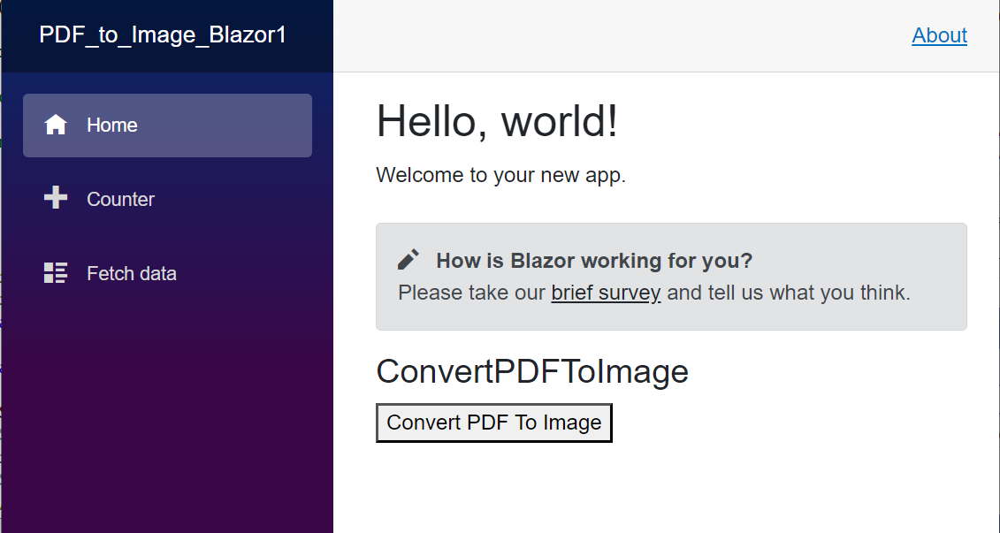

# Convert PDF file to Image in Blazor

The Syncfusion&reg; PDF to Image converter is a .NET library used to convert PDF document to image in Blazor application.





 





By executing the program, you will get the following output in the browser.

Click the Convert PDF To Image button, you will get the image as follows.
