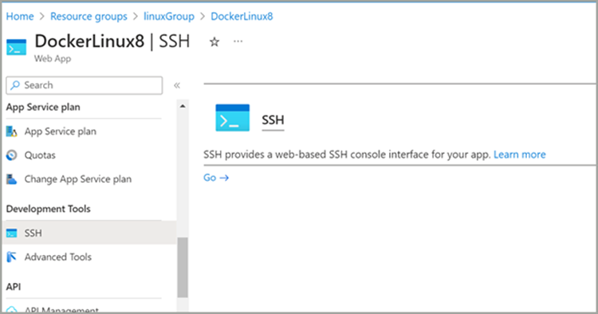
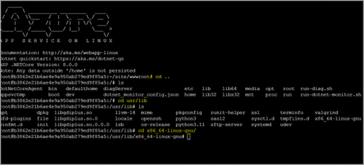
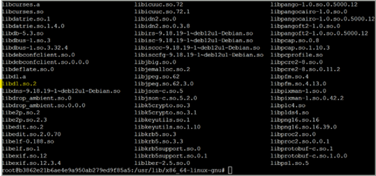
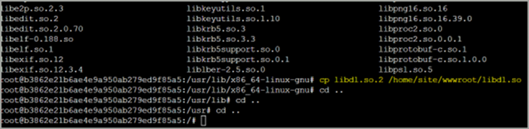
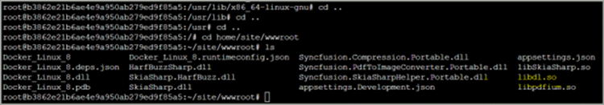

# Run .NET 8/.NET9 PdfToImageConverter on Azure App Service for Linux

To run a .NET 8.0/.NET 9.0 Linux application with PdfToImageConverter on an Azure App Service, you need the libdl.so file to access the pdfium assembly. However, in Azure App Service, the file is named libdl.so.2 instead of libdl.so. Therefore, to ensure compatibility and functionality, you must manually move and rename libdl.so.2 to libdl.so in the Azure App Service environment for the .NET 8.0/.NET 9.0 applications. This adjustment allows your .NET 8.0/.NET 9.0 application to function properly with PdfToImage conversion capabilities.

N> While running the .NET 8.0/.NET 9.0 PdfToImageConverter Linux application on an Azure App Service, you will get the `TypeInitializationException: Type initializer for "Syncfusion.PdfToImageConverter.PdfiumNative" threw an exception`.

## Steps to run the .NET 8/.NET 9 PdfToImageConverter Linux application in Azure App Service

Step 1: Open the SSH command window available in your Azure App Service from the [Azure portal](https://portal.azure.com).

Step 2: Navigate to the home location and then navigate to the `usr/lib/x86_64-linux-gnu` location in the SSH.

Step 3: List the files present in this location using the `ls` command. You can find the libdl.so.2 file in that location instead of the libdl.so file.

Step 4: Copy the libdl.so.2 file from this location to the `/home/site/wwwroot` folder and rename it to libdl.so using the command `cp libdl.so.2 /home/site/wwwroot/libdl.so`.

Step 5: Then navigate back to the `/home/site/wwwroot` folder and verify that the copied file is present in the desired location.

Step 6: Finally, refresh the service page URL and the application will work as expected.

N> If the service is still not working properly, stop and start the service again in the Azure portal. The `TypeInitializationException` will no longer be thrown.

N> When running a PdfToImageConverter inside an Alpine-based Docker environment, you may encounter a runtime exception `System.DllNotFoundException`. The `libdl.so` file is unavailable in Alpine Linux. Without the `libdl.so` file, we cannot read the Pdfium assembly. Therefore, it is not possible to use `PdfToImageConverter` in an Alpine Docker environment.