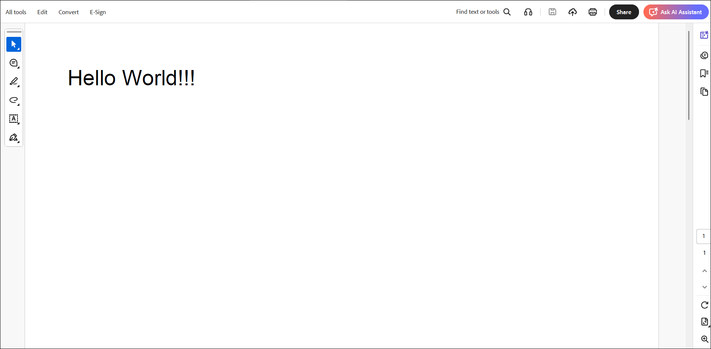

# Getting started with JavaScript PDF library

This guide explains how to create the PDF library component and configure its features in TypeScript using the Essential JS 2 [quickstart](https://github.com/SyncfusionExamples/ej2-quickstart-webpack-) seed repository.

> This application is integrated with a webpack configuration (`webpack.config.js`) and uses the latest version of the [webpack-cli](https://webpack.js.org/api/cli/#commands). It requires Node.js `v14.15.0` or higher. For more information, refer to the [webpack getting started guide](https://webpack.js.org/guides/getting-started/).

## Dependencies

The following list of dependencies are required to use the `EJ2 PDF library` component in your application.

```javascript
|-- @syncfusion/ej2-compression
|-- @syncfusion/ej2-base
|-- @syncfusion/ej2-file-utils

```

## Add Syncfusion JavaScript packages

Syncfusion JavaScript (Essential JS 2) packages are available on the [npmjs.com](https://www.npmjs.com/~syncfusionorg) public registry. Install all EJ2 controls with the [@syncfusion/ej2](https://www.npmjs.com/package/@syncfusion/ej2) meta package or install individual control packages.

The quickstart application is preconfigured with [@syncfusion/ej2](https://www.npmjs.com/package/@syncfusion/ej2) in `~/package.json`. Use the following command to install dependencies:




npm install




## Create EJ2 PDF with local resources

This example demonstrates how to create a PDF document directly using Syncfusion EJ2 PDF library. A button is provided to trigger the PDF creation process.




// Create and render button
let button: Button = new Button();
button.appendTo('#normalbtn');

// Handle click event
button.element.onclick = async () => {
    console.log('Start PDF Creation');
    createPdf();
};

// Function to create PDF
function createPdf() {
    // Create a new PDF document
    let document: PdfDocument = new PdfDocument();
    // Add a page
    const page = document.addPage();
    // Get graphics from the page
    let graphics = page.graphics;
    // Set font
     font: PdfStandardFont = new PdfStandardFont(PdfFontFamily.helvetica, 10);
    // Draw text
    graphics.drawString('Hello World!!!', font, [70, 10, 200, 50], new PdfPen([255, 0, 0], 1), new PdfBrush([0, 0, 255]));
    // Save the document
    document.save('Output.pdf');
    // Close the document
    document.destroy();
}




<div class="row">
    <button id="normalbtn">Create PDF</button>
</div>




By executing the program, you will get the PDF document as follows.



