# Create a PDF File in Azure Kubernetes Service (AKS)

The [.NET PDF library](https://www.syncfusion.com/document-sdk/net-pdf-library) is used to create, read, and edit PDF documents programmatically without the dependency of Adobe Acrobat. This guide shows how to containerize an ASP.NET Core app that generates PDFs and deploy it to Azure Kubernetes Service (AKS).

## Prerequisites

| Requirement | Version |
|---|---|
| **Visual Studio** | 2022 or later (with Docker support) |
| **.NET Framework** | .NET 6.0 or later |
| **Docker Desktop** | Latest version with Kubernetes enabled |
| **Azure CLI** | Latest version |
| **kubectl** | Latest version (usually comes with Docker Desktop) |
| **Azure Subscription** | Required for AKS cluster and container registry |
| **NuGet Package** | Syncfusion.Pdf.NET (latest stable version) |

**Azure Resources Required:**
- Azure Container Registry (ACR) — for storing container images
- Azure Kubernetes Service (AKS) cluster — for deploying containerized app

## Steps to create PDF document in AKS Environment

Step 1: Create a new ASP.NET Core Web App (Model-View-Controller).


Step 2: Create a project name and select the location.
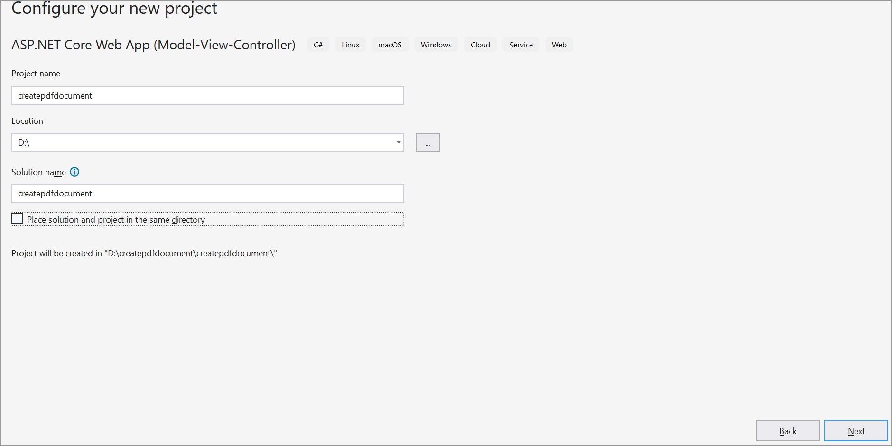

Step 3: Click **Create** button.
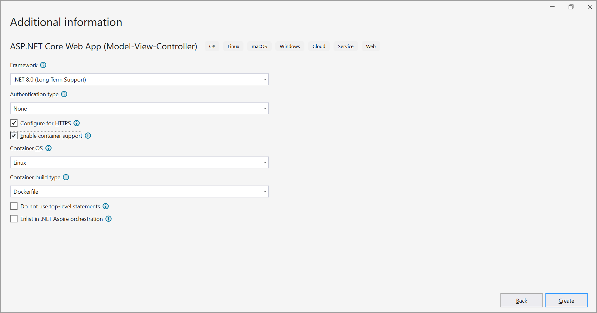

Step 4: Install the [Syncfusion.Pdf.Net.Core](https://www.nuget.org/packages/Syncfusion.Pdf.NET/) NuGet package as a reference to your project from [NuGet.org](https://www.nuget.org/).
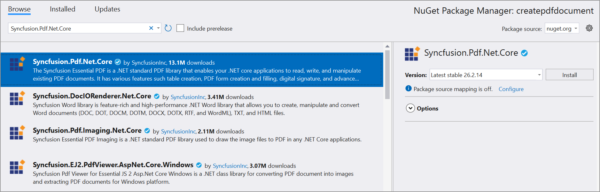

Step 5: Register the Syncfusion license in **Program.cs** (for .NET 6+) or **Startup.cs** (.NET Core 3.1):




using Syncfusion.Licensing;

var builder = WebApplication.CreateBuilder(args);

// Register Syncfusion license
SyncfusionLicenseProvider.RegisterLicense("YOUR_LICENSE_KEY");

builder.Services.AddControllersWithViews();
var app = builder.Build();




Replace `YOUR_LICENSE_KEY` with your actual Syncfusion license key.

Step 6: A default action method named Index will be present in *HomeController.cs*. Right click on Index method and select Go To View where you will be directed to its associated view page *Index.cshtml*. Add a new button in the *Index.cshtml* as shown below.




@{
    Html.BeginForm("CreatePDFDocument", "Home", FormMethod.Get);
    {
        <div>
            <input type="submit" value="Create PDF Document" style="width:200px;height:27px" />
        </div>
    }
    Html.EndForm();
}




Step 7: Include the following namespaces in *HomeController.cs*.





using Syncfusion.Pdf;
using Syncfusion.Pdf.Graphics;
using Syncfusion.Drawing;





Step 8: Add a new action method named CreatePDFDocument in HomeController.cs file. First, inject **IWebHostEnvironment** in the constructor, then add the action method as shown below: 





private readonly IWebHostEnvironment _hostingEnvironment;

public HomeController(IWebHostEnvironment hostingEnvironment)
{
    _hostingEnvironment = hostingEnvironment;
}

public IActionResult CreatePDFDocument()
{
    try
    {
        //Create a new PDF document.
        using (PdfDocument document = new PdfDocument())
        {
            //Set the page size.
            document.PageSettings.Size = PdfPageSize.A4;
            //Add a page to the document.
            PdfPage page = document.Pages.Add();

            //Create PDF graphics for the page.
            PdfGraphics graphics = page.Graphics;
            
            //Load the image from the disk.
            string imagePath = Path.Combine(_hostingEnvironment.WebRootPath, "Data/AdventureCycle.jpg");
            using (FileStream imageStream = new FileStream(imagePath, FileMode.Open, FileAccess.Read))
            {
                PdfBitmap image = new PdfBitmap(imageStream);
                //Draw an image.
                graphics.DrawImage(image, new RectangleF(130, 0, 250, 100));
            }

            //Draw header text. 
            graphics.DrawString("Adventure Works Cycles", new PdfStandardFont(PdfFontFamily.TimesRoman, 20, PdfFontStyle.Bold), PdfBrushes.Gray, new PointF(150, 150));

            //Add paragraph. 
            string text = "Adventure Works Cycles, the fictitious company on which the AdventureWorks sample databases are based, is a large, multinational manufacturing company. The company manufactures and sells metal and composite bicycles to North American, European and Asian commercial markets. While its base operation is located in Washington with 290 employees, several regional sales teams are located throughout their market base.";
            //Create a text element with the text and font.
            PdfTextElement textElement = new PdfTextElement(text, new PdfStandardFont(PdfFontFamily.TimesRoman, 12));
            //Draw the text in the first column.
            textElement.Draw(page, new RectangleF(0, 200, page.GetClientSize().Width, page.GetClientSize().Height));

            //Create a PdfGrid.
            PdfGrid pdfGrid = new PdfGrid();
            //Add values to the list.
            List<object> data = new List<object>();
            Object row1 = new { Product_ID = "1001", Product_Name = "Bicycle", Price = "10,000" };
            Object row2 = new { Product_ID = "1002", Product_Name = "Head Light", Price = "3,000" };
            Object row3 = new { Product_ID = "1003", Product_Name = "Break wire", Price = "1,500" };
            data.Add(row1);
            data.Add(row2);
            data.Add(row3);
            //Add list to IEnumerable.
            IEnumerable<object> dataTable = data;
            //Assign data source.
            pdfGrid.DataSource = dataTable;
            //Apply built-in table style.
            pdfGrid.ApplyBuiltinStyle(PdfGridBuiltinStyle.GridTable4Accent3);
            //Draw the grid to the page of PDF document.
            pdfGrid.Draw(graphics, new RectangleF(0, 300, page.Size.Width - 80, 0));

            //Saving the PDF to the MemoryStream.
            using (MemoryStream stream = new MemoryStream())
            {
                document.Save(stream);
                //Set the position as '0'.
                stream.Position = 0;
                //Download the PDF document in the browser.
                byte[] bytes = stream.ToArray();
                return File(bytes, "application/pdf", "Sample.pdf");
            }
        }
    }
    catch (Exception ex)
    {
        return BadRequest($"Error generating PDF: {ex.Message}");
    }
}





## Containerize the Application

Step 9: Before publishing to Azure Container Registry, ensure your project includes a **Dockerfile**. If not present, Visual Studio 2022 can generate one automatically:

1. Right-click the project → **Add** → **Docker Support**
2. Select **Linux** as the target OS and click **Create Dockerfile**
3. The generated Dockerfile will configure the .NET runtime and application entry point

Alternatively, create a `Dockerfile` manually in the project root:

```dockerfile
FROM mcr.microsoft.com/dotnet/aspnet:6.0 AS runtime
WORKDIR /app
COPY --from=builder /app/publish .
ENTRYPOINT ["dotnet", "YourAppName.dll"]
```

## Publish Container to ACR

Step 1: Right-click the project and select Publish option.
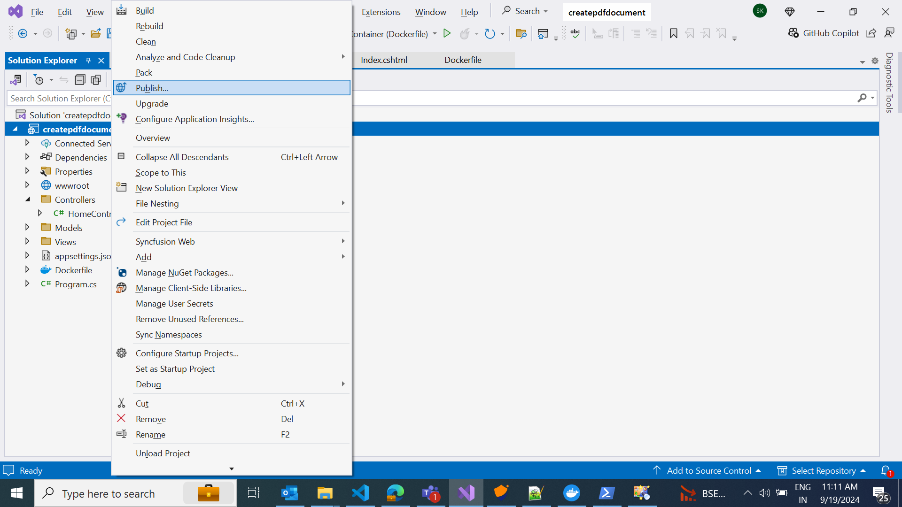

Step 2: Select the publish target as **Docker Container Registry**.
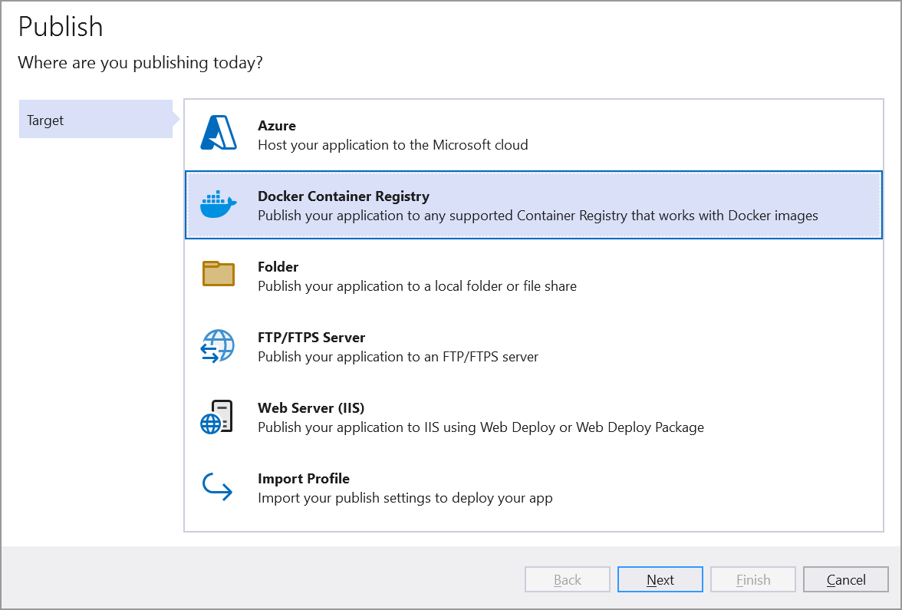

Step 3: Select the Specific target as **Azure Container Registry**.
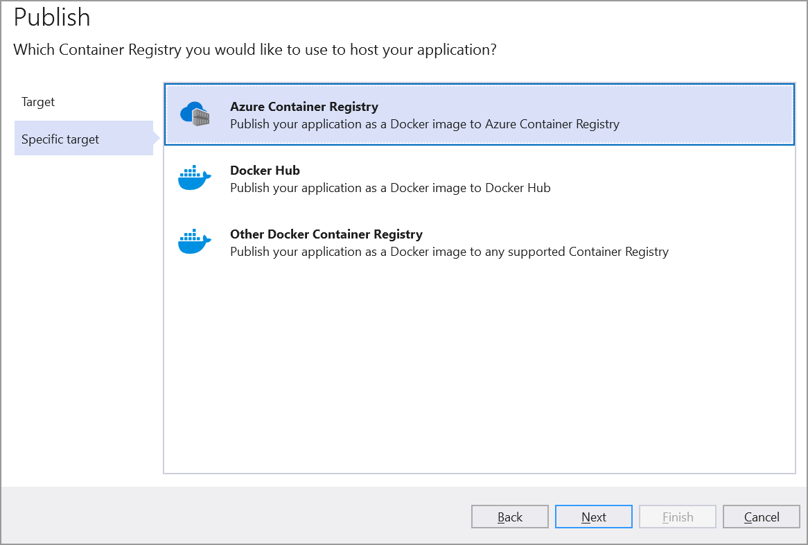

Step 4: Once you select your Subscription, The registry we created earlier and the resource group it is in should be detected. Select it and click Finish. 
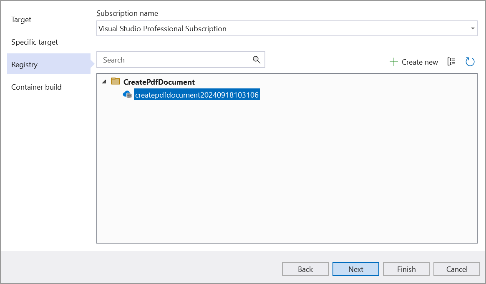

Step 5: Select the container build option and click Finish. 
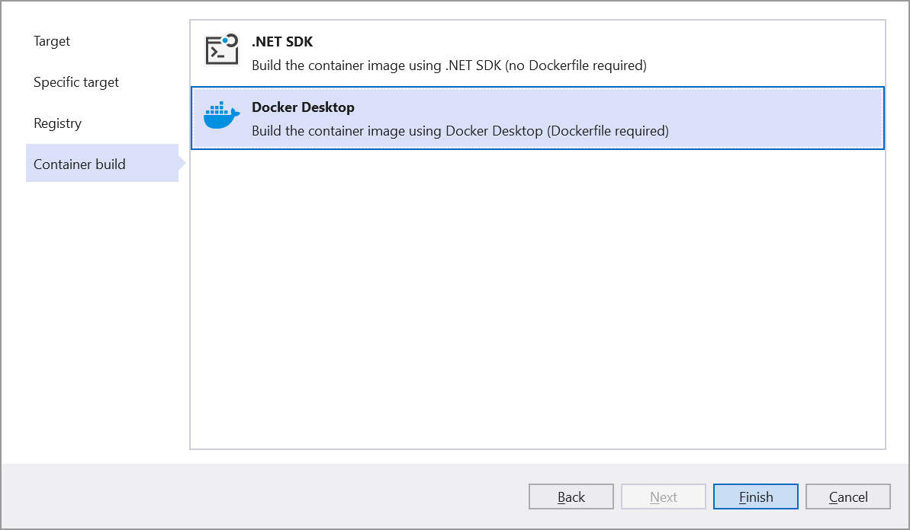

Step 6: Click **Close** button.
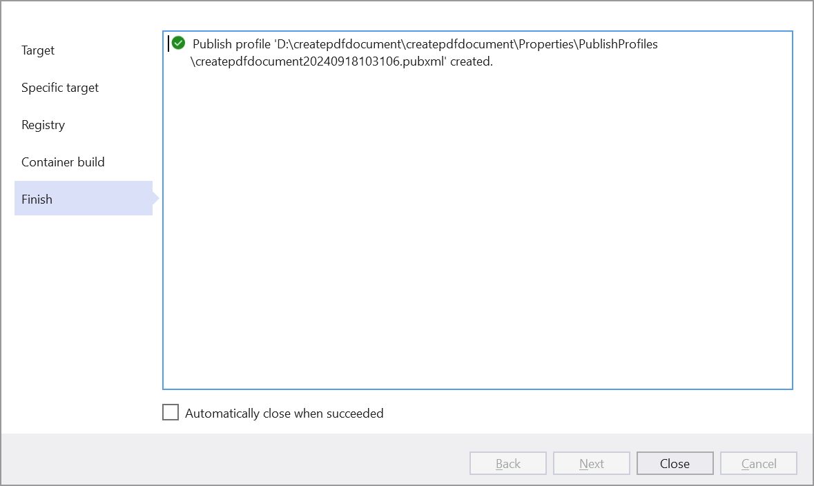

Step 7: Click the **Publish** button.
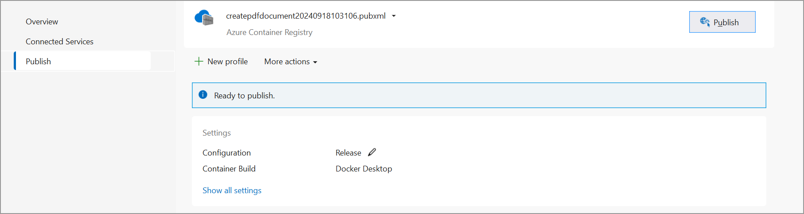

Step 8: It will push the Docker image to the Azure Container Registry.
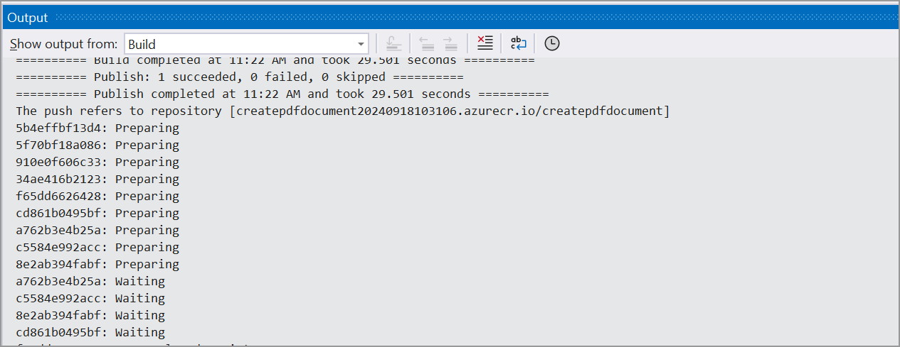 

Step 9: Publish succeeded.
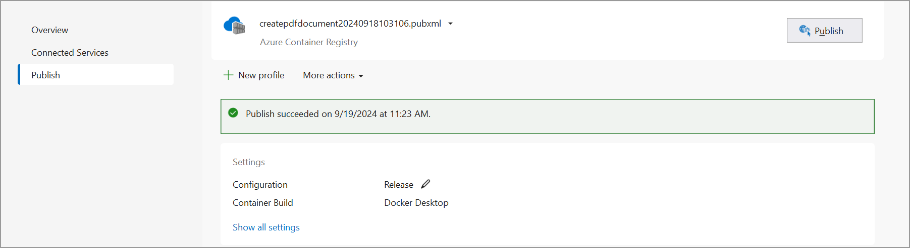

## Deploy Container Image to AKS

Step 1: Now you can deploy the container to the AKS cluster. Start by opening the Azure portal, navigating to your Subscription, and opening the Cloud Shell (BASH). You will use the kubectl tool to manage the cluster.

Step 2: You need to gather the credentials in order to interact with the cluster using kubectl in Azure Cloud Shell.
 use the following command:




az aks get-credentials --resource-group CreatePdfDocument --name aks-uk-demo-msdn





Step 3: You can review the credentials with the following command:



cat .kube/config





N> If you forgot to attach the ACR when creating the AKS resource (Like I did the first time), you can attach it after. I had to use the following command: `az aks update -n aks-uk-demo-msdn -g CreatePdfDocument --attach-acr createpdfdocument20240918103106`

Step 4: Now in the Cloud Shell, create a new file called deploy.yaml as follows:



code deploy.yaml





Step 5: Add the following Kubernetes Deployment and Service configurations. **Important:** Customize the values below to match your specific setup:
   - Replace `createpdfdocument` with your application name
   - Replace `createpdfdocument20240918103106.azurecr.io` with your ACR login server (from Azure portal)
   - Update the image tag to match your published image




apiVersion: apps/v1
kind: Deployment
metadata:
  name: createpdfdocument
spec:
  replicas: 2  # Number of pod instances (increase for higher load)
  selector:
    matchLabels:
      app: createpdfdocument
  template:
    metadata:
      labels:
        app: createpdfdocument
    spec:
      containers:
      - name: createpdfdocument
        image: createpdfdocument20240918103106.azurecr.io/createpdfdocument:latest
        ports:
        - containerPort: 80
---
apiVersion: v1
kind: Service
metadata:
  name: createpdfdocument
spec:
  type: LoadBalancer
  ports:
    - port: 80
      targetPort: 80
      protocol: TCP
  selector:
    app: createpdfdocument





Step 6: Once you save and close the code editor, it’s finally time to apply the configuration:



kubectl apply -f deploy.yaml





Step 7: Notice the deployment and service are created.


Step 8: You can run the following commands to verify the deployment:

- `kubectl get pods` — Lists all running container instances (pods)
- `kubectl get nodes` — Lists the cluster nodes (virtual machines)
- `kubectl get service` — Lists all services, including the LoadBalancer IP and port
- `kubectl describe deployment` — Shows detailed deployment information

Alternatively, run:



kubectl get all




This displays all pods, services, apps, and replica sets.

Step 9: The output shows the pods, services, apps, and replica sets:
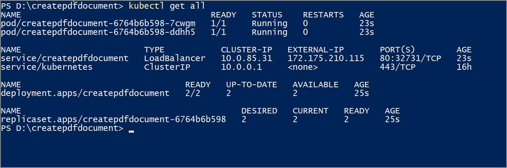.

Step 10: We can see the EXTERNAL-IP of the LoadBalancer above as being 20.117.254.138 and the port as 80. I should now be able to use this to browse the the web app running on AKS.
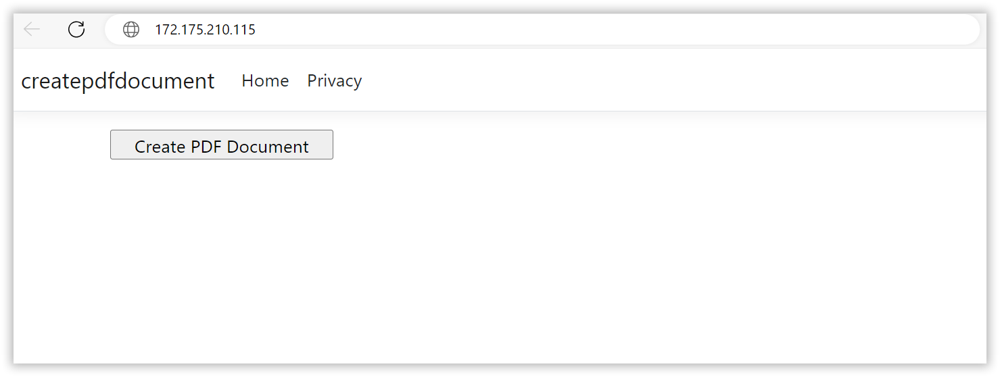.

If we head over to the Azure portal, select the AKS resource > Workloads > asp-docker-app, we can see the pods.
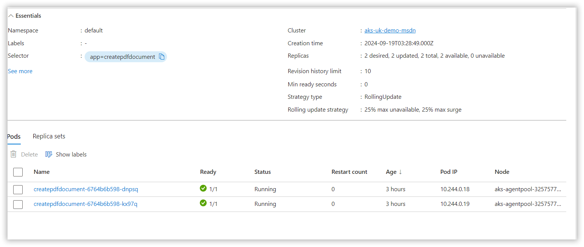.

And that's it, the containerized ASP.NET Core Web App is running on the AKS cluster.

In your browser, navigate to the external IP address (from Step 10) and click **Create PDF Document** button to generate the PDF. You will see the output PDF document as follows:


## Troubleshooting

| Issue | Cause | Solution |
|---|---|---|
| **Image pull errors** | ACR not attached to AKS or credentials missing | Run: `az aks update -n cluster-name -g resource-group --attach-acr registry-name` |
| **Pod crashes with CrashLoopBackOff** | Missing dependencies or license registration failed | Check logs: `kubectl logs <pod-name>` and verify license registration in Program.cs |
| **External IP shows \<pending\>** | LoadBalancer service not provisioned | Wait 2-3 minutes, then retry `kubectl get service` |
| **Cannot reach application** | Firewall or network security group blocking port 80 | Check Azure NSG rules allow inbound traffic on port 80 |
| **Deployment fails to pull image** | Wrong registry URL or image tag in deploy.yaml | Verify registry name and image tag match ACR login server |
| **Out of memory/CPU errors** | Resource limits too restrictive or too many replicas | Add resource requests/limits to deployment.yaml and scale replicas |
| **kubectl commands fail** | Credentials not configured for cluster | Re-run: `az aks get-credentials --resource-group rg-name --name cluster-name` |
| **PDF file is blank** | Image path not found or graphics operations failed | Verify `Data/AdventureCycle.jpg` exists in wwwroot folder; check application logs |

## Clean Up: Delete Deployment and Service

If you want to clean up the cluster, you can run the following commands:



kubectl delete -f deploy.yaml
kubectl delete svc asp-docker-app --namespace=default




You can download a complete working sample from [GitHub](https://github.com/SyncfusionExamples/PDF-Examples/tree/master/Getting%20Started/Azure/Create%20PDF%20document%20in%20AKS%20environment/createpdfdocument).

Click [here](https://www.syncfusion.com/document-sdk/net-pdf-library) to explore the rich set of Syncfusion<sup>&reg;</sup> PDF library features. 

An online sample link to [create PDF document](https://document.syncfusion.com/demos/pdf/default#/tailwind).

## Next Steps

- **[Scale AKS deployments](https://learn.microsoft.com/en-us/azure/aks/scale-cluster)** — Increase replicas and node pools for higher load
- **[Monitor AKS with Azure Monitor](https://learn.microsoft.com/en-us/azure/aks/monitor-aks)** — Track performance, logs, and diagnostics
- **[Set up continuous deployment (CI/CD)](https://learn.microsoft.com/en-us/azure/aks/devops-pipeline)** — Automate builds and deployments with Azure Pipelines
- **[Merge PDF files](https://help.syncfusion.com/document-processing/pdf-library/net/merge-pdf-files)** — Combine multiple PDFs in your containerized app
- **[Secure PDF documents](https://help.syncfusion.com/document-processing/pdf-library/net/securing-pdf-documents)** — Add encryption and permissions to generated PDFs
- **[Deploy to other Azure services](https://help.syncfusion.com/document-processing/pdf-library/net)** — Create PDFs in App Service, Functions, or other platforms 