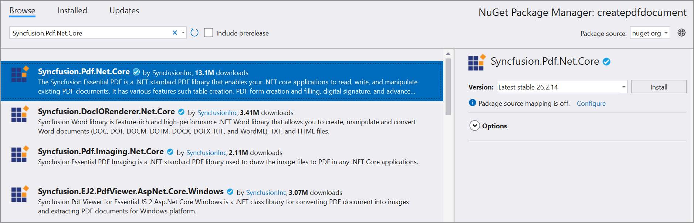
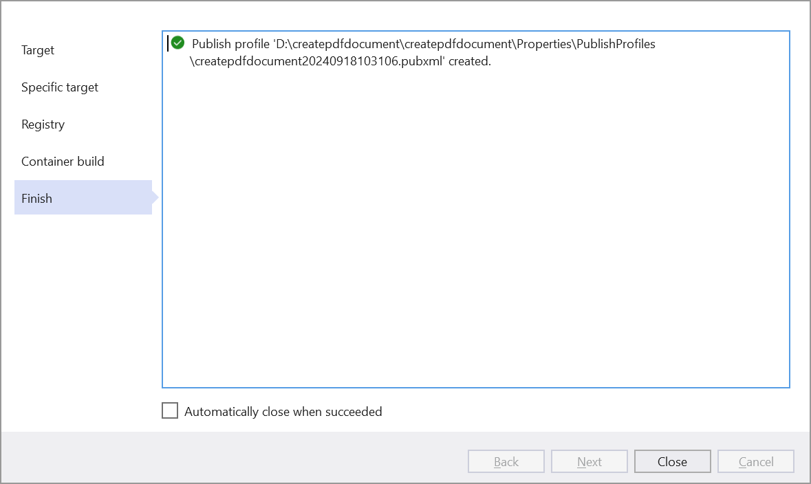
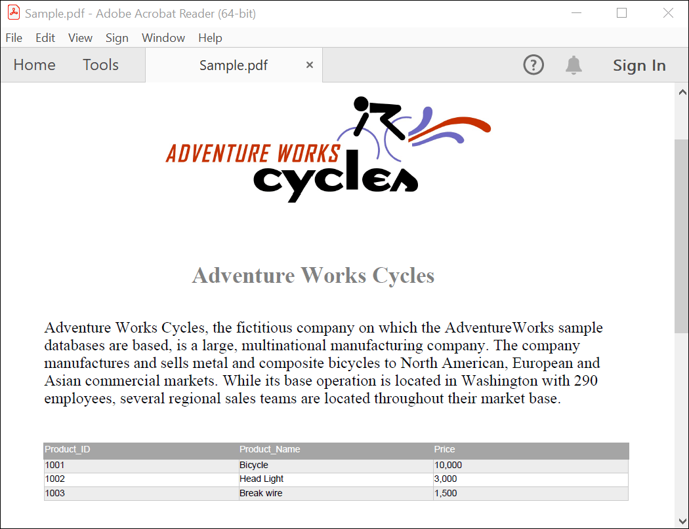

# Create PDF document in AKS Environment 

The [Syncfusion&reg; .NET Core PDF library](https://www.syncfusion.com/document-processing/pdf-framework/net-core) is used to create, read, edit PDF documents programmatically without the dependency of Adobe Acrobat. Using this library, you can **create PDF document in AKS Environment**.

## Steps to create PDF document in AKS Environment 
Step 1: Create a new ASP.NET Core Web App (Model-View-Controller).

Step 2: Create a project name and select the location.

Step 3: Click **Create** button.

Step 4: Install the [Syncfusion.Pdf.Net.Core](https://www.nuget.org/packages/Syncfusion.Pdf.Net.Core/) NuGet package as a reference to your project from [NuGet.org](https://www.nuget.org/).

Step 5: A default action method named Index will be present in *HomeController.cs*. Right click on Index method and select Go To View where you will be directed to its associated view page *Index.cshtml*. Add a new button in the *Index.cshtml* as shown below.





@{
    Html.BeginForm("CreatePDFDocument", "Home", FormMethod.Get);
    {
        

            <input type="submit" value="Create PDF Document" style="width:200px;height:27px" />
        

    }
    Html.EndForm();
}





Step 6: Include the following namespaces in *HomeController.cs*.





using Syncfusion.Pdf.Graphics;
using Syncfusion.Pdf;
using System.Diagnostics;
using Syncfusion.Drawing;





Step 7: Add a new action method named CreatePDFDocument in HomeController.cs file and include the below code example to generate a PDF document in *HomeController.cs*. 





public IActionResult CreatePDFDocument()
{
    //Create a new PDF document.
    PdfDocument document = new PdfDocument();
    //Set the page size.
    document.PageSettings.Size = PdfPageSize.A4;
    //Add a page to the document.
    PdfPage page = document.Pages.Add();

    //Create PDF graphics for the page.
    PdfGraphics graphics = page.Graphics;
    //Load the image from the disk.
    string imagePath = Path.Combine(_hostingEnvironment.WebRootPath, "Data/AdventureCycle.jpg");
    FileStream imageStream = new FileStream(imagePath, FileMode.Open, FileAccess.Read);
    PdfBitmap image = new PdfBitmap(imageStream);
    //Draw an image.
    graphics.DrawImage(image, new RectangleF(130, 0, 250, 100));

    //Draw header text. 
    graphics.DrawString("Adventure Works Cycles", new PdfStandardFont(PdfFontFamily.TimesRoman, 20, PdfFontStyle.Bold), PdfBrushes.Gray, new PointF(150, 150));

    //Add paragraph. 
    string text = "Adventure Works Cycles, the fictitious company on which the AdventureWorks sample databases are based, is a large, multinational manufacturing company. The company manufactures and sells metal and composite bicycles to North American, European and Asian commercial markets. While its base operation is located in Washington with 290 employees, several regional sales teams are located throughout their market base.";
    //Create a text element with the text and font.
    PdfTextElement textElement = new PdfTextElement(text, new PdfStandardFont(PdfFontFamily.TimesRoman, 12));
    //Draw the text in the first column.
    textElement.Draw(page, new RectangleF(0, 200, page.GetClientSize().Width, page.GetClientSize().Height));

    //Create a PdfGrid.
    PdfGrid pdfGrid = new PdfGrid();
    //Add values to the list.
    List<object> data = new List<object>();
    Object row1 = new { Product_ID = "1001", Product_Name = "Bicycle", Price = "10,000" };
    Object row2 = new { Product_ID = "1002", Product_Name = "Head Light", Price = "3,000" };
    Object row3 = new { Product_ID = "1003", Product_Name = "Break wire", Price = "1,500" };
    data.Add(row1);
    data.Add(row2);
    data.Add(row3);
    //Add list to IEnumerable.
    IEnumerable<object> dataTable = data;
    //Assign data source.
    pdfGrid.DataSource = dataTable;
    //Apply built-in table style.
    pdfGrid.ApplyBuiltinStyle(PdfGridBuiltinStyle.GridTable4Accent3);
    //Draw the grid to the page of PDF document.
    pdfGrid.Draw(graphics, new RectangleF(0, 300, page.Size.Width - 80, 0));

    //Saving the PDF to the MemoryStream.
    MemoryStream stream = new MemoryStream();
    document.Save(stream);
    //Set the position as '0'.
    stream.Position = 0;
    //Download the PDF document in the browser.
    FileStreamResult fileStreamResult = new FileStreamResult(stream, "application/pdf");
    fileStreamResult.FileDownloadName = "Sample.pdf";
    return fileStreamResult;
}





## Publish Container to ACR

Step 1: Right-click the project and select Publish option.

Step 2: Select the publish target as **Docker Contain Registry**.

Step 3: Select the Specific target as **Azure Contain Registry**.

Step 4: Once you select your Subscription, The registry we created earlier and the resource group it is in should be detected. Select it and click Finish. 

Step 5: Select the container build option and click Finish. 

Step 6: Click **Close** button.

Step 7: Click the **Publish** button.

Step 8: It will push the docker image to the Azure container registry and deploy it to the Azure container instance.
 

Step 9: Now, Publish has been succeeded.

## Deploy Container Image to AKS
Step 1: Now we can deploy container to the AKS cluster. Start by opening the Azure portal, browsing to the Subscription and opening the Cloud Shell (BASH). We will use the kubectl tool to manage the cluster.

Step 2: You need to gather the credentials in order to interact with the cluster using kubectl in Azure Cloud Shell.
 use the following command:




az aks get-credentials --resource-group CreatePdfDocument --name aks-uk-demo-msdn





Step 3: You can review the credentials with the following command:



cat .kube/config





N> If you forgot to attach the ACR when creating the AKS resource (Like I did the first time), you can attach it after. I had to use the following command: `az aks update -n aks-uk-demo-msdn -g CreatePdfDocument --attach-acr createpdfdocument20240918103106`

Step 4: Now in the Cloud Shell, create a new file called deploy.yaml as follows:



code deploy.yaml





Step 5: Then we pasted in the following Kubernetes Deployment and Service configurations. Note, change yours to match your app name, container name, registry, etc.



    apiVersion: apps/v1
    kind: Deployment
    metadata:
    name: createpdfdocument
    spec:
    replicas: 2
    selector:
        matchLabels:
        app: createpdfdocument
    template:
        metadata:
        labels:
            app: createpdfdocument
        spec:
        containers:
        - name: createpdfdocument
            image: createpdfdocument20240918103106.azurecr.io/createpdfdocument:latest
    ---
    apiVersion: v1
    kind: Service
    metadata:
    name: createpdfdocument
    spec:
    type: LoadBalancer
    ports:
        - port: 80
        targetPort: 80
        protocol: TCP
    selector:
        app: createpdfdocument





Step 6: Once you save and close the code editor, it’s finally time to apply the configuration:



kubectl apply -f deploy.yaml





Step 7: Notice the deployment and service shows as created.

Step 8: You can run the following commands:



kubectl get pods
kubectl get nodes
kubectl get service
kubectl describe deployment




or



kubectl get all




Step 9: This will show the pods, services, apps and replica sets.
.

Step 10: We can see the EXTERNAL-IP of the LoadBalancer above as being 20.117.254.138 and the port as 80. I should now be able to use this to browse the the web app running on AKS.
.

If we head over to the Azure portal, select the AKS resource > Workloads > asp-docker-app, we can see the pods.
.

And that’s it, the containerised ASP.NET Core Web App is running on the AKS cluster.

Select the PDF document and Click **Create PDF document** to generate the PDF document.You will get the output **PDF document** as follows.

## Delete deployment
If you want to clean up the cluster, you can run the following commands:



kubectl delete -f deploy.yaml
kubectl delete svc asp-docker-app --namespace=default




You can download a complete working sample from [GitHub](https://github.com/SyncfusionExamples/PDF-Examples/tree/master/Getting%20Started/Azure/Create%20PDF%20document%20in%20AKS%20environment/createpdfdocument).

Click [here](https://www.syncfusion.com/document-processing/pdf-framework/net-core) to explore the rich set of Syncfusion&reg; PDF library features. 

An online sample link to [create PDF document](https://ej2.syncfusion.com/aspnetcore/PDF/HelloWorld#/material3) in ASP.NET Core. 