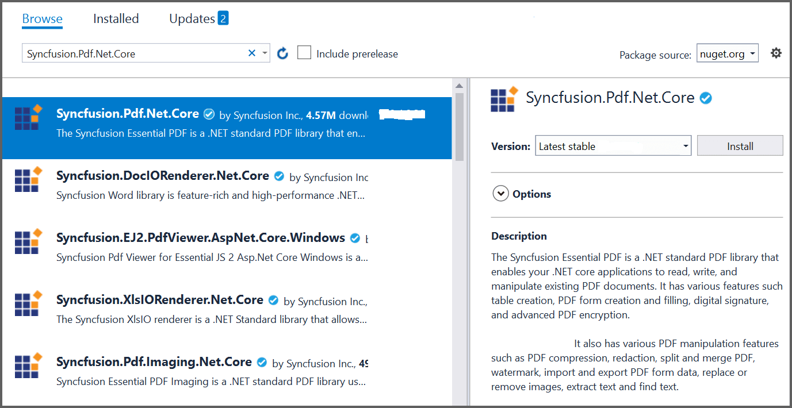

**Prerequires**:

Step 1: Install .NET SDK: 
* Ensure that you have the .NET SDK installed on your system. You can download it from the [.NET Downloads page](https://dotnet.microsoft.com/en-us/download).
Step 2: Install Visual Studio: 
* Download and install Visual Studio Code from the [official website](https://code.visualstudio.com/download).

## Steps to create PDF document in ASP.NET Core

Step 1: Create a new C# ASP.NET Core Web Application project.

Step 2: Select Web Application pattern (Model-View-Controller) for the project.

Step 3: Install the [Syncfusion.Pdf.Net.Core](https://www.nuget.org/packages/Syncfusion.Pdf.Net.Core/) [NuGet package](https://help.syncfusion.com/document-processing/nuget-packages) as reference to your ASP.NET Core applications from [NuGet.org](https://www.nuget.org/).

N> Starting with v16.2.0.x, if you reference Syncfusion&reg; assemblies from trial setup or from the NuGet feed, you also have to add "Syncfusion.Licensing" assembly reference and include a license key in your projects. Please refer to this [link](https://help.syncfusion.com/common/essential-studio/licensing/overview) to know about registering Syncfusion&reg; license key in your application to use our components.

Step 4: A default controller with name HomeController.cs gets added on creation of ASP.NET Core project. Include the following namespaces in that HomeController.cs file.



using Syncfusion.Pdf;
using Syncfusion.Pdf.Graphics;
using Syncfusion.Drawing;
using System.IO;



Step 5: A default action method named Index will be present in HomeController.cs. Right click on Index method and select Go To View where you will be directed to its associated view page Index.cshtml. Add a new button in the Index.cshtml as shown below.



@{Html.BeginForm("CreateDocument", "Home", FormMethod.Get);
    {
        

            <input type="submit" value="Create PDF Document" style="width:200px;height:27px" />
        

    }
    Html.EndForm();
}



Step 6: Add a new action method named ``CreatePDFDocument`` in HomeController.cs file and include the below code example to generate a PDF document using the [PdfDocument](https://help.syncfusion.com/cr/document-processing/Syncfusion.Pdf.PdfDocument.html) class. Then use the [DrawString](https://help.syncfusion.com/cr/document-processing/Syncfusion.Pdf.Graphics.PdfGraphics.html#Syncfusion_Pdf_Graphics_PdfGraphics_DrawString_System_String_Syncfusion_Pdf_Graphics_PdfFont_Syncfusion_Pdf_Graphics_PdfBrush_System_Drawing_PointF_) method of the [PdfGraphics](https://help.syncfusion.com/cr/document-processing/Syncfusion.Pdf.Graphics.PdfGraphics.html) object to draw the text on the PDF page.



//Create a new PDF document.
PdfDocument document = new PdfDocument();
//Add a page to the document.
PdfPage page = document.Pages.Add();
//Create PDF graphics for the page.
PdfGraphics graphics = page.Graphics;
//Set the standard font.
PdfFont font = new PdfStandardFont(PdfFontFamily.Helvetica, 20);
//Draw the text.
graphics.DrawString("Hello World!!!", font, PdfBrushes.Black, new PointF(0, 0));
//Saving the PDF to the MemoryStream.
MemoryStream stream = new MemoryStream();
document.Save(stream);
//Set the position as '0'.
stream.Position = 0;
//Download the PDF document in the browser.
FileStreamResult fileStreamResult = new FileStreamResult(stream, "application/pdf");
fileStreamResult.FileDownloadName = "Sample.pdf";
return fileStreamResult;



Step 7: Build the project.

Click on Build > Build Solution or press Ctrl + Shift + B to build the project.

Step 8: Run the project.

Click the Start button (green arrow) or press F5 to run the app.