# Create PDF document in Azure App Service on Windows

The [.NET PDF library](https://www.syncfusion.com/document-sdk/net-pdf-library) is used to create, read, edit PDF documents programmatically without the dependency on Adobe Acrobat. Using this library, you can **create a PDF document in Azure App Service on Windows**.

Watch the following video to learn how to create a PDF document and publish it as an Azure App Service on Windows using the Syncfusion .NET PDF library.


## Prerequisites

* An active **Microsoft Azure subscription**. If you don't have one, [create a free account](https://azure.microsoft.com/free/) before starting.
* **Visual Studio 2022** with the **ASP.NET and web development** and **Azure development** workloads installed.
* The **Azure SDK** and the latest **Azure App Service tools** for Visual Studio.
* .NET SDK 8.0 or later 
* A valid Syncfusion license key. Refer to the [licensing documentation](https://help.syncfusion.com/common/essential-studio/licensing/overview) to learn how to register a Syncfusion license key in your application.

## Steps to create PDF document in Azure App Service on Windows

Step 1: Create a new ASP.NET Core Web App (Model-View-Controller) in Visual Studio.


Step 2: Set the project name and select the location.
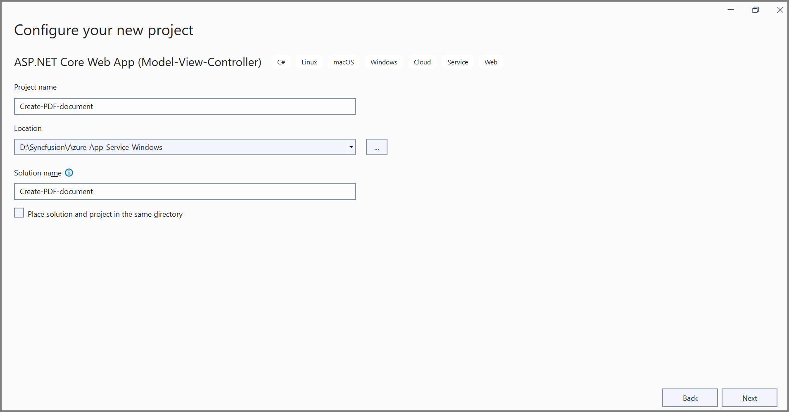

Step 3: Click the **Create** button. 


Step 4: Install the [Syncfusion.Pdf.Net.Core](https://www.nuget.org/packages/Syncfusion.Pdf.Net.Core/) NuGet package as a reference to your project from [NuGet.org](https://www.nuget.org/). You can also use the .NET CLI:

```bash
dotnet add package Syncfusion.Pdf.Net.Core
```

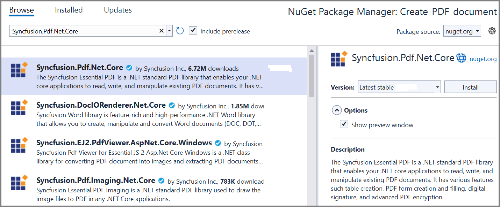

N> Starting with v16.2.0.x, if you reference Syncfusion assemblies from a trial setup or from the NuGet feed, you must also add the **Syncfusion.Licensing** assembly reference and include a license key in your project. Refer to the [licensing documentation](https://help.syncfusion.com/common/essential-studio/licensing/overview) for details.

Step 5: A default action method named `Index` is present in *HomeController.cs*. Right-click the `Index` method and select **Go To View** to open its associated view page *Index.cshtml*. Add a new button to *Index.cshtml* as shown below.





@{
    Html.BeginForm("CreatePDFDocument", "Home", FormMethod.Get);
    {
        <div>
            <input type="submit" value="Create PDF Document" style="width:200px;height:27px" />
        </div>
    }
    Html.EndForm();
}





Step 6: Include the following namespaces in *HomeController.cs*. Add `System.IO` and `System.Collections.Generic` for the `FileStream`, `Path`, and `List` types used in the action method.





using System.IO;
using System.Collections.Generic;
using Microsoft.AspNetCore.Mvc;
using Syncfusion.Pdf.Graphics;
using Syncfusion.Drawing;
using Syncfusion.Pdf.Grid;
using Syncfusion.Pdf;





Step 7: Add a new action method named `CreatePDFDocument` in the *HomeController.cs* file and include the following code to generate a PDF document. Before building, place the sample image at `wwwroot/Data/AdventureCycle.jpg` so the controller can read it at runtime.





//To load an existing file. 
private readonly IWebHostEnvironment _hostingEnvironment;
public HomeController(IWebHostEnvironment hostingEnvironment)
{
    _hostingEnvironment = hostingEnvironment;
}

public IActionResult CreatePDFDocument()
{
    //Create a new PDF document.
    PdfDocument document = new PdfDocument();
    //Set the page size.
    document.PageSettings.Size = PdfPageSize.A4;
    //Add a page to the document.
    PdfPage page = document.Pages.Add();

    //Create PDF graphics for the page.
    PdfGraphics graphics = page.Graphics;
    //Load the image from the disk.
    string imagePath = Path.Combine(_hostingEnvironment.WebRootPath, "Data/AdventureCycle.jpg");
    FileStream imageStream = new FileStream(imagePath, FileMode.Open, FileAccess.Read);
    PdfBitmap image = new PdfBitmap(imageStream);
    //Draw an image.
    graphics.DrawImage(image, new RectangleF(130, 0, 250, 100));

    //Draw header text. 
    graphics.DrawString("Adventure Works Cycles", new PdfStandardFont(PdfFontFamily.TimesRoman, 20, PdfFontStyle.Bold), PdfBrushes.Gray, new PointF(150, 150));

    //Add paragraph. 
    string text = "Adventure Works Cycles, the fictitious company on which the AdventureWorks sample databases are based, is a large, multinational manufacturing company. The company manufactures and sells metal and composite bicycles to North American, European and Asian commercial markets. While its base operation is located in Washington with 290 employees, several regional sales teams are located throughout their market base.";
    //Create a text element with the text and font.
    PdfTextElement textElement = new PdfTextElement(text, new PdfStandardFont(PdfFontFamily.TimesRoman, 12));
    //Draw the text in the first column.
    textElement.Draw(page, new RectangleF(0, 200, page.GetClientSize().Width, page.GetClientSize().Height));

    //Create a PdfGrid.
    PdfGrid pdfGrid = new PdfGrid();
    //Add values to the list.
    List<object> data = new List<object>();
    Object row1 = new { Product_ID = "1001", Product_Name = "Bicycle", Price = "10,000" };
    Object row2 = new { Product_ID = "1002", Product_Name = "Head Light", Price = "3,000" };
    Object row3 = new { Product_ID = "1003", Product_Name = "Break wire", Price = "1,500" };
    data.Add(row1);
    data.Add(row2);
    data.Add(row3);
    //Add list to IEnumerable.
    IEnumerable<object> dataTable = data;
    //Assign data source.
    pdfGrid.DataSource = dataTable;
    //Apply built-in table style.
    pdfGrid.ApplyBuiltinStyle(PdfGridBuiltinStyle.GridTable4Accent3);
    //Draw the grid to the page of PDF document.
    pdfGrid.Draw(graphics, new RectangleF(0, 300, page.Size.Width - 80, 0));

    //Saving the PDF to the MemoryStream.
    MemoryStream stream = new MemoryStream();
    document.Save(stream);
    //Set the position as '0'.
    stream.Position = 0;
    //Download the PDF document in the browser.
    FileStreamResult fileStreamResult = new FileStreamResult(stream, "application/pdf");
    fileStreamResult.FileDownloadName = "Sample.pdf";
    return fileStreamResult;
}





**Verify locally before publishing**

Run the project locally with `F5` in Visual Studio, then click the **Create PDF Document** button on the home page to confirm the PDF downloads successfully. If you see a license warning, ensure `Syncfusion.Licensing.SyncfusionLicenseProvider.RegisterLicense("YOUR_LICENSE_KEY")` is called at application startup (for example, in `Program.cs`).

## Steps to publish as Azure App Service on Windows

Step 1: Right-click the project and select the **Publish** option.
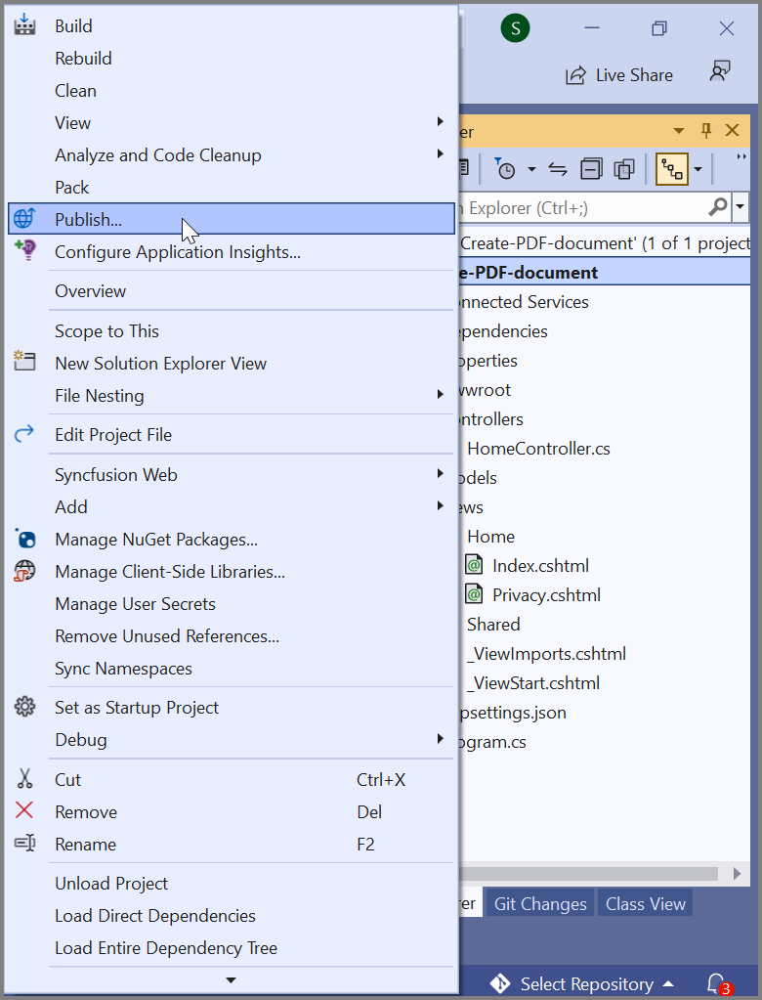

Step 2: Click the **Add a Publish Profile** button. Sign in to your Azure account if prompted.
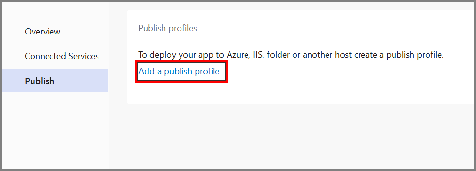

Step 3: Select the publish target as **Azure**.
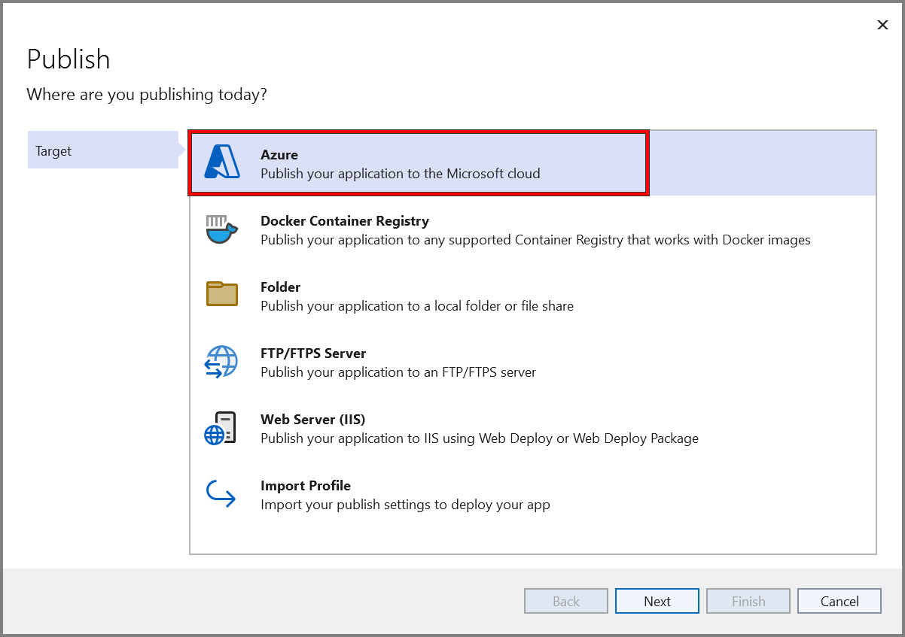

Step 4: Select the specific target as **Azure App Service (Windows)**.
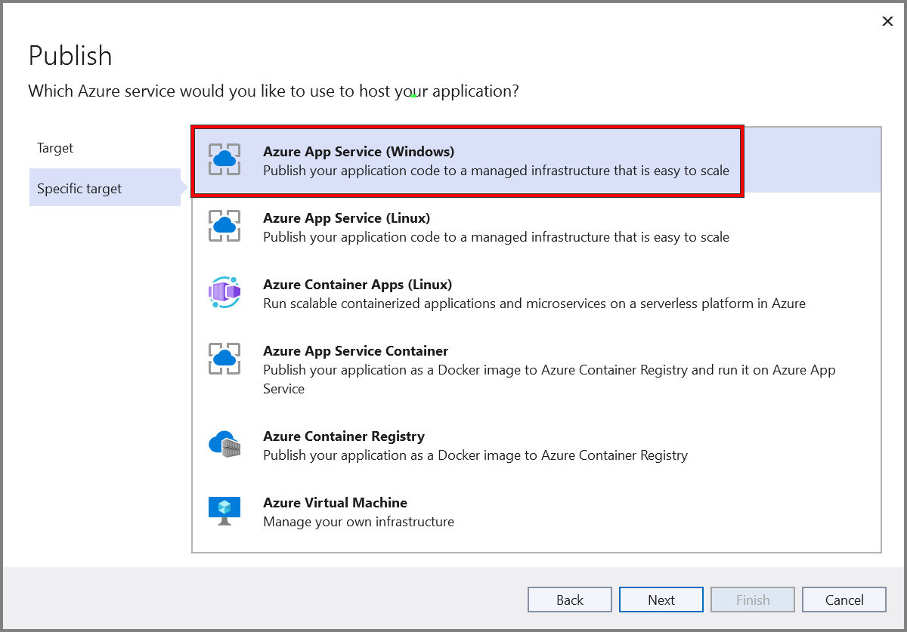

Step 5: To create a new app service, click the **Create new** option.


Step 6: Configure the **App Service name**, **Subscription**, **Resource Group**, and **App Service Plan**, then click the **Create** button to proceed with the App Service creation.
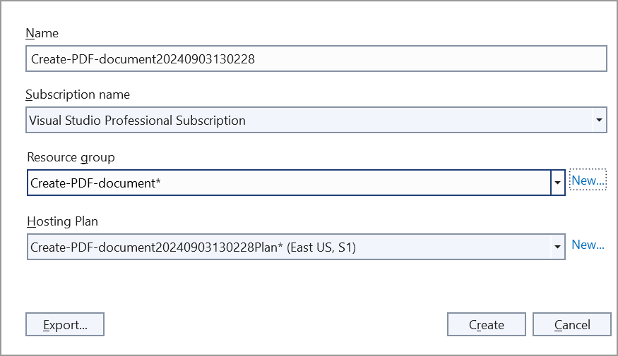

Step 7: Click the **Finish** button to finalize the **App Service** creation.
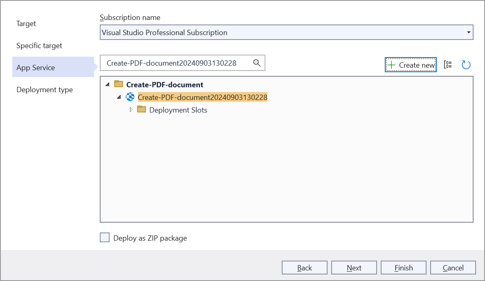

Step 8: Click the **Close** button.
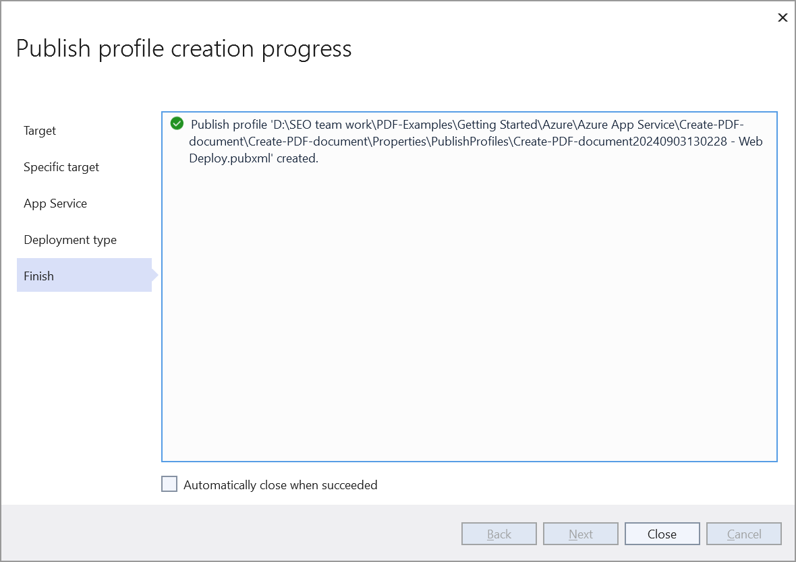

Step 9: Click the **Publish** button.
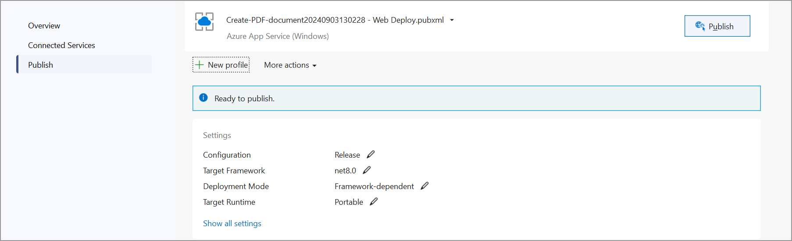

Step 10: Publishing has succeeded.
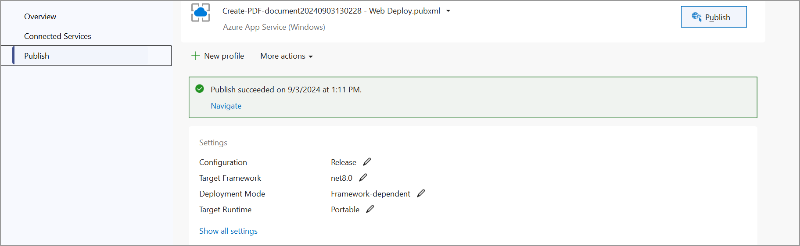

Step 11: The published webpage opens in the browser. 
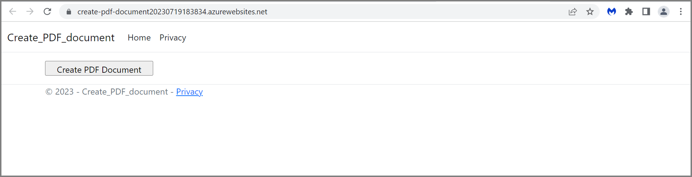

Step 12: Click the **Create PDF document** button to generate the PDF document. The output PDF document appears as follows.


You can download a complete working sample from [GitHub](https://github.com/SyncfusionExamples/PDF-Examples/tree/master/Getting%20Started/Azure/Azure%20App%20Service).

Click [here](https://www.syncfusion.com/document-sdk/net-pdf-library) to explore the rich set of Syncfusion PDF library features. 

An online sample to [create a PDF document](https://document.syncfusion.com/demos/pdf/default#/tailwind) is also available.

## Troubleshooting

* **Image not found (`AdventureCycle.jpg`)** — Confirm the image is placed at `wwwroot/Data/AdventureCycle.jpg` and is included in the project (set **Copy to Output Directory** to **Copy if newer**).
* **500 error after deployment** — Open the **Output** window in Visual Studio and the **App Service log stream** for stack traces. Common causes are missing NuGet packages or unsupported target framework.
* **PDF downloads as a blank or corrupted file** — Ensure the `MemoryStream` is reset (`stream.Position = 0`) before returning, as shown in the example.
* **Deployment fails** — Verify the selected **App Service Plan** supports the chosen .NET runtime. Windows plans support .NET Framework and modern .NET; Linux plans support modern .NET only.

## See also

* [Create a PDF document in .NET](https://help.syncfusion.com/document-processing/pdf/pdf-library/net/create-pdf-file-in-asp-net-core)
* [Azure App Service on Windows documentation](https://learn.microsoft.com/en-us/azure/app-service/overview)
* [Syncfusion.Pdf.Net.Core NuGet package](https://www.nuget.org/packages/Syncfusion.Pdf.Net.Core/)
* [Syncfusion licensing overview](https://help.syncfusion.com/common/essential-studio/licensing/overview) 

## Next Steps

Explore advanced PDF capabilities and Azure integration patterns:

### Advanced PDF Features
- **[Merge Multiple PDFs](https://help.syncfusion.com/document-processing/pdf/pdf-library/net/merge-documents)** — Combine multiple reports into a single document
- **[Split PDF Documents](https://help.syncfusion.com/document-processing/pdf/pdf-library/net/split-documents)** — Extract specific pages or create filtered PDFs
- **[Add Watermarks](https://help.syncfusion.com/document-processing/pdf/pdf-library/net/working-with-watermarks)** — Brand PDFs with company logos and confidentiality markers
- **[Create Interactive Forms](https://help.syncfusion.com/document-processing/pdf/pdf-library/net/working-with-forms)** — Build fillable PDF forms for data collection
- **[Digital Signatures](https://help.syncfusion.com/document-processing/pdf/pdf-library/net/working-with-digitalsignature)** — Sign PDFs programmatically for compliance
