# Create PDF document in Azure Functions v1

The [.NET PDF library](https://www.syncfusion.com/document-sdk/net-pdf-library) is used to create, read, edit PDF documents programmatically without the dependency on Adobe Acrobat. Using this library, you can **create a PDF document in Azure Functions v1**.

> **Note: Azure Functions v1 is deprecated.** Microsoft ended support for the Azure Functions v1 runtime on **November 14, 2022**. For new projects, use [Azure Functions v4](create-pdf-document-in-azure-functions-v4.md). This v1 guide is provided only for maintaining existing applications.

## Prerequisites

* An active **Microsoft Azure subscription**. If you don't have one, [create a free account](https://azure.microsoft.com/free/) before starting.
* **Visual Studio 2019 or later** with the **Azure development** workload installed.
* **Azure Functions Core Tools** version 2.x or later (matching the v1 runtime templates).
* **.NET Framework 4.7.2** or later (the v1 runtime supports only the in-process .NET Framework worker).
* A valid Syncfusion license key. Refer to the [licensing documentation](https://help.syncfusion.com/common/essential-studio/licensing/overview) to learn how to register a Syncfusion license key in your application.

## Steps to create a PDF document in Azure Functions v1

Step 1: Create a new Azure Functions project in Visual Studio.
 

Step 2: Set the project name and select the location.
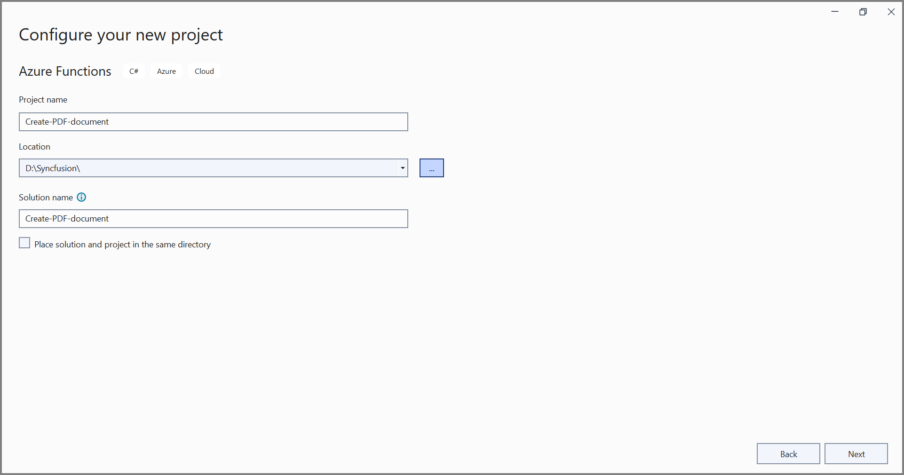

Step 3: Select the function worker as **.NET Framework** and the **Azure Functions v1 (.NET Framework)** runtime.
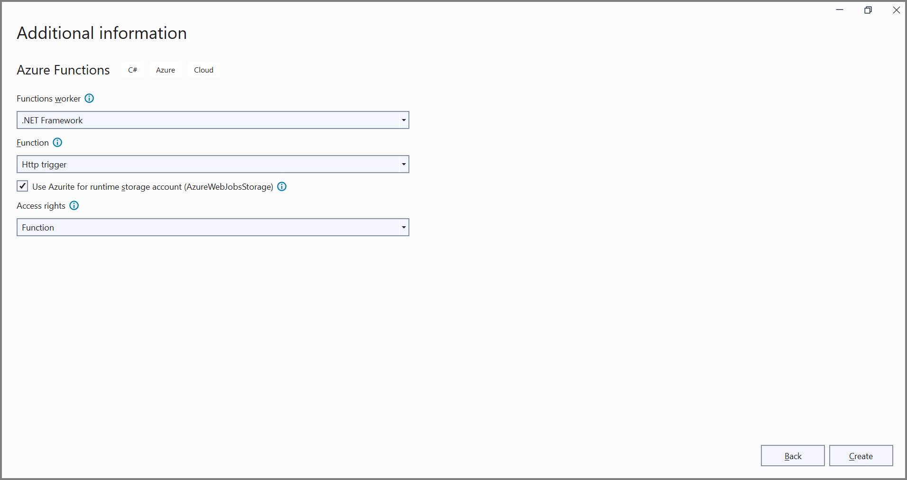

Step 4: Install the [Syncfusion.PDF.AspNet](https://www.nuget.org/packages/Syncfusion.Pdf.AspNet) NuGet package as a reference in your project from [NuGet.org](https://www.nuget.org/). You can also use the NuGet Package Manager Console:

```powershell
Install-Package Syncfusion.Pdf.AspNet
```

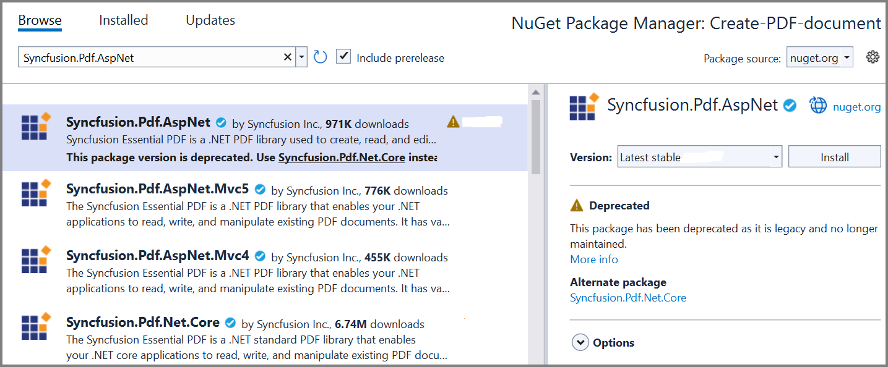

N> Starting with v16.2.0.x, if you reference Syncfusion assemblies from a trial setup or from the NuGet feed, you must also add the **Syncfusion.Licensing** assembly reference and include a license key in your project. Refer to the [licensing documentation](https://help.syncfusion.com/common/essential-studio/licensing/overview) for details.

Step 5: Include the following namespaces in the **Function1.cs** file. `System.IO`, `System.Reflection`, `System.Net.Http`, and `System.Net.Http.Headers` are required for the `MemoryStream`, `Assembly`, `HttpResponseMessage`, and content-header types used in the code.




using System.IO;
using System.Reflection;
using System.Net.Http;
using System.Net.Http.Headers;
using System.Drawing;
using Syncfusion.Pdf;
using Syncfusion.Pdf.Graphics;
using Syncfusion.Pdf.Grid;




N> The sample image is loaded as an embedded resource using `GetManifestResourceStream`. Before building, add the `AdventureCycle.jpg` file to the `Data` folder, then in **Solution Explorer** set its **Build Action** to **Embedded Resource**. The runtime name `Create-PDF-document.Data.AdventureCycle.jpg` follows the pattern `<DefaultNamespace>.<FolderPath>.<FileName>`; update it if your project namespace differs.

Step 6: Add the following code in the `Run` method of the `Function1` class to create a PDF document in Azure Functions and return the resulting PDF document.



//Create a new PDF document.
PdfDocument document = new PdfDocument();
//Set the page size.
document.PageSettings.Size = PdfPageSize.A4;
//Add a page to the document.
PdfPage page = document.Pages.Add();

//Create PDF graphics for the page.
PdfGraphics graphics = page.Graphics;
//Load the image from the disk.
var assembly = Assembly.GetExecutingAssembly();
var imageStream = assembly.GetManifestResourceStream("Create-PDF-document.Data.AdventureCycle.jpg");
PdfBitmap image = new PdfBitmap(imageStream);
//Draw an image.
graphics.DrawImage(image, new RectangleF(130, 0, 250, 100));

//Draw header text. 
graphics.DrawString("Adventure Works Cycles", new PdfStandardFont(PdfFontFamily.TimesRoman, 20, PdfFontStyle.Bold), PdfBrushes.Gray, new PointF(150, 150));

//Add paragraph. 
string text = "Adventure Works Cycles, the fictitious company on which the AdventureWorks sample databases are based, is a large, multinational manufacturing company. The company manufactures and sells metal and composite bicycles to North American, European and Asian commercial markets. While its base operation is located in Washington with 290 employees, several regional sales teams are located throughout their market base.";
//Create a text element with the text and font.
PdfTextElement textElement = new PdfTextElement(text, new PdfStandardFont(PdfFontFamily.TimesRoman, 12));
//Draw the text in the first column.
textElement.Draw(page, new RectangleF(0, 200, page.GetClientSize().Width, page.GetClientSize().Height));

//Create a PdfGrid.
PdfGrid pdfGrid = new PdfGrid();
//Add values to the list.
List<object> data = new List<object>();
Object row1 = new { Product_ID = "1001", Product_Name = "Bicycle", Price = "10,000" };
Object row2 = new { Product_ID = "1002", Product_Name = "Head Light", Price = "3,000" };
Object row3 = new { Product_ID = "1003", Product_Name = "Break wire", Price = "1,500" };
data.Add(row1);
data.Add(row2);
data.Add(row3);
//Add list to IEnumerable.
IEnumerable<object> dataTable = data;
//Assign data source.
pdfGrid.DataSource = dataTable;
//Apply built-in table style.
pdfGrid.ApplyBuiltinStyle(PdfGridBuiltinStyle.GridTable4Accent3);
//Draw the grid to the page of PDF document.
pdfGrid.Draw(graphics, new RectangleF(0, 300, page.Size.Width - 80, 0));

//Save and close the PDF document  
MemoryStream ms = new MemoryStream();
document.Save(ms);
document.Close();
ms.Position = 0;

HttpResponseMessage response = new HttpResponseMessage(HttpStatusCode.OK);
response.Content = new ByteArrayContent(ms.ToArray());
response.Content.Headers.ContentDisposition = new ContentDispositionHeaderValue("attachment")
{
    FileName = "Sample.pdf"
};
response.Content.Headers.ContentType = new System.Net.Http.Headers.MediaTypeHeaderValue("application/pdf");
return response;




Step 7: Right-click the project and select **Publish**. Then, create a new profile in the **Publish** window. Sign in to your Azure account if prompted.
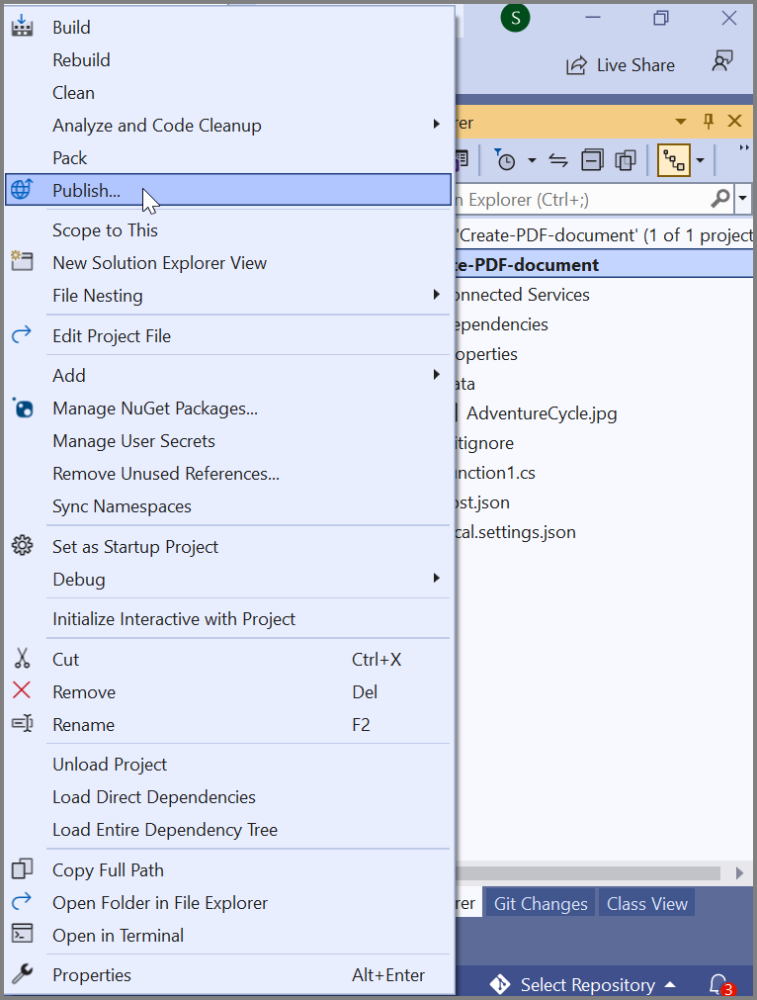

Step 8: Select the target as **Azure** and click the **Next** button.
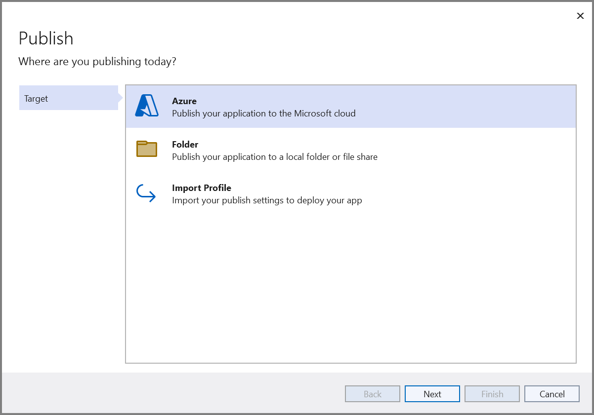

Step 9: Click the **Create new** button.
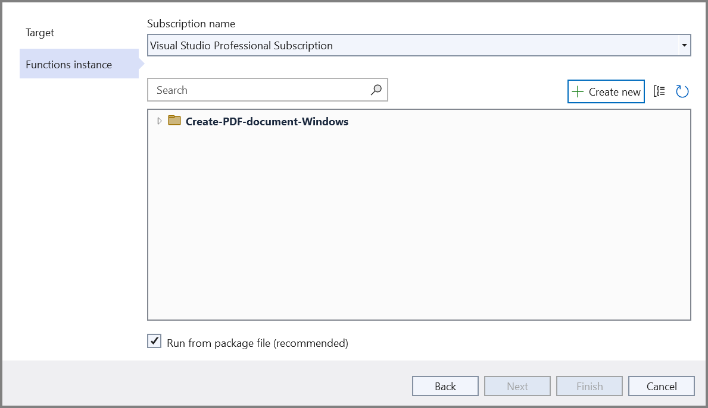

Step 10: Configure the **App name**, **Subscription**, **Resource Group**, **Hosting Plan**, and **Storage account**, then click the **Create** button.
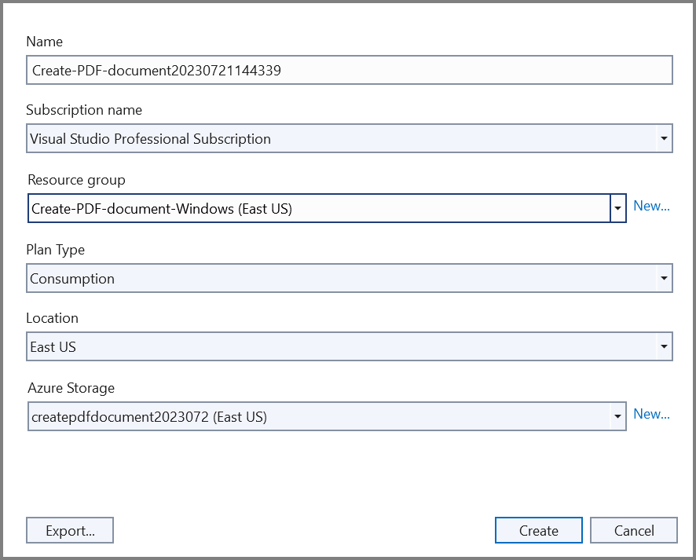

Step 11: After the Function App is created, click the **Finish** button.
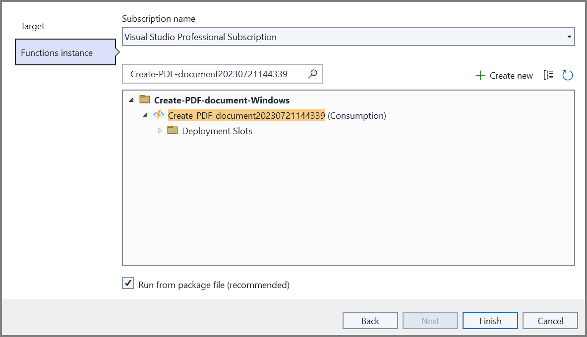

Step 12: Click the **Publish** button.
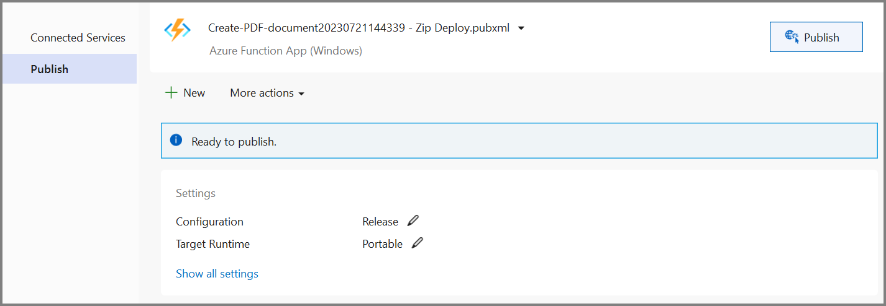

Step 13: Publishing has succeeded.
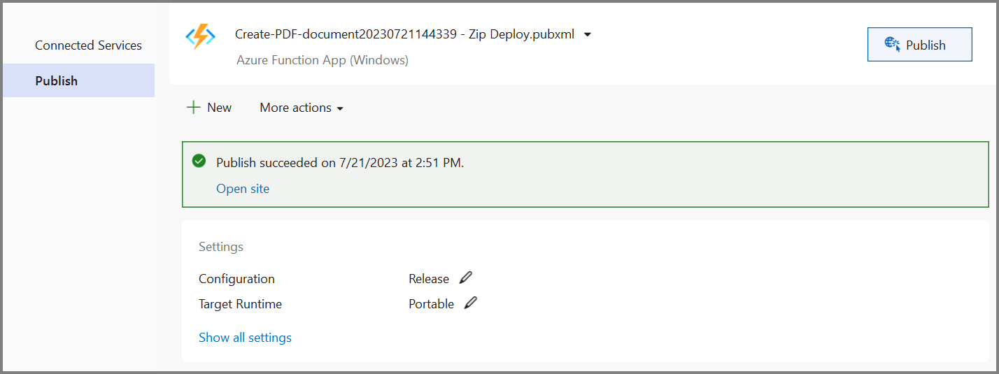

Step 14: Open the **Azure portal**, navigate to the **Function App**, select the function, then click **Get function URL > Copy**. Paste the URL into a new browser tab. The PDF document downloads as follows.
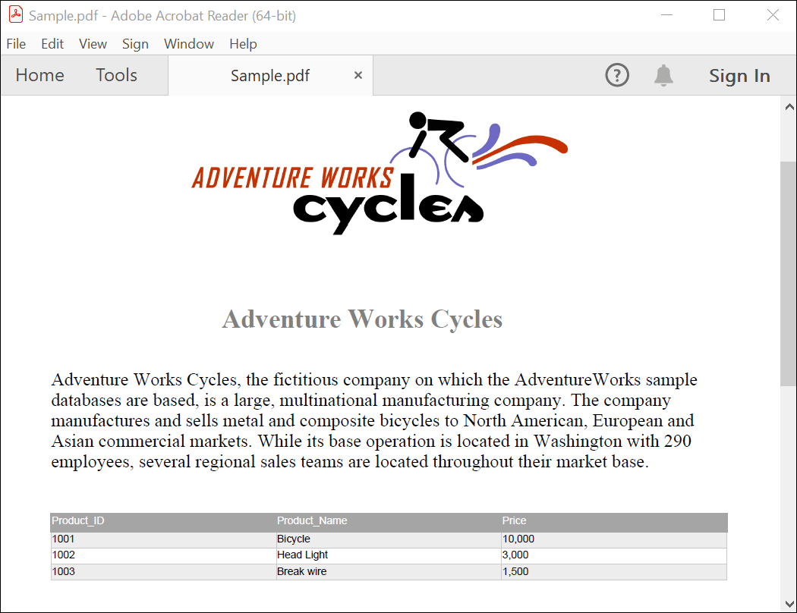

N> If the function is not anonymous, the copied URL includes a `?code=…` query string parameter. Keep the parameter intact when pasting into the browser, or the request will return **401 Unauthorized**.

You can download a complete working sample from [GitHub](https://github.com/SyncfusionExamples/PDF-Examples/tree/master/Getting%20Started/Azure/Azure%20Function%20V1).

Click [here](https://www.syncfusion.com/document-sdk/net-pdf-library) to explore the rich set of Syncfusion PDF library features.

An online sample to [create a PDF document](https://document.syncfusion.com/demos/pdf/default#/tailwind) is also available.

## Troubleshooting

* **`NullReferenceException` from `GetManifestResourceStream`** — The image must be added as an **Embedded Resource** and the resource name must follow the `<RootNamespace>.<FolderPath>.<FileName>` pattern. Verify the name with `assembly.GetManifestResourceNames()`.
* **401 Unauthorized when invoking the function URL** — The function is secured by a function key. Append the `?code=…` query string returned by **Get function URL**, or switch the `HttpTrigger` attribute to `AuthLevel.Anonymous` for testing.
* **PDF returns as an empty/corrupted file** — Ensure `ms.Position = 0;` is set before copying to `ByteArrayContent` (the existing code does this correctly).
* **NuGet restore fails on .NET Framework** — `Syncfusion.Pdf.AspNet` is a legacy package; if it does not restore, pin a specific older version (for example, `Install-Package Syncfusion.Pdf.AspNet -Version 19.4.0.55`) compatible with your target framework.
* **Functions v1 runtime not listed in Visual Studio** — Install the **Azure Functions v1 (.NET Framework)** template via the Visual Studio Installer under **Individual components**.

## See also

* [Create a PDF document in Azure Functions v4](create-pdf-document-in-azure-functions-v4.md) — recommended for new projects.
* [Create a PDF document in .NET](https://help.syncfusion.com/document-processing/pdf/pdf-library/net/create-pdf-file-in-asp-net-core)
* [Azure Functions v1 runtime deprecation announcement](https://learn.microsoft.com/en-us/azure/azure-functions/functions-versions?tabs=isolated-process%2Cv4&pivots=programming-language-csharp)
* [Syncfusion.Pdf.AspNet NuGet package](https://www.nuget.org/packages/Syncfusion.Pdf.AspNet)
* [Syncfusion licensing overview](https://help.syncfusion.com/common/essential-studio/licensing/overview)

## Next Steps

Explore advanced PDF capabilities and Azure integration patterns:

### Advanced PDF Features
- **[Merge Multiple PDFs](https://help.syncfusion.com/document-processing/pdf/pdf-library/net/merge-documents)** — Combine multiple reports into a single document
- **[Split PDF Documents](https://help.syncfusion.com/document-processing/pdf/pdf-library/net/split-documents)** — Extract specific pages or create filtered PDFs
- **[Add Watermarks](https://help.syncfusion.com/document-processing/pdf/pdf-library/net/working-with-watermarks)** — Brand PDFs with company logos and confidentiality markers
- **[Create Interactive Forms](https://help.syncfusion.com/document-processing/pdf/pdf-library/net/working-with-forms)** — Build fillable PDF forms for data collection
- **[Digital Signatures](https://help.syncfusion.com/document-processing/pdf/pdf-library/net/working-with-digitalsignature)** — Sign PDFs programmatically for compliance