# Create a PDF File in Azure Functions v4

The [.NET PDF library](https://www.syncfusion.com/document-sdk/net-pdf-library) is used to create, read, edit PDF documents programmatically without the dependency of Adobe Acrobat. Using this library, you can generate PDF documents in Azure Functions v4 runtime with modern .NET 6.0+ support.

## Prerequisites

| Requirement | Details |
|-------------|---------|
| **IDE** | Visual Studio 2022 or later |
| **.NET Version** | .NET 8.0 (Long-term support) or .NET 6.0+ |
| **NuGet Package** | Syncfusion.Pdf.NET v16.2.0.x or later |
| **Azure Subscription** | Required to deploy to Azure |
| **Azure Tools** | Azure Functions Core Tools v4.x or Visual Studio Azure workload |
| **Licensing** | Syncfusion license key (required v16.2.0.x+) |
| **Image Assets** | AdventureCycle.jpg embedded as resource file |

> **Note**: Azure Functions v4 runtime uses modern .NET runtime (.NET 6.0+) with improved performance and features compared to v1.

## Steps to create a PDF document in Azure Functions v4

### Setting Up the Project

**Step 1**: Create a new Azure Functions project in Visual Studio by selecting **File > New > Project** and searching for "Azure Functions".

 

**Step 2**: Enter a project name and select the project location, then click **Create**.


**Step 3**: In the configuration dialog, select **.NET 8.0 (Long-term support)** as the function runtime.

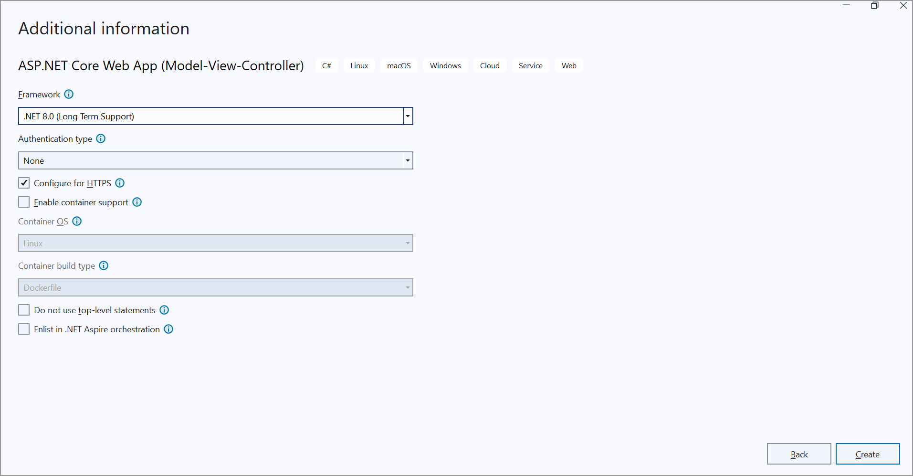

**Step 4**: Install the [Syncfusion.Pdf.Net.Core](https://www.nuget.org/packages/Syncfusion.Pdf.NET) NuGet package. Use the Package Manager Console or NuGet Package Manager UI.

```bash
Install-Package Syncfusion.Pdf.NET
```

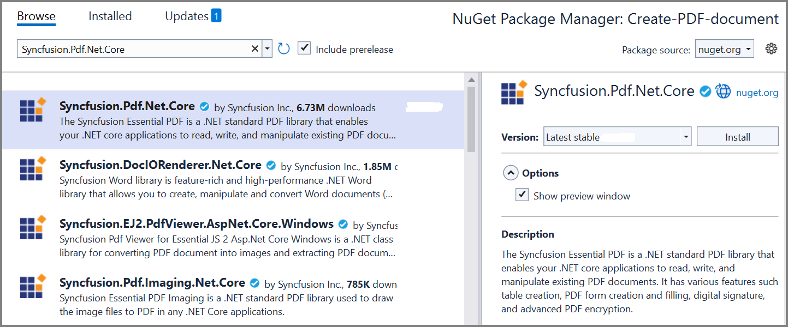

**Step 5**: Configure the Syncfusion license key in your Azure Function. Add the following code to the **Program.cs** file before building services:

```csharp
// In Program.cs - add this before var host = builder.Build();
Syncfusion.Licensing.SyncfusionLicenseProvider.RegisterLicense("YOUR_LICENSE_KEY");
```

> **Important**: Starting with Syncfusion v16.2.0.x, a license key is required. Obtain a free community license from [Syncfusion Community License](https://help.syncfusion.com/common/essential-studio/licensing/community-license). See [licensing documentation](https://help.syncfusion.com/common/essential-studio/licensing/overview) for registration details.

**Step 6**: Include the following namespaces in the **Function1.cs** file.




using System;
using System.IO;
using System.Reflection;
using System.Collections.Generic;
using System.Net;
using System.Net.Http;
using System.Net.Http.Headers;
using Microsoft.Azure.Functions.Worker;
using Microsoft.Azure.Functions.Worker.Http;
using Microsoft.Extensions.Logging;
using Syncfusion.Pdf;
using Syncfusion.Pdf.Graphics;
using Syncfusion.Pdf.Grid;
using Syncfusion.Drawing;





**Step 7**: Add the following code example to the **Run** method of the **Function1** class. This generates a PDF document and returns it as an HTTP response for download.




public class Function1
{
    private readonly ILogger<Function1> _logger;

    public Function1(ILogger<Function1> logger)
    {
        _logger = logger;
    }

    [Function("CreatePDFDocument")]
    public HttpResponseData Run([HttpTrigger(AuthorizationLevel.Function, "get", "post", Route = null)] HttpRequestData req)
    {
        try
        {
            _logger.LogInformation("PDF document generation started.");

            // Create a new PDF document
            using (PdfDocument document = new PdfDocument())
            {
                // Set page size
                document.PageSettings.Size = PdfPageSize.A4;
                PdfPage page = document.Pages.Add();
                PdfGraphics graphics = page.Graphics;

                // Load and draw image from embedded resource
                Assembly assembly = Assembly.GetExecutingAssembly();
                string resourcePath = "CreatePDFDocument.Data.AdventureCycle.jpg";
                
                using (Stream imageStream = assembly.GetManifestResourceStream(resourcePath))
                {
                    if (imageStream != null)
                    {
                        using (PdfBitmap image = new PdfBitmap(imageStream))
                        {
                            graphics.DrawImage(image, new RectangleF(130, 0, 250, 100));
                        }
                    }
                    else
                    {
                        _logger.LogWarning($"Embedded resource not found: {resourcePath}");
                    }
                }

                // Draw header text
                PdfStandardFont titleFont = new PdfStandardFont(PdfFontFamily.TimesRoman, 20, PdfFontStyle.Bold);
                graphics.DrawString("Adventure Works Cycles", titleFont, PdfBrushes.Black, new PointF(150, 150));

                // Add description paragraph
                string text = "Adventure Works Cycles is a multinational manufacturing company that produces metal and composite bicycles for commercial markets across North America, Europe, and Asia. Based in Washington with 290 employees at headquarters, the company operates regional sales teams throughout its market territories.";
                PdfTextElement textElement = new PdfTextElement(text, new PdfStandardFont(PdfFontFamily.TimesRoman, 12));
                textElement.Draw(page, new RectangleF(0, 200, page.GetClientSize().Width, page.GetClientSize().Height));

                // Create product data grid
                List<object> data = new List<object>
                {
                    new { Product_ID = "1001", Product_Name = "Bicycle", Price = "$10,000" },
                    new { Product_ID = "1002", Product_Name = "Head Light", Price = "$3,000" },
                    new { Product_ID = "1003", Product_Name = "Brake Wire", Price = "$1,500" },
                    new { Product_ID = "1004", Product_Name = "Pedal Set", Price = "$2,000" },
                    new { Product_ID = "1005", Product_Name = "Chain", Price = "$500" }
                };

                // Create and format grid
                PdfGrid pdfGrid = new PdfGrid();
                pdfGrid.DataSource = data;
                pdfGrid.ApplyBuiltinStyle(PdfGridBuiltinStyle.GridTable4Accent3);
                pdfGrid.Draw(graphics, new RectangleF(0, 300, page.Size.Width - 80, 0));

                // Save to memory stream and return as response
                using (MemoryStream memoryStream = new MemoryStream())
                {
                    document.Save(memoryStream);
                    memoryStream.Position = 0;

                    // Create HTTP response with PDF attachment
                    var response = req.CreateResponse(HttpStatusCode.OK);
                    response.Headers.Add("Content-Disposition", "attachment; filename=AdventureWorks.pdf");
                    response.Headers.Add("Content-Type", "application/pdf");
                    response.WriteBytes(memoryStream.ToArray());

                    _logger.LogInformation("PDF document generated successfully.");
                    return response;
                }
            }
        }
        catch (Exception ex)
        {
            _logger.LogError($"Error generating PDF: {ex.Message}\n{ex.StackTrace}");
            var errorResponse = req.CreateResponse(HttpStatusCode.InternalServerError);
            errorResponse.WriteString($"{{\"error\": \"PDF generation failed: {ex.Message}\"}}");
            return errorResponse;
        }
    }
}





> **Important**: Replace `"YOUR_LICENSE_KEY"` in Program.cs with your actual Syncfusion license key. The resource path `"CreatePDFDocument.Data.AdventureCycle.jpg"` assumes the image is embedded in a `Data` folder. Adjust the path based on your project structure.

### Local Testing

**Step 8**: Before deploying to Azure, test the function locally using Azure Functions Core Tools. Press **F5** in Visual Studio or run:

```bash
func start
```

The local runtime starts and displays function URLs. Navigate to `http://localhost:7071/api/CreatePDFDocument` in your browser to test PDF generation locally.

### Deploying to Azure

**Step 9**: Right-click the project in Solution Explorer and select **Publish** to open the publish profile wizard.

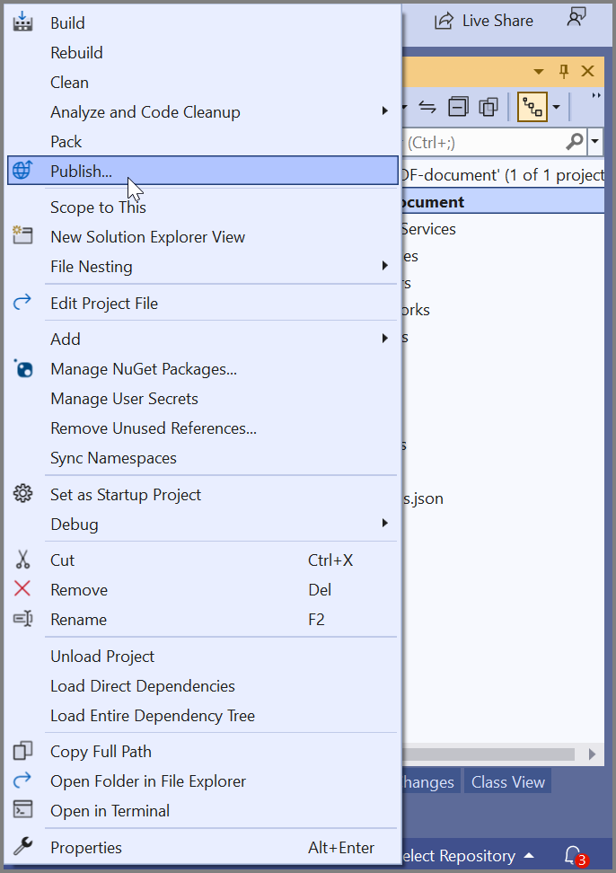

**Step 10**: Select **Azure** as the publish target and click **Next**.

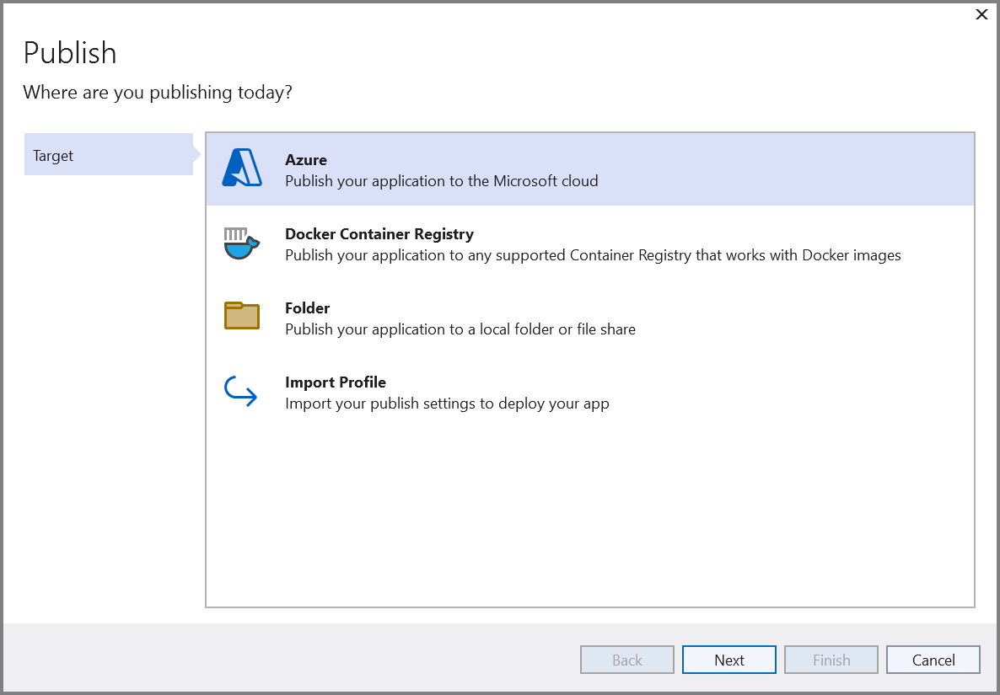

**Step 11**: Choose **Azure Function App (Windows)** as the specific deployment target and click **Next**.

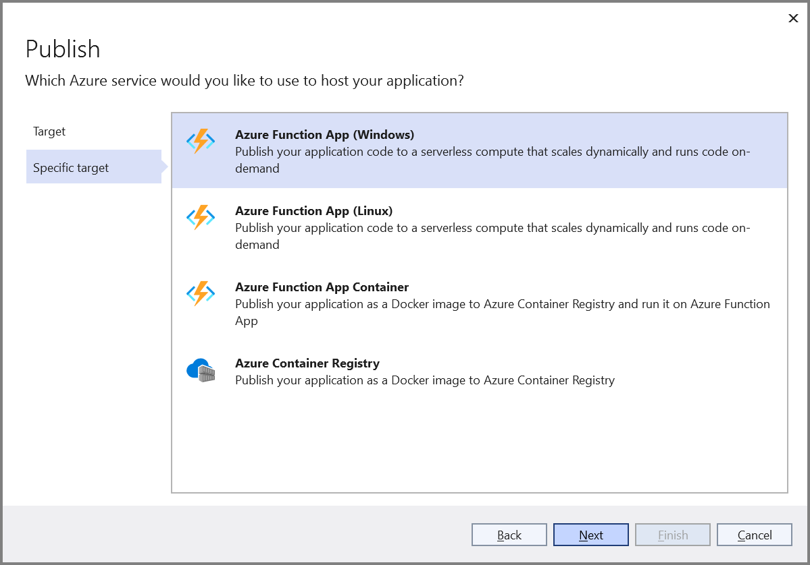

**Step 12**: Click **Create new** to set up a new Function App on Azure.

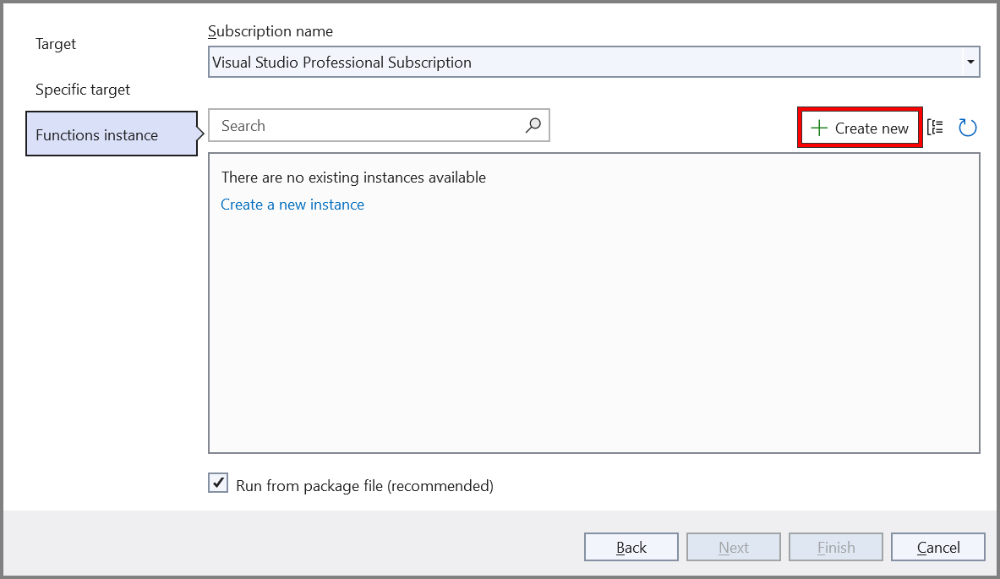

**Step 13**: Configure the Function App name, resource group, and hosting plan, then click **Create**.

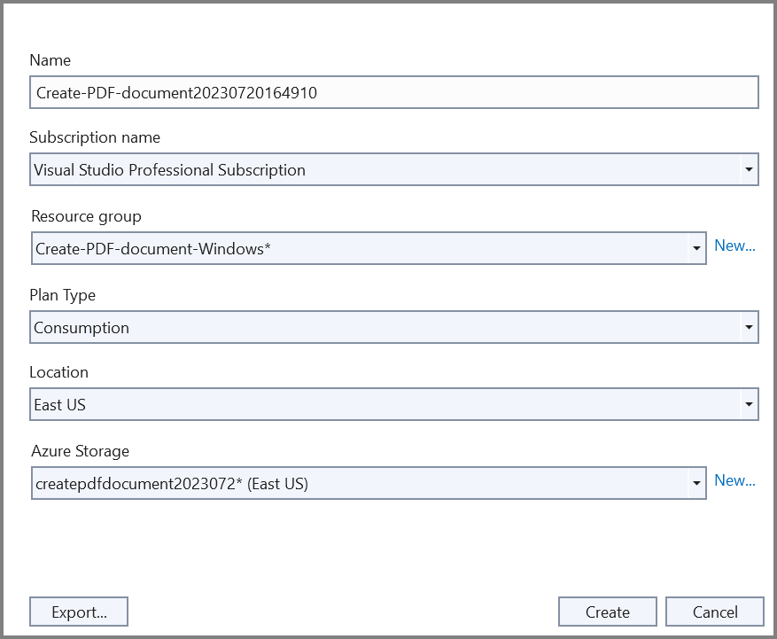

**Step 14**: After creating the Function App configuration, click **Finish** to complete setup.

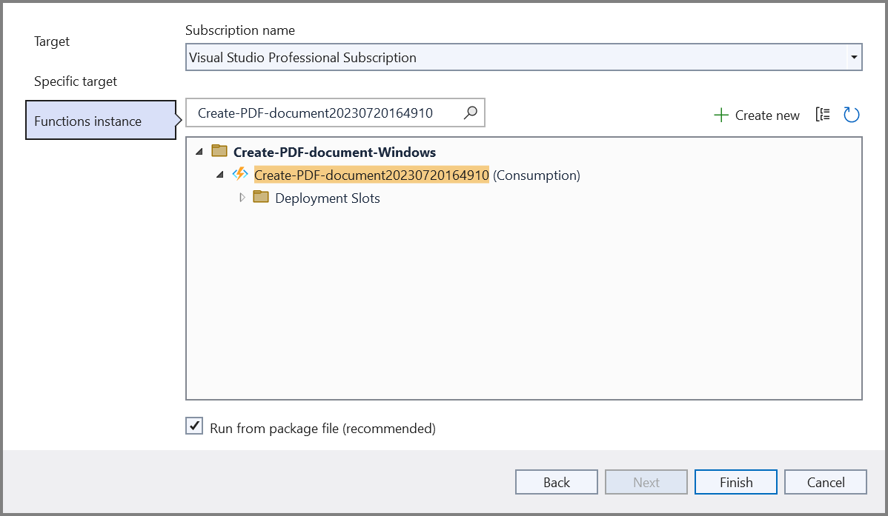

**Step 15**: Click **Close** to finalize the publish profile creation.

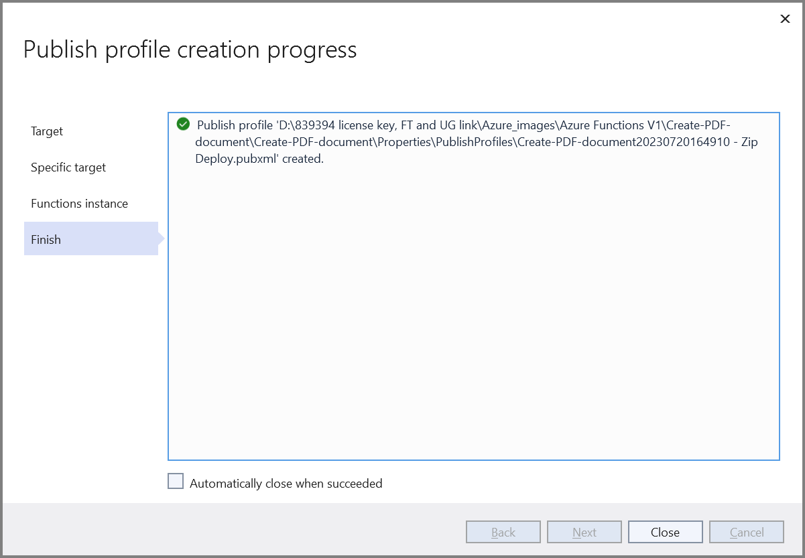

**Step 16**: Click the **Publish** button to deploy your function to Azure.

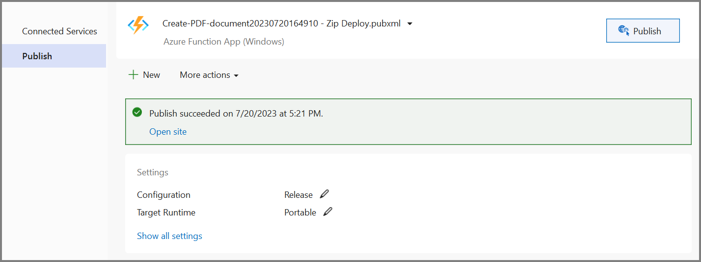

### Testing the Deployed Function

**Step 17**: Wait for publishing to complete. Navigate to your Function App in the Azure portal.

**Step 18**: Open the **CreatePDFDocument** function and click **Get Function URL**. Copy the full URL.

**Step 19**: Paste the function URL into a new browser tab and press Enter. The PDF file will download automatically.

**Expected Output:**

The generated PDF contains:
- Adventure Works Cycles company logo
- Company name and description
- Product information table with 5 sample items
- Professional formatting and styling

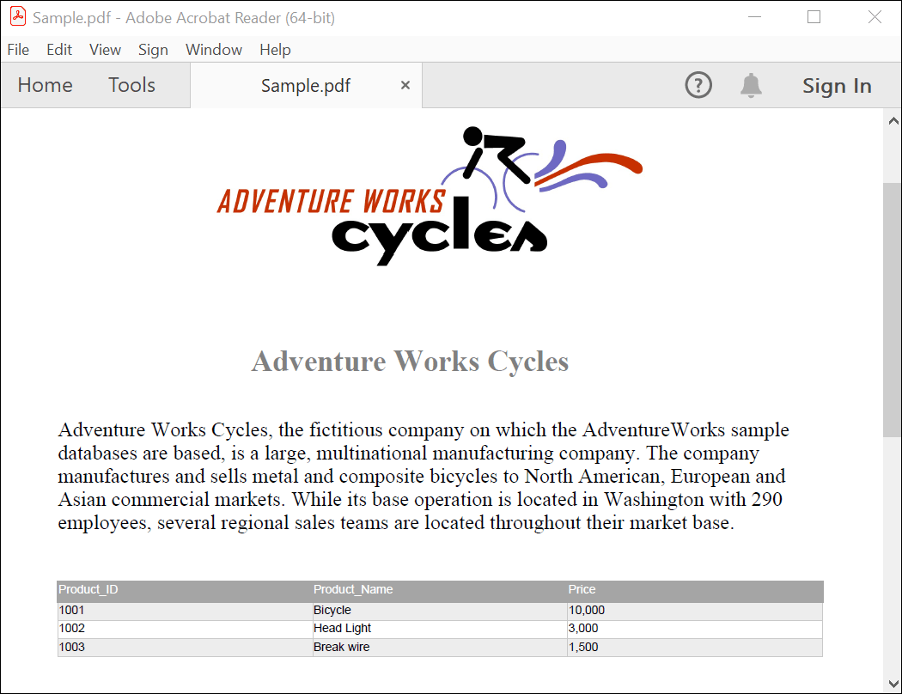

## Troubleshooting

| Issue | Solution |
|-------|----------|
| **License Key Not Registered** | Ensure `SyncfusionLicenseProvider.RegisterLicense()` is called in `Program.cs` before services are built. The license key must be registered at startup for all PDF operations to work. |
| **Embedded Resource Not Found** | Verify the image file is marked as "Embedded Resource" in project properties. Check the resource path matches your project namespace (e.g., "CreatePDFDocument.Data.AdventureCycle.jpg"). |
| **Syncfusion.Pdf.NET Package Not Found** | Run `Install-Package Syncfusion.Pdf.NET` in Package Manager Console. Verify the package version is v16.2.0.x or later for .NET 6.0+ support. |
| **"The name 'req' does not exist" Compile Error** | Azure Functions v4 uses `HttpRequestData` parameter. Ensure the function parameter is named `req` or use `req.CreateResponse()` method for responses. |
| **PDF Generation Fails on Deployment** | Check Azure Function logs in the portal (Monitoring → Logs or Application Insights). Common causes: missing NuGet packages, resource path incorrect, or insufficient permissions. |
| **Function Timeout (5 minutes)** | Large PDF generation can exceed timeout limits. Optimize image sizes, use async operations, or split PDF generation into smaller chunks. |
| **"Access Denied" Error** | Ensure the function app has read permissions for embedded resources. Check Azure App Service file system permissions and resource isolation settings. |
| **Memory Issues with Large PDFs** | Monitor memory usage in Application Insights. For production use, consider Azure Functions Premium Plan with higher memory allocation. Optimize image compression. |
| **Dependency Injection Not Working** | Ensure `ILogger<Function1>` is properly injected in the constructor. Verify the function is declared as a public class (not static) for DI container support. |
| **Licensing Errors in Production** | License bindings may differ between development and Azure environments. Contact Syncfusion Support for deployment licensing or upgrade to a production license. |

## Next Steps

Explore advanced PDF capabilities and Azure integration patterns:

### Advanced PDF Features
- **[Merge Multiple PDFs](https://help.syncfusion.com/file-formats/pdf/working-with-documents/merge-documents)** — Combine multiple reports or documents into a single PDF
- **[Split PDF Documents](https://help.syncfusion.com/file-formats/pdf/split-document)** — Extract specific pages or create filtered PDFs
- **[Add Watermarks](https://help.syncfusion.com/file-formats/pdf/working-with-pages/add-watermark)** — Add company logos, confidentiality markers, or page numbers
- **[Create Interactive Forms](https://help.syncfusion.com/file-formats/pdf/working-with-forms/overview)** — Build fillable PDF forms for data collection
- **[Digital Signatures](https://help.syncfusion.com/file-formats/pdf/working-with-forms/create-digital-signatures)** — Sign PDFs programmatically for compliance
- **[PDF Encryption](https://help.syncfusion.com/file-formats/pdf/working-with-forms/encryption)** — Protect sensitive documents with passwords and permissions

### Azure Integration Patterns
- **[Store PDFs in Azure Blob Storage](https://learn.microsoft.com/en-us/azure/storage/blobs/storage-blobs-introduction)** — Scalable storage for generated documents
- **[Trigger from Azure Storage Events](https://learn.microsoft.com/en-us/azure/azure-functions/functions-bindings-storage-blob)** — Generate PDFs automatically when files are uploaded
- **[Monitor with Application Insights](https://learn.microsoft.com/en-us/azure/azure-monitor/app/app-insights-overview)** — Track PDF generation performance and errors
- **[Use Azure Queue Storage for Batching](https://learn.microsoft.com/en-us/azure/azure-functions/functions-bindings-storage-queue)** — Queue PDF generation requests for async processing

## Resources

**Sample Code:**
- [Complete working sample on GitHub](https://github.com/SyncfusionExamples/PDF-Examples/tree/master/Getting%20Started/Azure/Azure%20Function%20V4)

**Documentation:**
- [Syncfusion .NET PDF Library Guide](https://help.syncfusion.com/file-formats/pdf/)
- [Azure Functions v4 Runtime Reference](https://learn.microsoft.com/en-us/azure/azure-functions/functions-versions?tabs=v4)
- [Azure Functions Core Tools](https://learn.microsoft.com/en-us/azure/azure-functions/functions-run-local)
- [Dependency Injection in Azure Functions](https://learn.microsoft.com/en-us/azure/azure-functions/functions-dotnet-dependency-injection)

**Try It Out:**
- [Syncfusion PDF Online Demo](https://document.syncfusion.com/demos/pdf/default#/tailwind)
- [Azure Free Account](https://azure.microsoft.com/en-us/free/)