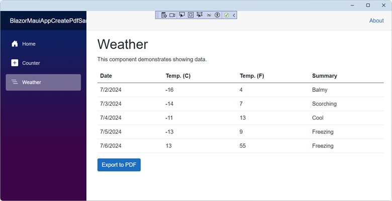

# Create or Generate PDF file in Blazor

The Syncfusion&reg; [Blazor PDF library](https://www.syncfusion.com/document-processing/pdf-framework/blazor/pdf-library) creates, reads, and edits PDF documents. This library also offers functionality to merge, split, stamp, forms, and secure PDF files.

To include the Syncfusion&reg; Blazor PDF library into Blazor applications, refer to the [NuGet Package Required](https://help.syncfusion.com/document-processing/pdf/pdf-library/net/nuget-packages-required) or [Assemblies Required](https://help.syncfusion.com/document-processing/pdf/pdf-library/net/assemblies-required) documentation.

To quickly get started with creating a PDF document in Blazor, check this video:


## Steps to create PDF document in Blazor Server application





 









A complete working sample is available from [GitHub](https://github.com/SyncfusionExamples/PDF-Examples/tree/master/Getting%20Started/Blazor/ServerSideApplication).

The following output appears in the browser after executing the program.

Click the Export to PDF button to obtain the PDF document with the following output.

N> Server-Side Blazor applications are recommended to reduce the payload, which is high in Blazor Client-Side applications.

Click [here](https://www.syncfusion.com/document-processing/pdf-framework/blazor) to explore the rich set of Syncfusion&reg; PDF library features.

## Steps to create PDF document in Blazor WASM application





 









A complete working sample is available from [GitHub](https://github.com/SyncfusionExamples/PDF-Examples/tree/master/Getting%20Started/Blazor/ClientSideApplication).

The following output appears in the browser after executing the program.

Click the Export to PDF button to obtain the PDF document with the following output.
    

Click [here](https://www.syncfusion.com/document-processing/pdf-framework/blazor) to explore the rich set of Syncfusion&reg; PDF library features.

## Steps to create PDF documents in .NET MAUI Blazor application





 









A complete working sample is available from [GitHub](https://github.com/SyncfusionExamples/PDF-Examples/tree/master/Getting%20Started/Blazor/BlazorMauiAppCreatePdfSample).

The following output appears in the browser when clicking the "Weather" option in the left-side menu.

Click the `Export to PDF` button to obtain the PDF document with the following output.

### Save the PDF document on different platforms

Create a folder named `Services`, then add a class called `SaveService.cs` within this folder, and insert the following code into it.




    public partial class SaveService
    {
        //Method to save document as a file and view the saved document.
        public partial void SaveAndView(string filename, string contentType, MemoryStream stream);
    }





Platform-specific code implementation is required to save the PDF document across different platforms.

#### Android
Create a new class file named `SaveAndroid.cs` within the Android folder and add the following code to enable file saving on the Android platform.





    public partial void SaveAndView(string filename, string contentType, MemoryStream stream)
        {
            string exception = string.Empty;
            string? root = null;

            if (Android.OS.Environment.IsExternalStorageEmulated)
            {
                root = Android.App.Application.Context!.GetExternalFilesDir(Android.OS.Environment.DirectoryDownloads)!.AbsolutePath;
            }
            else
                root = System.Environment.GetFolderPath(System.Environment.SpecialFolder.MyDocuments);

            Java.IO.File myDir = new(root + "/Syncfusion");
            myDir.Mkdir();

            Java.IO.File file = new(myDir, filename);

            if (file.Exists())
            {
                file.Delete();
            }

            try
            {
                FileOutputStream outs = new(file);
                outs.Write(stream.ToArray());

                outs.Flush();
                outs.Close();
            }
            catch (Exception e)
            {
                exception = e.ToString();
            }
            if (file.Exists())
            {

                if (Build.VERSION.SdkInt >= Android.OS.BuildVersionCodes.N)
                {
                    var fileUri = AndroidX.Core.Content.FileProvider.GetUriForFile(Android.App.Application.Context, Android.App.Application.Context.PackageName + ".provider", file);
                    var intent = new Intent(Intent.ActionView);
                    intent.SetData(fileUri);
                    intent.AddFlags(ActivityFlags.NewTask);
                    intent.AddFlags(ActivityFlags.GrantReadUriPermission);
                    Android.App.Application.Context.StartActivity(intent);
                }
                else
                {
                    var fileUri = Android.Net.Uri.Parse(file.AbsolutePath);
                    var intent = new Intent(Intent.ActionView);
                    intent.SetDataAndType(fileUri, contentType);
                    intent = Intent.CreateChooser(intent, "Open File");
                    intent!.AddFlags(ActivityFlags.NewTask);
                    Android.App.Application.Context.StartActivity(intent);
                }

            }
        }





N> The Android SDK version 23 and above introduced a new runtime permission model. Include the following code for enabling the Android file provider to save and view the generated PDF document.

1.	Create a new XML file with the name of `file_paths.xml` under the Android project Resources/xml folder and add the following code in it.





    <?xml version="1.0" encoding="utf-8"?>
    <paths xmlns:android="http://schemas.android.com/apk/res/android">
        <external-path
            name="external"
            path="." />
        <external-files-path
            name="external_files"
            path="." />
        <cache-path
            name="cache"
            path="." />
        <external-cache-path
            name="external_cache"
            path="." />
        <files-path
            name="files"
            path="." />
    </paths>





2.	Add the following code to the `AndroidManifest.xml` file located under Properties/AndroidManifest.xml.





    <?xml version="1.0" encoding="utf-8"?>
    <manifest xmlns:android="http://schemas.android.com/apk/res/android">
        <application android:allowBackup="true" android:icon="@mipmap/appicon" android:roundIcon="@mipmap/appicon_round" android:supportsRtl="true">
            <provider
                    android:name="androidx.core.content.FileProvider"
                    android:authorities="${applicationId}.provider"
                    android:exported="false"
                    android:grantUriPermissions="true">
                <meta-data
                    android:name="android.support.FILE_PROVIDER_PATHS"
                    android:resource="@xml/file_paths" />
            </provider>
        </application>
        <uses-permission android:name="android.permission.ACCESS_NETWORK_STATE" />
        <uses-permission android:name="android.permission.INTERNET" />
    </manifest>





#### iOS
Create a new class file named `SaveIOS.cs` within the iOS folder and include the following code to enable file saving on the iOS platform.





    public partial void SaveAndView(string filename, string contentType, MemoryStream stream)
    {
        string exception = string.Empty;
        string path = Environment.GetFolderPath(Environment.SpecialFolder.Personal);
        string filePath = Path.Combine(path, filename);
        try
        {
            FileStream fileStream = File.Open(filePath, FileMode.Create);
            stream.Position = 0;
            stream.CopyTo(fileStream);
            fileStream.Flush();
            fileStream.Close();
        }
        catch (Exception e)
        {
            exception = e.ToString();
        }
        if (contentType != "application/html" || exception == string.Empty)
        {
            UIViewController? currentController = UIApplication.SharedApplication!.KeyWindow!.RootViewController;
            while (currentController!.PresentedViewController != null)
                currentController = currentController.PresentedViewController;

            QLPreviewController qlPreview = new();
            QLPreviewItem item = new QLPreviewItemBundle(filename, filePath);
            qlPreview.DataSource = new PreviewControllerDS(item);
            currentController.PresentViewController((UIViewController)qlPreview, true, null);
        }
    }





#### macOS
Create a new class file named `SaveMac.cs` within the MacCatalyst folder and include the following code to enable file saving on the macOS platform.





    public partial void SaveAndView(string filename, string contentType, MemoryStream stream)
    {
        string path = Environment.GetFolderPath(Environment.SpecialFolder.MyDocuments);
        string filePath = Path.Combine(path, filename);
        stream.Position = 0;
        //Saves the document
        using FileStream fileStream = new(filePath, FileMode.Create, FileAccess.ReadWrite);
        stream.CopyTo(fileStream);
        fileStream.Flush();
        fileStream.Dispose();

        UIWindow? window = GetKeyWindow();
        if (window != null && window.RootViewController != null)
        {
            UIViewController? uiViewController = window.RootViewController;
            if (uiViewController != null)
            {
                QLPreviewController qlPreview = new();
                QLPreviewItem item = new QLPreviewItemBundle(filename, filePath);
                qlPreview.DataSource = new PreviewControllerDS(item);
                uiViewController.PresentViewController((UIViewController)qlPreview, true, null);
            }
        }

    }
    public UIWindow? GetKeyWindow()
    {
        foreach (var scene in UIApplication.SharedApplication.ConnectedScenes)
        {
            if (scene is UIWindowScene windowScene)
            {
                foreach (var window in windowScene.Windows)
                {
                    if (window.IsKeyWindow)
                    {
                        return window;
                    }
                }
            }
        }

        return null;
    }





#### Windows
Create a new class file named `SaveWindows.cs` within the Windows folder and include the following code to enable file saving on the Windows platform.





    public async partial void SaveAndView(string filename, string contentType, MemoryStream stream)
    {
        StorageFile stFile;
        string extension = Path.GetExtension(filename);
        //Gets process windows handle to open the dialog in application process. 
        IntPtr windowHandle = System.Diagnostics.Process.GetCurrentProcess().MainWindowHandle;
        if (!Windows.Foundation.Metadata.ApiInformation.IsTypePresent("Windows.Phone.UI.Input.HardwareButtons"))
        {
            //Creates file save picker to save a file. 
            FileSavePicker savePicker = new();
            if (extension == ".xlsx")
            {
                savePicker.DefaultFileExtension = ".xlsx";
                savePicker.SuggestedFileName = filename;
                //Saves the file as xlsx file.
                savePicker.FileTypeChoices.Add("XLSX", new List<string>() { ".xlsx" });
            }
            if (extension == ".docx")
            {
                savePicker.DefaultFileExtension = ".docx";
                savePicker.SuggestedFileName = filename;
                //Saves the file as Docx file.
                savePicker.FileTypeChoices.Add("DOCX", new List<string>() { ".docx" });
            }
            else if (extension == ".doc")
            {
                savePicker.DefaultFileExtension = ".doc";
                savePicker.SuggestedFileName = filename;
                //Saves the file as Doc file.
                savePicker.FileTypeChoices.Add("DOC", new List<string>() { ".doc" });
            }
            else if (extension == ".rtf")
            {
                savePicker.DefaultFileExtension = ".rtf";
                savePicker.SuggestedFileName = filename;
                //Saves the file as Rtf file.
                savePicker.FileTypeChoices.Add("RTF", new List<string>() { ".rtf" });
            }
            else if (extension == ".pdf")
            {
                savePicker.DefaultFileExtension = ".pdf";
                savePicker.SuggestedFileName = filename;
                //Saves the file as Pdf file.
                savePicker.FileTypeChoices.Add("PDF", new List<string>() { ".pdf" });
            }
            else if (extension == ".pptx")
            {
                savePicker.DefaultFileExtension = ".pptx";
                savePicker.SuggestedFileName = filename;
                //Saves the file as pptx file.
                savePicker.FileTypeChoices.Add("PPTX", new List<string>() { ".pptx" });
            }
            else if (extension == ".png")
            {
                savePicker.DefaultFileExtension = ".png";
                savePicker.SuggestedFileName = filename;
                //Saves the file as png file.
                savePicker.FileTypeChoices.Add("PNG", new List<string>() { ".png" });
            }

            WinRT.Interop.InitializeWithWindow.Initialize(savePicker, windowHandle);
            stFile = await savePicker.PickSaveFileAsync();
        }
        else
        {
            StorageFolder local = ApplicationData.Current.LocalFolder;
            stFile = await local.CreateFileAsync(filename, CreationCollisionOption.ReplaceExisting);
        }
        if (stFile != null)
        {
            using (IRandomAccessStream zipStream = await stFile.OpenAsync(FileAccessMode.ReadWrite))
            {
                //Writes compressed data from memory to file.
                using Stream outstream = zipStream.AsStreamForWrite();
                outstream.SetLength(0);
                //Saves the stream as file.
                byte[] buffer = stream.ToArray();
                outstream.Write(buffer, 0, buffer.Length);
                outstream.Flush();
            }
            //Create message dialog box. 
            MessageDialog msgDialog = new("Do you want to view the document?", "File has been created successfully");
            UICommand yesCmd = new("Yes");
            msgDialog.Commands.Add(yesCmd);
            UICommand noCmd = new("No");
            msgDialog.Commands.Add(noCmd);

            WinRT.Interop.InitializeWithWindow.Initialize(msgDialog, windowHandle);

            //Showing a dialog box. 
            IUICommand cmd = await msgDialog.ShowAsync();
            if (cmd.Label == yesCmd.Label)
            {
                //Launch the saved file. 
                await Windows.System.Launcher.LaunchFileAsync(stFile);
            }
        }
    }





The helper files mentioned above are available on [this](https://help.syncfusion.com/document-processing/pdf/pdf-library/net/create-pdf-file-in-maui#helper-files-for-net-maui) page. Refer to [this](https://help.syncfusion.com/document-processing/pdf/pdf-library/net/create-pdf-file-in-maui#helper-files-for-net-maui) page for more details. 

Click [here](https://www.syncfusion.com/document-processing/pdf-framework/blazor) to explore the rich set of Syncfusion&reg; PDF library features.