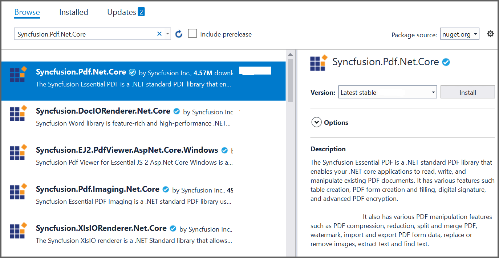

# Create or Generate PDF file in Blazor

The Syncfusion [Blazor PDF library](https://www.syncfusion.com/document-processing/pdf-framework/blazor/pdf-library) is used to create, read, and edit PDF documents. This library also offers functionality to merge, split, stamp, forms, and secure PDF files.

To include the Syncfusion Blazor PDF library into your Blazor application, please refer to the [NuGet Package Required](https://help.syncfusion.com/document-processing/pdf/pdf-library/net/nuget-packages-required) or [Assemblies Required](https://help.syncfusion.com/document-processing/pdf/pdf-library/net/assemblies-required) documentation.

To quickly get started with creating a PDF document in Blazor, check this video:


## Steps to create PDF document in Blazor Server-Side application

Step 1: Create a new C# Blazor server-side application project. Select Blazor App from the template and click the Next button.

Step 2: Now, the project configuration window appears. Click Create button to create a new project with the default project configuration.

Step 3: Choose Blazor Server App from the dashboard and click Create button to create a new Blazor server-side application.

Step 4: Install the [Syncfusion.PDF.Net.Core](https://www.nuget.org/packages/Syncfusion.pdf.Net.Core) NuGet package as a reference to your Blazor application from [NuGet.org](https://www.nuget.org).

N> Starting with v16.2.0.x, if you reference Syncfusion assemblies from trial setup or from the NuGet feed, you also have to add "Syncfusion.Licensing" assembly reference and include a license key in your projects. Please refer to this [link](https://help.syncfusion.com/common/essential-studio/licensing/overview) to know about registering Syncfusion license key in your application to use our components.

Step 5: Create a new cs file named  ``ExportService`` under ``Data`` folder and include the following namespaces in the file.




using Syncfusion.Pdf;
using Syncfusion.Pdf.Graphics;
using Syncfusion.Pdf.Grid;
using Syncfusion.Drawing;




Step 6: The [PdfDocument](https://help.syncfusion.com/cr/document-processing/Syncfusion.Pdf.PdfDocument.html) object represents an entire PDF document that is being created. The [PdfTextElement](https://help.syncfusion.com/cr/document-processing/Syncfusion.Pdf.Graphics.PdfTextElement.html) is used to add text in a PDF document and which provides the layout result of the added text by using the location of the next element that decides to prevent content overlapping. The [PdfGrid](https://help.syncfusion.com/cr/document-processing/Syncfusion.Pdf.Grid.PdfGrid.html) allows you to create table by entering data manually or from an external data sources. 

Add the following code sample in ``ExportService`` class which illustrates how to create a simple PDF document using ``PdfTextElement`` and ``PdfGrid``. 




//Export weather data to PDF document.
public static MemoryStream CreatePdf(WeatherForecast[] forecasts)
{
    if (forecasts == null)
    {
        throw new ArgumentNullException("Forecast cannot be null");
    }
    //Create a new PDF document.
    using (PdfDocument pdfDocument = new PdfDocument())
    {
        int paragraphAfterSpacing = 8;
        int cellMargin = 8;
        //Add page to the PDF document.
        PdfPage page = pdfDocument.Pages.Add();
        //Create a new font.
        PdfStandardFont font = new PdfStandardFont(PdfFontFamily.TimesRoman, 16);

        //Create a text element to draw a text in PDF page.
        PdfTextElement title = new PdfTextElement("Weather Forecast", font, PdfBrushes.Black);
        PdfLayoutResult result = title.Draw(page, new PointF(0, 0));
        PdfStandardFont contentFont = new PdfStandardFont(PdfFontFamily.TimesRoman, 12);
        PdfTextElement content = new PdfTextElement("This component demonstrates fetching data from a service and Exporting the data to PDF document using Syncfusion .NET PDF library.", contentFont, PdfBrushes.Black);
        PdfLayoutFormat format = new PdfLayoutFormat();
        format.Layout = PdfLayoutType.Paginate;
        //Draw a text to the PDF document.
        result = content.Draw(page, new RectangleF(0, result.Bounds.Bottom + paragraphAfterSpacing, page.GetClientSize().Width, page.GetClientSize().Height), format);

        //Create a PdfGrid.
        PdfGrid pdfGrid = new PdfGrid();
        pdfGrid.Style.CellPadding.Left = cellMargin;
        pdfGrid.Style.CellPadding.Right = cellMargin;
        //Applying built-in style to the PDF grid.
        pdfGrid.ApplyBuiltinStyle(PdfGridBuiltinStyle.GridTable4Accent1);

        //Assign data source.
        pdfGrid.DataSource = forecasts
        pdfGrid.Style.Font = contentFont;
        //Draw PDF grid into the PDF page.
        pdfGrid.Draw(page, new Syncfusion.Drawing.PointF(0, result.Bounds.Bottom + paragraphAfterSpacing));

        using (MemoryStream stream = new MemoryStream())
        {
            //Saving the PDF document into the stream.
            pdfDocument.Save(stream);
            //Closing the PDF document.
            pdfDocument.Close(true);
            return stream;                
        }
    }
}




Register your service in the ``ConfigureServices`` method available in the ``Startup.cs`` class as follows.


public void ConfigureServices(IServiceCollection services)
{
    services.AddRazorPages();
    services.AddServerSideBlazor();
    services.AddSingleton<WeatherForecastService>();
    services.AddSingleton<ExportService>();
}



Step 6: Inject ``ExportService`` in-to ``FetchData.razor`` using the following code.




@inject ExportToFileService exportService
@inject Microsoft.JSInterop.IJSRuntime JS
@using  System.IO;




Create a button in the ``FetchData.razor`` using the following code.



<button class="btn btn-primary" @onclick="@ExportToPdf">Export to PDF</button>



Add the ``ExportToPdf`` method in ``FetchData.razor`` page to call the export service.



@functions
{
    protected async Task ExportToPdf()
    {
        using (MemoryStream excelStream = ExportService.CreatePdf(forecasts))
        {
            await JS.SaveAs("Sample.pdf", excelStream.ToArray());
        }
    }
}



Step 7: Create a class file with  ``FileUtil`` name and add the following code to invoke the JavaScript action to download the file in the browser.





public static class FileUtil
{
    public static ValueTask<object> SaveAs(this IJSRuntime js, string filename, byte[] data)
       => js.InvokeAsync<object>(
           "saveAsFile",
           filename,
           Convert.ToBase64String(data));
}





Step 8: Add the following JavaScript function in the  ``_Host.cshtml`` available under the ``Pages`` folder.









You can download a complete working sample from [GitHub](https://github.com/SyncfusionExamples/PDF-Examples/tree/master/Getting%20Started/Blazor/ServerSideApplication).

By executing the program, you will get the following output in the browser.

Click the Export to PDF button, and you will get the PDF document with the following output.

N> It is recommended to use Blazor Server-Side application to reduce the pay back load which is high in Blazor Client-Side.

Click [here](https://www.syncfusion.com/document-processing/pdf-framework/blazor) to explore the rich set of Syncfusion PDF library features.

An online sample link to [create PDF document](https://blazor.syncfusion.com/demos/pdf/hello-world?theme=fluent) in Blazor. 

## Steps to create PDF document in Blazor client-side application:

Step 1: Create a new C# Blazor client-side application project. Select Blazor App from the template and click the Next button.

Step 2: Now, the project configuration window appears. Click Create button to create a new project with the default project configuration.

Step 3: Blazor WebAssembly App from the dashboard and click Create button to create a new Blazor client-side application. 

Step 4: Install the [Syncfusion.PDF.Net.Core](https://www.nuget.org/packages/Syncfusion.pdf.Net.Core) NuGet package as a reference to your Blazor application from [NuGet.org](https://www.nuget.org).

N> Starting with v16.2.0.x, if you reference Syncfusion assemblies from trial setup or from the NuGet feed, you also have to add "Syncfusion.Licensing" assembly reference and include a license key in your projects. Please refer to this [link](https://help.syncfusion.com/common/essential-studio/licensing/overview) to know about registering Syncfusion license key in your application to use our components.

Step 5: Next, include the following namespaces in that  ``FetchData.razor`` file.




@using Syncfusion.Pdf
@using Syncfusion.Pdf.Grid;
@using Syncfusion.Drawing;
@using Syncfusion.Pdf.Graphics;
@inject Microsoft.JSInterop.IJSRuntime JS
@using System.IO;




Step 6: Create a button in the ``FetchData.razor`` using the following code.



<button class="btn btn-primary" @onclick="@ExportToPdf">Export to PDF</button>



Step 7: Define the ``@ExportToPdf`` click function on ``FetchData.razor`` file.

The [PdfDocument](https://help.syncfusion.com/cr/document-processing/Syncfusion.Pdf.PdfDocument.html) object represents an entire PDF document that is being created and add a [PdfPage](https://help.syncfusion.com/cr/document-processing/Syncfusion.Pdf.PdfPage.html) to it. The [PdfTextElement](https://help.syncfusion.com/cr/document-processing/Syncfusion.Pdf.Graphics.PdfTextElement.html) is used to add text in a PDF document and which provides the layout result of the added text by using the location of the next element that decides to prevent content overlapping. The [PdfGrid](https://help.syncfusion.com/cr/document-processing/Syncfusion.Pdf.Grid.PdfGrid.html) allows you to create table by entering data manually or from an external data sources. 
 



@functions {
void ExportToPdf()
{
int paragraphAfterSpacing = 8;
int cellMargin = 8;
//Create a new PDF document.
PdfDocument pdfDocument = new PdfDocument();
//Add Page to the PDF document.
PdfPage page = pdfDocument.Pages.Add();

//Create a new font.
PdfStandardFont font = new PdfStandardFont(PdfFontFamily.TimesRoman, 16);
//Create a text element to draw a text in PDF page.
PdfTextElement title = new PdfTextElement("Weather Forecast", font, PdfBrushes.Black);
PdfLayoutResult result = title.Draw(page, new PointF(0, 0));
PdfStandardFont contentFont = new PdfStandardFont(PdfFontFamily.TimesRoman, 12);
//Create text element. 
PdfTextElement content = new PdfTextElement("This component demonstrates fetching data from a client side and Exporting the data to PDF document using Syncfusion .NET PDF library.", contentFont, PdfBrushes.Black);
PdfLayoutFormat format = new PdfLayoutFormat();
format.Layout = PdfLayoutType.Paginate;
//Draw a text to the PDF document.
result = content.Draw(page, new RectangleF(0, result.Bounds.Bottom + paragraphAfterSpacing, page.GetClientSize().Width, page.GetClientSize().Height), format);

//Create a PdfGrid.
PdfGrid pdfGrid = new PdfGrid();
pdfGrid.Style.CellPadding.Left = cellMargin;
pdfGrid.Style.CellPadding.Right = cellMargin;
//Applying built-in style to the PDF grid
pdfGrid.ApplyBuiltinStyle(PdfGridBuiltinStyle.GridTable4Accent1);
//Assign data source.
pdfGrid.DataSource = forecasts;
pdfGrid.Style.Font = contentFont;
//Draw PDF grid into the PDF page.
pdfGrid.Draw(page, new Syncfusion.Drawing.PointF(0, result.Bounds.Bottom + paragraphAfterSpacing));

//Create memory stream. 
MemoryStream memoryStream = new MemoryStream();
//Save the PDF document.
pdfDocument.Save(memoryStream);
//Download the PDF document
JS.SaveAs("Sample.pdf", memoryStream.ToArray());
}
}




Step 7: Create a class file with ``FileUtil`` name and add the following code to invoke the JavaScript action to download the file in the browser.





public static class FileUtil
{
    public static ValueTask<object> SaveAs(this IJSRuntime js, string filename, byte[] data)
       => js.InvokeAsync<object>(
           "saveAsFile",
           filename,
           Convert.ToBase64String(data));
}





Step 8: Add the following JavaScript function in the ``index.html`` available under the ``wwwroot`` folder.









You can download a complete working sample from [GitHub](https://github.com/SyncfusionExamples/PDF-Examples/tree/master/Getting%20Started/Blazor/ClientSideApplication).

By executing the program, you will get the following output in the browser.

Click the Export to PDF button and you will get the PDF document with the following output.
    

Click [here](https://www.syncfusion.com/document-processing/pdf-framework/blazor) to explore the rich set of Syncfusion PDF library features.

An online sample link to [create PDF document](https://blazor.syncfusion.com/demos/pdf/hello-world?theme=fluent) in Blazor. 

## Steps to create PDF documents in .NET MAUI Blazor application

Step 1: Create a new project by choosing `.NET MAUI Blazor Hybrid App` template in Visual Studio.

Step 2: Now, the project configuration window appears. Set the project name and location, then select  `Create` button to create a new project with the default project configuration.

Step 3: Install the [Syncfusion.PDF.Net](https://www.nuget.org/packages/Syncfusion.pdf.Net) NuGet package as a reference to your Blazor application from [NuGet.org](https://www.nuget.org).

Step 4: Next, include the following namespaces in the ``_Imports.razor`` file.





@using Syncfusion.Pdf
@using Syncfusion.Pdf.Grid;
@using Syncfusion.Drawing;
@using Syncfusion.Pdf.Graphics;
@inject Microsoft.JSInterop.IJSRuntime JS
@using System.IO;
@using BlazorMauiAppCreatePdfSample.Services;





Step 5: Create a button in the ``Weather.razor`` using the following code.





<button class="btn btn-primary" @onclick="@ExportToPdf">Export to PDF</button>





Step 6: Define the ``@ExportToPdf`` click function on ``Weather.razor`` file.

The [PdfDocument](https://help.syncfusion.com/cr/file-formats/Syncfusion.Pdf.PdfDocument.html) object represents an entire PDF document that is being created and add a [PdfPage](https://help.syncfusion.com/cr/file-formats/Syncfusion.Pdf.PdfPage.html) to it. The [PdfTextElement](https://help.syncfusion.com/cr/file-formats/Syncfusion.Pdf.Graphics.PdfTextElement.html) is used to add text in a PDF document and which provides the layout result of the added text by using the location of the next element that decides to prevent content overlapping. The [PdfGrid](https://help.syncfusion.com/cr/file-formats/Syncfusion.Pdf.Grid.PdfGrid.html) allows you to create table by entering data manually or from an external data source.
 




    @functions {
        void ExportToPdf()
        {
            int paragraphAfterSpacing = 8;
            int cellMargin = 8;
            //Create a new PDF document.
            PdfDocument pdfDocument = new PdfDocument();
            //Add Page to the PDF document.
            PdfPage page = pdfDocument.Pages.Add();
            //Create a new font.
            PdfStandardFont font = new PdfStandardFont(PdfFontFamily.TimesRoman, 16);
            //Create a text element to draw a text in PDF page.
            PdfTextElement title = new PdfTextElement("Weather Forecast", font, PdfBrushes.Black);
            PdfLayoutResult result = title.Draw(page, new PointF(0, 0));
            PdfStandardFont contentFont = new PdfStandardFont(PdfFontFamily.TimesRoman, 12);
            //Create text element.
            PdfTextElement content = new PdfTextElement("This component demonstrates fetching data from a client side and Exporting the data to PDF document using Syncfusion .NET PDF library.", contentFont, PdfBrushes.Black);
            PdfLayoutFormat format = new PdfLayoutFormat();
            format.Layout = PdfLayoutType.Paginate;
            //Draw a text to the PDF document.
            result = content.Draw(page, new RectangleF(0, result.Bounds.Bottom + paragraphAfterSpacing, page.GetClientSize().Width, page.GetClientSize().Height), format);
            //Create a PdfGrid.
            PdfGrid pdfGrid = new PdfGrid();
            pdfGrid.Style.CellPadding.Left = cellMargin;
            pdfGrid.Style.CellPadding.Right = cellMargin;
            //Applying built-in style to the PDF grid
            pdfGrid.ApplyBuiltinStyle(PdfGridBuiltinStyle.GridTable4Accent1);
            //Assign data source.
            pdfGrid.DataSource = forecasts;
            pdfGrid.Style.Font = contentFont;
            //Draw PDF grid into the PDF page.
            pdfGrid.Draw(page, new Syncfusion.Drawing.PointF(0, result.Bounds.Bottom + paragraphAfterSpacing));
            using (MemoryStream ms = new MemoryStream())
            {
                // Save the PDF document to the memory stream
                pdfDocument.Save(ms);
                // Close the PDF document
                pdfDocument.Close(true);
                // Reset the memory stream position
                ms.Position = 0;
                // Create a SaveService instance
                SaveService service = new SaveService();
                // Save and view the PDF document
                service.SaveAndView("Output.pdf", "application/pdf", ms);
            }
        }





### Save the PDF Document on Different Platforms

Create a folder named `Services`, then add a class called `SaveService.cs` within this folder, and insert the following code into it.




    public partial class SaveService
    {
        //Method to save document as a file and view the saved document.
        public partial void SaveAndView(string filename, string contentType, MemoryStream stream);
    }





Now, we need to implement platform-specific code to save the PDF document.

#### Andriod
Create a new class file named `SaveAndroid.cs` within the Android folder and add the following code to enable file saving on the Android platform.





    public partial void SaveAndView(string filename, string contentType, MemoryStream stream)
        {
            string exception = string.Empty;
            string? root = null;

            if (Android.OS.Environment.IsExternalStorageEmulated)
            {
                root = Android.App.Application.Context!.GetExternalFilesDir(Android.OS.Environment.DirectoryDownloads)!.AbsolutePath;
            }
            else
                root = System.Environment.GetFolderPath(System.Environment.SpecialFolder.MyDocuments);

            Java.IO.File myDir = new(root + "/Syncfusion");
            myDir.Mkdir();

            Java.IO.File file = new(myDir, filename);

            if (file.Exists())
            {
                file.Delete();
            }

            try
            {
                FileOutputStream outs = new(file);
                outs.Write(stream.ToArray());

                outs.Flush();
                outs.Close();
            }
            catch (Exception e)
            {
                exception = e.ToString();
            }
            if (file.Exists())
            {

                if (Build.VERSION.SdkInt >= Android.OS.BuildVersionCodes.N)
                {
                    var fileUri = AndroidX.Core.Content.FileProvider.GetUriForFile(Android.App.Application.Context, Android.App.Application.Context.PackageName + ".provider", file);
                    var intent = new Intent(Intent.ActionView);
                    intent.SetData(fileUri);
                    intent.AddFlags(ActivityFlags.NewTask);
                    intent.AddFlags(ActivityFlags.GrantReadUriPermission);
                    Android.App.Application.Context.StartActivity(intent);
                }
                else
                {
                    var fileUri = Android.Net.Uri.Parse(file.AbsolutePath);
                    var intent = new Intent(Intent.ActionView);
                    intent.SetDataAndType(fileUri, contentType);
                    intent = Intent.CreateChooser(intent, "Open File");
                    intent!.AddFlags(ActivityFlags.NewTask);
                    Android.App.Application.Context.StartActivity(intent);
                }

            }
        }





N> Note: Introduced a new runtime permission model for the Android SDK version 23 and above. So, include the following code for enabling the Android file provider to save and view the generated PDF document.

1.	Create a new XML file with the name of `file_paths.xml` under the Android project Resources/xml folder and add the following code in it.





    <?xml version="1.0" encoding="utf-8"?>
    <paths xmlns:android="http://schemas.android.com/apk/res/android">
        <external-path
            name="external"
            path="." />
        <external-files-path
            name="external_files"
            path="." />
        <cache-path
            name="cache"
            path="." />
        <external-cache-path
            name="external_cache"
            path="." />
        <files-path
            name="files"
            path="." />
    </paths>





2.	Add the following code to the `AndroidManifest.xml` file located under Properties/AndroidManifest.xml.





    <?xml version="1.0" encoding="utf-8"?>
    <manifest xmlns:android="http://schemas.android.com/apk/res/android">
        <application android:allowBackup="true" android:icon="@mipmap/appicon" android:roundIcon="@mipmap/appicon_round" android:supportsRtl="true">
            <provider
                    android:name="androidx.core.content.FileProvider"
                    android:authorities="${applicationId}.provider"
                    android:exported="false"
                    android:grantUriPermissions="true">
                <meta-data
                    android:name="android.support.FILE_PROVIDER_PATHS"
                    android:resource="@xml/file_paths" />
            </provider>
        </application>
        <uses-permission android:name="android.permission.ACCESS_NETWORK_STATE" />
        <uses-permission android:name="android.permission.INTERNET" />
    </manifest>





#### IOS
Create a new class file named `SaveIOS.cs` within the iOS folder and include the following code to enable file saving on the iOS platform.





    public partial void SaveAndView(string filename, string contentType, MemoryStream stream)
    {
        string exception = string.Empty;
        string path = Environment.GetFolderPath(Environment.SpecialFolder.Personal);
        string filePath = Path.Combine(path, filename);
        try
        {
            FileStream fileStream = File.Open(filePath, FileMode.Create);
            stream.Position = 0;
            stream.CopyTo(fileStream);
            fileStream.Flush();
            fileStream.Close();
        }
        catch (Exception e)
        {
            exception = e.ToString();
        }
        if (contentType != "application/html" || exception == string.Empty)
        {
            UIViewController? currentController = UIApplication.SharedApplication!.KeyWindow!.RootViewController;
            while (currentController!.PresentedViewController != null)
                currentController = currentController.PresentedViewController;

            QLPreviewController qlPreview = new();
            QLPreviewItem item = new QLPreviewItemBundle(filename, filePath);
            qlPreview.DataSource = new PreviewControllerDS(item);
            currentController.PresentViewController((UIViewController)qlPreview, true, null);
        }
    }





#### MacOS
Create a new class file named  `SaveMac.cs` within the MacCatalyst folder and include the following code to enable file saving on the MacOS platform.





    public partial void SaveAndView(string filename, string contentType, MemoryStream stream)
    {
        string path = Environment.GetFolderPath(Environment.SpecialFolder.MyDocuments);
        string filePath = Path.Combine(path, filename);
        stream.Position = 0;
        //Saves the document
        using FileStream fileStream = new(filePath, FileMode.Create, FileAccess.ReadWrite);
        stream.CopyTo(fileStream);
        fileStream.Flush();
        fileStream.Dispose();

        UIWindow? window = GetKeyWindow();
        if (window != null && window.RootViewController != null)
        {
            UIViewController? uiViewController = window.RootViewController;
            if (uiViewController != null)
            {
                QLPreviewController qlPreview = new();
                QLPreviewItem item = new QLPreviewItemBundle(filename, filePath);
                qlPreview.DataSource = new PreviewControllerDS(item);
                uiViewController.PresentViewController((UIViewController)qlPreview, true, null);
            }
        }

    }
    public UIWindow? GetKeyWindow()
    {
        foreach (var scene in UIApplication.SharedApplication.ConnectedScenes)
        {
            if (scene is UIWindowScene windowScene)
            {
                foreach (var window in windowScene.Windows)
                {
                    if (window.IsKeyWindow)
                    {
                        return window;
                    }
                }
            }
        }

        return null;
    }





#### windows
Create a new class file named `SaveWindows.cs` within the Windows folder and include the following code to enable file saving on the Windows platform.





    public async partial void SaveAndView(string filename, string contentType, MemoryStream stream)
    {
        StorageFile stFile;
        string extension = Path.GetExtension(filename);
        //Gets process windows handle to open the dialog in application process. 
        IntPtr windowHandle = System.Diagnostics.Process.GetCurrentProcess().MainWindowHandle;
        if (!Windows.Foundation.Metadata.ApiInformation.IsTypePresent("Windows.Phone.UI.Input.HardwareButtons"))
        {
            //Creates file save picker to save a file. 
            FileSavePicker savePicker = new();
            if (extension == ".xlsx")
            {
                savePicker.DefaultFileExtension = ".xlsx";
                savePicker.SuggestedFileName = filename;
                //Saves the file as xlsx file.
                savePicker.FileTypeChoices.Add("XLSX", new List<string>() { ".xlsx" });
            }
            if (extension == ".docx")
            {
                savePicker.DefaultFileExtension = ".docx";
                savePicker.SuggestedFileName = filename;
                //Saves the file as Docx file.
                savePicker.FileTypeChoices.Add("DOCX", new List<string>() { ".docx" });
            }
            else if (extension == ".doc")
            {
                savePicker.DefaultFileExtension = ".doc";
                savePicker.SuggestedFileName = filename;
                //Saves the file as Doc file.
                savePicker.FileTypeChoices.Add("DOC", new List<string>() { ".doc" });
            }
            else if (extension == ".rtf")
            {
                savePicker.DefaultFileExtension = ".rtf";
                savePicker.SuggestedFileName = filename;
                //Saves the file as Rtf file.
                savePicker.FileTypeChoices.Add("RTF", new List<string>() { ".rtf" });
            }
            else if (extension == ".pdf")
            {
                savePicker.DefaultFileExtension = ".pdf";
                savePicker.SuggestedFileName = filename;
                //Saves the file as Pdf file.
                savePicker.FileTypeChoices.Add("PDF", new List<string>() { ".pdf" });
            }
            else if (extension == ".pptx")
            {
                savePicker.DefaultFileExtension = ".pptx";
                savePicker.SuggestedFileName = filename;
                //Saves the file as pptx file.
                savePicker.FileTypeChoices.Add("PPTX", new List<string>() { ".pptx" });
            }
            else if (extension == ".png")
            {
                savePicker.DefaultFileExtension = ".png";
                savePicker.SuggestedFileName = filename;
                //Saves the file as png file.
                savePicker.FileTypeChoices.Add("PNG", new List<string>() { ".png" });
            }

            WinRT.Interop.InitializeWithWindow.Initialize(savePicker, windowHandle);
            stFile = await savePicker.PickSaveFileAsync();
        }
        else
        {
            StorageFolder local = ApplicationData.Current.LocalFolder;
            stFile = await local.CreateFileAsync(filename, CreationCollisionOption.ReplaceExisting);
        }
        if (stFile != null)
        {
            using (IRandomAccessStream zipStream = await stFile.OpenAsync(FileAccessMode.ReadWrite))
            {
                //Writes compressed data from memory to file.
                using Stream outstream = zipStream.AsStreamForWrite();
                outstream.SetLength(0);
                //Saves the stream as file.
                byte[] buffer = stream.ToArray();
                outstream.Write(buffer, 0, buffer.Length);
                outstream.Flush();
            }
            //Create message dialog box. 
            MessageDialog msgDialog = new("Do you want to view the document?", "File has been created successfully");
            UICommand yesCmd = new("Yes");
            msgDialog.Commands.Add(yesCmd);
            UICommand noCmd = new("No");
            msgDialog.Commands.Add(noCmd);

            WinRT.Interop.InitializeWithWindow.Initialize(msgDialog, windowHandle);

            //Showing a dialog box. 
            IUICommand cmd = await msgDialog.ShowAsync();
            if (cmd.Label == yesCmd.Label)
            {
                //Launch the saved file. 
                await Windows.System.Launcher.LaunchFileAsync(stFile);
            }
        }
    }





The helper files mentioned above are available on [this](https://help.syncfusion.com/document-processing/pdf/pdf-library/net/create-pdf-file-in-maui#helper-files-for-net-maui) page. You can refer to [this](https://help.syncfusion.com/document-processing/pdf/pdf-library/net/create-pdf-file-in-maui#helper-files-for-net-maui) page for more details.

You can download a complete working sample from [GitHub]().

By executing the program, you will get the following output in the browser.

Click the Export to PDF button and you will get the PDF document with the following output.
    

Click [here](https://www.syncfusion.com/document-processing/pdf-framework/blazor) to explore the rich set of Syncfusion PDF library features.

An online sample link to [create PDF document](https://blazor.syncfusion.com/demos/pdf/hello-world?theme=fluent) in Blazor. 