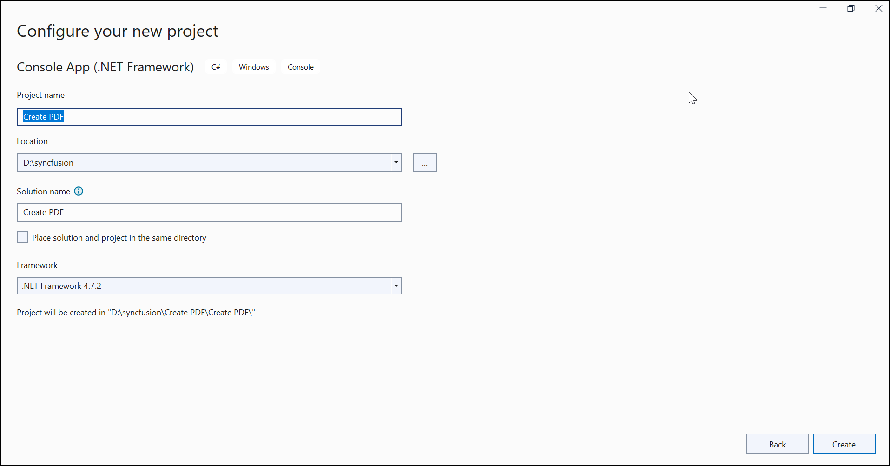
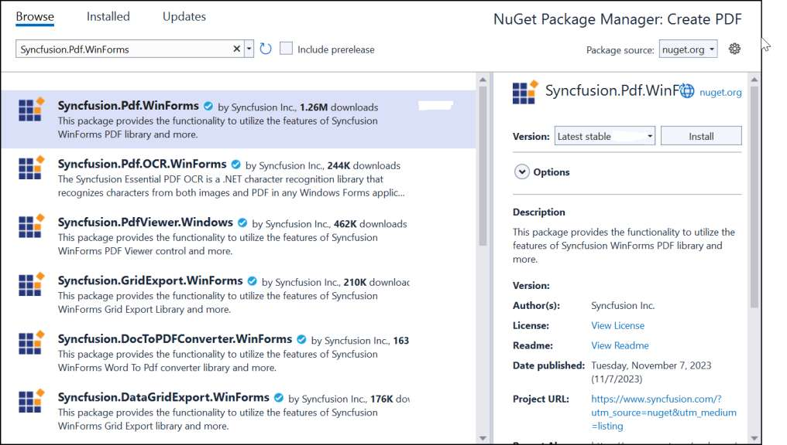

---

--- 

**Prerequires**:

Step 1: Install .NET SDK: 
* Ensure that you have the .NET SDK installed on your system. You can download it from the [.NET Downloads page](https://dotnet.microsoft.com/en-us/download).
Step 2: Install Visual Studio: 
* Download and install Visual Studio Code from the [official website](https://code.visualstudio.com/download).

## Steps to create PDF document using .NET Framework

Step 1: Create a new C# Console Application (.NET Framework) project.

Step 2: Name the project.

Step 3: Install the [Syncfusion.Pdf.WinForms](https://www.nuget.org/packages/Syncfusion.Pdf.WinForms/) NuGet package as reference to your .NET Standard applications from [NuGet.org](https://www.nuget.org).

N> The [Syncfusion.Pdf.WinForms](https://www.nuget.org/packages/Syncfusion.Pdf.WinForms/) NuGet package is dependent package for Syncfusion&reg; Windows Forms GUI controls, so named with suffix "WinForms". It has a platform-independent .NET framework (4.0, 4.5, 4.5.1, 4.6) assemblies of the PDF library and doesn't contain any Windows Forms-related references or code. Hence, we recommend this package for the .NET framework Console application.

Step 4: Include the following namespaces in the *Program.cs*.




using Syncfusion.Pdf.Graphics;
using Syncfusion.Pdf;
using System.Drawing;




Step 5: Include the following code sample in *Program.cs* to create a PDF file.




//Create a new PDF document. 
using (PdfDocument document = new PdfDocument()) {
    //Add a page to the document.
    PdfPage page = document.Pages.Add();
    //Create PDF graphics for a page.
    PdfGraphics graphics = page.Graphics;
    //Set the standard font.
    PdfFont font = new PdfStandardFont(PdfFontFamily.Helvetica, 20);
    //Draw the text.
    graphics.DrawString("Hello World!!!", font, PdfBrushes.Black, new PointF(0, 0));
    //Save the document.
    document.Save("Output.pdf");
}




Step 6: Build the project.

Click on Build > Build Solution or press Ctrl + Shift + B to build the project.

Step 7: Run the project.

Click the Start button (green arrow) or press F5 to run the app.
