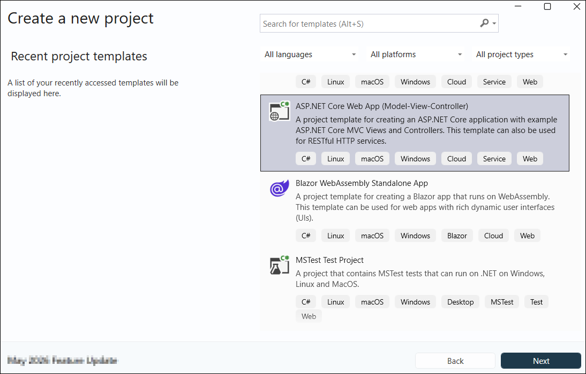
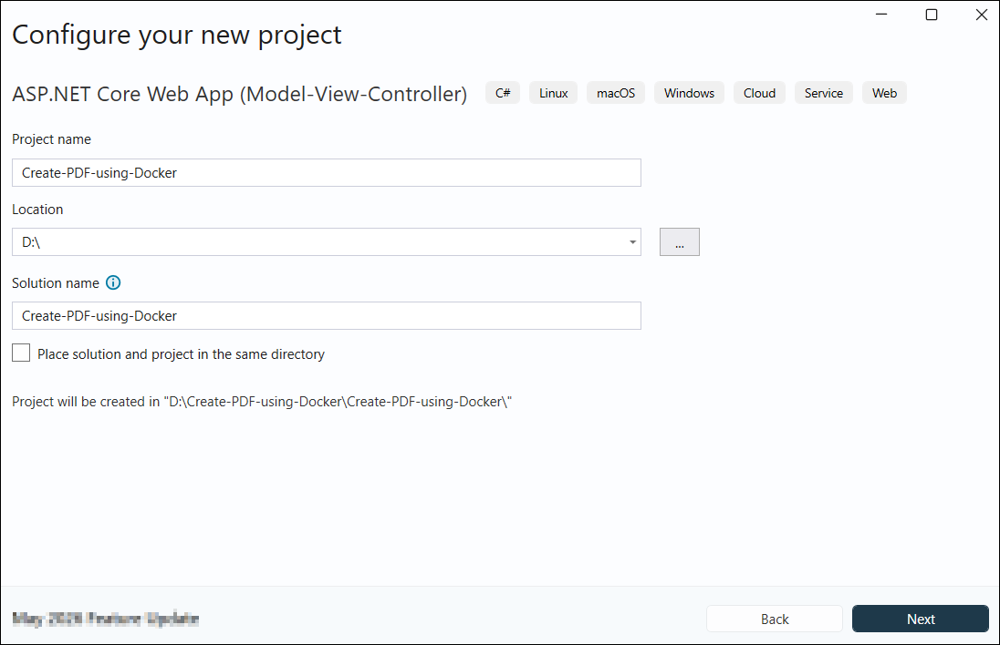
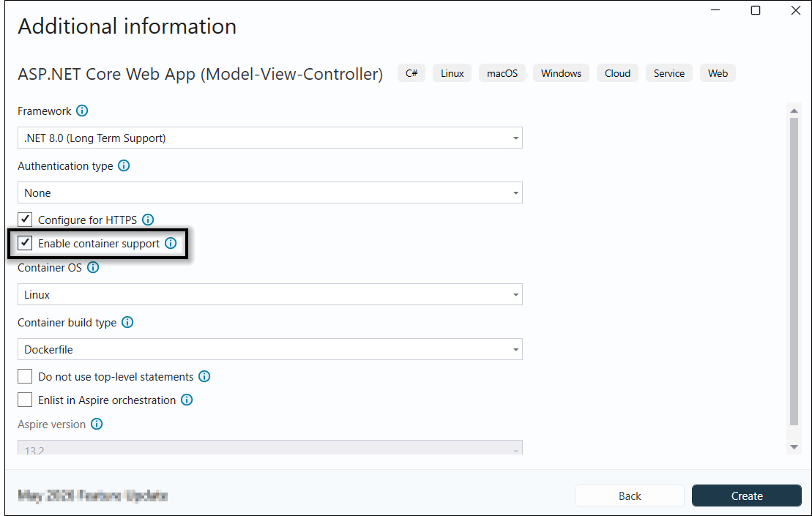
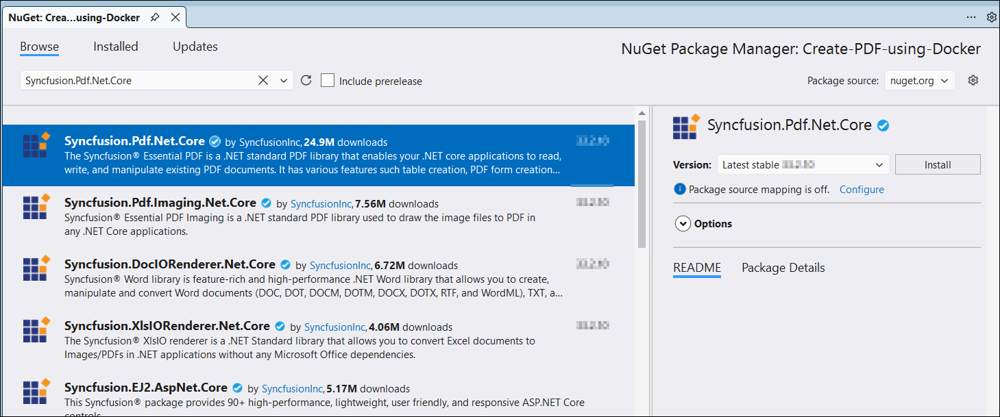

# Create a PDF File in a Docker Environment

The [.NET PDF library](https://www.syncfusion.com/document-sdk/net-pdf-library) creates, reads, and edits PDF documents in .NET applications. It merges and splits PDFs, adds stamps, fills form fields, and secures PDF files with encryption and permissions.

To integrate the .NET PDF library into your Docker application, refer to the official documentation sections on [NuGet Package Required](https://help.syncfusion.com/document-processing/pdf/pdf-library/net/nuget-packages-required) or [Assemblies Required](https://help.syncfusion.com/document-processing/pdf/pdf-library/net/assemblies-required) for step-by-step guidance.

## Prerequisites

- **.NET SDK** 8.0 or later
- **Docker Desktop** installed and running
- **Visual Studio 2022** (with the ASP.NET and web development workload) or **Visual Studio Code** with the C# Dev Kit extension
- A **Syncfusion&reg; license key** — register it in your application using `Syncfusion.Licensing.SyncfusionLicenseProvider.RegisterLicense("YOUR_LICENSE_KEY")`. For details, see the [Syncfusion licensing overview](https://help.syncfusion.com/common/essential-studio/licensing/overview).

## Compatibility

| Component | Minimum version |
| --- | --- |
| .NET SDK | 8.0 or later |
| Docker Engine | 20.10 |
| Base image | `mcr.microsoft.com/dotnet/aspnet:6.0` |
| Syncfusion&reg; PDF library | Latest version |
| Syncfusion&reg; NuGet package | [Syncfusion.Pdf.Net.Core](https://www.nuget.org/packages/Syncfusion.Pdf.Net.Core) |

## Step to create a PDF file in a Docker container

**Step 1:** Create a new ASP.NET Core MVC application.

**Step 2:** In the project configuration window, name your project and select **Next**.

**Step 3:** Enable Docker support with Linux as the target OS. Note the default URL (`http://localhost:5000`) and the exposed port so you can access the app after the container starts.

**Step 4:** Install the [Syncfusion.Pdf.Net.Core](https://www.nuget.org/packages/Syncfusion.Pdf.Net.Core) NuGet package into your project from [NuGet.org](https://www.nuget.org/). Use the latest stable version compatible with your target framework.

N> If you reference Syncfusion&reg; assemblies from the trial setup or the NuGet feed, you must add a reference to the `Syncfusion.Licensing` assembly and include a valid license key in your project. See the [Syncfusion licensing overview](https://help.syncfusion.com/common/essential-studio/licensing/overview) for details on registering the license key.

**Step 5:** In `HomeController.cs`, right-click the existing `Index` action and choose **Go To View**. In the resulting `Index.cshtml`, add the following button.




@{Html.BeginForm("CreatePDFDocument", "Home", FormMethod.Get);
    {
        

            <input type="submit" value="Generate PDF Document" style="width:150px;height:27px" />
        

    }
    Html.EndForm();
}




**Step 6:** Create an `ExportService` class to host the PDF generation logic. The [PdfDocument](https://help.syncfusion.com/cr/document-processing/Syncfusion.Pdf.PdfDocument.html) object represents the PDF being created. The [PdfTextElement](https://help.syncfusion.com/cr/document-processing/Syncfusion.Pdf.Graphics.PdfTextElement.html) adds text to a PDF document and returns a layout result that lets subsequent elements avoid overlapping content. The [PdfGrid](https://help.syncfusion.com/cr/document-processing/Syncfusion.Pdf.Grid.PdfGrid.html) creates a table from manually entered data or from an external data source.

Before you add the action method, declare a sample data source that the `PdfGrid` can bind to. Add a `forecasts` field to the controller and populate it as shown below.

Add the following code to the `ExportService` class to create a simple PDF document using `PdfTextElement` and `PdfGrid`.




public ActionResult CreatePDF()
{
    // Create a new PDF document.
    using (PdfDocument pdfDocument = new PdfDocument())
    {
        int paragraphAfterSpacing = 8;
        int cellMargin = 8;

        // Add page to the PDF document.
        PdfPage page = pdfDocument.Pages.Add();
        // Create title and description.
        PdfStandardFont font = new PdfStandardFont(PdfFontFamily.TimesRoman, 16);
        PdfTextElement title = new PdfTextElement("Weather Forecast", font, PdfBrushes.Black);
        PdfLayoutResult result = title.Draw(page, new PointF(0, 0));

        PdfStandardFont contentFont = new PdfStandardFont(PdfFontFamily.TimesRoman, 12);
        PdfTextElement content = new PdfTextElement(
            "This component demonstrates fetching data from a service and exporting the data to a PDF document using Syncfusion .NET PDF library.",
            contentFont,
            PdfBrushes.Black);
        PdfLayoutFormat format = new PdfLayoutFormat
        {
            Layout = PdfLayoutType.Paginate
        };
        result = content.Draw(
            page,
            new RectangleF(0, result.Bounds.Bottom + paragraphAfterSpacing, page.GetClientSize().Width, page.GetClientSize().Height),
            format);
        // Create and style the PDF grid.
        PdfGrid pdfGrid = new PdfGrid();
        pdfGrid.Style.CellPadding.Left = cellMargin;
        pdfGrid.Style.CellPadding.Right = cellMargin;
        pdfGrid.ApplyBuiltinStyle(PdfGridBuiltinStyle.GridTable4Accent1);
        // Assign data source.
        pdfGrid.DataSource = forecasts;
        pdfGrid.Style.Font = contentFont;
        // Draw PDF grid into the PDF page.
        pdfGrid.Draw(page, new PointF(0, result.Bounds.Bottom + paragraphAfterSpacing));
        using (MemoryStream stream = new MemoryStream())
        {
            // Save the PDF document into the stream.
            pdfDocument.Save(stream);

            return File(stream.ToArray(), "application/pdf", "Output.pdf");
        }
    }
}




**Step 7:** Build and run the sample in Docker. Visual Studio pulls the Linux Docker image from Docker Hub and starts the container. After the container is running, open the app at `http://localhost:5000` in your browser and click the **Generate PDF Document** button to generate the PDF.

You can download a complete working sample from [GitHub](https://github.com/SyncfusionExamples/PDF-Examples/tree/master/Getting%20Started/Docker/Create-PDF-using-Docker). The `Create-PDF-using-Docker` folder contains the complete solution, including the Dockerfile and `.dockerignore` files.

Running the program produces a PDF document as follows.

Explore the [Syncfusion&reg; PDF library features](https://www.syncfusion.com/document-sdk/net-pdf-library) to learn more about merging, splitting, securing, and stamping PDF files.

An online sample demonstrating how to [create a PDF document](https://document.syncfusion.com/demos/pdf/default#/tailwind) is also available.

## Troubleshooting

- **Watermark appears in the output PDF** — Your Syncfusion&reg; license key is not registered. Call `SyncfusionLicenseProvider.RegisterLicense("YOUR_LICENSE_KEY")` at application startup.
- **libgdiplus / SkiaSharp errors in the container** — Add a `RUN apt-get update && apt-get install -y libgdiplus` step in the Dockerfile to install the native graphics dependency required by `Syncfusion.Pdf.Net.Core`.
- **Container fails to start on port 5000** — Confirm the port mapping in `docker run -p 5000:80` matches the ASP.NET Core `ASPNETCORE_URLS` setting.
- **PDF file is empty or truncated** — Ensure the `MemoryStream` is read back (for example, via `stream.ToArray()`) before the `using` block disposes it.
- **NuGet restore fails inside the container** — Set the `NUGET_PACKAGES` environment variable or use a [NuGet package restore task](https://learn.microsoft.com/en-us/azure/devops/pipelines/tasks/reference/nuget-command-v2?view=azure-pipelines&tabs=windows) in CI. 

## Next Steps

Explore advanced PDF capabilities and Azure integration patterns:

### Advanced PDF Features
- **[Merge Multiple PDFs](https://help.syncfusion.com/document-processing/pdf/pdf-library/net/merge-documents)** — Combine multiple reports into a single document
- **[Split PDF Documents](https://help.syncfusion.com/document-processing/pdf/pdf-library/net/split-documents)** — Extract specific pages or create filtered PDFs
- **[Add Watermarks](https://help.syncfusion.com/document-processing/pdf/pdf-library/net/working-with-watermarks)** — Brand PDFs with company logos and confidentiality markers
- **[Create Interactive Forms](https://help.syncfusion.com/document-processing/pdf/pdf-library/net/working-with-forms)** — Build fillable PDF forms for data collection
- **[Digital Signatures](https://help.syncfusion.com/document-processing/pdf/pdf-library/net/working-with-digitalsignature)** — Sign PDFs programmatically for compliance
