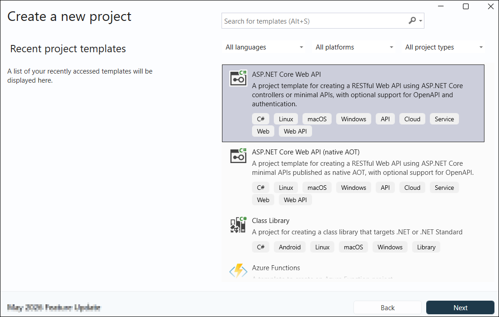
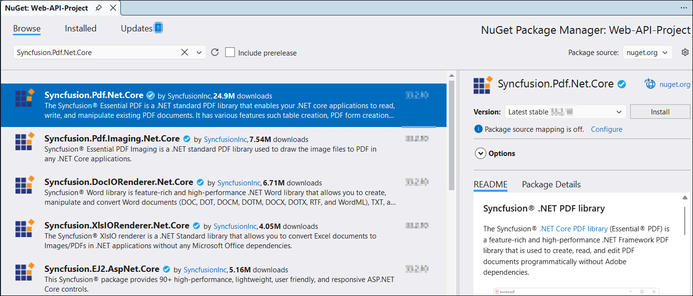
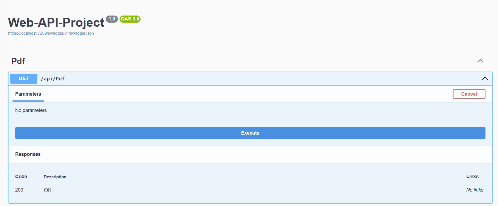
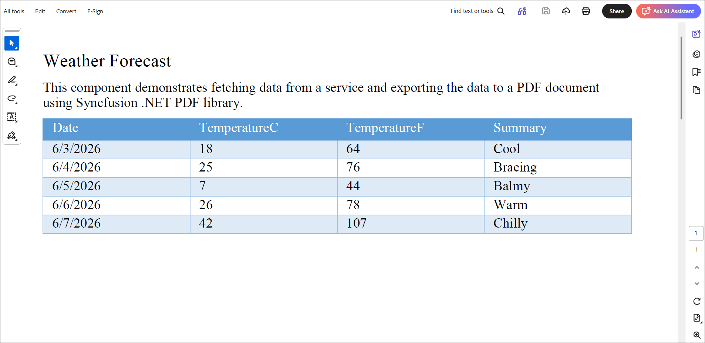

# Create or Generate PDF document in ASP.NET Core Web API

The [.NET PDF library](https://www.syncfusion.com/document-sdk/net-pdf-library) is used to create, read, and edit PDF documents. This library also offers functionality to merge, split, stamp, work with forms, and secure PDF documents.

To include the .NET PDF library into your ASP.NET Core Web API, please refer to the [NuGet Package Required](https://help.syncfusion.com/document-processing/pdf/pdf-library/net/nuget-packages-required) or [Assemblies Required](https://help.syncfusion.com/document-processing/pdf/pdf-library/net/assemblies-required) documentation.

## Prerequisites

- .NET 8.0 SDK or later.
- Visual Studio 2022 or Visual Studio Code
- A valid Syncfusion license key (required for production use; a free Community License is available)

## Steps to create a PDF document in ASP.NET Core Web API

Step 1: Create a new C# ASP.NET Core Web API project.

Step 2: In the project configuration window, name your project and click **Create**.

Step 3: Install the [Syncfusion.Pdf.Net.Core](https://www.nuget.org/packages/Syncfusion.Pdf.Net.Core) NuGet package as a reference to your ASP.NET Core Web API application from [NuGet.org](https://www.nuget.org/).

Step 4: Register the Syncfusion&reg; license key. A trial watermark is added to every page of the generated PDF until a valid key is registered. Include the license key in **Program.cs** before initializing any Syncfusion&reg; component:




using Syncfusion.Licensing;

var builder = WebApplication.CreateBuilder(args);
// Register the Syncfusion license
Syncfusion.Licensing.SyncfusionLicenseProvider.RegisterLicense("YOUR LICENSE KEY");

// Add services to the container.
builder.Services.AddControllers();
// Learn more about configuring Swagger/OpenAPI at https://aka.ms/aspnetcore/swashbuckle
builder.Services.AddEndpointsApiExplorer();
builder.Services.AddSwaggerGen();

var app = builder.Build();




Replace `"YOUR LICENSE KEY"` with the license key associated with your Syncfusion&reg; account. If you do not have a license key, you can request a free 30-day trial or apply for a Community License from the Syncfusion&reg; website. For more information about registering a license key in your application, refer to the [Syncfusion&reg; Licensing Documentation](https://help.syncfusion.com/common/essential-studio/licensing/overview).

Step 5: Ensure that Swagger and controller routing are enabled in `Program.cs`.




var builder = WebApplication.CreateBuilder(args);

// Add services to the container.
builder.Services.AddControllers();
// Learn more about configuring Swagger/OpenAPI at https://aka.ms/aspnetcore/swashbuckle
builder.Services.AddEndpointsApiExplorer();
builder.Services.AddSwaggerGen();

var app = builder.Build();

// Configure the HTTP request pipeline.
if (app.Environment.IsDevelopment())
{
    app.UseSwagger();
    app.UseSwaggerUI();
}

app.UseHttpsRedirection();

app.UseAuthorization();

app.MapControllers();

app.Run();




Step 6: Add a new empty API controller named `PdfController.cs` in the **Controllers** folder.

Step 7: Include the following namespaces in the `PdfController.cs` file.




using Syncfusion.Drawing;
using Syncfusion.Pdf;
using Syncfusion.Pdf.Graphics;
using Syncfusion.Pdf.Grid;




Step 8: The [PdfDocument](https://help.syncfusion.com/cr/document-processing/Syncfusion.Pdf.PdfDocument.html) object represents an entire PDF document that is being created. The [PdfTextElement](https://help.syncfusion.com/cr/document-processing/Syncfusion.Pdf.Graphics.PdfTextElement.html) is used to add text in a PDF document and which provides the layout result of the added text by using the location of the next element that decides to prevent content overlapping. The [PdfGrid](https://help.syncfusion.com/cr/document-processing/Syncfusion.Pdf.Grid.PdfGrid.html) allows you to create table by entering data manually or from an external data sources. 

Add the following code sample in the `PdfController` class which illustrates how to create a simple PDF document using `PdfTextElement` and `PdfGrid`.




[HttpGet("/api/Pdf")]
public IActionResult CreatePdfDocument()
{
    try
    {
        const string fileDownloadName = "Output.pdf";
        const string contentType = "application/pdf";
        var stream = ExportWeatherForecastToPdf();
        stream.Position = 0;
        return File(stream, contentType, fileDownloadName);
    }
    catch (Exception ex)
    {
        return BadRequest($"Error occurred while creating PDF file: {ex.Message}");
    }
}

private MemoryStream ExportWeatherForecastToPdf()
{
    var forecasts = Enumerable.Range(1, 5).Select(index => new WeatherForecast
    {
        Date = DateOnly.FromDateTime(DateTime.Now.AddDays(index)),
        TemperatureC = Random.Shared.Next(-20, 55),
        Summary = Summaries[Random.Shared.Next(Summaries.Length)]
    }).ToList();

    using (PdfDocument pdfDocument = new PdfDocument())
    {
        int paragraphAfterSpacing = 8;
        int cellMargin = 8;
        PdfPage page = pdfDocument.Pages.Add();
        PdfStandardFont font = new PdfStandardFont(PdfFontFamily.TimesRoman, 16);
        PdfTextElement title = new PdfTextElement("Weather Forecast", font, PdfBrushes.Black);
        PdfLayoutResult result = title.Draw(page, new PointF(0, 0));
        PdfStandardFont contentFont = new PdfStandardFont(PdfFontFamily.TimesRoman, 12);
        PdfTextElement content = new PdfTextElement("This component demonstrates fetching data from a service and exporting the data to a PDF document using Syncfusion .NET PDF library.", contentFont, PdfBrushes.Black);
        PdfLayoutFormat format = new PdfLayoutFormat
        {
            Layout = PdfLayoutType.Paginate
        };
        result = content.Draw(page, new RectangleF(0, result.Bounds.Bottom + paragraphAfterSpacing, page.GetClientSize().Width, page.GetClientSize().Height), format);
        PdfGrid pdfGrid = new PdfGrid();
        pdfGrid.Style.CellPadding.Left = cellMargin;
        pdfGrid.Style.CellPadding.Right = cellMargin;
        pdfGrid.ApplyBuiltinStyle(PdfGridBuiltinStyle.GridTable4Accent1);
        pdfGrid.DataSource = forecasts;
        pdfGrid.Style.Font = contentFont;
        pdfGrid.Draw(page, new PointF(0, result.Bounds.Bottom + paragraphAfterSpacing));

        using (MemoryStream stream = new MemoryStream())
        {
            pdfDocument.Save(stream);
            return new MemoryStream(stream.ToArray());
        }
    }
}




Step 9: Navigate to the Swagger UI, expand the `GET /api/Pdf` API, click **Execute**, and then download the response output.

By executing the program, you will get the PDF document as follows.

You can download a complete working sample from [GitHub](https://github.com/SyncfusionExamples/PDF-Examples/tree/master/Getting%20Started/Web-API/Web-API-Project/Web-API-Project).

## Troubleshooting

| Issue | Possible Cause | Solution |
|-------|----------------|----------|
| License key not registered exception | `SyncfusionLicenseProvider.RegisterLicense` not called | Add license registration in `Program.cs` before app build |
| Swagger UI not visible | Swagger middleware not enabled | Ensure `app.UseSwagger()` and `app.UseSwaggerUI()` are configured |
| `WeatherForecast` not found | Model class not added | Add the `WeatherForecast` model class shown in Step 8 |
| 404 on API endpoint | Routing not configured | Confirm `app.MapControllers()` is called in `Program.cs` |
| File download returns empty PDF | `MemoryStream` disposed before return | Ensure the `using` block does not dispose the returned stream |

Click [here](https://www.syncfusion.com/document-sdk/net-pdf-library) to explore the rich set of Syncfusion&reg; PDF library features.

An online sample link to [create a PDF document](https://document.syncfusion.com/demos/pdf/default#/tailwind).

## Next steps

* [Create a PDF in ASP.NET Core MVC](Create-PDF-file-in-ASP-NET-Core.md)
* [Create a PDF in Azure App Service on Windows](Create-PDF-document-in-Azure-App-Service-Windows.md)
* [Create a PDF in Azure Functions v4](Create-PDF-document-in-Azure-Functions-v4.md)
* [Open and read an existing PDF document](Open-PDF-file.md)
* [Save the generated PDF to a file or stream](Save-PDF-file.md)
