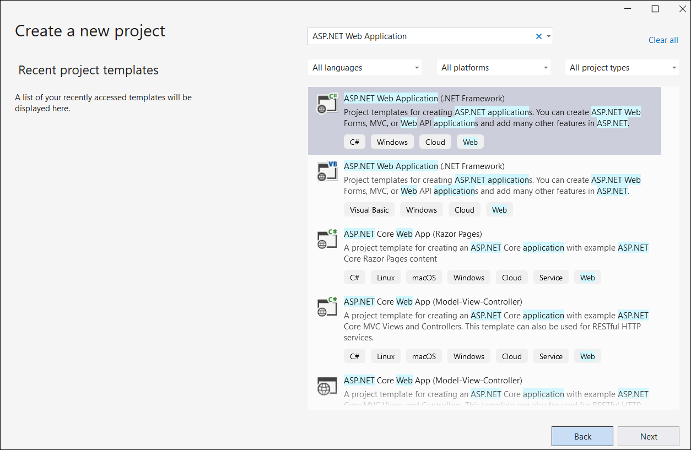
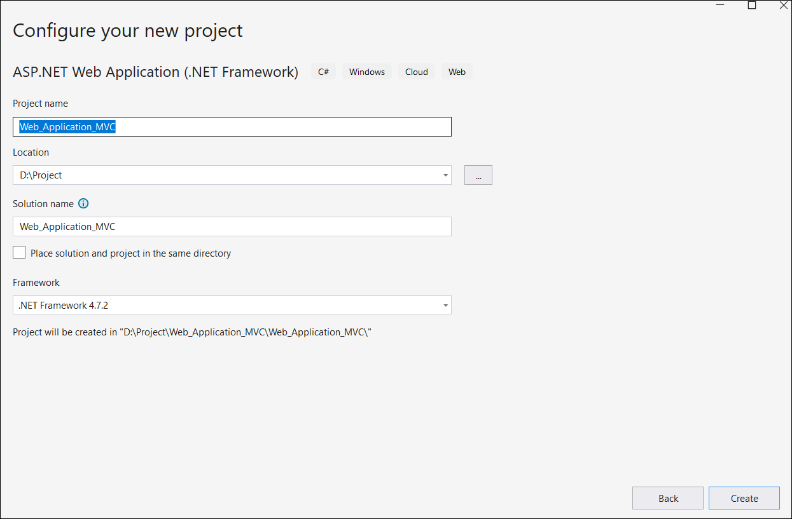
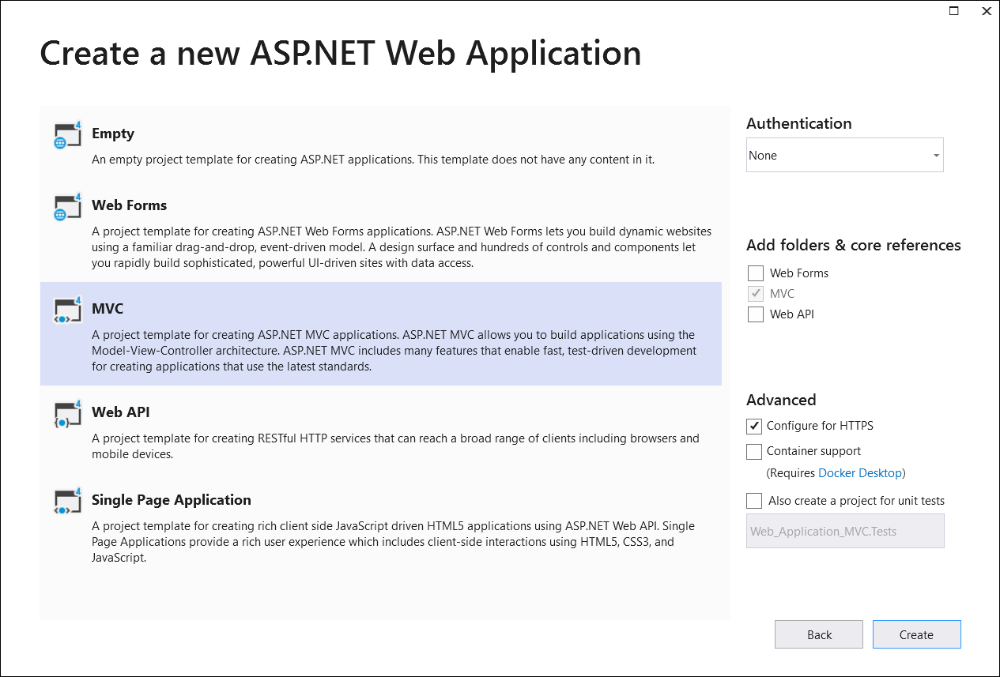
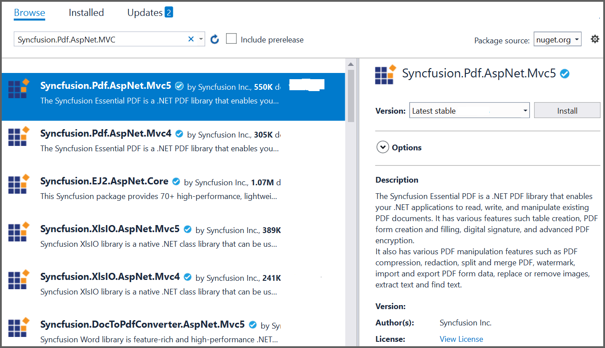
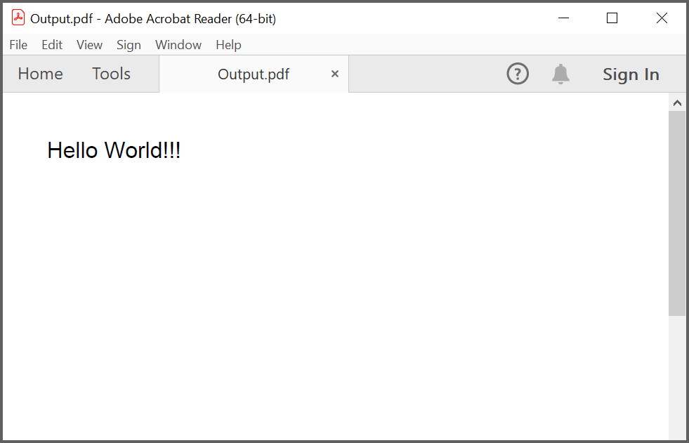

# Create or Generate PDF file in ASP.NET MVC

The [.NET PDF library](https://www.syncfusion.com/document-sdk/net-pdf-library) is used to create, read, and edit PDF documents. This library also offers functionality to merge, split, stamp, work with forms, and secure PDF files.

To include the .NET PDF library into your ASP.NET MVC application, refer to the [NuGet Package Required](https://help.syncfusion.com/document-processing/pdf/pdf-library/net/nuget-packages-required) or [Assemblies Required](https://help.syncfusion.com/document-processing/pdf/pdf-library/net/assemblies-required) documentation.

## Prerequisites

* Visual Studio 2017 or later.
* .NET Framework 4.6.2 or later.

## Steps to create PDF document in ASP.NET MVC

Step 1: Create a new C# **ASP.NET Web Application (.NET Framework)** project.

Step 2: In the project configuration window, name your project and click **Create**.

Step 3: In the template selection window, choose **MVC** and click **Create**.

Step 4: Install the [Syncfusion.Pdf.AspNet.Mvc5](https://www.nuget.org/packages/Syncfusion.Pdf.AspNet.Mvc5/) NuGet package as a reference to your ASP.NET MVC applications from [NuGet.org](https://www.nuget.org/).

Step 5: Register the Syncfusion&reg; license key. A trial watermark is added to every page of the generated PDF until a valid key is registered. Include the license key in the **Global.asax.cs** file before creating any Syncfusion&reg; component:




using Syncfusion.Licensing;

protected void Application_Start()
{
    // Register the Syncfusion license
    SyncfusionLicenseProvider.RegisterLicense("YOUR LICENSE KEY");
}




Replace `"YOUR LICENSE KEY"` with the license key associated with your Syncfusion&reg; account. If you do not have a license key, you can request a free 30-day trial or apply for a Community License from the Syncfusion&reg; website. For more information about registering a license key in your application, refer to the [Syncfusion&reg; Licensing Documentation](https://help.syncfusion.com/common/essential-studio/licensing/overview).

Step 6: A default controller named `HomeController.cs` is added on creation of the ASP.NET MVC project. Include the following namespaces in that `HomeController.cs` file.




using Syncfusion.Pdf;
using Syncfusion.Pdf.Graphics;
using System.Drawing;
using System.Web.Mvc;




Step 7: A default action method named `Index` is present in `HomeController.cs`. Right-click this `Index` method and select **Go To View** to open the associated view page `Index.cshtml`. Add a new button in `Index.cshtml` as follows.




@{Html.BeginForm("CreatePDFDocument", "Home", FormMethod.Get);
    {
        

            <input type="submit" value="Generate PDF Document" style="width:150px;height:27px" />
        

    }
    Html.EndForm();
}




Step 8: Add a new action method named `CreatePDFDocument` in `HomeController.cs` and include the code example below to generate a PDF document using the [PdfDocument](https://help.syncfusion.com/cr/document-processing/Syncfusion.Pdf.PdfDocument.html) class. Then use the [DrawString](https://help.syncfusion.com/cr/document-processing/Syncfusion.Pdf.Graphics.PdfGraphics.html#Syncfusion_Pdf_Graphics_PdfGraphics_DrawString_System_String_Syncfusion_Pdf_Graphics_PdfFont_Syncfusion_Pdf_Graphics_PdfBrush_System_Drawing_PointF_) method of the [PdfGraphics](https://help.syncfusion.com/cr/document-processing/Syncfusion.Pdf.Graphics.PdfGraphics.html) object to draw text on the PDF page and download the output PDF from the ASP.NET MVC application.




public ActionResult CreatePDFDocument()
{
    //Create an instance of PdfDocument.
    using (PdfDocument document = new PdfDocument())
    {
        //Add a page to the document.
        PdfPage page = document.Pages.Add();
        //Create PDF graphics for the page.
        PdfGraphics graphics = page.Graphics;
        //Set the standard font.
        PdfFont font = new PdfStandardFont(PdfFontFamily.Helvetica, 20);
        //Draw the text.
        graphics.DrawString("Hello World!!!", font, PdfBrushes.Black, new PointF(0, 0));
        //Open the document in the browser after saving it.
        //HttpReadType.Save prompts the browser to save the file; use HttpReadType.Open to open it inline.
        document.Save("Output.pdf", HttpContext.ApplicationInstance.Response, HttpReadType.Save);
    }
    return View();
}




Step 9: Build the project by clicking **Build > Build Solution** or pressing <kbd>Ctrl</kbd>+<kbd>Shift</kbd>+<kbd>B</kbd>.

Step 10: Run the project by pressing <kbd>F5</kbd>. Visual Studio launches the app in IIS Express.

Step 11: Open the app in a browser, then click the **Generate PDF Document** button on the home page. The browser downloads `Output.pdf` containing the text "Hello World!!!".

By executing the program, you will get the PDF document as follows.

You can download a complete working sample from [GitHub](https://github.com/SyncfusionExamples/PDF-Examples/tree/master/Getting%20Started/ASP.NET%20MVC/Creating-a-new-PDF-document).

Click [here](https://www.syncfusion.com/document-sdk/net-pdf-library) to explore the rich set of Syncfusion&reg; PDF library features.

An online sample link to [create PDF document](https://document.syncfusion.com/demos/pdf/default#/tailwind).

## Next steps

* [Open and read an existing PDF document](Open-PDF-file.md)
* [Save the generated PDF to a file or stream](Save-PDF-file.md)
* [Work with PDF pages, fonts, and images](Working-with-Pages.md)
* [Add headers, footers, and form fields](Working-with-Headers-and-Footers.md)